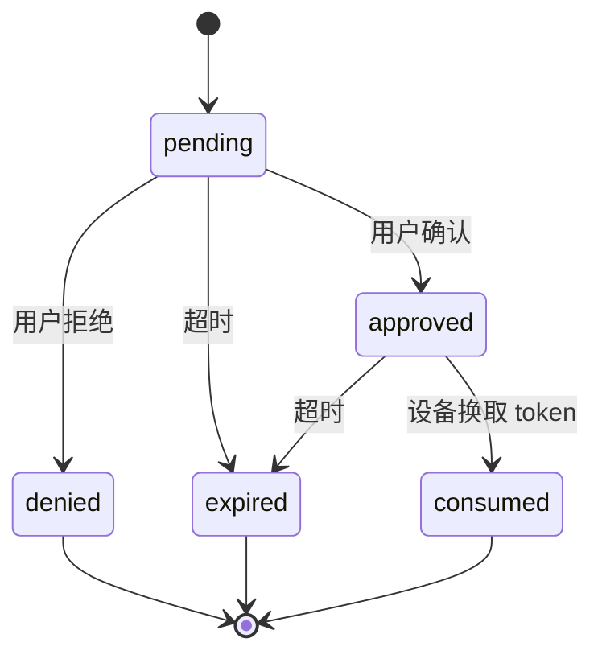
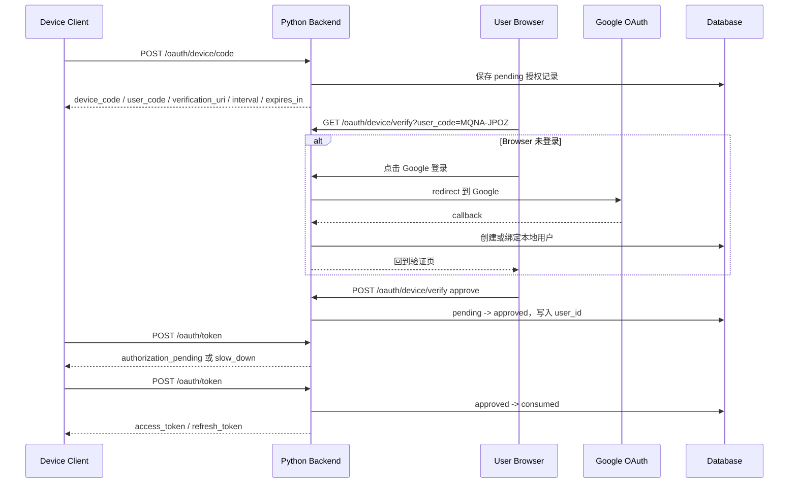
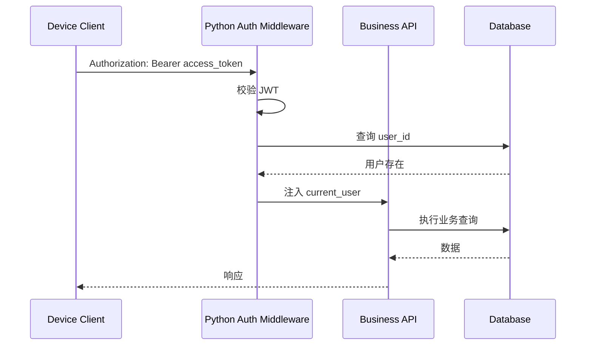

# Device Flow 认证方案

> 本文定义 Ink & Memory 的 OAuth 2.0 Device Authorization Grant（RFC 8628）实施方案。Device Flow 面向 CLI、Desktop、Agent、MCP Client 等非浏览器或弱输入设备；普通网页端登录继续使用 Google OAuth / OIDC。

## 1. Device Flow 是什么

Device Flow 允许设备端先请求 `device_code`、`user_code` 和 `verification_uri`，再让用户在另一台可用浏览器的设备上登录并确认授权。设备端随后轮询 token endpoint，直到授权完成、被拒绝或过期。

在本项目中：

| 概念 | 当前项目解释 |
| --- | --- |
| Authorization Server | Python FastAPI 后端 |
| Device Client | CLI / Desktop / Agent / MCP Client |
| Verification UI | Vite 前端的 `/oauth/device/verify` 页面 |
| User Login | 现有邮箱密码登录或 Google OAuth |
| Final Token | Python 后端签发的本系统 `access_token` / `refresh_token` |

## 2. 为什么当前项目需要 Device Flow

| 客户端 | 痛点 | Device Flow 价值 |
| --- | --- | --- |
| CLI | 不适合嵌入网页登录和 callback listener | 显示短码，用户用浏览器确认 |
| Desktop | callback 端口和系统浏览器唤起不稳定 | 不要求本地监听 callback |
| Agent | Agent 运行环境可能无浏览器 | 让用户在主浏览器完成授权 |
| MCP Client | MCP 工具端可能只有终端交互 | 设备端只轮询 token endpoint |
| 无浏览器设备 | 输入能力弱 | `user_code` 短、可读、可过期 |

## 3. 适用与不适用场景

| 场景 | 是否适用 | 说明 |
| --- | --- | --- |
| Vite 普通网页登录 | 否 | 直接走 Google OAuth / OIDC，更短链路 |
| CLI 登录 | 是 | `ink login` 可打印 `verification_uri` 和 `user_code` |
| Desktop 登录 | 是 | 无需内置浏览器或 loopback callback |
| Agent / MCP Client 登录 | 是 | 适合弱输入、跨进程认证 |
| 服务端到服务端调用 | 暂不适用 | 二期可设计 client credentials 或 PAT |

## 4. API 路由设计

| Method | Path | 认证 | 说明 |
| --- | --- | --- | --- |
| `POST` | `/oauth/device/code` | public client 或轻量 `client_id` | 设备请求 `device_code`、`user_code`、`verification_uri` |
| `GET` | `/oauth/device/verify` | Web 登录态可选 | 展示 user_code 确认页；未登录时引导登录 |
| `POST` | `/oauth/device/verify` | Web 登录态必需 | 用户确认或拒绝某个 `user_code` |
| `POST` | `/oauth/token` | device client | 支持 `grant_type=urn:ietf:params:oauth:grant-type:device_code` |

相关配置：

| 变量 | 默认值 | 说明 |
| --- | --- | --- |
| `WEBUI_URL` | `http://localhost:5173` | 生成 `verification_uri` |
| `OAUTH_DEVICE_ALLOWED_CLIENT_IDS` | 空 | 空表示允许任意非空 public `client_id`，生产可配置 allowlist |
| `DEVICE_CODE_EXPIRES_IN` | `600` | `device_code` / `user_code` 有效期秒数 |
| `DEVICE_CODE_INTERVAL` | `5` | 设备轮询初始最小间隔秒数 |

设备请求示例：

```http
POST /oauth/device/code
Content-Type: application/json

{
  "client_id": "ink-cli",
  "scope": "openid profile offline_access"
}
```

响应示例：

```json
{
  "device_code": "opaque-device-code",
  "user_code": "MQNA-JPOZ",
  "verification_uri": "http://localhost:5173/oauth/device/verify",
  "verification_uri_complete": "http://localhost:5173/oauth/device/verify?user_code=MQNA-JPOZ",
  "expires_in": 600,
  "interval": 5
}
```

Token 轮询示例：

```http
POST /oauth/token
Content-Type: application/x-www-form-urlencoded

grant_type=urn:ietf:params:oauth:grant-type:device_code&device_code=opaque-device-code&client_id=ink-cli
```

## 5. 数据表设计

当前项目已有 `users` 表，不新增第二套用户表。Device Flow 增量表：

```sql
CREATE TABLE IF NOT EXISTS device_authorizations (
  id INTEGER PRIMARY KEY AUTOINCREMENT,
  client_id TEXT NOT NULL,
  device_code_hash TEXT UNIQUE NOT NULL,
  user_code_hash TEXT UNIQUE NOT NULL,
  user_id INTEGER,
  scope TEXT,
  status TEXT NOT NULL,
  interval_seconds INTEGER NOT NULL,
  last_poll_at DATETIME,
  expires_at DATETIME NOT NULL,
  approved_at DATETIME,
  consumed_at DATETIME,
  created_at DATETIME DEFAULT CURRENT_TIMESTAMP,
  updated_at DATETIME DEFAULT CURRENT_TIMESTAMP,
  FOREIGN KEY (user_id) REFERENCES users (id) ON DELETE CASCADE
);
```

索引：

| Index | 字段 | 用途 |
| --- | --- | --- |
| `idx_device_authorizations_device_code_hash` | `device_code_hash` | 轮询查找 |
| `idx_device_authorizations_user_code_hash` | `user_code_hash` | 浏览器确认查找 |
| `idx_device_authorizations_status_expires` | `status, expires_at` | 清理过期授权 |

## 6. 状态流转

| 状态 | 进入条件 | 可转出状态 |
| --- | --- | --- |
| `pending` | 设备成功请求 code | `approved`、`denied`、`expired` |
| `approved` | 已登录用户确认授权 | `consumed`、`expired` |
| `denied` | 用户拒绝授权 | 终态 |
| `expired` | 当前时间超过 `expires_at` | 终态 |
| `consumed` | token endpoint 成功换取 token | 终态 |



## 7. 轮询规则

| 规则 | 行为 |
| --- | --- |
| 未确认 | 返回 `authorization_pending` |
| 轮询过快 | 返回 `slow_down`，并把建议 interval 增加 5 秒或记录当前请求 |
| 已过期 | 状态更新为 `expired`，返回 `expired_token` |
| 已拒绝 | 返回 `access_denied` |
| 已批准 | 返回本系统 `access_token` / `refresh_token`，并把状态改为 `consumed` |
| 已消费后重试 | 返回 `invalid_grant` |

## 8. 错误码

| error | HTTP | 触发条件 |
| --- | --- | --- |
| `authorization_pending` | 400 | 用户还未确认 |
| `slow_down` | 400 | 设备端低于 `interval` 轮询 |
| `expired_token` | 400 | code 过期 |
| `access_denied` | 400 | 用户拒绝 |
| `invalid_grant` | 400 | device_code 不存在、已消费、状态非法 |
| `invalid_client` | 401 | client_id 缺失或不被允许 |

统一错误结构：

```json
{
  "error": "authorization_pending",
  "error_description": "Authorization has not completed yet."
}
```

## 9. 安全策略

1. `device_code` 只给设备端使用，数据库只保存 hash。
2. `user_code` 给用户输入或确认，短、可读、有限有效期，数据库只保存 hash。
3. `verification_uri` 给用户浏览器访问，可以带 `user_code` 作为便利参数。
4. 设备端不接触 `GOOGLE_CLIENT_SECRET`。
5. Device Flow 的最终 token 是本系统 token，不是 Google token。
6. Google OAuth 只发生在用户浏览器确认授权阶段。
7. 轮询必须限制 `interval`，过快返回 `slow_down`。
8. code 成功换 token 后必须 `consumed`，不可重复使用。
9. refresh token 只保存 hash，泄漏数据库也不能直接换 token。
10. 清理任务应定期将超时 pending/approved 记录标记为 `expired` 或删除。

## 10. Token 策略

| Token | 颁发对象 | 存储 | 用途 |
| --- | --- | --- | --- |
| `access_token` | Device Client | 客户端自行保存 | 调业务 API，短有效期 |
| `refresh_token` | Device Client | 客户端保存明文，DB 保存 hash | 换新 access token |
| Google token | 仅后端可见 | 如需要保存则加密 | 证明用户身份或后续 Google API，一期可不持久化 |

`access_token` payload 至少包含：

```json
{
  "sub": "123",
  "email": "user@example.com",
  "typ": "access",
  "exp": 1710000000,
  "iat": 1709999100
}
```

## 11. 与 Google OAuth 的关系

Device Flow 不是新的用户体系。它只是让非浏览器设备获得本系统 token 的授权方式：

1. 设备请求 code 时不登录 Google。
2. 用户打开验证页后，如果浏览器未登录本系统，则进入现有邮箱密码登录或 Google OAuth。
3. Google OAuth callback 后，Python 后端创建/绑定本地用户并建立 Web 登录态。
4. 用户确认 `user_code` 后，设备轮询拿到 Python 后端签发的本系统 token。

## 12. Mermaid 时序图



业务 API 鉴权：



## 13. Authlib 接入点

Authlib 的 RFC 8628 支持要求实现两个扩展点：

| Authlib 类型 | 当前项目职责 |
| --- | --- |
| `DeviceAuthorizationEndpoint` | 生成 `device_code` / `user_code` / `verification_uri`，保存到 `device_authorizations` |
| `DeviceCodeGrant` | 在 `/oauth/token` 处理 device_code grant，查询设备授权状态，执行 slow_down / pending / token 签发 |

Authlib 当前没有直接可用的 FastAPI authorization-server 集成；本项目在现有 FastAPI 路由内显式继承 RFC8628 核心类，并以 SQLite helper 实现 Authlib 所需查询与保存方法。

## 14. 测试清单

| 用例 | 预期 |
| --- | --- |
| 设备请求 code | 返回 `device_code`、`user_code`、`verification_uri`、`interval`、`expires_in` |
| 用户打开 verification_uri | 展示 user_code 和确认/拒绝按钮 |
| 未登录用户确认 | 被要求先登录 |
| 设备未授权轮询 | 返回 `authorization_pending` |
| 设备过快轮询 | 返回 `slow_down` |
| 用户确认后轮询 | 返回本系统 `access_token` / `refresh_token` |
| 用户拒绝后轮询 | 返回 `access_denied` |
| 过期后轮询 | 返回 `expired_token` |
| 成功消费后再次轮询 | 返回 `invalid_grant` |
| 设备 token 调业务 API | `get_current_user` 能识别 `user_id` |
