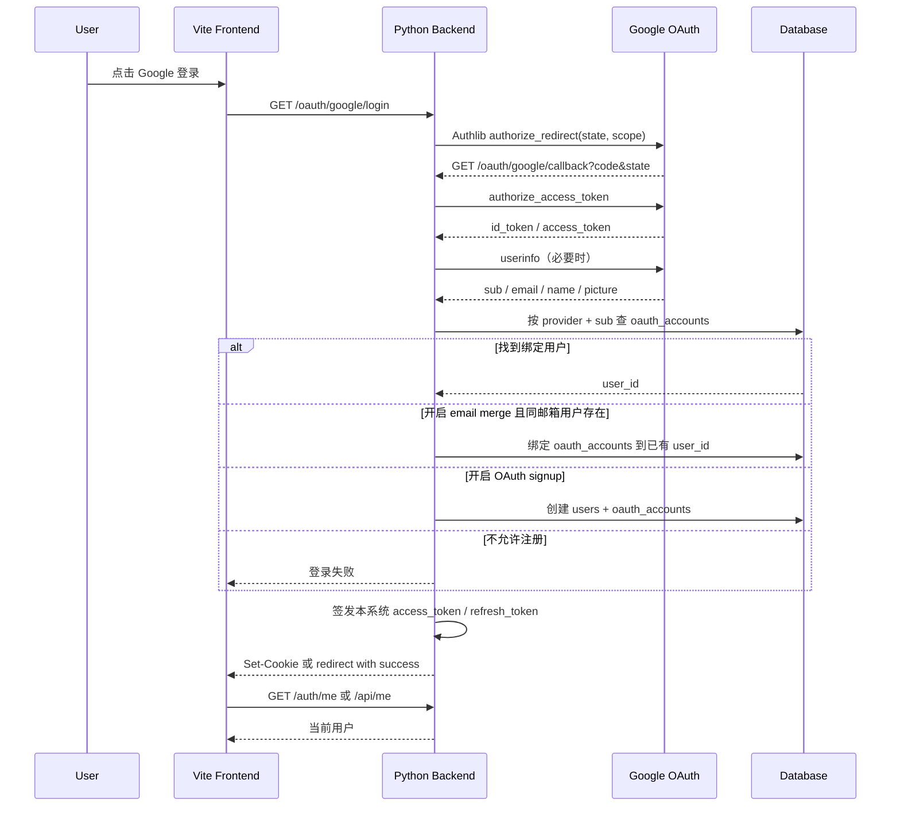
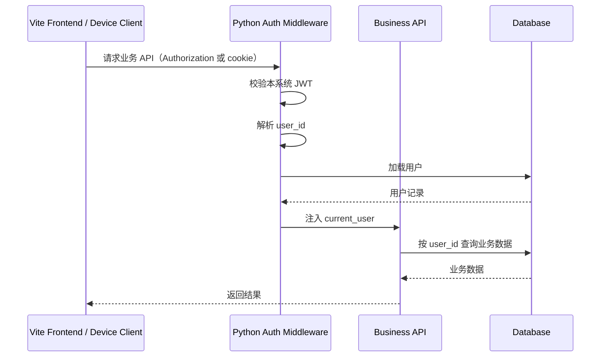
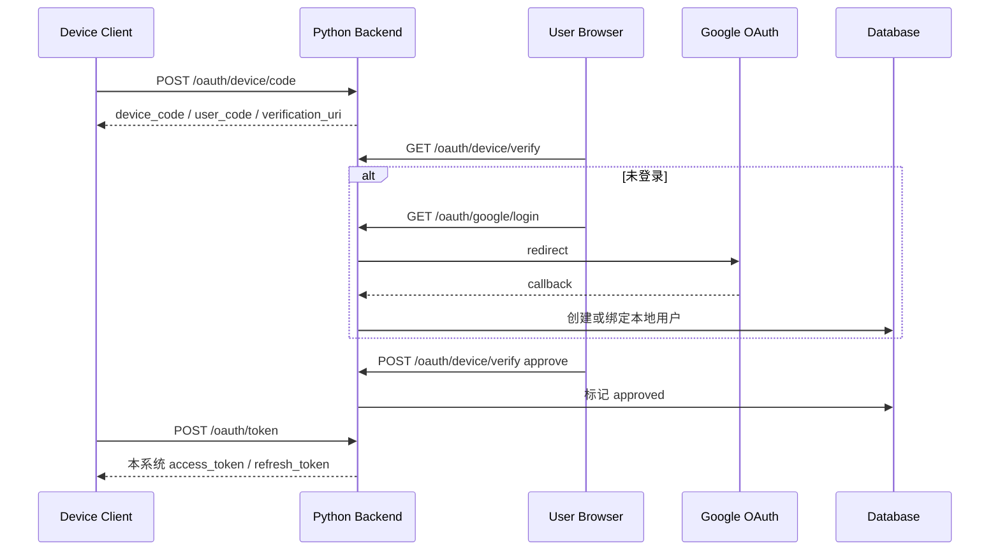

# Google OAuth / OIDC 认证方案

> 本文定义 Ink & Memory 的 Google OAuth / OIDC 实施方案。架构方向是“Python 后端作为认证中心，Authlib 负责 OAuth/OIDC 协议能力，Vite 只作为前端入口”。Google token 不等于本系统业务 token；业务 API 只识别 Python 后端签发的本系统 access token / refresh token。

## 1. 目标

| 目标 | 说明 |
| --- | --- |
| 网页端 Google 登录 | Vite 登录页提供 Google 登录按钮，跳转后端 `/oauth/google/login` |
| 后端接管 OAuth callback | FastAPI 使用 Authlib 完成 state 校验、code 换 token、userinfo 解析 |
| 复用现有用户体系 | 继续使用当前 `users` 表，不迁移 Better Auth，不创建 Next.js 认证中心 |
| 签发本系统 token | 登录成功后签发本系统 access token / refresh token |
| 业务 API 统一鉴权 | 所有业务路由继续通过 `get_current_user` 获取 `user_id` |
| 支持 Device Flow | 非浏览器设备通过 `/oauth/device/code` + `/oauth/token` 获得同类系统 token |

## 2. 为什么采用 Python + Authlib

当前项目已经是 Vite + FastAPI 前后端分离：

| 现状 | 影响 |
| --- | --- |
| `backend/routers/auth.py` 已有 `/api/login`、`/api/register`、`/api/me` | Python 已经是认证中心 |
| `backend/auth.py` 已有 PyJWT 和 bcrypt | 可增量扩展，不需要引入第二套用户体系 |
| 业务路由普遍依赖 `Depends(get_current_user)` | 只要统一 token 校验，业务层无需知道登录方式 |
| `database.py` 使用 SQLite 裸 SQL | OAuth 账号绑定表应增量加入，而不是套用外部 ORM |

Authlib 负责协议细节：Google OIDC discovery、authorization redirect、OAuth state、callback token exchange、userinfo。项目代码负责本地用户绑定、token 签发、cookie/header 策略和业务权限。

## 3. 与 Better Auth / Next.js Auth 的取舍

| 方案 | 优点 | 问题 | 当前结论 |
| --- | --- | --- | --- |
| Python + Authlib | 贴合当前 FastAPI 业务；一个用户体系；业务 API 不需要迁移 | 需要自己维护 OAuth 表、refresh token、Device Flow | 采用 |
| Better Auth / Next.js Auth | 前端生态成熟，适合 Next.js 全栈 | 会让 Python 和 Next.js 分别维护认证边界，当前 Vite 项目迁移成本高 | 不采用 |
| 前端直接拿 Google token | 实现看似简单 | 泄漏 Google token，业务 API 无法统一权限，无法支持 Device Flow | 禁止 |

## 4. Open WebUI 参考结论

本项目参考 Open WebUI 的架构思想，不照搬代码：

| Open WebUI 做法 | 当前项目采用方式 |
| --- | --- |
| 前端按钮跳 `/oauth/google/login` | 采用 |
| Python Authlib client 注册 Google | 采用 |
| `authorize_redirect` / `authorize_access_token` | 采用 |
| userinfo 不完整时调用 userinfo endpoint | 采用 |
| provider sub 优先绑定，email merge 可配置 | 采用 |
| `ENABLE_OAUTH_SIGNUP` 控制 OAuth 新用户注册 | 采用 |
| 登录成功签发自己的 JWT | 采用 |
| SQLAlchemy 用户模型和 OAuth session 表 | 不照搬，改成 SQLite helper |
| 大型多 provider / group / role 管理 | 一期不引入 |
| Svelte 登录页和 cookie 读取方式 | 不照搬，改造现有 React AuthContext |

## 5. Google OAuth 数据流



## 6. API 路由设计

| Method | Path | 认证 | 说明 |
| --- | --- | --- | --- |
| `GET` | `/oauth/google/login` | public | 发起 Google OAuth，后端生成 state 并 redirect |
| `GET` | `/oauth/google/callback` | Google callback | 后端换 token、解析 userinfo、绑定本地用户、签发系统 token |
| `POST` | `/auth/logout` | 当前登录态 | 删除 cookie，撤销 refresh token；兼容现有前端清 localStorage |
| `GET` | `/auth/me` | access token | 返回当前用户；兼容别名 `/api/me` |
| `POST` | `/oauth/token` | device / refresh | 支持 Device Code grant 和 refresh token grant |

兼容策略：

| 现有接口 | 保留方式 |
| --- | --- |
| `POST /api/login` | 继续用于邮箱密码登录 |
| `POST /api/register` | 继续用于邮箱密码注册 |
| `GET /api/me` | 保留；`/auth/me` 可作为新别名 |

## 7. 环境变量设计

```env
WEBUI_URL=http://localhost:5173
API_BASE_URL=http://localhost:8765

GOOGLE_CLIENT_ID=
GOOGLE_CLIENT_SECRET=
GOOGLE_OPENID_CONFIG_URL=https://accounts.google.com/.well-known/openid-configuration
GOOGLE_OAUTH_SCOPE=openid email profile
GOOGLE_OAUTH_PROMPT=select_account

ENABLE_OAUTH_SIGNUP=true
OAUTH_MERGE_ACCOUNTS_BY_EMAIL=true
OAUTH_ALLOWED_DOMAINS=

JWT_SECRET=
# legacy fallback: JWT_SECRET_KEY=
JWT_EXPIRES_IN=15m
REFRESH_TOKEN_EXPIRES_IN=30d
SESSION_SECRET_KEY=
COOKIE_SECURE=false
COOKIE_SAMESITE=lax
INK_CORS_ALLOW_CREDENTIALS=true

OAUTH_DEVICE_ALLOWED_CLIENT_IDS=
DEVICE_CODE_EXPIRES_IN=600
DEVICE_CODE_INTERVAL=5
```

实现补充：

| 变量 | 默认值 | 说明 |
| --- | --- | --- |
| `COOKIE_HTTPONLY` | `true` | Web auth cookie 在代码中固定为 HttpOnly |
| `OAUTH_TOKEN_ENCRYPTION_KEY` | 空 | 当前 Google token 不落库；后续保存 Google token 时必须配置 |
| `SESSION_SECRET_KEY` | `JWT_SECRET` fallback | OAuth state 使用 Starlette session cookie 签名 |
| `INK_CORS_ALLOW_CREDENTIALS` | `false` | 跨域 cookie 登录时需显式开启 |
| `OAUTH_DEVICE_ALLOWED_CLIENT_IDS` | 空 | 空表示允许任意非空 public `client_id`；生产可配置 allowlist |
| `DEVICE_CODE_EXPIRES_IN` | `600` | Device Flow code 有效期 |
| `DEVICE_CODE_INTERVAL` | `5` | 设备轮询最小间隔 |

## 8. 数据表设计

当前已有 `users`：

```txt
id
email
password_hash
display_name
created_at
```

不重复创建 `users`，只增量建表：

### oauth_accounts

当前实现只保存 provider 绑定关系和过期时间；Google token 不落库。`*_encrypted` 字段为后续需要调用 Google API 时的加密存储预留。

```sql
CREATE TABLE IF NOT EXISTS oauth_accounts (
  id INTEGER PRIMARY KEY AUTOINCREMENT,
  user_id INTEGER NOT NULL,
  provider TEXT NOT NULL,
  provider_sub TEXT NOT NULL,
  email TEXT NOT NULL,
  access_token_encrypted TEXT,
  refresh_token_encrypted TEXT,
  id_token_encrypted TEXT,
  expires_at DATETIME,
  created_at DATETIME DEFAULT CURRENT_TIMESTAMP,
  updated_at DATETIME DEFAULT CURRENT_TIMESTAMP,
  UNIQUE(provider, provider_sub),
  FOREIGN KEY (user_id) REFERENCES users (id) ON DELETE CASCADE
);
```

### refresh_tokens

```sql
CREATE TABLE IF NOT EXISTS refresh_tokens (
  id INTEGER PRIMARY KEY AUTOINCREMENT,
  user_id INTEGER NOT NULL,
  token_hash TEXT UNIQUE NOT NULL,
  expires_at DATETIME NOT NULL,
  revoked_at DATETIME,
  created_at DATETIME DEFAULT CURRENT_TIMESTAMP,
  FOREIGN KEY (user_id) REFERENCES users (id) ON DELETE CASCADE
);
```

### device_authorizations

详见 `docs/architecture/auth-device.md`。该表保存 `device_code_hash`、`user_code_hash`、状态、轮询间隔、过期时间和确认用户。

## 9. 用户绑定策略

| 顺序 | 条件 | 行为 |
| --- | --- | --- |
| 1 | `oauth_accounts(provider='google', provider_sub=sub)` 存在 | 直接登录绑定用户 |
| 2 | 未绑定，`OAUTH_MERGE_ACCOUNTS_BY_EMAIL=true` 且 `users.email=email` 存在 | 给已有用户新增 Google 绑定 |
| 3 | 未绑定，`ENABLE_OAUTH_SIGNUP=true` | 创建本地用户和 Google 绑定 |
| 4 | 未绑定且不允许 signup | 返回 403，不创建用户 |

约束：

1. `email` 必须来自 Google userinfo，并统一小写。
2. 如配置 `OAUTH_ALLOWED_DOMAINS`，仅允许域名匹配的邮箱登录。
3. 本地密码用户和 Google 用户共享同一 `users.id`。
4. Google `sub` 是稳定外部身份主键，不能用 email 代替。

## 10. 登录成功后的 token 策略

| Token | 来源 | 用途 | 存储 |
| --- | --- | --- | --- |
| Google `id_token` | Google | 证明 Google 身份 | 当前不落库；不提供给业务 API |
| Google `access_token` | Google | 后续调用 Google API | 当前不落库；不提供给前端 |
| 本系统 `access_token` | Python 后端 | 调业务 API | Web 可 cookie 或前端内存；设备端 JSON |
| 本系统 `refresh_token` | Python 后端 | 换新 access token | 明文只给客户端一次，DB 只保存 hash |

JWT payload：

```json
{
  "sub": "123",
  "email": "user@example.com",
  "typ": "access",
  "exp": 1710000000,
  "iat": 1709999100
}
```

## 11. 安全边界

1. 不把 `GOOGLE_CLIENT_SECRET` 暴露给前端。
2. 不把 Google `access_token` 当作本系统业务 token。
3. OAuth callback 必须校验 state，交给 Authlib 维护。
4. JWT 必须设置 `exp`，生产环境使用强 `JWT_SECRET`。
5. refresh token 必须只存 hash，支持撤销。
6. Google token 如保存必须加密。
7. 生产环境 cookie 必须 `Secure` + `HttpOnly` + 合理 `SameSite`。
8. CORS 只允许可信前端域名，跨域 cookie 时显式启用 credentials。
9. 认证失败返回统一错误结构，不泄漏 provider token、sub、内部 SQL。
10. 业务 API 不读取 Google token，只读取本系统 token。

## 12. 错误处理

| 场景 | HTTP | 错误 |
| --- | --- | --- |
| Google callback state/code 无效 | 400 | `invalid_oauth_callback` |
| Google userinfo 缺 email/sub | 400 | `invalid_oauth_userinfo` |
| 邮箱域名不允许 | 403 | `oauth_domain_not_allowed` |
| 新用户但禁用 OAuth signup | 403 | `oauth_signup_disabled` |
| 同邮箱合并关闭且邮箱已存在 | 409 | `email_already_exists` |
| JWT 无效或过期 | 401 | `invalid_or_expired_token` |
| refresh token 被撤销 | 401 | `invalid_refresh_token` |

统一响应：

```json
{
  "error": "oauth_signup_disabled",
  "detail": "OAuth signup is disabled."
}
```

## 13. 测试清单

| 用例 | 预期 |
| --- | --- |
| 前端点击 Google 登录 | 跳转 `/oauth/google/login`，后端 redirect 到 Google |
| Google callback 新用户且 signup 开启 | 创建 `users` + `oauth_accounts`，签发系统 token |
| Google callback 新用户且 signup 禁用 | 返回 403 |
| `OAUTH_MERGE_ACCOUNTS_BY_EMAIL=true` | 同邮箱本地用户绑定 Google |
| `OAUTH_MERGE_ACCOUNTS_BY_EMAIL=false` 且邮箱存在 | 返回 409 |
| 登录成功后 `/auth/me` | 返回当前用户 |
| 登录成功后业务 API | `get_current_user` 能解析 `user_id` |
| logout | cookie 删除，refresh token 撤销 |
| Google token 保存 | 当前不保存；如后续启用，数据库中必须为 encrypted，不出现明文 secret |

## 14. 业务 API 鉴权时序图



## 15. 与 Device Flow 的衔接

Device Flow 复用相同用户体系和 token 签发器：



---
