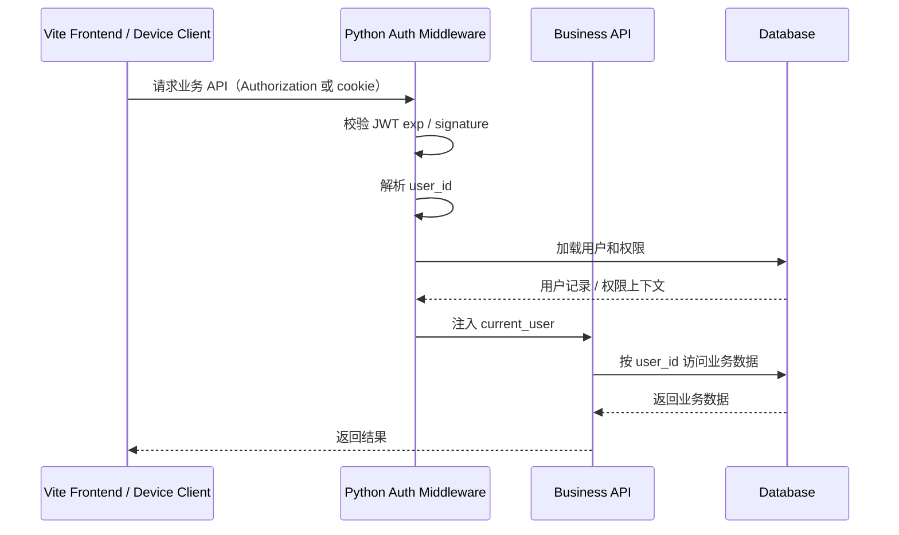
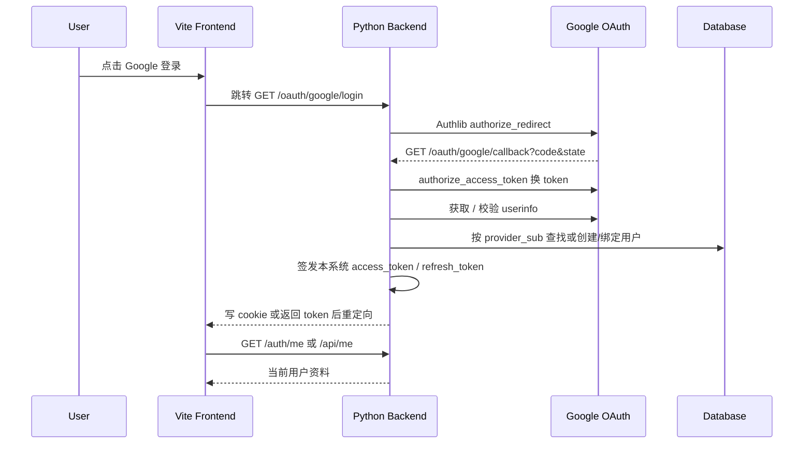
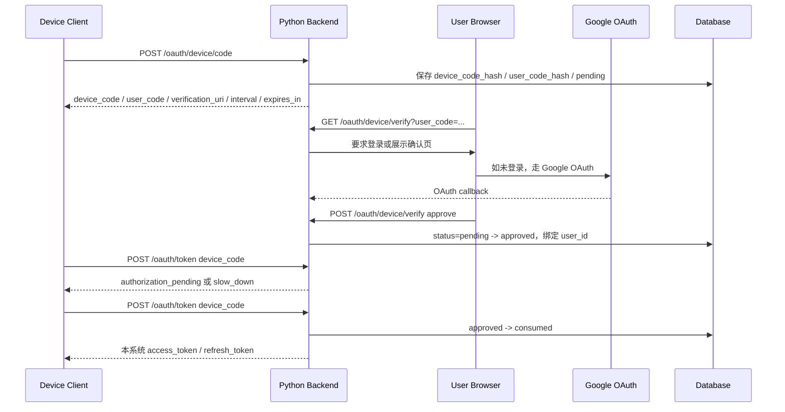

# 架构设计

> 本文记录 Ink & Memory 当前 Vite + FastAPI 架构，以及 Google OAuth / OIDC 与 OAuth 2.0 Device Authorization Grant 的接入边界。认证中心保持在 Python 后端；Vite 前端只负责页面入口和交互，不维护第二套用户体系。

### 公共模块

| 模块 | 位置 | 职责 | 认证关系 |
| --- | --- | --- | --- |
| 前端运行时配置 | `frontend/src/lib/apiBase.ts` | 解析 REST/SSE/WebSocket base URL | 登录按钮和认证 API 使用同一 API base |
| 前端认证上下文 | `frontend/src/contexts/AuthContext.tsx` | 保存登录态、加载 `/api/me`、登出 | 继续承接本系统 JWT，不接触 Google secret |
| 后端入口 | `backend/server.py` | FastAPI app、CORS、router 注册、健康检查 | 挂载 auth / oauth / device flow 路由 |
| 后端认证工具 | `backend/auth.py` | 密码哈希、JWT 签发与校验 | 支持 access token、refresh token 与 token hash |
| 路由依赖 | `backend/routers/deps.py` | `get_current_user` 等共享依赖 | 业务 API 统一从 JWT 解析 `user_id` |
| 数据层 | `backend/database.py` | SQLite 表结构与裸 SQL helper | 增量创建 OAuth 账号、refresh token、device 授权表 |

---

### 基础业务模块说明

> 当前业务域以“React view / component + FastAPI router + SQLite helper”组成闭环。认证模块只提供 `user_id` / `auth_user_id` 识别能力，不侵入业务表语义。

| 业务域 | 页面（UI） | API（后端） | 领域/存储 | 鉴权方式 |
| --- | --- | --- | --- | --- |
| 写作会话 | `frontend/src/App.tsx`、`engine/EditorEngine.ts` | `backend/routers/sessions.py` | `user_sessions` | `Depends(get_current_user)` 读取 JWT `sub` |
| Deck / Voice | `DeckManager.tsx`、`voiceApi.ts` | `routers/voices.py` | `decks`、`voices` | 用户只能访问自己 owner_id 资源 |
| Claude Agent / Chat | `components/chat/*` | `routers/claude_agent.py` | `chat_thread`、`chat_message`、workspace files | Bearer token 透传到 SSE/REST |
| Timeline 图片 | `CalendarPopup.tsx`、timeline view | `routers/pictures.py` | `daily_pictures` | 按 `user_id` 分区 |
| Reflections | `AnalysisView.tsx` | `routers/reflections.py` | `analysis_reports`、`reflections_section_configs` | 按 `user_id` 分区 |
| Friends | `FriendsView.tsx` | `routers/friends.py` | `friendships`、`friend_invites` | 请求者身份来自 JWT |
| 文件存储 | `AIInputDock.tsx`、file sidebar | `routers/storage.py`、`routers/workspace.py` | local/S3 object key | 资源路径由当前用户和 workspace scope 约束 |
| 系统配置 | `ModelConfigSection.tsx`、`WorkspaceContext.tsx` | `routers/system_config.py` | `user_preferences.system_config_json` | 用户级配置 |
| 认证 | `components/Auth/*`、Device Verify 页面 | `routers/auth.py`、`routers/oauth.py`、`routers/device_oauth.py` | `users`、`oauth_accounts`、`refresh_tokens`、`device_authorizations` | Python 后端签发本系统 token |

---

### 认证中间件模块

当前已实现链路：

| 步骤 | 文件 | 行为 |
| --- | --- | --- |
| 登录 / 注册 | `backend/routers/auth.py` | 邮箱密码登录，成功后调用 `auth.create_access_token` |
| JWT 签发 | `backend/auth.py` | 使用 PyJWT HS256，payload 包含 `sub`、`email`、`exp`、`iat` |
| 请求鉴权 | `backend/routers/deps.py` | `HTTPBearer(auto_error=False)` 提取 Bearer token，校验失败返回 401 |
| 前端保存 | `frontend/src/contexts/AuthContext.tsx` | 保存 `auth_token` 到 localStorage，并调用 `/api/me` 验证 |

已接入扩展：

| 能力 | 说明 |
| --- | --- |
| Google OAuth / OIDC | Vite 显示 Google 登录按钮，浏览器跳转后端 `/oauth/google/login`；后端使用 Authlib 完成 state、callback、token exchange、userinfo。 |
| 本系统 token | Google `id_token` / `access_token` 只证明 Google 身份，不作为业务 API token；业务 API 只识别 Python 后端签发的 access token。 |
| Refresh token | 后端生成 refresh token，数据库仅保存 hash；浏览器端优先使用 HttpOnly cookie，设备端可收到 JSON 响应。 |
| Device Flow | CLI / Desktop / Agent / MCP Client 请求 device code，用户浏览器登录并确认授权后，设备轮询 `/oauth/token` 获得本系统 token。 |
| Cookie / Header 双入口 | Web 登录可用 cookie，现有 API client 继续支持 `Authorization: Bearer <token>`，迁移期兼容 localStorage。 |

业务 API 鉴权时序图：



---

### 业务架构模块

```plain
.
├── frontend/
│   └── src/
│       ├── components/Auth/          # 邮箱密码登录、Google 登录按钮、Device 验证页
│       ├── contexts/AuthContext.tsx  # 前端登录态、/api/me、登出
│       ├── lib/apiBase.ts            # API base URL
│       └── App.tsx                   # 无路由库；按 /oauth/device/verify 分支渲染验证页
├── backend/
│   ├── auth.py                       # JWT / password / refresh token helper
│   ├── database.py                   # SQLite 表结构；增量管理 OAuth / Device Flow 表
│   ├── server.py                     # FastAPI app 与 router 注册
│   └── routers/
│       ├── auth.py                   # /api/login /api/register /api/me /auth/me /auth/logout
│       ├── deps.py                   # get_current_user 认证依赖，支持 Bearer 和 cookie
│       ├── oauth.py                  # Google OAuth login/callback 和本系统 token 签发
│       └── device_oauth.py           # Device Flow code/verify/token
└── docs/
    └── architecture/
        ├── auth.md
        ├── auth-device.md
        └── 项目架构设计说明.md
```

#### Handles Adapter Types

| Adapter Type | 入口 | 认证适配 |
| --- | --- | --- |
| Web SPA | Vite `components/Auth/*` | 点击 Google 后跳转 Python 后端；登录态由本系统 token 承接 |
| Business REST | `backend/routers/*` | 保持 `Depends(get_current_user)`，不感知 Google token |
| SSE / Agent | `claude-agent`、`sessions/events` | 继续用 Bearer token；Device Flow 可为 Agent/MCP Client 颁发同类 token |
| CLI / Desktop | `/oauth/device/code`、`/oauth/token` | 使用 Device Flow；设备端不接触 Google `client_secret` |
| Storage / Workspace | `storage.py`、`workspace.py` | 只根据本系统 `user_id` 和 workspace scope 授权 |

---

### Google OAuth 登录时序图



### Device Flow 授权时序图



---

### Technologies 🌐 技术栈

#### Runtime & Framework

* `React 19` + `Vite`：SPA 前端，负责页面展示、登录按钮、Device Flow 验证页交互。
* `FastAPI` + `uvicorn`：Python 后端认证中心与业务 API 服务。
* `python-dotenv`：加载 `backend/.env`，认证配置统一来自环境变量。

#### Auth / OAuth / Token

* `Authlib`：Google OIDC Web OAuth client；Device Flow 侧显式使用 Authlib RFC 8628 的 `DeviceAuthorizationEndpoint` / `DeviceCodeGrant` 组织授权端点与 token grant。
* `PyJWT`：签发和校验本系统 access token；JWT 必须包含 `exp`。
* `bcrypt`：现有邮箱密码登录的 password hash。
* `cryptography.Fernet`（可选）：当前 Google token 不落库；后续如保存 Google token，仅加密后写入 `oauth_accounts` 预留字段。

#### AI & Streaming

* `@anthropic-ai/claude-agent-sdk ^0.2.20`：Claude Agent SDK。
* `ai ^6.x`、`@ai-sdk/react ^3.x`：前端/流式交互相关能力。

#### Database

* `SQLite`：当前项目主持久化方式。
* 裸 SQL helper：`backend/database.py` 负责表创建、迁移式 `ALTER TABLE` 和查询 helper。
* 新增认证表：`oauth_accounts`、`refresh_tokens`、`device_authorizations`；不重复创建 `users`。

#### File Storage（文件存储 / 对象存储抽象）

* `backend/libs/file_storage/*`：local / S3 抽象。
* 文件访问仍由业务路由根据本系统 `user_id` 授权；Google OAuth 不参与业务对象权限判断。

#### Validation

* `pydantic`：FastAPI 请求/响应 schema。
* 新增认证接口定义输入输出 schema；Device Flow token endpoint 返回 OAuth 顶层错误结构。

#### UI & Tooling

* `react-icons`：现有图标库；Google 登录按钮可使用文本+品牌符号，避免引入额外 UI 框架。
* CSS design tokens：继续使用 `frontend/src/styles/tokens.css`。

#### Testing

* `pytest`：后端测试位于 `backend/tests/`。
* `npm run build`：前端 TypeScript / Vite build 验证。
* 认证新增后至少覆盖：OAuth 用户绑定、禁用 signup、email merge、Device Flow pending/slow_down/approved/expired/denied/consumed。

---
