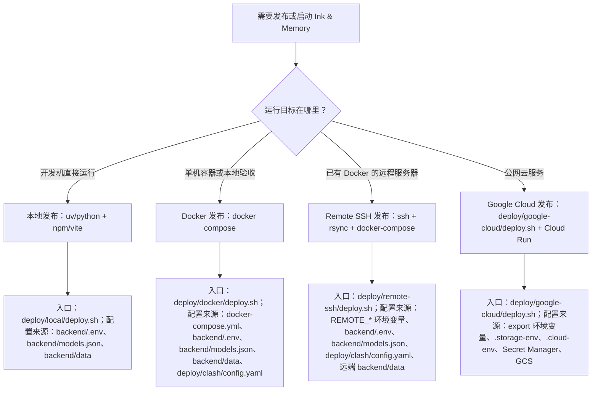

# docs/deploy

## 定位

`docs/deploy/` 是 Ink & Memory 发布体系的文档入口，负责说明本地直跑、Docker 容器发布、Remote SSH 发布、Google Cloud 发布四类路径的边界、配置来源、操作顺序和验证方式。

当前可执行脚本按平台组织在 [`../../deploy/`](../../deploy/)：

| 发布方式 | 脚本入口 | 说明 |
|----------|----------|------|
| 本地发布 | [`../../deploy/local/deploy.sh`](../../deploy/local/deploy.sh) | 包装本地 backend/frontend 启动、验证、停止和清理 |
| Docker 发布 | [`../../deploy/docker/deploy.sh`](../../deploy/docker/deploy.sh) | 包装根目录 Compose 构建、启动、验证和清理；backend 出站默认通过 Mihomo TUN |
| Remote SSH 发布 | [`../../deploy/remote-ssh/deploy.sh`](../../deploy/remote-ssh/deploy.sh) | 通过 SSH/rsync 同步到远程服务器，并在远端执行 docker-compose；backend 出站默认通过 Mihomo TUN；数据维护入口提供备份、上传和下载 |
| Google Cloud 发布 | [`../../deploy/google-cloud/deploy.sh`](../../deploy/google-cloud/deploy.sh) | 完整 Cloud Run 发布入口，旧根路径仅保留兼容 |

## 现有文档

| 文档 | 作用 | 当前状态 |
|------|------|----------|
| [`overview.md`](overview.md) | Cloud Run 部署主文档 | 仍可作为云发布操作入口，但包含本地 Docker Compose 说明，后续应拆分 |
| [`data-sync.md`](data-sync.md) | 本地与 GCS 数据同步说明 | 覆盖手动 gsutil 操作；需要和 `deploy/google-cloud/sync-data.sh` 的实际行为对齐 |
| [`remote-ssh.md`](remote-ssh.md) | Remote SSH 部署文档 | 说明远程 Docker 服务器的 SSH/rsync/docker-compose 发布路径 |
| [`release-system-design.md`](release-system-design.md) | 本次发布体系梳理与方案设计 | 处理判断、发布方案、文档与脚本改造计划、验收清单 |

## 推荐目录大纲

后续拆分时建议保持轻量结构，不引入额外层级：

```text
docs/deploy/
├── README.md                 # 发布文档入口与分流
├── overview.md               # 发布总览；拆分完成后只保留入口和索引
├── local.md                  # 本地直跑发布/维护
├── docker.md                 # Docker Compose 容器发布
├── remote-ssh.md             # Remote SSH + docker-compose 发布
├── google-cloud.md           # Google Cloud Run 发布
├── data-sync.md              # 数据同步、备份、恢复
└── release-system-design.md  # 发布体系改造设计稿
```

## 发布路径分流



## 四类发布方式对比

| 维度 | 本地发布 | Docker 发布 | Remote SSH 发布 | Google Cloud 发布 |
|------|----------|-------------|-----------------|-------------------|
| 主要入口 | [`../../deploy/local/deploy.sh`](../../deploy/local/deploy.sh) | [`../../deploy/docker/deploy.sh`](../../deploy/docker/deploy.sh) | [`../../deploy/remote-ssh/deploy.sh`](../../deploy/remote-ssh/deploy.sh) | [`../../deploy/google-cloud/deploy.sh`](../../deploy/google-cloud/deploy.sh) |
| 使用对象 | 开发者、调试者 | 本地验收、单机自托管维护者 | 有远程 Docker 服务器的维护者 | 线上 Cloud Run 发布维护者 |
| 运行形态 | 两个本地进程 | 前后端两个容器 | 远端前后端两个容器 | Cloud Run 前后端两个服务 |
| 配置来源 | `backend/.env`、`backend/models.json` | `backend/.env`、`backend/models.json`、`deploy/clash/config.yaml`、Compose env、`API_BASE_URL` | `REMOTE_*` 环境变量、`backend/.env`、`backend/models.json`、`deploy/clash/config.yaml` | shell export、`.storage-env`、`.cloud-env`、Secret Manager、`API_BASE_URL` |
| 数据位置 | `backend/data/` | `./backend/data:/app/data` | 远端 `${REMOTE_APP_DIR}/backend/data` 挂载为 `/app/data`，默认不从本地覆盖 | GCS bucket 挂载到 `/app/data` |
| API 访问 | Vite 同源代理 fallback | 浏览器直连 `http://127.0.0.1:8765`，后端端口由 `tun-proxy` 发布，nginx fallback 访问 `tun-proxy:8765` | 默认 nginx 同源代理 fallback；后端端口由 `tun-proxy` 发布；可用 `REMOTE_API_BASE_URL` 改为跨域直连 | 浏览器跨域直连 `https://ink-backend.suoxya.com` |
| Claude-agent Bash sandbox | 本机进程使用宿主运行时 | backend 容器启用 `SYS_ADMIN`、`seccomp=unconfined`、`apparmor=unconfined` 供 bubblewrap 创建 mount namespace | backend 容器启用 `SYS_ADMIN`、`seccomp=unconfined`、`apparmor=unconfined` 供 bubblewrap 创建 mount namespace | Cloud Run 不使用 Docker Compose runtime 权限模型 |
| 边界 | 不构建镜像，不访问 GCS | 不创建云资源，不使用 Secret Manager；Docker 外层容器是主隔离边界 | 不创建云资源，不使用 GCS/Secret Manager，资源默认对齐 Cloud Run，不默认同步数据库；Docker 外层容器是主隔离边界 | 不依赖本地端口和本地数据卷 |

## 生产认证配置

发布到 `https://ink-frontend.suoxya.com` / `https://ink-backend.suoxya.com` 时，所有平台必须满足：

| 项 | 生产值 |
|----|--------|
| `WEBUI_URL` | `https://ink-frontend.suoxya.com` |
| `API_BASE_URL` | `https://ink-backend.suoxya.com` |
| `COOKIE_SECURE` | `true` |
| `COOKIE_SAMESITE` | `none` |
| `INK_CORS_ALLOW_ORIGINS` | `https://ink-frontend.suoxya.com` |
| `INK_CORS_ALLOW_CREDENTIALS` | `true` |
| Google callback | `https://ink-backend.suoxya.com/oauth/google/callback` |

Cloud Run 通过 `deploy/google-cloud/deploy.sh` 写入这些值；Remote SSH 通过 `deploy/remote-ssh/docker-compose.yml` 的 environment 覆盖本地 `.env`。

## Docker TUN 出站

Docker 和 Remote SSH Compose 默认包含 `tun-proxy` 服务，使用
`metacubex/mihomo:latest` 加载 `deploy/clash/config.yaml`，并让
`ink-backend` 通过 `network_mode: service:tun-proxy` 共享网络命名空间。
真实 `config.yaml` 已 gitignored；配置准备见 [`../../deploy/clash/README.md`](../../deploy/clash/README.md)。

## 维护规则

- 修改发布路径、脚本参数、配置来源或验证流程时，同步更新本目录文档。
- 修改 `deploy/` 脚本时，同步更新 [`../../deploy/.folder.md`](../../deploy/.folder.md)、对应平台目录 `.folder.md` 和相关发布文档。
- 不把项目 ID、bucket、主机、服务名、镜像仓库、密钥值写死到文档示例之外；示例必须标明通过环境变量或部署参数覆盖。
