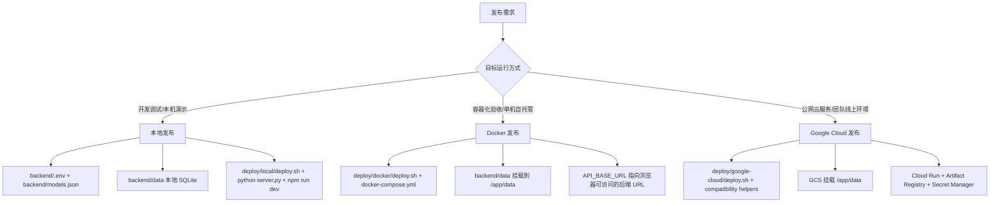

# 发布体系梳理与方案设计

本文基于仓库当前 `docs/deploy/` 与 `deploy/` 目录，以及相关 Docker、README、规则文档，给出发布体系处理判断和团队协作落地方案。

## 处理判断

### 当前是否混合了多类发布方式

是。当前仓库已经存在本地、Docker、Remote SSH、Google Cloud 发布路径；历史上文档入口没有清晰分层，本次已逐步补齐平台入口：

| 发布方式 | 当前承载位置 | 判断 |
|----------|--------------|------|
| Google Cloud 发布 | [`../../deploy/google-cloud/deploy.sh`](../../deploy/google-cloud/deploy.sh)、[`../../deploy/google-cloud/setup-storage.sh`](../../deploy/google-cloud/setup-storage.sh)、[`../../deploy/google-cloud/sync-data.sh`](../../deploy/google-cloud/sync-data.sh)、旧 `deploy/*.sh` 兼容包装、`docs/deploy/overview.md`、`docs/deploy/data-sync.md` | 已形成完整目录化入口，旧根脚本保留兼容或作为辅助脚本 |
| Docker 发布 | [`../../deploy/docker/deploy.sh`](../../deploy/docker/deploy.sh)、根目录 [`../../docker-compose.yml`](../../docker-compose.yml)、[`../../backend/Dockerfile`](../../backend/Dockerfile)、[`../../frontend/Dockerfile`](../../frontend/Dockerfile)、[`../../frontend/nginx.conf.template`](../../frontend/nginx.conf.template) | 已形成目录化入口，复用根 Compose |
| Remote SSH 发布 | [`../../deploy/remote-ssh/deploy.sh`](../../deploy/remote-ssh/deploy.sh)、[`../../deploy/remote-ssh/sync-data.sh`](../../deploy/remote-ssh/sync-data.sh)、[`../../deploy/remote-ssh/docker-compose.yml`](../../deploy/remote-ssh/docker-compose.yml)、[`remote-ssh.md`](remote-ssh.md) | 远程 Docker 服务器入口，使用 SSH/rsync 和远端 `docker-compose`；数据维护收敛为 `backup` / `upload` / `download`，上传后 force-recreate Compose 服务 |
| 本地发布 | [`../../deploy/local/deploy.sh`](../../deploy/local/deploy.sh)、[`../../README.md`](../../README.md)、[`../../README.zh.md`](../../README.zh.md) 的后端 `python server.py` 与前端 `npm run dev` 指令 | 已形成目录化入口，复用本地启动方式 |

结论：`deploy/` 脚本层应从 Google Cloud Run 专属目录升级为平台化发布入口；新的 `deploy/google-cloud/` 应承载完整 Cloud Run 发布实现，旧 Cloud Run 根脚本继续保留为兼容入口或辅助脚本，避免破坏既有调用路径。

### 主要问题

1. **文档职责混杂**：`docs/deploy/overview.md` 标题和主体是 Google Cloud Run，但结尾包含“本地 Docker Compose 运行”；本地直跑流程仅在 README，发布文档入口没有分流。
2. **环境变量说明与脚本实现不一致**：改造前 `overview.md` 描述的 Secret Manager 变量与 [`../../deploy/setup-env.sh`](../../deploy/setup-env.sh) 实际确认的 `ANTHROPIC_*`、`AGENT_CWD`、`FILE_STORAGE_LOCAL_DIR` 等 key 不一致；本次已先同步文档，后续仍建议重做 secret 分类。
3. **Secret 与普通配置边界不清**：`AGENT_CWD`、`FILE_STORAGE_LOCAL_DIR` 是路径配置，不应长期作为 Secret 管理；同时 `TEXT_API_KEY`、`INK_IMAGE_API_KEY`、`INK_AGENT_MEM0_API_KEY` 等敏感值若出现在 `backend/.env`，当前脚本会被普通 env 透传，存在配置暴露风险。
4. **数据同步文档与脚本行为不一致**：`data-sync.md` 写了数据库、`file-storage/`、`agent-workspace/` 的手动同步；[`../../deploy/google-cloud/sync-data.sh`](../../deploy/google-cloud/sync-data.sh) 只上传 SQLite 主文件和 WAL/SHM 文件并重启后端，未同步两个目录，根路径 [`../../deploy/sync-data.sh`](../../deploy/sync-data.sh) 仅做兼容委托。
5. **脚本文案存在轻微误导**：改造前 `setup-storage.sh` 结束提示 `run ./deploy.sh`，本次已调整为 `./deploy/google-cloud/deploy.sh deploy`。
6. **运行时说明滞后**：改造前 `overview.md` 描述后端镜像为 `python:3.9-slim`、前端构建为 `npm ci`；本次已对齐 [`../../backend/Dockerfile`](../../backend/Dockerfile) 与 [`../../frontend/Dockerfile`](../../frontend/Dockerfile)。
7. **边界外样例未归类**：[`../../backend/docker-compose.yml`](../../backend/docker-compose.yml) 是单后端远程镜像样例，包含固定代理端口和镜像名，不应混入主发布路径；若保留，应作为参考样例并说明不属于 `deploy/` 主线。

### 处理策略

本次建议采用“文档先拆边界，脚本后对齐”的低风险路径：

| 层级 | 处理方式 | 说明 |
|------|----------|------|
| 文档层 | 拆分入口与平台发布说明 | `docs/deploy/README.md` 做分流；后续将 `overview.md` 拆为 `google-cloud.md`、`remote-ssh.md`、`docker.md`、`local.md` |
| 脚本层 | 新增平台子目录，保留旧云脚本兼容 | `deploy/local/`、`deploy/docker/`、`deploy/google-cloud/` 提供统一入口；Google Cloud 主流程在平台目录实现，旧根脚本继续可用 |
| 配置层 | 明确配置来源和敏感度 | 以 `backend/.env.example`、`backend/models.json.example`、`.storage-env`、`.cloud-env`、shell export 为来源，避免写死业务资源 |
| 流程层 | 建立三条互斥操作路径 | 本地直跑不触碰 Docker/Cloud；Docker 不创建云资源；Google Cloud 不依赖本地端口与本地卷 |

### 拆分、保留、合并、重命名建议

| 对象 | 建议 | 理由 |
|------|------|------|
| `deploy/` | 升级为平台化发布脚本目录 | 顶层做入口说明，子目录承载平台脚本，旧 Cloud Run 根脚本作为兼容包装保留 |
| `deploy/local/` | 新增并保留 | 本地直跑发布入口，复用 `backend/server.py` 与 `frontend/package.json` |
| `deploy/docker/` | 新增并保留 | Docker 发布入口，复用根 `docker-compose.yml` 与现有 Dockerfile |
| `deploy/google-cloud/` | 新增并保留 | Cloud Run 主入口，承载存储初始化、完整构建、推送、部署、CORS 回写、数据同步、验证和回滚流程 |
| `docs/deploy/overview.md` | 短期保留，标记为 Cloud Run 主文档；中期收敛为总览入口 | 避免一次性破坏已有 README 链接 |
| `docs/deploy/data-sync.md` | 保留并改为“云数据同步/备份恢复”文档 | 数据同步只服务 Google Cloud 与本地数据迁移 |
| `docs/deploy/README.md` | 新增 | 作为平台发布路径分流入口 |
| `docs/deploy/google-cloud.md` | 后续新增，由 `overview.md` Cloud Run 内容迁移而来 | 让云发布文档独立 |
| `docs/deploy/docker.md` | 后续新增 | 承载 Compose、镜像构建、容器验证、清理 |
| `docs/deploy/local.md` | 后续新增 | 承载 README 中本地直跑流程和验证 |
| `backend/docker-compose.yml` | 不纳入主线；后续迁移到参考文档或删除 | 与根 Compose 重叠，且含固定远程镜像和代理默认值 |

## 发布方式边界



## Docker 发布设计

### 适用场景

- 在一台机器上用容器方式验收完整前后端链路。
- 需要复现 Cloud Run 的“前端静态服务 + 浏览器跨域直连后端 API”形态，但不创建云资源。
- 适合本地验收、自托管试运行、运维演练。

### 目标用户

- 开发者：验证容器镜像构建、runtime-config 注入和前后端跨域访问。
- 维护者：在单机环境快速启动完整服务。
- QA 或产品：通过浏览器访问接近线上路径的页面。

### 前置条件

- Docker Engine 与 Docker Compose 可用。
- `backend/.env` 已从 [`../../backend/.env.example`](../../backend/.env.example) 复制并填入必要值。
- `backend/models.json` 已按 [`../../backend/models.json.example`](../../backend/models.json.example) 准备。
- 本机 80 与 8765 端口没有冲突；如冲突，应通过 Compose 参数或 override 文件调整。

### 环境变量与配置来源

| 配置 | 来源 | 说明 |
|------|------|------|
| 后端密钥与模型配置 | `backend/.env`、`backend/models.json` | 由 Compose 传入后端容器或挂载 |
| 后端数据 | `backend/data/` | 挂载为 `/app/data`，不访问 GCS |
| 前端 API 目标 | `docker-compose.yml` 的 `API_BASE_URL=http://127.0.0.1:8765` | 指向浏览器可访问的本机后端端口 |
| nginx fallback 目标 | `docker-compose.yml` 的 `BACKEND_URL=http://ink-backend:8765` | 保留同源代理兼容路径 |
| nginx 模板 | `frontend/nginx.conf.template` | 与 Cloud Run 共用，但运行目标不同 |
| Claude-agent Bash sandbox | `docker-compose.yml` backend service | 授予 `SYS_ADMIN`、`seccomp=unconfined`、`apparmor=unconfined`，允许 bubblewrap 创建 mount namespace |

### 构建流程

1. 在仓库根目录运行 `docker compose build` 或 `docker compose up --build`。
2. 后端使用 `backend/Dockerfile` 构建 FastAPI 镜像。
3. 前端使用 `frontend/Dockerfile` 构建 Vite 静态资源并由 nginx 服务。

### 启动流程

```bash
docker compose up --build
```

启动后默认访问：

```text
http://localhost/
```

### 验证流程

- 浏览器访问 `/` 能加载前端。
- 前端读取 `/runtime-config.js` 后，浏览器直接跨域请求 `API_BASE_URL`。
- 后端健康检查通过 `http://localhost:8765/api/health`。
- `backend/data/` 中生成或更新 SQLite 数据文件。

### 回滚或清理方式

- 回滚镜像：重新构建上一个 git revision 的镜像。
- 停止服务：`docker compose down`。
- 清理容器与网络：`docker compose down --remove-orphans`。
- 清理数据前必须先备份 `backend/data/`。

### 常见问题

| 问题 | 处理 |
|------|------|
| 80 端口占用 | 调整 Compose 端口映射，或停止占用 80 的服务 |
| 前端能打开但 API 失败 | 检查 `API_BASE_URL` 是否为浏览器可访问地址；Compose 默认是 `http://127.0.0.1:8765` |
| 后端缺少模型或密钥 | 检查 `backend/.env` 和 `backend/models.json` 是否挂载/传入 |
| Claude-agent Bash 报 `bwrap: Failed to make / slave: Permission denied` | 确认 backend 容器使用根 Compose 的 `SYS_ADMIN`、`seccomp=unconfined`、`apparmor=unconfined` 设置，并已重新创建容器 |
| Claude-agent Bash 报 `bwrap: Can't mount tmpfs on /newroot/sbin: No such file or directory` | 确认 backend 镜像包含 `/sbin`、`/usr/sbin`、`/usr/local/sbin` 目录兜底，且 workspace sandbox allowlist 包含这些已存在的系统运行时目录；重新构建并重建容器 |
| 数据丢失 | 确认 `backend/data/` 被持久化挂载，不要删除本地目录 |

### 与其他发布方式的边界

- 不执行 `deploy/google-cloud/deploy.sh`、`deploy/google-cloud/setup-storage.sh`、`deploy/google-cloud/sync-data.sh` 或根目录兼容包装脚本。
- 不创建 GCS bucket、Secret Manager secret、Artifact Registry 仓库。
- 可以复用 Dockerfile 和 nginx 模板，但不得复用 Cloud Run 专属 `.cloud-env` 作为 Compose 配置来源。

## 本地发布设计

### 适用场景

- 开发、调试、快速验证后端或前端单点问题。
- 需要热更新前端或直接调试 Python 后端。
- 不需要容器和云资源。

### 目标用户

- 功能开发者。
- 调试后端 API、数据库、Agent 行为的维护者。
- 需要最短反馈循环的产品/设计协作人员。

### 前置条件

- Python 3.11+ 与 `uv` 可用。
- Node.js 18+ 可用。
- 已安装后端依赖并创建虚拟环境。
- 已安装前端依赖。
- `backend/.env`、`backend/models.json`、`backend/data/` 准备完成。

### 环境变量与配置来源

| 配置 | 来源 | 说明 |
|------|------|------|
| 后端运行配置 | `backend/.env` | 本地直接加载，不进入 Secret Manager |
| 模型与角色配置 | `backend/models.json` | 本地文件，gitignored |
| 数据库与文件 | `backend/data/` | 本地 SQLite 与文件存储 |
| 前端开发服务 | Vite dev server | 默认 `http://localhost:5173` |
| 后端服务 | `python server.py` | README 当前说明为 `http://localhost:8765` |

### 构建流程

本地发布通常不需要生产构建。若需要验证前端生产包，运行：

```bash
cd frontend
npm run build
```

### 启动流程

后端：

```bash
cd backend
uv venv
source .venv/bin/activate
uv pip install -r requirements.txt
python database.py
python server.py
```

前端：

```bash
cd frontend
npm install
npm run dev
```

### 验证流程

- 后端能响应健康检查或首页请求。
- 前端 dev server 可访问。
- 写作、会话保存、文件存储、Agent 相关功能能写入 `backend/data/`。
- 修改前端源码后 Vite 热更新生效。

### 回滚或清理方式

- 回滚代码到上一个 git revision。
- 删除或重建虚拟环境：`rm -rf backend/.venv` 后重新安装。
- 前端依赖异常时删除 `frontend/node_modules/` 后重新安装。
- 数据回滚通过备份或恢复 `backend/data/`，不要直接删除生产同步回来的数据库。

### 常见问题

| 问题 | 处理 |
|------|------|
| Python 版本不匹配 | 按 README 使用 Python 3.11+，容器镜像版本不代表本地开发版本 |
| 前端 API 跨域或路径异常 | 检查前端 API 基础路径和后端端口，避免混用云端固定公开域名 |
| 数据库表不存在 | 先运行 `python database.py` |
| 模型调用失败 | 检查 `backend/.env` 与 `backend/models.json` 的 endpoint、key、role 映射 |

### 与其他发布方式的边界

- 不构建 Docker 镜像。
- 不启动 nginx 容器。
- 不访问 GCS、Secret Manager、Cloud Run。
- 可作为 Docker 或 Cloud Run 发布前的快速功能验证，但不能替代容器/云端验证。

## Google Cloud 发布设计

### 适用场景

- 面向团队或公开用户的线上发布。
- 需要 Cloud Run 托管、Artifact Registry 镜像仓库、GCS 持久化、Secret Manager 管理密钥。
- 需要通过固定前端域名 `https://ink-frontend.suoxya.com/` 访问。

### 目标用户

- 发布维护者。
- DevOps/平台负责人。
- 需要管理云资源、密钥、数据同步和回滚的工程师。

### 前置条件

- Google Cloud 项目已创建并开启计费。
- 已安装 `gcloud`、`gsutil`、Docker。
- 已执行 `gcloud auth login`，并具备启用 API、创建 IAM、Secret、Cloud Run、Artifact Registry、GCS 的权限。
- 本地导出必要变量，例如 `GCP_PROJECT_ID`、`GCP_REGION`、`REPO_NAME`、`BACKEND_SERVICE`、`FRONTEND_SERVICE`、`BUCKET_NAME`、`SA_NAME`。

### 环境变量与配置来源

| 配置 | 来源 | 说明 |
|------|------|------|
| 项目与区域 | shell export | `GCP_PROJECT_ID` 必填，其余有默认值但应允许覆盖 |
| 存储资源 | `.storage-env` | 由 `deploy/google-cloud/setup-storage.sh` 生成，包含 `GCS_BUCKET`、`SA_EMAIL` |
| Cloud Run env/secrets | `.cloud-env` | 由 `setup-env.sh` 生成，包含 `CLOUD_ENV_VARS`、`CLOUD_SECRET_REFS` |
| 密钥 | Secret Manager | 应只存敏感值 |
| 数据 | GCS bucket | Cloud Storage FUSE 挂载到 `/app/data` |
| 前端 API 目标 | 固定后端公开域名 | `deploy/google-cloud/deploy.sh` 默认向前端注入 `API_BASE_URL=https://ink-backend.suoxya.com`，可用 `FRONTEND_API_BASE_URL` 覆盖 |
| 后端 CORS origin | 固定前端公开域名 | `deploy/google-cloud/deploy.sh` 和 `deploy/google-cloud/sync-data.sh` 默认回写 `INK_CORS_ALLOW_ORIGINS=https://ink-frontend.suoxya.com`；`setup-env.sh` 不写入该变量；未部署云端时后端默认仅允许本地前端 origin |

### 构建流程

1. `deploy/google-cloud/deploy.sh deploy` 设置 GCP 项目并启用 Cloud Run、Artifact Registry、Cloud Build API。
2. 确认 Artifact Registry Docker 仓库存在。
3. 配置 Docker 认证。
4. 并行构建后端和前端镜像。
5. 并行推送镜像到 Artifact Registry。

### 启动流程

首次发布：

```bash
export GCP_PROJECT_ID=your-project-id
./deploy/google-cloud/deploy.sh setup-storage
./deploy/google-cloud/deploy.sh setup-env
./deploy/google-cloud/deploy.sh deploy
```

后续发版：

```bash
./deploy/google-cloud/deploy.sh deploy
```

密钥或环境变量变化后：

```bash
./deploy/google-cloud/deploy.sh setup-env
./deploy/google-cloud/deploy.sh deploy
```

### 验证流程

- `gcloud run services describe` 能看到前后端服务 URL。
- 前端根 URL 能加载静态资源。
- 前端浏览器请求直接跨域访问 `https://ink-backend.suoxya.com`，后端 `INK_CORS_ALLOW_ORIGINS` 包含 `https://ink-frontend.suoxya.com` 后响应 CORS preflight 和实际请求。
- 后端只有 1 个最大实例写入同一 GCS FUSE 路径，避免 SQLite 并发写风险。
- GCS bucket 中能看到 `ink-and-memory.db`、`file-storage/`、`agent-workspace/`。

### 回滚或清理方式

- 回滚 Cloud Run revision：使用 Cloud Run 控制台或 `gcloud run services update-traffic` 指回旧 revision。
- 回滚镜像：重新部署旧 tag 或旧 digest。
- 回滚数据：优先使用 GCS versioning 或备份文件恢复。
- 清理服务：删除 Cloud Run 服务、Artifact Registry 镜像、Secret、GCS bucket 前必须确认无生产数据依赖。

### 常见问题

| 问题 | 处理 |
|------|------|
| `.storage-env` 缺失 | 先运行 `./deploy/google-cloud/deploy.sh setup-storage` |
| `.cloud-env` 缺失 | 先运行 `./deploy/google-cloud/deploy.sh setup-env` |
| 前端 API 跨域失败 | 检查前端 `runtime-config.js` 中的 `apiBaseUrl` 是否为 `https://ink-backend.suoxya.com`，以及后端 `INK_CORS_ALLOW_ORIGINS` 是否包含 `https://ink-frontend.suoxya.com` |
| 前端请求 `Method Not Allowed` | 检查请求 URL 是否仍打到前端同源 API fallback；确认 `runtime-config.js` 未缓存且 `apiBaseUrl` 指向 `https://ink-backend.suoxya.com` |
| SQLite 数据异常 | 检查 Cloud Run backend `max-instances=1`，同步数据前先停写或选择维护窗口 |
| 密钥未生效 | 检查 Secret Manager 版本和 Cloud Run secret ref |

### 与其他发布方式的边界

- 不使用本地 `backend/data/` 作为运行时数据源，只作为迁移或备份来源。
- 不依赖本机 `localhost` 端口。
- 可以复用 Dockerfile 和 nginx 模板，但发布入口必须是 `deploy/` 脚本和云端配置。

## 本次问题交互方案设计稿

### 背景与问题定义

当前仓库已经具备 Cloud Run 发布脚本、Docker Compose 容器启动、本地直跑说明三种能力；2026-06-12 追加 Remote SSH + docker-compose 远程服务器发布路径。团队成员在选择发布方式时容易出现三类误用：

- 把 Cloud Run 文档里的本地 Docker 片段当作完整 Docker 发布文档。
- 以 `overview.md` 的旧环境变量表配置云端，和 `setup-env.sh` 实际行为不一致。
- 在同步数据时以为 `sync-data.sh` 会同步全部 `backend/data/`，实际只处理 SQLite 文件。

本次交互的目标不是立即重写全部脚本，而是先形成统一判断和设计稿，让后续 PR 可以分阶段、安全地改造。

### 改造前目录与文档现状分析

| 位置 | 现状 | 问题 |
|------|------|------|
| `docs/deploy/overview.md` | Cloud Run 主文档，含本地 Docker Compose 片段 | 单文档承载过多路径，且部分环境变量、镜像描述滞后 |
| `docs/deploy/data-sync.md` | 手动 GCS 数据同步指南 | 与 `sync-data.sh` 自动化范围不一致 |
| `deploy/.folder.md` | 描述三步云发布 | 未列出 `sync-data.sh` |
| `docs/deploy/.folder.md` | 描述 Cloud Run 文档 | 未反映三类发布文档入口 |
| `docker-compose.yml` | 完整前后端本地容器编排 | 缺独立 Docker 发布文档 |
| `README.md` / `README.zh.md` | 本地开发启动与 Cloud Run 简要入口 | 不是部署体系入口，细节不足 |

### 目标

- 建立本地、Docker、Remote SSH、Google Cloud 发布路径的清晰边界。
- 让配置来源、构建、启动、验证、回滚、清理都有固定位置。
- 保留现有脚本和目录，避免引入复杂发布框架。
- 给后续脚本修正提供可审查的清单。
- 确保文档中的资源名、路径、主机和阈值都能通过 env/config/参数覆盖。

### 非目标

- 本次不改变 Cloud Run 服务架构。
- 本次不新增 CI/CD pipeline。
- 本次不把 SQLite 从 GCS FUSE 迁移到托管数据库。
- 本次不重写 Dockerfile 或 Compose。
- 本次不删除 `backend/docker-compose.yml`，只建议后续归类或清理。

### 发布方式拆分原则

1. **入口互斥**：用户先选择本地、Docker、Google Cloud，再进入对应文档。
2. **配置归属清楚**：本地与 Docker 使用 `backend/.env`、`backend/models.json`、本地数据；Google Cloud 使用 `.storage-env`、`.cloud-env`、Secret Manager、GCS。
3. **脚本职责单一**：`deploy/` 按平台分目录组织发布入口；本地、Docker、Google Cloud 的脚本只编排各自平台，不复制业务逻辑。
4. **共享资产只共享构建，不共享流程**：Dockerfile、nginx 模板可被 Docker 与 Cloud Run 共用，但文档流程必须分开。
5. **敏感值优先进入 Secret Manager**：云发布脚本应明确 secret allowlist，不把 API key 作为普通 env 透传。

### 推荐目录结构

```text
docs/deploy/
├── README.md                 # 发布体系入口、对比表、分流图
├── overview.md               # 短期保留；中期收敛为总览
├── local.md                  # 后续新增：本地直跑发布
├── docker.md                 # 后续新增：Docker Compose 发布
├── google-cloud.md           # 后续新增：Cloud Run 发布
├── data-sync.md              # 云数据同步、备份、恢复
└── release-system-design.md  # 本设计稿

deploy/
├── README.md                 # 脚本入口、平台分流、兼容映射
├── local/
│   ├── .folder.md
│   └── deploy.sh             # 本地检查、构建、启动、验证、停止、清理
├── docker/
│   ├── .folder.md
│   └── deploy.sh             # Compose 检查、构建、启动、验证、停止、清理
├── google-cloud/
│   ├── .folder.md
│   ├── deploy.sh             # Cloud Run 主入口，完整构建、推送、部署、CORS 回写
│   ├── setup-storage.sh      # Google Cloud 存储与服务账号初始化
│   └── sync-data.sh          # Google Cloud 数据上传、云端备份与后端重启
├── setup-storage.sh          # 兼容：委托 google-cloud/setup-storage.sh
├── setup-env.sh              # 兼容：Google Cloud env/secret 初始化
├── deploy.sh                 # 兼容：委托 google-cloud/deploy.sh deploy
├── sync-data.sh              # 兼容：委托 google-cloud/sync-data.sh
└── .folder.md                # 脚本目录说明
```

### 文档改造方案

1. 新增 `docs/deploy/README.md`，作为发布入口。
2. 新增本设计稿，记录本次判断、拆分原则、风险和验收清单。
3. 后续将 `overview.md` 的 Cloud Run 内容迁移到 `google-cloud.md`，并在 `overview.md` 保留跳转索引。
4. 后续从 README 提取本地直跑流程到 `local.md`，README 只保留简短链接。
5. 后续从 `overview.md` 末尾提取 Docker Compose 流程到 `docker.md`。
6. 更新 `data-sync.md`，明确“手动全量同步”和“`sync-data.sh` 自动上传数据库并重启”是两个不同路径。

### 脚本与配置改造方案

| 脚本/配置 | 建议改造 | 优先级 |
|-----------|----------|--------|
| `deploy/local/deploy.sh` | 已新增：本地 check/build/start/verify/stop/clean/logs，支持 `--help`、`--dry-run`、`--check` | 已完成 |
| `deploy/docker/deploy.sh` | 已新增：Compose check/config/build/start/verify/stop/clean/logs，支持 `--help`、`--dry-run`、`--check` | 已完成 |
| `deploy/google-cloud/deploy.sh` | 已调整为完整 Cloud Run 主发布脚本，提供 plan/check/setup/deploy/sync/verify/rollback/clean，并在部署后回写后端 `INK_CORS_ALLOW_ORIGINS` | 已完成 |
| `deploy/remote-ssh/deploy.sh` | 新增 Remote SSH 发布脚本，通过 rsync 同步到远程 Docker 服务器并执行 `docker-compose`，默认资源规格对齐 Cloud Run，并保留远端 `backend/data/` 作为服务文件系统 | 已完成 |
| `deploy/remote-ssh/sync-data.sh` | 已收敛为 `backup` / `upload` / `download` 三个数据维护动作；`upload` 先备份远端数据、上传本地 `backend/data/`，再执行 Compose `up -d --force-recreate` 让后端重新加载数据库；`download` 先备份本地数据再覆盖同步远端目录 | 已完成 |
| `setup-env.sh` | 重做 secret 分类：API key、token、JWT、Mem0 key 等进 Secret Manager；路径、TTL、模型名、开关作为普通 env | 高 |
| `setup-env.sh` | 不再把所有非 secret `.env` key 盲目透传，改为 allowlist 或带敏感名检测 | 高 |
| `deploy/google-cloud/sync-data.sh` | 已明确自动脚本只同步 SQLite/WAL/SHM，并过滤旧 `.cloud-env` 中的 `INK_CORS_*` 后写回固定前端域名；根路径 `deploy/sync-data.sh` 仅兼容委托；后续可增加 `file-storage/`、`agent-workspace/` 同步选项 | 部分完成 |
| `deploy/google-cloud/setup-storage.sh` | 已归位到 Google Cloud 平台目录，结束提示路径为 `./deploy/google-cloud/deploy.sh deploy`；根路径 `deploy/setup-storage.sh` 仅兼容委托 | 已完成 |
| `deploy.sh` | 根路径保留旧入口，委托 `deploy/google-cloud/deploy.sh deploy`；`IMAGE_TAG` 由平台脚本覆盖，默认仍可用 `latest` | 已完成 |
| `docker-compose.yml` | 端口、`API_BASE_URL`、`BACKEND_URL` 保持默认，但文档说明如何覆盖 | 中 |
| `backend/docker-compose.yml` | 归类为参考样例或删除，避免与根 Compose 并列造成误选 | 中 |

### 用户交互路径或维护者操作路径

维护者处理发布问题时按以下顺序沟通：

1. 先问或判断目标运行方式：本地、Docker、Google Cloud。
2. 再定位配置来源：本地文件、Compose、云端生成文件与 Secret。
3. 然后执行对应验证：本地端口、容器健康检查、固定公开域名与 GCS。
4. 最后根据影响范围选择回滚：代码 revision、镜像 revision、Cloud Run revision、GCS 数据版本。

面向团队的沟通模板：

```text
本次变更影响的发布路径：[本地 / Docker / Google Cloud]
配置来源是否变化：[否 / 是，列出 env/config/secret]
脚本是否变化：[否 / 是，列出脚本]
数据路径是否变化：[否 / 是，说明本地 data 或 GCS]
验证结果：[命令、退出码、关键输出]
回滚方式：[代码 / 镜像 / Cloud Run revision / 数据备份]
```

### 风险与兼容性

| 风险 | 影响 | 缓解 |
|------|------|------|
| 文档拆分导致旧链接失效 | README 或外部引用找不到文档 | 保留 `overview.md`，先做索引和跳转 |
| secret 分类调整改变 Cloud Run 配置 | 云端环境变量可能丢失 | 先生成 diff，发布前对比 `.cloud-env` |
| 数据同步脚本增强后误覆盖云端数据 | 生产数据损坏 | 默认 dry-run 或确认提示；同步前要求备份 |
| Docker 与 Cloud 共享 runtime-config/nginx 模板 | 本地改动影响云端 API base 或 fallback 代理 | 修改模板必须同时验证 Compose 和 Cloud Run runtime-config |
| SQLite + GCS FUSE 并发写 | 数据损坏 | 保持 backend `max-instances=1`，数据操作使用维护窗口 |

### 验证计划

文档变更验证：

- `rg --files docs/deploy deploy` 确认目录清单。
- Markdown 链接检查，确保相对路径存在。
- `git diff --check` 检查空白错误。

脚本后续变更验证：

- `bash -n deploy/*.sh deploy/*/deploy.sh` 做 shell 语法检查。
- Cloud dry-run 或 staging 项目试跑 `deploy/google-cloud/deploy.sh setup-env`、`deploy/google-cloud/deploy.sh deploy`。
- Docker 路径运行 `docker compose config` 与 `docker compose up --build`。
- 本地路径运行后端健康检查与前端 build。

### 分阶段落地计划

| 阶段 | 内容 | 验收 |
|------|------|------|
| Phase 1 | 新增发布体系设计稿和 README，更新 `.folder.md` | 文档路径有效，团队可以按发布目标分流 |
| Phase 2 | 拆出 `local.md`、`docker.md`、`remote-ssh.md`、`google-cloud.md` | README、overview、平台文档不重复描述同一流程 |
| Phase 3 | 修正 `setup-env.sh` secret 分类和 `sync-data.sh` 行为 | `.cloud-env` 不泄露敏感值，数据同步范围清楚 |
| Phase 4 | 补充实际发布验证记录和回滚手册 | 每类发布都有命令、预期输出、失败处理 |
| Phase 5 | 清理或归档 `backend/docker-compose.yml` | 主路径只保留一个 Docker Compose 入口 |

### 后续维护规则

- 每个发布变更 PR 必须标注影响路径：本地、Docker、Google Cloud。
- 改 `deploy/*.sh` 必须同步改 `docs/deploy/` 和 `deploy/.folder.md`。
- 改 Dockerfile、nginx 模板或 Compose 时，必须验证 Docker 发布；若 Cloud Run 复用同一资产，还要验证云发布说明。
- 新增环境变量必须说明来源、默认值、是否敏感、适用发布路径。
- 文档示例中的资源名只能作为示例或默认值出现，必须同时说明覆盖方式。

### PR Review 验收清单

- [ ] 变更是否明确影响本地、Docker、Google Cloud 中的哪一类或多类发布路径？
- [ ] 是否复用了现有脚本、Dockerfile、Compose、nginx 模板和配置约定？
- [ ] 是否避免新增硬编码项目 ID、bucket、主机、端口、服务名、镜像仓库、阈值或密钥？
- [ ] 新增或修改的环境变量是否标注配置来源和敏感性？
- [ ] Secret 是否进入 Secret Manager 或本地 gitignored 文件，而不是普通云环境变量？
- [ ] 数据路径是否明确区分 `backend/data/` 和 GCS `/app/data`？
- [ ] SQLite/WAL 与 Cloud Run 单实例约束是否被保留？
- [ ] 文档链接和目录清单是否仍然有效？
- [ ] 是否提供了验证命令、退出码和关键输出？
- [ ] 是否提供了回滚或清理方式？
