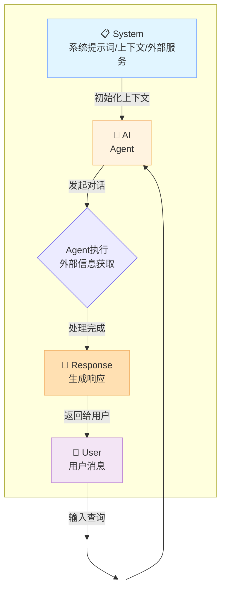
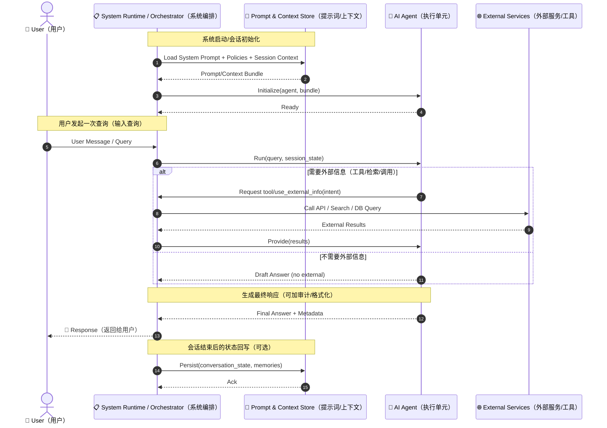
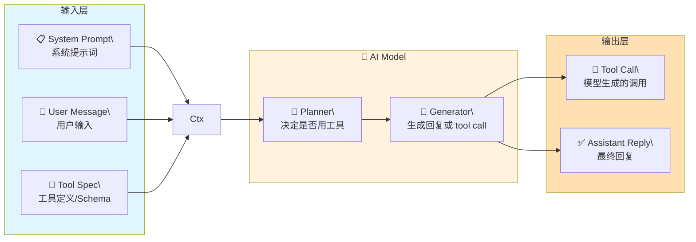
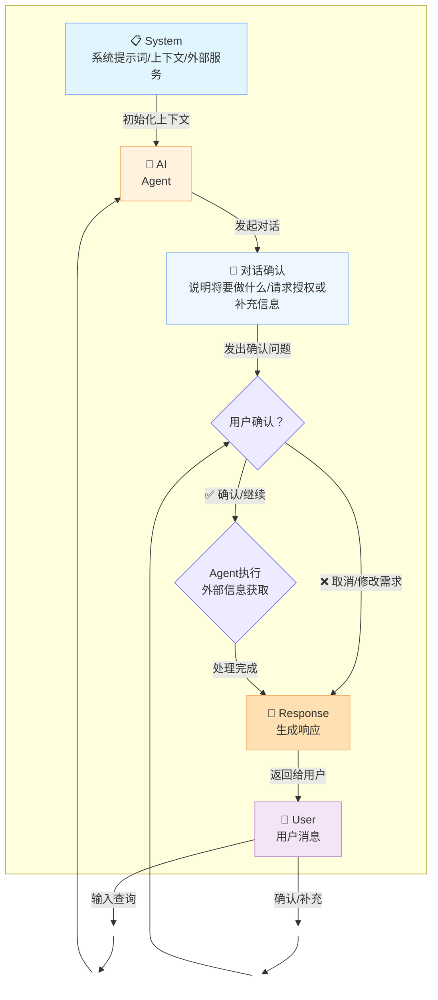
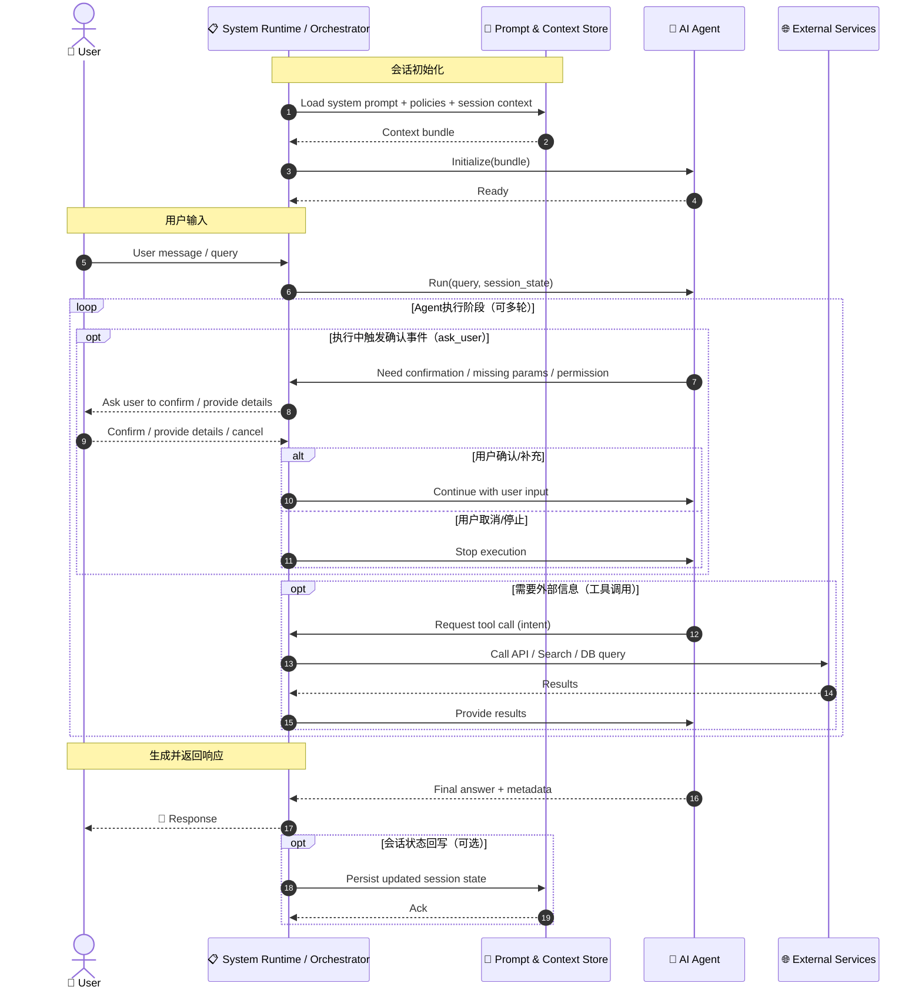
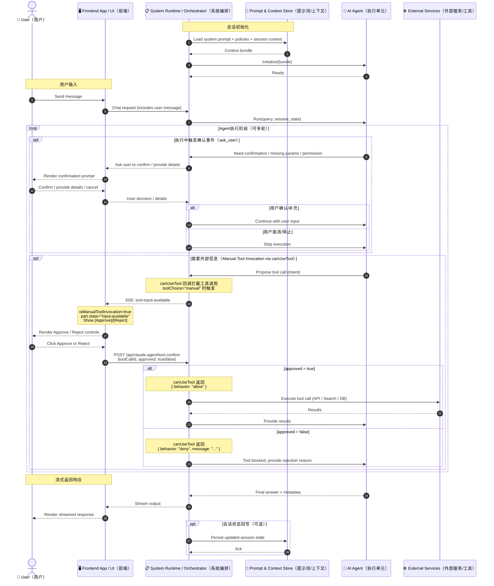
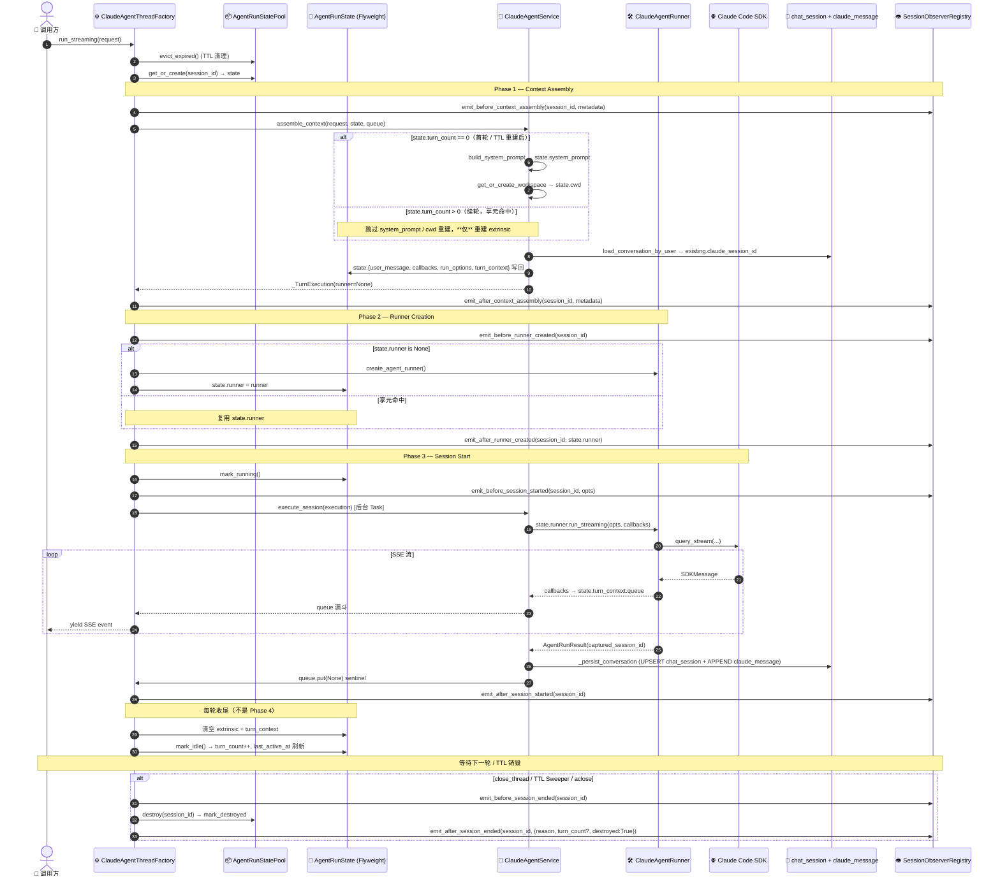
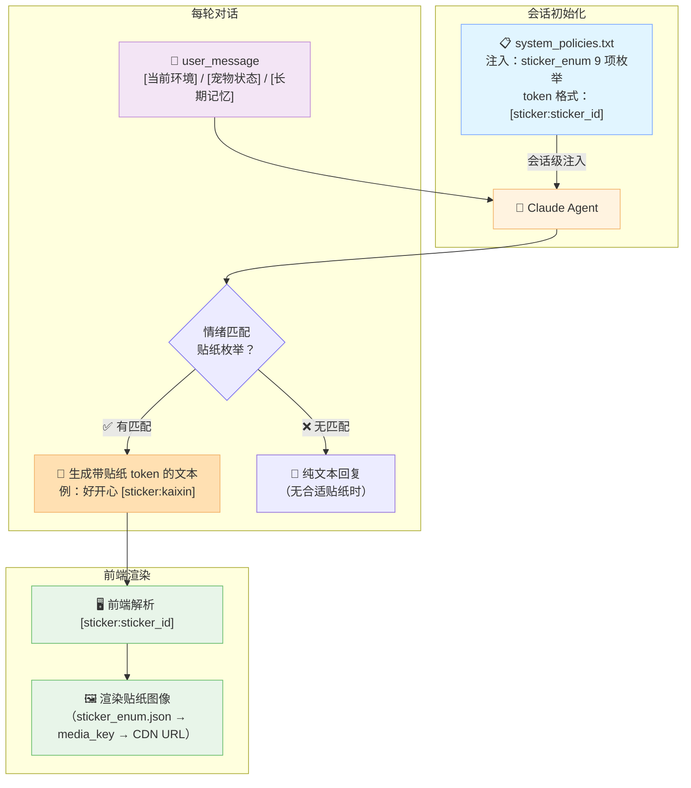
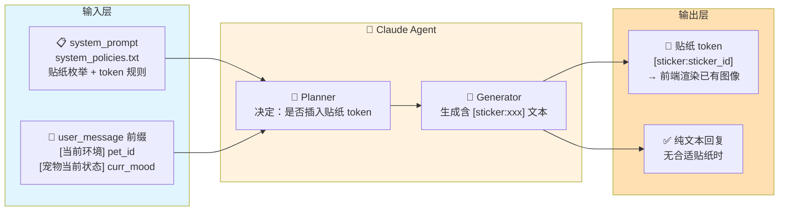

> **迁移来源**: Pawkeyland docs/app/design/AI Model 会话流程图.md — 路径和环境变量已适配 Ink & Memory 工程规范。

# AI Model 会话流程图

> **迁移来源**: Pawkeyland docs/app/design/AI Model 会话流程图.md — 路径和环境变量已适配 Ink & Memory 工程规范。

> **说明**：本文包含通用 AI 会话流程（Phase 1–3，下方各节均适用）和 Pawkeyland 宠物专属流程（Thread Session 享元生命周期、贴纸/动画部分）。宠物专属部分已在对应节添加注释，通用流程照原文保留。

## 基础的业务对话流程

## AI服务系统时序图

## transfrom模型模板架构

## 有确认事件的业务对话流程

## 有确认事件的AI服务系统时序图

## 与有确认事件的前端组件与AI服务系统交互的时序图

## Thread Session — sessionId 享元生命周期（Ink & Memory 落地）

> _(Pawkeyland 专属背景说明：原文的落地动机包括"角色扮演状态加载之前"的宠物系统上下文、DB 身份解析、Mem0 binding，这些属于 Pawkeyland 专属。Ink & Memory 中不适用这些步骤，但 Thread Session 的享元模式本身（workspace 初始化、ClaudeAgentRunner 创建的享元复用）同样适用)_

> 关联设计：[claude-agent-thread-session-patterns.md](./claude-agent-thread-session-patterns.md)、[claude-agent-session-persistence.md §10](./claude-agent-session-persistence.md#10-thread-session--进程内-sessionid-享元层)
>
> 落地动机：在标准"Init → Run → External Info → Response"模型上，把 *上下文加载之前* 的重型组件（workspace 初始化、系统上下文构建、ClaudeAgentRunner 创建）提取为 `session_id` 享元，由 `ClaudeAgentThreadFactory` + `AgentRunStatePool` 维护。

### 4 阶段生命周期总览

```mermaid
stateDiagram-v2
    direction TB
    [*] --> Phase1_FirstTurn : 首轮 / TTL 重建后第 1 轮<br/>(state.turn_count == 0)

    state "Phase 1 — Context Assembly (首轮)" as Phase1_FirstTurn {
        [*] --> BuildSystemPrompt : _context_builder.system_prompt
        BuildSystemPrompt --> InitWorkspace : get_or_create_workspace
        InitWorkspace --> BuildExtrinsic : user_message + AgentRunOptions + 5 callbacks + _TurnContext
        BuildExtrinsic --> [*] : 全部回写 state
    }

    Phase1_FirstTurn --> Phase2 : Service 返回 _TurnExecution

    state "Phase 2 — Runner Creation" as Phase2 {
        [*] --> CheckRunner : state.runner is None?
        CheckRunner --> CreateRunner : YES → create_agent_runner()
        CheckRunner --> ReuseRunner : NO  → 复用 state.runner
        CreateRunner --> [*] : 写回 state.runner
        ReuseRunner --> [*]
    }

    Phase2 --> Phase3 : execution.runner = state.runner

    state "Phase 3 — Session Start" as Phase3 {
        [*] --> RunStreaming : Service.execute_session<br/>state.runner.run_streaming(opts, callbacks)
        RunStreaming --> StreamSSE : SDKMessage → callbacks → queue
        StreamSSE --> Persist : 成功 → _persist_conversation
        Persist --> [*] : queue.put(None) sentinel
    }

    Phase3 --> TurnEnd : Factory finally
    TurnEnd : 清空 extrinsic 三件套 + turn_context\nstate.mark_idle()\nturn_count++, last_active_at 刷新\n**不发 Phase 4 钩子**

    TurnEnd --> Phase1_NextTurn : 续轮（TTL 内，state 仍 IDLE）
    state "Phase 1 — Context Assembly (续轮)" as Phase1_NextTurn {
        [*] --> ShortCircuit : 享元短路：system_prompt / cwd 直接读取
        ShortCircuit --> RebuildExtrinsic : 仅重建 user_message / AgentRunOptions / callbacks / turn_context
        RebuildExtrinsic --> [*]
    }
    Phase1_NextTurn --> Phase2

    TurnEnd --> Phase4 : close_thread / TTL Sweeper / aclose

    state "Phase 4 — Session End (State 销毁)" as Phase4 {
        [*] --> EmitBeforeEnded : emit_before_session_ended(session_id)
        EmitBeforeEnded --> Destroy : pool.destroy(session_id) → mark_destroyed()<br/>state.runner = None, turn_context = None
        Destroy --> EmitAfterEnded : emit_after_session_ended(session_id, {reason, destroyed, turn_count?})
        EmitAfterEnded --> [*]
    }
    Phase4 --> [*]
```

> _(Pawkeyland 原文中 Phase 1 首轮还包含 `ResolveIdentity` / `BuildPersistedPet` / `ResolveMem0` / `Mem0Preflight` 步骤，属于 Pawkeyland 专属，Ink & Memory 中不适用)_

### 时序图（含享元命中 / 不命中分支）

> _(Pawkeyland 原文时序图中 Phase 1 首轮还包含 `IdentityService` / `load_agent_pet` / `PetMemoryService` / `Mem0 preflight` 步骤，属于 Pawkeyland 专属，Ink & Memory 中不适用)_

### 设计模式分工

| 模式 | 落地类 | 职责 |
|---|---|---|
| **Observer** | `SessionLifecycleObserver` / `SessionObserverRegistry` / `LoggingObserver` | 8 个生命周期钩子（4 阶段 × before/after），把工厂的"生产者"语义和服务的"消费者"语义解耦；外部业务（日志、持久化、监控、A/B）以 Observer 形态接入 |
| **Flyweight + State** | `AgentRunState` / `AgentRunStatePool` / `AgentRunStateSweeper` | 跨轮共享 intrinsic 组件（system_prompt / cwd / runner），按 `session_id` 享元；State 模式管理 `IDLE / RUNNING / DESTROYED` 转移 |
| **Builder** | `AgentRunStateBuilder` | 流式构造 `AgentRunState`；`with_session_id(session_id)` 由 Pool 在 `get_or_create` 时调用 |
| **Factory** | `ClaudeAgentThreadFactory` | 唯一对外入口；隐藏 Observer 注册、Pool 管理、`asyncio.Lock` 排队、Sweeper 调度等内部细节，对外仅暴露 `run_streaming(request)` / `confirm_tool` / `close_thread` / `aclose` / `register_observer` |

> _(Pawkeyland 原文中 Flyweight 还包含 `persisted_pet_info` / `mem0_user_id` / `resolved_identity`，属于 Pawkeyland 专属，Ink & Memory 中不适用)_

---

## 宠物专属表情贴纸提示词生成交互流程

> _(Pawkeyland 专属，Ink & Memory 中不适用)_
>
> 以下流程图描述 Pawkeyland 宠物 Agent 的贴纸 token 渲染机制，保留为设计参考。Ink & Memory 中没有贴纸/动画机制，无需实现。

### 场景 A：对话内嵌贴纸（sticker token 渲染）

> _(Pawkeyland 专属，Ink & Memory 中不适用)_

### 场景 B（不适用）

> 宠物贴纸图像在**角色创建时**（`POST /api/character/create`）由 `PetMediaService` 一次性生成并存入 OSS。Claude Agent 对话期间**不触发**贴纸生成，仅通过 `[sticker:sticker_id]` token 引用已有图像（见场景 A）。

> _(Pawkeyland 专属，Ink & Memory 中不适用)_

### 贴纸提示词上下文注入位置总览

> _(Pawkeyland 专属，Ink & Memory 中不适用)_
