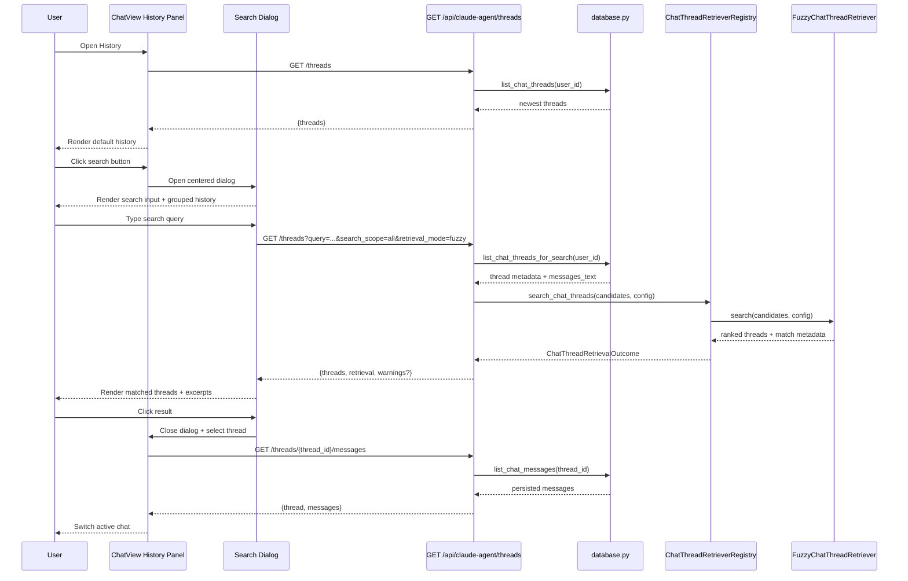

# Claude Agent Chat 历史搜索设计

Scope: Chat 页面右侧「历史对话」面板的搜索入口与居中搜索弹窗；搜索 `chat_thread.title` 与已持久化的 `chat_message.parts` 文本。默认字符模糊匹配；向量检索仅保留 `vector_query` 接口边界。

> [Sync] 2026-06-27: 初版设计与实现对齐：前端历史面板搜索、后端 `/api/claude-agent/threads` 检索参数、插件式 retriever registry、vector placeholder。
> [Sync] 2026-06-28: 前端搜索交互改为历史面板标题栏搜索按钮 + 居中搜索弹窗；默认弹窗显示按时间分组的历史，输入后显示搜索结果摘要。
> [Sync] 2026-06-28: 搜索弹窗移除「新聊天」入口；历史面板打开时主动加载默认历史并显示加载态。

## 1. 目标

历史记录搜索要覆盖标题和之前对话里的信息，避免只按标签或标题关键词导致漏召回。当前不接入向量库，检索器必须可配置、可替换，默认走轻量字符模糊匹配。

与 `mcp__user__get_sessions_range` 保持一致的边界：

- `retrieval_mode`: `fuzzy` / `auto` / `vector`；
- `vector_query`: 只定义接口，不访问向量数据库；
- `auto + vector_query`: 当前降级到 `fuzzy` 并返回 warning；
- `vector`: 返回 `vector_retrieval_unavailable`，明确说明未配置向量库。

## 2. 前端交互

入口在 Chat 页面右上角「更多」菜单里的「历史对话」面板。打开历史面板后：

1. 面板标题栏显示「搜索历史对话」图标按钮，位置在「关闭」按钮旁边；
2. 点击搜索按钮打开居中弹窗，弹窗顶部为搜索输入框和关闭按钮；
3. 输入为空时，弹窗显示按更新时间分组的历史列表，不显示「新聊天」入口；
4. 输入内容后按 debounce 请求 `/api/claude-agent/threads`；
5. 后端搜索范围默认为 `search_scope=all`，覆盖标题和消息文本；
6. 返回结果在弹窗中显示对话图标、标题、命中摘要和更新时间标签；
7. 命中消息正文时，在 thread 标题下显示一行命中摘要；
8. 无搜索结果时显示「未找到匹配会话」；
9. 点击结果仍走原有 `GET /api/claude-agent/threads/{thread_id}/messages` 加载会话，并关闭搜索弹窗。

## 3. API 合同

`GET /api/claude-agent/threads` 保持旧行为：无搜索参数时返回当前用户所有 thread，按 `updated_at DESC`。

搜索参数：

| Param | Type | Default | 说明 |
|---|---:|---|---|
| `query` | string | empty | 自然语言、标题片段或对话内容片段。存在时启用检索路径 |
| `search_scope` | `all` / `title` / `messages` | `all` | 搜索标题、消息文本或两者 |
| `retrieval_mode` | `fuzzy` / `auto` / `vector` | `INK_AGENT_CHAT_HISTORY_RETRIEVAL_MODE` or `fuzzy` | 检索器选择 |
| `vector_query` | JSON object string | empty | 向量检索预留接口 |
| `min_score` | number 0-1 | `INK_AGENT_CHAT_HISTORY_FUZZY_MIN_SCORE` or `0.35` | fuzzy 最低分 |
| `limit` | integer | `INK_AGENT_CHAT_HISTORY_SEARCH_LIMIT` or unlimited | 最大返回条数 |

响应示例：

```json
{
  "threads": [
    {
      "id": "thread-1",
      "title": "论文初筛流程",
      "created_at": "2026-06-26 10:00:00",
      "updated_at": "2026-06-27 09:00:00",
      "match": {
        "strategy": "fuzzy",
        "retriever": "fuzzy",
        "score": 1,
        "fields": ["messages"],
        "excerpt": "之前讨论过向量库先不接入，只保留接口。"
      }
    }
  ],
  "retrieval": {
    "mode": "fuzzy",
    "query": "向量库 接口",
    "search_scope": "all",
    "min_score": 0.35,
    "limit": null,
    "vector": "interface_only",
    "retriever": "fuzzy"
  }
}
```

## 4. 检索器设计

实现位置：

- `backend/database.py::list_chat_threads_for_search()` 只负责提供候选：thread metadata + 聚合后的 message text；
- `backend/claude_agent/thread_retrieval.py` 负责配置解析、retriever registry、ranking 和响应 shaping；
- `backend/routers/claude_agent.py::claude_agent_list_threads()` 只负责认证、参数解析、候选加载和错误映射。

插件接口：

```python
class ChatThreadRetriever(Protocol):
    name: str

    def search(
        self,
        candidates: list[dict[str, Any]],
        config: ChatThreadSearchConfig,
    ) -> ChatThreadRetrievalOutcome:
        ...
```

当前插件：

| Retriever | Mode | 行为 |
|---|---|---|
| `FuzzyChatThreadRetriever` | `fuzzy` / `auto` fallback | 对 title/messages 做字符包含、分词包含和 `SequenceMatcher` 排序 |
| `VectorChatThreadRetriever` | `vector` | 返回未配置错误，不访问 DB |

## 5. 业务时序图



## 6. 边界与降级

- 空 query：保持原列表，不进入全文候选聚合。
- 无结果：前端显示搜索空态，不自动创建新对话。
- 无消息文本：仍可按 title 命中。
- `retrieval_mode=vector`：返回 `ok=false` + `vector_retrieval_unavailable` + `retrieval.vector="interface_only"`。
- `retrieval_mode=auto` 且传 `vector_query`：返回 warning 并降级 fuzzy。
- 旧 `/api/claude-agent/chat-history` 不改变；Chat 页面使用 `/api/claude-agent/threads`。
