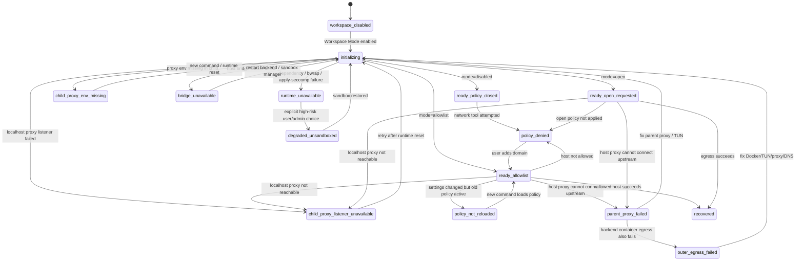

> [Input] `/Users/dmeck/Downloads/Ink & Memory 后端 Docker 部署问题分析报告.md`,
> restored Claude Code source at `/Users/dmeck/project/claude-code-sourcemap/restored-src`,
> local `anthropic-experimental/sandbox-runtime` source at
> `/Users/dmeck/project/sandbox-runtime`, Ink & Memory workspace sandbox docs,
> backend Docker/Remote SSH Compose files, and current Settings-backed sandbox
> network implementation.
> [Output] Handling judgment and interaction/runbook design for Docker-hosted
> Claude Agent Bash/curl sandbox failures where the request reaches the
> sandbox host proxy and is rejected by `blocked-by-allowlist`.
> [Pos] docker-sandbox-egress-incident-plan in `docs/design/claude-agent`
> [Sync] 2026-06-24: initial incident handling judgment and interaction
> design separated child proxy, bridge, parent proxy, TUN, policy deny, and
> runtime startup failure layers.
> [Sync] 2026-06-25: updated with verified `HTTP/1.1 403 Forbidden` and
> `X-Proxy-Error: blocked-by-allowlist`; current incident is classified as
> sandbox network allowlist policy deny, with child proxy path proven alive up
> to the host proxy.
> [Sync] 2026-06-25: open sandbox network mode now omits `sandbox.network`
> instead of writing unsupported `allowedDomains:["*"]`; UI open mode hides
> the HTTP method placeholder while keeping the high-risk warning visible.

# 沙箱 Docker 网络问题处理判断与交互方案设计稿

## 1. Optimized planning prompt used for this round

```text
You are an Expert Prompt Architect.
Convert the current Docker sandbox egress incident into an implementation-ready
engineering diagnosis and interaction design using the verified evidence:
`HTTP/1.1 403 Forbidden` and `X-Proxy-Error: blocked-by-allowlist`.

Goal:
Determine how to handle a Docker-hosted Claude Code Bash sandbox where Bash/curl
reaches the sandbox host proxy but is rejected by sandbox network allowlist
policy when accessing targets such as raw.githubusercontent.com. Produce a
Chinese design draft for product, backend, frontend, Agent, and deployment
behavior.

Tasks:
1. Read the local incident report and separate the historical apply-seccomp
   startup failure from the current runtime egress failure.
2. Inspect restored Claude Code source and sandbox-runtime source to identify
   the Linux network path, policy semantics, and runtime mutation boundaries.
3. Inspect Ink & Memory workspace, service, runner, Settings, Docker Compose,
   and Remote SSH deployment docs to see how sandbox.network is generated and
   where Docker/TUN networking is configured.
4. Treat sandbox network allowlist policy deny as the main hypothesis:
   the proxy env / localhost listener / bridge path is alive enough for the
   request to reach host proxy. Verify active `.claude/settings.json`, domain
   pattern semantics, Settings-to-thread sync, and next-command reload.
5. Draft an interaction plan covering Agent behavior, frontend copy, backend
   events/API, logs, diagnostics, degradation, recovery, security, validation,
   and acceptance criteria.

Constraints:
- Do not treat raw.githubusercontent.com as the only problem.
- Do not fix by blind sleep, unlimited retry, or silent sandbox bypass.
- Do not hard-code business domains, hosts, paths, or policy defaults.
- Distinguish WebFetch permissions from Bash/curl sandbox egress.
- Mark uncertain conclusions as inference or pending verification.
- Keep Settings intent, active sandbox runtime policy, child proxy health, and
  deployment limits visibly separate.

Output:
A technical judgment plus interaction/runbook design with a concrete evidence
chain, short/mid/long-term handling, state machine, diagnostic commands, and
acceptance criteria.
```

## 2. 结论摘要

现场已经验证：

```text
HTTP/1.1 403 Forbidden
X-Proxy-Error: blocked-by-allowlist
```

这把问题从“sandbox 子进程代理出口失败”进一步收束为“sandbox network allowlist policy deny”。更准确的判断是：

1. Bash/curl 请求已经穿过 sandbox 子进程 proxy env、sandbox 内 localhost listener、host bridge，并到达 sandbox-runtime host proxy；否则不会看到 host proxy 返回的 `X-Proxy-Error: blocked-by-allowlist`。
2. 当前不是 `raw.githubusercontent.com` 被外部网络策略、Docker TUN、DNS 或 GitHub 上游拦截；拒绝发生在 sandbox-runtime 的 allowlist 过滤层。
3. 这条证据基本排除了 proxy env 缺失、`127.0.0.1:3128` 完全不通、host bridge 完全未建立这三类主因。
4. 这条证据还不能证明外层 Docker/TUN 一定可访问公网，因为 allowlist deny 在真正连接上游前就返回了 403。
5. 下一步应检查当前 thread 实际生效的 `.claude/settings.json`、Settings 保存到 workspace 的同步、下一条 Bash 命令是否加载了新策略、以及 domain pattern 是否覆盖了目标 host。

处理优先级：

1. 先按 policy deny 处理：确认目标 host 是否出现在 active `allowedDomains` 中，或是否被等价 wildcard 覆盖。
2. 对 `raw.githubusercontent.com`，精确条目 `raw.githubusercontent.com` 可匹配；`*.githubusercontent.com` 也可匹配；`githubusercontent.com` 不匹配其子域名。
3. Settings 保存后必须新发一条 Agent Bash 命令或新开一轮验证；正在运行的 sandbox 子进程不会热更新 env，也不保证使用最新策略。
4. 如果用户选择的是 `open` 模式但仍返回 `blocked-by-allowlist`，优先检查 active thread `.claude/settings.json` 是否仍残留旧的 `sandbox.network`，或本轮命令是否仍使用 allowlist/disabled 旧策略；open 模式应省略 `sandbox.network`。
5. 只有当 allowlist 修正后仍出现 502/reset/timeout，才回到 parent proxy、TUN 或上游连通性排障。

## 3. 已知现象与失败层级判断

### 3.1 历史问题和当前问题不是同一层

问题报告中的历史运行期根因是：

```text
Claude Code -> bwrap --unshare-net -> userns layer 1
bwrap exec apply-seccomp -> apply-seccomp nested userns layer 2
apply-seccomp write /proc/self/setgroups -> EACCES
```

这会导致 sandbox 启动失败，所有 Bash 命令都无法进入真正的执行阶段。`backend/Dockerfile` 已通过 patch `apply-seccomp` 为 passthrough 脚本规避该链路。

当前问题描述已经从“之前 sandbox 不能启用”推进到“sandbox 能运行 Bash/curl，但返回 `HTTP/1.1 403 Forbidden` 和 `X-Proxy-Error: blocked-by-allowlist`”。这说明 sandbox 已经进入 Bash 执行路径，而且请求已经到达 sandbox-runtime host proxy。故障层级从“启动失败”移动到了“sandbox network allowlist policy deny”。

### 3.2 `raw.githubusercontent.com` 不是唯一证据

同一个 curl 失败可能落在不同层级：

| 现象 | 可能层级 | 判断依据 |
|---|---|---|
| 所有公网域名失败，sandbox 内 proxy env 缺失 | sandbox 子进程 proxy env 未注入 | 子进程没有代理入口，network namespace 本身无外网 |
| 所有公网域名失败，proxy env 存在但 `127.0.0.1:3128` / `1080` 不通 | sandbox 内 listener 或 host bridge 未建立 | env 指向的本地代理端口不可用 |
| proxy listener 可连，但 CONNECT reset / 502 / `exit code 56` | parent proxy 或上游 TUN 链路失败 | host proxy 收到请求，但连接上游失败或被中断 |
| proxy 返回 `403` / `blocked-by-allowlist` | sandbox network policy deny | 当前已验证；host proxy 收到了请求并按策略拒绝 |
| 仅 `raw.githubusercontent.com` 失败，其他允许域名成功 | 域名 allowlist 或上游单域名问题 | proxy 有响应，其他域名能通 |
| backend 容器里不进 sandbox 的 `curl` 也失败 | 外层 Docker/TUN/Clash/DNS/宿主机出口 | 与 sandbox 子进程配置无关 |

## 4. 源码分析路径与关键发现

### 4.1 sandbox-runtime 的 Linux 网络模型

`sandbox-runtime/src/sandbox/linux-sandbox-utils.ts` 对 Linux 网络架构写得很直接：

- `bwrap --unshare-net` 创建完全隔离的 network namespace，默认没有出站网络。
- host 侧启动两个 `socat` bridge：Unix socket 到 host HTTP proxy / SOCKS proxy。
- sandbox 内再启动 `socat` 监听 `localhost:3128` 和 `localhost:1080`。
- 子进程通过 proxy env 访问外部网络。

关键实现点：

```text
/Users/dmeck/project/sandbox-runtime/src/sandbox/linux-sandbox-utils.ts
- initializeLinuxNetworkBridge(): host 侧创建 HTTP/SOCKS Unix socket bridge。
- wrapCommandWithSandboxLinux(): 有 network config 时加入 --unshare-net。
- buildSandboxCommand(): sandbox 内先启动 socat listener，再执行用户命令。
- generateProxyEnvVars(): 注入 HTTP_PROXY / HTTPS_PROXY / ALL_PROXY / NO_PROXY。
```

因此“sandbox 没有外网”在 Linux 上并不是异常；它是设计前提。真正要验证的是受控 proxy bridge 是否正确接上。

### 4.2 host proxy 的策略语义只是对照证据

`sandbox-runtime/src/sandbox/sandbox-manager.ts` 的 `filterNetworkRequest()` 先检查 `deniedDomains`，再检查 `allowedDomains`：

```text
denied match -> false
allowed match -> true
no match + no callback -> false
no match + strictAllowlist -> false
no match + callback -> ask callback result
```

`http-proxy.ts` 在拒绝时返回 `403 Forbidden` 和 `X-Proxy-Error: blocked-by-allowlist`。现场已经观察到这组响应，因此当前应按 host proxy 的 policy deny 处理。它说明请求至少已经穿过 child proxy env / local listener / bridge，到达了 host proxy；当前不应再把 proxy env 缺失、listener 完全不可用或 bridge 完全未建立作为主因。

### 4.3 dynamic update 的边界

Claude Code `sandbox-adapter.ts` 会订阅 settings 变化，并调用：

```text
BaseSandboxManager.updateConfig(newConfig)
```

这能更新 host proxy 的过滤规则。但它不能对一个已经启动的 `bwrap --unshare-net` 子进程补网卡、补 socket bind、补 env，也不能修复已经断开的 bridge 进程。已经运行的 Bash 命令只能继续使用启动时拿到的环境。网络策略变更的产品语义应定义为：

```text
下一次 sandbox command wrap / 新一轮 Agent Bash 执行生效。
```

如果用户在一个长时间运行的命令中变更网络策略，正确交互是提示重试或重启该命令，而不是固定 sleep 后假装会热更新。

### 4.4 WebFetch 与 Bash/curl 是两条链路

恢复源码 `WebFetchTool/preapproved.ts` 明确写着：WebFetch 预批准域名只适用于 WebFetch，sandbox network 不继承这份列表，因为 Bash/curl/POST/上传能力存在更高的数据外泄风险。

Claude Code `sandbox-adapter.ts` 会把以下来源合并进 sandbox runtime 的 `allowedDomains`：

- `settings.sandbox.network.allowedDomains`
- `permissions.allow` 中的 `WebFetch(domain:...)`

但这仍然是 sandbox proxy 的 host 过滤规则，不是 Docker 网络或 TUN 配置。

### 4.5 Ink & Memory 当前实现

Ink & Memory 已经具备 Settings 到 thread-local `.claude/settings.json` 的链路：

```text
backend/routers/system_config.py
- 接收 sandbox_network_mode / sandbox_network_allowed_domains
- 清洗域名，拒绝裸 *

backend/claude_agent/service.py
- 每轮读取 system_config
- workspace_enabled=true 时调用 get_or_create_workspace(... sandbox_network_*)
- AgentRunOptions 带 sandbox_network_mode 给 runner 的 disabled guard

backend/libs/claude_agent_kit/server/workspace.py
- 写入 sandbox.network
- disabled -> allowedDomains=[] + deniedDomains=["*"]
- allowlist -> allowedDomains=[...]
- open -> 省略 sandbox.network，不向 runtime 写入网络配置

backend/libs/claude_agent_kit/server/agent_runner.py
- sandbox_network_mode="disabled" 时，在 PreToolUse 硬拒绝 WebFetch/WebSearch/常见 Bash 网络命令
```

### 4.6 open 模式处理决策

`sandbox-runtime` 的 config schema 只允许 `deniedDomains` 使用裸 `*`，`allowedDomains` 的 schema 不允许裸 `*`。因此 Ink & Memory 不再用 `allowedDomains:["*"]` 表达开放网络。

当前决策：

- `allowlist` 模式继续写入 `sandbox.network.allowedDomains=[...]`。
- `disabled` 模式继续写入 `allowedDomains=[]` + `deniedDomains=["*"]`，并由 runner PreToolUse 硬拒绝网络工具。
- `open` 模式省略整个 `sandbox.network`，不向 sandbox runtime 传递不支持的裸 `*` allowlist domain。

因此，在已经看到 `blocked-by-allowlist` 的场景下，如果 UI/Settings 显示为 open 但新命令仍返回 403，应优先检查 active thread `.claude/settings.json` 是否仍残留旧 `sandbox.network`、当前命令是否加载了旧策略、或 workspace refresh 是否尚未用 open 模式重写 settings。

## 5. 根因判断

### 5.1 最可能根因

最可能根因是 active sandbox network allowlist 没有放行当前目标 host，或 Settings 变更没有进入本轮实际生效的 sandbox runtime policy。

证据链：

1. 现场已经观察到 `HTTP/1.1 403 Forbidden` 和 `X-Proxy-Error: blocked-by-allowlist`。
2. 该响应由 sandbox-runtime host proxy 返回，说明请求已经到达 policy filter。
3. `filterNetworkRequest()` 在 `allowedDomains` 未命中且无 callback 或 strict allowlist 时返回 deny。
4. `matchesDomainPattern()` 对普通域名做精确匹配；`*.example.com` 只匹配严格子域名；裸 `example.com` 不覆盖 `a.example.com`。
5. 因此当前更可能是 `raw.githubusercontent.com` 未进入 active allowlist、wildcard 写法没有覆盖目标、设置未同步到当前 thread、新命令未加载最新策略，或 open 模式下 active settings 仍残留旧的 `sandbox.network`。

### 5.2 次级或排除性判断

| 根因 | 说明 | 需要的证据 |
|---|---|---|
| active allowlist 缺少目标 host | 当前已返回 `blocked-by-allowlist` | `.claude/settings.json` 中没有 `raw.githubusercontent.com` 或覆盖它的 wildcard |
| wildcard 语义误解 | `githubusercontent.com` 不覆盖 `raw.githubusercontent.com`；需要精确 host 或 `*.githubusercontent.com` | 对照 `matchesDomainPattern()` |
| Settings 没有生效到本轮命令 | `.claude/settings.json` 已变，但当前 Bash 子进程使用旧策略 | 新开一轮或新命令后行为变化 |
| open 模式旧配置残留 | 旧实现曾写入 `allowedDomains:["*"]`，新实现应省略 `sandbox.network` | UI 为 open 但 active settings 仍存在 `sandbox.network`，host proxy 仍返回 allowlist 403 |
| parent proxy / 环境代理错误 | sandbox-runtime host proxy 会读取父进程 `HTTP_PROXY/HTTPS_PROXY/NO_PROXY` 并可能链到上游 | 仅在放行后出现 CONNECT 502 / timeout 时成立 |
| 外层 `tun-proxy` / Docker 出口失败 | backend 共享 `network_mode: service:tun-proxy`，外层容器本身可能不能出站 | 仅在 policy 放行后仍无法上游连接，或 backend 非 sandbox curl 也失败时成立 |
| `socat` / sandbox listener 或 host bridge 异常 | 当前 403 已基本排除“完全不可用”，但仍可能存在间歇问题 | 同一轮命令有时不能到达 host proxy，或 debug 日志显示 bridge died |

### 5.3 需要继续验证的问题

1. 当前 thread 的 `.claude/settings.json` 中 `sandbox.network.allowedDomains` 实际是什么。
2. Settings 中保存的是 `allowlist` 还是 `open`，后端写入 workspace 的内容是否与 UI 一致。
3. 如果是 allowlist，是否包含精确 `raw.githubusercontent.com`，或包含 `*.githubusercontent.com`。
4. 如果是 open，当前 thread `.claude/settings.json` 是否省略 `sandbox.network`，以及本轮命令是否加载了省略后的新 settings。
5. Settings 保存后是否新发了 Agent Bash 命令或新开一轮，而不是复用旧命令。
6. policy 放行后是否还会出现 502/reset/timeout；只有这时才继续查 parent proxy、TUN 和 Docker 出口。

## 6. 处理方案

### 6.1 短期 Workaround

目标：不改变安全边界的前提下快速定位层级。

1. 先记录当前 403 证据，并把它归类为 policy deny：

   ```text
   HTTP/1.1 403 Forbidden
   X-Proxy-Error: blocked-by-allowlist
   ```

   这说明请求已经到达 sandbox-runtime host proxy。当前不要重启 TUN 或继续查 DNS 作为第一动作。

2. 检查当前 thread 实际生效的 `.claude/settings.json`，而不是只看 UI：

   ```bash
   docker exec ink-backend sh -lc '
   set -eux
   find "${AGENT_CWD:-/app/workspace}" -maxdepth 5 -path "*/.claude/settings.json" -type f -print
   '
   ```

   具体 thread 路径应由后端 session/thread 上下文确定，不能在产品逻辑里硬编码。

3. 如果目标是验证 `raw.githubusercontent.com`，allowlist 至少需要命中以下任一模式：

   ```text
   raw.githubusercontent.com
   *.githubusercontent.com
   ```

   不要写成：

   ```text
   githubusercontent.com
   ```

   因为 sandbox-runtime 的 `matchesDomainPattern()` 对普通域名做精确匹配，裸父域不覆盖子域。

4. 如果本次任务需要 GitHub 下载链路，可临时让用户显式加入相关 host：

   ```text
   github.com
   raw.githubusercontent.com
   objects.githubusercontent.com
   codeload.github.com
   github-releases.githubusercontent.com
   ```

   这些域名不应做成产品默认值，只用于本次用户显式排障。

5. Settings 变更后，提示用户重试下一条 Agent Bash 命令或新开一轮，不承诺正在运行的命令热更新。

6. 如果新命令仍返回 `blocked-by-allowlist`：

   - 先确认 `.claude/settings.json` 是否写入了预期 host。
   - 再确认当前 Claude Code 进程是否加载了该 thread workspace。
   - 如果 UI 是 open，验证 active settings 是否已省略 `sandbox.network`，而不是残留旧 allowlist/disabled 配置。

7. 只有当目标 host 被明确放行后仍出现 502/reset/timeout，才继续检查 parent proxy、TUN、Docker DNS 或宿主机出口。

8. 如必须恢复用户任务，可临时关闭 Workspace Mode 或允许 unsandboxed Bash，但必须显示高风险确认，并明确只依赖外层 Docker/TUN 隔离。这不是默认推荐路径。

### 6.2 中期修复方案

1. 增加 sandbox network policy 诊断 API 或内部诊断函数：

   ```text
   GET /api/claude-agent/sandbox-diagnostics?thread_id=...
   ```

   返回非敏感字段：

   ```json
   {
     "workspaceEnabled": true,
     "sandboxNetworkMode": "allowlist",
     "allowedDomainsCount": 4,
     "settingsPathExists": true,
     "targetHost": "raw.githubusercontent.com",
     "targetHostAllowed": false,
     "matchedAllowedDomain": null,
     "proxyHttpStatus": 403,
     "proxyError": "blocked-by-allowlist",
     "proxyEnvPresent": true,
     "proxyHttpPortReachable": true,
     "proxySocksPortReachable": null,
     "containerRuntime": "linux-container",
     "usesTunProxyNamespace": true,
     "lastWorkspaceSettingsSyncAt": "2026-06-25T10:00:00Z"
   }
   ```

   不返回 token、完整 env、用户隐私路径列表或代理认证信息。

2. 后端 runner 捕获 Bash 网络失败时增加分类 notes：

   ```text
   sandbox_network_policy_denied
   sandbox_network_policy_not_reloaded
   sandbox_network_open_mode_not_reloaded
   sandbox_child_proxy_env_missing
   sandbox_child_proxy_listener_unavailable
   sandbox_network_bridge_unavailable
   sandbox_network_parent_proxy_failed
   outer_container_egress_failed
   sandbox_network_unknown
   ```

3. 前端把失败文案从“网络失败”拆成：

   - “沙箱网络策略拒绝”
   - “策略已保存，但当前命令尚未加载”
   - “开放网络模式尚未加载到当前命令”
   - “沙箱网络出口未建立”
   - “沙箱子进程未拿到代理环境”
   - “沙箱本地代理监听不可用”
   - “外层容器无法联网”
   - “策略已保存，需重试下一条命令生效”

4. 对 `open` 模式做显式验证：保存后 active thread settings 不应包含 `sandbox.network`；若仍返回 allowlist 403，优先归类为旧配置未刷新或当前命令未加载新策略。

5. 为 Remote SSH / Docker 文档增加 `blocked-by-allowlist` 和非 403 网络失败两条排障路径，避免继续把 policy deny、proxy 出口失败和 `apply-seccomp` 启动失败混在一起。

### 6.3 长期架构方案

1. 将 sandbox runtime 状态建模成产品状态，而不是只靠 stderr：

   ```text
   unsupported
   initializing
   child_proxy_env_missing
   child_proxy_listener_unavailable
   bridge_unavailable
   parent_proxy_failed
   outer_egress_unavailable
   ready_policy_closed
   ready_policy_allowlist
   ready_policy_open_requested
   runtime_unavailable
   degraded_unsandboxed
   ```

2. 引入一次性网络探针，但必须由用户或管理员触发，不在每轮自动访问公网。探针目标由配置提供，不硬编码业务域名：

   ```text
   INK_AGENT_SANDBOX_NETWORK_PROBE_URL
   ```

3. 将 Settings 策略意图、active runtime policy 和 runtime egress 能力分开持久化：

   | 字段 | 含义 |
   |---|---|
   | `sandbox_network_mode` | 用户/产品策略意图 |
   | `sandbox_network_active_policy` | 当前 thread 实际加载的 allowlist/denylist |
   | `sandbox_network_policy_match` | 最近一次目标 host 的匹配结果 |
   | `sandbox_child_proxy_status` | 最近一次诊断得到的子进程代理出口现实 |
   | `sandbox_network_last_error` | 最近一次分类错误 |

4. 对 Docker + TUN 出站提供部署级健康检查，明确 backend 容器出口和 sandbox 子进程出口是两层。

## 7. 交互方案设计稿

### 7.1 设计目标

1. 用户能知道是“策略拒绝”还是“子进程代理出口坏了”。
2. Agent 遇到网络失败时先诊断层级，不盲目重复 curl。
3. 前端 Settings 清楚表达“这是网络策略意图，实际以当前 thread 加载到 sandbox runtime 的 policy 为准”。
4. 后端日志能复盘：哪个 thread、哪个 mode、哪个 host、失败在哪一段。
5. 安全边界不因恢复任务而被静默放宽。

### 7.2 用户场景

| 场景 | 用户目标 | 系统行为 |
|---|---|---|
| 用户把 Sandbox Network 改成 allowlist | 允许 Agent Bash 下载指定依赖 | 保存策略，提示下一条命令生效，并显示域名匹配规则 |
| 用户改成 open 后仍返回 `blocked-by-allowlist` | 判断 open 是否实际生效 | 检查 active `.claude/settings.json` 是否仍残留 `sandbox.network`，以及当前命令是否加载旧策略 |
| Agent 执行 `curl raw.githubusercontent.com` 返回 403 | 继续任务或说明原因 | Agent 直接进入 allowlist 诊断，不再先查 proxy env |
| 运维部署 Remote SSH | 区分 allowlist 403、child proxy egress 和外层 TUN | 文档先按 proxy 403 分类，再提供 sandbox 子进程和容器外层排障命令 |
| 安全管理员关闭网络 | 确保没有网络工具绕过 | PreToolUse hard deny + sandbox deniedDomains `*` |

### 7.3 状态机



### 7.4 错误分类

| Code | 判断条件 | 用户文案 |
|---|---|---|
| `sandbox_child_proxy_env_missing` | sandbox 子进程缺少 `HTTP_PROXY` / `HTTPS_PROXY` / `ALL_PROXY` | “沙箱子进程没有拿到代理环境，因此无法从隔离网络命名空间访问外网。” |
| `sandbox_child_proxy_listener_unavailable` | proxy env 存在，但 `127.0.0.1:3128` / `1080` 不通 | “沙箱本地代理监听不可用。当前不是域名配置问题，需要重建 sandbox 运行时代理链路。” |
| `sandbox_network_bridge_unavailable` | sandbox listener 背后的 host bridge socket 缺失或退出 | “沙箱网络桥接未建立。请检查 sandbox-runtime bridge / socat 进程。” |
| `sandbox_network_parent_proxy_failed` | host proxy CONNECT 502/timeout/reset | “沙箱代理已收到请求，但连接上游失败。请检查 parent proxy、TUN 或上游代理。” |
| `sandbox_network_policy_denied` | proxy 返回 403 / blocked-by-allowlist | “沙箱网络策略阻止了该域名。请在设置中加入目标域名，或改用更开放的策略。” |
| `sandbox_network_policy_not_reloaded` | Settings 已保存但当前命令仍使用旧策略 | “网络策略已保存，但当前命令尚未加载新策略。请新发一条 Agent Bash 命令后重试。” |
| `sandbox_network_open_mode_not_reloaded` | UI 为 open，但 active policy 仍返回 blocked-by-allowlist | “开放网络模式尚未进入当前沙箱策略。请检查 thread settings 是否已省略 sandbox.network，并新发一条 Agent Bash 命令。” |
| `outer_container_egress_failed` | backend 容器非 sandbox curl 失败 | “后端容器本身无法访问外网。请检查 Docker/TUN/代理/DNS。” |
| `sandbox_network_pending_reload` | Settings 刚保存，当前命令仍在运行 | “网络策略已保存，将在下一次 Agent Bash 命令生效。请重试该命令。” |
| `sandbox_runtime_unavailable` | bwrap/apply-seccomp/socat 依赖失败 | “沙箱运行时不可用，Bash 无法在受控环境中执行。” |
| `sandbox_network_unknown` | 证据不足 | “网络失败原因未能自动归类。请导出诊断日志。” |

### 7.5 前端提示文案

Settings 保存成功：

```text
沙箱网络策略已保存。新的 Bash/curl/git/npm 命令会使用更新后的策略；已经在运行的命令需要重试。
```

策略拒绝：

```text
沙箱网络策略阻止了访问 {host}。这不同于 WebFetch 域名权限；它影响 Bash、curl、git、npm 等子进程。
当前请求已经到达沙箱代理，但没有命中 active allowlist。请确认当前 thread 的 `.claude/settings.json` 包含精确域名或匹配的 wildcard，并在保存后新发一条命令重试。
```

bridge 不可用：

```text
沙箱子进程代理出口未建立。当前沙箱的网络命名空间没有直接外网，需要通过内部代理桥接。请重试新一轮命令，或让管理员检查 proxy env、localhost listener、bridge socket 和 socat 运行状态。
```

外层容器不可用：

```text
后端容器当前无法访问外网，因此沙箱也无法访问。请检查 Docker 网络、TUN 代理、DNS 或宿主机出口策略。
```

高风险降级：

```text
关闭沙箱或允许非沙箱 Bash 会放宽 Claude Code 的内层隔离，只剩外层 Docker/部署策略保护。仅在你理解风险并需要临时恢复任务时使用。
```

### 7.6 Agent 行为策略

Agent 在规划需要网络的任务前，应把用户需求压缩成可执行计划，并显式标记是否需要 Bash/curl/git/npm 出站。遇到失败后：

1. 不把 `raw.githubusercontent.com` 当成唯一原因。
2. 不做无限 retry；最多一次原命令重试，然后进入诊断。
3. 优先判断当前工具链：
   - WebFetch 失败：看 WebFetch domain permission。
   - Bash/curl/git/npm 返回 `blocked-by-allowlist`：看 sandbox network allowlist。
   - Bash/curl/git/npm 返回 reset/502/timeout：看 sandbox 子进程代理出口和 parent proxy。
   - `gh: command not found`：看运行时镜像，不看网络。
4. 诊断顺序固定：
   - 如果有 proxy 403，先判断目标域名是否被 active policy deny。
   - allowlist 模式检查当前 thread `.claude/settings.json` 中的 `allowedDomains`。
   - open 模式检查当前 thread `.claude/settings.json` 是否省略 `sandbox.network`。
   - 检查 Settings 保存后是否新发 Agent Bash 命令。
   - 只有在非 403 的 502/reset/timeout 下，再判断 parent proxy、TUN 和 backend 容器外层出口。
5. 不主动要求用户关闭 sandbox；只在确认 runtime 级阻断且用户任务必须继续时，提示高风险临时降级。

### 7.7 后端事件与 API 建议

新增 SSE 事件建议：

```json
{
  "type": "sandbox-network-status",
  "threadId": "uuid",
  "toolCallId": "toolu_xxx",
  "status": "sandbox_network_policy_denied",
  "networkMode": "allowlist",
  "host": "raw.githubusercontent.com",
  "evidence": {
    "curlExitCode": 0,
    "proxyEnvPresent": true,
    "proxyHttpPortReachable": true,
    "proxySocksPortReachable": null,
    "proxyHttpStatus": 403,
    "proxyError": "blocked-by-allowlist",
    "targetHostAllowed": false,
    "matchedAllowedDomain": null
  }
}
```

新增诊断 API 建议：

```text
GET /api/claude-agent/sandbox-diagnostics?thread_id={thread_id}
```

返回内容只包含策略意图和健康状态，不执行公网探针，除非未来增加显式用户触发参数：

```text
?run_network_probe=true
```

探针 URL 必须来自环境配置或管理员配置，不能写死到业务域名。

### 7.8 日志与诊断字段

建议结构化日志字段：

| 字段 | 示例 | 说明 |
|---|---|---|
| `event` | `sandbox_network_failure` | 事件名 |
| `thread_id` | UUID | 当前 thread |
| `tool_call_id` | `toolu_xxx` | 对应工具调用 |
| `sandbox_network_mode` | `allowlist` | Settings 策略 |
| `workspace_enabled` | `true` | Workspace Mode |
| `host` | `raw.githubusercontent.com` | 目标 host，不记录完整 URL query |
| `curl_exit_code` | `0/56/7` | 如可解析；proxy 403 时 curl 进程可能仍为 0，取决于是否使用 `--fail` |
| `proxy_env_present` | `true/false` | sandbox 子进程是否有 proxy env |
| `proxy_http_port_reachable` | `true/false/null` | `127.0.0.1:3128` 是否可达 |
| `proxy_socks_port_reachable` | `true/false/null` | `127.0.0.1:1080` 是否可达 |
| `proxy_status` | `403/502/null` | proxy 可见状态 |
| `proxy_error` | `blocked-by-allowlist` | proxy 错误头或归一化错误 |
| `target_host_allowed` | `true/false/null` | 目标 host 是否命中 active allowlist |
| `matched_allowed_domain` | `*.githubusercontent.com/null` | 命中的 allowlist pattern |
| `container_runtime` | `linux-container` | runtime 判断 |
| `uses_tun_proxy_namespace` | `true` | Compose 部署上下文 |
| `classification` | `sandbox_network_policy_denied` | 错误分类 |

不要记录：

- `Proxy-Authorization`
- token / cookie / API key
- 完整带 query 的 URL
- 用户 env var 值

### 7.9 降级与恢复流程

| 阶段 | 操作 | 风险 |
|---|---|---|
| 诊断 | 只读检查 active settings、目标 host 匹配结果、proxy 403 证据 | 低 |
| 策略修正 | proxy 403 时保存 allowlist 域名并新发命令重试 | 低 |
| runtime 重试 | 仅在 active policy 正确但仍旧策略生效时，新开 Agent 轮次或重启 backend | 中 |
| 部署修复 | 修复 TUN/Clash/DNS/Docker capability/socat | 中 |
| 临时关闭 sandbox | 仅用户确认后恢复任务 | 高 |

恢复判定：

```text
当前 thread settings 包含目标 host 或匹配 wildcard
新发 Agent Bash 命令后 raw.githubusercontent.com 不再返回 blocked-by-allowlist
如果仍失败，失败类型从 403 policy deny 转为 502/reset/timeout 等上游问题
没有绕过 sandbox 或静默切换到 unsandboxed Bash
```

### 7.10 安全边界说明

1. `sandbox.network` 是 Bash 子进程网络策略，不是 WebFetch 权限的替代。
2. `blocked-by-allowlist` 是 sandbox network policy 证据，不应通过关闭 sandbox 静默绕过。
3. “开放网络”也不应该变成产品默认值；若提供 open，需要验证 active thread settings 已省略 `sandbox.network`，而不是残留 allowlist/disabled 策略。
4. 不允许通过固定 sleep 等待 DB/runtime 状态同步。
5. 不允许在 Agent 失败后静默使用 `dangerouslyDisableSandbox`。
6. 如果通过关闭 Workspace Mode 恢复任务，必须在 UI 和日志里记录这是高风险降级。

## 8. 验证计划

### 8.1 部署边界验证

```bash
docker compose -f docker-compose.yml config | sed -n '/ink-backend:/,/ink-frontend:/p'
docker compose -f deploy/remote-ssh/docker-compose.yml config | sed -n '/ink-backend:/,/ink-frontend:/p'
```

检查：

- backend 使用 `network_mode: service:tun-proxy`
- backend 有 bubblewrap 所需 capabilities/security options
- `AGENT_CWD` 指向持久化 workspace

### 8.2 active allowlist 验证

```bash
docker exec ink-backend sh -lc '
set -eux
find "${AGENT_CWD:-/app/workspace}" -maxdepth 5 -path "*/.claude/settings.json" -type f -print
'
```

检查当前 thread 对应 settings，而不是任意 thread：

- `sandbox.network.allowedDomains` 是否包含 `raw.githubusercontent.com`。
- 如果使用 wildcard，是否为 `*.githubusercontent.com`，而不是 `githubusercontent.com`。
- 如果 UI 为 open，实际 settings 中不应存在 `sandbox.network`。

### 8.3 policy deny 复现与修复验证

通过新发 Agent Bash 命令执行：

```bash
curl -Iv --connect-timeout 10 https://raw.githubusercontent.com/ 2>&1 | tail -80
```

预期：

- 修复前能看到 `HTTP/1.1 403 Forbidden` 和 `X-Proxy-Error: blocked-by-allowlist`。
- 添加匹配 host 并新发命令后，不应再看到 `blocked-by-allowlist`。
- 如果之后失败变成 502/reset/timeout，再进入 parent proxy / TUN / Docker 出口排障。

### 8.4 上游出口验证

仅在目标 host 已被 policy 放行但请求仍失败时执行：

```bash
docker exec ink-backend sh -lc '
set -eux
curl -Iv --connect-timeout 10 https://example.com/ 2>&1 | tail -80
curl -Iv --connect-timeout 10 https://raw.githubusercontent.com/ 2>&1 | tail -80
'
```

这里用于判断 Docker/TUN/Clash/DNS/宿主机出口，不用于解释已明确的 `blocked-by-allowlist`。

### 8.5 回归测试建议

| 测试 | 断言 |
|---|---|
| policy denied classifier | `HTTP 403` + `X-Proxy-Error: blocked-by-allowlist` 分类为 `sandbox_network_policy_denied` |
| domain pattern matching | `raw.githubusercontent.com` 精确命中；`*.githubusercontent.com` 覆盖；`githubusercontent.com` 不覆盖 |
| settings-to-thread sync | 保存 allowlist 后，对应 thread `.claude/settings.json` 写入目标 host |
| next-command reload | 新发 Agent Bash 命令后使用新策略 |
| open mode settings omission | UI open 后 active `.claude/settings.json` 不包含 `sandbox.network`，新命令不再因旧 allowlist 返回 403 |
| child proxy env injection | 非 403 网络错误时，sandbox Bash 子进程可见 proxy env |
| child proxy local listener | 非 403 网络错误时，显式 `--proxy http://127.0.0.1:3128` 访问 `example.com` 成功 |
| parent proxy failure classifier | CONNECT reset/502/timeout 能分类为 parent proxy / TUN 问题 |
| disabled mode | PreToolUse 硬拒绝 WebFetch/WebSearch/常见 Bash 网络命令 |
| allowlist mode | 具体域名写入 `.claude/settings.json` |
| failure classifier | curl 403/502/56/7 能映射到不同分类 |

## 9. 验收标准

1. 文档能让工程师在 10 分钟内把 `HTTP 403` + `X-Proxy-Error: blocked-by-allowlist` 归类为 sandbox network policy deny。
2. 前端不会把所有失败都显示为“域名被拦”。
3. Agent 遇到 `blocked-by-allowlist` 时不会先查 TUN/DNS/proxy env，而会检查 active allowlist、domain pattern 和下一命令生效边界。
4. Settings 保存文案明确“下一条 Bash 命令生效”。
5. 日志能关联 thread、tool call、network mode、host、proxy status、proxy error、target host allow result、matched pattern 和分类。
6. 没有把 GitHub 域名写成默认业务策略。
7. 没有默认关闭 sandbox 或静默使用非 sandbox Bash。

## 10. 风险与开放问题

1. `blocked-by-allowlist` 证明请求到达 host proxy，但不证明上游 TUN/GitHub 一定可达；放行后仍需观察是否出现 502/reset/timeout。
2. `raw.githubusercontent.com` 需要精确条目或 `*.githubusercontent.com`；裸 `githubusercontent.com` 不覆盖它。
3. 旧版本或旧 thread settings 可能仍残留 `allowedDomains:["*"]`；open 模式修复后应通过 workspace refresh 删除/省略整个 `sandbox.network`。
4. sandbox-runtime 的 parent proxy 会读取进程环境中的 `HTTP_PROXY/HTTPS_PROXY/NO_PROXY`；如果放行后出现上游错误，backend env 中代理配置也会影响 sandbox host proxy。
5. Docker `network_mode: service:tun-proxy` 让 backend 出站依赖 TUN sidecar；sidecar 健康不等于规则和上游可用。
6. 关闭 `apply-seccomp` 虽能规避 nested userns，但会降低 Unix socket 创建限制；该风险应继续在部署文档中显式保留。
