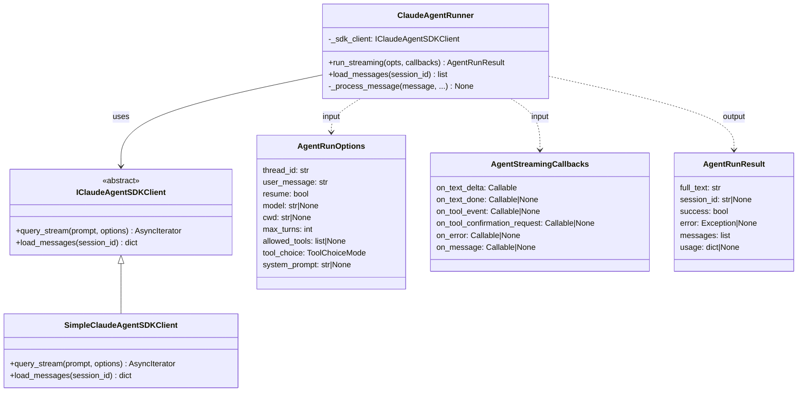
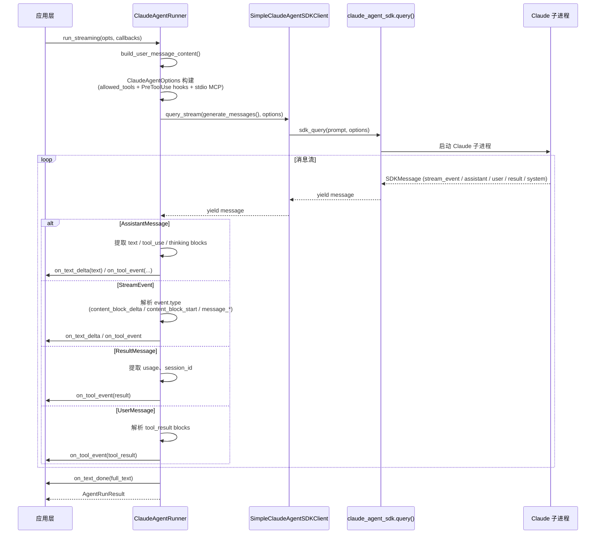
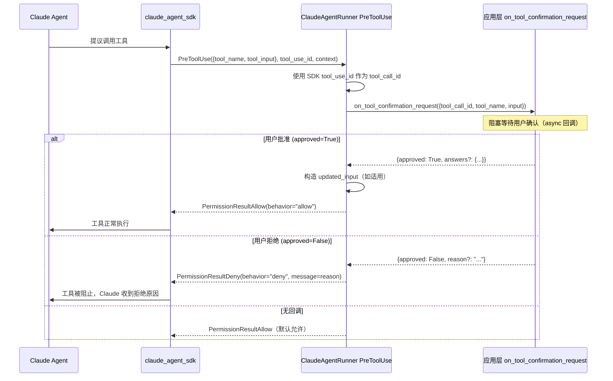
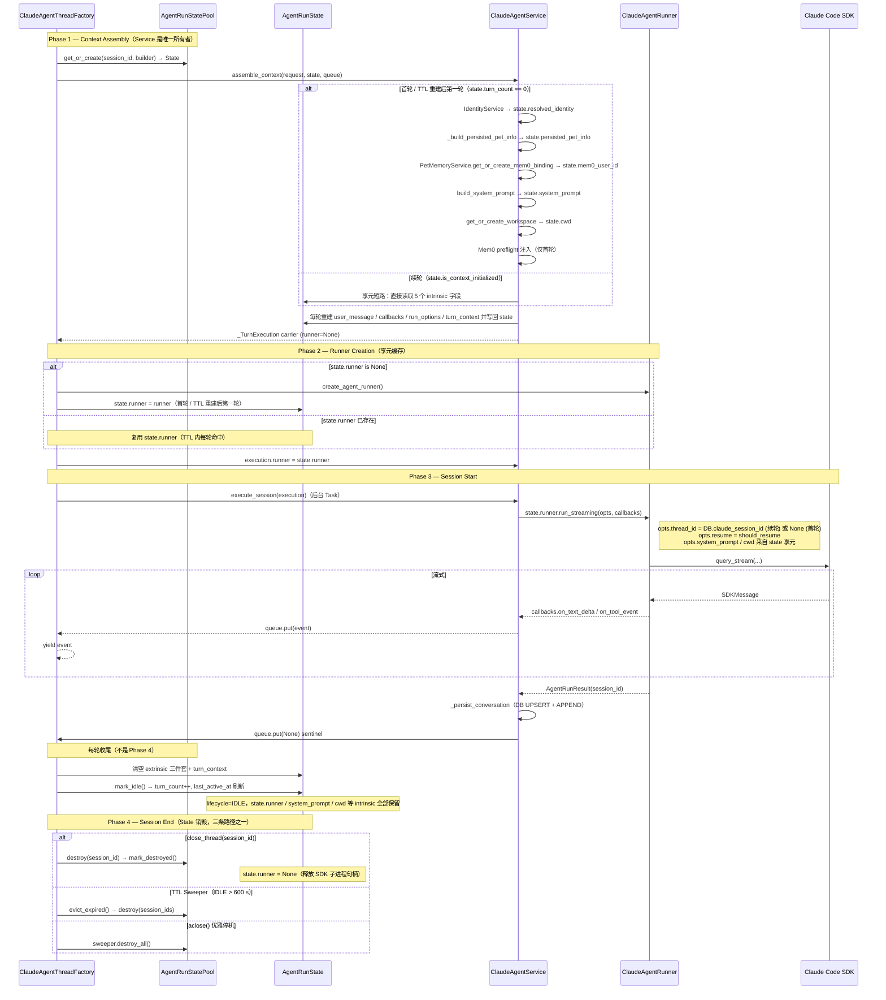

> **迁移来源**: Pawkeyland docs/app/design/ClaudeAgentRunner 模块设计.md — 路径已适配 Ink & Memory 工程规范。
> **[Sync] 2026-06-07**: 补充 auto 模式敏感度分流策略：workspace `files/` 内置文件工具和明确低敏查询工具显式 allow；当时状态切换类工具也归入高敏确认，该分类已被 2026-06-09 的 `switch_editor` 低敏策略取代。
> **[Sync] 2026-06-09**: 权限策略独立为 [`claude-agent-permission-policy.md`](./claude-agent-permission-policy.md)；`Skill` 和 `switch_editor` 归入低敏 auto allow。
> **[Sync] 2026-06-13**: Bash workspace confinement is delegated to Claude
> Code's native `sandbox` settings in each thread `.claude/settings.json`;
> Runner `PreToolUse` does not parse shell paths for sandboxing.
> **[Sync] 2026-06-13**: Settings full-access mode keeps
> `AskUserQuestion` / `mcp__user__ask_user` on the frontend confirmation path
> so answer forms can populate `updatedInput`.
> **[Sync] 2026-06-09**: Settings `im_full_access_enabled` 接入 Runner；开启后在 `.editor/` 虚拟索引重定向之后，对除问答表单外的已暴露工具返回显式 PreToolUse allow。
> **[Sync] 2026-06-21**: Settings `sandbox_network_mode="disabled"` is
> enforced before full-access and low-sensitivity allow decisions; network
> tools receive explicit PreToolUse deny.
> **[Sync] 2026-07-26**: SDK 迁移 `claude-code-sdk 0.0.25` → `claude-agent-sdk
> 0.2.128`——`ClaudeAgentOptions` 改名与依赖版本更新（§依赖表）；
> `debug_stderr` 废弃改为 `options.stderr` 回调捕获 CLI stderr；
> 新 transport 默认优先 bundled CLI（`cli_path` 可覆盖）；hooks /
> extra_args / resume / partial messages / ClaudeSDKClient API 不变。
> **[Sync] 2026-07-26**: HOTFIX — hook 输出改为纯字典字面量：
> `HookJSONOutput` 在 0.2.128 为 TypedDict Union 不可调用，构造调用曾导致
> PostToolUse 观察器崩溃与 PreToolUse 决策静默丢失（§5 异常映射、
> §类型映射表已更新为 dict 契约）。

# ClaudeAgentRunner 模块设计

> 来源：从 TypeScript 迁移自 `glide-the/claude-agent-next-kit → app/lib/claude-agent-kit`
> 迁移语言：TypeScript → Python
> 落地路径：`backend/claude_agent/`

---

## 1. 迁移背景与目标

| 项目 | 说明 |
|------|------|
| 源模块 | `glide-the/claude-agent-next-kit` 的 `app/lib/claude-agent-kit`（TypeScript / Next.js） |
| 目标模块 | `backend/claude_agent/`（Python 3.12） |
| 核心依赖 | `claude-agent-sdk >= 0.2.128`（Anthropic 官方 Python Agent SDK，2026-07-26 自 `claude-code-sdk 0.0.25` 迁移——旧包 can_use_tool 控制响应序列化方言与新版 CLI 不兼容） |
| 迁移目标 | 1. 等价功能的 Python 实现；2. 在 `docs/app/design/` 中完整记录模块设计 |

---

## 2. 模块目录结构

```
backend/claude_agent/
├── __init__.py                          # 顶层 re-export
├── types.py                             # 类型定义（dataclass / Protocol / Literal）
├── messages/
│   ├── __init__.py
│   └── build_user_message_content.py   # 构建用户消息 content blocks
├── session_files.py                     # JSONL 会话文件读写工具
├── simple_cas_client.py                 # SDK query() 适配器
└── agent_runner.py                      # ClaudeAgentRunner（核心类）
```

---

## 3. 核心类图



---

## 4. 数据流：run_streaming



### 4.1 SDK 异常诊断与后台堆栈

- `run_streaming` 捕获 `BaseException`，先用 `_is_pure_cancellation(exc)` 区分真实取消；纯取消继续抛出，不进入 `on_error`。
- 非取消异常会被归一化为 `run_error`：普通 `Exception` 保持原类型；`BaseExceptionGroup` 和非取消 `BaseException` 转为可序列化的 `Exception`，便于 SSE error frame 消费。
- Runner 会向 `run_error.__notes__` 写入 `sdk_call_context`，并在有 CLI stderr 时追加 `cli_stderr`。
- 后台日志使用 `logger.exception("Claude SDK run failed", ...)` 输出结构化字段和 traceback；随后才调用 `callbacks.on_error(run_error)`。

---

## 5. 工具确认流程（PreToolUse hook）

Claude Code 的 `allowed_tools` 是预批准规则，不是单纯的工具可见性列表。
Runner 注册 `PreToolUse` hook，在工具执行前拿到 SDK 提供的 `tool_use_id`、`tool_name` 和 `tool_input`。先处理 `.editor/` 虚拟索引读取重定向；如果 Settings `sandbox_network_mode="disabled"`，则对 `WebFetch` / `WebSearch` 和常见 Bash 网络命令返回显式 deny；随后才考虑 Settings `im_full_access_enabled=true` 的显式 allow。问答工具必须继续进入 `on_tool_confirmation_request`，因为前端确认窗口负责收集用户答案并写回 `updatedInput`。否则 `auto` 模式先对当前 workspace `files/` 下的内置文件工具返回显式 allow；随后对明确的低敏工具（内置 Read/Glob/Grep/LS/TodoRead/WebFetch/WebSearch、会话查询、memory/necklace 只读查询、`Skill`、`switch_editor` 等；关闭网络模式除外）返回显式 allow；剩余执行/写入/交互工具进入 `on_tool_confirmation_request` 侧路。用户批准后，Runner 返回显式 allow，避免 hook fall-through 与 Claude Code 文件权限层语义不一致。完整矩阵见 [`claude-agent-permission-policy.md`](./claude-agent-permission-policy.md)。

> _(Pawkeyland 专属，Ink & Memory 中不适用)_

当前 Runner 的 tool_choice 权限配置：

| tool_choice | `ClaudeAgentOptions.allowed_tools` | `PreToolUse` | 目的 |
|---|---:|---|---|
| `auto` | `DEFAULT_ALLOWED_TOOLS` / request override | `files/` 内置文件工具、低敏查询工具、`Skill`、`switch_editor` 显式 allow；高敏工具等待 `on_tool_confirmation_request` | Agent 可生成 workspace 产物并查询/选择上下文；执行/写入/交互动作需前端确认后才授予本次工具权限 |
| `manual` | `DEFAULT_ALLOWED_TOOLS` / request override | 等待 `on_tool_confirmation_request` | 调试或敏感工具确认侧路 |
| `none` | `[]` + `extra_args["tools"] = ""` | 不暴露工具 | 通过 Claude CLI `--tools ""` 禁用可用工具 |

当 `im_full_access_enabled=true` 且 `tool_choice!="none"` 时，`PreToolUse` 在 `.editor/` 安全重定向之后跳过上表矩阵并直接返回显式 allow；`AskUserQuestion` / `mcp__user__ask_user` 是例外，仍进入前端确认窗口收集答案；`tool_choice="none"` 仍不暴露工具。

Bash 的工作区隔离不在 Runner 中实现。Service/Workspace 层会在每个
thread 的 `{cwd}/.claude/settings.json` 写入 Claude Code `sandbox` 配置；
Runner 只负责把 `ClaudeAgentOptions.cwd` 指向该 thread workspace。复杂
shell 语法进入 Claude Code Bash 后，由原生 sandbox 在运行时执行
filesystem 边界。设计细节见
[`claude-agent-workspace-sandbox.md`](./claude-agent-workspace-sandbox.md)。

> _(Pawkeyland 专属，Ink & Memory 中不适用)_



---

### 5.0 PreToolUse hook 线程安全契约

> [Sync] 2026-05-10: 修复一次生产事故 ——`tool-approval-request` 之后 FastAPI 进程整体挂起。Runner 现在显式跨 loop 桥接确认回调。

- 进入 `run_streaming` 时通过 `asyncio.get_running_loop()` 抓取 host loop（FastAPI worker loop），保存为 `host_loop`。
- `_pre_tool_use_hook` 的 `await callbacks.on_tool_confirmation_request(...)` 走 `_await_confirmation` 网关：
  - 当前任务已在 `host_loop` → 直接 `await coro`（与历史行为一致，零开销）。
  - 当前任务在不同 loop / 工作线程（未来 SDK 行为，或 `anyio.from_thread` 路径）→ `asyncio.run_coroutine_threadsafe(coro, host_loop)` + `asyncio.wrap_future(...)`，把回调和它注册的 `ToolConfirmationStore` Future 都钉在 owner loop 上。
  - `host_loop.is_running() is False` → 关闭未完成的 coroutine 并返回 `None`，让 hook fallback 到 deny 分支，避免悬挂。
- 异常映射：
  - `CancelledError` 透传，让 SDK 的 anyio TaskGroup 正常取消。
  - 任意其它异常 → `logger.exception` 记录，`pending_tool_calls.pop(...)`，返回 `{"hookSpecificOutput": {"hookEventName": "PreToolUse", "permissionDecision": "deny", "permissionDecisionReason": "工具确认回调异常"}}`（纯字典字面量，2026-07-26 起），Runner 不会因为单次回调失败而僵死。

### 5.1 动画事件确认（AskUserQuestion 宠物动作场景）

> 参考：原 Pawkeyland LLM 驱动动画事件图设计方案（Ink & Memory 未迁移该文档）

当 LLM 通过 `mcp__user__touch_animation` 工具触发宠物动作时，`tool_input` 的格式为：

```json
{
  "act": "playing",
  "duration": 6300,
  "interaction": { "type": "choice", "choices": [...] }
}
```

前端动画层完成动画后，通过 `POST /tool-confirm` 回传：

```json
{
  "approved": true,
  "answers": {
    "trigger": "choice",
    "choiceId": "faster",
    "elapsedMs": 3500
  }
}
```

`PreToolUse` 将 `answers` 合并进原始 `tool_input`，通过 `HookJSONOutput.hookSpecificOutput.tool_input` 传回 LLM：

```python
updated_input = {
    **tool_input,          # { act, duration, interaction }
    "answers": answers,    # { trigger, choiceId?, elapsedMs? }
}
# → { act, duration, interaction, answers: { trigger, choiceId, elapsedMs } }
```

LLM 读取 `answers.trigger` / `answers.choiceId` 决定下一步动作。

> _(Pawkeyland 专属，Ink & Memory 中不适用)_

---

## 6. TypeScript → Python 关键映射

| TypeScript | Python | 说明 |
|------------|--------|------|
| `interface Foo { ... }` | `@dataclass class Foo:` | 使用 dataclass 而非 TypedDict，便于字段默认值和 IDE 支持 |
| `type ToolChoiceMode = "auto" \| "none"` | `ToolChoiceMode = Literal["auto", "none"]` | `typing.Literal` |
| `async function* gen()` | `async def gen(): yield ...` | Python 原生异步生成器 |
| `for await (const msg of stream)` | `async for msg in stream:` | 相同语义 |
| `Map<K,V>` | `dict[K, V]` | Python 内置字典 |
| `randomUUID()` | `str(uuid4())` | `uuid.uuid4()` |
| `Promise<void> \| void` | `Awaitable[None] \| None` | 支持 sync / async 回调 |
| `PreToolUse` | `async def _pre_tool_use_hook(hook_input, tool_use_id, context)` | Python SDK hook 签名，优先使用 SDK 提供的 `tool_use_id` |
| `HookJSONOutput { hookSpecificOutput.tool_input }` | `{"hookSpecificOutput": {"hookEventName": "PreToolUse", "permissionDecision": "allow", "updatedInput": updated_input}}` | 纯字典字面量（claude-agent-sdk 0.2.128 起 `HookJSONOutput` 为 TypedDict Union 不可调用）；`updated_input = {**tool_input, answers: {...}}` 支持动画事件格式 |
| `HookJSONOutput { decision: "block" }` | `{"hookSpecificOutput": {"hookEventName": "PreToolUse", "permissionDecision": "deny", "permissionDecisionReason": reason}}` | manual 模式拒绝或超时时阻断工具 |
| `options.toolUseID` | `tool_use_id` | SDK hook 参数直接提供；缺失时才用 `uuid4()` fallback |
| `SDKMessage` | `Message` (`UserMessage \| AssistantMessage \| SystemMessage \| ResultMessage \| StreamEvent`) | claude_agent_sdk 联合类型 |
| `message.session_id` | `message.session_id`（仅 `ResultMessage` / `StreamEvent` 有此字段） | 需要 isinstance 判断 |
| `process.cwd()` | `os.getcwd()` | — |
| `import { query } from "@anthropic-ai/claude-agent-sdk"` | `from claude_agent_sdk import query as sdk_query` | — |
| `include_partial_messages: true` | `ClaudeAgentOptions.include_partial_messages = True` | — |
| `AbortController` | 暂未实现（Python SDK 暂无对等机制） | 可通过 `asyncio.CancelledError` 扩展 |

---

## 7. StreamEvent 消息类型处理

Python SDK 的 `StreamEvent.event` 字段存放原始 Anthropic API 流式事件字典，与 TypeScript
`stream_event.event` 结构完全相同。处理逻辑参见
[`claude-sdk-message-types.md`](./claude-sdk-message-types.md)。

| `event.type` | Python 处理 | 触发回调 |
|---|---|---|
| `content_block_delta` (text_delta) | 追加文本 | `on_text_delta` |
| `content_block_delta` (thinking_delta) | 按 `index` 追加 `delta.thinking` 到 thinking 块 | `on_tool_event(type="thinking_delta")` |
| `content_block_delta` (signature_delta) | 按 `index` 写入 thinking 块 `signature`；重复时最新完整签名覆盖 | — |
| `content_block_delta` (input_json_delta) | — | `on_tool_event(type="tool_input_delta")` |
| `content_block_start` (tool_use) | 记录 pending_tool_calls | `on_tool_event(type="tool_use_start")` |
| `content_block_start` (text) | — | `on_tool_event(type="text_block_start")` |
| `content_block_start` (thinking) | 初始化 `index` 对应 thinking 块 | 非空初始 thinking 会触发 `thinking_delta` |
| `content_block_stop` | 结束并清理 `index` 对应工具 / thinking 块 | `on_tool_event(type="content_block_stop")`；thinking 块 output 携带累积 `thinking/signature` |
| `message_start` | 累积 input_tokens | `on_tool_event(type="message_start")` |
| `message_delta` | 累积 output_tokens | `on_tool_event(type="message_delta")` |
| `message_stop` | — | `on_tool_event(type="message_stop")` |

---

## 8. 会话文件工具（session_files.py）

会话历史存储在 `~/.claude/projects/<project-dir>/<session-id>.jsonl`，每行一个 JSON
对象（`SDKMessage` 序列化）。

```
get_projects_root()          → ~/.claude/projects
normalize_session_id(id)     → 去掉 .jsonl 后缀
locate_session_file(root, id)→ 遍历子目录查找匹配文件
read_session_messages(path)  → 读取并解析 JSONL
parse_session_messages_from_jsonl(text) → 逐行 JSON 解析 + 字段归一化
```

---

## 9. 使用示例

```python
import asyncio
from backend.claude_agent import (
    ClaudeAgentRunner,
    AgentRunOptions,
    AgentStreamingCallbacks,
)

async def main():
    runner = ClaudeAgentRunner()

    async def on_text(delta: str) -> None:
        print(delta, end="", flush=True)

    result = await runner.run_streaming(
        opts=AgentRunOptions(
            thread_id="my-session-001",
            user_message="请用 Python 写一个 Hello World",
            max_turns=10,
            tool_choice="auto",
        ),
        callbacks=AgentStreamingCallbacks(on_text_delta=on_text),
    )

    print(f"\n\nsession_id={result.session_id}, success={result.success}")

asyncio.run(main())
```

---

## 10. 依赖关系

| 包 | 版本 | 说明 |
|----|------|------|
| `claude-agent-sdk` | `>=0.2.128` | Anthropic 官方 Python Agent SDK（运行 Claude 子进程；2026-07-26 自 `claude-code-sdk` 改名包迁移） |
| `python-dotenv` | `>=1.0.1` | 已在 requirements.txt 中 |

---

## 11. Thread Session 模式下的 Runner 交互

> **关联设计**：[claude-agent-thread-session-patterns.md](./claude-agent-thread-session-patterns.md)、[claude-agent-session-persistence.md §10](./claude-agent-session-persistence.md#10-thread-session--进程内-sessionid-享元层)  
> **实现状态**：✅ 已完成（2026-05-12 更新）— `backend/claude_agent/thread_factory.py`、`backend/claude_agent/service.py`、`backend/claude_agent/thread_pool.py`  
> 本节描述 `ClaudeAgentThreadFactory` 对 Runner 的调用方式与单次调用的差异。Runner 自身的对外接口（`run_streaming(opts, callbacks)`）保持不变，所有享元 / 跨轮复用的语义都建立在 Factory 与 Service 之上。

### 11.1 Thread Session 调用契约

在 Thread Session 模式下，`ClaudeAgentRunner` 的调用契约发生以下变化：

| 字段 | 单次调用（bare Service / 诊断脚本） | Thread Session 模式（生产 HTTP 路径） |
|------|---------------|-------------------|
| `AgentRunOptions.thread_id` | `existing_claude_session_id or None` | 同语义：首轮 `None`（SDK 自动分配），后续轮次为 DB `chat_session.claude_session_id`；与 Thread Session 享元键 `session_id = "{user_id}"` 解耦 |
| `AgentRunOptions.resume` | 由 DB `claude_session_id` 决定 | 同语义：`bool(request.resume and existing_claude_session_id and 合约版本一致)` |
| `AgentRunOptions.system_prompt` | 每轮完整传入 | 由 `Service.assemble_context` 从 `state.system_prompt` 享元缓存读出；首轮构建 + 写回，续轮直接读 |
| `AgentRunOptions.cwd` | 每轮构建 | 由 `Service.assemble_context` 从 `state.cwd` 享元缓存读出；首轮调用 `get_or_create_workspace(session_id)` + 写回，续轮直接读 |
| `AgentRunOptions.mcp_env` | 每轮根据 `request.pet_info` 生成 | 同左，但 `request.pet_info` 已被 Service Phase 1 镜像为 `state.persisted_pet_info` 缓存值，避免每轮 `load_agent_pet` |
| Runner 实例 | 每轮 `create_agent_runner()` | **首轮 `create_agent_runner()` 后缓存到 `state.runner`，TTL 内复用**；`mark_destroyed` 时清空 |

> _(Pawkeyland 专属，Ink & Memory 中不适用)_

### 11.2 Runner 在 4 个生命周期阶段的位置

> Phase 命名与详细职责见 [claude-agent-thread-session-patterns.md §2](./claude-agent-thread-session-patterns.md#2-生命周期模型4-个阶段)。



> _(Pawkeyland 专属，Ink & Memory 中不适用)_

### 11.3 享元缓存的 5+1 个组件

Thread Session 的核心优化：**所有 Runner 运行所需组件按 `session_id` 享元缓存，TTL 内零成本复用**。

| 组件 | 字段 | 构建时机 | 销毁时机 |
|---|---|---|---|
| 应用内身份 | `state.resolved_identity` | Service Phase 1 首轮 `IdentityService.resolve_*` | `mark_destroyed()`（Phase 4） |
| 持久化 pet_info | `state.persisted_pet_info` | Service Phase 1 首轮 `_build_persisted_pet_info`（合并 `persona_record` + `load_agent_pet`） | `mark_destroyed()` |
| Mem0 命名空间 | `state.mem0_user_id` | Service Phase 1 首轮 `PetMemoryService.get_or_create_mem0_binding` | `mark_destroyed()` |
| `system_prompt` | `state.system_prompt` + `state.agent_contract_version` | Service Phase 1 首轮 `_context_builder.system_prompt(...)` | `mark_destroyed()` |
| `cwd` | `state.cwd` | Service Phase 1 首轮 `get_or_create_workspace(session_id)` | `mark_destroyed()` |
| `ClaudeAgentRunner` 实例 | `state.runner` | Factory Phase 2 首轮 `create_agent_runner()` | `mark_destroyed()`（释放 SDK 子进程句柄） |

> _(Pawkeyland 专属，Ink & Memory 中不适用)_

每轮重建并由 Phase 4 finally 销毁的 extrinsic 字段：

| 字段 | 用途 |
|---|---|
| `state.user_message` | Phase 1 内拼装 + Mem0 召回追加（首轮） |
| `state.callbacks` | 5 个 `AgentStreamingCallbacks` 闭包 |
| `state.run_options` | `AgentRunOptions(thread_id, system_prompt, cwd, mcp_env, ...)` |
| `state.turn_context` | `_TurnContext`（queue / 累加器 / 计时表 / sticker filter / pending_confirmation_ids） |

> _(Pawkeyland 专属，Ink & Memory 中不适用)_

### 11.4 系统上下文的"首轮 vs 续轮"语义

Thread Session 模式下"系统上下文只在首轮组装"被严格地表达为：

```
第 1 轮（state.turn_count == 0，state 全部 intrinsic 字段为空）
│
├─ Service Phase 1 全量组装：身份 / persisted_pet_info / Mem0 binding /
│                            system_prompt / cwd → 全部回写 state
├─ Mem0 preflight 注入（preface 文案 + 合成 mcp__memory__recall_shared_stories 工具事件）
├─ system_prompt = [角色扮演基础 + 工具策略 + 动画/贴图策略 + 宠物人设 + 长期记忆]
├─ user_message  = [用户消息 + Mem0 召回 payload]
├─ AgentRunOptions.thread_id = None（DB 首轮无 claude_session_id）
└─ AgentRunOptions.resume    = False

第 2 轮起（state.turn_count > 0，state.is_context_initialized == True）
│
├─ Service Phase 1 享元短路：5 个 intrinsic 字段直接复用
├─ Mem0 preflight 不再注入（避免重复 recall_shared_stories 工具事件）
├─ system_prompt = state.system_prompt（同首轮文本，由 SDK resume 机制 + state 共同保证持久）
├─ user_message  = [用户消息]（仅当前轮输入）
├─ AgentRunOptions.thread_id = DB.claude_session_id（首轮成功后写入）
└─ AgentRunOptions.resume    = True

TTL 重建后第 1 轮（state 被销毁后重建，turn_count == 0；DB.claude_session_id 仍在）
│
├─ Service Phase 1 重新走全量组装（同首轮）
├─ AgentRunOptions.thread_id = DB.claude_session_id（DB 仍持有）
└─ AgentRunOptions.resume    = True（享元被销毁不影响 SDK 续接）
```

> _(Pawkeyland 专属，Ink & Memory 中不适用)_

### 11.5 与 ClaudeAgentService（裸服务调用）的差异对比

| 维度 | bare ClaudeAgentService 调用 | ClaudeAgentThreadFactory（Thread Session 模式） |
|------|--------------------------|----------------------------------------|
| 管理单元 | 无状态，每次请求独立 | `AgentRunState` 跨轮持有 5+1 个 intrinsic 字段 |
| 并发控制 | 无 session 级别排队 | `asyncio.Lock` per `session_id`，FIFO |
| 上下文重建 | 每轮全量组装 | 首轮组装并写回 state；续轮直接复用 |
| Runner 实例 | 每轮 `create_agent_runner()` | 首轮创建后缓存到 `state.runner`；TTL 内复用 |
| Observer 支持 | 无 | `SessionObserverRegistry` 8 钩子（4 阶段 × before/after） |
| 入口 | `Service.assemble_context` + `Service.execute_session` 直接拼起来 | `Factory.run_streaming(request)` 单一入口；Factory 是生产者 / Service 是消费者 |
| 享元 / 销毁可观测 | 无 | `active_sessions()` / `sweep_stats()` / Phase 4 钩子 reason 字段 |
| 用途 | 诊断脚本（`scripts/test_claude_agent_service.py` 等） | 生产 `POST /api/claude-agent` 真实调用 |
