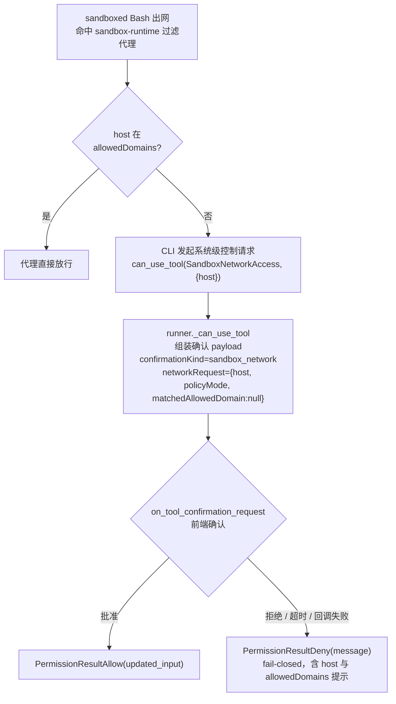
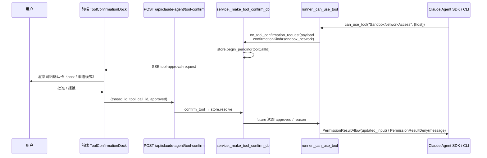

# SandboxPermissionRequest 模块交互图

> 关联设计：`claude-agent-sandbox-network-permission-tool.md`
> 状态：已修订（2026-07-26）——PreToolUse 步骤 ②.5 已拆除（错误层级
> 重复）；现行架构为 can_use_tool 单一网络确认通道，本图已据此重绘。
> 日期：2026-07-23（初版）；2026-07-26（架构反转修订）

## 1. 模块总览

```mermaid
flowchart LR
    subgraph CFG["业务配置层"]
        SC["system_config<br/>sandbox_network_mode<br/>sandbox_network_allowed_domains"]
    end

    subgraph RT["沙箱运行时（网络策略执行者）"]
        WS["workspace.py<br/>写入 .claude/settings.json<br/>sandbox.network"]
        CC["Claude Code / sandbox-runtime<br/>bwrap --unshare-net + 过滤代理"]
    end

    subgraph BE["Server 权限判定层（backend）"]
        HOOK["agent_runner._can_use_tool<br/>（can_use_tool 控制通道）"]
        CB["_make_tool_confirm_cb<br/>ToolConfirmationStore"]
    end

    subgraph BUS["事件推送层"]
        SSE["SSE tool-approval-request<br/>{confirmationKind: sandbox_network}"]
    end

    subgraph FE["前端弹窗层"]
        TP["claude-agent-transport.ts"]
        DOCK["ToolConfirmationDock<br/>网络变体卡片"]
    end

    SC --> WS --> CC
    CC -->|"清单外域名 → SandboxNetworkAccess 控制请求"| HOOK
    HOOK -->|"on_tool_confirmation_request"| CB --> SSE --> TP --> DOCK
    DOCK -->|"POST /tool-confirm"| CB
    CB -->|"approved / rejected"| HOOK
    HOOK -->|"PermissionResultAllow → 放行"| CC
    HOOK -->|"PermissionResultDeny → 阻断"| CC
```

## 2. 判定流程（can_use_tool 通道）

> PreToolUse hook 不再参与网络审批（步骤 ②.5 已于 2026-07-26 拆除）；
> `disabled` 模式的 PreToolUse 硬拒（`_apply_disabled_network_permission`）
> 为 2026-06-21 既有行为，予以保留。

## 3. 确认时序（allowlist 模式 · 清单外域名）

## 4. 三种模式行为对照（2026-07-26 现状）

| 触发 | disabled | allowlist | open |
|---|---|---|---|
| WebFetch/WebSearch | PreToolUse 硬拒（既有） | 无 Ink & Memory 门禁，遵循既有通用权限策略 | 同 allowlist，无逐次询问 |
| 网络类 Bash（sandboxed） | PreToolUse 硬拒（既有） | 清单内放行；清单外 → can_use_tool 弹窗 | 不写 sandbox.network = 不限制出网，无询问 |
| 非网络工具 | 现有分类不变 | 现有分类不变 | 现有分类不变 |

---

## 附录：2026-07-23 初版流程（已废弃）

> 初版在 PreToolUse 决策链插入步骤 ②.5：allowlist 命中显式 allow；未命中 /
> 网络 Bash / open 模式 → D→G 直连确认弹窗（跳过 ④ full-access 与
> ⑥ 低敏 allow）。2026-07-26 拆除——网络策略为系统级控制，正确通道是
> can_use_tool；`open` 模式"每次询问"语义随之回退。
