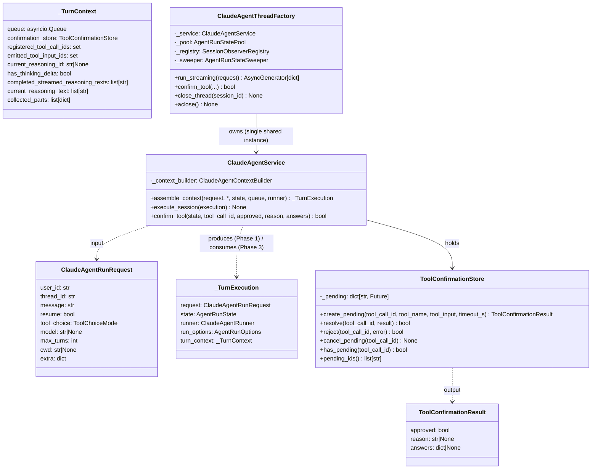
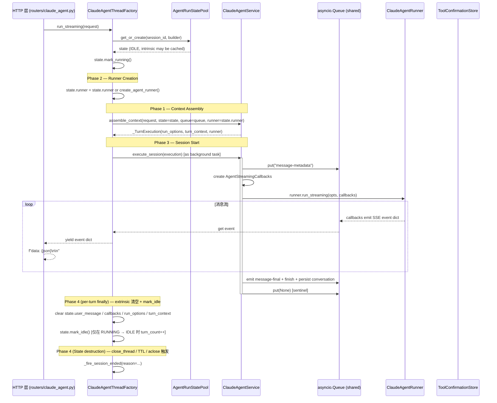
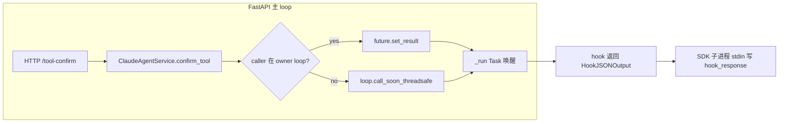
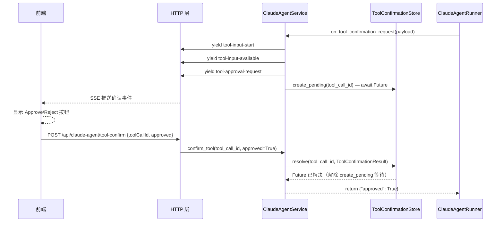

> [Input] `backend/claude_agent/service.py`, `backend/claude_agent/context_builder.py`, `backend/claude_agent/thread_factory.py`, `backend/libs/claude_agent_kit/types.py`
> [Output] Define ClaudeAgentService phase-aware responsibilities, SSE event flow, `_TurnContext`, and persistence conversion.
> [Pos] module-design-doc in `docs/design/claude-agent`
> **迁移来源**: Pawkeyland docs/app/design/ClaudeAgentService 模块设计.md — 路径已适配 Ink & Memory 工程规范。
> **[Sync] 2026-05-24**: 类图与 SSE 事件表对齐当前 service.py；reasoning-start/delta/end 已启用。  
> **[Sync] 2026-05-25 v1**: 更新 `_TurnContext` 类图补充持久化字段；更新 `execute_session` 描述。  
> **[Sync] 2026-05-25 v2**: 重大重构 — `collected_parts` 改为收集**原始 SSE 事件报文**（而非 UIMessage parts）；移除 `text_started` / `full_text_accumulator` / `tool_inv_by_id` 等状态字段；新增 `_sse_events_to_ui_parts()` 在 `_persist_turn` 时做一次线性转换。
> **[Sync] 2026-05-28**: 校准 `assemble_context` 边界：该阶段构建 `system_prompt` / `user_message` / `AgentRunOptions` / `_TurnContext`，但不发射 `message-metadata`、不创建 streaming callbacks；这些由 `execute_session` 执行。详细上下文接入规则见 [`claude-agent-context-assembly.md`](./claude-agent-context-assembly.md)。
> **[Sync] 2026-06-13**: `_make_tool_event_cb()` 处理 runner 已有 `tool_input_delta`，发射 `tool-input-delta` SSE 供前端在内置 `Write` 工具写文件时做终端式增量预览；完整方案见 [`write-tool-terminal-preview.md`](./write-tool-terminal-preview.md)。
> **[Sync] 2026-06-22**: `assemble_context` 先读 `system_config`；Settings SYSTEM_PROMPT 作为 lower-priority block 进入 `build_system_prompt`，`workspace_enabled=false` 时不初始化 workspace、不传 `cwd`、不注入 workspace context。

# ClaudeAgentService 模块设计

> 来源：从 TypeScript 迁移自 `glide-the/claude-agent-next-kit → app/api/claude-agent`
> 迁移语言：TypeScript → Python
> 落地路径：`backend/claude_agent/`（子包，2026-05-11 完成扁平 → 子包迁移）

> **阅读顺序提示**：本文聚焦 `ClaudeAgentService` 自身的两个 phase-aware 入口（`assemble_context` / `execute_session`）、Tool Confirmation 协议、以及 SSE 事件契约。生产环境的 4 阶段编排、并发 Lock、Observer、Flyweight State、TTL Sweeper 等"会话生命周期"层职责由 `ClaudeAgentThreadFactory` 承担，详见 [`claude-agent-thread-session-patterns.md`](./claude-agent-thread-session-patterns.md)。Service 不再持有 all-in-one 的 `run_streaming` orchestrator——该方法已于 2026-05-11 删除。

---

## 1. 迁移背景与目标

| 项目 | 说明 |
|------|------|
| 源模块 | `glide-the/claude-agent-next-kit` 的 `app/api/claude-agent`（TypeScript / Next.js API Route） |
| 目标模块 | `backend/claude_agent/service.py` + `backend/claude_agent/tool_confirmation_store.py`（Python 3.11+） |
| 依赖 | `backend/claude_agent/` — 已完成迁移的 `ClaudeAgentRunner` Python 包；`backend/database.py` — DB 持久化层；`backend/claude_agent/thread_factory.py` — 生产环境的 SSE 入口 |
| 迁移目标 | 1. 等价功能的 Python 服务层；2. 会话持久化（`onFinish` 迁移）；3. `thread_id` 续接逻辑；4. 在 `docs/design/claude-agent/` 中完整记录模块设计；5. 与 Thread Session（Observer/Flyweight-State/Builder/Factory）四模式协同 |

---

## 2. 模块目录结构

```
backend/claude_agent/
├── __init__.py                  # Re-export 公共符号
├── service.py                   # ClaudeAgentService（phase-aware：assemble_context + execute_session）
├── thread_factory.py            # ClaudeAgentThreadFactory（Factory：生产入口，驱动 4 阶段）
├── thread_pool.py               # AgentRunState / AgentRunStatePool / AgentRunStateSweeper（Flyweight + State）
├── state_builder.py             # AgentRunStateBuilder（Builder：极简 3-setter）
├── observer.py                  # SessionLifecycleObserver / SessionObserverRegistry / LoggingObserver
├── context_builder.py           # ClaudeAgentContextBuilder（system_prompt / user_message 拼接）
└── tool_confirmation_store.py   # ToolConfirmationStore（asyncio.Future 实现）
```

> 旧扁平 service/store 路径已删除；引用时请使用 `from backend.claude_agent import ClaudeAgentService, ClaudeAgentThreadFactory, ToolConfirmationStore`。

---

## 3. 核心类图



> _(Pawkeyland 专属，Ink & Memory 中不适用)_

`ClaudeAgentService` 不再暴露 all-in-one orchestrator，只提供两个 phase-aware 方法：

- **`assemble_context(request, *, state, queue, runner)`** — Phase 1 单一所有者（Ink & Memory）。每轮先调用 `database.get_system_config(user_id)` 读取 Settings 配置；首轮调用 `ClaudeAgentContextBuilder.build_system_prompt(user_id, configured_system_prompt=...)` 构建 system prompt，写入 `state.system_prompt`（享元缓存）。后续轮复用缓存；当 Settings SYSTEM_PROMPT 与 `state.system_config_system_prompt` 不一致时重建。构建 `user_message`、`AgentRunOptions`、`_TurnContext`（包含 `registered_tool_call_ids` / `emitted_tool_input_ids` 去重集合），返回 `_TurnExecution` 载体。该阶段不发射 SSE，也不创建 streaming callbacks。`workspace_enabled=false` 时跳过 `get_or_create_workspace`，清空 `state.cwd`，并以 `cwd=None` 调用 runner。
- **`execute_session(execution)`** — Phase 3 纯消费者。构造 5 个 `AgentStreamingCallbacks` 闭包，驱动 `runner.run_streaming(opts, callbacks)`，emit `message-final` / `finish` / `error`。每个 SSE 回调在发出事件到 `queue` 的同时，将**原始 SSE 事件 dict**追加到 `turn_ctx.collected_parts`。成功后调用 `_persist_turn`，通过 `_sse_events_to_ui_parts(collected_parts)` 做一次线性转换，将 SSE 事件流还原为 UIMessage-compatible parts 后写入 `chat_message.parts` 列。

> _(Pawkeyland 专属，Ink & Memory 中不适用)_

---

## 4. 数据流：Factory 驱动的 Phase 1 → 4

> **2026-05-11 重构**：生产链路完全由 `ClaudeAgentThreadFactory.run_streaming` 编排。本节描述真实的生产时序；Service 不再独自跑 `_run()` 后台任务。



### 4.1 worker 不变量（队列 + 后台 Task + StreamingResponse 协作）

> [Sync] 2026-05-10: 与「Claude Agent SDK 交互式工具时序图.md」事件循环泳道呼应，明确 manual 模式下 FastAPI 主 loop 不会被任何一条等待路径独占。
> [Sync] 2026-05-10: Factory 的 queue-drain 层负责下一帧等待和 `: keepalive` 注释帧，既补网关 idle 超时缺口，又保留"队列 + 后台 Task + StreamingResponse"的 worker-non-blocking 不变量；客户端断开会进入 Factory cleanup，确保 pending tool confirmation Future 被取消。
> [Sync] 2026-05-11: `ClaudeAgentService.run_streaming` 已删除 —— 生产链路改由 `ClaudeAgentThreadFactory.run_streaming` 显式驱动 runner 缓存、`service.assemble_context`、`service.execute_session` 和 per-turn cleanup。Service 不再有 all-in-one orchestrator。
> [Sync] 2026-05-12: `state.mark_idle()` 仅在 `lifecycle == RUNNING` 时递增 `turn_count`；每轮结束由 Factory 清理 `turn_context` 并取消未完成的工具确认 Future。

> _(Pawkeyland 专属，Ink & Memory 中不适用)_

| 不变量 | 实现位置 | 失效后果 |
|---|---|---|
| `asyncio.create_task(self._service.execute_session(execution))` 唯一持有 `runner.run_streaming` 协程；它把事件写进共享 `asyncio.Queue` 而非直接 yield | `backend/claude_agent/thread_factory.py` | 否则 SDK 错误会沿 `StreamingResponse.body_iterator` 泄漏。 |
| Factory cleanup 遍历 `turn_context.confirmation_store.pending_ids()` 并取消残留 Future | `backend/claude_agent/thread_factory.py` | 否则客户端断开后 store 残留 Future，下次同 id 再入可能冲突。 |
| `execute_session` 总是在结束时投递 `None` sentinel | `backend/claude_agent/service.py` | 否则 Factory 无法判断 SSE 流结束。 |
| 应用 shutdown 调 `claude_agent_thread_factory.aclose()` | `backend/server.py` | 否则 TTL sweeper 无法干净停止，SDK runner 句柄留给 GC。 |

### 4.2 跨边界 resolve 流向



---

## 5. 工具确认流程（交互工具确认）

> **宠物动作（动画事件）说明**：当 LLM 调用 `AskUserQuestion` 工具且 `input` 包含
> `{ act, duration, interaction }` 时，为动画事件确认流程。前端动画层播放完成后
> 调用 `confirm_tool(tool_call_id, approved=True, answers={trigger, choiceId?, elapsedMs?})`。
> 该状态机属于 Pawkeyland 专属动画层，Ink & Memory 不迁移对应设计文档。

> _(Pawkeyland 专属，Ink & Memory 中不适用)_



---

## 6. TypeScript → Python 关键映射

> 所有 Python 列引用的路径均已迁到 `backend/claude_agent/` 子包；旧扁平路径已删除。下表反映当前 Ink & Memory 合同。

| TypeScript（route.ts）| Python（backend/claude_agent/）| 说明 |
|---|---|---|
| `createUIMessageStream({ execute })` | `service.assemble_context()` 构造 `_TurnExecution` 载体 + `service.execute_session()` 驱动 runner；二者由 `thread_factory.run_streaming` 串联 | Factory 边读共享 queue 边 yield SSE frame；Service 端没有独立的 AsyncGenerator |
| `writer.write(part)` | `queue.put_nowait(event)` | 向**共享** `asyncio.Queue` 写入事件 dict（Factory 和 Service 共用同一队列）|
| `streamedParts.push({ ...part })` | `turn_ctx.collected_parts.append(event)` | 原始 SSE 事件采集（用于持久化转换） |
| `extractTextFromParts(...)` | `extract_text_from_parts(message_parts)` | 用户 UIMessage parts 文本提取 |
| `createId("msg")` | `str(uuid4())` | 消息 ID 生成 |
| `createPendingToolConfirmation(id, name, input)` | `await turn_context.confirmation_store.create_pending(...)` | 创建 Future 并阻塞等待 |
| `resolvePendingToolConfirmation(id, result)` | `store.resolve(id, result)` | 设置 Future 结果 |
| `req.signal.aborted` / `AbortController` | `task.cancel()` / `asyncio.CancelledError` 经 Factory cleanup 处理 | 中止信号处理 |
| `setInterval(heartbeat)` | Factory queue-drain keepalive 注释帧 | SSE 心跳由 FastAPI StreamingResponse 管理 |
| `getConversationById(conversationId)` | `database.get_chat_thread(thread_id, user_id)` in route layer | 请求前做 thread ownership 校验。 |
| `threadIdForAgent` | `AgentRunOptions.thread_id = request.thread_id` | SDK 会话与 Ink & Memory chat thread 对齐。 |
| `capturedSessionId = result.sessionId` | `captured_session_id = result.session_id` | 捕获 SDK 会话 ID |
| `onFinish({ responseMessage })` → persist message rows | `_persist_turn(...)` calls `database.save_chat_message(...)` in `service.execute_session` | 会话持久化（post-run）|

> _(Pawkeyland 专属，Ink & Memory 中不适用)_

详细持久化设计见：[claude-agent-session-persistence.md](./claude-agent-session-persistence.md)

---

## 7. SSE 事件类型（Ink & Memory 实际发射）

| 事件类型 | 触发场景 | 关键字段 |
|---|---|---|
| `message-metadata` | 流开始（Phase 1） | `sessionId`, `turnIndex` |
| `text-start` | 首个文本 delta 前（`on_text_delta` 内自动发射） | `id`（固定 `"text-0"`） |
| `text-delta` | 文本增量 | `id`, `delta` |
| `text-end` | 文本块结束（`on_text_done` 或工具事件前） | `id` |
| `reasoning-start` | thinking 块开始（`thinking_delta` / `thinking` 触发） | `id` |
| `reasoning-delta` | thinking 内容增量 | `id`, `delta` |
| `reasoning-end` | thinking 块结束（`content_block_stop` / `thinking` 触发） | `id` |
| `tool-input-start` | 工具调用开始（`tool_use_start` / `tool_input_available` 触发） | `toolCallId`, `toolName` |
| `tool-input-delta` | 工具输入 JSON 增量（`tool_input_delta` 触发） | `toolCallId`, `toolName`, `delta` |
| `tool-input-available` | 工具输入完整（`tool_input_available` 触发） | `toolCallId`, `toolName`, `input` |
| `tool-approval-request` | 交互工具等待确认（`tool_choice="manual"`） | `toolCallId`, `toolName`, `input` |
| `tool-output-available` | 工具执行结果（`tool_result` 触发） | `toolCallId`, `output`, `isError` |
| `message-final` | 流成功结束前 | `text`, `usage`, `sessionId` |
| `finish` | 流结束 | `finishReason`（`"stop"` 或 `"error"`） |
| `error` | 任意异常 | `errorText` |

> **`on_tool_event` 分发模式**（2026-05-24 对齐 Pawkeyland）：回调按 `ToolEventPayload.type` 分发，`result`、`message_*`、`tool_progress` 等类型在 Ink & Memory 中明确忽略。
>
> **SSE 事件收集机制**（2026-05-25 重构）：每个 SSE 回调在发出事件的同时，将原始事件 dict 追加到 `turn_ctx.collected_parts`。收集的事件类型：
> - `text-start` / `text-delta` / `text-end`
> - `reasoning-start` / `reasoning-delta` / `reasoning-end`
> - `tool-input-available`（含 input 数据）
> - `tool-output-available`（含 output 和 isError）
> 
> 不收集：`tool-input-start`（无数据载荷）、`tool-input-delta`（仅 live preview，完整 input 由 `tool-input-available` 持久化）、`tool-approval-request`、`message-metadata`、`message-final`、`finish`、`error`。
> 
> `_persist_turn` 调用 `_sse_events_to_ui_parts(collected_parts)` 做一次线性转换，输出 UIMessage-compatible parts 写入 DB。
>
> **与 Pawkeyland 差异**：`reasoning-start/delta/end` 已启用；`message-metadata.unstableData`、`tool-approval-request.approvalId` 未启用。

---


## 10. 上下文拼接扩展

详见 [`claude-agent-context-assembly.md`](./claude-agent-context-assembly.md)：`assemble_context` 的上下文来源、接入顺序、过滤规则、失败处理和可测试性要求。

---

## 8. 使用示例

```python
from claude_agent import ClaudeAgentRunRequest


request = ClaudeAgentRunRequest(
    user_id=str(authenticated_user_id),
    thread_id=validated_thread_id,
    resume=should_resume,
    tool_choice=resolved_tool_choice,
    model=resolved_model,
    max_turns=resolved_max_turns,
    cwd=None,
    message_id=ui_message_id,
    message_parts=[
        {"type": "text", "text": user_or_optimized_planning_prompt}
    ],
    attachments=attachment_payloads or None,
)

async for frame in claude_agent_thread_factory.run_streaming(request):
    yield frame

resolved = claude_agent_thread_factory.confirm_tool(
    session_id=validated_thread_id,
    tool_call_id=tool_call_id,
    approved=approved,
    reason=reason,
    answers=answers,
)
```

---

## 9. 依赖关系

| 包 / 模块 | 说明 |
|---|---|
| `backend/routers/claude_agent.py` | HTTP request validation, thread ownership checks, attachment sync, and `ClaudeAgentRunRequest` construction |
| `backend/claude_agent/service.py` | `assemble_context`, `execute_session`, tool confirmation resolution, and message persistence |
| `backend/claude_agent/context_builder.py` | `system_prompt` and `message_parts` to Claude content block assembly |
| `backend/claude_agent/thread_factory.py` | Per-thread lock, runner cache, lifecycle observer calls, queue draining, and cleanup |
| `backend/database.py` | Chat thread/message persistence and recent writing session lookup |
| `backend/libs/claude_agent_kit/types.py` | `AgentRunOptions`, `AgentStreamingCallbacks`, `ToolEventPayload` |
| `asyncio` | Queue event bridge, Future-based tool confirmation, background task execution, and `to_thread` DB calls |
| `uuid` | uuid4() 用于生成 ID |
| `datetime` | datetime.now(timezone.utc).isoformat() 用于时间戳 |
| Python 标准库 | 不要求为 Service 设计新增第三方依赖 |

---

## 10. Thread Session 扩展（ClaudeAgentThreadFactory）

> 详细设计见 [`claude-agent-thread-session-patterns.md`](./claude-agent-thread-session-patterns.md)。

`ClaudeAgentService` 是所有业务逻辑的核心实现，但只暴露两个 phase-aware 方法：`assemble_context`（Phase 1）和 `execute_session`（Phase 3）。
`ClaudeAgentThreadFactory`（2026-05-11 新增）在其基础上封装了 4 阶段生命周期、并发隔离、Observer 钩子、享元状态池、TTL 后台 sweeper 等能力，并通过显式调用 Service 的两个 phase-aware 方法（而不是任何 all-in-one orchestrator）来串起 SSE 业务逻辑（DB 持久化、reasoning 事件、keepalive、message-final）。

### 10.1 与 Service 的职责对比

| 能力 | ClaudeAgentService | ClaudeAgentThreadFactory |
|------|--------------------|--------------------------|
| 业务逻辑（DB 持久化 / reasoning / keepalive / message-final） | 内置 | ✅ 委托给内部 service 实例 |
| 并发隔离 | 无 | `asyncio.Lock` per `session_id` (FIFO) |
| 生命周期钩子 | 无 | `SessionObserverRegistry`（8 个钩子） |
| 状态追踪 | 无状态 | `AgentRunStatePool`（turn_count / IDLE/RUNNING） |
| 工具确认 | 每轮 `_TurnContext.confirmation_store` 管理 | 委托给 `self._service.confirm_tool()` |

> _(Pawkeyland 专属，Ink & Memory 中不适用)_

### 10.2 使用 Factory 替换 Service（渐进迁移）

```python
# 应用启动时
factory = ClaudeAgentThreadFactory()
factory.register_observer(LoggingObserver())

# HTTP 流式端点（与 Service 完全相同的 SSE 事件合同）
async for event in factory.run_streaming(request):
    yield f"data: {json.dumps(event)}\\n\\n"

# 工具确认端点（委托给内置 ClaudeAgentService）
ok = factory.confirm_tool(session_id, tool_call_id, approved=True)
```

### 10.3 设计模式组成与代码位置

```
backend/claude_agent/          ← 子包，所有 Claude Agent 业务在此处
├── observer.py      Observer   → SessionLifecycleObserver / SessionObserverRegistry / LoggingObserver
├── thread_pool.py   Flyweight+State → AgentRunLifecycle / AgentRunState / AgentRunStatePool
├── state_builder.py Builder   → AgentRunStateBuilder
├── thread_factory.py Factory  → ClaudeAgentThreadFactory (直接驱动 service.assemble_context + service.execute_session)
├── service.py                 → ClaudeAgentService（主链路）
├── context_builder.py         → ClaudeAgentContextBuilder
└── tool_confirmation_store.py → ToolConfirmationStore
```
