> **迁移来源**: Pawkeyland docs/app/design/claude-agent-thread-session-patterns.md — 路径和环境变量已适配 Ink & Memory 工程规范。

# Claude Agent Thread Session — 设计模式重构方案

> **来源**：基于现有 `backend/claude_agent/service.py` + `backend/libs/claude_agent_kit/server/agent_runner.py` 的会话管理重构设计
> **目标**：引入 Thread 会话模型，通过 sessionId 在角色扮演状态加载前维护 Claude Runner 线程，实现工作空间初始化与宠物系统上下文一次性注入，后续轮次只传递用户消息
> **关联设计**：
> - [claude-agent-session-persistence.md §10](./claude-agent-session-persistence.md#10-thread-session--进程内-sessionid-享元层) — 与 DB 持久化层的接合
> - [claude-agent上下文拼接设计.md §2.1](./claude-agent上下文拼接设计.md#21-享元短路thread-session-模式) — Phase 1 享元短路细节
> - [ClaudeAgentRunner 模块设计.md §11](./ClaudeAgentRunner%20%E6%A8%A1%E5%9D%97%E8%AE%BE%E8%AE%A1.md#11-thread-session-模式下的-runner-交互) — Runner 在 4 阶段中的位置
> - [AI Model 会话流程图.md](./AI%20Model%20会话流程图.md#thread-session--sessionid-享元生命周期pawkeyland-落地) — 4 阶段 stateDiagram + 时序图

---

## 1. 背景与目标

### 1.1 现状问题

| 现状 | 问题 |
|------|------|
| 每次 `run_streaming` 调用均重新组装 `system_prompt` + `user_message` 全量上下文 | 工作空间初始化和宠物状态每轮重复注入，产生冗余 token 消耗 |
| `sessionId` 仅在会话结束后持久化到 `chat_session.claude_session_id` | 无法在 Runner 生命周期内对外暴露 sessionId，并发请求缺乏队列管控 |
| `create_agent_runner()` 每次调用均无状态重建 | Runner 组件（callbacks、workspace、system_prompt）缺乏统一生命周期管理 |

### 1.2 重构目标

```
角色扮演状态加载前 → 创建 Thread，发送一次 [工作空间初始化 + 宠物系统上下文]
后续每轮 → 只通过 sessionId 发送用户消息，不重复注入静态上下文
单 sessionId 单消费者 → 并发请求按 sessionId 串行排队
```

### 1.3 设计模式选型

| 模式 | 职责 | 落地类 |
|------|------|--------|
| **Observer（观察者）** | 为 Runner 4 个生命周期阶段注册可插拔钩子 | `SessionLifecycleObserver` |
| **Flyweight + State（享元 + 状态）** | 跨轮次共享 Runner 组件，封装生命周期状态 | `AgentRunState` / `AgentRunStatePool` |
| **Builder（建造者）** | 结构化构建享元状态对象 | `AgentRunStateBuilder` |
| **Factory（工厂）** | 封装 Thread 创建/运行/销毁，对外暴露唯一 API 入口 | `ClaudeAgentThreadFactory` |

---

## 2. 生命周期模型（4 个阶段）

Runner 调用的完整生命周期分为如下 4 个阶段，每个阶段对应一对 Observer 钩子：

```
阶段 1 — 上下文组装
  _put({ type: "message-metadata", sessionId: workspace_key, ... })

阶段 2 — 创建 Claude Runner
  runner = create_agent_runner()

阶段 3 — 会话发起
  async for message in self._sdk_client.query_stream(_generate_messages(), sdk_options):
      ...

阶段 4 — 结束状态
  while True:
      event = await queue.get()
      if event is None:
          break
      yield event
```

> 在阶段 2–4 内：同一 `sessionId` 只允许一个活跃消费者，多个请求通过 `asyncio.Lock` 排队。

### 2.1 4 个 Phase 在代码中的精确位置

| Phase | 代码入口 | 唯一所有者 | 主要副作用 |
|---|---|---|---|
| **Phase 1 — Context Assembly** | `Service.assemble_context(request, *, state, queue)` | **Service**（消费者） | 写入享元 5 个 intrinsic（首轮）+ 4 个 extrinsic（每轮）字段；emit 初始 `message-metadata` SSE；首轮注入 Mem0 preflight |
| **Phase 2 — Runner Creation** | `state.runner = state.runner or create_agent_runner()`，再写 `execution.runner = state.runner` | **Factory**（生产者） | 写入 / 复用 intrinsic `state.runner`；后置把 runner 移交给 carrier |
| **Phase 3 — Session Start** | `Service.execute_session(execution)` 后台 Task + Factory 主协程 yield queue | **Service**（消费者） | `state.runner.run_streaming(opts, callbacks)`；emit `text-*` / `tool-*` / `message-final` / `finish`；DB `_persist_conversation` |
| **Phase 4 — Session End** | `Factory._fire_session_ended(session_id, reason=...)` | **Factory**（生产者） | `pool.destroy(session_id)` → `state.mark_destroyed()`（清空 `runner` + `turn_context`）；emit `before/after_session_ended` 钩子 |

> "**每轮收尾 ≠ Phase 4**" 是本设计最容易混淆的点：每轮收尾发生在 Factory 的 `_run_lifecycle.finally`，只清空 4 个 extrinsic 字段 + `state.mark_idle()`，**不发**任何 Phase 4 观察者钩子；State 留在 keepalive 缓存里等待下一轮复用或 TTL 销毁。

---

## 2.5 生命周期 × 设计模式 — 协同关系

> 本节是阅读 §3 / §4 / §5 之前的"统一视图"：把 Observer / Flyweight + State / Builder / Factory 四种模式映射到 Phase 1–4 生命周期上，明确每个 Phase 谁在主导、谁在被消费、谁在被观察、State 在做什么转移。

### 2.5.1 模式总分工

| 模式 | 角色定位 | 在生命周期中的作用 | 落地类 |
|---|---|---|---|
| **Factory（工厂）** | 生命周期**编排者** = 生产者 | 唯一驱动 4 个 Phase 边界推进的对象；持有 Pool / Sweeper / Observer Registry / Service 实例；对外只暴露 `run_streaming` / `confirm_tool` / `close_thread` / `aclose` | `ClaudeAgentThreadFactory` |
| **Builder（建造者）** | Phase 1 之前的**装配器** | 由 Pool 在新建享元时调用一次（`builder.with_session_id(session_id).build()`），把零散字段流式装配为 `AgentRunState`；之后 Builder 即弃用，不参与 Phase 1–4 的运行时逻辑 | `AgentRunStateBuilder` |
| **Flyweight + State（享元 + 状态）** | 跨 Phase 的**状态容器** | Phase 1 写入 intrinsic + extrinsic；Phase 2 写入 / 复用 `runner`；Phase 3 状态机 IDLE → RUNNING；每轮收尾 RUNNING → IDLE；Phase 4 IDLE → DESTROYED；同一 `session_id` 的所有 Phase 共享同一个 `AgentRunState` | `AgentRunState` / `AgentRunStatePool` / `AgentRunStateSweeper` |
| **Observer（观察者）** | Phase 边界**事件总线** | 4 阶段 × before/after = 8 个钩子；让外部业务（日志 / 持久化 / 监控 / A/B）无侵入接入；钩子只在该 Phase 的全部产物可观察后才返回 | `SessionLifecycleObserver` / `SessionObserverRegistry` / `LoggingObserver` |

### 2.5.2 Phase × 模式交叉责任表

| Phase | Factory（生产者） | Builder（装配） | Flyweight + State（容器） | Observer（事件） |
|---|---|---|---|---|
| **进入** | `Factory.run_streaming(request)` 入口；`evict_expired()` 兜底；获取 `asyncio.Lock` | — | — | — |
| **新建享元（Pool 内）** | `Pool.get_or_create(session_id, builder)` | **被调用**：`with_session_id(session_id).build()` | 创建 `AgentRunState(lifecycle=IDLE, turn_count=0, intrinsic 全空)` | — |
| **Phase 1 — Context Assembly** | 委托 `Service.assemble_context(request, state, queue)` | — | **首轮**写入 5 个 intrinsic：`resolved_identity` / `persisted_pet_info` / `mem0_user_id` / `system_prompt` / `cwd`；**每轮**写入 4 个 extrinsic：`user_message` / `callbacks` / `run_options` / `turn_context` | `before/after_context_assembly(session_id, metadata)` |
| **Phase 2 — Runner Creation** | `if state.runner is None: state.runner = create_agent_runner()`；再把 runner 注入 `execution.runner` | — | 写入 / 复用 intrinsic `state.runner` | `before/after_runner_created(session_id, runner)` |
| **Phase 3 — Session Start** | `state.mark_running()`；spawn `Service.execute_session(execution)`；主协程 yield `state.turn_context.queue` 事件 | — | 状态转移 IDLE → RUNNING；`turn_context.queue` 漏斗承载所有 SSE | `before/after_session_started(session_id, opts)` |
| **每轮收尾**（Factory finally） | 清空 extrinsic 四件套 + `state.mark_idle()` | — | 状态转移 RUNNING → IDLE；intrinsic 全部保留；`turn_count++`；`last_active_at` 刷新 | **不发火**（不是 Phase 4） |
| **Phase 4 — Session End**（State 销毁） | `_fire_session_ended(session_id, reason)` 在 3 条路径分别触发：`close_thread` / TTL Sweeper / `aclose` | — | 状态转移 IDLE → DESTROYED；`runner` / `turn_context` 清空；从 Pool 移除 | `before/after_session_ended(session_id, {reason, destroyed, turn_count?})` |

### 2.5.3 综合时序图 — 首轮：4 模式协同的完整链路

> 这张图是本设计的"金标"参考。它把 **Factory（编排）→ Builder（装配）→ Flyweight + State（容器）→ Observer（边界事件）→ Service（消费）→ Runner（执行）→ SDK** 的所有关键边界都画在一张图上，专注于"首轮"——最能体现 4 模式协同的场景。

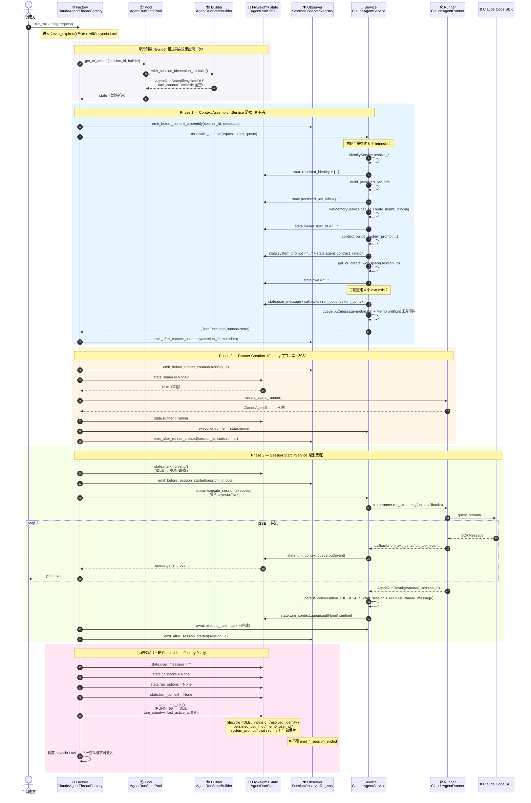

### 2.5.4 综合时序图 — 续轮（TTL 内享元命中）：模式协同的"短路"形态

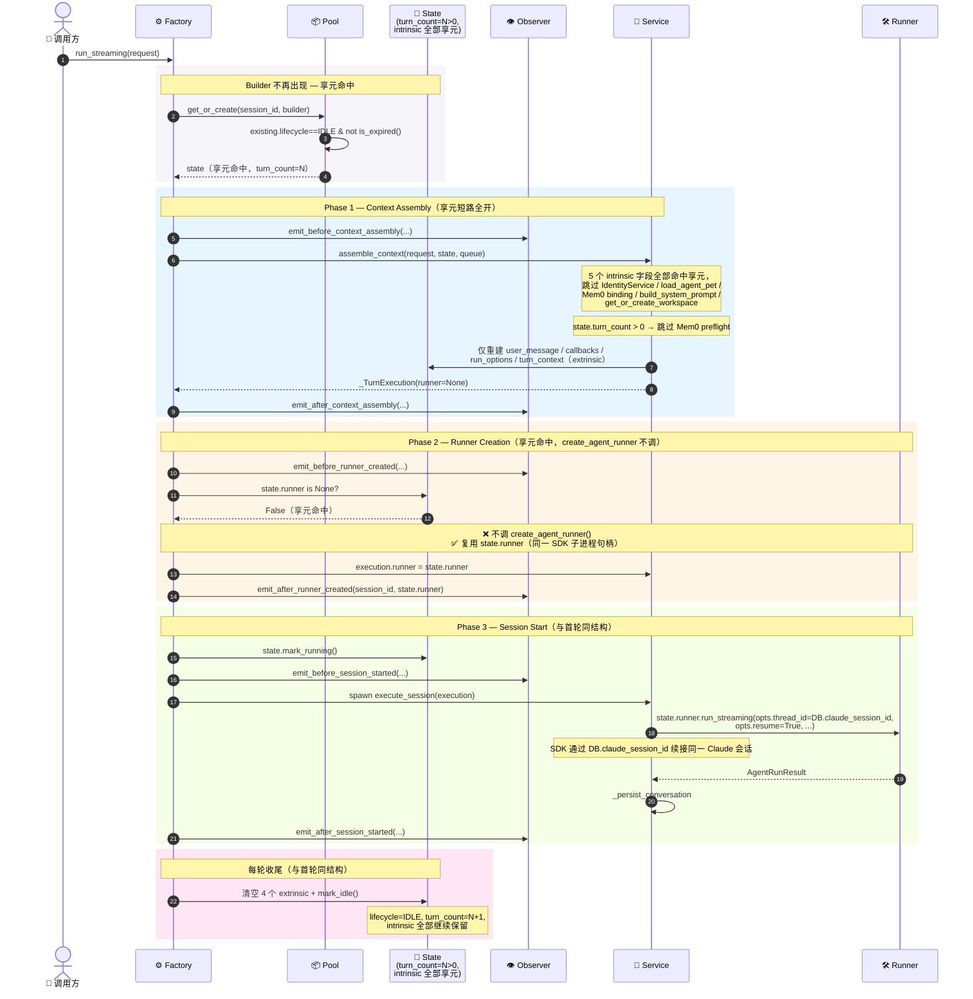

### 2.5.5 综合时序图 — Phase 4：State 销毁的 3 条路径

> Phase 4 是观察者钩子和实际状态转移**精确对齐**的位置。`reason` 字段区分三条路径，让观察者可以做差异化的清理 / 上报。

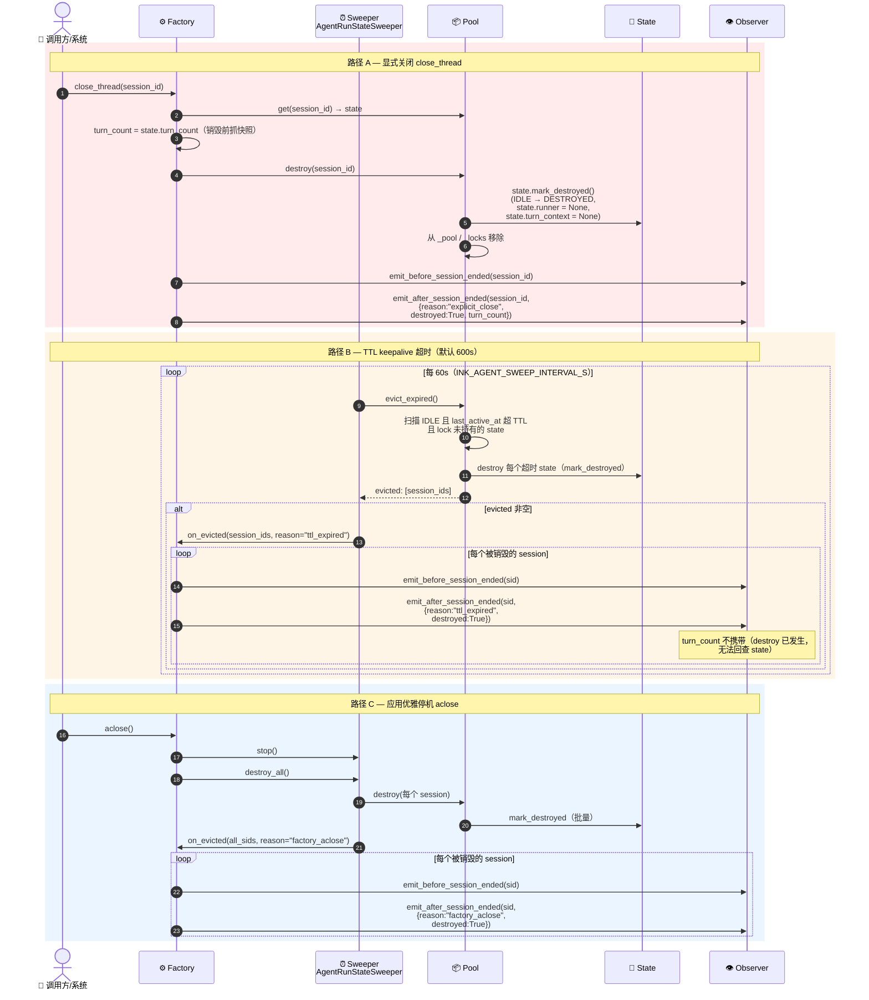

### 2.5.6 状态机视图 — State 模式聚焦

> 这张图把 `AgentRunState.lifecycle` 在 4 个 Phase 中的所有状态转移画出来，并标注每次转移在 Factory / Pool / Sweeper 中的精确触发点。

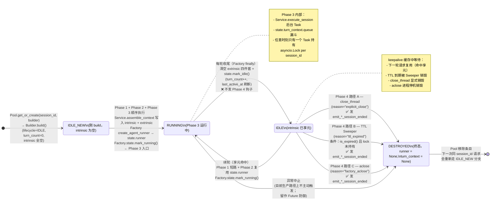

### 2.5.7 Observer 钩子时间线 — 与 Phase 边界精确对齐

> 这张图明确：8 个钩子的发火时机不是均匀分布的——Phase 1/2/3 钩子在每轮都发；Phase 4 钩子只在 3 条 State 销毁路径上发；钩子之间还有"产物可观察性"约束。

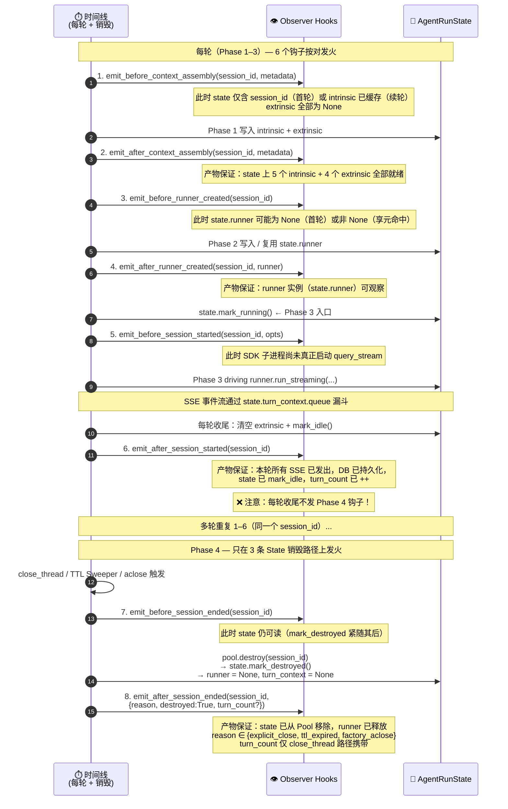

### 2.5.8 模式协同的设计理念

| 设计意图 | 落地方式 |
|---|---|
| **生产者 / 消费者解耦** | Factory 是生产者（负责 4 个 Phase 的边界推进），Service 是消费者（暴露 `assemble_context` + `execute_session` 两个 phase-aware 方法被 Factory 调用）；这条边界让 "工厂的编排责任" 与 "服务的业务责任" 在类型层面就解耦 |
| **生命周期与状态容器分离** | Factory 推动生命周期前进（Phase 1→2→3→4），State 承载每个生命周期阶段对应的字段；两者通过 `AgentRunState` 字段读写解耦，不互相 import 业务对象 |
| **状态写回点与读取点对齐** | 每个 intrinsic 字段都有"唯一写入点（首轮）+ 唯一读取点（每轮）"；写入点在 Service Phase 1，读取点也在 Service Phase 1；State 仅作为字段所有者，不参与解析 |
| **观察者只在产物可观察后发火** | `emit_after_X` 必须在该 Phase 的全部产物都已写到 State / queue 之后才返回；这让观察者可以放心地在钩子内 read State 而不会读到半成品 |
| **State 状态机与 Phase 解耦** | `IDLE / RUNNING / DESTROYED` 只表达 State 自身的状态，不直接对应 Phase 编号；这样"每轮收尾 vs Phase 4"才能清晰区分（前者是 RUNNING→IDLE，后者是 IDLE→DESTROYED） |
| **Phase 4 钩子绑定真实销毁** | Phase 4 不绑定"每轮结束"，而绑定 `IDLE → DESTROYED` 的真实状态转移；3 条销毁路径用 `reason` 字段区分，让观察者能差异化处理（例如 `ttl_expired` 自动续约 / `factory_aclose` 优雅落盘） |
| **Builder 一次性使用** | Builder 只在 Pool 新建 State 时被调用一次，之后即弃用；这避免了"运行时 Builder 引用泄漏"的问题，让 State 一经构造就只通过字段写入修改 |
| **Sweeper 是 Phase 4 的隐式触发器** | Sweeper 不参与 Phase 1–3，只负责把"keepalive 队列"按 TTL 转化为 Phase 4 触发；这让 Factory 的 4 阶段同步代码路径和 Sweeper 的异步驱逐逻辑在 `_fire_session_ended` 处汇合 |

---

## 3. 观察者模式（Observer）— 生命周期钩子

### 3.1 设计目标

- 在不侵入核心 Runner 逻辑的前提下，允许外部业务（日志、监控、持久化、A/B 实验）注入阶段钩子
- 每个阶段提供 `before` / `after` 两个时机，方便前置检查与后置清理

### 3.2 钩子清单

| 阶段 | Before 钩子 | After 钩子 | 携带数据 | 触发频次 |
|------|------------|-----------|---------|---------|
| 1 — 上下文组装 | `on_before_context_assembly` | `on_after_context_assembly` | `session_id`, `metadata` dict | 每轮 |
| 2 — Runner 创建 | `on_before_runner_created` | `on_after_runner_created` | `session_id`, `runner` 实例 | 首轮（首次缓存）、TTL 重建后第一轮 |
| 3 — 会话发起 | `on_before_session_started` | `on_after_session_started` | `session_id`, `opts` dict | 每轮 |
| 4 — 结束状态（**State 销毁**）| `on_before_session_ended` | `on_after_session_ended` | `session_id`, `result` dict（含 `reason` / `destroyed` / `turn_count?`） | **仅在 State 真正销毁时**：`close_thread` / TTL 驱逐 / `aclose` |

> **Phase 4 语义校准（2026-05-12）**：Phase 4 不再对应"每轮结束"。在享元状态模式 State 中，一轮结束只是把 `AgentRunState` 从 RUNNING 切回 IDLE 并刷新 keepalive 时间戳；State 仍然保留在池中等待下一轮。只有当 State 经历 `IDLE → DESTROYED` 这次终态切换时，Phase 4 才发火 —— 对应三个时机：`close_thread`（reason=`explicit_close`）、TTL 超时被 Sweeper 清理（reason=`ttl_expired`）、`aclose` 优雅停机（reason=`factory_aclose`）。
>
> `result` dict 形如 `{session_id, reason, destroyed: True, turn_count?}`，其中 `turn_count` 仅在 `close_thread` 路径上提供（在销毁前从 state 抓取快照）；TTL / `aclose` 批量销毁路径已经在 `pool.destroy` 后回调，没有快照可用。

### 3.3 类图

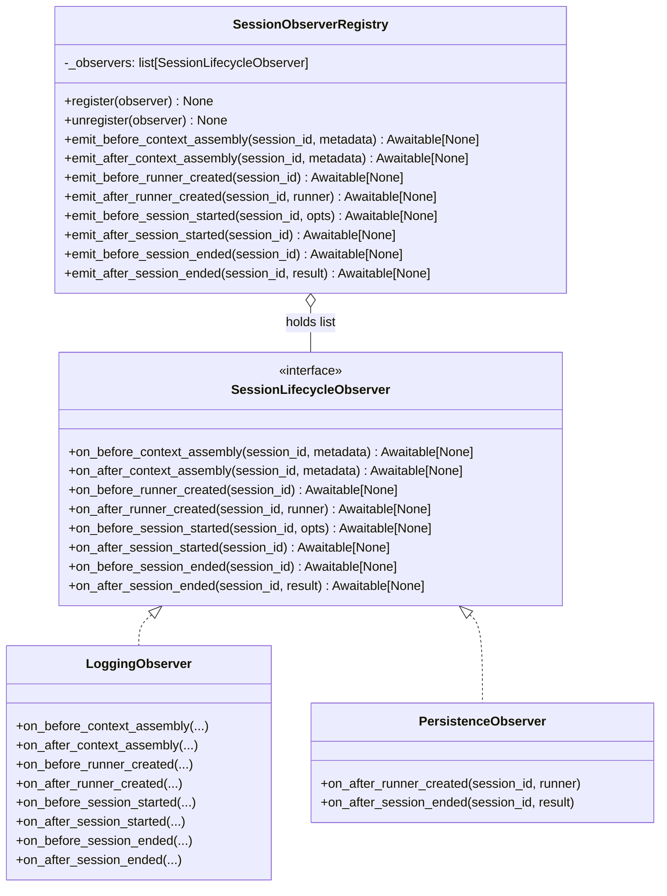

### 3.4 Python 骨架（伪代码）

```python
from typing import Protocol, runtime_checkable, Any
import asyncio

@runtime_checkable
class SessionLifecycleObserver(Protocol):
    async def on_before_context_assembly(self, session_id: str, metadata: dict) -> None: ...
    async def on_after_context_assembly(self, session_id: str, metadata: dict) -> None: ...
    async def on_before_runner_created(self, session_id: str) -> None: ...
    async def on_after_runner_created(self, session_id: str, runner: Any) -> None: ...
    async def on_before_session_started(self, session_id: str, opts: dict) -> None: ...
    async def on_after_session_started(self, session_id: str) -> None: ...
    async def on_before_session_ended(self, session_id: str) -> None: ...
    async def on_after_session_ended(self, session_id: str, result: dict) -> None: ...


class SessionObserverRegistry:
    def __init__(self) -> None:
        self._observers: list[SessionLifecycleObserver] = []

    def register(self, observer: SessionLifecycleObserver) -> None:
        self._observers.append(observer)

    def unregister(self, observer: SessionLifecycleObserver) -> None:
        self._observers = [o for o in self._observers if o is not observer]

    async def _emit(self, method: str, *args: Any, **kwargs: Any) -> None:
        for observer in self._observers:
            fn = getattr(observer, method, None)
            if callable(fn):
                result = fn(*args, **kwargs)
                if asyncio.iscoroutine(result):
                    await result

    # 每个阶段暴露两个代理方法（before / after）
    async def emit_before_context_assembly(self, session_id: str, metadata: dict) -> None:
        await self._emit("on_before_context_assembly", session_id, metadata)

    async def emit_after_context_assembly(self, session_id: str, metadata: dict) -> None:
        await self._emit("on_after_context_assembly", session_id, metadata)

    # …其余阶段同理…
```

---

## 4. 享元 + 状态模式（Flyweight State）— Runner 组件管理

### 4.1 设计目标

- **享元（Flyweight）**：同一 `sessionId` 在多轮对话中共享不变组件（workspace 路径、system_prompt），避免重复构造
- **状态（State）**：`AgentRunState` 跟踪当前生命周期阶段，防止并发重入

### 4.2 状态机

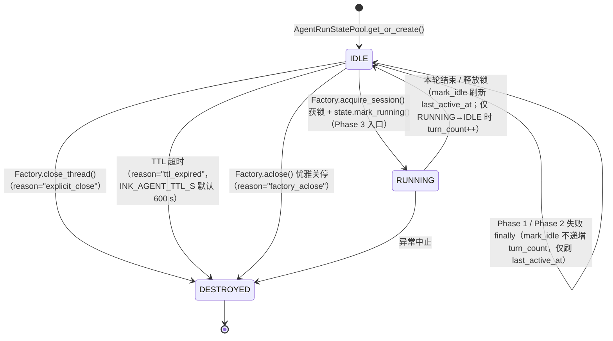

> **Phase 4 三条 State destruction 路径**统一由 `ClaudeAgentThreadFactory._fire_session_ended` 发出 `emit_before_session_ended` / `emit_after_session_ended` 钩子，钩子 `result` 字典携带 `reason ∈ {explicit_close, ttl_expired, factory_aclose}`（`turn_count` 仅在 `close_thread` 路径下被快照）。**Phase 1 / Phase 2 失败**走 `IDLE → IDLE` 自环：Factory 的 per-turn finally 仍调 `state.mark_idle()` 以刷新 keepalive 时间戳，但因 `lifecycle` 未到达 `RUNNING`，`turn_count` 保持原值——下一次真正的"首轮"仍可满足 Mem0 preflight 的 `turn_count == 0` gate。

> _(Pawkeyland 专属字段，Ink & Memory 中不适用)_

### 4.3 享元体（AgentRunState）

享元体内包含两类字段：

| 字段类型 | 字段名 | 说明 |
|----------|-------|------|
| **内在状态**（跨轮共享）| `session_id` | Thread 标识（workspace_key） |
| 内在状态 | `cwd` | 工作空间路径（Service Phase 1 首轮 `get_or_create_workspace` 后回写） |
| 内在状态 | `system_prompt` | 角色扮演系统提示（Service Phase 1 首轮 `_context_builder.system_prompt` 后回写） |
| 内在状态 | `agent_contract_version` | Agent 协议版本（Service Phase 1 首轮回写） |
| 内在状态 | `resolved_identity` | 应用内规范化身份（Service Phase 1 **最先**首轮 `_resolve_identity` → `IdentityService.resolve_real_pet` / `resolve_system_persona` 后回写）；解析后的 `user_id` / `pet_id` / `persona_id` 被同时镜像到 `request.*`，让下游 DB 持久化、Mem0 binding、persisted_pet_info 构造、MCP env 等环节看到的都是规范化身份 |
| 内在状态 | `persisted_pet_info` | 持久化的 `pet_info` dict（Service Phase 1 首轮 `_build_persisted_pet_info` 合并 `request.persona_record` + `load_agent_pet` 后回写）；下游 `_mcp_env_for_request` / `_is_virtual_system_persona_request` / sticker filter / character_card / persistence 行均从 `request.pet_info`（被镜像到本字段）读取 |
| 内在状态 | `mem0_user_id` | 解析后的 Mem0 命名空间（Service Phase 1 首轮 `_resolve_mem0_user_id` → `PetMemoryService.get_or_create_mem0_binding` 后回写）；`request.mem0_user_id` 被同时镜像 |
| 内在状态 | `runner` | `ClaudeAgentRunner` 实例（首轮 `create_agent_runner()` 创建后缓存；按 `session_id` 享元映射；`mark_destroyed` 时清空） |
| **外在状态**（每轮重建，归 Phase 1 创建 / Phase 4 销毁）| `user_message` | Phase 1 内 `ClaudeAgentService` 用 `_context_builder.user_message` + Mem0 召回拼出的 enriched 用户消息；Service 立即写回 `state.user_message`；Phase 4 finally 中 `state.user_message = ""` 销毁 |
| 外在状态 | `callbacks` | Phase 1 内构造的 `AgentStreamingCallbacks`（闭包 over `state.turn_context` 的 per-turn 累加器 + 本轮 queue）；Service 立即写回 `state.callbacks`；Phase 4 finally 中 `state.callbacks = None` 销毁 |
| 外在状态 | `run_options` | Phase 1 内构造的 `AgentRunOptions`（含 `thread_id`、`cwd`、`system_prompt`、`mcp_env`、`turn_runtime`、`tool_choice` 等）；Service 立即写回 `state.run_options`；Phase 4 finally 中 `state.run_options = None` 销毁 |
| 外在状态 | `turn_context` | `ClaudeAgentService._TurnContext` 实例，集中持有本轮可变状态：SSE `queue`、`assistant_message_id`、`server_latency` 跟踪、`sticker_token_filter`、`full_response_text` / `response_parts` 累加器、`registered_tool_call_ids` / `emitted_tool_input_ids` / `pending_confirmation_ids` 集合、`tool_latency_by_id` 计时表、`has_started` / `has_thinking_delta` / `tool_call_count` / `agent_error_emitted` 标记。Service 在 `run_streaming` 顶部建好之后写回 `state.turn_context`；既有 5 个回调闭包通过本地别名（同引用）继续访问；外部观察者可从 `state.turn_context` 单一句柄检视"runner 当前正在做什么"。Phase 4 finally 中 `state.turn_context = None` 销毁 |
| **生命周期状态** | `lifecycle` | `IDLE \| RUNNING \| DESTROYED` |
| 生命周期状态 | `turn_count` | 成功完成的轮次计数 |
| 生命周期状态 | `last_active_at` | 最后一次 `mark_idle()` 时的 `time.monotonic()` 时间戳；首次创建时初始化；用于 TTL 超时判断 |

### 4.4 类图

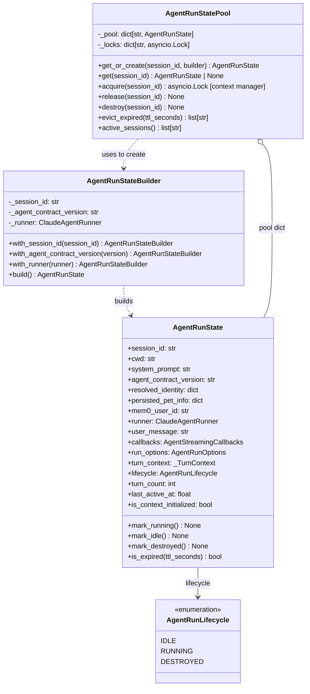

### 4.5 Builder + State + Pool 骨架（伪代码）

> 本节直接对齐生产实现。`AgentRunState` 列出全部 5 + 1 个 intrinsic（`session_id` / `cwd` / `system_prompt` / `agent_contract_version` / `resolved_identity` / `persisted_pet_info` / `mem0_user_id` / `runner`）与 4 个 extrinsic（`user_message` / `callbacks` / `run_options` / `turn_context`）；`AgentRunStateBuilder` 已在 2026-05-12 收敛到**最小 3 个 setter**（`with_session_id` / `with_agent_contract_version` / `with_runner`）—其余字段全部由 `ClaudeAgentService.assemble_context`（Phase 1 单一所有者）写入，让 Builder 不再越权污染 Phase 1 之外的字段。

> _(Pawkeyland 专属字段，Ink & Memory 中不适用)_ — `persisted_pet_info` / `mem0_user_id` 为 Pawkeyland 宠物系统字段，Ink & Memory 中对应字段按实际需求裁剪。

```python
from dataclasses import dataclass, field
from enum import Enum
from typing import Any, Optional


class AgentRunLifecycle(str, Enum):
    IDLE = "idle"
    RUNNING = "running"
    DESTROYED = "destroyed"


@dataclass
class AgentRunState:
    # 内在状态 — 首轮初始化后享元缓存，TTL 内复用；由 Service Phase 1 单一写入
    session_id: str
    cwd: str = ""
    system_prompt: str = ""
    agent_contract_version: str = ""
    resolved_identity: dict[str, Any] = field(default_factory=dict)
    persisted_pet_info: dict[str, Any] = field(default_factory=dict)
    mem0_user_id: str = ""
    runner: "Optional[ClaudeAgentRunner]" = field(default=None, repr=False)

    # 外在状态 — 每轮 Phase 1 创建 / Phase 4 finally 销毁
    user_message: str = ""
    callbacks: "Optional[AgentStreamingCallbacks]" = field(default=None, repr=False)
    run_options: "Optional[AgentRunOptions]" = field(default=None, repr=False)
    turn_context: Optional[Any] = field(default=None, repr=False)

    # 生命周期状态
    lifecycle: AgentRunLifecycle = AgentRunLifecycle.IDLE
    turn_count: int = 0
    last_active_at: float = field(default_factory=time.monotonic)

    @property
    def is_context_initialized(self) -> bool:
        """首轮 system_prompt 已组装完成（可跳过重新构建）。"""
        return bool(self.system_prompt and self.cwd)

    def is_expired(self, ttl_seconds: int = _RUNNER_TTL_SECONDS) -> bool:
        # 严格 `>` 边界：等于 TTL 时仍视为未过期，下一秒才驱逐
        if self.lifecycle != AgentRunLifecycle.IDLE:
            return False
        return time.monotonic() - self.last_active_at > ttl_seconds

    def mark_running(self) -> None:
        self.lifecycle = AgentRunLifecycle.RUNNING

    def mark_idle(self) -> None:
        # 仅在 RUNNING → IDLE 时递增 turn_count；Phase 1/2 失败的 finally 也会
        # 走这里，但 lifecycle 还是 IDLE，所以仅刷新 last_active_at。
        if self.lifecycle == AgentRunLifecycle.RUNNING:
            self.turn_count += 1
        self.lifecycle = AgentRunLifecycle.IDLE
        self.last_active_at = time.monotonic()

    def mark_destroyed(self) -> None:
        self.lifecycle = AgentRunLifecycle.DESTROYED
        self.runner = None
        self.turn_context = None


class AgentRunStateBuilder:
    """Minimal Builder — 只暴露生产 / 测试真正调用的 3 个 setter。"""

    def __init__(self) -> None:
        self._session_id: str = ""
        self._agent_contract_version: str = ""
        self._runner: "Optional[ClaudeAgentRunner]" = None

    def with_session_id(self, session_id: str) -> "AgentRunStateBuilder":
        # 由 AgentRunStatePool.get_or_create 自动注入
        self._session_id = session_id
        return self

    def with_agent_contract_version(self, version: str) -> "AgentRunStateBuilder":
        # 由 ClaudeAgentThreadFactory._run_lifecycle 注入
        self._agent_contract_version = version
        return self

    def with_runner(self, runner: "Optional[ClaudeAgentRunner]") -> "AgentRunStateBuilder":
        # Phase 2 预热 / 单元测试用；生产环境 Factory Phase 2 会延迟创建
        self._runner = runner
        return self

    def build(self) -> AgentRunState:
        # 故意只 seed 3 个 intrinsic — 其余字段由 Service.assemble_context 写入。
        # 不再在 build() 里预构造 AgentRunOptions，因为 Phase 1 每轮都会生成
        # 一个新的并立刻覆盖。
        return AgentRunState(
            session_id=self._session_id,
            agent_contract_version=self._agent_contract_version,
            runner=self._runner,
        )


class AgentRunStatePool:
    def __init__(self) -> None:
        self._pool: dict[str, AgentRunState] = {}
        self._locks: dict[str, asyncio.Lock] = {}

    def get_or_create(
        self, session_id: str, builder: AgentRunStateBuilder
    ) -> AgentRunState:
        existing = self._pool.get(session_id)
        # **透明重建**：DESTROYED / TTL 过期的 entry 不抛错，直接重建。
        # 与 §4.6 后台 Sweeper 协同 — Sweeper 调 destroy(session_id) 把
        # entry 标记 DESTROYED 之后从 pool 弹出，所以正常情况下 existing
        # 不会是 DESTROYED；这条分支只是给手工 `state.mark_destroyed()`
        # 之后仍持有外部引用的特殊路径兜底。
        if existing is not None and existing.lifecycle != AgentRunLifecycle.DESTROYED:
            return existing
        if existing is not None:
            self._pool.pop(session_id, None)
        state = builder.with_session_id(session_id).build()
        self._pool[session_id] = state
        if session_id not in self._locks:
            self._locks[session_id] = asyncio.Lock()
        return state

    def get(self, session_id: str) -> Optional[AgentRunState]:
        return self._pool.get(session_id)

    def acquire(self, session_id: str) -> asyncio.Lock:
        """返回 session 对应的排队锁（单消费者保障）。"""
        if session_id not in self._locks:
            self._locks[session_id] = asyncio.Lock()
        return self._locks[session_id]

    def destroy(self, session_id: str) -> None:
        state = self._pool.pop(session_id, None)
        if state:
            state.mark_destroyed()
        self._locks.pop(session_id, None)

    def evict_expired(self, ttl_seconds: int = _RUNNER_TTL_SECONDS) -> list[str]:
        """lock-aware: 跳过正在被持锁的 session，避免 race。"""
        evicted: list[str] = []
        for sid in list(self._pool):
            lock = self._locks.get(sid)
            if lock is not None and lock.locked():
                continue
            if self._pool[sid].is_expired(ttl_seconds):
                self.destroy(sid)
                evicted.append(sid)
        return evicted

    def active_sessions(self) -> list[str]:
        return [
            sid for sid, s in self._pool.items()
            if s.lifecycle != AgentRunLifecycle.DESTROYED
        ]
```

---

### 4.6 TTL 自动驱逐（Runner Keepalive 10 分钟）+ 后台 Sweeper 队列

#### 设计目标

- Runner 状态（`AgentRunState`）默认在最后一轮结束后保留 **10 分钟**
- 10 分钟内再次到来的请求通过 `session_id` 直接复用已有状态，**无需重新构造** workspace / system_prompt / AgentRunOptions
- 超过 10 分钟无活动后，状态从 Pool 中自动清除，下一次请求将重新初始化
- 即使在**没有新请求**的情况下，10 分钟到期的状态也必须被自动销毁 —— 由 `AgentRunStateSweeper` 这个后台 asyncio 任务**主动**周期性扫描并驱逐

#### 关键字段

| 字段 | 类型 | 赋值时机 | 用途 |
|------|------|---------|------|
| `last_active_at` | `float`（`time.monotonic()`） | 创建时初始化；每次 `mark_idle()` 刷新 | 计算自最后一轮结束起的空闲时长 |

#### TTL 判断逻辑

```python
def is_expired(self, ttl_seconds: int = _RUNNER_TTL_SECONDS) -> bool:
    if self.lifecycle != AgentRunLifecycle.IDLE:
        return False  # RUNNING / DESTROYED 状态不判断超时
    return time.monotonic() - self.last_active_at > ttl_seconds
```

#### 驱逐触发点

```python
# AgentRunStatePool.evict_expired()
def evict_expired(self, ttl_seconds: int = _RUNNER_TTL_SECONDS) -> list[str]:
    expired = [sid for sid, state in list(self._pool.items()) if state.is_expired(ttl_seconds)]
    for sid in expired:
        self.destroy(sid)
    return expired

# ClaudeAgentThreadFactory.run_streaming() 入口调用
evicted = self._pool.evict_expired()
if evicted:
    logger.debug("Evicted %d expired runner session(s): %s", len(evicted), evicted)
```

#### 配置

| 环境变量 | 默认值 | 说明 |
|---------|--------|------|
| `INK_AGENT_TTL_S` | `600` | Runner 状态 keepalive 时长（秒），不得小于 1 |
| `INK_AGENT_SWEEP_INTERVAL_S` | `60` | 后台 Sweeper 扫描周期（秒），不得小于 1；默认每分钟扫一次，配合 600 s TTL 在一个 keepalive 窗口内最多扫 10 次 |

#### 后台 Sweeper（10 分钟状态池队列）

```python
class AgentRunStateSweeper:
    """周期性后台任务：维护 10 分钟 keepalive 状态池队列。

    前置条件：Pool.evict_expired() 是按需驱逐（仅在新请求到达时触发），
    在低流量场景下闲置状态可能存活数小时。Sweeper 通过后台 asyncio 任务
    每 N 秒主动调用 evict_expired() 关闭这个空窗。
    """

    def __init__(self, pool, *, interval_seconds=60, ttl_seconds=600): ...

    async def start(self) -> None:
        """惰性启动后台扫描任务（绑定到 FastAPI worker 事件循环）。"""

    async def stop(self) -> None:
        """优雅停机；多次调用幂等。"""

    async def sweep_once(self) -> list[str]:
        """单次扫描，返回被驱逐的 session_id 列表（用于测试 / 运维）。"""

    async def destroy_all(self) -> list[str]:
        """无视 TTL 销毁所有 session（用于应用关闭时释放 SDK 子进程句柄）。"""

    @property
    def is_running(self) -> bool: ...

    recent_evictions: deque[tuple[float, list[str]]]   # 最近 N 批驱逐记录
    total_evicted: int                                  # 进程生命周期累计
```

由 Factory 持有并在以下时机驱动：

| 时机 | 动作 |
|------|------|
| `ClaudeAgentThreadFactory.__init__` | 构造 sweeper，`is_running = False` |
| 第一次 `run_streaming` 调用 | `_ensure_sweeper_started()` 惰性启动后台任务 |
| 每个 sweep 周期（默认 60 s） | `pool.evict_expired()` 驱逐 IDLE+过期 session |
| `ClaudeAgentThreadFactory.aclose()` | `sweeper.stop()` + `sweeper.destroy_all()` 释放所有缓存 runner |

#### 锁感知驱逐（race protection）

后台 Sweeper 与 `run_streaming` 调用方并发运行，必须避免在 Phase 1 / Phase 2 / Phase 3 期间销毁正在被使用的 state。`AgentRunStatePool.evict_expired()` 现在会跳过其 `asyncio.Lock` 处于 `locked()` 状态的 session：

```python
def evict_expired(self, ttl_seconds=...):
    expired = []
    for sid, state in list(self._pool.items()):
        if not state.is_expired(ttl_seconds):
            continue
        lock = self._locks.get(sid)
        if lock is not None and lock.locked():
            continue   # 正在 Phase 1/2/3 — 等下一轮 sweep
        expired.append(sid)
    for sid in expired:
        self.destroy(sid)
    return expired
```

理由：`mark_running()` 仅在 Phase 3 开始时才设置；Phase 1 / Phase 2 期间 lifecycle 仍是 IDLE，单靠 `is_expired()` 的 `lifecycle == IDLE` 判断不足以避免这个 race。引入 `lock.locked()` 闸门后，consumer 无论处在哪个 Phase 都能保证不被并发 sweep 拔走。

#### `get_or_create` 中的 TTL 检查（透明重建）

```python
def get_or_create(self, session_id, builder):
    existing = self._pool.get(session_id)
    if existing is not None:
        # 透明重建：DESTROYED entry 直接弹出并重建，不抛错。
        # 这条分支只是给手工 ``state.mark_destroyed()`` 之后仍持有
        # 外部引用的特殊路径兜底；正常情况下 Sweeper 调 destroy(sid)
        # 时已经把 entry 从 pool 弹出。
        if existing.lifecycle == AgentRunLifecycle.DESTROYED:
            self._pool.pop(session_id, None)
            existing = None
        elif existing.is_expired():
            self.destroy(session_id)  # 驱逐后向下重新创建
            existing = None
        else:
            return existing
    # 创建新状态
    ...
```

#### 时序图（TTL 复用 vs. 超时重建）

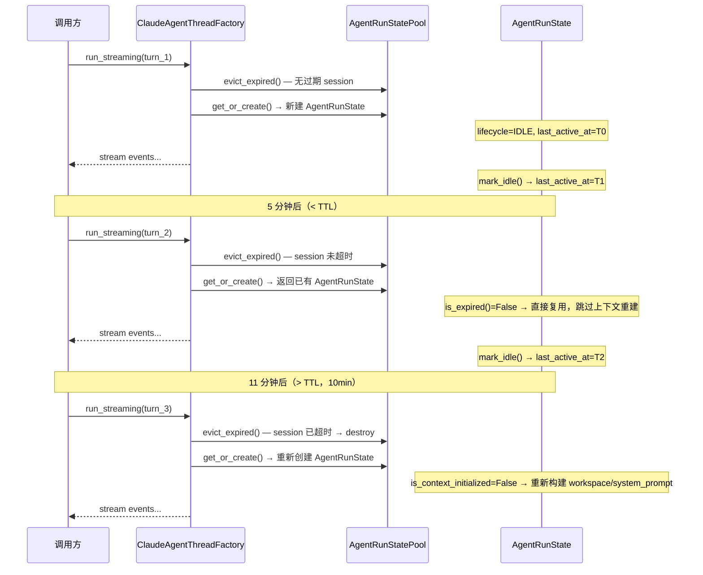

---

## 5. 工厂模式（Factory）— 对外 API

### 5.1 设计目标

- 提供唯一的公开入口，隐藏 Observer 注册、Pool 管理、锁获取等内部细节
- 对外契约与现有 SSE 协议（`message-metadata` / `text-*` / `tool-*` / `message-final` / `finish` / `error`）+ `confirm_tool` 保持语义兼容；Service 不再暴露独立的 `run_streaming` 入口，只提供 `assemble_context` / `execute_session` 这两个 phase-aware 方法供 Factory 调用

### 5.2 API 清单

| 方法 | 说明 |
|------|------|
| `run_streaming(request)` → `AsyncGenerator[dict]` | 主流程入口；首次调用时惰性创建 AgentRunState、惰性启动 Sweeper，内部完成 4 阶段生命周期并触发 Observer 钩子 |
| `confirm_tool(session_id, tool_call_id, approved, ...)` | 工具确认（委托 ToolConfirmationStore） |
| `close_thread(session_id)` | 销毁 Pool 中的 AgentRunState，释放资源；下一次 `run_streaming` 会重新惰性创建 |
| `aclose()` | 关闭 Sweeper 后台任务并销毁所有 session（应用关闭时调用） |
| `register_observer(observer)` | 注册生命周期 Observer |
| `active_sessions()` | 查询当前活跃的 sessionId 列表（运维/调试用） |
| `sweep_stats()` | 返回 keepalive 队列运行快照（is_running / 间隔 / TTL / 最近驱逐批次） |

### 5.3 类图

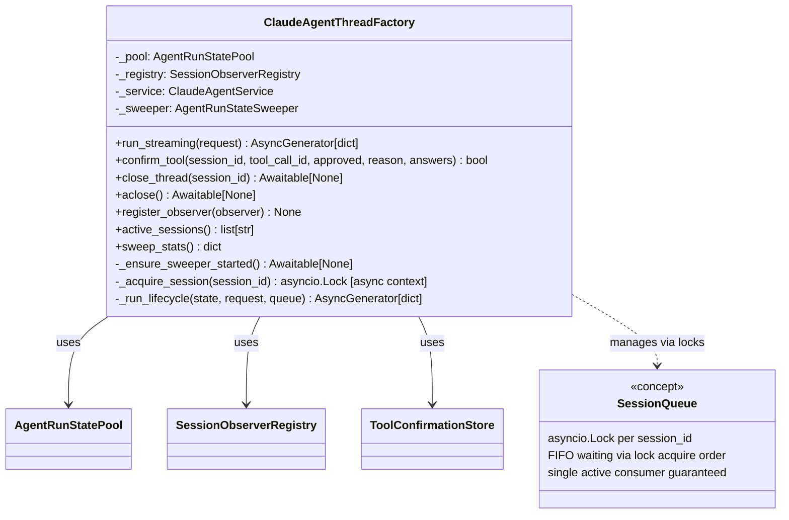

### 5.4 Factory 骨架（伪代码）

> 生产实现要点：Factory **不**自己拼 system_prompt / 取 workspace / 构造 RunOptions — 这些全部下沉到 `service.assemble_context`（Phase 1 单一所有者）。Factory 只负责：取锁 → 取/建享元 → 委托 Phase 1 → Phase 2 创建 Runner → Phase 3 后台跑 `execute_session` 并 drain 共享队列 → finally 清 extrinsic + `mark_idle`。Phase 4 钩子由 `_fire_session_ended` 在 `close_thread` / TTL Sweeper / `aclose` 三条 State destruction 路径分别发出。`__init__` 持有**单实例** `ClaudeAgentService`（store 由 Service 内部持有），并默认注册 `LoggingObserver`。

```python
from contextlib import asynccontextmanager

class ClaudeAgentThreadFactory:
    def __init__(self, *, register_default_observers: bool = True) -> None:
        self._pool = AgentRunStatePool()
        self._registry = SessionObserverRegistry()
        if register_default_observers:
            self._registry.register(LoggingObserver())
        # 单实例 Service — 让 ToolConfirmationStore 在 run_streaming 与
        # confirm_tool 之间共享同一份 _pending 字典。
        self._service = ClaudeAgentService()
        self._sweeper = AgentRunStateSweeper(
            self._pool, on_evicted=self._on_sessions_destroyed,
        )
        self._sweeper_started: bool = False
        self._sweeper_start_lock: Optional[asyncio.Lock] = None

    def register_observer(self, observer: SessionLifecycleObserver) -> None:
        self._registry.register(observer)

    def active_sessions(self) -> list[str]:
        return self._pool.active_sessions()

    @asynccontextmanager
    async def _acquire_session(self, session_id: str):
        """单消费者保障：同一 session_id 的请求通过 asyncio.Lock 串行排队。"""
        lock = self._pool.acquire(session_id)
        async with lock:
            yield

    async def run_streaming(
        self, request: ClaudeAgentRunRequest
    ) -> AsyncGenerator[dict, None]:
        await self._ensure_sweeper_started()
        session_id = _build_session_id(request)
        queue: asyncio.Queue[Optional[dict]] = asyncio.Queue()

        async with self._acquire_session(session_id):           # 单消费者排队
            state = self._pool.get_or_create(
                session_id,
                AgentRunStateBuilder().with_agent_contract_version(
                    _AGENT_RUNTIME_CONTRACT_VERSION
                ),
            )
            async for event in self._run_lifecycle(state, request, queue):
                yield event

    async def _run_lifecycle(
        self,
        state: AgentRunState,
        request: ClaudeAgentRunRequest,
        queue: asyncio.Queue,
    ) -> AsyncGenerator[dict, None]:
        session_id = state.session_id
        execution: Optional[_TurnExecution] = None
        execute_task: Optional[asyncio.Task] = None
        try:
            # Phase 1 — Context Assembly（Service 是唯一 owner，写回享元的
            # intrinsic 5 件套 + extrinsic 3 件套 + turn_context）
            metadata = _assemble_metadata(state, request)
            await self._registry.emit_before_context_assembly(session_id, metadata)
            execution = await self._service.assemble_context(
                request, state=state, queue=queue,
            )
            await self._registry.emit_after_context_assembly(session_id, metadata)

            # Phase 2 — Runner 创建（享元缓存）
            await self._registry.emit_before_runner_created(session_id)
            if state.runner is None:
                state.runner = create_agent_runner()
            execution.runner = state.runner
            await self._registry.emit_after_runner_created(session_id, state.runner)

            # Phase 3 — Session Start（后台跑 execute_session，主协程 drain 共享 queue）
            state.mark_running()
            await self._registry.emit_before_session_started(session_id, metadata)
            execute_task = asyncio.create_task(
                self._service.execute_session(execution)
            )
            while True:
                event = await queue.get()
                if event is None:
                    break
                yield event
            await execute_task
            execute_task = None
            await self._registry.emit_after_session_started(session_id)

        except asyncio.CancelledError:
            raise
        except BaseException as exc:
            if _exception_group_contains_cancelled(exc):
                raise
            yield {"type": "error", "errorText": _format_exception_message(exc)}
        finally:
            # 每轮收尾（**不**是 Phase 4）：取消未完成的 execute_task、清
            # extrinsic 三件套 + turn_context、刷 mark_idle。
            # Phase 4 钩子由 `_fire_session_ended` 在 State destruction
            # 三条路径分别发出。
            if execute_task is not None and not execute_task.done():
                execute_task.cancel()
                with suppress(asyncio.CancelledError, Exception, BaseException):
                    await execute_task
            if execution is not None:
                for stale_id in list(execution.ctx.pending_confirmation_ids):
                    self._service._store.cancel_pending(stale_id)
                execution.ctx.pending_confirmation_ids.clear()
            state.user_message = ""
            state.callbacks = None
            state.run_options = None
            state.turn_context = None
            state.mark_idle()  # 仅 RUNNING → IDLE 时递增 turn_count

    # Phase 4 (Session End) — 只在 State 销毁时发火
    async def _fire_session_ended(self, session_id, *, reason, turn_count=None):
        result = {"session_id": session_id, "reason": reason, "destroyed": True}
        if turn_count is not None:
            result["turn_count"] = turn_count
        await self._registry.emit_before_session_ended(session_id)
        await self._registry.emit_after_session_ended(session_id, result)

    async def close_thread(self, session_id):
        state = self._pool.get(session_id)
        if state is None:
            return
        turn_count = state.turn_count
        self._pool.destroy(session_id)
        await self._fire_session_ended(
            session_id, reason="explicit_close", turn_count=turn_count,
        )

    async def _on_sessions_destroyed(self, session_ids, reason):
        # Sweeper 的 on_evicted 回调：reason 由 sweeper 给出
        # ("ttl_expired" 或 "factory_aclose")
        for sid in session_ids:
            await self._fire_session_ended(sid, reason=reason)

    def confirm_tool(
        self,
        session_id: str,
        tool_call_id: str,
        approved: bool,
        reason: Optional[str] = None,
        answers: Optional[dict] = None,
    ) -> bool:
        # 委托给单实例 Service 的 confirm_tool —— store 由 Service 持有。
        return self._service.confirm_tool(
            tool_call_id=tool_call_id,
            approved=approved,
            reason=reason,
            answers=answers,
        )

    async def aclose(self) -> None:
        # 停 sweeper、批量销毁（fire emit_*_session_ended reason="factory_aclose"）
        await self._sweeper.stop()
        await self._sweeper.destroy_all()
```

---

## 6. 业务时序图

### 6.1 整体流程（单次请求，含 4 阶段 + Observer）

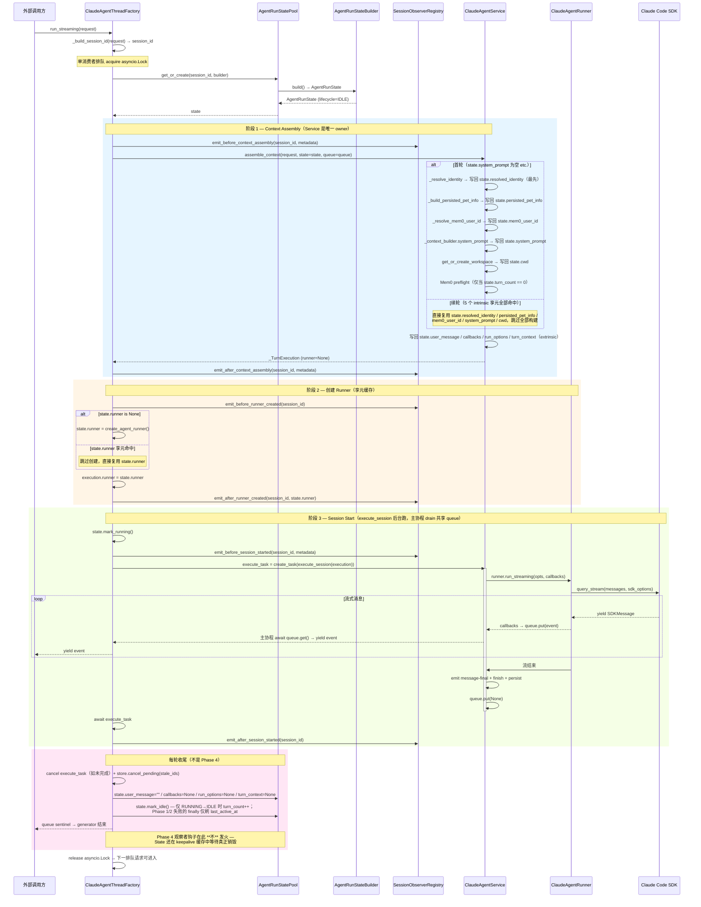

#### 6.1.1 Phase 4 — State 销毁的三条路径

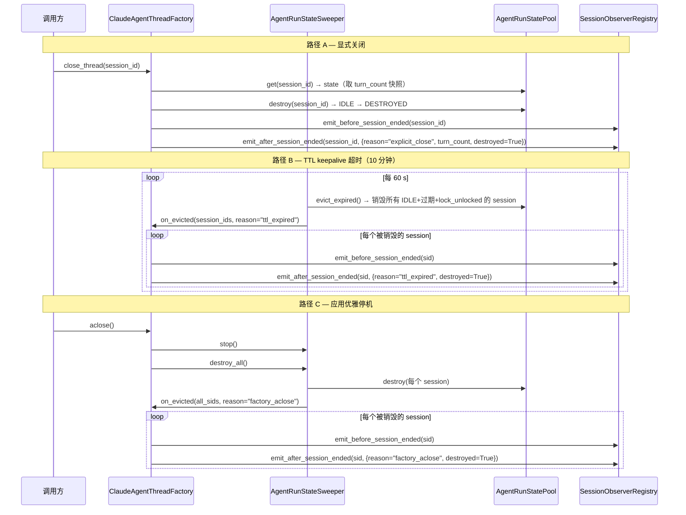

### 6.2 并发请求排队（同一 sessionId，两个请求）

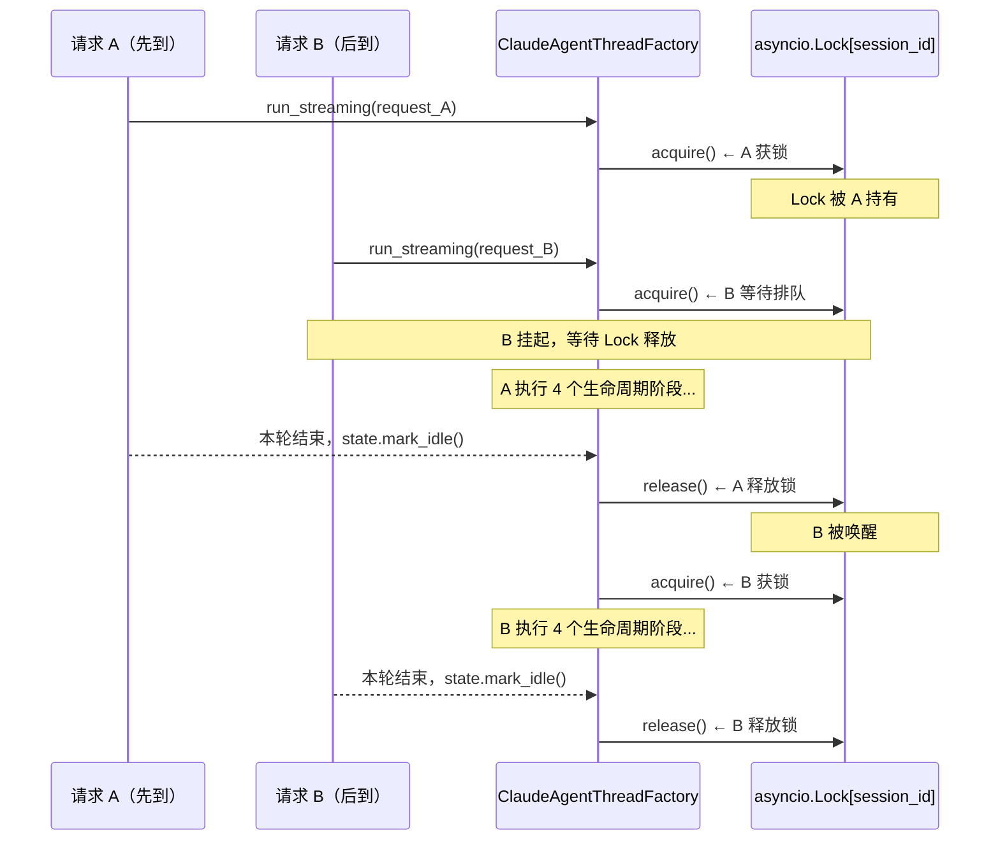

### 6.3 首轮 Thread 创建 vs. 续轮轻量调用

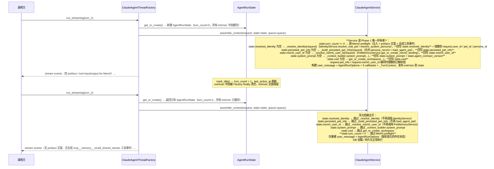

### 6.4 工具确认（manual 模式）

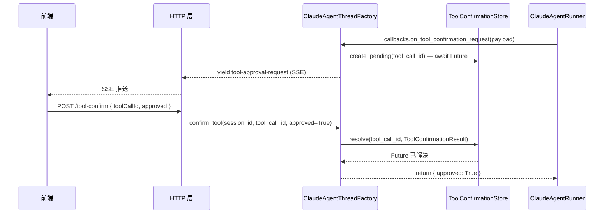

---

## 7. 模块目录规划

> 实际落地（2026-05-12）：所有 Claude Agent 业务模块已收敛到 `backend/claude_agent/` 子包，旧的扁平文件已删除。

```
backend/claude_agent/
├── __init__.py                # 对外 re-export 全部公开符号
├── context_builder.py         # ClaudeAgentContextBuilder
├── observer.py                # SessionLifecycleObserver / SessionObserverRegistry / LoggingObserver
├── service.py                 # ClaudeAgentService — Phase 1 (assemble_context) + Phase 3 (execute_session) 消费者
├── state_builder.py           # AgentRunStateBuilder（建造者，含 with_runner() 预注入）
├── thread_factory.py          # ClaudeAgentThreadFactory — 4 阶段生产者；持有 Pool / Sweeper / Observer Registry
├── thread_pool.py             # AgentRunLifecycle / AgentRunState / AgentRunStatePool / AgentRunStateSweeper
└── tool_confirmation_store.py # ToolConfirmationStore / ToolConfirmationResult
```

模块依赖方向：

```
ClaudeAgentThreadFactory ──┬──► AgentRunStatePool ──► AgentRunState ◄── AgentRunStateBuilder
                           │
                           ├──► AgentRunStateSweeper ──► AgentRunStatePool
                           │
                           ├──► SessionObserverRegistry ◄── SessionLifecycleObserver
                           │
                           └──► ClaudeAgentService ──► ClaudeAgentContextBuilder
                                                  └──► ToolConfirmationStore
```

---

## 8. 与现有架构的集成策略

| 集成点 | 当前实现 | Thread 模式映射 |
|--------|---------|----------------|
| `ClaudeAgentService.assemble_context` | 每次重新组装 context（DB / Mem0 preflight / system_prompt / user_message / AgentRunOptions / 5 callbacks / _TurnContext） | Service 是 Phase 1 **唯一所有者**：首轮按顺序解析 `resolved_identity`（IdentityService.resolve_real_pet / resolve_system_persona）→ `persisted_pet_info`（合并 persona_record + load_agent_pet）→ `mem0_user_id`（PetMemoryService.get_or_create_mem0_binding）→ `system_prompt` / `cwd`，每个都**回写到 state.*** 并把已解析值镜像回 `request.*`；续轮全部走享元短路；**Mem0 preflight 仅首轮跑**（`state.turn_count == 0`，含 TTL/`close_thread` 重建后的第一轮）；Factory 没有任何 Phase 1 builder，不再调用 `IdentityService` / `build_system_prompt` / `get_or_create_workspace`；`server.claude_agent_stream` 退化为「请求校验 + 404」薄壳，转发原始 client IDs 给 Service |
| `workspace_key` = `user_id` | 每次传入 | 作为 `session_id` 存入 `AgentRunState.session_id` |
| `_put({ type: "message-metadata", sessionId })` | 阶段 1 触发 | Observer `on_after_context_assembly` 之后发送 metadata 事件 |
| `create_agent_runner()` | 每次新建 | 阶段 2，Factory 在 `state.runner is None` 时调用一次 `create_agent_runner()` 并缓存到 `AgentRunState.runner`；后续轮次直接复用缓存的 runner，直至 `close_thread` / TTL 驱逐 |
| `runner.run_streaming(opts, callbacks)` | 阶段 3 主流程 | 阶段 3，Factory 把 `state.runner` 写到 `_TurnExecution.runner` 后调用 `ClaudeAgentService.execute_session(execution)`；service 内直接驱动 `execution.runner.run_streaming(opts, callbacks)`，`opts.thread_id` 固定为 `session_id`，保障 Claude SDK 会话续接 |
| `asyncio.Queue` sentinel 循环 | 每轮收尾 | `execute_session` 在 finally 投递 `None`，Factory 的 `_run_lifecycle` 边读边 yield，并在 finally 清空 extrinsic 字段、`mark_idle` —— **不发 Phase 4 观察者钩子**（State 仍在 keepalive 缓存中等待真正销毁）|
| Phase 4 钩子（`emit_*_session_ended`）| 阶段 4 = State 销毁 | 由 `_fire_session_ended` 在三个 destroy 路径上各发一次：`close_thread` (reason="explicit_close")、Sweeper 的 `on_evicted` 回调 (reason="ttl_expired")、`aclose → sweeper.destroy_all` (reason="factory_aclose") |
| `ToolConfirmationStore` | 附加在 Service 实例上 | 注入到 Factory，通过 `confirm_tool(session_id, ...)` 委托 |

---

## 9. 安全约束

| 约束 | 实现位置 |
|------|---------|
| `session_id` 不允许包含 `/`、`\`、`..` | `AgentRunStatePool.get_or_create` 入口校验 |
| 单 sessionId 单消费者 | `asyncio.Lock` per session，`_acquire_session` 上下文管理器 |
| `DESTROYED` 状态自动重建 | `session_id` 是稳定的（`user_id`），`DESTROYED` 态被 `get_or_create` 透明替换为新鲜状态，`close_thread` 后下一次 `run_streaming` 即可无感恢复 |
| 工具确认 Future 在 cancel/disconnect 时清理 | `ClaudeAgentThreadFactory._run_lifecycle.finally` 调用 `ToolConfirmationStore.cancel_pending` 释放 `state.turn_context.pending_confirmation_ids` |

---

## 10. 实现状态（Implementation Status）

> 最后更新：2026-05-12

### 10.1 已完成模块

| 文件 | 模式 | 状态 |
|------|------|------|
| `backend/claude_agent/observer.py` | Observer + **Phase 4 钩子 reason 语义校准（explicit_close / ttl_expired / factory_aclose）** | ✅ 完成 |
| `backend/claude_agent/thread_pool.py` | Flyweight + State + **TTL 驱逐（lock-aware）** + **DESTROYED 自动重建** + **runner intrinsic cache** + **`AgentRunStateSweeper` 后台 keepalive 队列 + on_evicted 回调** + **`resolved_identity` / `persisted_pet_info` / `mem0_user_id` 三项 intrinsic 享元字段** | ✅ 完成 |
| `backend/claude_agent/state_builder.py` | Builder + `with_runner()` 预注入 | ✅ 完成 |
| `backend/claude_agent/thread_factory.py` | Factory + **Phase 2 飞享元缓存（runner）** + TTL 驱逐触发 + **后台 Sweeper 惰性启动** + **`aclose()` 优雅停机** + **`sweep_stats()` / `active_sessions()` 运维快照** + **Phase 4 钩子 `_fire_session_ended` 在 close_thread / TTL Sweeper / aclose 三条路径分别发火** | ✅ 完成 |
| `backend/claude_agent/service.py` | 业务服务（迁入子包）+ **`assemble_context` 是 Phase 1 唯一所有者**（intrinsic + extrinsic 全在 Service 内享元短路 / 写回）+ **`execute_session` 是 Phase 3 纯消费者**（`execution.runner is None` 时显式抛错） | ✅ 完成 |
| `backend/claude_agent/context_builder.py` | 上下文构建（迁入子包） | ✅ 完成 |
| `backend/claude_agent/tool_confirmation_store.py` | 工具确认存储（迁入子包，跨 loop 桥接） | ✅ 完成 |

所有调用方（`server.py` 包括 `claude_agent_thread_factory = ClaudeAgentThreadFactory()` 单例 + `factory.run_streaming(...)` + `factory.confirm_tool(...)`）已更新为 `backend.claude_agent.*` 规范路径。

### 10.2 模块对应关系

```
backend/
├── claude_agent/               ← 子包，所有 Claude Agent 业务在此处
│   ├── __init__.py             # 对外重新导出全部公开符号
│   ├── context_builder.py      # ClaudeAgentContextBuilder
│   ├── observer.py             # SessionLifecycleObserver / SessionObserverRegistry / LoggingObserver
│   ├── service.py              # ClaudeAgentService（主链路实现）
│   ├── state_builder.py        # AgentRunStateBuilder (fluent builder)
│   ├── thread_factory.py       # ClaudeAgentThreadFactory — 直接驱动 service.assemble_context() + service.execute_session()
│   ├── thread_pool.py          # AgentRunLifecycle / AgentRunState / AgentRunStatePool
│   └── tool_confirmation_store.py  # ToolConfirmationStore / ToolConfirmationResult
├── server.py
└── ...
```

### 10.3 ClaudeAgentService 链路集成

**核心设计决策（2026-05-11 更新）**：

`ClaudeAgentThreadFactory._run_lifecycle()` 严格按 4 个生命周期阶段驱动，把 Service 重新定位为 **Phase 1（extrinsic）+ Phase 3 业务的消费者**；`AgentRunState` 是 runner 运行所需的**全部组件**（intrinsic + extrinsic）的唯一所有者；Service 暴露三个相位感知方法，让工厂的"生产者"语义与服务的"消费者"语义在类型系统中显式对齐：

- **`assemble_context(request, *, state, queue, runner)`** —— Phase 1 完整入口：DB 加载 + `_TurnContext` 创建 + 5 个 `AgentStreamingCallbacks` 闭包 + 初始 `message-metadata` + Mem0 召回 preflight + `system_prompt` / `user_message` 构建 + `AgentRunOptions` 构建 + 享元 extrinsic 发布。返回 `_TurnExecution` carrier，其中 `runner=None`。

> _(Pawkeyland 专属字段，Ink & Memory 中不适用)_ — Mem0 召回 preflight 为 Pawkeyland 宠物记忆系统特性，Ink & Memory 中按实际需求裁剪。

- **`execute_session(execution)`** —— Phase 3 纯消费者：驱动 `execution.runner.run_streaming(opts, callbacks)`、发送 `message-final` / `finish` / `error` 帧、持久化 claude_message 行；`execution.runner is None` 时直接抛 `RuntimeError`，让 Phase 2 的边界显式不可绕过。

- **`run_streaming(request, *, runner, state)`** —— 兼容旧调用方的"一体化"入口：内部依次跑 Phase 1 → 2 → 3 → 4，提供给不走 Factory 的单次调用路径（如某些诊断脚本）。

工厂 `_run_lifecycle` 现在是这样驱动的：

- **Phase 1（上下文组装）**：
  - **Intrinsic**: Factory 直接调用 `build_system_prompt()` 和 `get_or_create_workspace()` 缓存 `state.system_prompt` / `state.cwd`（跨轮复用）。
  - **Extrinsic**: Factory 调用 `service.assemble_context(service_request, state=state, queue=queue)`；Service 在 Phase 1 内部把 `enriched_user_message` / `callbacks` / `opts` / `_TurnContext` **立即**写回 `state.*`，并把 carrier `_TurnExecution` 返回给 Factory。
  - `emit_after_context_assembly` 只在两层 Phase 1 都落到享元后才发火 —— 观察者看到的是**完整的** Phase 1 终态，而不再是仅 intrinsic 的子集。

- **Phase 2（创建 Runner）**：在 `state.runner is None` 时调用 `create_agent_runner()`，将实例缓存到 `AgentRunState.runner`，再写回 carrier (`execution.runner = state.runner`) 让 Phase 3 显式使用；`emit_after_runner_created(session_id, state.runner)` 把真正的 runner 实例移交给观察者。

- **Phase 3（会话发起）**：Factory 把 `service.execute_session(execution)` 作为后台任务起来，与同一进程上的 `queue` 漏斗并发运行；queue 是 Phase 1 + Phase 3 共享的**唯一**队列（Service 不再有自己的内部 queue + Factory 桥接到第二个 queue 的旧机制）。Factory 边读 queue 边把事件 yield 出去，直到 `execute_session` 投递 `None` sentinel。

- **Phase 4（结束状态）**：
  - finally 中清空 extrinsic 三件套 + `turn_context`：`state.user_message = ""` / `state.callbacks = None` / `state.run_options = None` / `state.turn_context = None`，让 State 的 "create in Phase 1 / destroy in Phase 4" 契约端到端闭合。
  - intrinsic 三件套（`system_prompt` / `cwd` / `runner`）继续保留，直到 `close_thread` 或 TTL 驱逐才被 `mark_destroyed()` 清空（避免 SDK 子进程句柄跨重建泄漏）。
  - 客户端断开 / 异常退出时，Phase 4 取消 `execute_session` 后台任务并 `cancel_pending` 所有 in-flight tool-confirmation Future，避免 ToolConfirmationStore 泄漏。
  - `state.mark_idle()` 刷新 TTL；**不发** `emit_*_session_ended` —— Phase 4 观察者钩子由 `_fire_session_ended` 在 State **真正销毁**的三条路径上分别发火（`close_thread` / Sweeper TTL / `aclose`）。

这样观察者模式的 8 个钩子真正按"工厂（生产者）→ 服务（消费者）"的语义对齐：钩子在 phase 边界精确发火（`emit_after_*` 只在该 phase 的全部产物可观察后才返回），外部观察者可以按相位接管日志 / 持久化 / 监控；同时 `AgentRunState` 的字段视图就是 runner 在当前生命周期阶段的完整组件清单，`_TurnExecution` carrier 是 Phase 1 → Phase 3 之间的显式数据流。

| 能力 | 实现位置 | 工厂是否缓存 / 委托 |
|------|---------|----------------|
| `system_prompt` 组装 | `build_system_prompt()` ← Factory Phase 1 | ✅ **首轮构建，缓存到 AgentRunState** |
| Workspace 创建 | `get_or_create_workspace()` ← Factory Phase 1 | ✅ **首轮创建，路径缓存到 AgentRunState** |
| Runner 创建（`create_agent_runner()`） | Factory Phase 2 | ✅ **首轮创建，实例缓存到 `AgentRunState.runner`；后续轮次按 `session_id` 复用，`mark_destroyed` 时清空** |
| DB 会话加载 / 持久化 | `ClaudeAgentService` | ✅ 每轮委托 |
| Mem0 记忆召回 preflight | `ClaudeAgentService` | ✅ 每轮委托 |
| `user_message` 组装 | `ClaudeAgentContextBuilder` via Service Phase 1 | ✅ **每轮委托；Service 完成后立即写入 `state.user_message`，Phase 4 销毁** |
| `AgentStreamingCallbacks` 构造 | Service Phase 1 闭包 | ✅ **每轮委托；Service 构造后立即写入 `state.callbacks`，Phase 4 销毁** |
| `AgentRunOptions` 构造 | Service Phase 1 | ✅ **每轮委托；Service 构造后立即写入 `state.run_options`，Phase 4 销毁** |
| 每轮可变累加器（queue / `full_response_text` / `response_parts` / `server_latency` / `sticker_token_filter` / `pending_confirmation_ids` …） | Service Phase 1 内打包到 `_TurnContext` | ✅ **每轮委托；Service 构造后立即写入 `state.turn_context`，Phase 4 销毁** |
| Session rollover（最大 turn 窗口） | `ClaudeAgentService` | ✅ 每轮委托 |
| 贴纸 token 过滤 | `_StreamingStickerTokenFilter` | ✅ 每轮委托 |
| Reasoning SSE 事件 | `ClaudeAgentService` | ✅ 每轮委托 |
| SSE keepalive 帧 | `ClaudeAgentService` | ✅ 每轮委托 |
| `message-final` normalizedPayload | `ClaudeAgentService` | ✅ 每轮委托 |
| 工具确认 Future | `ToolConfirmationStore`（service 内） | ✅ 每轮委托 |
| per-session asyncio.Lock (FIFO) | `AgentRunStatePool` | ✅ **工厂新增** |
| Observer 生命周期钩子（8 个） | `SessionObserverRegistry` | ✅ **工厂新增** |
| 状态追踪（turn_count / IDLE/RUNNING） | `AgentRunState` | ✅ **工厂新增** |
| Runner 状态 TTL 驱逐（10 分钟默认） | `AgentRunStatePool.evict_expired()` | ✅ **工厂触发** |

### 10.4 公开 API 一览

```python
from backend.claude_agent import (
    # Factory — 主入口
    ClaudeAgentThreadFactory,
    # Observer
    SessionLifecycleObserver,
    SessionObserverRegistry,
    LoggingObserver,
    # Flyweight + State
    AgentRunLifecycle,
    AgentRunState,
    AgentRunStatePool,
    # Builder
    AgentRunStateBuilder,
)

# 初始化（应用启动时）
factory = ClaudeAgentThreadFactory()
factory.register_observer(LoggingObserver())

# HTTP 流式端点（与 ClaudeAgentService 完全相同的 SSE 事件合同）
async for event in factory.run_streaming(request):
    yield f"data: {json.dumps(event)}\\n\\n"

# 工具确认端点（委托给内置 ClaudeAgentService.confirm_tool()）
ok = factory.confirm_tool(session_id, tool_call_id, approved=True)

# 关闭 Thread
await factory.close_thread(session_id)
```

### 10.5 与 ClaudeAgentService 的差异

| 特性 | ClaudeAgentService | ClaudeAgentThreadFactory |
|------|--------------------|--------------------------|
| 并发隔离 | 无 | `asyncio.Lock` per `session_id` |
| 生命周期钩子 | 无 | `SessionObserverRegistry`（8 个钩子） |
| 状态管理 | 无状态 | `AgentRunStatePool`（生命周期感知） |
| `system_prompt` 组装 | **每轮重建** | **首轮构建后缓存**，续轮注入 override |
| Workspace 创建 | **每轮检查** | **首轮创建后缓存**，续轮注入 cwd |
| `ClaudeAgentRunner` 实例 | **每轮 `create_agent_runner()`** | **首轮 `create_agent_runner()` 后缓存到 `state.runner`**，续轮通过 `runner=` kwarg 注入；`mark_destroyed` 清空缓存 |
| `user_message` / `callbacks` / `run_options` 所有权 | 仅局部变量 | **写入 `state.user_message` / `state.callbacks` / `state.run_options`**，Phase 1 创建、Phase 4 销毁（State 模式统一管理 runner 输入） |
| 每轮可变累加器（queue / 累加器 / 计时表 / 过滤器 / pending 集合） | 散落在 run_streaming 局部 | **集中到 `_TurnContext` 并挂在 `state.turn_context`**，Phase 1 创建、Phase 4 销毁（State 模式提供 "runner 现在在做什么" 的单一观察句柄） |
| Runner 状态 TTL 驱逐 | 无 | `evict_expired()`，默认 600 s |
| 业务逻辑（DB/Mem0/SSE）| 内置 | 委托给内部 `ClaudeAgentService` 实例 |
| 工具确认 | `self._store` 直接管理 | 委托给 `self._service.confirm_tool()` |

### 10.6 待完善（Future Work）

- `PersistenceObserver`：自定义持久化观察者实现，可在 Phase 4 钩子（reason ∈ {`explicit_close`, `ttl_expired`, `factory_aclose`}）中对接外部存储 / 监控管线
- `long_term_profile` 失效通知：当 Mem0 更新记忆摘要后，可通知 Factory 清除 `state.system_prompt` 缓存，强制下一轮重建（目前 10 分钟 TTL 内使用首轮缓存；可考虑暴露 `factory.invalidate_intrinsic(session_id, fields=["system_prompt"])` API 而不是粗粒度 `close_thread`）

> _(Pawkeyland 专属字段，Ink & Memory 中不适用)_ — Mem0 记忆摘要更新通知为 Pawkeyland 宠物记忆系统特性。

- 在 `server.py` 的 `@app.on_event("shutdown")` 中调用 `claude_agent_thread_factory.aclose()`，确保进程退出时所有 SDK 子进程句柄被显式释放（目前依赖 GC 在 worker 退出时回收）
- `tool-input-available` 跨进程一致性：当未来部署多 worker / 横向扩展时，`asyncio.Lock per session_id` 单消费者保障仅在单进程内成立。需要新增 worker 路由层（基于 `session_id` 一致性哈希）或迁移到分布式锁，使 Thread Session 享元仍按 `session_id` 单消费者运行
- `apply_project_sdk_runtime_options` 享元化：参见 ClaudeSDKClient 项目 env 注入方案设计 §11（外部引用，Pawkeyland 专属文档）
- 享元缓存指标暴露：在 `sweep_stats()` 基础上补充每个 `session_id` 的 `turn_count` / `idle_seconds` / `is_runner_cached` / `is_intrinsic_cached`，对接 Prometheus 看板


---

## 11. EventBus 与 Phase 3 生命周期解耦（2026-06-09）

> **完整设计**：见 [`sse-reconnect-and-event-bus.md`](./sse-reconnect-and-event-bus.md)

### 11.1 问题根源

原架构中 `run_streaming.finally` 无条件调用 `bg_task.cancel()`，导致  
**SSE 消费者断开 = 后端推理取消**。前端切换 thread 后推理中断，切回后看不到进行中的消息。

### 11.2 解耦方案：IEventBus Port/Adapter

| 原架构 | 新架构 |
|--------|--------|
| `asyncio.Queue`（单生产者+单消费者）| `IEventBus`（广播总线，多消费者）|
| SSE 断开 → `bg_task.cancel()` | SSE 断开 → `bus.unsubscribe(token)`（bg_task 继续）|
| 无历史帧缓冲 | `bus.buffer[]` 缓存本轮全部帧，支持回放 |
| 固定 asyncio 实现 | Port/Adapter 可替换为 Redis Streams（多 Pod 生产）|

### 11.3 新增字段（AgentRunState）

| 字段 | 类型 | 生命周期 | 说明 |
|------|------|---------|------|
| `event_bus` | `Optional[IEventBus]` | RUNNING 时非 None，mark_idle 时清空 | 当前推理 turn 的广播总线 |
| `current_turn_id` | `str` | 每轮重建 | 用于 Redis Stream key 区分轮次 |

### 11.4 BusProxyQueue（零改造适配）

`execute_session` 的所有 `await queue.put(frame)` 保持不变；  
`assemble_context` 将 `_TurnContext.queue` 设置为 `BusProxyQueue(bus)`，  
`put()` 自动转发到 `bus.publish()`。

```
execute_session ──put──→ BusProxyQueue ──publish──→ IEventBus
                                                        ├── buffer[]
                                                        ├── subscriber q1
                                                        └── subscriber q2 (重连)
```

### 11.5 run_streaming 重连分支

```python
# state.lifecycle == RUNNING → 订阅已有 bus，回放历史帧 + 实时接收
if state.lifecycle == AgentRunLifecycle.RUNNING and state.event_bus:
    token = await state.event_bus.subscribe()
    try:
        async for frame in state.event_bus.read(token):
            yield frame
    finally:
        await state.event_bus.unsubscribe(token)
    return
```
