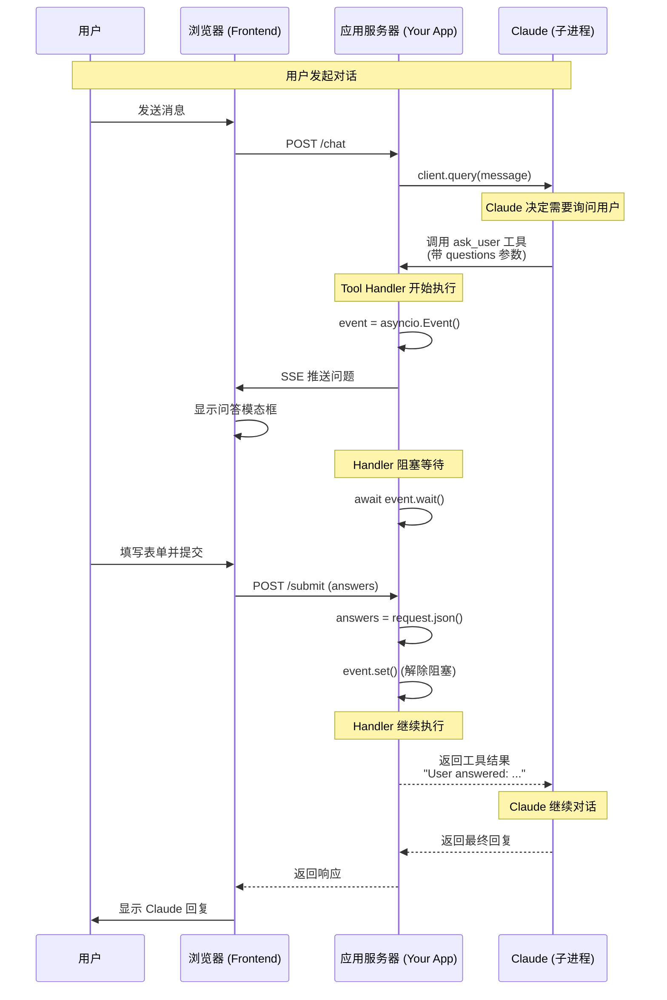
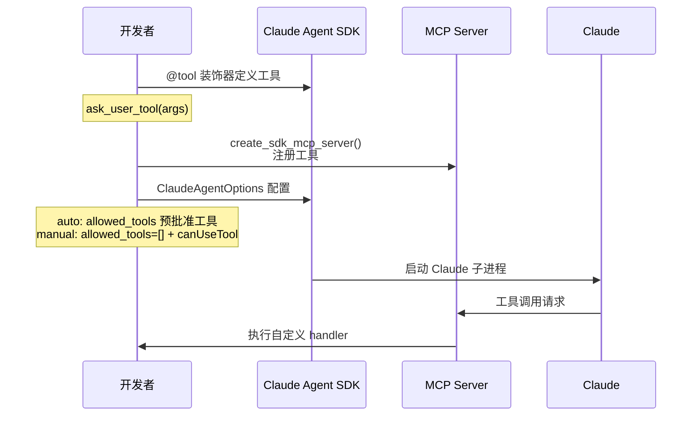
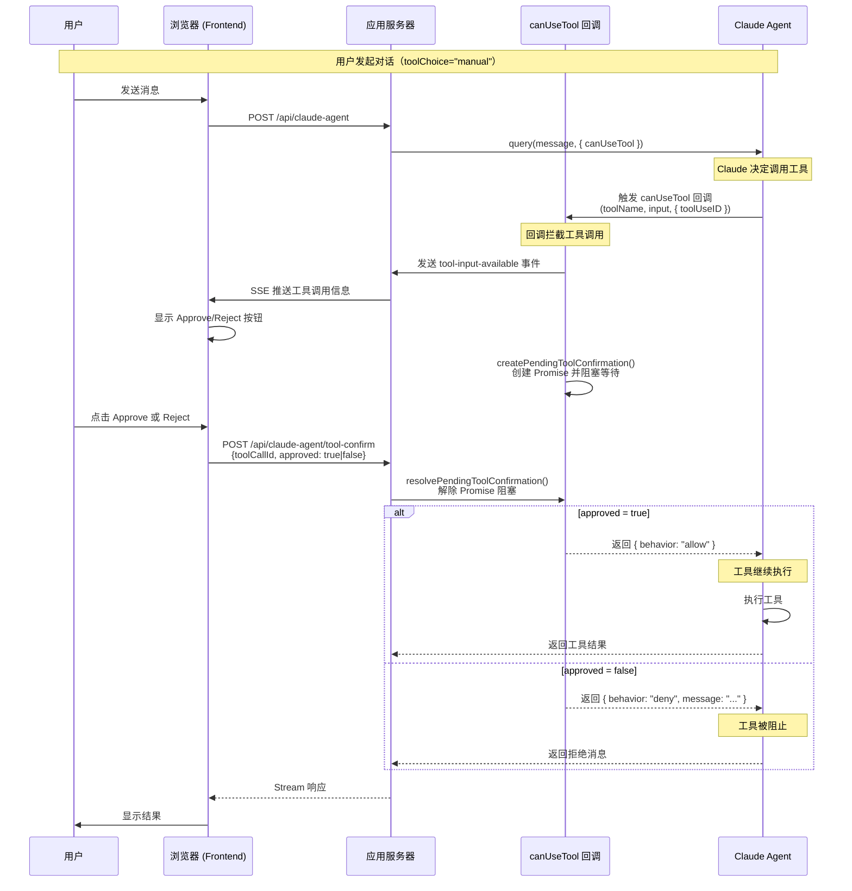
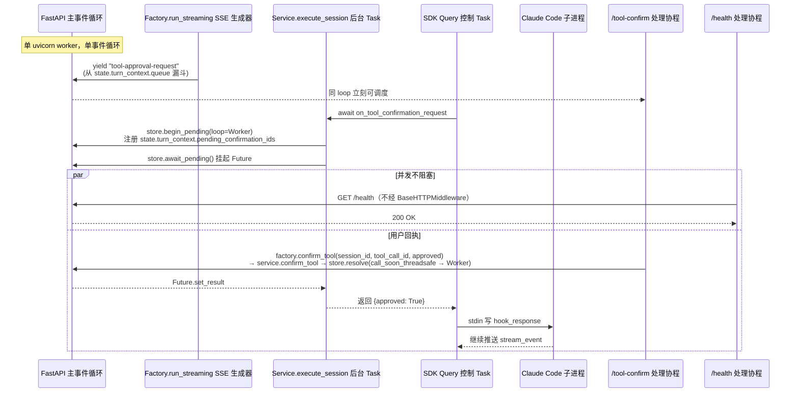
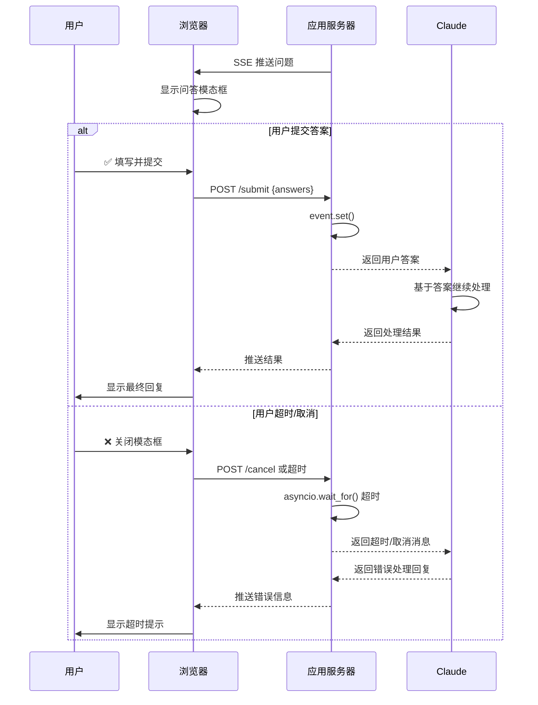

> **迁移来源**: Pawkeyland docs/app/design/Claude Agent SDK 交互式工具时序图.md
> SDK 工具确认交互模式的通用设计参考，与 Ink & Memory `backend/claude_agent/tool_confirmation_store.py` 对应实现。
> **[Sync] 2026-05-24**: `_make_tool_confirm_cb` 新增 `turn_ctx` 参数，注册 `registered_tool_call_ids` / `emitted_tool_input_ids` 去重；新增 `CancelledError` 处理（调 `store.cancel_pending` 后 re-raise）；`payload` 字段同时兼容 `tool_call_id`（runner）和 `toolCallId`（遗留）。
> **[Sync] 2026-05-27**: `PreToolUse` hook `hookSpecificOutput` 格式迁移至 CLI ≥2.1 规范；新增 `_ALWAYS_CONFIRM_TOOL_NAMES` 机制在当时的 auto 模式下对 `AskUserQuestion` 触发确认；新增前端 `isManualToolInvocation` / `toolChoice` prop 逻辑说明（§6、§7）。
> **[Sync] 2026-06-06**: auto 模式新增 workspace `files/` 内置文件工具权限策略：`Read` / `Write` / `Edit` / `MultiEdit` 仅在路径解析后位于当前 `{cwd}/files/` 下时返回显式 `permissionDecision:"allow"`；当时其他工具即使在 auto 模式下也进入前端确认侧路。该全量确认策略已被 2026-06-07 敏感度分流取代。
> **[Sync] 2026-06-07**: auto 模式改为敏感度分流：workspace `files/` 内置文件工具和低敏查询工具显式 allow；执行/写入/交互工具进入前端确认侧路。
> **[Sync] 2026-06-07**: 新增低敏工具：`Bash`（命令首词属于只读/导航安全集合且无 shell 元字符）和 `mcp__editor__switch_editor`（无副作用的上下文切换声明）。安全集合：`ls` `cd` `pwd` `echo` `cat` `head` `tail` `wc` `find` `which` `type` `date` `whoami` `id` `groups` `env` `printenv` `uname` `hostname`。
> **[Sync] 2026-06-09**: 新增低敏工具 `Skill`（Claude Code restored source 确认为 `SKILL_TOOL_NAME = "Skill"`）；完整策略抽取到 [`claude-agent-permission-policy.md`](./claude-agent-permission-policy.md)。
> **[Sync] 2026-06-09**: Settings「应如何批准 IM」写入 `system_config.im_full_access_enabled`；开启后 Runner 在 `.editor/` 重定向之后对已暴露工具返回显式 PreToolUse allow。
> **[Sync] 2026-06-13**: full-access 模式保留 `AskUserQuestion` /
> `mcp__user__ask_user` 的前端确认窗口，因为这些工具必须收集 answers
> 并通过 `updatedInput` 传回 Claude。
> **[Sync] 2026-07-20**: 前端确认交互从消息列表内联渲染迁移为**确认面板**
> （`ToolConfirmationDock`）：待确认期间**隐藏输入栏，面板直接占据输入栏位置**
> （in-flow 替换渲染）；消息列表中的待确认工具调用退化为带「待确认」标记的
> 折叠行。详见 §8。
> **[Sync] 2026-07-23**: SandboxPermissionRequest —— `can_use_tool` 通道
> （`SandboxNetworkAccess` 运行时沙箱代理询问）接入同一确认链路（§6.3）；
> 确认面板渲染网络变体卡片（host + 策略模式 + 二元 拒绝/同意）。
> **[Sync] 2026-07-26**: PreToolUse 步骤 ②.5 网络门禁拆除（错误层级重复，
> §6.1 / §6.2 回退）；can_use_tool 成为唯一网络确认通道，
> `networkRequest.source` 字段取消；`open` 模式"每次询问"语义回退。
> **[Sync] 2026-07-26**: HOTFIX — `HookJSONOutput(...)` 构造调用全部改为纯字典
> 字面量（0.2.128 中该类型为 TypedDict Union 不可调用；§5 头部注记两个生产
> 症状与官方 dict 契约，§5.2 / §6.1 示例更新）。

> 来源: When Claude Can't Ask: Building Interactive Tools for the Agent SDK
>  https://oneryalcin.medium.com/when-claude-cant-ask-building-interactive-tools-for-the-agent-sdk-64ccc89558fa

## 核心交互模式

当 Claude 调用自定义 MCP 工具时，整个流程如下：



## 工具定义与注册



## 使用 canUseTool 实现工具确认

Claude Agent SDK 提供 `canUseTool` 回调作为官方权限处理器，用于在工具执行前控制是否允许。这是实现工具确认的推荐方式。

> 参考: https://platform.claude.com/docs/en/agent-sdk/user-input



### canUseTool 配置（TypeScript）

```typescript
import type { CanUseTool, PermissionResult } from "@anthropic-ai/claude-agent-sdk";

// canUseTool 回调函数
const canUseTool: CanUseTool = async (
  toolName: string,
  toolInput: Record<string, unknown>,
  options: { signal: AbortSignal; toolUseID: string }
): Promise<PermissionResult> => {
  const toolCallId = options.toolUseID;
  
  // 通知 UI 显示确认按钮
  await sendToolApprovalRequest(toolCallId, toolName, toolInput);
  
  // 阻塞等待用户确认
  const result = await createPendingToolConfirmation(toolCallId, toolName, toolInput);
  
  if (result.approved) {
    return {
      behavior: 'allow',
      toolUseID: toolCallId,
    };
  } else {
    return {
      behavior: 'deny',
      message: result.reason || '用户拒绝',
      toolUseID: toolCallId,
    };
  }
};

// SDK Options 配置
const sdkOptions = {
  canUseTool,  // 注册权限处理器
  allowedTools: [],  // manual 模式不要预批准目标工具，否则不会触发 canUseTool
};
```

> Python 落地注意：当前实现已从 Python SDK `can_use_tool` 迁移到 `PreToolUse` hook。`toolChoice="auto"` 对当前 workspace `files/` 下的内置文件工具以及明确低敏工具（查询、`Skill`、`switch_editor`、只读 Bash 子集）显式 allow；高敏工具与 `toolChoice="manual"` 一样进入确认侧路。若 Settings `im_full_access_enabled=true`，则 `.editor/` 重定向之后的已暴露工具显式 allow；`AskUserQuestion` / `mcp__user__ask_user` 例外，仍进入确认侧路收集 answers。

## 事件循环 / 线程 / 子进程边界（manual 模式）

> [Sync] 2026-05-10: 修复一次生产事故 —— `tool-approval-request` 发出后整个 FastAPI 进程挂起。补充三层泳道，明确每个 await 所属的边界。
> [Sync] 2026-05-10: 经端到端真实 uvicorn 复现，**真正的根因是前后端字段名 mismatch**：SSE 下发 camelCase `toolCallId`，前端原样回传 `/api/claude-agent/tool-confirm`，但后端 `ToolConfirmRequest` schema 仅认 snake_case `tool_call_id` → 422 Unprocessable Entity → 前端表现为"无法响应"，5 分钟后 SSE 因超时被动结束，看起来像"全局阻塞"。已让 `ToolConfirmRequest` 同时接受 `tool_call_id` 与 `toolCallId`（`Field(alias="toolCallId")` + `populate_by_name=True`），契约同时兼容 Java/BFF snake_case 与 Web SSE-echo camelCase。
> [Sync] 2026-05-10: 上一轮加固（去 BaseHTTPMiddleware、call_soon_threadsafe 桥、cancel_pending、BaseExceptionGroup 不掩盖 CancelledError）保留为防御性硬化：单 uvicorn worker 上 SSE 暂停时 `/health` 与 `/tool-confirm` 真实测得 5–9ms 内返回，与 Streaming generator 完全并发。
> [Sync] 2026-05-10: "SSE 占用时整个服务无法访问"实测复现 — 服务端 manual-confirm 期间 4 条 SSE + 60 次并发 side-probe 全部 5–15ms 返回，**根因不在 worker**。真正堵点叠加：(1) 前端 `app.js` 在 SSE reader loop 内同步 `await postToolConfirmation(...)` → 浏览器 HTTP/1.1 同源 6 连接限制下 fetch 排队会反过来 stall SSE reader；(2) 反向代理/移动网关 idle timeout 切线 SSE 在等用户确认。修复：服务端 SSE generator 加 `: keepalive` 心跳（默认 15s，可改 `PAWKEYLAND_SSE_KEEPALIVE_S`）；`demo_ui/app.js` 把 tool-confirm 改 fire-and-forget；部署层强烈建议反向代理启用 HTTP/2 让浏览器在同条 TCP 上多路复用。`scripts/diag_sse_concurrency.py` 给出可重跑诊断。
> [Sync] 2026-05-12: Thread Session 模式接入 — 生产 HTTP 入口现在是 `ClaudeAgentThreadFactory.run_streaming(request)`。`tool-approval-request` 帧由 Phase 1 内的 5 个 `AgentStreamingCallbacks` 闭包通过 `state.turn_context.queue` 推送；`/tool-confirm` 经 `factory.confirm_tool(session_id, tool_call_id, approved, reason, answers)` 委托到内部 `Service.confirm_tool` → `ToolConfirmationStore.resolve`，与 Phase 1 注册的 `state.turn_context.pending_confirmation_ids` 在 owner loop 上 `set_result`。Phase 4 finally / 客户端断开会调用 `_store.cancel_pending(...)` 释放残留 Future，与享元 State 的 "create in Phase 1 / destroy in Phase 4" 契约对齐。详见 [claude-agent-thread-session-patterns.md §6.4](./claude-agent-thread-session-patterns.md#64-工具确认manual-模式)。



要点（Thread Session 模式）：

1. `store.begin_pending` 在 `Service.assemble_context` 构造的 callback 闭包内执行，闭包绑定到 FastAPI worker loop（即 `state.turn_context` 创建的 owner loop）。`tool_call_id` 同时被注册到 `state.turn_context.pending_confirmation_ids`，让 Phase 4 finally / 客户端断开有单一句柄做批量取消。
2. SDK 的 `_handle_control_request` 通过 anyio TaskGroup 创建 `SDKTask`，目前与主 loop 共用，未来如果 Anthropic SDK 把 hook 迁到 `anyio.from_thread`，`_await_confirmation` 会用 `asyncio.run_coroutine_threadsafe` 切回 owner loop，再执行 `await_pending`，避免在错误的 loop 上挂起 Future。
3. `/tool-confirm` 调 `factory.confirm_tool(session_id, tool_call_id, ...)` → `service.confirm_tool` → `store.resolve`：调用方若已在 owner loop 上，则直接 `set_result`；否则通过 `loop.call_soon_threadsafe` 跨边界唤醒。`session_id` 仅用于 API 对称性 — 实际查找以全局 `tool_call_id` 为键。
4. `/health` 等无关请求改走纯 ASGI 中间件 `_PureASGIRequestLogger`，不再经过会把 `StreamingResponse` 锁进 anyio TaskGroup 的 `BaseHTTPMiddleware`，因此即便 SSE 在等待 Future 也不会被排队。
5. 前台关闭 SSE 时，Factory 的 `_run_lifecycle.finally` 会遍历 `state.turn_context.pending_confirmation_ids` 调用 `store.cancel_pending(tool_call_id)` 把残留 Future 立刻丢弃，再清空 `state.turn_context = None`，杜绝内存泄漏；State 仍以 IDLE 留在享元缓存内等待下一轮或 TTL 销毁。
6. 接口契约层面：SSE 事件统一发 camelCase（与现有前端代码一致），`ToolConfirmRequest` 同时接受 `tool_call_id`（snake_case）与 `toolCallId`（camelCase）两种字段名 —— 这是 2026-05-10 根因的最终修复。任何客户端只要把 `tool-approval-request` 里的 `toolCallId` 原样回传到 POST body，即可被服务端校验通过，再由 `factory.confirm_tool` → `store.resolve` 走同 loop set_result 路径唤醒 SSE generator。

## 用户批准/拒绝决策分支



## 关键代码模式

### Tool Handler 阻塞模式（Python）

```python
# 在工具 handler 中:
event = asyncio.Event()
await send_questions_to_browser(questions)  # SSE 推送
await event.wait()  # 阻塞等待用户响应
return answers

# 在 /submit endpoint 中:
answers = request.json()
event.set()  # 解除阻塞

```

### Tool Confirmation Store（TypeScript/Node.js）

```typescript
// tool-confirmation-store.ts
// 创建待确认项并返回 Promise（阻塞）
export function createPendingToolConfirmation(
  toolCallId: string,
  toolName: string,
  input: Record<string, unknown>
): Promise<ToolConfirmationResult> {
  return new Promise((resolve, reject) => {
    pendingConfirmations.set(toolCallId, { resolve, reject, ... });
    
    // 超时保护
    setTimeout(() => {
      if (pendingConfirmations.has(toolCallId)) {
        pendingConfirmations.delete(toolCallId);
        reject(new Error('Confirmation timeout'));
      }
    }, 300000); // 5分钟
  });
}

// 解除阻塞（在 /api/claude-agent/tool-confirm 中调用）
export function resolvePendingToolConfirmation(
  toolCallId: string,
  result: { approved: boolean; reason?: string }
): boolean {
  const pending = pendingConfirmations.get(toolCallId);
  if (pending) {
    pending.resolve(result);
    pendingConfirmations.delete(toolCallId);
    return true;
  }
  return false;
}
```

### 超时处理

```python
# Python: 添加超时保护，防止 handler 永久阻塞
await asyncio.wait_for(event.wait(), timeout=300)  # 5分钟超时

```

```typescript
// TypeScript: 在 createPendingToolConfirmation 中已内置超时
// timeout 参数可配置，默认 5 分钟
```

## 应用场景

此模式可扩展到多种交互场景：

| 场景 | 描述 |
| --- | --- |
| 审批工作流 | 显示 diff，等待批准/拒绝 |
| 文件选择器 | 让用户基于提示浏览和选择文件 |
| 配置向导 | 带验证的多步骤表单 |
| 人工介入 | 在执行破坏性操作前暂停审核 |
| 富输入 | 图片标注、拖放等前端支持的任何交互 |

---

## 5. `PreToolUse` Hook `hookSpecificOutput` 格式 — CLI ≥2.1 规范 **[2026-05-27]**

> **[2026-07-26]** claude-agent-sdk 0.2.128 将 `HookJSONOutput` 改为 TypedDict
> Union（types.py:561），**不可调用**——所有 `HookJSONOutput(...)` 构造调用抛
> `TypeError: 'types.UnionType' object is not callable`，曾导致 (a) PostToolUse
> 观察器崩溃、(b) PreToolUse allow/deny 被静默丢弃（用户在确认框拒绝后工具仍执行）。
> 当前契约：hook 回调返回纯字典字面量——`{}` 为空操作，决策用
> `{"hookSpecificOutput": {...}}`（官方 hooks 文档）。§5.1 的
> `HookJSONOutput(...)` 仅为旧协议历史示例，现行代码见 §5.2。

> **背景**：CLI v2.1+ 更改了 PreToolUse hook 的 `hookSpecificOutput` 协议。旧格式 `{"tool_input": ...}` 被 CLI 静默忽略，导致 `AskUserQuestion` 以无 `answers` 字段的原始 input 执行，返回 `isError:true / output:null`。

### 5.1 旧格式（CLI < 2.1，已废弃）

```python
# ❌ 旧格式：CLI 静默忽略，工具 input 不会被更新
return HookJSONOutput(
    hookSpecificOutput={"tool_input": updated_input}
)

# ❌ 旧格式 block：
return HookJSONOutput(decision="block", systemMessage=reason)
```

### 5.2 新格式（CLI ≥2.1，当前实现）

> **[2026-07-26]** claude-agent-sdk 0.2.128 中 `HookJSONOutput` 是 TypedDict Union、
> 不可调用；hook 回调一律返回**纯字典字面量**（`{}` 空操作 / 决策字典）。

```python
# ✅ 允许并更新 input（携带 answers）
return {
    "hookSpecificOutput": {
        "hookEventName": "PreToolUse",
        "permissionDecision": "allow",
        "updatedInput": updated_input,   # 包含 answers 的完整 tool_input
    }
}

# ✅ 允许，不更新 input
return {
    "hookSpecificOutput": {
        "hookEventName": "PreToolUse",
        "permissionDecision": "allow",
    }
}

# ✅ 拒绝，附带 Claude 可见的原因
return {
    "hookSpecificOutput": {
        "hookEventName": "PreToolUse",
        "permissionDecision": "deny",
        "permissionDecisionReason": reason,  # Claude 收到拒绝原因，避免无效重试
    }
}
```

### 5.3 关键规则

- `updatedInput` 必须放在 `hookSpecificOutput` 内，**不能**放在顶层。
- 使用 `updatedInput` 时必须同时声明 `permissionDecision: "allow"` 或 `"ask"`。
- `hookEventName` 必须与 hook 事件类型一致（这里固定为 `"PreToolUse"`）。

---

## 6. Auto 模式 PreToolUse 权限策略 **[2026-06-07]**

实现位置：`backend/libs/claude_agent_kit/server/agent_runner.py` 的
`_apply_workspace_files_permission` 与 `_pre_tool_use_hook`。

### 6.1 决策逻辑

```python
# _pre_tool_use_hook 内
if (
    opts.im_full_access_enabled
    and tool_choice != "none"
    and tool_name not in {"AskUserQuestion", "mcp__user__ask_user"}
):
    return {
        "hookSpecificOutput": {
            "hookEventName": "PreToolUse",
            "permissionDecision": "allow",
        }
    }

if tool_choice == "auto":
    workspace_files_permission = _apply_workspace_files_permission(tool_name, tool_input, cwd)
    if workspace_files_permission is not None:
        return workspace_files_permission  # files/ 内置文件工具显式 allow

    low_sensitivity_permission = _apply_low_sensitivity_query_permission(tool_name, tool_input)
    if low_sensitivity_permission is not None:
        return low_sensitivity_permission  # 查询类工具 / Bash 只读子集 / switch_editor / Skill 显式 allow

# 执行/写入/交互工具 → 进入 on_tool_confirmation_request 确认侧路
```

> **[2026-07-26]** 曾插入的 PreToolUse 网络门禁（步骤 ②.5）已拆除——网络
> 策略由 CLI 自身沙箱执行，运行时代理询问经 §6.3 的 `can_use_tool` 通道
> 进入同一确认侧路。

### 6.2 工具决策矩阵

| 工具 | `tool_choice=auto` | `tool_choice=manual` |
|------|:------------------:|:--------------------:|
| `AskUserQuestion` | 走确认流 → 显示 AskUserQuestion 表单 | 走确认流 → 显示 AskUserQuestion 表单 |
| `mcp__user__ask_user` | 走确认流 → 显示 AskUserQuestion 表单 | 走确认流 → 显示 AskUserQuestion 表单 |
| `Read` / `Write` / `Edit` / `MultiEdit` 且目标位于 `{cwd}/files/**` | 显式 allow → 自动执行 | 走确认流 → 显示 Approve/Cancel |
| `Read` outside `files/` / `Glob` / `Grep` / `LS` / `TodoRead` / `WebFetch` / `WebSearch` / memory、necklace、session 查询 | 显式 allow → 自动执行 | 走确认流 → 显示 Approve/Cancel |
| `Bash` 且 command 首词属于安全集合（`ls` `cd` `pwd` `echo` `cat` `head` `tail` `wc` `find` `which` `type` `date` `whoami` `id` `groups` `env` `printenv` `uname` `hostname`）且无 shell 元字符 | 显式 allow → 自动执行 | 走确认流 → 显示 Approve/Cancel |
| `mcp__editor__switch_editor` | 显式 allow → 自动执行（MCP handler 无副作用，状态切换在 PostToolUse hook 完成）| 走确认流 → 显示 Approve/Cancel |
| `Skill` | 显式 allow → 自动执行（展开/执行已发现 Skill prompt）| 走确认流 → 显示 Approve/Cancel |
| `Bash`（含管道 / 重定向 / 写入命令等）/ `Write` outside `files/` / `Edit` outside `files/` / MCP 写入 / 其他非查询工具 | 走确认流 → 显示 Approve/Cancel | 走确认流 → 显示 Approve/Cancel |

若 `im_full_access_enabled=true`，上述矩阵在已暴露工具范围内整体变为显式 allow；`AskUserQuestion` / `mcp__user__ask_user` 仍显示 AskUserQuestion 表单并等待用户提交 answers；`tool_choice=none` 仍不暴露工具，因此不会进入该 hook 分支。

### 6.3 运行时沙箱代理触发源（can_use_tool）**[2026-07-23 新增；2026-07-26 起为唯一网络确认通道]**

沙箱网络确认的唯一触发源：sandboxed Bash 在
sandbox-runtime 过滤代理层命中未授权域名时，CLI 发起系统级 control request，
**不经 PreToolUse**，只通过 SDK `can_use_tool` 回调送达
（`tool_name == "SandboxNetworkAccess"`，`input == {"host": ...}`）。
（2026-07-23 曾另有 PreToolUse 步骤 ②.5 执行前门禁，2026-07-26 作为错误
层级的重复实现拆除；`networkRequest.source` 字段随之取消。）

`agent_runner.py` 将 `_can_use_tool` 传入 `ClaudeAgentOptions.can_use_tool`，
该回调复用**同一条** `on_tool_confirmation_request` 确认链路（payload 携带
`confirmationKind="sandbox_network"` + `networkRequest{host, policyMode, matchedAllowedDomain}`），
因此前端时序（`tool-input-start` → `tool-approval-request` → POST `/tool-confirm`
→ resolve）与普通工具确认完全一致，仅结果映射不同：批准 →
`PermissionResultAllow(updated_input)`，拒绝/失败/超时 →
`PermissionResultDeny(message)`（message 指明 host 并提示可在设置中加入
allowedDomains）；回调异常一律 fail-closed deny。官方契约保证 `can_use_tool`
不会对已被权限流解析的工具再次触发（本系统 hook 对一切工具返回显式
allow/deny），因此不存在双重弹窗。

---

## 7. 前端工具确认路由逻辑 **[2026-05-27 / 2026-06-06]**

> **[已更新 2026-07-20]** 本节 §7.2 中「待确认工具在消息列表内直接展开
> Approve/Cancel 或 AskUserQuestion 表单」的渲染方式已被 §8 的悬浮确认面板
> 取代；判定规则（哪些 part 需要确认）保持不变，仅渲染位置与组件层级变化。

### 7.1 组件层级

```
ChatPanel
  ├─ currentToolChoice: ToolChoice   ('auto'|'manual'|'none')
  ├─ AIInputDock               ← 「逐步确认」开关 → 发送 toolChoice='manual'
  └─ ChatMessageList(toolChoice=currentToolChoice)
       └─ ToolMessagePart(isManualToolInvocation: bool)
            ├─ shouldShowAskUserUI   = isAskUserQuestion && !isCompleted && state∈{input-available,...}
            └─ shouldShowApprovalUI  = isManualToolInvocation && !shouldShowAskUserUI && !isCompleted
```

`frontend/src/lib/claude-agent-transport.ts` 在收到 `tool-approval-request` SSE frame 时，会把对应 tool input chunk 标记为 `toolMetadata.approvalRequested=true`。因此 UI 不再只依赖本地 `toolChoice` 判断，auto 模式下后端要求确认的普通工具也会显示 Approve/Cancel。

### 7.2 `ChatMessageList` 渲染决策

```typescript
// 优先级从高到低：
// 1. 已完成 + 有输出 → 终端/折叠视图
if (isCompleted && outputText) { /* terminal view */ }

// 2. AskUserQuestion + 未完成 → 直接展开 AskUserQuestionUI
//    (isManualToolInvocation=false，表单由 shouldShowAskUserUI 驱动)
const needsUserInput = isAskUserQuestionTool(toolPart) && !isCompleted;
if (needsUserInput) { /* AskUserQuestion form */ }

// 3. 后端显式请求确认 + 未完成 → Approve/Cancel UI
const needsRequestedApproval = toolPart.toolMetadata?.approvalRequested === true && !isCompleted;
if (needsRequestedApproval) { /* isManualToolInvocation=true → Approve/Cancel */ }

// 4. manual 模式 + 非 AskUserQuestion + 未完成 → Approve/Cancel UI
const needsManualApproval = toolChoice === 'manual' && !isCompleted;
if (needsManualApproval) { /* isManualToolInvocation=true → Approve/Cancel */ }

// 5. 其他 → 折叠视图
```

### 7.3 `shouldShowApprovalUI` 生命周期

```
工具调用到达
  ↓ state='input-available', isCompleted=false
  isManualToolInvocation=true → shouldShowApprovalUI=true → 显示 Approve/Cancel
  ↓ 用户点击 Approve → POST tool-confirm
  ↓ 工具执行 → tool-output-available
  isCompleted=true → shouldShowApprovalUI=false → 恢复折叠/终端视图
```

---

## 8. 前端确认面板（ToolConfirmationDock） **[2026-07-20]**

### 8.1 背景与目标

原实现（§7.2）把待确认工具的 Approve/Cancel 按钮和 AskUserQuestion 表单直接
渲染在消息列表中：表单卡片打断消息流、历史回填后位置漂移、长命令把列表撑得
很乱。2026-07-20 起，所有**待用户决策的确认交互**统一收敛到一块确认面板：
**待确认期间隐藏 `AIInputDock` 输入栏，面板以正常文档流占据输入栏位置**，
用户做出决策后输入栏恢复；消息列表只保留带「待确认」标记的折叠行。

### 8.2 组件层级

```
ChatPanel
  ├─ pendingConfirmation = useMemo(messages, effectiveToolChoice)
  │     └─ resolvePendingToolConfirmation(part, toolChoice)   // toolConfirmation.ts
  │           ├─ 'askuser'         — AskUserQuestion / mcp__user__ask_user 且未完成且 input 已就绪
  │           ├─ 'sandbox-network' — toolMetadata.confirmationKind==='sandbox_network'
  │           │                    （can_use_tool 运行时沙箱代理拦截）**[2026-07-26]**
  │           ├─ 'confirm'  — toolMetadata.approvalRequested===true 或 toolChoice==='manual'
  │           │             且未完成且 input 已就绪（editor write 工具除外）
  │           └─ null       — 已完成 / input 未就绪 / editor write 工具 / 无需确认
  ├─ ChatMessageList
  │     └─ 待确认 part → 折叠行 + 琥珀色「待确认」标记（不再内联渲染按钮/表单）
  └─ 输入区容器 (position: relative)
        ├─ 回到底部按钮          ← 维持 absolute 悬浮，位于面板/输入栏上方
        └─ pendingConfirmation
              ├─ 存在 → ToolConfirmationDock（替换输入栏，in-flow）
              │         ├─ kind='confirm' → 标题 + 命令/参数摘要 + 拒绝 / 同意
              │         ├─ kind='askuser' → AskUserQuestionUI（无框紧凑变体）+ 取消 / 提交
              │         └─ kind='sandbox-network' → 网络变体卡片（host + 策略模式
              │                                    + 命令/参数摘要）+ 拒绝 / 同意 **[2026-07-23]**
              └─ 不存在 → AIInputDock (mode="full")
```

### 8.3 交互契约

| 场景 | 标题区 | 按钮 | 快捷键 | 确认请求 |
| --- | --- | --- | --- | --- |
| 普通工具确认（`confirm`） | `是否允许 I&M 调用 {tool} 工具，{summary}` + 「待授权」徽章 | **拒绝** / **同意** | `Esc` 拒绝、`⌘/Ctrl+⏎` 同意 | `POST /api/claude-agent/tool-confirm` `{approved}` |
| 用户提问（`askuser`） | `I&M 需要你的回答` + 「待回答」徽章 | **取消** / **提交**（选项表单内） | `Esc` 取消、`⌘/Ctrl+⏎` 提交 | 同上，`approved:true` + `answers` |
| 沙箱网络请求（`sandbox-network`）**[2026-07-23]** | `是否允许 I&M 通过 {tool} 发起网络请求` + 「待授权」徽章；正文显示目标主机、网络策略（白名单未命中 / 开放网络）与命令/参数摘要；触发源为 can_use_tool 运行时沙箱代理拦截（`SandboxNetworkAccess`）**[2026-07-26]** | **拒绝** / **同意** | `Esc` 拒绝、`⌘/Ctrl+⏎` 同意 | 同上，`{approved}`（本期二元决策，无「记住」） |
| 编辑器写入工具 | —（不进入确认面板） | 沿用消息列表内 `EditorWriteApprovalUI` | — | 同上 |

- 待确认期间 `AIInputDock` 整体隐藏，确认面板占据输入栏位置；用户做出决策后
  输入栏立即恢复。回到底部按钮维持 absolute 悬浮，不受替换影响。
- 按钮**只有**拒绝/同意（或取消/提交）两个选项，不提供「本会话内允许」等
  第三态；授权粒度与后端 `PreToolUse` 决策保持一致。
- 面板高度上限 `min(46vh, 24rem)`，超出内部滚动；AskUserQuestion 表单以
  `compact` 紧凑密度渲染（更小字体、更窄间距），避免面板占满聊天视口。
- 面板按 `partKey` 作为 React key 挂载：同一确认在被 resolve/超时移除后状态
  自动复位；多个待确认项串行展示（取消息序最早的一项），与后端一次只阻塞
  一个 `PreToolUse` 回调的事实对齐。
- 确认成功后仍调用 `addToolResult` 乐观标记 part 完成，面板随
  `pendingConfirmation` 变为 null 自动消失、输入栏恢复，消息列表折叠行恢复常态。
- `input` 尚未就绪（`input-streaming` 早期）时不挂载面板，避免基于半截 JSON
  渲染表单；下一帧 input 到达后自动出现。

### 8.4 涉及文件

- `frontend/src/components/chat/toolConfirmation.ts`（新增）— `confirmToolCall`
  请求、`resolveToolName`、`isAskUserQuestionPart`、`resolvePendingToolConfirmation`。
- `frontend/src/components/chat/ToolConfirmationDock.tsx`（新增）— 确认面板本体。
- `frontend/src/components/chat/AskUserQuestionUI.tsx` — 新增 `framed` /
  `showHeader` / `submitLabel` / `cancelLabel` / `compact` props，支持无框紧凑
  中文按钮变体。
- `frontend/src/components/chat/ToolMessagePart.tsx` — 移除内联 Approve/Cancel
  与 AskUserQuestion 渲染路径及 `isManualToolInvocation` prop；保留折叠详情卡与
  编辑器写入审批 UI。
- `frontend/src/components/chat/ChatMessageList.tsx` — 待确认 part 渲染为折叠
  行 + 「待确认」标记。
- `frontend/src/components/chat/ChatPanel.tsx` — 派生 `pendingConfirmation`，
  待确认时在输入区容器内用确认面板替换 `AIInputDock`。
