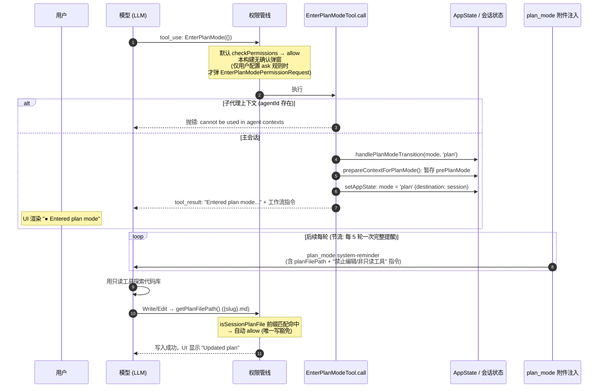

# Claude Code Plan Mode 源码分析：EnterPlanMode / ExitPlanMode

> 分析对象：`/Users/dmeck/project/claude-code-sourcemap/restored-src/src`（sourcemap 还原的 TypeScript 源码）

---

## 1. `.claude/plans/` 是否提供自定义路径？—— 结论：提供

**首先纠正一个前提**：计划文件默认并不写在项目内的 `.claude/plans/`，而是写在**全局** `~/.claude/plans/`（跨项目共享，靠每会话随机 slug 区分）。

路径解析逻辑：`src/utils/plans.ts:79-111`（`getPlansDirectory`，会话级 memoize）：

```ts
export const getPlansDirectory = memoize(function getPlansDirectory(): string {
  const settings = getInitialSettings()
  const settingsDir = settings.plansDirectory
  let plansPath: string
  if (settingsDir) {
    // Settings.json (relative to project root)
    const cwd = getCwd()
    const resolved = resolve(cwd, settingsDir)
    // 校验必须留在项目根内，防止路径穿越
    if (!resolved.startsWith(cwd + sep) && resolved !== cwd) {
      logError(new Error(`plansDirectory must be within project root: ${settingsDir}`))
      plansPath = join(getClaudeConfigHomeDir(), 'plans')   // 越界 → 静默回退默认
    } else {
      plansPath = resolved
    }
  } else {
    plansPath = join(getClaudeConfigHomeDir(), 'plans')     // 默认：~/.claude/plans
  }
  try { getFsImplementation().mkdirSync(plansPath) } catch (e) { logError(e) }
  return plansPath
})
```

### 可用的自定义方式（共两种，无第三种）

| 方式 | 配置 | 说明 |
|---|---|---|
| **settings 键 `plansDirectory`** | `~/.claude/settings.json` / `<项目>/.claude/settings.json` / `settings.local.json` / managed policy 均可（走标准 settings 合并链） | schema 定义见 `src/utils/settings/types.ts:824-830`："Custom directory for plan files, relative to project root"。**相对于项目根解析，且必须解析到项目根内部**，否则记录错误并静默回退到默认目录。因 memoize + 只读启动时的 initial settings，**改动需重启会话生效** |
| **环境变量 `CLAUDE_CONFIG_DIR`** | 间接移动默认目录 | `getClaudeConfigHomeDir()`（`src/utils/envUtils.ts:7-14`）= `CLAUDE_CONFIG_DIR ?? ~/.claude`，它搬移整个 config home，plans 目录随之移动 |

**不存在**的东西：专门的 `CLAUDE_PLANS` 环境变量、CLI 命令行参数——源码中均无。

### 文件名生成

`src/utils/plans.ts:25-49`：每会话惰性生成随机词组 slug（`形容词-动词-名词`，`crypto.randomBytes`，见 `src/utils/words.ts:785-790`），无时间戳、无 session id；与已有文件冲突时最多重试 10 次（`MAX_SLUG_RETRIES`）。主会话为 `{slug}.md`，子代理为 `{slug}-agent-{agentId}.md`（`getPlanFilePath`，`plans.ts:119-129`）。旧计划由 `cleanupSingleDirectory(~/.claude/plans, '.md')` 回收（`src/utils/cleanup.ts:301-302`）。

---

## 2. 工具定义速览

| | EnterPlanMode | ExitPlanMode（仅有 V2 实现） |
|---|---|---|
| 定义 | `src/tools/EnterPlanModeTool/EnterPlanModeTool.ts:36-126` | `src/tools/ExitPlanModeTool/ExitPlanModeV2Tool.ts:147-493` |
| 输入 schema | 空对象（无参数） | `{ allowedPrompts?: [{ tool: 'Bash', prompt: string }] }`（SDK 侧另有注入的 `plan`/`planFilePath`） |
| 权限 | 继承默认 `checkPermissions → allow`，**本构建中直接执行、无确认弹窗**（`Tool.ts:757-769`）；`EnterPlanModePermissionRequest` 弹窗组件仍在，但仅在用户配置了 ask 规则时才出现 | `checkPermissions → ask`（"Exit plan mode?"），非 teammate 必经交互确认 |
| handler 行为 | 仅改状态：`mode → 'plan'`，原 mode 存入 `prePlanMode`；**不写任何文件**；子代理上下文直接抛错 | 从磁盘读计划文件（用户编辑过的先写回磁盘）→ 恢复 `prePlanMode` → tool_result 携带完整计划文本 |
| 禁用场景 | 子代理（`ALL_AGENT_DISALLOWED_TOOLS`）、KAIROS channels | 同左；且 `validateInput` 要求当前必须在 plan mode |

### Plan mode 期间的“软门禁”

- 不是硬性工具过滤，而是：① 每 5 轮左右注入一次 `plan_mode` system-reminder（`src/utils/attachments.ts:1186-1242`，含 `planFilePath`——模型由此得知往哪写计划）；② 非只读操作仍走常规 `ask` 权限弹窗。
- **唯一写豁免**：当前会话的计划文件（`{slug}*.md` 前缀匹配）Write/Edit 自动放行 —— `src/utils/permissions/filesystem.ts:1241-1250` → `isSessionPlanFile`（245-255）。
- 其他进入 plan mode 的途径（殊途同归到同一状态迁移）：`/plan` 斜杠命令（`src/commands/plan/plan.tsx:73-91`）、Shift+Tab 权限模式循环（`getNextPermissionMode.ts:52-53`）、`--permission-mode plan` / `permissions.defaultMode`。

---

## 3. EnterPlanMode 交互时序图



## 4. ExitPlanMode 交互时序图

```mermaid
sequenceDiagram
    autonumber
    participant M as 模型 (LLM)
    participant N as normalizeToolInput
    participant T as ExitPlanModeTool (V2)
    participant PP as 权限管线 / useCanUseTool
    participant UI as ExitPlanModePermissionRequest
    participant U as 用户
    participant F as 计划文件 (~/.claude/plans/{slug}.md)
    participant S as AppState / REPL

    M->>N: tool_use: ExitPlanMode({ allowedPrompts?: [{tool:'Bash', prompt}] })
    N->>N: 注入 plan + planFilePath 到 input<br/>persistFileSnapshotIfRemote()
    N->>T: validateInput
    alt 当前不在 plan mode
        T-->>M: 拒绝: "You are not in plan mode..." (errorCode 1)
    else 在 plan mode
        T->>PP: checkPermissions → ask ("Exit plan mode?")
        PP->>UI: 渲染计划 Markdown + 审批选项
        Note over UI: 选项: 清上下文+auto/bypass/accept-edits<br/>保留上下文: auto / bypass / auto-accept / 手动审批<br/>"No, refine with Ultraplan" / "No, keep planning"<br/>Ctrl+G 在 $EDITOR 编辑计划; Shift+Tab 快速接受

        alt 用户拒绝 (keep planning)
            UI-->>M: 拒绝 + 反馈意见文本 → 模型留在 plan mode 继续完善
        else 用户批准 · 保留上下文
            U->>PP: onAllow(updatedInput, buildPermissionUpdates(mode, allowedPrompts))
            PP->>S: setMode + 添加 Bash(prompt:...) 权限规则
            PP->>T: call()
            T->>F: 读取计划 (用户编辑过则先写回磁盘)
            T->>S: 恢复 prePlanMode; setHasExitedPlanMode(true)
            T-->>M: tool_result: "User has approved your plan..."<br/>+ 完整计划文本 (edited 则标注)
        else 用户批准 · 清除上下文
            U->>S: initialMessage = "Implement the following plan:..."
            UI->>S: onReject() 解锁查询循环
            S->>S: REPL.processInitialMessage:<br/>clearConversation() (新 sessionId)<br/>→ 恢复旧 planSlug → 应用权限更新<br/>→ 以计划开新查询
        end
    end

    Note over M,S: 退出后一次性注入 plan_mode_exit 附件:<br/>"计划文件位于 {path}，可供参考"
    Note over F: 计划文件持久保留; /plan 可查看;<br/>auto-compact 时以 plan_file_reference 附件存活;<br/>resume/fork 由 copyPlanForResume/copyPlanForFork 恢复
```

---

## 5. 值得注意的边界行为

- **slug 冲突**：最多重生成 10 次（`plans.ts:39-45`）。
- **`plansDirectory` 路径穿越**：解析结果逃出项目根 → 记错误日志 + 静默回退 `~/.claude/plans`。
- **mkdir 失败**：仅记日志；且 `getPlansDirectory` 被 memoize，瞬时失败在整个会话内“粘滞”。
- **计划文件写豁免是前缀匹配**：plans 目录下任何 `{slug}*.md`（含 `-agent-{id}` 变体）都可免提示写入（`filesystem.ts:249-254`）。
- **空计划**：ExitPlanMode 退化为简单 Yes/No 弹窗，tool_result 为 "User has approved exiting plan mode."
- **用户编辑计划**：在 `call()` 内写回磁盘，tool_result 标注 "Approved Plan (edited by user)"（`ExitPlanModeV2Tool.ts:258-261, 477-479`）。
- **KAIROS channels（Telegram/Discord 等无 TUI 场景）**：两个工具均被禁用，防止 plan mode 成为“进得去出不来”的陷阱。
- **EnterPlanMode 的“需用户批准”是残留**：prompt 文案仍写 "This tool REQUIRES user approval"，但本构建默认 allow 直接执行；弹窗组件仅在其他来源产生 `ask` 决策时才会出现。
