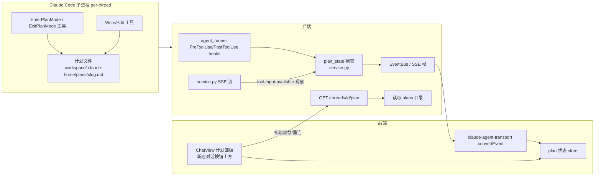
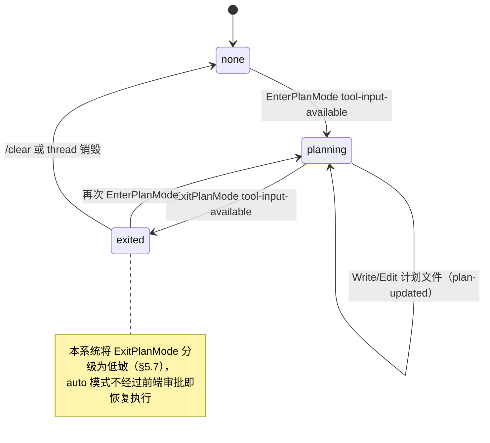
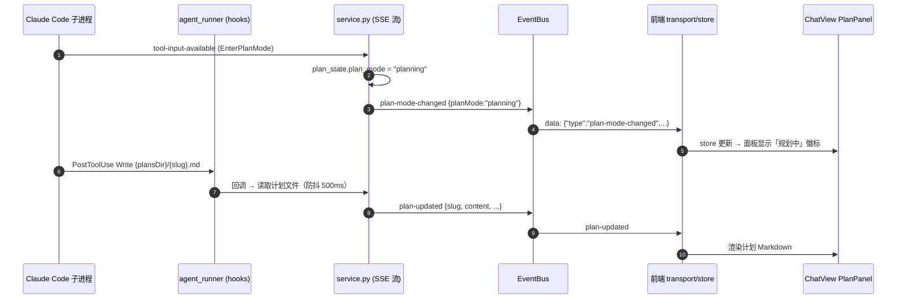
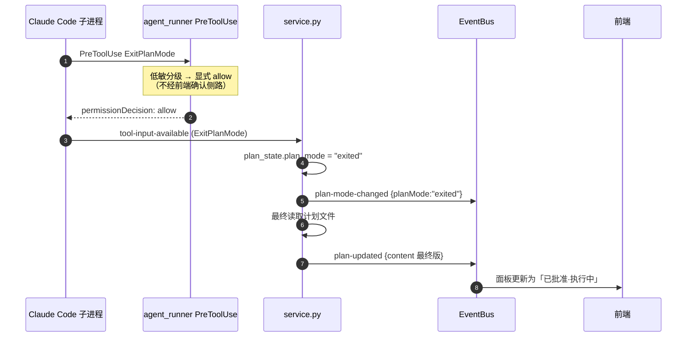
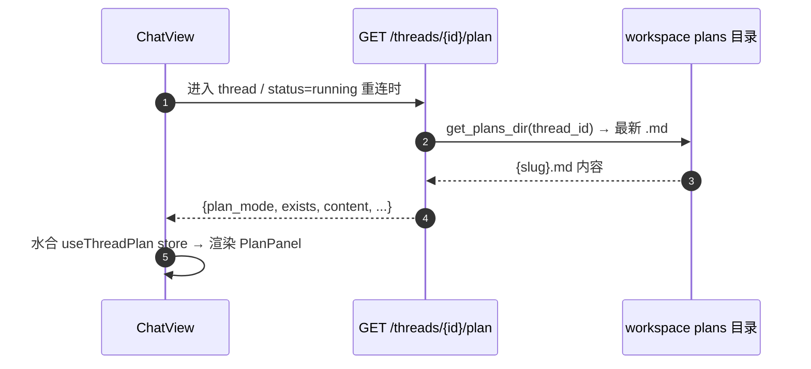

> [Input] `docs/design/claude-agent/claude-plan-mode-analysis.md`, `backend/libs/claude_agent_kit/server/agent_runner.py`, `backend/libs/claude_agent_kit/server/sdk_env.py`, `backend/libs/claude_agent_kit/server/workspace.py`, `backend/claude_agent/service.py`, `backend/routers/claude_agent.py`, `frontend/src/lib/claude-agent-transport.ts`, `frontend/src/components/chat/ChatView.tsx`
> [Output] claude-plan 功能设计：Claude Code Plan Mode 计划文件的落盘路径解析、后端捕获机制、SSE/REST 数据契约与前端展示挂载点。
> [Pos] plan-feature-design-doc in `docs/design/claude-agent`
> [Sync] 2026-07-20: 初版 — 依据 `claude-plan-mode-analysis.md`（Claude Code 还原源码分析）与现有 claude-agent 交互契约设计；仅设计契约，业务代码实现见 §7/§8。
> [Sync] 2026-07-20: §7 全部实现项已落地（后端 + 前端 + 测试 + 契约/策略文档登记）。实现偏差记录：① 防抖为 leading-edge throttle（立即发射、窗口内抑制重复），终版由 ExitPlanMode 最终读取保证；② `contentBytes` 在 `truncated:true` 时仍报磁盘真实字节数；③ REST 负载以文件系统为准但不回写内存态（下一事件自愈）；④ 前端交互后经修订为控制栏计划按钮（见下条 Sync）；⑤ ChatPanel 追加 transport `threadId` 透传与重连流 `plan-*` 帧转发。验证：后端 153 passed（`backend/.venv` pytest），前端 `npm run build` exit 0。
> [Sync] 2026-07-20: 交互修订 — 前端由「常驻面板」改为「浮动控制栏计划按钮」：`PlanButton`（`PlanPanel.tsx` 默认导出，title="计划"）渲染于「新建对话」按钮与「更多」按钮之间；默认不渲染，仅当 `planMode ∈ {planning, exited}` 或 `exists === true` 时出现；点击切换锚定弹层（计划 Markdown、徽标、updatedAt、截断加载完整），点击外部/Esc 收起，切换 thread 自动收起；未读更新以按钮圆点指示。弹层未复用 CollapsibleSection（按钮即开关语义），样式对齐栏内「更多」下拉。验证：`npm run build` exit 0。

# claude-plan 设计：Plan Mode 计划内容捕获与展示契约

## 1. 背景与目标

Claude Code 官方 Plan Mode 中，模型通过 `EnterPlanMode` / `ExitPlanMode` 两个内建工具进入/退出规划态，计划正文写入 plans 目录下的 `{slug}.md`（机制详考见 [`claude-plan-mode-analysis.md`](./claude-plan-mode-analysis.md)）。当前 Ink & Memory 部署中 CLI 工具清单已包含这两个工具（`backend/output.txt` 实流证据），但系统存在三个缺口：

| 缺口 | 现状 | 目标 |
|------|------|------|
| 计划文件不可见 | 计划默认写到 runner 全局 `~/.claude/plans/`，脱离 thread workspace，后端与前端均无法按 thread 定位 | 计划文件落在 per-thread workspace 内，后端可按 thread 解析路径 |
| 无数据契约 | SSE 事件集（`claude-agent-api-contracts.md` §4.5.2）无计划相关事件 | 新增 `plan-mode-changed` / `plan-updated` 事件与 `GET .../plan` 端点 |
| 无展示位置 | ChatView 无计划内容 UI | 在「新建对话」控制区上方新增可折叠计划面板（前端实现见 Task 2，本文定义契约） |

## 2. 范围界定

| 本文覆盖 | 本文不覆盖 |
|----------|-----------|
| 计划文件落盘路径解析（`CLAUDE_CONFIG_DIR` 主方案、`plansDirectory` 备选） | 前端面板的具体视觉实现（Task 2） |
| 计划生命周期状态机与后端捕获点 | `CLAUDE_CONFIG_DIR` 注入的代码改动细节（Task 3，本文只定契约与注入点） |
| SSE / REST 数据契约（事件名、payload schema、thread 关联） | 权限策略代码改动（Task 4，本文只定分级结论与依据） |
| 实现文件清单、优先级、验证方案 | Ultraplan、teammate 审批信箱等官方高级分支 |

## 3. 现状依据

### 3.1 官方机制摘要（来自还原源码分析）

- 路径解析 `getPlansDirectory()`（还原源码 `src/utils/plans.ts:79-111`）：settings 键 `plansDirectory`（相对项目根解析、**越界静默回退**）优先；否则 `{CLAUDE_CONFIG_DIR ?? ~/.claude}/plans`。**无独立 plans 环境变量、无 CLI 参数**。
- 文件名：每会话随机词组 slug（`形容词-动词-名词`），冲突最多重试 10 次；主会话 `{slug}.md`。
- 写豁免：plan mode 下仅 `{slug}*.md` 前缀文件可免审批写入（`isSessionPlanFile`）。
- `ExitPlanMode` 官方语义为 `checkPermissions → ask`（交互审批）；`EnterPlanMode` 只读、默认 allow。

### 3.2 本系统锚点（2026-07-20 代码现状）

- Runner cwd：`service.py:443-458`，`workspace_enabled` 时 `cwd = {AGENT_CWD}/{thread_id}`（`workspace.py:315/484/518`），客户端 `request.cwd` 被忽略。
- SDK env 注入链：`agent_runner.py:1696-1710` 构造 `sdk_options` 后经 `apply_user_sdk_env_to_options` 合并，优先级 `backend/.env` → 进程环境 → `user_sdk_env` → 显式 `options.env`（[`claude-sdk-env-design.md`](./claude-sdk-env-design.md) §5.1）。`CLAUDE_CONFIG_DIR` 当前不在 `_PROJECT_DOTENV_SDK_ENV_NAMES`（`sdk_env.py:28-45`），后端源码中无任何引用。
- SSE 通道：`POST /api/claude-agent` 单 `data:` 帧、按 JSON `type` 分发（[`claude-agent-api-contracts.md`](./claude-agent-api-contracts.md) §4.5.1）；前端 `claude-agent-transport.ts` `convertEvent` 映射为 UIMessageChunk。
- 权限策略：`_LOW_SENSITIVITY_QUERY_TOOL_NAMES`（`agent_runner.py:211-232`）、`_apply_low_sensitivity_query_permission`（1074-1109），决策顺序见 [`claude-agent-permission-policy.md`](./claude-agent-permission-policy.md) §6。

## 4. 总体架构



## 5. 详细设计

### 5.1 计划文件落盘路径解析

**主方案（对齐 Task 3 要求）— `CLAUDE_CONFIG_DIR` 注入：**

- 取值：`{workspace_path}/.claude-home`（per-thread 隔离，随 workspace TTL 一并清理）。
- 效果：官方默认逻辑使 plans 目录解析为 `{workspace}/.claude-home/plans/{slug}.md`。
- 注入点（复用优先）：`sdk_env.py` 新增 `apply_plan_mode_env_to_options(options, cwd)`，在 `agent_runner.py` 构造 `sdk_options` 后、`apply_user_sdk_env_to_options` 之前调用；仅 `workspace_enabled` 且 cwd 非空时生效。优先级链中位于最低层，允许 `user_sdk_env` 显式覆盖（与用户 env 设计 §3 一致）。
- **不改动** `_PROJECT_DOTENV_SDK_ENV_NAMES`：`CLAUDE_CONFIG_DIR` 不允许从 `backend/.env` 透传，避免全局 config home 被意外搬移。

**备选方案 — `plansDirectory` settings 键：**

- 在 per-thread workspace `.claude/settings.json`（`sync_workspace_sandbox_settings`，`workspace.py:400`）中写入 `plansDirectory: "plans"`，计划落 `{workspace}/plans/{slug}.md`。
- 适用场景：env 注入不可用（如 SDK 版本变动）时的回退；官方越界校验天然满足（相对项目根、不越界）。

**后端路径解析函数**（单一真相源，前后端契约共用）：

```
# workspace.py 新增
def get_plans_dir(session_id) -> Path | None
# workspace_enabled 且目录存在 → {workspace}/.claude-home/plans
# 回退探测 {workspace}/plans（备选方案写入时）
# 否则 → None（契约 exists=false）
```

**约束**：路径必须 `resolve()` 后仍以 workspace 根为前缀（复刻官方越界回退逻辑）， symlink 逃逸按 `workspace.py:534` 现有 path-traversal guard 处理；只读 `.md`，拒绝其他后缀。

### 5.2 计划生命周期状态机



状态仅存内存（挂在 `AgentRunState` / `_TurnContext` 旁，新增 `plan_state: PlanState`），**不落库**；刷新/重连一律通过 §5.5 REST 端点从文件系统重建（plans 目录是唯一持久层）。

`PlanState` 字段：`plan_mode: "none"|"planning"|"exited"`、`slug: str|None`、`file_name: str|None`、`updated_at: ISO8601|None`、`content_bytes: int`。

### 5.3 后端捕获点

| 捕获点 | 位置 | 行为 |
|--------|------|------|
| 工具调用观察 | `service.py` SSE 流转换层（`_sse_events_to_ui_parts` 上游），观察 `tool-input-available` 且 `toolName ∈ {EnterPlanMode, ExitPlanMode}` | 迁移 `plan_mode` 状态；`ExitPlanMode` 时触发一次计划文件读取并发射 `plan-updated` |
| 计划文件写入观察 | `agent_runner.py` 新增 PostToolUse hook（挂在现有 `hooks={"PostToolUse": [...]}` 同处），匹配 `Write`/`Edit`/`MultiEdit` 且解析路径位于 `get_plans_dir()` 内 | 更新 slug/file_name/updated_at，发射 `plan-updated`（防抖：同一 turn 内同一文件 500ms 合并，阈值走配置 `INK_AGENT_PLAN_EMIT_DEBOUNCE_MS`） |
| 按需读取 | §5.5 REST 端点 | 直接读文件系统，不依赖内存状态 |

**不做** fsnotify 文件监听：计划文件的所有写入必经上述工具流，事件驱动已完备，避免引入 watcher 依赖与跨平台差异（过度设计审查结论）。

### 5.4 SSE 事件契约（channel：`POST /api/claude-agent` 流）

遵循既有帧格式（单 `data:` 行、按 `type` 分发、生命周期帧不入 `collected_parts`）：

| `type` | 字段 | 收集策略 | 说明 |
|--------|------|----------|------|
| `plan-mode-changed` | `planMode: "planning"\|"exited"`, `toolCallId` | **不收集**（生命周期帧，同 `tool-approval-request`） | EnterPlanMode / ExitPlanMode 状态迁移 |
| `plan-updated` | `slug`, `fileName`, `content`, `contentBytes`, `truncated`, `updatedAt` | **不收集** | 计划内容快照；超过 `INK_AGENT_PLAN_MAX_CONTENT_BYTES`（默认 262144）时截断并置 `truncated:true`，前端可经 REST 拉全量 |

示例帧：

```
data: {"type":"plan-updated","slug":"amber-churn-otter","fileName":"amber-churn-otter.md","content":"# 计划\n...","contentBytes":1832,"truncated":false,"updatedAt":"2026-07-20T01:23:45.678Z"}
```

错误与边界：计划文件读取失败（IO/编码）时**不发射** `plan-updated`，仅记日志；`plan-mode-changed` 仍正常发射（状态迁移与文件内容解耦）。

### 5.5 REST 契约

`GET /api/claude-agent/threads/{thread_id}/plan`（注册于 `routers/claude_agent.py`，紧邻 `/status` 端点；同样经 `database.get_chat_thread(thread_id, user_id)` 校验归属，404 语义一致）

响应 `200`：

```json
{
  "thread_id": "thread-abc123",
  "plan_mode": "planning",
  "exists": true,
  "slug": "amber-churn-otter",
  "file_name": "amber-churn-otter.md",
  "content": "# 计划\n...",
  "content_bytes": 1832,
  "truncated": false,
  "updated_at": "2026-07-20T01:23:45.678Z"
}
```

- `exists:false` 时 `slug/file_name/content/updated_at` 为 `null`，`plan_mode` 仍返回内存态或 `"none"`。
- Workspace Mode 关闭（`workspace_enabled=false`）→ 固定返回 `{ "exists": false, "plan_mode": "none", ... }`，不尝试全局 `~/.claude/plans`（跨用户越界风险）。
- plans 目录多文件时取 `updated_at` 最新的 `.md`；与内存 `slug` 不一致时以文件系统为准并修正内存态。

### 5.6 前端消费契约

- Transport：`claude-agent-transport.ts` `convertEvent` 新增两个 case；`plan-*` 事件**不映射为 UIMessageChunk**（不产生消息气泡），转发到新增轻量 plan store（`frontend/src/hooks/useThreadPlan.ts`，按 threadId 键控）。
- 初始加载/重连：`ChatView.tsx` 在现有 `GET .../status` 分支（约 529-531 行）旁并行调用 §5.5 端点水合 store。
- 面板挂载点：ChatView 顶部右侧浮动控制栏（「新建对话」按钮所在区，约 725-731 行）**上方**新增可折叠 `PlanPanel`，复用 `CollapsibleSection.tsx`；数据全部来自 store，展示 `content`（Markdown 渲染）、`plan_mode` 徽标、`updated_at`；空态（`exists:false`）不渲染面板。

### 5.7 权限策略接入（结论与依据，代码改动属 Task 4）

- 结论：`EnterPlanMode`、`ExitPlanMode` 加入 `_LOW_SENSITIVITY_QUERY_TOOL_NAMES`，auto 模式显式 allow，分级名 `low_sensitivity_permission`。
- 依据：两者均为会话态元操作，不直接变更用户内容；本系统无 TUI 审批计划的人工交互场景，若保持官方 ask 语义则 `ExitPlanMode` 每次必触发前端确认弹窗，与产品"计划自动流转"诉求冲突。
- **偏差记录（须同步写入 `claude-agent-permission-policy.md`）**：官方 `ExitPlanMode` 为 ask 语义（含计划确认环节）；本降级意味着模型自定的计划未经人工逐条确认即进入执行，风险由 workspace 边界权限（`_apply_workspace_boundary_permission`）与写工具既有的高敏确认兜底。`tool_choice="manual"` 模式下两工具仍走高敏确认侧路，行为不变。

## 6. 交互时序图

### 6.1 EnterPlanMode 链路



### 6.2 ExitPlanMode 链路



### 6.3 初始加载 / 断线重连



## 7. 实现文件清单

| 文件 | 变更类型 | 说明 |
|------|----------|------|
| `backend/libs/claude_agent_kit/server/workspace.py` | 修改 | 新增 `get_plans_dir()`（§5.1），路径越界校验 |
| `backend/libs/claude_agent_kit/server/sdk_env.py` | 修改 | 新增 `apply_plan_mode_env_to_options()`（Task 3） |
| `backend/libs/claude_agent_kit/server/agent_runner.py` | 修改 | 调用 env 注入；新增 PostToolUse 计划文件观察 hook；`_LOW_SENSITIVITY_QUERY_TOOL_NAMES` 增加两工具（Task 4） |
| `backend/claude_agent/service.py` | 修改 | `plan_state` 内存态；SSE 流观察 `tool-input-available`；发射 `plan-mode-changed` / `plan-updated` |
| `backend/routers/claude_agent.py` | 修改 | 新增 `GET /threads/{thread_id}/plan` |
| `frontend/src/lib/claude-agent-transport.ts` | 修改 | `convertEvent` 新增 `plan-*` case |
| `frontend/src/hooks/useThreadPlan.ts` | 新增 | 按 threadId 键控的 plan store |
| `frontend/src/components/chat/PlanPanel.tsx` | 新增 | 可折叠计划面板（Task 2） |
| `frontend/src/components/chat/ChatView.tsx` | 修改 | 挂载 PlanPanel + 重连水合 |
| `backend/tests/test_claude_agent_runner.py` | 修改 | 低敏分级用例（Task 4） |
| `backend/tests/test_claude_agent_plan.py` | 新增 | 路径解析 / 事件发射 / REST 契约 |
| `docs/design/claude-agent/claude-agent-api-contracts.md` | 修改 | §4.5.2 事件表登记两个新事件 + §4.7 报文示例 |
| `docs/design/claude-agent/claude-agent-permission-policy.md` | 修改 | 低敏清单登记 + ExitPlanMode 官方偏差记录（Task 4） |

所有触碰的代码文件按仓库约定补 `# //[Sync] 2026-07-20` 文件头行。

## 8. 实现优先级

| 优先级 | 内容 |
|--------|------|
| P0 | §5.1 `CLAUDE_CONFIG_DIR` 注入 + `get_plans_dir()`；§5.5 REST 端点；§5.6 store 与 PlanPanel 只读展示 |
| P1 | §5.4 SSE 两个事件与捕获点；重连水合；权限低敏分级（Task 4） |
| P2 | 防抖阈值配置化打磨；`plansDirectory` 备选回退；多计划文件切换 UI |

## 9. 测试与验证方案

```bash
# 后端单测
python -m pytest backend/tests/test_claude_agent_plan.py backend/tests/test_claude_agent_runner.py -q
# 语法检查
python -m py_compile backend/libs/claude_agent_kit/server/workspace.py backend/libs/claude_agent_kit/server/sdk_env.py backend/claude_agent/service.py backend/routers/claude_agent.py
# 前端构建
cd frontend && npm run build
```

关键用例：① 注入后 CLI 计划文件落在 `{workspace}/.claude-home/plans/`；② `get_plans_dir` 越界/无 workspace 返回 `None`；③ `tool-input-available(EnterPlanMode)` 触发 `plan-mode-changed` 且不入 `collected_parts`；④ REST 端点归属校验 404 与 `exists:false` 契约；⑤ 内容超限 `truncated:true`。

## 10. 验收标准

- [ ] auto 模式下 `EnterPlanMode`/`ExitPlanMode` 不触发前端确认弹窗（`manual` 模式仍触发）
- [ ] 计划文件出现在 per-thread workspace 约定目录，不出现在全局 `~/.claude/plans/`
- [ ] 前端面板在 EnterPlanMode 后实时展示计划内容，ExitPlanMode 后定格最终版
- [ ] 刷新/重连后面板经 REST 水合恢复
- [ ] Workspace Mode 关闭时端点返回 `exists:false`，面板不渲染
- [ ] plans 目录路径解析通过越界与 symlink 逃逸用例

## 11. 风险与回退

| 风险 | 影响 | 缓解/回退 |
|------|------|-----------|
| `CLAUDE_CONFIG_DIR` 搬移整个 config home，CLI 在 workspace 内重新生成 settings/skills 缓存 | 首 token 延迟略增；与 workspace `.claude/` 模板并存两份配置 | 注入子路径 `.claude-home` 与 `.claude/` 隔离；异常时摘除 env 注入即回退官方默认 |
| sandbox `denyWrite` 规则覆盖 `.claude-home/` | CLI 无法写计划文件 | Task 3 实施时核对 `sync_workspace_sandbox_settings` 写入的 denyWrite 清单，必要时显式 allowWrite |
| ExitPlanMode 低敏降级使计划未经人工确认即执行 | 执行偏离用户预期 | 高敏写工具仍走确认侧路兜底；policy 文档显式记录偏差；后续可加 Settings 开关恢复 ask |
| 计划内容超大导致 SSE 帧膨胀 | 流卡顿 | `INK_AGENT_PLAN_MAX_CONTENT_BYTES` 截断 + REST 拉全量 |

## 12. 关键决策记录

| 日期 | 决策 | 原因 | 影响 |
|------|------|------|------|
| 2026-07-20 | 主路径用 `CLAUDE_CONFIG_DIR={workspace}/.claude-home`，备选 `plansDirectory` | 对齐 Task 3 要求；per-thread 隔离随 workspace TTL 清理；备选方案零 env 改动 | sdk_env 新增注入函数；不允许 dotenv 透传 |
| 2026-07-20 | 计划状态不落库，文件系统为唯一持久层 | slug 由 CLI 随机生成，DB 无法先验；REST 重建成本低 | 无迁移；刷新语义简单 |
| 2026-07-20 | 不做 fsnotify，事件驱动捕获 | 所有写入必经工具流 | 无新依赖 |
| 2026-07-20 | `plan-*` 事件不映射 UIMessageChunk、不入 `collected_parts` | 计划是面板状态而非对话消息 | 历史消息回放不含计划帧，依赖 REST 水合 |
| 2026-07-20 | ExitPlanMode 降级低敏并记录官方偏差 | 无 TUI 场景下 ask 语义阻塞自动流转 | 须同步 policy 文档与测试 |
