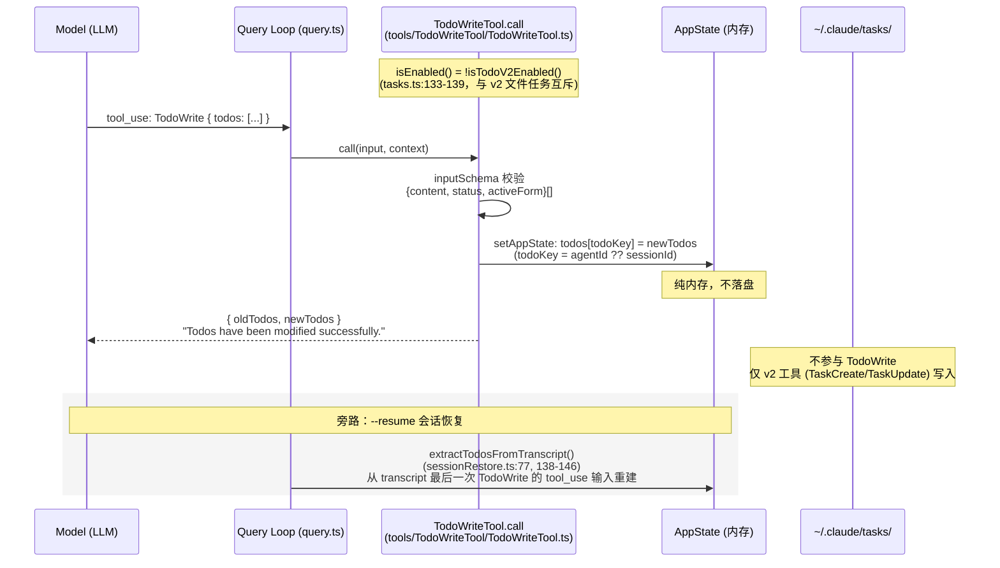
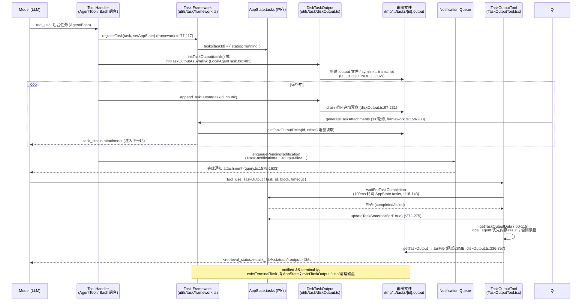
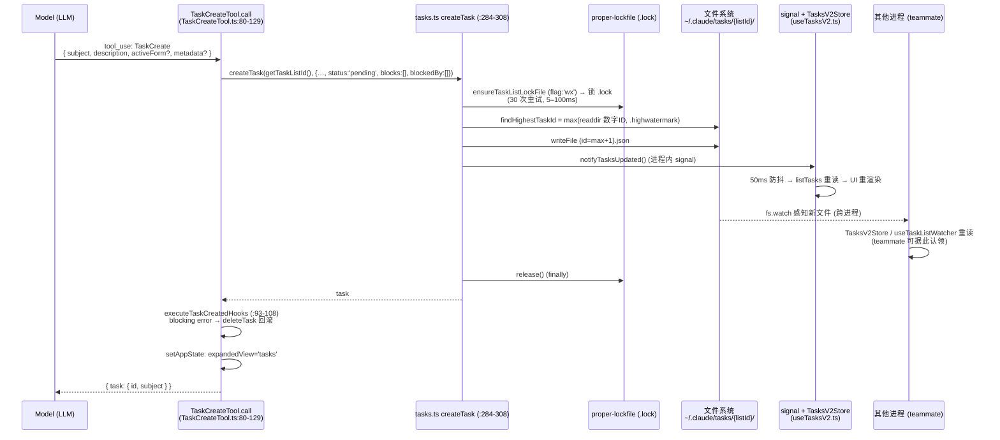
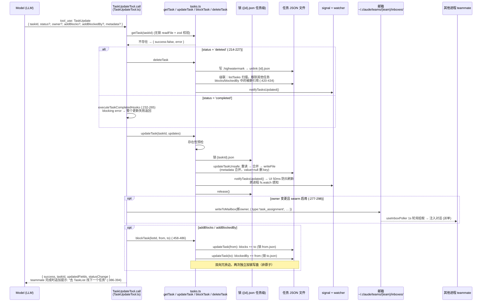
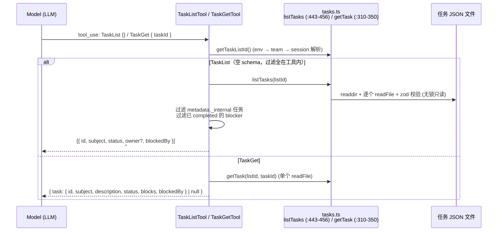
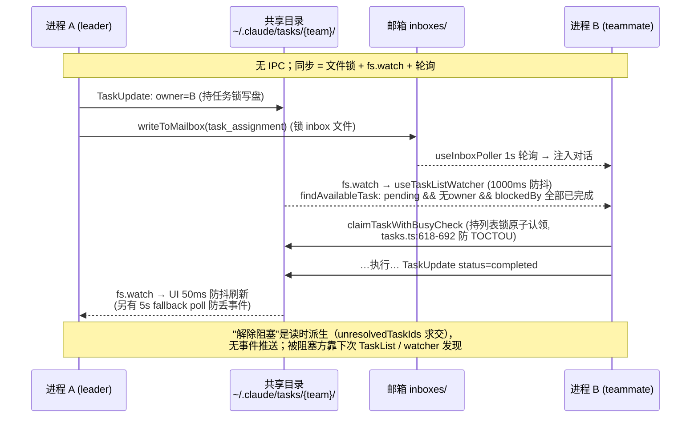

# Claude Code 任务工具源码分析：TodoWrite / TaskOutput / TaskCreate / TaskUpdate / TaskList / TaskGet

> **分析对象**：`/Users/dmeck/project/claude-code-sourcemap/restored-src/src`（sourcemap 恢复的 Claude Code 源码，只读分析）
> **分析日期**：2026-07-20
> **适用范围**：本文所有 `src/...` 路径与行号均相对上述恢复源码根目录，非本仓库代码。

---

## 1. 总览：三套"任务"抽象

Claude Code 源码中存在三个命名相近但完全独立的概念，阅读代码时极易混淆：

| 抽象 | 存储 | 工具 | 启用条件 |
|------|------|------|----------|
| **Todo 清单（v1）** | 纯内存 `AppState.todos[todoKey]` | `TodoWrite` | `!isTodoV2Enabled()`（交互模式默认） |
| **文件任务清单（v2）** | `~/.claude/tasks/{taskListId}/{taskId}.json` | `TaskCreate` / `TaskUpdate` / `TaskList` / `TaskGet` | `isTodoV2Enabled()`：非交互模式或 `CLAUDE_CODE_ENABLE_TASKS` 为真 |
| **后台运行时任务** | 内存 `AppState.tasks[id]` + `/tmp/.../tasks/{id}.output` 文件 | `TaskOutput`（已废弃）、`TaskStop` | 后台 Agent / Bash 任务 |

关键互斥逻辑（`src/utils/tasks.ts:133-139` + `src/tools/TodoWriteTool/TodoWriteTool.ts:52-54`）：

```
TodoWrite.isEnabled()    = !isTodoV2Enabled()
TaskCreate 等.isEnabled() =  isTodoV2Enabled()
```

**注意**：`TaskStopTool`（`src/tools/TaskStopTool/TaskStopTool.ts:60-91`）操作的是后台运行时任务（杀进程 / abort controller），**不属于**文件任务组，只是命名撞车。

---

## 2. `.claude/tasks/` 路径解析与自定义机制

### 2.1 路径解析入口

`src/utils/tasks.ts:221-231`：

```ts
export function getTasksDir(taskListId: string): string {
  return join(getClaudeConfigHomeDir(), 'tasks', sanitizePathComponent(taskListId))
}
export function getTaskPath(taskListId: string, taskId: string): string {
  return join(getTasksDir(taskListId), `${sanitizePathComponent(taskId)}.json`)
}
```

最终形态：`{CLAUDE_CONFIG_DIR 或 ~/.claude}/tasks/{taskListId}/{taskId}.json`，辅助文件有 `.lock`（`:504-506`）和 `.highwatermark`（`:92, :110-112`）。

### 2.2 自定义路径的全部杠杆

| 机制 | 作用点 | 证据 |
|------|--------|------|
| 环境变量 `CLAUDE_CONFIG_DIR` | 覆盖 `.claude` **根目录**（唯一改根方式，memoize 以其为缓存键） | `src/utils/envUtils.ts:7-14` |
| 环境变量 `CLAUDE_CODE_TASK_LIST_ID` | 直接指定 `tasks/` 下子目录名（最高优先级） | `src/utils/tasks.ts:199-202` |
| 环境变量 `CLAUDE_CODE_TEAM_NAME` / 隐藏 CLI `--team-name` | 子目录 = 团队名 | `tasks.ts:209`；`src/main.tsx:3853`；`src/utils/teammate.ts:111-118` |
| in-process teammate 上下文 / `setLeaderTeamName()` | 子目录 = 团队名 | `tasks.ts:205-208, 31-37` |
| 兜底 `getSessionId()` | 子目录 = 会话 ID | `tasks.ts:209` |
| 环境变量 `CLAUDE_CODE_TMPDIR` | 覆盖**任务输出**目录（不在 `.claude` 下）：`/tmp/claude-{uid}/{sanitized-cwd}/{sessionId}/tasks/{taskId}.output` | `src/utils/permissions/filesystem.ts:331-346, 376-378`；`src/utils/task/diskOutput.ts:50-55` |
| 环境变量 `CLAUDE_CODE_ENABLE_TASKS` | 功能开关：强制启用 v2 文件任务、禁用 TodoWrite | `tasks.ts:133-139` |

`taskListId` 解析优先级（`getTaskListId()`，`tasks.ts:195-209`）：
`CLAUDE_CODE_TASK_LIST_ID` → in-process teammate 上下文 → `CLAUDE_CODE_TEAM_NAME` / `--team-name` / `setLeaderTeamName()` → `getSessionId()`。

**否定性确认**：源码中**没有** settings.json 配置项、project config 或专门的 CLI 参数可直接指定 tasks 目录路径；全部自定义经由上述环境变量 / 隐藏 CLI 参数间接生效。`claude task dir`（`main.tsx:4481-4488`）是 ant-only 调试命令，只能**打印**目录，不能设置。文件权限层对 `~/.claude/tasks/` 的读放行硬编码在 `filesystem.ts:1727-1741`。

### 2.3 与本仓库 `claude-plan.md` 的关系

本仓库 Ink & Memory 已通过 `CLAUDE_CONFIG_DIR={workspace}/.claude-home` 重定向 `.claude` 根目录（见 [`claude-plan.md`](./claude-plan.md)）；同一机制同时会把 v2 tasks 目录重定向到 `{workspace}/.claude-home/tasks/`，无需额外配置。

---

## 3. TodoWriteTool 分析

### 3.1 实现与 schema

- 文件：`src/tools/TodoWriteTool/TodoWriteTool.ts`；名称常量 `TODO_WRITE_TOOL_NAME = 'TodoWrite'`（`constants.ts`）。
- 输入（`:13-17`）：`{ todos: TodoListSchema }`，每项 `{ content, status: 'pending'|'in_progress'|'completed', activeForm }`（`src/utils/todo/types.ts:8-17`）。
- 输出（`:20-26`）：`{ oldTodos, newTodos, verificationNudgeNeeded? }`；返回文本在 `mapToolResultToToolResultBlockParam`（`:104-114`）拼成 `"Todos have been modified successfully. ..."`。

### 3.2 纯内存写入，不落盘

`call()`（`:65-103`）只更新 AppState：

```ts
const todoKey = context.agentId ?? getSessionId()
context.setAppState(prev => ({
  ...prev,
  todos: { ...prev.todos, [todoKey]: newTodos },
}))
```

持久化仅在 SDK `--resume` 时通过扫描会话 transcript 中最后一次 TodoWrite 的 `tool_use` 输入重建（`src/utils/sessionRestore.ts:77` `extractTodosFromTranscript()`，`:138-146`），**没有独立的 todo 文件**。`sessionRestore.ts:139` 注释明确："Interactive mode uses file-backed v2 tasks, so AppState.todos is unused there."

### 3.3 TodoWriteTool 时序图



---

## 4. TaskOutputTool 分析

### 4.1 实现与 schema

- 文件：`src/tools/TaskOutputTool/TaskOutputTool.tsx`；常量 `TASK_OUTPUT_TOOL_NAME = 'TaskOutput'`。
- 别名（`:150`）：`['AgentOutputTool', 'BashOutputTool']`（旧工具名兼容）。
- **已废弃**（`:158`）：description 返回 `'[Deprecated] — prefer Read on the task output file path'`，官方推荐直接 Read 输出文件。

输入（`:30-34`）：

```ts
z.strictObject({
  task_id: z.string(),
  block: semanticBoolean(z.boolean().default(true)),   // 是否等待完成
  timeout: z.number().min(0).max(600000).default(30000) // 最长等待 ms
})
```

输出（`:39-54`）：`{ retrieval_status: 'success'|'timeout'|'not_ready', task: { task_id, task_type, status, description, output, exitCode?, error?, prompt?, result? } | null }`，序列化为 `<retrieval_status>/<task_id>/<status>/<exit_code>/<output>/<error>` XML（`:283-308`）。

### 4.2 双源读取：内存 + 磁盘

- **任务元数据/状态**：内存 `AppState.tasks[task_id]`；`waitForTaskCompletion`（`:118-143`）以 100ms 轮询。
- **输出内容**（`getTaskOutputData`，`:60-115`）按任务类型分派：
  - `local_bash`：优先内存 `bashTask.shellCommand?.taskOutput.getStdout()/getStderr()`；否则读磁盘。
  - `local_agent`：优先内存 `agentTask.result`（磁盘 `.output` 是指向完整 transcript 的 symlink，内存 result 才是干净的最终回答，`:91-105`）。
  - `remote_agent`：读磁盘。
- 磁盘读取：`diskOutput.ts:336-357` `getTaskOutput()` → `tailFile(getTaskOutputPath(taskId), maxBytes)`（尾部最多 8MB）。

### 4.3 TaskOutputTool 时序图（含后台任务全生命周期）



---

## 5. v2 文件任务工具：schema 与底层机制

### 5.1 四个工具的输入/输出

**TaskCreateTool**（`src/tools/TaskCreateTool/TaskCreateTool.ts:18-44`）：

```ts
// 输入
{ subject: string, description: string, activeForm?: string, metadata?: Record<string, unknown> }
// 输出
{ task: { id, subject } }
```

`call()`（`:80-129`）：`createTask(getTaskListId(), { …, status: 'pending', owner: undefined, blocks: [], blockedBy: [] })` → `executeTaskCreatedHooks`（blocking error 时 `deleteTask` 回滚，`:110-113`）→ `setAppState` 把 `expandedView` 展开为 `'tasks'`（`:116-119`）。

**TaskUpdateTool**（`src/tools/TaskUpdateTool/TaskUpdateTool.ts:33-83`）：

```ts
// 输入（除 taskId 全部可选）
{ taskId: string, subject?, description?, activeForm?,
  status?: 'pending'|'in_progress'|'completed'|'deleted',  // 'deleted' 是工具层特殊动作（:35）
  addBlocks?: string[], addBlockedBy?: string[], owner?: string,
  metadata?: Record<string, unknown> }  // 合并语义；value 为 null 删除该 key（:200-211）
// 输出
{ success, taskId, updatedFields: string[], error?, statusChange?: { from, to }, verificationNudgeNeeded? }
```

**TaskListTool**（`src/tools/TaskListTool/TaskListTool.ts:13-28`）：**空 schema**，过滤全在工具内部（`:65-90`）：剔除 `metadata._internal` 任务；`blockedBy` 中已 completed 的 ID 被过滤（只显示仍生效的阻塞）。渲染文本形如 `#3 [in_progress] 标题 (owner) [blocked by #1, #2]`。

**TaskGetTool**（`src/tools/TaskGetTool/TaskGetTool.ts:13-33`）：输入 `{ taskId }`；输出 `{ task: { id, subject, description, status, blocks, blockedBy } | null }`（不返回 owner/metadata/activeForm）。

### 5.2 任务 ID 生成与 `.highwatermark`

- `createTask()`（`tasks.ts:284-308`）在持有列表级 `.lock` 时执行：`findHighestTaskId()`（`:271-277`）= `max(目录里所有 {n}.json 的最大 n, readHighWaterMark())`，id = max+1 后 `writeFile`。
- `.highwatermark` 保证删除/重置后 ID 不复用：`deleteTask()`（`:400-407`）删文件前写入被删数字 ID；`resetTaskList()`（`:147-188`）清空前记录当前最大 ID。
- ID 是**纯数字字符串自增**（"1"、"2"、…），与后台任务（agentId/shellId）命名空间完全分离。

### 5.3 文件锁（proper-lockfile）

- 惰性包装：`src/utils/lockfile.ts:18-31`（首次调用才 require，避免启动时 graceful-fs 猴子补丁的 ~8ms 开销）。
- 重试参数（`tasks.ts:102-108`）：`{ retries: 30, minTimeout: 5, maxTimeout: 100 }`，预算为 ~10 个并发 swarm agent 设计。
- 两级锁：
  - **列表级** `.lock`（`getTaskListLockPath()`，`:504-506`；`ensureTaskListLockFile()` 用 `flag:'wx'` 保证锁文件存在）：`createTask`、`resetTaskList`、`claimTaskWithBusyCheck`。
  - **任务级**：直接锁 `{taskId}.json` 本身：`updateTask`（`:386`）、`claimTask`（`:566`）。
- `updateTaskUnsafe()`（`:354-368`）供已持锁的调用方使用，避免死锁。

### 5.4 blockedBy / blocks 双向维护

**建立依赖** —— `blockTask(taskListId, fromTaskId, toTaskId)`（`:458-486`）：先 `getTask` 读双方，然后**两次 `updateTask` 分别改写两个 JSON 文件**（A.blocks 加入 B、B.blockedBy 加入 A），两次写各持各的锁，**非原子**。

**删除级联** —— `deleteTask()`（`:420-434`）：删文件后 `listTasks` 扫描所有剩余任务，凡是 `blocks`/`blockedBy` 引用被删 ID 的，逐个 `updateTask` 移除引用。

**解除阻塞是"读时派生"**，不是事件推送：`claimTask`（`:584-594`）、`findAvailableTask`（`useTaskListWatcher.ts:197-208`）、`TaskListTool` 三处在运行时计算 `unresolvedTaskIds = allTasks.filter(t => t.status !== 'completed')` 再与 `blockedBy` 求交。不存在"任务完成时遍历 dependents 并唤醒"的逻辑。

### 5.5 status 流转

- `TaskStatusSchema = z.enum(['pending', 'in_progress', 'completed'])`（`tasks.ts:69-74`）；`'deleted'` 不是合法存储值，由 `TaskUpdateTool.call`（`:214-227`）转成 `deleteTask()`。
- `updateTask` 本身**没有任何状态机校验**（只做存在性检查 + 锁 + 合并写盘）；已完成任务可以被再次更新（只有 `claimTask` 在 `:579-582` 拒绝 claim 已 completed 任务，返回 `already_resolved`）。
- 完成时的唯一拦截：status→completed 时先跑 `executeTaskCompletedHooks`（`TaskUpdateTool.ts:232-265`），blocking error 则整个更新失败。

### 5.6 `notifyTasksUpdated()` signal 与双 watcher

- 实现：`src/utils/signal.ts:27-43` `createSignal()` —— `Set<listener>`，`emit` 同步逐个调用；**纯进程内、无参数**（"something happened" 语义）。触发点：`createTask`/`updateTaskUnsafe`/`deleteTask`/`resetTaskList`/`setLeaderTeamName`/`clearLeaderTeamName`。
- **唯一订阅者**：`TasksV2Store`（`src/hooks/useTasksV2.ts:66`），UI 单例 store。

**两个 watcher 职责不同**：

| | `useTasksV2`（UI 展示） | `useTaskListWatcher`（"tasks mode" 自动执行） |
|---|---|---|
| 文件 | `src/hooks/useTasksV2.ts` | `src/hooks/useTaskListWatcher.ts` |
| 监听目录 | `getTasksDir(getTaskListId())`，taskListId 变化时 rewatch | `getTasksDir(taskListId)`，仅传入 taskListId 时启用 |
| 防抖 | **50ms**（`DEBOUNCE_MS = 50`） | **1000ms** |
| 触发源 | 进程内 signal + fs.watch + 5s 兜底轮询（仅有未完成任务时挂） | fs.watch + 对话轮结束（isLoading true→false）立即检查 |
| 动作 | `listTasks` 重读 → `useSyncExternalStore` 重渲染；全部完成 5s 后 `resetTaskList()` 清空磁盘并隐藏 | `findAvailableTask` → `claimTask` 原子认领 → `formatTaskAsPrompt` 注入新对话轮；提交失败则释放 owner |

---

## 6. TaskCreate 时序图



---

## 7. TaskUpdate 时序图



---

## 8. TaskList / TaskGet 时序图（只读路径）



---

## 9. 跨进程协作时序图（teammate 场景）

teammate 场景（`CLAUDE_CODE_TEAM_NAME` / `--team-name`）下多个 Claude 进程共享 `~/.claude/tasks/{team-name}/`：

- **互斥**靠 proper-lockfile 文件锁（跨进程有效，基于锁文件 + mtime stale 检测）；`claimTaskWithBusyCheck`（`tasks.ts:618-692`）持列表级锁完成"读全部 → 检查已认领/已完成/被阻塞/自己是否已有在做任务 → 写 owner"原子序列，防 TOCTOU。
- **跨进程通知没有 IPC**，靠被动通道：fs.watch（UI 50ms / tasks-mode 1000ms 防抖）+ 轮询兜底（UI 5s、邮箱 1s）。
- **邮箱（伪 IPC）**：`writeToMailbox`（`src/utils/teammateMailbox.ts:134-176`）写 `~/.claude/teams/{team}/inboxes/{agent}.json`（同样加锁）；接收方 `useInboxPoller.ts:107` 每 1 秒轮询注入对话。
- **teammate 退出回收**：`unassignTeammateTasks`（`tasks.ts:818-860`）把退出者的未完成任务重置为 `owner: undefined, status: 'pending'` 并通知 leader。



---

## 10. 设计结论速查

1. **TodoWrite 是纯内存工具**，与磁盘 `.claude/tasks/` 无关；v2 文件任务与 TodoWrite 由 `isTodoV2Enabled()` 互斥切换。
2. **路径自定义只有环境变量 / 隐藏 CLI 参数**：`CLAUDE_CONFIG_DIR`（改根）、`CLAUDE_CODE_TASK_LIST_ID` / `CLAUDE_CODE_TEAM_NAME` / `--team-name`（改子目录）、`CLAUDE_CODE_TMPDIR`（改任务输出目录）、`CLAUDE_CODE_ENABLE_TASKS`（功能开关）。无 settings.json / project config 入口。
3. **并发一致性 = 三级机制**：proper-lockfile 文件锁（列表级 + 任务级，30 次重试）→ 进程内 `createSignal` → 跨进程 fs.watch + 轮询兜底。
4. **任务 ID 纯数字自增**，`.highwatermark` 保证删除后不复用；与后台任务 ID 命名空间分离。
5. **依赖边双文件冗余存储**（A.json `blocks:[B]` ↔ B.json `blockedBy:[A]`），`blockTask` 两次加锁写入（非原子），`deleteTask` 级联拆除；解除阻塞由读取方动态计算。
6. **TaskOutput 已废弃**，推荐直接 Read `<output-file>`；`TaskStop` 属于后台任务族，与文件任务组无关。
7. **任务完成无主动通知**：靠 tool result 文本提示（`TaskUpdateTool.ts:386-394`）和 prompt 指引（`TeamCreateTool/prompt.ts:98`）让 teammate 主动 TaskList 发现。
