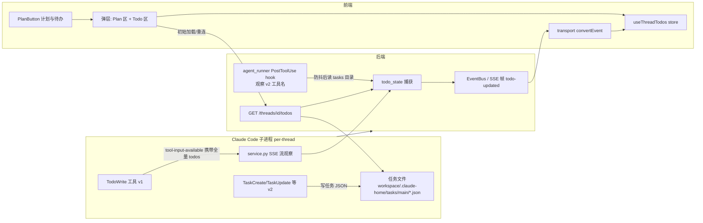
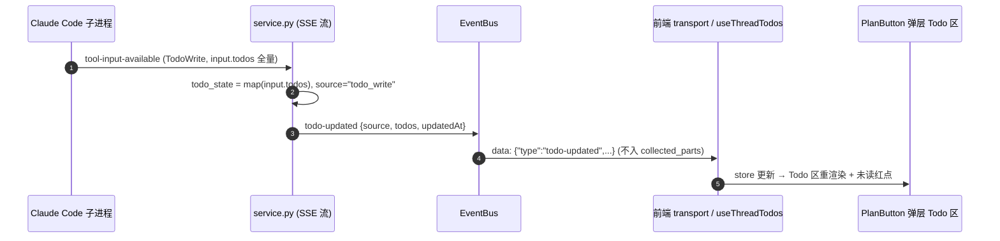
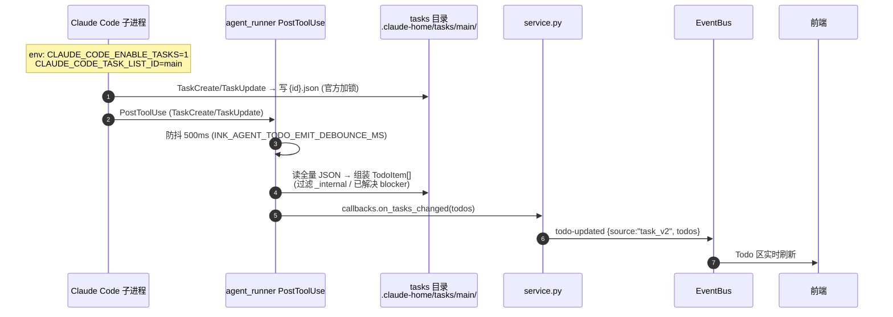
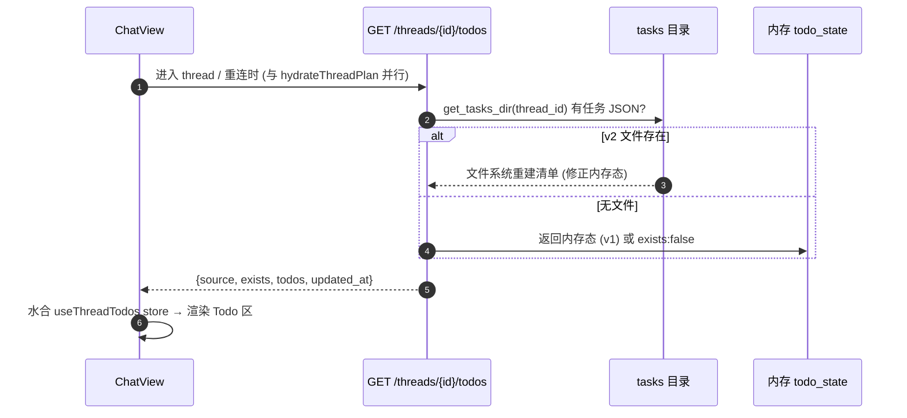
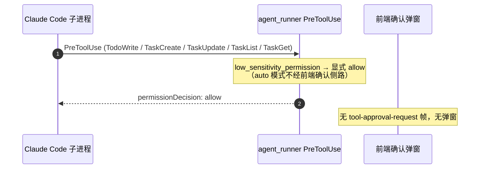

> [Input] `docs/design/claude-agent/claude-task-tools-source-analysis.md`, `docs/design/claude-agent/claude-plan.md`, `backend/libs/claude_agent_kit/server/agent_runner.py`, `backend/libs/claude_agent_kit/server/sdk_env.py`, `backend/libs/claude_agent_kit/server/workspace.py`, `backend/claude_agent/service.py`, `backend/routers/claude_agent.py`, `frontend/src/lib/claude-agent-transport.ts`, `frontend/src/hooks/useThreadPlan.ts`, `frontend/src/components/chat/PlanPanel.tsx`, `frontend/src/components/chat/ChatView.tsx`, `frontend/src/components/chat/Icons.tsx`
> [Output] claude-todo 功能设计：Claude Code 任务清单（v1 TodoWrite / v2 文件任务）的捕获、SSE/REST 数据契约、PlanButton 图标改造与 Todo 展示面板、Todo 工具低敏分级。
> [Pos] todo-feature-design-doc in `docs/design/claude-agent`
> [Sync] 2026-07-20: 初版 — 依据 `claude-task-tools-source-analysis.md`（Claude Code 还原源码分析）与 `claude-plan.md` 既有范式；仅设计契约，业务代码实现见 §7/§8。
> [Sync] 2026-07-20: §7 全部实现项已落地（后端 + 前端 + 测试 + 契约/策略文档登记）。验证：后端 todo 26 tests + plan 23 tests + runner 71 tests 全绿，前端 `npm run build` exit 0。
> [Sync] 2026-07-20: §5.6 按钮形态修订 — PlanButton 去除常驻文字，仅显示 `IconList` 列表图标（Icons.tsx 新增），「计划与待办」文字改为悬浮 tooltip（hover 且弹层未打开时显示，`aria-label` 保留语义）；`IconPlanTasks` 保留于弹层徽标处。
> [Sync] 2026-07-20: §5.6 弹层样式修订（参照进度卡片样式图）— 弹层改为「计划」「待办」双卡片堆叠；待办区改为圆点状态图标（completed 实心+白勾+删除线 / in_progress 描边+中心点 / pending 空心圆）替代 #id 与文字徽章，默认展示前 3 条、超出经「展开 N 个 / 收起」折叠控制。

# claude-todo 设计：任务清单捕获与展示契约

## 1. 背景与目标

Claude Code 存在三套"任务"抽象（详考见 [`claude-task-tools-source-analysis.md`](./claude-task-tools-source-analysis.md) §1）：v1 `TodoWrite`（纯内存 `AppState.todos`，交互模式默认）、v2 文件任务（`TaskCreate/TaskUpdate/TaskList/TaskGet` 写 `~/.claude/tasks/{taskListId}/{id}.json`，由 `CLAUDE_CODE_ENABLE_TASKS` 或非交互模式启用，与 v1 互斥）、后台运行时任务（`TaskOutput/TaskStop`，与本文无关）。当前 Ink & Memory 部署存在三个缺口：

| 缺口 | 现状 | 目标 |
|------|------|------|
| Todo 状态不可见 | v1 `TodoWrite` 调用流经 SDK 流但后端不解析其载荷；v2 任务文件即使落盘（`CLAUDE_CONFIG_DIR` 已被 Plan 功能重定向到 `{workspace}/.claude-home`）也无人读取 | 双路径捕获 Todo 状态，前端实时展示 |
| 无数据契约 | SSE 事件集（`claude-agent-api-contracts.md` §4.5.2）无 todo 相关事件；无 REST 端点 | 新增 `todo-updated` 事件与 `GET .../todos` 端点 |
| 权限摩擦 | `TodoWrite` 在 `DEFAULT_ALLOWED_TOOLS` 但不在低敏清单（auto 模式落前端确认侧路）；`TaskCreate/TaskUpdate/TaskList/TaskGet` 完全未接入权限体系 | 五个工具统一归入 `low_sensitivity_permission`，不弹确认窗 |

同时，前端 PlanButton 语义从"计划"扩展为"计划与待办"：修改按钮图标与文案，在展开弹层中新增 Todo 内容显示位置。

## 2. 范围界定

| 本文覆盖 | 本文不覆盖 |
|----------|-----------|
| v1/v2 双路径捕获契约与统一 `TodoItem` 模型 | 后台运行时任务（`TaskOutput`/`TaskStop`） |
| `taskListId` 隔离决策（防多 thread / 多 session 串扰） | teammate/swarm 多进程协作（邮箱、`claimTask` 等官方高级分支） |
| SSE / REST 数据契约 | 前端面板的具体像素级视觉实现 |
| Todo 工具低敏分级结论与依据 | 权限系统本身重构 |
| PlanButton 图标改造与 Todo 展示挂载点 | Plan 功能本身（见 `claude-plan.md`） |
| 工作流规则固化（§13） | — |

## 3. 现状依据

### 3.1 官方机制摘要（来自还原源码分析）

- **v1**：`TodoWrite` 输入即全量清单（`{content, status: pending|in_progress|completed, activeForm}[]`），纯内存不落盘（`TodoWriteTool.ts:65-103`）；`--resume` 时从 transcript 最后一次 `tool_use` 输入重建。**关键推论：v1 的完整状态天然存在于 SDK 消息流的工具输入里，后端捕获无需任何文件依赖。**
- **v2**：任务 JSON 落 `{CLAUDE_CONFIG_DIR}/tasks/{taskListId}/{id}.json`（`tasks.ts:221-231`）；`taskListId` 解析优先级 `CLAUDE_CODE_TASK_LIST_ID` → teammate/team → `getSessionId()` 兜底；ID 为数字自增，`.highwatermark` 防复用；`blockedBy` 中已 completed 的项在展示层过滤。
- **互斥**：`isTodoV2Enabled()`（`tasks.ts:133-139`）决定 CLI 暴露 v1 还是 v2 工具组。
- **路径联动**：本系统 Plan 功能已注入 `CLAUDE_CONFIG_DIR={workspace}/.claude-home`（`sdk_env.py:156-185`），v2 任务文件因此天然落在 per-thread workspace 内的 `{workspace}/.claude-home/tasks/{taskListId}/`，无需新增根目录重定向。

### 3.2 本系统锚点（2026-07-20 代码现状）

- SSE 捕获范式：`service.py` 在 `tool-input-available` 处理路径观察工具流（`_observe_plan_mode_transition`，`service.py:385-412`，调用点 `:1259/:1285`）；PostToolUse hook 范式（`_plan_file_post_tool_use_hook`，`agent_runner.py:1771-1795`，注册于 `:1841-1846`）。
- 生命周期帧约定：`plan-*` 帧不入 `collected_parts`、不映射 UIMessageChunk，经 threadId 键控 store 消费（`useThreadPlan.ts`、`claude-agent-transport.ts:370-376`）。
- 权限现状：`_LOW_SENSITIVITY_QUERY_TOOL_NAMES`（`agent_runner.py:225-252`）不含五个 Todo 工具；`DEFAULT_ALLOWED_TOOLS`（`:167-189`）含 `TodoWrite`（`:180`）不含 `TaskCreate/TaskUpdate/TaskList/TaskGet`。
- 前端挂载点：控制栏 `ChatView.tsx:750`（`PlanButton` 位于「新建对话」与「更多」之间）；图标库 `Icons.tsx`（`createIcon` 工厂，已有 `IconChecklist` `:38` 与 `IconTasks` `:64`）。

## 4. 总体架构



## 5. 详细设计

### 5.1 双路径数据源与 `taskListId` 隔离决策

**路径一（P0，默认）— v1 TodoWrite 流内捕获：**

- 无需任何 env / 文件依赖；在 `service.py` 观察 `tool-input-available` 且 `toolName == "TodoWrite"`，直接取 `input.todos` 全量清单作为新状态。
- CLI 在 v2 未启用时暴露的正是 `TodoWrite`，因此该路径覆盖当前部署的全部交互会话。

**路径二（P1，配置开启）— v2 文件任务：**

> **[2026-07-26 契约修订]** claude-agent-sdk 0.2.128 内置 CLI 的行为变更：任务工具**默认启用**（`CLAUDE_CODE_ENABLE_TASKS !== "0"` 即启用），不再依赖本系统注入；`taskListId` 未设置时官方兜底为 teamName / `sessionId`。由此产生的真实线上 bug：旧部署未开 `INK_AGENT_TASK_V2_ENABLED` 时，CLI 的 TaskCreate/TaskUpdate 照常生效，但任务 JSON 写入 `{CLAUDE_CONFIG_DIR}/tasks/{sessionId 兜底}/` 而非 `tasks/main`，`get_tasks_dir()` 定位失败 → 弹层永空。修复：**`CLAUDE_CODE_TASK_LIST_ID=main` 改为无条件注入**（最低优先级，显式值保留）；`INK_AGENT_TASK_V2_ENABLED` 退化为仅追加显式 `CLAUDE_CODE_ENABLE_TASKS=1` 的遗留开关（CLI 默认已启用，一般无需设置；显式关闭可走 CLI 原生 `CLAUDE_CODE_ENABLE_TASKS=0`）。

- 启用条件（修订后）：无需任何开关。`sdk_env.py` 每次运行都注入：
  - `CLAUDE_CODE_TASK_LIST_ID=main` — **固定 taskListId 为常量**（无条件，最低优先级）；
  - `CLAUDE_CODE_ENABLE_TASKS=1` — 仅当遗留 `INK_AGENT_TASK_V2_ENABLED` 为真时追加注入（与 CLI 默认启用一致，属冗余保险）。
- **taskListId 隔离决策**：`CLAUDE_CONFIG_DIR` 已是 per-thread（`{workspace}/.claude-home`），tasks 根目录天然按 thread 隔离；但若不固定 taskListId，官方兜底取 CLI `sessionId`，SDK resume / 新会话会产生新 sessionId，导致同一 thread 的任务清单散落在多个子目录、REST 无法定位。固定为 `main` 后路径稳定为 `{workspace}/.claude-home/tasks/main/`，随 workspace TTL 一并清理。注入点复用 `apply_plan_mode_env_to_options` 同处（`agent_runner.py` run_streaming 调用链），优先级同样最低、允许 `user_sdk_env` 覆盖。
- 捕获：PostToolUse hook 匹配 `TaskCreate/TaskUpdate`（写操作），防抖后读取 tasks 目录全量 JSON 组装清单（复刻官方"读时派生"语义：过滤 `metadata._internal`、`blockedBy` 剔除已 completed）；`TaskList/TaskGet` 为只读，不触发发射。

**两路径互斥保证**：由 CLI 官方 `isTodoV2Enabled()` 保证同一进程只暴露一族工具；后端 `todo_state` 记录 `source: "todo_write" | "task_v2"`，后到的捕获覆盖先前的（同一会话内实际上只会出现一种）。

**后端路径解析函数**（单一真相源）：

```
# workspace.py 新增
def get_tasks_dir(session_id) -> Path | None
# workspace_enabled 且 {workspace}/.claude-home/tasks/main 存在 → 该目录
# 否则 → None（契约 exists=false）
```

约束与 `get_plans_dir()`（`workspace.py:548-595`）一致：resolve 后必须仍以 workspace 根为前缀，symlink 逃逸按现有 path-traversal guard 处理；只读 `*.json`，忽略 `.lock` / `.highwatermark` 等点文件。

### 5.2 统一 `TodoItem` 模型与内存状态

```json
{
  "id": "1",
  "content": "实现捕获逻辑",
  "status": "pending | in_progress | completed",
  "active_form": "正在实现捕获逻辑",
  "owner": null,
  "blocked_by": []
}
```

字段映射：v1 → `id` 取数组序号（从 1 起）、`content/activeForm/status` 直取、`owner/blocked_by` 恒空；v2 → `id` 取文件名数字、`content←subject`、`active_form←activeForm`、`status/owner/blockedBy` 直取（`blocked_by` 已按 §5.1 过滤）。v2 的 `deleted` 状态不出现（官方在工具层即转 `deleteTask` 物理删除）。

`TodoState`（纯内存，挂在 `AgentRunState` 旁，同 `PlanState` 范式）：`source`、`todos: list[TodoItem]`、`updated_at`。**不落库**；刷新/重连经 REST 重建（v2 从文件系统；v1 无文件持久层，重连后返回内存态或空，CLI transcript 回放不产生 TodoWrite 帧——与 plan 不同，记录为已知限制 §11）。

### 5.3 后端捕获点

| 捕获点 | 位置 | 行为 |
|--------|------|------|
| v1 工具流观察 | `service.py` `tool-input-available` 处理路径（`_observe_plan_mode_transition` 调用点 `:1259/:1285` 旁） | `toolName=="TodoWrite"` → 取 `input.todos` 映射为 `TodoItem[]` → 更新 `todo_state` → 发射 `todo-updated` |
| v2 工具写观察 | `agent_runner.py` 新增 PostToolUse hook（与 plan hook 同处注册） | 匹配 `toolName ∈ {TaskCreate, TaskUpdate}` → 防抖（复用 `INK_AGENT_PLAN_EMIT_DEBOUNCE_MS` 同语义，新键 `INK_AGENT_TODO_EMIT_DEBOUNCE_MS` 默认 500ms）→ 读 `get_tasks_dir()` 全量组装 → 回调 `callbacks.on_tasks_changed` |
| 按需读取 | §5.5 REST 端点 | v2 直接读文件系统；v1 返回内存态 |

**不做** fsnotify 文件监听：v1 状态必经工具流、v2 写入必经 TaskCreate/TaskUpdate 工具流，事件驱动已完备（沿用 plan §5.3 的过度设计审查结论）。teammate 跨进程写任务文件的场景不在本系统范围（§2）。

### 5.4 SSE 事件契约（channel：`POST /api/claude-agent` 流）

遵循既有帧格式（单 `data:` 行、按 `type` 分发、生命周期帧不入 `collected_parts`）：

| `type` | 字段 | 收集策略 | 说明 |
|--------|------|----------|------|
| `todo-updated` | `source: "todo_write"\|"task_v2"`, `todos: TodoItem[]`, `updatedAt` | **不收集**（生命周期帧，同 `plan-updated`） | 全量快照（Todo 清单量级小，无需增量/截断；防御性上限 `INK_AGENT_TODO_MAX_ITEMS` 默认 200，超出截断并置 `truncated:true`） |

示例帧：

```
data: {"type":"todo-updated","source":"todo_write","todos":[{"id":"1","content":"设计文档","status":"completed","active_form":"正在编写设计文档","owner":null,"blocked_by":[]}],"updatedAt":"2026-07-20T06:30:00.000Z"}
```

错误与边界：v2 任务 JSON 解析失败（IO/编码/schema）时跳过该文件并记日志，不阻断整体发射；v1 `input.todos` schema 不符时不发射、记日志。

### 5.5 REST 契约

`GET /api/claude-agent/threads/{thread_id}/todos`（注册于 `routers/claude_agent.py`，紧邻 `/plan` 端点；同样经 `database.get_chat_thread(thread_id, user_id)` 校验归属，404 语义一致）

响应 `200`：

```json
{
  "thread_id": "thread-abc123",
  "source": "todo_write",
  "exists": true,
  "todos": [
    { "id": "1", "content": "设计文档", "status": "completed", "active_form": "正在编写设计文档", "owner": null, "blocked_by": [] }
  ],
  "truncated": false,
  "updated_at": "2026-07-20T06:30:00.000Z"
}
```

- `exists:false`（无内存态且 v2 目录为空/不存在）时 `todos: []`、`source: null`、`updated_at: null`。
- Workspace Mode 关闭 → 固定返回 `exists:false`（同 plan 契约，不尝试全局 `~/.claude/tasks`）。
- 响应优先级：v2 目录存在任务文件时以文件系统为准重建并修正内存态（对齐 plan"文件系统为唯一持久层"）；否则返回内存态（v1）。

### 5.6 前端消费契约

- Transport：`claude-agent-transport.ts` `convertEvent` 新增 `todo-updated` case；**不映射 UIMessageChunk**，转发到新增 store `frontend/src/hooks/useThreadTodos.ts`（按 threadId 键控，结构复刻 `useThreadPlan.ts`：`useSyncExternalStore` + `applyTodoEvent` + `hydrateThreadTodos`）。重连路径（`ChatPanel.tsx:356-360` 同处）同样转发。
- 初始加载/重连：`ChatView.tsx` 在 `hydrateThreadPlan` 调用点（`:542-543`）旁并行调 `hydrateThreadTodos(activeThreadId)`。
- **PlanButton 改造**（`PlanPanel.tsx`）：
  - 图标：**按钮为纯图标形态**——`Icons.tsx` 新增 `IconList`（圆点+三行的列表图标），不渲染常驻文字；「计划与待办」文字经悬浮 tooltip 展示（hover 且弹层未打开时显示，`role="tooltip"`，`pointerEvents:none`，`aria-label="计划与待办"` 保留可访问性）。`IconPlanTasks`（`createIcon` 工厂，文档+勾选组合笔画）保留用于弹层内计划区徽标。**不**直接复用 `IconTasks`（其语义为纯待办，无法表达"计划+待办"双区）。
  - 可见性规则扩展为 `plan.exists || plan.planMode !== 'none' || todos.exists`。
  - 弹层：**「计划」「待办」双卡片堆叠**（共享卡片样式：圆角纸面 + 细边 + 柔和投影，卡片标题加粗）。计划卡：标题「计划」+ planMode 徽标 + 相对时间 + Markdown 内容区。待办卡：标题「待办」+ 相对时间 + `todos` 列表 —— 每行圆点状态图标（completed 实心深色+白勾且文字删除线置灰 / in_progress 描边+中心点 / pending 空心圆）、`content`（`active_form` 仅 in_progress 时替换展示）、`owner`（v2 非空时）、`blocked_by` 非空时尾随 `⛔ #id` 提示；默认展示前 3 条，超出经「展开 N 个 / 收起」折叠控制；空态（`exists:false`）显示「暂无待办」占位。未读红点逻辑与 plan 共用（任一区有更新即点亮）。
- 数据全部来自两个 keyed store；弹层布局沿用现有 absolute popover 样式，不引入新组件库。

### 5.7 权限策略接入（结论与依据，代码改动属 Phase C/E）

- 结论：`TodoWrite`、`TaskCreate`、`TaskUpdate`、`TaskList`、`TaskGet` 五个工具加入 `_LOW_SENSITIVITY_QUERY_TOOL_NAMES`（分级名 `low_sensitivity_permission`），auto 模式显式 allow、不进前端确认侧路；同时 `TaskCreate/TaskUpdate/TaskList/TaskGet` 加入 `DEFAULT_ALLOWED_TOOLS`（CLI 侧是否实际暴露由官方 `isTodoV2Enabled()` 决定，加入清单本身无害）。
- 依据：五者均为会话态任务清单操作，不直接变更用户内容；`TodoWrite` 官方本就免审批（属 SDK 默认允许工具）；`TaskCreate/TaskUpdate` 虽写文件，但写入范围被 `CLAUDE_CONFIG_DIR` 限定在 per-thread workspace 的 `.claude-home/tasks/` 内，等价于会话元数据。
- **偏差记录（须同步写入 `claude-agent-permission-policy.md`）**：`TaskUpdate` 可触发 `blockTask` 双向改写与 `deleteTask` 级联删除任务 JSON，非严格只读；本降级意味着任务清单的增删改不经人工确认，风险由 workspace 边界权限与高敏写工具确认兜底。`tool_choice="manual"` 模式下五工具仍走确认侧路，行为不变。

## 6. 交互时序图（模块交互图）

### 6.1 v1 TodoWrite 链路



### 6.2 v2 文件任务链路（taskListId 固定注入，2026-07-26 起无条件）



### 6.3 初始加载 / 断线重连



### 6.4 权限链路（低敏直通）



## 7. 实现文件清单

| 文件 | 变更类型 | 说明 |
|------|----------|------|
| `backend/libs/claude_agent_kit/server/workspace.py` | 修改 | 新增 `get_tasks_dir()`（§5.1），路径越界校验 |
| `backend/libs/claude_agent_kit/server/sdk_env.py` | 修改 | `apply_plan_mode_env_to_options` 内或并列新增 v2 env 注入（`CLAUDE_CODE_TASK_LIST_ID` 无条件固定为 `main`；`CLAUDE_CODE_ENABLE_TASKS` 仅在遗留 `INK_AGENT_TASK_V2_ENABLED` 为真时注入 — 2026-07-26 修订） |
| `backend/libs/claude_agent_kit/server/agent_runner.py` | 修改 | 调用 v2 env 注入；新增 v2 PostToolUse hook 与去抖；`DEFAULT_ALLOWED_TOOLS` +3；`_LOW_SENSITIVITY_QUERY_TOOL_NAMES` +5（Phase C） |
| `backend/libs/claude_agent_kit/types.py` | 修改 | `AgentStreamingCallbacks` 增加 `on_tasks_changed` |
| `backend/claude_agent/service.py` | 修改 | `TodoState` 内存态；v1 流观察；`_emit_todo_updated()`；`build_thread_todos_payload()` |
| `backend/routers/claude_agent.py` | 修改 | 新增 `GET /threads/{thread_id}/todos` |
| `frontend/src/lib/claude-agent-transport.ts` | 修改 | `BackendTodoUpdated` 类型 + union + `convertEvent` case |
| `frontend/src/hooks/useThreadTodos.ts` | 新增 | 按 threadId 键控的 todos store（复刻 useThreadPlan 结构） |
| `frontend/src/components/chat/Icons.tsx` | 修改 | 新增 `IconPlanTasks` |
| `frontend/src/components/chat/PlanPanel.tsx` | 修改 | PlanButton 图标/文案/可见性；弹层新增 Todo 区（Phase B） |
| `frontend/src/components/chat/ChatView.tsx` | 修改 | 并行水合 `hydrateThreadTodos` |
| `frontend/src/components/chat/ChatPanel.tsx` | 修改 | 重连路径转发 `todo-updated` 帧 |
| `backend/tests/test_claude_agent_todo.py` | 新增 | v1 流捕获 / v2 目录解析 / SSE 帧 / REST 契约 / 低敏分级 |
| `docs/design/claude-agent/claude-agent-api-contracts.md` | 修改 | §4.5.2 事件表登记 `todo-updated` + §4.7 报文示例 |
| `docs/design/claude-agent/claude-agent-permission-policy.md` | 修改 | 低敏清单登记五工具 + TaskUpdate 非只读偏差记录（Phase C） |

所有触碰的代码文件按仓库约定补 `# //[Sync] 2026-07-20` 文件头行。

## 8. 实现优先级

| 优先级 | 内容 |
|--------|------|
| P0 | v1 流捕获 + `todo-updated` SSE + REST 端点 + useThreadTodos + PlanButton 图标/弹层 Todo 区 + 五工具低敏分级 |
| P1 | v2 路径（env 门控注入 + PostToolUse 捕获 + 目录解析）+ 重连水合完善 |
| P2 | 截断阈值/防抖配置打磨；Todo 项点击展开 description（v2）；completed 折叠分组 |

## 9. 测试与验证方案

```bash
# 后端单测（unittest 风格，对齐 tests/README.md）
python tests/test_claude_agent_todo.py
python tests/test_claude_agent_plan.py   # 回归
python tests/test_claude_agent_runner.py # 权限回归
# 语法检查
python -m py_compile backend/libs/claude_agent_kit/server/workspace.py backend/libs/claude_agent_kit/server/sdk_env.py backend/libs/claude_agent_kit/server/agent_runner.py backend/claude_agent/service.py backend/routers/claude_agent.py
# 前端（frontend/）
npx tsc -b && npm run lint && npm run build
```

关键用例：① v1 `tool-input-available(TodoWrite)` → `todo-updated` 帧且不入 `collected_parts`；② v2 env 注入：`CLAUDE_CODE_TASK_LIST_ID=main` 无条件固定、`CLAUDE_CODE_ENABLE_TASKS=1` 仅在 `INK_AGENT_TASK_V2_ENABLED` on 时注入（2026-07-26 语义）；③ `get_tasks_dir` 越界/无 workspace 返回 `None`；④ v2 目录含 `_internal` 任务与已解决 blocker 时过滤正确；⑤ REST 归属校验 404 与 `exists:false` 契约；⑥ 五工具 PreToolUse 在 auto 模式返回显式 allow；⑦ 超出 `INK_AGENT_TODO_MAX_ITEMS` 截断置 `truncated:true`。

## 10. 验收标准

- [ ] auto 模式下五个 Todo 工具不触发前端确认弹窗（`manual` 模式仍触发）
- [ ] 模型调用 TodoWrite 后，弹层 Todo 区实时展示三态清单，无 SSE 外的额外请求
- [ ] PlanButton 图标/文案更新为"计划与待办"双义，仅 plan 或 todos 任一存在即显示
- [ ] 刷新/重连后 Todo 区经 REST 水合恢复（v2 从文件系统、v1 从内存态）
- [ ] v2 开启时任务文件落在 `{workspace}/.claude-home/tasks/main/`，跨 resume 不散落
- [ ] Workspace Mode 关闭时端点返回 `exists:false`，Todo 区显示占位

## 11. 风险与回退

| 风险 | 影响 | 缓解/回退 |
|------|------|-----------|
| v1 TodoWrite 无文件持久层，后端重启/重连后内存态丢失 | 重连后 Todo 区短暂为空，直至下一次 TodoWrite | 契约显式记录；CLI transcript resume 由官方重建的是 CLI 侧状态，本系统面板等下一次工具调用自愈 |
| 开启 v2 后 TodoWrite 被官方禁用，模型需适应 TaskCreate 族 | 行为差异 | 2026-07-26 起 CLI 默认启用任务工具（新版内置 CLI 行为），两族并存与否由官方决定；显式关闭可走 CLI 原生 `CLAUDE_CODE_ENABLE_TASKS=0` |
| TaskUpdate 低敏降级使任务增删改未经人工确认 | 清单被模型自主变更 | 仅影响会话元数据；高敏写工具仍走确认侧路；policy 文档显式记录偏差 |
| CLI 版本差异导致 `input.todos` 字段名漂移 | v1 捕获失效 | schema 校验失败时不发射只记日志；测试锁定当前字段契约 |
| v2 任务 JSON 被外部（非工具流）修改 | 面板与文件不一致 | 本系统无该场景（无 teammate）；REST 每次以文件系统为准自愈 |

## 12. 关键决策记录

| 日期 | 决策 | 原因 | 影响 |
|------|------|------|------|
| 2026-07-20 | 双路径统一 `TodoItem` 模型，P0 走 v1 流内捕获 | v1 全量状态天然在工具输入中，零文件依赖，覆盖当前部署 | 后端两套捕获一套契约 |
| 2026-07-20 | `CLAUDE_CODE_TASK_LIST_ID=main` 固定 taskListId | 防 CLI sessionId 兜底导致同一 thread 任务散落多子目录 | v2 路径稳定可定位 |
| 2026-07-20 | v2 由 `INK_AGENT_TASK_V2_ENABLED` 门控，默认 off | 官方互斥语义会禁用 TodoWrite，属行为变更，须显式 opt-in | 默认部署零行为变化 |
| 2026-07-20 | 不做 fsnotify，事件驱动捕获 | v1/v2 状态变更均必经工具流 | 无新依赖，同 plan 决策 |
| 2026-07-20 | `todo-updated` 不映射 UIMessageChunk、不入 `collected_parts` | Todo 是面板状态而非对话消息 | 历史回放不含 todo 帧，依赖 REST 水合 |
| 2026-07-20 | PlanButton 升级为"计划与待办"双区弹层，新增 `IconPlanTasks` | 单一入口承载两类会话面板状态；`IconTasks` 语义不足以覆盖双区 | 图标库 +1，弹层结构分区 |
| 2026-07-20 | 五工具降级低敏并记录 TaskUpdate 非只读偏差 | 会话元数据操作，写入范围限定 per-thread workspace | 须同步 policy 文档与测试 |
| 2026-07-26 | `CLAUDE_CODE_TASK_LIST_ID=main` 改为**无条件注入**；`INK_AGENT_TASK_V2_ENABLED` 退化为仅追加显式 `CLAUDE_CODE_ENABLE_TASKS=1` 的遗留开关 | 0.2.128 内置 CLI 默认启用任务工具（`CLAUDE_CODE_ENABLE_TASKS !== "0"`），未开门控的旧部署任务照跑但写入 sessionId 兜底目录，`get_tasks_dir("main")` 定位失败 → 弹层永空（真实线上 bug） | 修复任务面板空态；回退：恢复门控判断（`if not task_v2_enabled(): return options`） |

## 13. 工作流规则：规划前提示词优化（Phase F 固化）

**规则**：自本功能起，每一轮规划任务（planning round）开始前，必须先以 "Expert Prompt Architect" 元提示词对该轮任务进行提示词优化，再按优化后的提示词执行。元提示词全文如下，原样收录：

```
You are an Expert Prompt Architect.
Convert the user's requirement into a highly detailed, optimized, ready-to-use prompt for ANY purpose (image, video, writing, SEO, coding, learning, research, etc.).
Instructions: Identify what the user is trying to achieve. Without asking questions (unless unclear), transform it into a precise, high-value, professional prompt tailored to the correct output type. Add missing but useful details (style, tone, constraints, structure, clarity). Ensure the prompt is copy-paste ready for the intended AI tool.
Deliver: Optimized Prompt - the final refined prompt; Optional Enhancers - optional add-ons that the user can include.
OUTPUT FORMAT:
Optimized Prompt: [Expert-level prompt based on the requirement]
USER REQUIREMENT: {{task}}
```
