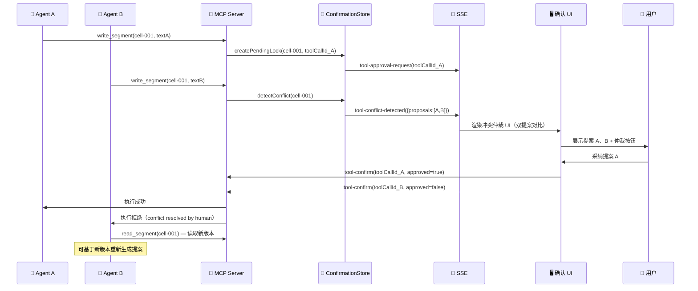

# 多 Agent 冲突解决策略

Status: Draft  
Updated: 2026-05-23  
Scope: Design only — 参考 `docs/design/lifecycle/ISSUE-生命周期分析.md` §4.2

---

## 目录

1. [冲突场景定义](#1-冲突场景定义)
2. [冲突检测机制](#2-冲突检测机制)
3. [冲突信号传递](#3-冲突信号传递)
4. [人类仲裁流程](#4-人类仲裁流程)
5. [锁失效与清理](#5-锁失效与清理)
6. [设计类比：ISSUE 生命周期](#6-设计类比-issue-生命周期)
7. [不变量与约束](#7-不变量与约束)

---

## 1. 冲突场景定义

**冲突**：两个或两个以上 Agent 实例同时持有对同一 `cellId` 的写操作请求（即同一片段存在多个 pending write）。

### 1.1 典型场景

| 场景 | 描述 |
|------|------|
| 并发修改 | Agent A 和 Agent B 同时提交 `write_segment(cellId="cell-001", ...)` |
| 修改-删除冲突 | Agent A 提交 `write_segment(cellId="cell-002", ...)`，Agent B 同时提交 `delete_segment(cellId="cell-002")` |
| 连续版本冲突 | Agent A 的修改被 Approve 后，Agent B 基于旧版本生成的修改被激活（过期提案） |

### 1.2 非冲突场景

- 两个 Agent 修改**不同** cellId → 并行处理，无冲突
- 一个 Agent 修改，另一个 Agent 仅读取 → 无冲突
- 同一 Agent 的连续调用（单 Agent 内串行）→ 由 ToolConfirmationStore 排队处理

---

## 2. 冲突检测机制

### 2.1 片段隐式锁

当一个写工具调用进入 `PreToolUse` 拦截、等待人类确认时，该 `cellId` 处于 **隐式锁定状态**（Pending Lock）。

```
Pending Lock 状态：
  cellId → { toolCallId, agentId, requestedAt, operation }
```

当第二个 Agent 的写操作到达 `PreToolUse`，针对**已锁定的 cellId** 时，MCP Server 检测到冲突，不进入正常的确认等待，而是触发冲突解决流程。

### 2.2 过期提案检测

每个片段维护一个 `version` 字段（单调递增计数器）。Agent 在生成写操作时需要声明 `baseVersion`（即读取时的版本号）。

```json
{
  "tool": "write_segment",
  "input": {
    "cellId": "cell-001",
    "text": "修改后的文本",
    "reason": "...",
    "baseVersion": 3
  }
}
```

若 `baseVersion < currentVersion`（片段已被其他操作修改），则认为该提案**过期**，触发冲突解决流程。

---

## 3. 冲突信号传递

### 3.1 SSE 冲突事件

当冲突被检测到，通过 SSE 推送 `tool-conflict-detected` 事件：

```json
{
  "type": "tool-conflict-detected",
  "cellId": "cell-001",
  "conflictType": "CONCURRENT_WRITE",
  "proposals": [
    {
      "toolCallId": "tool-abc-111",
      "agentId": "agent-session-A",
      "operation": "write_segment",
      "proposedText": "今天的天空很蓝，充满了希望。",
      "reason": "建议从客观描述转向情感表达",
      "requestedAt": "2026-05-23T08:30:00Z"
    },
    {
      "toolCallId": "tool-def-222",
      "agentId": "agent-session-B",
      "operation": "write_segment",
      "proposedText": "今天的天空很蓝，像是往事的镜子。",
      "reason": "建议加入回忆意象，与后文呼应",
      "requestedAt": "2026-05-23T08:30:02Z"
    }
  ]
}
```

### 3.2 冲突状态记录

`ToolConfirmationStore` 扩展冲突条目管理：

```
ConflictEntry:
  conflictId:   string           ← 冲突组 ID
  cellId:       string           ← 争用的片段
  proposals:    ToolCallEntry[]  ← 所有待解决提案
  status:       PENDING | RESOLVED | EXPIRED
  resolvedBy:   toolCallId | null
```

---

## 4. 人类仲裁流程

### 4.1 仲裁原则

> **Agent 不能自主解决与其他 Agent 的冲突**  
> 类比 ISSUE 生命周期中的 §4.2 原子检出协议："Agent 不能 Approve 自己的提案"

冲突解决的唯一入口是人类用户。

### 4.2 仲裁 UI

当 `tool-conflict-detected` 事件到达时，`useAgentActions` Hook 将普通确认 UI 升级为**冲突仲裁 UI**：

```
┌───────────────────────────────────────────────────────────┐
│  ⚠️ Agent 冲突：第 1 段有 2 个修改提案                      │
├───────────────────────────────────────────────────────────┤
│  📌 当前内容：                                               │
│    今天的天空很蓝，我想起了那个夏天的午后。                   │
│                                                           │
│  🤖 提案 A（agent-session-A）：                             │
│    今天的天空很蓝，[充满了希望]。                             │
│    理由：建议从客观描述转向情感表达                          │
│                                                           │
│  🤖 提案 B（agent-session-B）：                             │
│    今天的天空很蓝，[像是往事的镜子]。                         │
│    理由：建议加入回忆意象，与后文呼应                         │
├───────────────────────────────────────────────────────────┤
│  [✅ 采纳提案 A]   [✅ 采纳提案 B]   [❌ 全部拒绝]            │
└───────────────────────────────────────────────────────────┘
```

### 4.3 仲裁决策执行

| 用户选择 | 执行动作 |
|---------|---------|
| 采纳提案 A | `tool-confirm(toolCallId_A, approved=true)`；`tool-confirm(toolCallId_B, approved=false)` |
| 采纳提案 B | `tool-confirm(toolCallId_B, approved=true)`；`tool-confirm(toolCallId_A, approved=false)` |
| 全部拒绝 | `tool-confirm(toolCallId_A, approved=false)`；`tool-confirm(toolCallId_B, approved=false)` |

被拒绝的 Agent 收到 rejection 结果后，可重新读取最新版本并生成新提案（新提案同样需要人类确认）。

### 4.4 仲裁流程时序



---

## 5. 锁失效与清理

### 5.1 超时清理

隐式片段锁在以下情况自动清理：

| 触发条件 | 超时/触发 | 处理 |
|---------|---------|------|
| 正常确认超时 | 5 分钟（ToolConfirmationStore 现有机制） | 锁释放，Agent 收到 timeout 错误 |
| Agent 会话断开 | 检测 WebSocket/SSE 断开 | 立即释放该 Agent 持有的所有锁 |
| 用户关闭浏览器标签 | 会话结束事件 | 清理所有 pending 操作 |

### 5.2 锁孤立检测

类比 ISSUE 生命周期中的"孤立 CheckoutRun 接管"（§4.2），若锁持有者（Agent）无响应超过 timeout，锁释放但**不自动执行**操作：
- 不执行提案（没有人类 Approve，不能自动执行）
- 清理 pending UI
- 保留 Agent 操作历史记录（状态：EXPIRED）

---

## 6. 设计类比：ISSUE 生命周期

参考 `docs/design/lifecycle/ISSUE-生命周期分析.md` §4.2 原子检出协议：

| ISSUE 生命周期中的概念 | Edit-Point 中的对应概念 |
|----------------------|----------------------|
| `checkoutRunId` — Agent 独占锁 | `cellId` 隐式片段锁 |
| Board（人类）是唯一 Approve 权 | 用户是唯一的冲突仲裁者 |
| Agent 不能 Approve 自己的 PR | Agent 不能解决与其他 Agent 的冲突 |
| `409 Checkout Conflict` 显式暴露 | `tool-conflict-detected` 事件显式暴露 |
| 孤立 checkoutRun 的接管机制 | 超时锁释放（不自动执行） |
| Agent 的 PR 在冲突时需人工合并 | Agent 的 proposals 在冲突时由人工仲裁 |

**核心原则一致：冲突从不静默解决，不允许任何形式的"后写者胜"或"Agent 自决"。**

---

## 7. 不变量与约束

> ⚠️ **不可违反的设计约束**

1. **冲突不静默处理**：片段冲突必须通过 SSE 通知到 UI，不允许 MCP Server 或 ConfirmationStore 自行选择胜者（如先到先得）。

2. **Agent 无法感知"对方 Agent 存在"**：每个 Agent 从自身角度只看到自己的提案被 Reject（附有 `conflict resolved by human` 说明），不需要知道其他 Agent 的内容。这保持了 Agent 的操作独立性。

3. **冲突解决结果不可逆**：仲裁决定（采纳 A / 采纳 B / 全部拒绝）执行后，不提供撤销能力。后续可通过 `write_segment` 新提案来修正。

4. **版本号防过期提案重放**：`baseVersion` 机制确保已被修改的片段不会被基于旧版本的提案覆盖，即使该提案在之前某个时刻被 Approve 了（实际上不可能 Approve，但版本号提供双重保险）。
