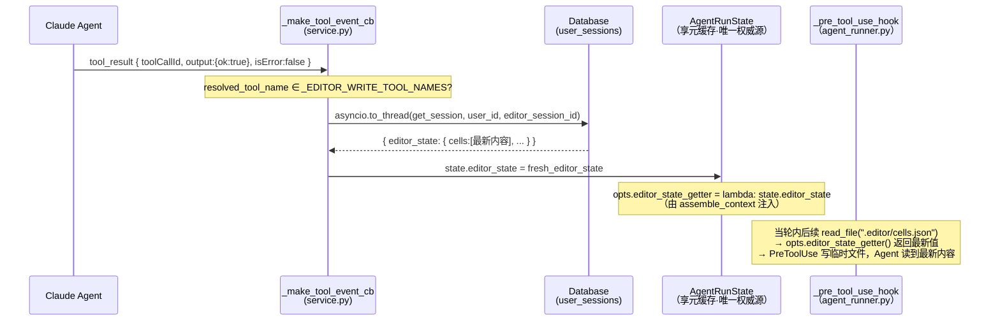
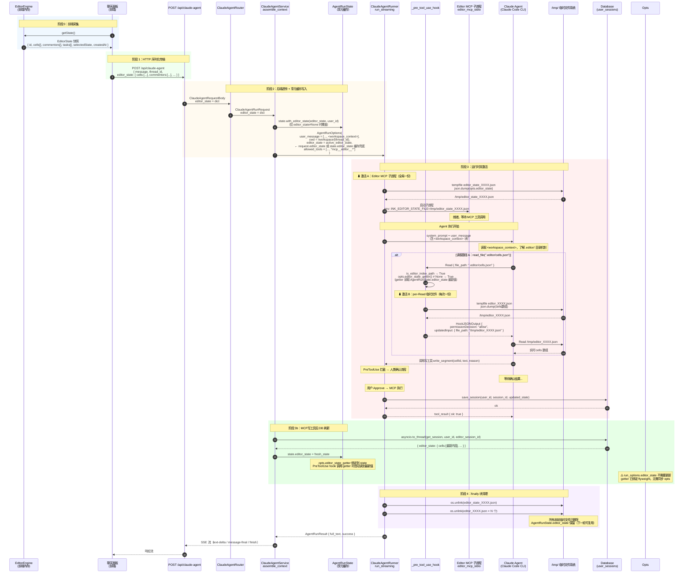

> [Input] `backend/routers/claude_agent.py` (ClaudeAgentRequestBody),
>         `backend/claude_agent/service.py` (ClaudeAgentRunRequest, assemble_context),
>         `backend/libs/claude_agent_kit/types.py` (AgentRunOptions),
>         `backend/libs/claude_agent_kit/server/agent_runner.py` (run_streaming, _pre_tool_use_hook),
>         `backend/libs/claude_agent_kit/server/editor_index.py` (get_editor_resource_data),
>         `backend/libs/claude_agent_kit/server/editor_tool.py` (handle_editor_read_tool),
>         `backend/claude_agent/thread_pool.py` (AgentRunState, editor_state, editor_user_id),
>         `docs/design/claude-agent/edit-point/workspace-adapter.md`,
>         `docs/design/claude-agent/edit-point/workspace-context.md`
> [Output] 定义 `editor_state` 快照从前端采集到运行时激活、MCP写工具后DB刷新再到清理的完整生命周期，
>          包括数据结构、六个阶段说明、业务时序图、AgentRunState软缓存决策、None 语义与双路径读取对比。
> [Pos] lifecycle-design-doc in `docs/design/claude-agent/edit-point`
> [Sync] 2026-05-29: initial design — editor_state snapshot lifecycle.
> [Sync] 2026-05-29: editor_state 迁移至 AgentRunState 软缓存；新增阶段 3b（MCP写工具后DB刷新），
>                    更新 §5 不持久化决策表（AgentRunState 改为软缓存 ✅），更新 §4 时序图。

# `editor_state` 快照生命周期设计

Status: Updated  
Updated: 2026-05-29  
Scope: Design + 实现对应代码

---

## 目录

1. [概述](#1-概述)
2. [数据结构定义](#2-数据结构定义)
3. [生命周期六阶段](#3-生命周期六阶段)
   - 3.1 [阶段 0：前端采集](#31-阶段-0前端采集)
   - 3.2 [阶段 1：HTTP 序列化传输](#32-阶段-1http-序列化传输)
   - 3.3 [阶段 2：后端接收与透传](#33-阶段-2后端接收与透传)
   - 3.4 [阶段 3：运行时双激活](#34-阶段-3运行时双激活)
   - 3.5 [阶段 3b：MCP 写工具后 DB 刷新](#35-阶段-3bmcp-写工具后-db-刷新)
   - 3.6 [阶段 4：临时文件清理](#36-阶段-4临时文件清理)
4. [完整业务时序图](#4-完整业务时序图)
5. [AgentRunState 软缓存设计](#5-agentrunstate-软缓存设计)
6. [`None` 语义](#6-none-语义)
7. [双路径读取对比](#7-双路径读取对比)
8. [与双层上下文架构的关系](#8-与双层上下文架构的关系)
9. [故障处理汇总](#9-故障处理汇总)

---

## 1. 概述

`editor_state` 快照是 Ink & Memory 文档编辑场景中 Agent 感知文档内容的**唯一数据源**。

- **来源**：前端 `EditorEngine` 维护的内存状态，用户发起 Agent 请求时按需采集
- **传递方式**：随 HTTP 请求体一次性发送，后端存入 `AgentRunState` 享元缓存（软缓存）
- **使用方**：`agent_runner.py` 中的两个机制——PreToolUse 虚拟索引重定向 和 Editor MCP 子进程
- **刷新时机**：① 每轮请求前端提供新快照时覆盖；② MCP 写工具成功执行后从 DB 重载
- **生命周期**：软缓存存活于 `AgentRunState`（TTL 600 s），运行时临时文件在 `run_streaming` finally 块清理

```
EditorEngine(内存) → 前端序列化(JSON)
  → HTTP body
    → AgentRunState.editor_state（软缓存，跨轮复用）
      → AgentRunOptions.editor_state（每轮注入）
        → ① PreToolUse 临时文件重定向（per-Read）
        → ② Editor MCP 子进程状态文件（per-run）
          → finally 块清理临时文件

MCP 写工具成功执行后:
  → DB 写入
    → service.py tool_result 回调从 DB 重载
      → 更新 AgentRunState.editor_state（下一轮生效）
      → 更新 run_options.editor_state（当前轮 PreToolUse 立即生效）
```

---

## 2. 数据结构定义

### 2.1 TypeScript 侧（前端 EditorEngine）

```typescript
interface EditorState {
  // 会话元数据
  id: string;              // 文档/会话 UUID（与后端 session_id 对应）
  selectedState: string;   // 当前情感状态选择（如 "平静"、"忧郁"）
  createdAt: string;       // ISO 8601 时间戳

  // 文档内容
  cells: Array<TextCell | WidgetCell>;

  // 声音评注
  commentors: Array<Commentor>;

  // 分析任务（可能为空数组）
  tasks: Array<Task>;
}

interface TextCell {
  id: string;
  type: "text";
  content: string;          // 完整文本内容
}

interface WidgetCell {
  id: string;
  type: "widget";
  widgetType: string;       // 如 "chat"
  data: Record<string, any>;
}

interface Commentor {
  id: string;
  phrase: string;           // 锚定短语
  voiceId: string;          // 声音评论者 ID
  appliedAt: string;        // 应用时间戳
  feedback: "pending" | "starred" | "killed";
  // ... 其他评论字段
}
```

### 2.2 Python 侧（后端）

后端以 `dict[str, Any]` 接收和传递，不做 Schema 验证。关键字段提取规则定义在 `editor_index.py` 的 `EDITOR_RESOURCES` 和 `get_editor_resource_data`：

| 虚拟资源路径 | 提取键 | 返回内容 |
|-------------|--------|---------|
| `.editor/cells.json` | `"cells"` | `{"cells": editor_state["cells"]}` |
| `.editor/commentors.json` | `"commentors"` | `{"commentors": editor_state["commentors"]}` |
| `.editor/tasks.json` | `"tasks"` | `{"tasks": editor_state["tasks"]}` |
| `.editor/session.json` | `"__session__"` | `{"id", "selectedState", "createdAt"}` |
| `.editor/full_state.json` | `"__full__"` | 整个 `editor_state` dict |

---

## 3. 生命周期六阶段

### 3.1 阶段 0：前端采集

**触发时机**：用户在文档编辑器界面点击发送，聊天面板向 API 发起请求前。

```
用户点击发送
  ↓
聊天面板调用 EditorEngine.getState()
  ↓
EditorEngine 返回当前内存状态的 JSON 拷贝（浅克隆或深克隆）
  ↓
快照随请求体序列化发出
```

**关键约束**：
- 快照代表**发送时刻**的文档状态，Agent 执行期间文档继续变化不影响本轮快照
- 前端负责决策是否附带 `editor_state`：文档编辑场景附带，纯对话场景可省略（`null`）

---

### 3.2 阶段 1：HTTP 序列化传输

**入口**：`POST /api/claude-agent`  
**承载字段**：`ClaudeAgentRequestBody.editor_state: Optional[dict]`

```python
class ClaudeAgentRequestBody(BaseModel):
    thread_id: Optional[str]
    message: Any
    editor_state: Optional[dict] = None   # ← 快照在此进入后端
    # ... 其他字段
```

FastAPI 通过 Pydantic 自动将请求体中的 JSON 对象反序列化为 Python `dict`，不做任何内容验证。

---

### 3.3 阶段 2：后端接收与透传

`editor_state` 在后端经历**三次透传 + 一次缓存写入**：

```
ClaudeAgentRequestBody.editor_state          ← HTTP body (Pydantic dict)
  │
  ▼
ClaudeAgentRunRequest.editor_state           ← 路由层构建（claude_agent.py）
  │
  ▼ state.with_editor_state(editor_state, user_id)
AgentRunState.editor_state                   ← ★ 享元缓存（软缓存）
  │                                               仅当 editor_state 不为 None 时覆盖
  ▼ active_editor_state = request or cache
AgentRunOptions.editor_state                 ← 上下文装配（service.py assemble_context）
  │
  ▼
ClaudeAgentRunner.run_streaming(opts, ...)   ← 运行时使用
```

**`assemble_context` 中的装配逻辑（`service.py`）：**

```python
# 更新享元缓存（None 不覆盖，纯对话轮次不丢失已有文档上下文）
state.with_editor_state(request.editor_state, int(request.user_id))

# 解析活跃 editor_state：前端快照优先，降级使用缓存
active_editor_state = request.editor_state if request.editor_state is not None else state.editor_state

run_options = AgentRunOptions(
    ...
    editor_state=active_editor_state,   # ← 注入活跃 editor_state
)
```

---

### 3.4 阶段 3：运行时双激活

`run_streaming` 方法在构建 SDK 选项时，基于 `opts.editor_state is not None` 触发两个独立机制：

#### 激活 A：Editor MCP 子进程（per-run，全局一份）

**条件**：`opts.editor_state is not None AND "mcp__editor__*" in effective_allowed_tools`

```
run_streaming 入口
  ↓
tempfile.NamedTemporaryFile(prefix="editor_state_", suffix=".json")
  → json.dump(opts.editor_state, tmp_file)
  → tmp_path = /tmp/editor_state_XXXX.json
  ↓
McpStdioServerConfig(
    command=sys.executable,
    args=["-m", "libs.claude_agent_kit.server.editor_mcp_stdio"],
    env={"INK_EDITOR_STATE_FILE": tmp_path}
)
  ↓
Claude Code CLI 子进程启动 editor_mcp_stdio 进程
  ↓
Agent 可调用：mcp__editor__list_segments / read_segment /
              read_session_meta / list_comments / read_comment
```

Editor MCP 子进程在**整个 Agent 执行期间**持续运行，共享同一份状态文件（静态快照，不随 Agent 执行中的文档变化而更新）。

#### 激活 B：PreToolUse 虚拟索引重定向（per-Read，每次读取一份）

**条件**：`tool_name == "Read" AND opts.editor_state is not None AND is_editor_index_path(path)`

```
Agent 调用 read_file(".editor/cells.json")
  ↓
_pre_tool_use_hook 检测条件满足
  ↓
get_editor_resource_data(".editor/cells.json", editor_state)
  → 提取 editor_state["cells"]
  ↓
tempfile.NamedTemporaryFile(prefix="editor_", suffix=".json")
  → json.dump(resource_data, tmp_file)
  → tmp_path = /tmp/editor_XXXX.json
  → 追加到 _editor_redirect_tmp_paths
  ↓
{"hookSpecificOutput": {
    "hookEventName": "PreToolUse",
    "permissionDecision": "allow",
    "updatedInput": {"file_path": tmp_path}
}}
  ↓
Claude Code CLI 使用重定向路径执行 Read
Agent 读到实时 cells 数组
```

每次 Agent 调用 `read_file(".editor/xxx")` 都创建一个**一次性临时文件**，执行完毕后在 `finally` 块清理。

---

### 3.5 阶段 3b：MCP 写工具后 DB 刷新

**触发时机**：MCP 写工具（`write_segment` / `delete_segment` / `insert_widget` / `reply_to_comment`）被用户 Approve 后，Agent 收到 `tool_result` 事件（非 error）。

```
Agent 收到 tool_result（写工具成功）
  ↓
_make_tool_event_cb（service.py）检测 tool_name ∈ _EDITOR_WRITE_TOOL_NAMES
  ↓
await asyncio.to_thread(database.get_session, user_id, editor_session_id)
  ↓
fresh_row["editor_state"] → 更新单一源：
  └─ state.editor_state = fresh_editor_state   ← AgentRunState 享元（唯一权威源）
     opts.editor_state_getter 绑定到 state → PreToolUse hook 调用 getter 时自动读到最新值
```

**刷新时序：**



**失败处理**：DB 查询异常时记录 warning 并跳过刷新（不阻断 Agent 执行）。`state.editor_state` 保留写工具执行前的快照，下一轮请求会由前端提供新快照覆盖。

---

### 3.6 阶段 4：临时文件清理

`run_streaming` 的 `finally` 块负责清理本次运行创建的所有临时文件：

```python
finally:
    # 清理 Editor MCP 状态文件（全局一份）
    if _editor_state_file_path:
        os.unlink(_editor_state_file_path)      # /tmp/editor_state_XXXX.json

    # 清理 PreToolUse 重定向临时文件（每次 Read 一份）
    for _rpath in _editor_redirect_tmp_paths:
        os.unlink(_rpath)                        # /tmp/editor_XXXX.json × N
```

清理发生在：
- Agent 正常结束（`end_turn`）
- Agent 执行出错（`except BaseException`）
- FastAPI worker 取消（`CancelledError` 触发 `finally`）

`editor_state` dict 本身随 `AgentRunOptions` 对象被 Python GC 回收，无需显式清理。

---

## 4. 完整业务时序图



---

## 5. AgentRunState 软缓存设计

### 5.1 存储位置总览

| 存储位置 | `editor_state` 是否写入 | 说明 |
|---------|------------------------|------|
| SQLite `chat_thread` | ❌ | 只存线程元信息 |
| SQLite `chat_message` | ❌ | 只存 `parts` 和 `metadata`（model/usage/toolCount） |
| `AgentRunState`（内存会话缓存） | ✅ **软缓存** | 缓存 `editor_state` 和 `editor_user_id`；TTL 600 s；前端快照优先覆盖，写工具后从 DB 更新 |
| `/tmp/editor_state_*.json` | ✅ 临时 | 仅限本次 run_streaming，finally 清理 |
| `/tmp/editor_*.json` | ✅ 临时 | 仅限本次 Read 调用，finally 清理 |

### 5.2 为何改为软缓存（vs 原始无缓存设计）

原始设计（`editor-state-lifecycle.md §5.3`，2026-05-29 前）将 `editor_state` 设计为每轮无状态注入，不在 `AgentRunState` 缓存。改为软缓存的原因：

| 原因 | 说明 |
|------|------|
| **写工具后同轮读取一致性** | MCP 写工具（write_segment 等）修改 DB 后，Agent 在同一轮继续调用 `read_file(".editor/cells.json")` 应看到最新内容。无缓存时 `run_options.editor_state` 是静态快照，无法更新 |
| **跨轮连续性（纯对话轮次）** | 用户发送纯对话消息（不带 `editor_state`）时，Agent 仍需知道文档内容（上下文连续性）。软缓存提供兜底，避免 `run_options.editor_state = None` 导致 `.editor/` 读取退化为占位符 `{}` |
| **减少前端负担** | 写工具执行后 DB 即为权威源，无需强制前端在下一轮重发快照才能保证数据新鲜度 |

### 5.3 软缓存语义规则

```
assemble_context() 每轮执行:
  ├─ request.editor_state ≠ None → state.editor_state = request.editor_state（前端快照优先）
  ├─ request.editor_state = None  → state.editor_state 保持缓存值（纯对话轮次不清空）
  └─ active_editor_state = request.editor_state ?? state.editor_state

tool_result 回调（写工具成功）:
  ├─ state.editor_state = DB 最新快照（下一轮可用）
  └─ run_options.editor_state = DB 最新快照（当轮 PreToolUse 立即生效）
```

> **⚠️ 注意**：Editor MCP 子进程的状态文件（`/tmp/editor_state_XXXX.json`）在 `run_streaming` 启动时写入一次，写工具后不会重写该文件。因此同轮内通过 `mcp__editor__list_segments` 等 MCP 读工具仍会看到写前快照。PreToolUse 路径（`read_file(".editor/cells.json")`）因为直接读 `run_options.editor_state` 内存，所以可以看到刷新后的数据。

### 5.4 `editor_state` 从不持久化到 SQLite

`editor_state` 内容（cells、commentors 等）始终不持久化到 `chat_thread` 或 `chat_message`——文档本身持久化在 `user_sessions.editor_state_json`（由前端写入），Agent 读取的只是快照。

---

## 6. `None` 语义

`AgentRunOptions.editor_state = None` 表示本轮 Agent 运行**没有文档编辑上下文**，此时：

| 机制 | `editor_state = None` 时的行为 |
|------|-------------------------------|
| PreToolUse 虚拟索引重定向 | 条件不满足，跳过拦截；Agent 调用 `read_file(".editor/xxx")` 时读到占位符 `{}` |
| Editor MCP 子进程 | 条件不满足，子进程不启动；`mcp__editor__*` 工具不可用（SDK 找不到该 MCP server） |
| `<workspace_context>` 块 | **不受影响**——该块只依赖 `cwd`，无论 `editor_state` 是否为 None 均正常注入 |

**何时为 `None`**：
- 纯对话轮次（前端聊天场景，不打开文档编辑器）
- 前端主动省略 `editor_state` 字段（请求体中不包含该字段时，Pydantic 默认为 `None`）

---

## 7. 双路径读取对比

Agent 有两条等价路径读取文档内容，均基于同一份 `editor_state` 快照：

| 维度 | 路径 A：`read_file(".editor/cells.json")` | 路径 B：`mcp__editor__list_segments` |
|------|------------------------------------------|--------------------------------------|
| **协议** | Claude 原生 `Read` 工具 + PreToolUse 重定向 | MCP stdio 协议 |
| **数据源** | `opts.editor_state`（内存，由 hook 写入临时文件）| `INK_EDITOR_STATE_FILE`（磁盘临时文件）|
| **粒度** | 完整资源切片（如整个 `cells` 数组） | 结构化摘要（`list_segments` 仅返回 preview + length） |
| **临时文件** | 每次 Read 一份（per-Read） | 全局一份（per-run） |
| **适用场景** | Agent 需要完整原始数据（如全文分析） | Agent 需要快速浏览文档结构后再定向读取 |
| **`editor_state=None` 降级** | 返回占位符 `{}` | MCP 工具不存在，调用报错 |

**推荐策略**：`<workspace_context>` 块描述两条路径均可用。对于"先浏览结构再精读"的任务模式，Agent 通常先调用 `mcp__editor__list_segments` 获取 `cellId` 列表，再用 `mcp__editor__read_segment(cellId)` 读取具体内容，效率高于直接读取完整 `cells.json`。

---

## 8. 与双层上下文架构的关系

Edit-point 上下文由两个互补但独立的层组成：

```
┌─────────────────────────────────────────────────────────────────────────────┐
│  Prompt 层（静态导航地图）                                                    │
│  <workspace_context> 块                                                      │
│  • 仅依赖 cwd                                                                │
│  • 描述 .editor/ 目录机制和读写规则                                           │
│  • 幂等：editor_state=None 时依然注入，内容不变                               │
│  → 详见 workspace-context.md                                                 │
└─────────────────────────────────────────────────────────────────────────────┘

┌─────────────────────────────────────────────────────────────────────────────┐
│  运行时层（实时数据注入）← 本文档描述                                          │
│  editor_state 快照                                                           │
│  • 依赖前端采集的 EditorState JSON                                           │
│  • 驱动 PreToolUse 重定向 + Editor MCP 子进程                                │
│  • 每轮请求新鲜注入，不缓存，不持久化                                          │
│  → 详见本文档                                                                │
└─────────────────────────────────────────────────────────────────────────────┘
```

两层协同保证：
- 无 `<workspace_context>` 块：Agent 不知道 `.editor/` 目录存在，不会主动读取
- 无 `editor_state`：Agent 知道 `.editor/` 存在但读到空占位符 `{}`
- **两者同时存在**：Agent 获得完整的工作空间感知能力，可读取实时文档数据

---

## 9. 故障处理汇总

| 故障场景 | 处理策略 |
|---------|---------|
| `editor_state = None`（前端未传，缓存也为空） | 两个运行时机制均不激活；`.editor/` 读取返回占位符 `{}`；`<workspace_context>` 块不受影响 |
| `editor_state = None`（前端未传，但缓存有值） | 使用缓存值激活运行时机制（软缓存兜底），保证上下文连续性 |
| `editor_state` 格式非 dict（前端 Bug） | Pydantic 解析失败，HTTP 422 错误，请求被拒绝 |
| 写入 MCP 状态临时文件失败（磁盘满等） | `except Exception` 捕获，记录 warning，跳过 Editor MCP；Agent 仍可通过路径 A（PreToolUse）读取 |
| 写入 PreToolUse 重定向临时文件失败 | `except Exception` fall-through，记录 warning；Agent 读到占位符 `{}` |
| `get_editor_resource_data` 异常（如字段缺失） | 同上 fall-through；返回 `{}` |
| Agent 执行被取消（`CancelledError`） | `finally` 块仍执行，临时文件正常清理；`AgentRunState.editor_state` 保留写工具执行前值 |
| Editor MCP 子进程崩溃 | Claude Code CLI 报告工具不可用；Agent 可降级使用路径 A（`read_file`）|
| **写工具后 DB 刷新失败**（网络/DB 错误） | `logger.warning` 记录，跳过刷新；`run_options.editor_state` 保留写前快照；下一轮前端提供新快照覆盖 |
