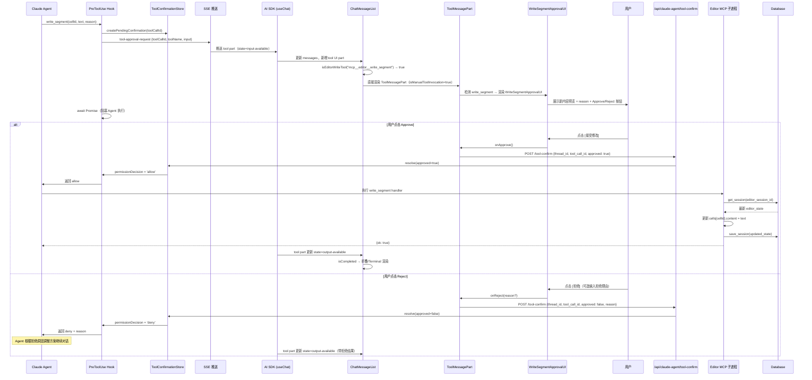
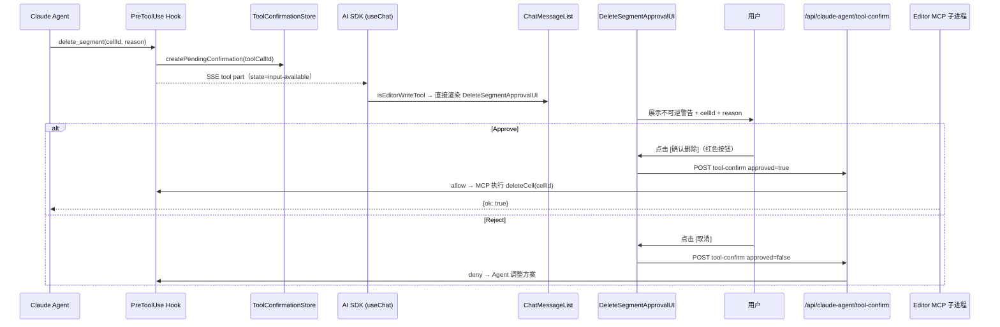
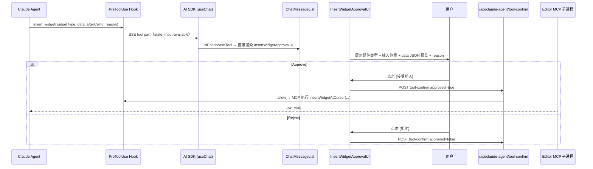
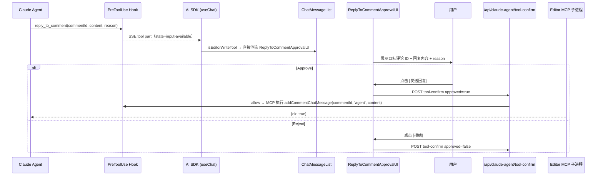
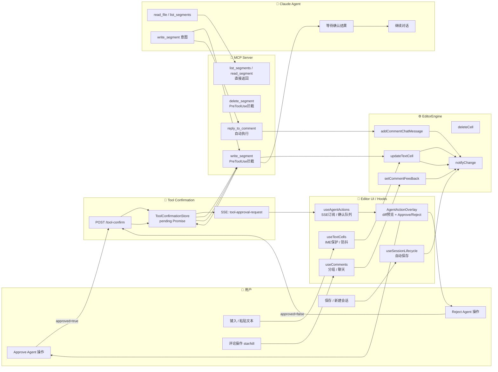

# UI 人机协作设计 — Agent 操作可视化与确认流

Status: Updated  
Updated: 2026-06-28
Scope: Design + 实现对应前端组件

> [Sync] 2026-06-28: 补充 Notion connector proposal 确认卡边界；Notion 写入必须携带 canonical snapshot identity 并等待事件驱动刷新。

---

## 目录

1. [设计背景](#1-设计背景)
2. [Hooks 层双重职责](#2-hooks-层双重职责)
3. [Agent 操作可视化](#3-agent-操作可视化)
4. [确认流程设计](#4-确认流程设计)
5. [UI 组件设计](#5-ui-组件设计)
6. [前端路由 — 工具检测与组件派发](#6-前端路由--工具检测与组件派发)
7. [各工具确认 UI 详细规格](#7-各工具确认-ui-详细规格)
8. [业务时序图](#8-业务时序图)
9. [对象泳道图](#9-对象泳道图)
10. [不变量与约束](#10-不变量与约束)
11. [Notion Connector Proposal 确认卡](#11-notion-connector-proposal-确认卡)

---

## 1. 设计背景

Editor UI / Hooks 层的当前职责是**人类操作的适配层**：接收键盘/鼠标输入，做 IME 保护、防抖、事件去重，然后调用 EditorEngine 方法。

在引入 Claude Agent 协作后，该层需要承担第二重职责：**Agent 操作的可视化与确认面**。两个职责使用同一套 UI 渲染，但触发路径不同：

| 操作来源 | 触发路径 | UI 响应 |
|---------|---------|--------|
| 人类 | 键盘/鼠标 → Hooks → Engine | 实时渲染（无等待） |
| Agent | MCP 工具调用 → PreToolUse → SSE → UI | 展示预览 + 等待确认后执行 |

---

## 2. Hooks 层双重职责

### 2.1 现有职责（人类路径，不变）

| Hook | 职责 |
|------|------|
| `useTextCells` | 本地文本同步、IME 组合保护、粘贴处理 |
| `useComments` | 评论分组/分页、星标/杀死、评论聊天 |
| `useSessionLifecycle` | 会话初始化、加载、自动保存（3s 防抖）、新一天检测 |
| `useVoiceInput` | 语音输入适配 |
| `useInspiration` | 写作灵感提示 |

### 2.2 新增职责（Agent 协作路径）

| Hook / 组件 | 职责 |
|-------------|------|
| `useAgentActions`（新增） | 订阅 SSE `tool-approval-request` 事件；维护 Agent 待确认操作队列；提交 Approve/Reject |
| `AgentActionOverlay`（新增组件） | 渲染 Agent 待确认操作的预览 UI |
| `AgentOperationHistory`（新增组件） | 渲染 Agent 已执行操作的历史记录（可折叠，侧边栏） |

---

## 3. Agent 操作可视化

### 3.1 待确认操作（Pending）

当 Agent 发起写操作时，UI 需要展示"Agent 想做什么"，让用户可以作出知情决策。

**展示信息：**

| 信息项 | 说明 |
|--------|------|
| 操作类型 | `写入片段` / `删除片段` / `插入组件` / `设置评论反馈` |
| 目标片段 | 高亮目标片段在文档中的位置，视觉锚定 |
| 操作内容预览 | 对于 `write_segment`：显示 diff（原文 vs 拟修改文本）；对于 `delete_segment`：显示将被删除的内容 |
| Agent 理由 | Agent 调用工具时传入的 `reason` 字段 |
| 确认按钮 | 接受 / 拒绝（可附拒绝理由） |

### 3.2 已执行操作（Applied）

Agent 操作被 Approve 后，在文档中提供视觉反馈：
- 被修改的片段短暂高亮（1.5s 渐隐动画，区别于人类编辑的视觉效果）
- 操作历史面板（侧边栏）记录此次操作（来源: Agent, 时间, 操作类型, 片段摘要）

### 3.3 被拒绝操作（Rejected）

- Agent 操作被 Reject 后，UI 恢复到确认前状态
- 不在文档中留下任何痕迹
- 操作历史面板可选择性记录拒绝事件（用于复盘）

---

## 4. 确认流程设计

### 4.1 SSE 事件结构

现有 `tool-approval-request` 事件（见 [`../claude-agent-tool-confirmation-flow.md`](../claude-agent-tool-confirmation-flow.md)）扩展 `editContext` 字段：

```json
{
  "type": "tool-approval-request",
  "toolCallId": "tool-abc-123",
  "toolName": "write_segment",
  "input": {
    "cellId": "cell-001",
    "text": "今天的天空很蓝，我想起了那个难忘的夏天。",
    "reason": "将'夏天的午后'改为'难忘的夏天'，使情感表达更直接"
  },
  "editContext": {
    "targetSegment": {
      "id": "cell-001",
      "currentText": "今天的天空很蓝，我想起了那个夏天的午后。",
      "position": 0
    },
    "operationType": "WRITE_SEGMENT",
    "diff": {
      "before": "那个夏天的午后",
      "after": "那个难忘的夏天"
    }
  }
}
```

### 4.2 确认 UI 触发条件

`useAgentActions` Hook 监听 SSE 消息流，收到 `tool-approval-request` 时：
1. 将操作加入本地 `pendingActions` 队列
2. 在文档中高亮目标片段（黄色边框提示，区别于正常高亮）
3. 触发 `AgentActionOverlay` 渲染

### 4.3 用户决策处理

```
用户点击 接受
  → useAgentActions.approve(toolCallId)
  → POST /api/claude-agent/tool-confirm { toolCallId, approved: true }
  → 从 pendingActions 队列移除
  → Engine 执行写操作（由 Agent 侧 hook 返回 allow 后触发）
  → 片段高亮变为"已执行"动画

用户点击 拒绝
  → useAgentActions.reject(toolCallId, reason?)
  → POST /api/claude-agent/tool-confirm { toolCallId, approved: false, reason }
  → 从 pendingActions 队列移除
  → 清除片段的 pending 高亮
  → 操作历史记录拒绝事件
```

### 4.4 超时处理

ToolConfirmationStore 有 5 分钟确认超时（现有机制）。超时后：
- Agent 收到 timeout 错误
- UI 自动清除 `pendingActions` 中的对应项
- 片段 pending 高亮消除

---

## 5. UI 组件设计

### 5.1 组件注册表

以下组件均位于 `frontend/src/components/chat/EditorWriteApprovalUI.tsx`：

| 组件名 | 对应工具 | 核心 Props | 职责 |
|--------|---------|-----------|------|
| `WriteSegmentApprovalUI` | `mcp__editor__write_segment` | `input.cellId`, `input.text`, `input.reason` | 展示新文本内容预览与操作理由，提供 Approve/Reject |
| `DeleteSegmentApprovalUI` | `mcp__editor__delete_segment` | `input.cellId`, `input.reason` | 展示将被删除的片段 ID、不可逆警告与操作理由 |
| `InsertWidgetApprovalUI` | `mcp__editor__insert_widget` | `input.widgetType`, `input.data`, `input.afterCellId`, `input.reason` | 展示组件类型、插入位置与操作理由 |
| `ReplyToCommentApprovalUI` | `mcp__editor__reply_to_comment` | `input.commentId`, `input.content`, `input.reason` | 展示目标评论 ID、回复内容与操作理由 |
| `EditorWriteApprovalUI`（路由器） | 以上全部 | `toolName`, `input`, `toolCallId`, `threadId`, `isProcessing`, `onApprove`, `onReject` | 根据 `toolName` 派发到对应专用组件 |
| `EditorWriteCompletedCard` | 以上全部（已完成态） | `toolName`, `input`, `output` | 工具执行完成后的结果摘要卡片；包含「跳转到笔记」导航按钮 |

**公共 Props 接口（所有专用组件共享）：**

```typescript
interface EditorWriteApprovalProps {
  toolCallId: string;
  threadId: string;
  isProcessing: boolean;
  onApprove: () => void;
  onReject: (reason?: string) => void;
}
```

### 5.1.1 `EditorWriteCompletedCard` — 完成态结果卡片

**触发条件：** 工具 part 状态为 `output-available` 且 `isEditorWriteTool(toolName)` 为真。

**取代行为：** 替代 `ChatMessageList` 中默认的 `‹ Terminal` 暗色卡片渲染路径。

**UI 布局：**

```
┌────────────────────────────────────────────────────┐
│ 已写入内容   [成功]                                  │
│ mcp__editor__write_segment                          │
├────────────────────────────────────────────────────┤
│ 片段 ID: {cellId}                                   │
│                                                    │
│ 执行理由: {reason（截断到 2 行）}                   │
├────────────────────────────────────────────────────┤
│                    [跳转到笔记]                    │
└────────────────────────────────────────────────────┘
```

**工具操作类型标签映射：** Chat 对话消息面保持纯文字完成态，不在 `EditorWriteCompletedCard` 或编辑器写入确认卡片中使用装饰性图标。

| MCP 工具名 | 完成标签 |
|-----------|---------|
| `mcp__editor__write_segment` | 已写入内容 |
| `mcp__editor__delete_segment` | 已删除片段 |
| `mcp__editor__insert_widget` | 已插入组件 |
| `mcp__editor__reply_to_comment` | 已回复评论 |

**「跳转到笔记」交互流：**

```
用户点击 [跳转到笔记]
  → window.dispatchEvent(new CustomEvent('editor:jump-to-cell', { detail: { cellId } }))
  → App.tsx 监听到事件
  → setCurrentView('writing')
  → jumpToCellRef.current = cellId
  → currentView 变为 'writing' 后 useEffect 触发
  → textareaRefs.current.get(cellId)?.scrollIntoView({ behavior: 'smooth', block: 'center' })
  → 对应 textarea 获得焦点
```

**cellId 来源优先级：** `output.cellId` → `input.cellId` → `input.commentId`（reply 工具）→ 无（隐藏按钮）

### 5.1.2 历史回放渲染问题与修复

#### 问题现象

会话历史重新加载时（`fetchThreadMessages` + `setMessages(initialMessages)`），已完成的 editor write 工具（`state = "output-available"`）依然渲染为 `‹ Terminal` 暗色卡片，而非预期的 `EditorWriteCompletedCard`。

#### 根因分析

原始检测逻辑将 `isEditorWriteTool(getToolName(toolPart))` 嵌套在 `isCompleted && outputText` 条件内：

```
if (isCompleted && outputText) {
  if (isEditorWriteTool(getToolName(toolPart))) → EditorWriteCompletedCard
  else → Terminal  ← 历史回放走此分支
}
```

历史回放时 `DynamicToolUIPart` 从数据库反序列化，可能出现：

| 情形 | 结果 |
|------|------|
| `toolName` 字段未持久化 | `getToolName()` 对 `type: "tool-invocation"` 的 part 返回 `"invocation"` |
| 后端 API 序列化变换了 type | `getToolName()` 返回非预期值 |
| 以上任一情形 | `isEditorWriteTool("invocation")` = false → 回退到 Terminal |

实时流式传输时 AI SDK 内部 DynamicToolUIPart 保持完整的 `toolName` 字段，故 `getToolName()` 正常返回工具名。历史加载路径的结构差异导致静默失效。

#### 修复方案

1. **健壮化工具名解析**：提取 `resolveToolName()` 辅助函数，优先使用 `getToolName()`，失败时直接读 `part.toolName` 字段作为兜底。

2. **独立检测分支**：将 editor write 工具的完成态检测提升为独立条件，**优先级高于** Terminal 渲染分支，且不依赖 `outputText` 是否存在：

```
// 修复后的检测顺序（ChatMessageList.tsx）
if (isCompleted && isEditorWriteTool(resolveToolName(toolPart)))
  → EditorWriteCompletedCard（无论 outputText 是否非空）

if (isCompleted && outputText)
  → Terminal（仅非 editor write 工具走此路径）
```

3. **兼容性**：`resolveToolName()` 兜底逻辑确保历史加载的 DynamicToolUIPart 和实时流式 DynamicToolUIPart 均能正确识别。

---

### 5.2 `AgentActionOverlay` — 待确认操作预览

位置：以 modal/panel 形式浮层显示，不遮挡整个编辑器（可参考 GitHub 的 code review suggestion UI 模式）。

```
┌─────────────────────────────────────────────────────┐
│  Claude Agent 建议修改                                 │
├─────────────────────────────────────────────────────┤
│  目标片段：第 1 段                                     │
│                                                     │
│  修改前：                                             │
│    今天的天空很蓝，我想起了那个 [夏天的午后]。         │
│                                                     │
│  修改后：                                             │
│    今天的天空很蓝，我想起了那个 [难忘的夏天]。         │
│                                                     │
│  理由：将"夏天的午后"改为"难忘的夏天"，使情感表达更直接  │
├─────────────────────────────────────────────────────┤
│        [接受修改]           [拒绝]                    │
└─────────────────────────────────────────────────────┘
```

- 使用绿色/红色高亮显示 diff（before 用删除线红色，after 用绿色底色）
- 拒绝时可选择输入拒绝理由（textarea，可选填）

### 5.3 `AgentOperationHistory` — 操作历史

侧边栏可折叠面板，显示 Agent 在当前会话中的操作记录：

```
🤖 Agent 操作历史
─────────────────
✅ 08:25 写入第 1 段（"将夏天的午后改为..."）
✅ 08:27 回复评论 #3（Azure：关于树的意象）
❌ 08:29 删除第 2 段 — 已拒绝
```

### 5.4 文档内联标识

Agent 已修改的片段在文档中显示小型标识（类似 git blame 的旁注）：

```
[第1段文本内容...]  🤖  ← 小图标，hover 展示"由 Agent 修改于 08:25"
```

---

## 6. 前端路由 — 工具检测与组件派发

### 6.1 工具名称常量集合

```typescript
// EditorWriteApprovalUI.tsx
export const EDITOR_WRITE_TOOL_NAMES = new Set([
  'mcp__editor__write_segment',
  'mcp__editor__delete_segment',
  'mcp__editor__insert_widget',
  'mcp__editor__reply_to_comment',
]);

export function isEditorWriteTool(toolName: string): boolean {
  return EDITOR_WRITE_TOOL_NAMES.has(toolName.toLowerCase());
}
```

### 6.2 ChatMessageList.tsx 检测逻辑

```
工具 part 到达（AI SDK UIMessage 流）
  ↓
getToolName(part) → toolName
  ├── isAskUserQuestionTool(toolName) && !isCompleted
  │     → 直接渲染 ToolMessagePart（AskUserQuestion UI）
  ├── isEditorWriteTool(toolName) && !isCompleted
  │     → 直接渲染 ToolMessagePart（EditorWriteApproval UI，isManualToolInvocation=true）
  ├── toolChoice === 'manual' && !isCompleted
  │     → 直接渲染 ToolMessagePart（通用 Approve/Reject）
  └── 其他 / isCompleted
        → 折叠/Terminal 渲染
```

### 6.3 ToolMessagePart.tsx 内部派发

```
input = part.input
toolName 检测优先级：
  1. isEditorWriteTool(toolName) && !isCompleted && state ∈ {input-available, approval-requested, undefined, input-streaming}
     → 渲染 EditorWriteApprovalUI（路由器组件）
  2. isAskUserQuestionTool
     → 渲染 AskUserQuestionUI
  3. shouldShowApprovalUI（manual mode 通用）
     → 渲染通用 Approve/Reject 按钮
```

### 6.4 键盘快捷键

所有编辑器写工具确认 UI 均支持与 `AskUserQuestionUI` 相同的快捷键：

| 快捷键 | 动作 |
|--------|------|
| `Cmd/Ctrl + Enter` | Approve（接受） |
| `Cmd/Ctrl + Escape` | Reject（拒绝，不含拒绝理由） |

---

## 7. 各工具确认 UI 详细规格

### 7.1 `write_segment` — 写入片段

**UI 布局：**
```
┌────────────────────────────────────────────────────┐
│ Agent 建议修改文字内容                              │
│ mcp__editor__write_segment · {toolCallId}           │
├────────────────────────────────────────────────────┤
│ 目标片段 ID: {cellId}                               │
├────────────────────────────────────────────────────┤
│ 新内容预览:                                         │
│ ┌──────────────────────────────────────────────┐   │
│ │ {text（多行文本预览，最多 8 行，超出可滚动）}  │   │
│ └──────────────────────────────────────────────┘   │
│                                                    │
│ 操作理由: {reason}                                  │
├────────────────────────────────────────────────────┤
│    [接受修改]             [拒绝]                   │
└────────────────────────────────────────────────────┘
```

**关键字段：** `cellId`、`text`（新完整内容）、`reason`  
**警告等级：** 中（内容被替换，可通过文档历史恢复）  
**拒绝理由输入：** 可选 textarea（折叠，点击"添加说明"展开）

### 7.2 `delete_segment` — 删除片段

**UI 布局：**
```
┌────────────────────────────────────────────────────┐
│ Agent 建议删除片段（不可逆操作）                    │
│ mcp__editor__delete_segment · {toolCallId}          │
├────────────────────────────────────────────────────┤
│ 将删除片段 ID: {cellId}                             │
│                                                    │
│ 此操作不可逆，片段删除后无法通过工具恢复。          │
│                                                    │
│ 操作理由: {reason}                                  │
├────────────────────────────────────────────────────┤
│    [确认删除]             [取消]                   │
└────────────────────────────────────────────────────┘
```

**关键字段：** `cellId`、`reason`  
**警告等级：** 高（标题使用橙色/警告色调，含不可逆说明文字）  
**接受按钮：** 红色/危险色（`var(--color-state-danger)` 或类似变量）

### 7.3 `insert_widget` — 插入组件

**UI 布局：**
```
┌────────────────────────────────────────────────────┐
│ Agent 建议插入组件                                  │
│ mcp__editor__insert_widget · {toolCallId}           │
├────────────────────────────────────────────────────┤
│ 组件类型: {widgetType}                              │
│ 插入位置: 片段 {afterCellId} 之后（或文档末尾）      │
│                                                    │
│ 组件数据预览:                                       │
│ ┌──────────────────────────────────────────────┐   │
│ │ {data JSON（折叠展示，最多展示 key list）}     │   │
│ └──────────────────────────────────────────────┘   │
│                                                    │
│ 操作理由: {reason}                                  │
├────────────────────────────────────────────────────┤
│    [接受插入]             [拒绝]                   │
└────────────────────────────────────────────────────┘
```

**关键字段：** `widgetType`、`data`（JSON 预览）、`afterCellId`、`reason`  
**警告等级：** 低（新增内容，不影响现有片段）

### 7.4 `reply_to_comment` — 回复评论

**UI 布局：**
```
┌────────────────────────────────────────────────────┐
│ Agent 建议回复语音评论                              │
│ mcp__editor__reply_to_comment · {toolCallId}        │
├────────────────────────────────────────────────────┤
│ 目标评论 ID: {commentId}                            │
│                                                    │
│ 回复内容:                                           │
│ ┌──────────────────────────────────────────────┐   │
│ │ {content（最多 6 行，超出可滚动）}             │   │
│ └──────────────────────────────────────────────┘   │
│                                                    │
│ 操作理由: {reason}                                  │
├────────────────────────────────────────────────────┤
│    [发送回复]             [拒绝]                   │
└────────────────────────────────────────────────────┘
```

**关键字段：** `commentId`、`content`、`reason`  
**警告等级：** 低（追加消息，不修改现有文档内容）

---

## 8. 业务时序图

### 8.1 write_segment 完整时序



### 8.2 delete_segment 完整时序



### 8.3 insert_widget 完整时序



### 8.4 reply_to_comment 完整时序



---

## 9. 对象泳道图



---

## 10. 不变量与约束

> ⚠️ **不可违反的设计约束**

1. **Agent 写操作不可绕过确认**：`PreToolUse` hook 在任何情况下都必须等待 `ToolConfirmationStore.resolve` 返回，才允许 MCP Server 调用 EditorEngine 方法。即使 Agent 通过某种方式直接调用 `updateTextCell`，Engine 层也不应响应未经确认的 Agent 调用。

2. **确认 UI 必须展示操作内容**：`AgentActionOverlay` 必须呈现足够信息（操作类型、目标片段、before/after diff、reason），不可仅展示"Agent 想操作"而不显示具体内容。

3. **同一时刻只有一个 pending 操作**：若 Agent 连续调用多个写工具，第一个未确认时后续调用在 ToolConfirmationStore 中排队，UI 只显示当前最早的 pending 操作，避免用户被多个确认请求淹没。

4. **Reject 不留痕迹**：被 Reject 的操作不修改 EditorState，不写文件系统，不显示在文档内。操作历史面板的记录是可选的，且仅对用户可见，不影响 Agent 的执行环境。

---

## 11. Notion Connector Proposal 确认卡

Notion 是远程数据源，Agent 不直接修改 canonical snapshot。若后续启用 Notion 写回，UI 必须把 Agent 输出视为 `SnapshotWriteProposal`，而不是已执行操作。

### 11.1 卡片信息结构

| 区域 | 内容 |
|---|---|
| Header | Notion 页面标题、URL、操作类型 |
| Snapshot identity | `base_snapshot_version`、`base_source_revision`、`base_sync_cursor` |
| Diff preview | 将修改的 block 摘要、before/after 或 operation list |
| Risk state | `ready` / `stale` / `conflict` / `permission_denied` |
| Actions | `Approve write`、`Reject`、`Refresh first` |

### 11.2 状态与动作

| 状态 | UI 行为 |
|---|---|
| `ready` | 允许 `Approve write` |
| `stale` | 禁用批准，主按钮为 `Refresh first` |
| `conflict` | 显示当前 snapshot 与 proposal base identity，要求重新生成 proposal |
| `permission_denied` | 显示重新授权入口 |
| `write_pending_remote` | 显示提交中，禁用重复批准 |

### 11.3 刷新约束

批准写入后，前端不得在 tool-confirm HTTP 响应后直接读取 session，也不得固定 sleep。必须等待 `session_updated source="agent"` 且 `toolCallId` 匹配的事件；事件流不可用时使用集中 fallback。

本节是设计边界，不表示当前前端已经实现 Notion 写回 UI。
