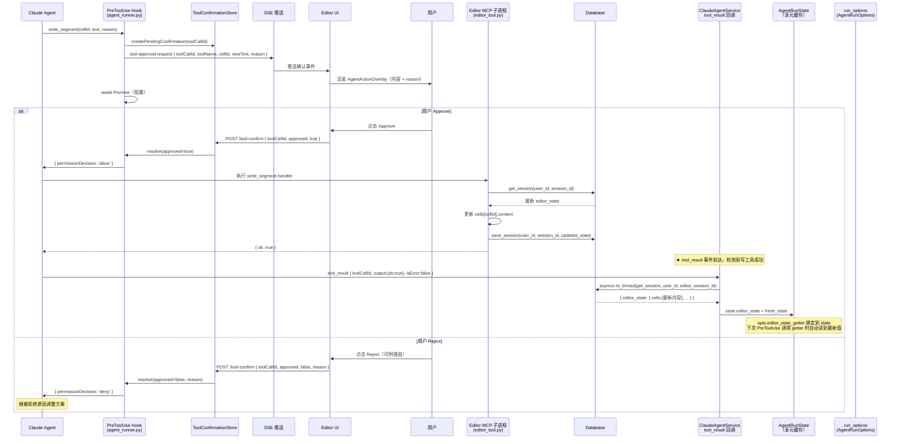

# MCP 工具目录 — EditorEngine 资源接口

Status: Updated
Updated: 2026-06-14
Scope: Design + 实现状态同步（含写工具后 editor_state DB 刷新与前端事件通知）

---

## 目录

1. [设计思路](#1-设计思路)
2. [工具目录](#2-工具目录)
3. [工具 Schema 定义](#3-工具-schema-定义)
4. [权限矩阵](#4-权限矩阵)
5. [工具调用流程](#5-工具调用流程)
6. [前端交互入口](#6-前端交互入口)

---

## 1. 设计思路

EditorEngine 已具备清晰的命令接口，将写操作方法直接映射为 MCP 工具。

**读写分离策略：**

| 操作类型 | 路径 | 说明 |
|---------|------|------|
| **读取**（只读） | `.editor/` 虚拟索引 + PreToolUse 拦截 | Agent 通过 `read_file(".editor/cells.json")` 等路径触发 PreToolUse 钩子，获得内存快照（见 [`workspace-adapter.md`](./workspace-adapter.md)） |
| **写入**（变更） | MCP 写工具（本文档） | 全部需要人类确认；MCP 子进程从数据库动态读取 Session 状态，变更后写回 |

**设计决策：MCP 工具仅保留写操作**

- 读操作已由 `.editor/` 虚拟索引路径完整覆盖，无需在 MCP 中重复
- 保留只读 MCP 工具会引入冗余路径，增加维护成本，且数据新鲜度不如虚拟索引（需要额外同步）
- 写工具通过 `PreToolUse` 拦截，强制人类确认后才执行，确保安全

**EditorEngine 写操作映射：**

| EditorEngine 方法 | MCP 工具 | 操作类型 |
|-------------------|---------|---------|
| `updateTextCell(cellId, text)` | `write_segment` | 写（必须确认） |
| `deleteCell(cellId)` | `delete_segment` | 写（必须确认） |
| `insertWidgetAtCursor(...)` | `insert_widget` | 写（必须确认） |
| `addCommentChatMessage(commentId, role, content)` | `reply_to_comment` | 写（必须确认） |

**数据源说明：**

MCP 写工具子进程通过工具调用参数中的 `editor_session_id` 识别当前文档会话。
`editor_session_id` 是 `/api/sessions` 接口的 `user_sessions.id`（文档编辑会话 ID），与下列 ID **不同**：

| ID | 含义 | 来源 |
|----|------|------|
| `editor_session_id` | 文档编辑会话 ID（本文档中的写工具参数） | `user_sessions.id`，来自 `/api/sessions` |
| workspace_id | Agent 工作空间目录名（`os.path.basename(cwd)`） | 可能是 Claude thread_id 或其他标识符 |
| thread_id | Claude SDK 对话线程 ID | Claude Code SDK 生成 |

Claude 从 `<workspace_context>` 提示词块中的 `Editor Session ID` 字段读取 `editor_session_id` 并在每次写工具调用时传入。子进程通过 `WHERE id = editor_session_id` 直接从数据库读写，不依赖预序列化快照。

---

## 2. 工具目录

### 2.1 写工具（全部需要人类确认）

| 工具名 | 对应 Engine 方法 | 确认等级 | 说明 |
|--------|----------------|---------|------|
| `write_segment` | `updateTextCell(cellId, text)` | **必须确认** | 替换指定文本片段的完整内容 |
| `delete_segment` | `deleteCell(cellId)` | **必须确认** | 删除指定片段（不可逆） |
| `insert_widget` | `insertWidgetAtCursor(widgetType, data, afterCellId)` | **必须确认** | 在指定位置插入组件片段 |
| `reply_to_comment` | `addCommentChatMessage(commentId, 'agent', content)` | **必须确认** | 向已有评论的对话历史追加 Agent 回复 |

> **读取路径不在此文档：** 所有读操作通过 `.editor/` 虚拟索引拦截机制实现，见 [`workspace-adapter.md`](./workspace-adapter.md)。

---

## 3. 工具 Schema 定义

### 3.1 `write_segment`

```json
{
  "name": "write_segment",
  "description": "替换指定文本片段的完整内容。此操作会修改用户的创作内容，必须经用户确认后执行。",
  "input_schema": {
    "type": "object",
    "properties": {
      "editor_session_id": {
        "type": "string",
        "description": "Editor session ID from <workspace_context> (user_sessions.id from /api/sessions — NOT the workspace directory name)"
      },
      "cellId": {
        "type": "string",
        "description": "要修改的文本片段 ID"
      },
      "text": {
        "type": "string",
        "description": "新的完整文本内容（替换整个片段，而非追加）"
      },
      "reason": {
        "type": "string",
        "description": "说明此次修改的意图，将展示给用户以便决策"
      }
    },
    "required": ["editor_session_id", "cellId", "text", "reason"]
  }
}
```

### 3.2 `delete_segment`

```json
{
  "name": "delete_segment",
  "description": "删除指定片段。此操作不可逆，必须经用户确认。",
  "input_schema": {
    "type": "object",
    "properties": {
      "editor_session_id": {
        "type": "string",
        "description": "Editor session ID from <workspace_context> (user_sessions.id from /api/sessions)"
      },
      "cellId": {
        "type": "string",
        "description": "要删除的片段 ID"
      },
      "reason": {
        "type": "string",
        "description": "删除原因，将展示给用户以便决策"
      }
    },
    "required": ["editor_session_id", "cellId", "reason"]
  }
}
```

### 3.3 `insert_widget`

```json
{
  "name": "insert_widget",
  "description": "在指定位置插入一个新的组件片段。必须经用户确认后执行。",
  "input_schema": {
    "type": "object",
    "properties": {
      "editor_session_id": {
        "type": "string",
        "description": "Editor session ID from <workspace_context> (user_sessions.id from /api/sessions)"
      },
      "widgetType": {
        "type": "string",
        "description": "组件类型（如 'chat'、'image' 等）"
      },
      "data": {
        "type": "object",
        "description": "组件数据，结构取决于 widgetType"
      },
      "afterCellId": {
        "type": "string",
        "description": "在此片段 ID 之后插入；留空则追加至文档末尾"
      },
      "reason": {
        "type": "string",
        "description": "插入理由，将展示给用户以便决策"
      }
    },
    "required": ["editor_session_id", "widgetType", "reason"]
  }
}
```

### 3.4 `reply_to_comment`

```json
{
  "name": "reply_to_comment",
  "description": "向指定评论的对话历史追加一条 Agent 回复消息。必须经用户确认后执行。",
  "input_schema": {
    "type": "object",
    "properties": {
      "editor_session_id": {
        "type": "string",
        "description": "Editor session ID from <workspace_context> (user_sessions.id from /api/sessions)"
      },
      "commentId": {
        "type": "string",
        "description": "目标评论 ID"
      },
      "content": {
        "type": "string",
        "description": "回复内容"
      },
      "reason": {
        "type": "string",
        "description": "回复理由，将展示给用户以便决策"
      }
    },
    "required": ["editor_session_id", "commentId", "content", "reason"]
  }
}
```

---

## 4. 权限矩阵

| 工具 | Human（直接执行） | Agent auto 模式 | Agent manual 模式（PreToolUse） |
|------|-----------------|----------------|-------------------------------|
| `write_segment` | ✅ | 🔐 **必须确认**（修改创作内容） | 🔐 **必须确认** |
| `delete_segment` | ✅ | 🔐 **必须确认**（不可逆） | 🔐 **必须确认** |
| `insert_widget` | ✅ | 🔐 **必须确认** | 🔐 **必须确认** |
| `reply_to_comment` | ✅ | 🔐 **必须确认** | 🔐 **必须确认** |

> **说明：** 所有写工具在 `auto` 和 `manual` 模式下均必须通过 `PreToolUse` 拦截并等待人类决策。它们注册在 `_ALWAYS_CONFIRM_TOOL_NAMES` 列表中，确保不会被自动跳过。

---

## 5. 工具调用流程

### 5.1 整体架构

```
Agent 读取文档内容：
  └─ 唯一路径: read_file(".editor/cells.json") 等
               → PreToolUse 拦截（内存快照）→ 临时文件 → 返回实时数据
               ✅ 从 AgentRunOptions.editor_state 内存读取；无 MCP 开销

Agent 修改文档内容：
  └─ 唯一路径: MCP 写工具（write_segment / delete_segment / insert_widget / reply_to_comment）
               → PreToolUse 拦截 → 人类确认 → MCP 子进程从数据库读取最新状态 → 应用变更 → 写回数据库
               🔐 全部经人类确认；基于数据库最新状态
```

### 5.2 写工具调用流程（必须确认）

```
Agent 意图修改片段内容
  → 调用 write_segment(cellId, text, reason)
  → PreToolUse hook 拦截（_ALWAYS_CONFIRM_TOOL_NAMES 中）
  → 构建确认请求：
      { toolName: 'write_segment', cellId, newText, reason }
  → SSE 推送 tool-approval-request 至前端
  → 前端渲染 AgentActionOverlay：
      显示修改内容 + 操作理由
  → 人类点击 Approve 或 Reject
  → POST /api/claude-agent/tool-confirm
  → ToolConfirmationStore.resolve
      ├── Approve → hook 返回 { permissionDecision: 'allow' }
      │             → MCP 子进程运行 write_segment handler
      │             → handler 从数据库加载最新 editor_state
      │             → 更新 cells[cellId].content = text
      │             → database.save_session(user_id, session_id, updated_state)
      │             → 返回 { ok: true }
      │             → ★ service.py tool_result 回调检测到 mcp__editor__write_segment
      │               → asyncio.to_thread(database.get_session, user_id, editor_session_id)
      │               → state.editor_state = fresh_state（AgentRunState 享元更新）
      │               → run_options.editor_state = fresh_state（当轮 PreToolUse 立即生效）
      │               → SessionEventBus 发布 session_updated(source=agent, toolCallId)
      │                 → 前端 /api/sessions/events 收到后 reload Writing 视图
      └── Reject  → hook 返回 { permissionDecision: 'deny' }
                    → Agent 收到拒绝原因，继续对话或调整方案
```

### 5.3 数据源：数据库动态读取

MCP 写工具子进程通过工具调用参数中的 `editor_session_id` 定位文档，从数据库动态获取最新状态：

```
<workspace_context> 提示词块
  Editor Session ID: sess-xxxx        ← user_sessions.id（来自 /api/sessions）
  ≠ Working directory basename        ← workspace_id（可能是 thread_id 或其他）

Claude 调用写工具时
  write_segment(editor_session_id="sess-xxxx", cellId="c1", ...)
                      ↓
editor_tool.py::_write_segment("sess-xxxx", ...)
  → database.get_db().execute("SELECT ... WHERE id = ?", ("sess-xxxx",))
  → 应用变更
  → database.get_db().execute("UPDATE ... WHERE id = ?", ("sess-xxxx",))
```

**三种 ID 的区别：**

| ID 类型 | 来源 | 用途 |
|---------|------|------|
| `editor_session_id`（工具参数）| `user_sessions.id` from `/api/sessions` | 定位文档数据库记录 |
| workspace_id（`cwd` basename）| Claude thread_id 或 workspace 标识符 | Agent 文件系统路径 |
| Claude thread_id | Claude Code SDK | 对话历史续传 |

### 5.4 时序图



---

## 6. 前端交互入口

### 6.1 工具检测路由表

前端通过 `isEditorWriteTool(toolName)` 检测编辑器写工具，渲染专用确认 UI（位于 `EditorWriteApprovalUI.tsx`）。

| MCP 工具名 | 前端 UI 组件 | 渲染位置 | 检测函数 |
|-----------|------------|---------|---------|
| `mcp__editor__write_segment` | `WriteSegmentApprovalUI` | `ToolMessagePart` → `EditorWriteApprovalUI` | `isEditorWriteTool()` |
| `mcp__editor__delete_segment` | `DeleteSegmentApprovalUI` | `ToolMessagePart` → `EditorWriteApprovalUI` | `isEditorWriteTool()` |
| `mcp__editor__insert_widget` | `InsertWidgetApprovalUI` | `ToolMessagePart` → `EditorWriteApprovalUI` | `isEditorWriteTool()` |
| `mcp__editor__reply_to_comment` | `ReplyToCommentApprovalUI` | `ToolMessagePart` → `EditorWriteApprovalUI` | `isEditorWriteTool()` |

### 6.2 前端文件路径

| 文件 | 职责 |
|------|------|
| `frontend/src/components/chat/EditorWriteApprovalUI.tsx` | 4个专用确认 UI 组件 + `isEditorWriteTool()` 工具函数 |
| `frontend/src/components/chat/ToolMessagePart.tsx` | 检测编辑器写工具，渲染 `EditorWriteApprovalUI` |
| `frontend/src/components/chat/ChatMessageList.tsx` | 检测编辑器写工具，直接展开渲染（不折叠） |

### 6.3 前端检测条件

`ChatMessageList.tsx` 中的工具渲染决策：

```
isEditorWriteTool(toolName) && !isCompleted
  → 直接渲染 ToolMessagePart（isManualToolInvocation=true）
  → ToolMessagePart 内部识别工具名 → 渲染对应专用 ApprovalUI
```

编辑器写工具的 `tool part state` 在等待用户确认时处于 `input-available` 或 `approval-requested`（`isCompleted = false`），此时必须展示确认 UI，阻止 Agent 继续执行。

### 6.4 确认提交接口

所有编辑器写工具确认均调用同一个接口：

```
POST /api/claude-agent/tool-confirm
Content-Type: application/json

{
  "thread_id": "{threadId}",
  "tool_call_id": "{toolCallId}",
  "approved": true | false,
  "reason": "{拒绝理由（可选）}"
}
```

完整交互时序参见 [`human-agent-collab.md` §8 业务时序图](./human-agent-collab.md#8-业务时序图)。
