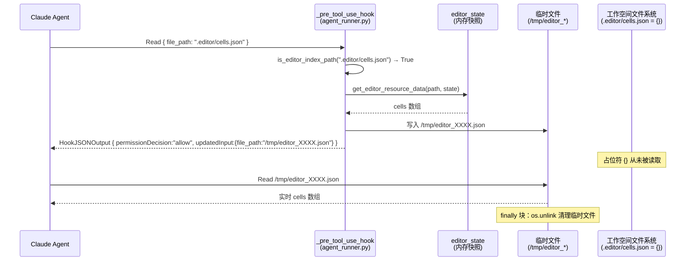

# EditorState 虚拟索引适配器

Status: Updated  
Updated: 2026-06-28
Scope: Design + 实现状态同步

> [Sync] 2026-06-28: 补充 Notion 资源连接器边界 — `.notion/` 读取来源为连接器数据层 canonical snapshot，不复用 `.editor/` 的 Agent 本地内存快照语义。

---

## 目录

1. [设计背景](#1-设计背景)
2. [虚拟索引目录结构](#2-虚拟索引目录结构)
3. [资源映射规范](#3-资源映射规范)
4. [Python SDK PreToolUse 拦截机制](#4-python-sdk-pretooluse-拦截机制)
5. [工作空间初始化集成](#5-工作空间初始化集成)
6. [读写路径分离](#6-读写路径分离)
7. [设计决策：为何不写实际文件](#7-设计决策为何不写实际文件)
8. [上下文接入说明](#8-上下文接入说明)
9. [`.claude/settings.json` 与虚拟索引的设计关系](#9-claudesettingsjson-与虚拟索引的设计关系)
10. [实现清单](#10-实现清单)
11. [Notion 资源连接器边界](#11-notion-资源连接器边界)

---

## 1. 设计背景

### 1.1 问题

Claude Agent 需要"读取"当前文档内容才能进行分析、建议和修改。当前 EditorState 仅存在于：
- 前端内存（EditorEngine 维护）
- 后端数据库（`/api/sessions` 持久化的 JSON blob）

这两处 Agent 均无法直接访问（数据库不可直接读，前端内存更不可达）。

### 1.2 解决方案

引入 **虚拟索引适配器**：在工作空间内创建 `.editor/` 目录，其中仅放置**占位符文件**（空 JSON `{}`）。Agent 通过 `read_file` 原生能力尝试读取这些路径时，`PreToolUse` 钩子会在实际执行前拦截该调用，将其重定向到一个临时文件——该临时文件在拦截时动态填充自当前 `AgentRunOptions.editor_state` 快照。

**核心思路：**

```
AgentRunOptions.editor_state（内存快照，随每轮请求注入）
    ↑ 按需提取
PreToolUse hook（agent_runner.py）
    ↑ 拦截 Read 工具调用
.editor/{resource}.json（占位符，磁盘内容始终为 {}）
    ↑ Agent read_file（被重定向前的目标路径）
```

运行时实际路径（拦截后）：

```
.editor/cells.json  ──PreToolUse──▶  /tmp/ink_editor_cells_XXXX.json（动态填充）
                                           ↑
                                    editor_state["cells"] 序列化
```

---

## 2. 虚拟索引目录结构

在现有工作空间结构的基础上，新增 `.editor/` 虚拟索引目录：

```
{AGENT_CWD}/
  └── {session_id}/                    ← 用户工作空间根
      ├── .claude/                     ← Claude 配置（现有）
      ├── .mcp.json                    ← MCP 服务配置（现有）
      ├── files/                       ← 用户上传文件（现有）
      ├── logs/                        ← Agent 执行日志（现有）
      ├── skills/                      ← Skills（现有）
      └── .editor/                     ← ★ 新增：EditorState 虚拟索引
            ├── README.md              ← 说明文件（告知 Agent 这是虚拟目录）
            ├── cells.json             ← 占位符（{}），读时被重定向至实时数据
            ├── commentors.json        ← 占位符（{}），同上
            ├── tasks.json             ← 占位符（{}），同上
            ├── session.json           ← 占位符（{}），同上
            └── full_state.json        ← 占位符（{}），同上
```

> **关键约束**：`.editor/` 中的 `.json` 文件磁盘内容**始终为空 JSON `{}`**，从不写入真实数据。实际内容仅在 `PreToolUse` 拦截时写入临时文件并一次性返回给 Agent，运行结束后清理。

---

## 3. 资源映射规范

每个虚拟文件对应 `EditorState` 中的一个字段或预设的字段组合：

| 虚拟路径 | `EditorState` 来源 | 说明 |
|----------|--------------------|------|
| `.editor/cells.json` | `editor_state["cells"]` | 文档所有文本/组件片段的有序数组 |
| `.editor/commentors.json` | `editor_state["commentors"]` | 已应用的声音评论者注释列表 |
| `.editor/tasks.json` | `editor_state["tasks"]` | 进行中的分析任务列表 |
| `.editor/session.json` | `{"id", "selectedState", "createdAt"}` | 会话元数据（id、情感状态、创建时间） |
| `.editor/full_state.json` | 整个 `editor_state` dict | 完整 EditorState 快照（调试 / 全量分析用） |

### 3.1 `cells.json` 内容示例

```json
[
  {
    "id": "cell-001",
    "type": "text",
    "content": "今天的天空很蓝，我想起了那个夏天的午后。风吹过院子里的老树，叶子哗哗作响。"
  },
  {
    "id": "cell-002",
    "type": "widget",
    "widgetType": "chat",
    "data": {
      "voiceId": "voice-azure",
      "messages": [
        { "role": "assistant", "content": "这段文字让我想到了……" }
      ]
    }
  }
]
```

### 3.2 `session.json` 内容示例

```json
{
  "id": "sess-uuid-xxxx",
  "selectedState": "平静",
  "createdAt": "2026-05-23T08:00:00.000Z"
}
```

---

## 4. Python SDK PreToolUse 拦截机制

### 4.1 设计选择：在 Python SDK 层拦截

`.editor/` 读取拦截实现于 `agent_runner.py` 的 `_pre_tool_use_hook` 回调（Python SDK 层），而非 `.claude/hooks` Shell 脚本层。核心理由：

| 维度 | Python SDK `_pre_tool_use_hook`（采用） | `.claude/hooks` Shell Hook（不采用） |
|------|----------------------------------------|--------------------------------------|
| 调试支持 | ✅ 支持 Python 调试器断点 | ❌ Shell 脚本无法附加调试器 |
| 数据访问 | ✅ 直接读取内存中 `editor_state`，无需跨进程桥接 | ❌ 需预写文件到 `.live/` 目录，额外 I/O |
| 实现复杂度 | ✅ 若干行 Python 代码 | ❌ 需维护 bash + python 双脚本 + 部署逻辑 |
| 失败可见性 | ✅ 异常直接出现在 Python traceback | ❌ Shell 退出码难追踪 |

### 4.2 拦截条件

`_pre_tool_use_hook` 在以下条件**同时满足**时触发 `.editor/` 重定向：

1. 工具名为 `Read`（Claude 的原生文件读取工具）
2. `AgentRunOptions.editor_state` 不为 `None`（本轮运行注入了编辑器状态）
3. 路径参数（`file_path`）落在 `.editor/` 虚拟目录内（`is_editor_index_path` 返回 `True`）

`.editor/` 拦截在其他所有 hook 判断之前执行（早于 `tool_choice` / 工具确认逻辑），确保虚拟索引读取在所有模式下均生效。

### 4.3 拦截流程

```
Agent 发出 Read 工具调用
  → tool_name = "Read", tool_input.file_path = ".editor/cells.json"
  ↓
_pre_tool_use_hook 检测到 is_editor_index_path(path) == True
  且 opts.editor_state is not None
  ↓
get_editor_resource_data(path, editor_state)  →  data = [...]
  ↓
写入临时文件（tempfile.NamedTemporaryFile, delete=False）
  /tmp/editor_XXXX.json  ←  json.dump(data, ensure_ascii=False)
  路径追加至 _editor_redirect_tmp_paths 列表
  ↓
return {"hookSpecificOutput": {
    "hookEventName": "PreToolUse",
    "permissionDecision": "allow",
    "updatedInput": {"file_path": "/tmp/editor_XXXX.json"}
}}
  ↓
Claude SDK 使用重定向后的路径执行 Read
  → Agent 得到实时的 cells 数据
  ↓
finally 块：os.unlink 清理所有本轮创建的临时文件
```

### 4.4 拦截失败回退

| 失败场景 | 处理策略 |
|---------|---------|
| `editor_state` 为 `None` | 条件不满足，跳过拦截；Agent 读到占位符 `{}` |
| `is_editor_index_path` 返回 `False` | 条件不满足，跳过拦截；Agent 读到实际文件内容 |
| 临时文件写入失败（磁盘满等） | `except Exception` 捕获，记录 warning 并 fall-through；Agent 读到占位符 `{}` |
| `get_editor_resource_data` 抛出异常 | 同上 fall-through |

### 4.5 时序图



---

## 5. 工作空间初始化集成

### 5.1 `_init_editor_index` 函数职责

`workspace.py` 的 `init_workspace` 在创建标准子目录（`files/`, `logs/`, `skills/`）后，调用 `_init_editor_index(workspace)` 完成：

1. 创建 `.editor/` 目录（`exist_ok=True`，幂等）
2. 写入 `README.md`（每次刷新，确保说明与模板同步）
3. 为 `EDITOR_RESOURCES` 中每个 stem 写入占位符 `{}\n`（**仅首次写入，已存在则跳过**）

```
init_workspace(session_id)
  ├── mkdir files/ logs/ skills/
  ├── _copy_template_assets()
  ├── sync_skills_symlinks()
  └── _init_editor_index()          ← 创建 .editor/ 虚拟索引目录
        ├── mkdir .editor/
        ├── write .editor/README.md
        ├── write .editor/cells.json        = "{}\n"  (skip if exists)
        ├── write .editor/commentors.json   = "{}\n"  (skip if exists)
        ├── write .editor/tasks.json        = "{}\n"  (skip if exists)
        ├── write .editor/session.json      = "{}\n"  (skip if exists)
        └── write .editor/full_state.json   = "{}\n"  (skip if exists)
```

### 5.2 `EDITOR_RESOURCES` 常量（来自 `editor_index.py`）

```python
EDITOR_RESOURCES: dict[str, str] = {
    "cells":       "cells",        # → editor_state["cells"]
    "commentors":  "commentors",   # → editor_state["commentors"]
    "tasks":       "tasks",        # → editor_state["tasks"]
    "session":     "__session__",  # → {id, selectedState, createdAt}
    "full_state":  "__full__",     # → 整个 editor_state dict
}
```

---

## 6. 读写路径分离

```
Agent 读取文档内容：
  └─ 唯一路径: read_file(".editor/cells.json")
               → PreToolUse 拦截 → 临时文件 → 返回实时 EditorState 数据
               ✅ 无 MCP 额外开销；✅ 始终返回最新状态

Agent 修改文档内容：
  └─ 唯一路径: 调用 MCP 工具 write_segment / delete_segment
               → PreToolUse 拦截 → 人类确认 → EditorEngine 执行
               ⚠️ 禁止直接写文件（.editor/ 为虚拟只读目录，写入无效）
```

**设计约束：**
- `.editor/` 目录对 Agent 的文件系统权限：**虚拟只读**（`write_file` 到占位符路径不经过 EditorEngine，状态不会改变，占位符内容也会在下次运行时被重置）
- 所有写操作必须通过 MCP 工具路径，以确保：
  1. 经过人类确认
  2. 经过 EditorEngine 的状态校验（能量门控、类型约束等）
  3. 触发 React 订阅者重新渲染

---

## 7. 设计决策：为何不写实际文件

### 早期方案（已废弃）

早期方案设计了 `SessionWorkspaceAdapter`，在每次 `EditorEngine.notifyChange()` 后将 EditorState 同步到 `document/segments/{cellId}.txt` 等真实文件。

### 为何转向虚拟索引方案

| 维度 | 文件同步方案（废弃） | 虚拟索引方案（当前） |
|------|---------------------|---------------------|
| 数据新鲜度 | 依赖同步触发时机；防抖窗口内可能过时 | Agent 读取时动态填充，始终反映最新 `editor_state` |
| 实现复杂度 | 需要增量/全量同步逻辑、孤立文件清理、重试队列 | 仅需 PreToolUse 钩子中若干行拦截代码 |
| 磁盘 I/O | 每次 EditorState 变更均触发文件写入 | 仅在 Agent 实际读取时写入一次性临时文件 |
| 状态一致性 | 同步失败时文件与内存不一致 | 内存即权威，文件（临时文件）由内存直接派生 |
| 工作空间大小 | 随文档增长持续膨胀 | 占位符恒为空 `{}`，临时文件运行后清理 |

**结论**：虚拟索引方案以更少的代码、更低的复杂度实现了更强的数据一致性保证，是 Ink & Memory EditorState 读取的首选设计。

---

## 8. 上下文接入说明

本文档（`workspace-adapter.md`）描述的是 `.editor/` 虚拟索引的**存储与拦截机制**，即"文档内容如何在运行时被动态提供给 Agent 的文件读取工具"。

**Agent 如何在 Prompt 层感知工作空间的存在**，由独立设计文档 [`workspace-context.md`](./workspace-context.md) 说明。该文档定义了：

- `<workspace_context>` 提示词块的结构与内容
- 该块在 `assemble_context` 管道中的注入位置（`<runtime_context>` 之后、用户文本之前）
- `build_workspace_context_block(cwd)` 函数的调用规范（实现位于 `backend/claude_agent/workspace_context.py`）
- 与 [`claude-agent-context-assembly.md`](../claude-agent-context-assembly.md) Section 4 Item 7（Workspace）的对应关系

**`editor_state` 快照的完整生命周期**（数据结构、五阶段说明、业务时序图、不持久化决策），由独立设计文档 [`editor-state-lifecycle.md`](./editor-state-lifecycle.md) 说明。

三份文档的分工：

| 文档 | 回答的问题 |
|------|----------|
| `workspace-adapter.md`（本文档） | Agent 调用 `read_file(".editor/cells.json")` 时，数据从哪里来？（拦截机制） |
| [`workspace-context.md`](./workspace-context.md) | Agent 怎么知道 `.editor/` 目录存在，以及如何与工作空间交互？（Prompt 层） |
| [`editor-state-lifecycle.md`](./editor-state-lifecycle.md) | `editor_state` 快照从前端采集到运行时激活再到清理，完整经历了哪些阶段？（数据流） |

---

## 9. `.claude/settings.json` 与虚拟索引的设计关系

### 9.1 模板同步机制

每次 `workspace.py::init_workspace(session_id)` 被调用时，`_copy_template_assets()` 会将项目根目录的 `.claude/` 内容（包括 `settings.json`、`hooks/`、`commands/` 等）同步到 `{workspace}/.claude/`。

```
项目根 .claude/settings.json  ──init_workspace()──▶  {workspace}/.claude/settings.json
                                  (每次都刷新，保证最新)
```

这意味着：**`.claude/settings.json` 的项目级模板是所有 Agent 会话的统一配置来源**。对模板的修改会在下一次 workspace 初始化时自动生效。

> 参见 `claude-sdk-env-design.md` §5.5：Claude Code 通过 `setting-sources=project` 仅加载项目级 settings，不读取用户目录 settings。

### 9.2 Hook 执行顺序与读取路径

`settings.json` 中的 `hooks` 配置（shell 脚本）由 **Claude Code CLI 子进程**执行，Python SDK 的 `_pre_tool_use_hook` 回调由 **claude_agent_sdk 层**注册。两者执行顺序为：

```
Agent 发出 Read { file_path: ".editor/cells.json" }
  │
  ├── ① settings.json shell hooks（PreToolUse matcher: "Read|Edit|Write|View"）
  │       └── protect-files.sh 检查路径
  │               .editor/ 不在受保护列表 → exit 0（允许通过）
  │
  └── ② Python SDK _pre_tool_use_hook（agent_runner.py）
              is_editor_index_path(".editor/cells.json") → True
              editor_state 不为 None → 读取内存快照
              → 写入临时文件并重定向路径（CLI ≥2.1 updatedInput 格式）
              → Agent 读取到实时 EditorState 数据
```

**关键约束**：`.editor/` 路径**必须不出现在** `protect-files.sh` 的保护列表中，否则 shell hook 会在 Python hook 运行之前以 `exit 2` 拦截 Read，导致虚拟索引失效。

### 9.3 `.editor/` 写入保护设计

`.editor/` 是虚拟只读目录。Agent 直接通过 `Edit` / `Write` 工具向 `.editor/*.json` 写入不会更新 EditorState（占位符是永久空 `{}`，写入的内容在下次运行时被重置），属于静默无效操作，可能误导 Agent 认为修改已生效。

为此，在 `.claude/settings.json` 中通过 `permissions.deny` 在 **Claude Code 设置层**明确拒绝对 `.editor/` 的写操作：

```json
{
  "permissions": {
    "deny": [
      "Edit(.editor/**)",
      "Write(.editor/**)",
      "MultiEdit(.editor/**)"
    ]
  }
}
```

设计分层如下：

| 层级 | 机制 | 作用范围 |
|------|------|---------|
| Claude Code settings 层 | `permissions.deny` | 拒绝 Edit/Write/MultiEdit 到 `.editor/**` |
| Claude Code CLI shell hook 层 | `protect-files.sh`（`Read\|Edit\|Write\|View`） | 拒绝对 `.env`、`.git/`、`.claude/` 等敏感路径的一切操作 |
| Python SDK hook 层 | `agent_runner.py` PreToolUse 回调 | 拦截 `Read` 到 `.editor/` → 重定向至临时文件 |

三层协同保证：
- ✅ `read_file(".editor/cells.json")` → Python hook 重定向 → 返回实时数据
- ✅ `edit_file(".editor/cells.json", ...)` → settings.json deny → 被拒绝，Agent 收到明确错误
- ✅ `.claude/settings.json` 本身 → protect-files.sh → 被保护，Agent 无法自改配置

### 9.4 工具权限管理分工

Editor MCP 只读工具（`mcp__editor__list_segments` 等）的授权**在 Python 层**管理，而非通过 `settings.json`：

| 机制 | 管理层 | 特点 |
|------|--------|------|
| `AgentRunOptions.allowed_tools` | Python runner 层 | 动态，每次请求可按业务逻辑控制 |
| `settings.json` `permissions.allow` | Claude Code CLI 层 | 静态，对所有会话一致生效 |

设计决策：Editor MCP 工具通过 Python 层 `allowed_tools` 授权，而不写入 `settings.json`。理由：

1. `settings.json` 是全局模板，不适合控制依赖运行时注入的 `editor_state` 的工具
2. 写工具（`write_segment` 等）需要在 `_ALWAYS_CONFIRM_TOOL_NAMES` 中注册，属于 runner 层逻辑
3. 未来如需按会话类型区分（纯对话 vs 文档编辑），只需在 service 层决定是否传入 `editor_state` 和对应的工具列表，无需修改静态模板

### 9.5 生命周期总览

```
服务启动
  └─ workspace.py::init_workspace(session_id)
       ├─ _copy_template_assets()
       │    └─ 同步项目 .claude/settings.json → {workspace}/.claude/settings.json
       │         settings.json 包含：
       │           · hooks: protect-files.sh（保护 .env/.git/.claude/，不包含 .editor/）
       │           · permissions.deny: Edit/Write/MultiEdit(.editor/**)
       └─ _init_editor_index(workspace)       [★ 已实现]
            └─ 创建 .editor/ 占位符目录 + README.md

Agent 运行（每次请求）
  ├─ service.py::assemble_context()
  │    └─ 将 editor_state 注入 AgentRunOptions
  └─ agent_runner.py::run_streaming()
       ├─ 构建 ClaudeAgentOptions（setting-sources=project → 读取 workspace/.claude/settings.json）
       ├─ 注册 Python _pre_tool_use_hook
       │    ├─ .editor/ Read 拦截：is_editor_index_path → 写临时文件 → updatedInput 重定向
       │    └─ 工具确认逻辑（AskUserQuestion 等）
       └─ 注册 editor MCP 子进程（list_segments / read_segment 等）

Agent 运行后（finally 块）
  └─ 清理所有本轮创建的 .editor/ 重定向临时文件
       └─ os.unlink(_editor_redirect_tmp_paths[*])
```

---

## 10. 实现清单

### 10.1 `editor_index.py`（虚拟索引辅助函数）

- [x] `EDITOR_RESOURCES` 常量：虚拟文件名 stem → EditorState 提取键映射
- [x] `is_editor_index_path(path: str) -> bool`：检测路径是否为 `.editor/` 虚拟资源
- [x] `resolve_editor_resource(path: str) -> Optional[str]`：提取资源 stem
- [x] `get_editor_resource_data(path, editor_state) -> Any`：按路径提取 EditorState 切片

### 10.2 `agent_runner.py`（`_pre_tool_use_hook` 拦截）

- [x] `_editor_redirect_tmp_paths: list[str]` — 本轮临时文件路径收集器（用于 finally 清理）
- [x] `_apply_editor_index_redirect` 模块级辅助函数（可独立单测，从 `_pre_tool_use_hook` 委托调用）
- [x] `_pre_tool_use_hook` 中 `.editor/` 读取拦截块（早于工具确认逻辑）：
  - 条件：`tool_name == "Read"` 且 `opts.editor_state is not None` 且 `is_editor_index_path(path)`
  - `get_editor_resource_data(path, editor_state)` 提取数据
  - `tempfile.NamedTemporaryFile(delete=False)` 写入临时文件
  - 路径追加至 `_editor_redirect_tmp_paths`
  - 返回 `{"hookSpecificOutput": {"hookEventName":"PreToolUse","permissionDecision":"allow","updatedInput":{"file_path":tmp_path}}}`（纯字典字面量）
  - `except Exception` fall-through（记录 warning，不阻断 Agent）
- [x] `finally` 块：`os.unlink(_editor_redirect_tmp_paths[*])` 逐一清理临时文件

### 10.3 `workspace.py`（工作空间初始化）

- [x] `_init_editor_index(workspace)` — 创建 `.editor/` 占位符目录 + README.md（说明虚拟重定向机制）
- [x] `init_workspace(session_id)` 末尾调用 `_init_editor_index`

### 10.4 `editor_tool.py`（MCP 工具处理函数 — 使用 editor_index.py 统一映射源）

`editor_tool.py` 曾直接硬编码 EditorState 字段名（`state.get("cells")` 等），与 `editor_index.py` 的 `EDITOR_RESOURCES` 定义重复，违反统一映射规则。

**修复**（2026-05-29）：

- [x] 从 `editor_index.py` 导入 `EDITOR_RESOURCES` 和 `get_editor_resource_data`
- [x] 更新 `[Input]` 头部引用 `editor_index.py` 的 `EDITOR_RESOURCES`
- [x] `_list_segments` / `_read_segment` 通过 `EDITOR_RESOURCES["cells"]` 获取字段名
- [x] `_read_session_meta` 通过 `get_editor_resource_data(".editor/session.json", state)` 提取数据
- [x] `_list_comments` / `_read_comment` 通过 `EDITOR_RESOURCES["commentors"]` 获取字段名

### 10.5 `context_builder.py`（系统提示词 + 上下文装配）

- [x] 在 `_SYSTEM_PROMPT_TEMPLATE` 中追加 `## Edit-Point Workflow` 节：告知 Agent 调度规则（何时读文档、如何分析、如何走写入路径）
- [x] 更新 `[Input]` 头部引用 `claude_agent.workspace_context`（已导入但未在头部标注）及 `editor_index.py` 路径

### 10.6 单元测试

- [x] `test_is_editor_index_path`：覆盖绝对路径、相对路径、子路径、未知 stem、README
- [x] `test_get_editor_resource_data`：cells / session / full_state / 缺字段降级
- [x] `TestEditorIndexRedirectHelper`（`test_claude_agent_runner.py`）：15 个 redirect / fallthrough / cleanup 用例
- [ ] `test_workspace_context_block`：验证 `{cwd}` 替换、块边界标签、cwd=None 守卫

### 10.7 文档同步

- [x] 更新 `docs/design/claude-agent/edit-point/.folder.md`
- [x] 更新 `backend/libs/claude_agent_kit/.folder.md`

---

## 11. Notion 资源连接器边界

`.editor/` 与 `.notion/` 都使用虚拟索引 + PreToolUse Read 重定向，但二者的数据所有权不同：

| 维度 | `.editor/` | `.notion/` |
|---|---|---|
| 事实来源 | Ink & Memory `EditorState` | Notion 远程数据源 |
| 系统内部权威状态 | 当前会话 `editor_state` / DB 刷新结果 | 资源连接器数据层的 `CanonicalWorkspaceSnapshot` |
| Agent 初始化 | 可使用前端传入的当前编辑器快照 | 必须从连接器数据层读取 current snapshot |
| Agent 本地状态 | 可通过 `editor_state_getter` 读取 live flyweight | 只能派生 `AgentDerivedContext`，不能成为 source of truth |
| 写入方式 | `mcp__editor__*` 写工具 + 人类确认 + DB reload | `SnapshotWriteProposal` + connector write pipeline + 远程确认 |

实现约束：

- `.notion/` Read hook 不应在 Agent 读取时直接调用 Notion API。
- `.notion/` Read hook 必须从已 attach 的 canonical snapshot 中解析数据。
- 同一 `snapshotVersion` 下的所有 `.notion/` 文件必须来自同一个 snapshot object。
- Notion 写入确认后必须生成新的 canonical snapshot，旧 snapshot 进入 `snapshot_superseded`。
- 前端刷新继续遵守 `session_updated source="agent"` 事件驱动机制，不使用固定 sleep。
