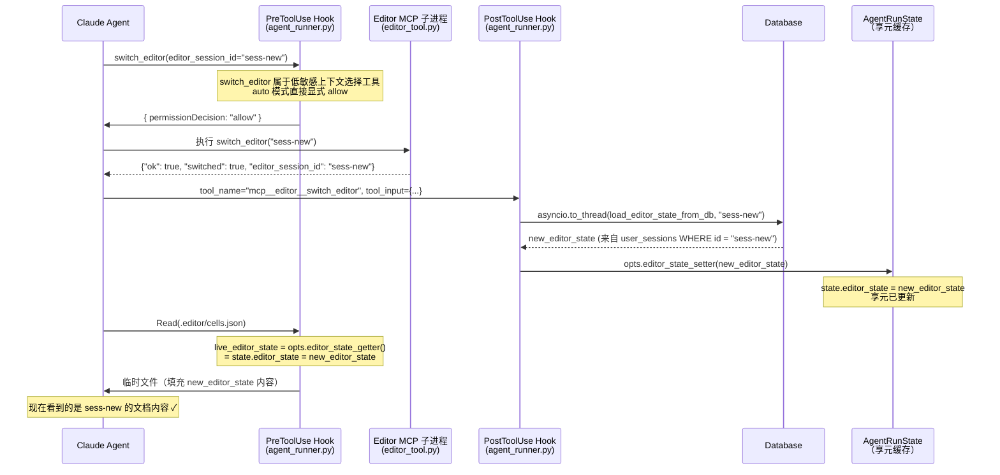
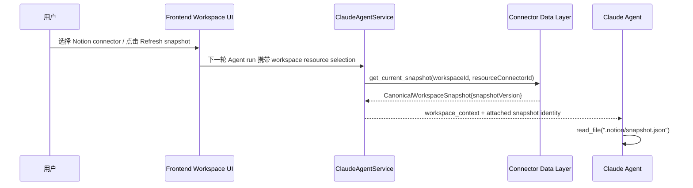

# 工作空间上下文切换设计方案

Status: Implemented  
Updated: 2026-06-28
Scope: 智能体在单次对话中切换 `.editor` 工作空间上下文的完整设计与实现

> [Sync] 2026-06-07: 当时 Runner auto-mode 敏感度策略将 `switch_editor` 视为状态切换工具并要求确认；该策略已被 2026-06-09 低敏策略取代。
> [Sync] 2026-06-09: 产品权限策略将 `switch_editor` 改为低敏感工具；它不修改文档内容，auto 模式下由 PreToolUse 显式 allow。
> [Sync] 2026-06-28: 明确 Notion connector 不复用 `switch_editor`；外部资源切换由 workspace resource selection 和连接器数据层 canonical snapshot 管理。

---

## 目录

1. [背景与问题](#1-背景与问题)
2. [设计方案概述](#2-设计方案概述)
3. [工具定义：switch_editor](#3-工具定义switch_editor)
4. [数据流：PostToolUse 钩子切换机制](#4-数据流posttooluse-钩子切换机制)
5. [与现有 write 工具的对比](#5-与现有-write-工具的对比)
6. [时序图](#6-时序图)
7. [实现文件索引](#7-实现文件索引)
8. [Agent 提示工程集成](#8-agent-提示工程集成)
9. [外部资源切换边界](#9-外部资源切换边界)

---

## 1. 背景与问题

### 1.1 场景

用户在一次对话中希望让智能体跨越多个文档编辑会话（`user_sessions`）工作：

- 先处理会话 A 的文档，再切换到会话 B 继续处理
- 无需中断当前对话线程，直接发送"切换到另一篇文章"的指令

### 1.2 现有架构的局限

当前 `.editor/` 虚拟索引机制（见 [workspace-adapter.md](./workspace-adapter.md)）在对话开始时由
`AgentRunOptions.editor_state` 确定文档上下文，整个对话轮次内固定不变：

```
AgentRunOptions.editor_state（对话开始时快照）
    ↓
PreToolUse 钩子（agent_runner.py）
    ↓
.editor/cells.json  →  临时文件（editor_state 的切片）
```

若要在单次对话中切换到另一个会话的文档，需要一种机制动态更新 `AgentRunState.editor_state`
享元缓存，让后续的 `.editor/` 读取自动看到新内容。

---

## 2. 设计方案概述

### 2.1 核心思路

引入 **`switch_editor` MCP 工具**：

| 组件 | 职责 |
|------|------|
| `editor_tool.py` 中的 MCP 处理器 | **空操作（no-op）**：仅返回 `{"ok": true}` |
| `agent_runner.py` 中的 `PostToolUse` 钩子 | **实际切换逻辑**：读取工具参数 → 从数据库加载新 `editor_state` → 通过 `opts.editor_state_setter` 更新享元 |
| `AgentRunOptions.editor_state_setter` | **写入通道**：由 `service.py` 注入，绑定到 `AgentRunState.with_editor_state()` |

### 2.2 为何选用 PostToolUse 而非 PreToolUse

- `PreToolUse` 在工具执行前触发，可以修改输入或拒绝执行。但切换上下文是一个"确认已完成"的动作，
  语义上应在工具返回成功后再更新状态。
- `PostToolUse` 在工具执行并返回结果后触发，是执行副作用（如状态更新）的标准位置。
- 与现有写工具的 `tool_result` 回调中的 `editor_state` DB-reload 逻辑模式一致
  （见 `service.py::_make_tool_event_cb`）。

### 2.3 为何 MCP 处理器是空操作

- 真正的切换逻辑（数据库查询 + 享元写入）发生在 `agent_runner.py`（主进程），
  而不是 MCP 子进程。
- MCP 子进程中没有对 `AgentRunState` 享元的引用，无法直接修改它。
- 空操作处理器的存在只是为了满足 MCP 工具协议：Claude 需要看到一个合法的工具调用结果，
  才能确认切换已生效。

---

## 3. 工具定义：switch_editor

### 3.1 工具名称

```
mcp__editor__switch_editor
```

### 3.2 Schema

```json
{
  "name": "switch_editor",
  "description": "切换当前对话的工作空间上下文至指定会话。调用成功后，智能体通过 .editor/ 路径读取的内容将来自新的目标会话文档。此操作不修改任何文档内容；状态切换在服务端由 PostToolUse 钩子异步完成，auto 模式下无需前端确认。",
  "input_schema": {
    "type": "object",
    "properties": {
      "editor_session_id": {
        "type": "string",
        "description": "要切换到的目标会话 ID（user_sessions.id from /api/sessions）。切换后智能体将在该会话的文档上下文中继续工作。"
      }
    },
    "required": ["editor_session_id"]
  }
}
```

### 3.3 MCP 处理器返回值

MCP 子进程的 `_switch_editor()` 处理器始终返回：

```json
{"ok": true, "switched": true, "editor_session_id": "<target_session_id>"}
```

实际状态切换由主进程 `PostToolUse` 钩子完成。

### 3.4 权限矩阵

| 模式 | 行为 |
|------|------|
| auto | 显式 allow → 自动执行 |
| manual | 走确认流 → 显示 Approve/Cancel；批准后执行 |

> `switch_editor` 不在 `_ALWAYS_CONFIRM_TOOL_NAMES` 的特殊问答/写入工具清单中；它作为低敏感上下文选择工具进入 `_LOW_SENSITIVITY_QUERY_TOOL_NAMES`，auto 模式下直接返回显式 allow。

---

## 4. 数据流：PostToolUse 钩子切换机制

```
智能体调用：mcp__editor__switch_editor(editor_session_id="sess-new")
    │
    ├─ PreToolUse hook：低敏感工具，auto 模式下返回显式 allow
    │
    ├─ MCP 子进程（editor_tool.py）
    │      _switch_editor("sess-new")
    │      → 返回 {"ok": true, "switched": true, "editor_session_id": "sess-new"}
    │
    └─ PostToolUse hook（agent_runner.py::_post_tool_use_hook）
           ├─ 检测到 tool_name == "mcp__editor__switch_editor"
           ├─ 从 tool_input 提取 editor_session_id = "sess-new"
           ├─ asyncio.to_thread(load_editor_state_from_db, "sess-new")
           │      → database.get_db().execute("SELECT editor_state_json ... WHERE id = ?")
           │      → 返回新 editor_state dict
           └─ opts.editor_state_setter(new_state)
                  → state.with_editor_state(new_state, state.editor_user_id)
                  → AgentRunState.editor_state = new_state（享元已更新）

下次 .editor/ 读取时：
    PreToolUse hook
        live_editor_state = opts.editor_state_getter()   ← lambda: state.editor_state
                          = new_state                     ← 已切换的新上下文
        → 临时文件填充新会话的内容
        → 智能体读到新文档
```

### 4.1 享元更新链

```
opts.editor_state_setter(v)          # service.py 注入的 lambda
  → state.with_editor_state(v, uid)  # AgentRunState 享元写入
    → state.editor_state = v

opts.editor_state_getter()           # agent_runner.py PreToolUse 读取
  → state.editor_state               # 已是新值
```

---

## 5. 与现有 write 工具的对比

| 特性 | write_segment / delete_segment 等 | switch_editor |
|------|----------------------------------|---------------|
| 是否修改文档内容 | ✅ 是 | ❌ 否 |
| 是否需要用户确认 | 🔐 必须确认 | ✅ auto 模式自动执行；manual 模式确认 |
| state 更新时机 | `tool_result` 回调（service.py） | `PostToolUse` 钩子（agent_runner.py） |
| state 更新方式 | `state.editor_state = fresh_state`（直接赋值） | `opts.editor_state_setter(new_state)`（通过注入的 setter） |
| MCP 处理器职责 | 实际修改数据库中的文档内容 | 空操作，仅返回 ok |
| 钩子类型 | PreToolUse（确认） + tool_result（DB 刷新） | PostToolUse（DB 加载 + 享元写入） |

---

## 6. 时序图



---

## 7. 实现文件索引

| 文件 | 变更内容 |
|------|---------|
| `backend/libs/claude_agent_kit/server/editor_tool.py` | 新增 `SWITCH_EDITOR_TOOL_NAME` 常量、`switch_editor` 工具 spec、`load_editor_state_from_db` 公开函数、`_switch_editor()` 空操作处理器；`handle_editor_write_tool` 分派 |
| `backend/libs/claude_agent_kit/types.py` | `AgentRunOptions` 新增 `editor_state_setter` 字段 |
| `backend/libs/claude_agent_kit/server/agent_runner.py` | 新增 `_SWITCH_EDITOR_MCP_TOOL_NAME` 常量；在 `run_streaming` 闭包内定义 `_post_tool_use_hook`；在 `ClaudeAgentOptions.hooks` 中注册 `PostToolUse` |
| `backend/claude_agent/service.py` | `assemble_context` 向 `AgentRunOptions` 注入 `editor_state_setter` lambda |
| `docs/design/claude-agent/edit-point/workspace-switch.md` | 本设计文档 |

### 7.1 相关文档

- [workspace-adapter.md](./workspace-adapter.md) — `.editor/` 虚拟索引读取机制
- [mcp-tools.md](./mcp-tools.md) — 写工具目录与确认流程
- [editor-state-lifecycle.md](./editor-state-lifecycle.md) — `editor_state` 生命周期

---

## 8. Agent 提示工程集成

> **新增（2026-06-01）**：在系统提示模板和工作空间上下文模板中补充 `switch_editor` 的调用时机与行为规范，确保 Agent 在需要切换文档时能正确触发本工具。

### 8.1 系统提示模板（`context_builder.py`）

#### 8.1.1 Edit-Point Workflow 变更

`## Edit-Point Workflow` 原有步骤 1～4 调整为步骤 2～5，并在首位插入**步骤 1（上下文检查）**：

```
1. Check the target session — if the Editor Session ID in <workspace_context> is NOT the
   document the user wants to work on, call switch_editor(editor_session_id="<target-id>")
   FIRST.  After the tool returns, all subsequent .editor/ reads will reflect the new session.
```

`switch_editor` 同时加入该节的工具清单：

```
switch_editor(editor_session_id)        — switch to a different session (auto mode: no confirmation needed)
```

#### 8.1.2 新增 `## Switch-Editor Workflow` 章节

在系统提示中新增一个专项 Workflow 章节，补充以下要点：

| 步骤 | 说明 |
|------|------|
| 1. 确定目标 session ID | 用户可能显式给出，也可通过 `mcp__user__get_sessions_range` 按日期检索 |
| 2. 调用 `switch_editor` | auto 模式无需前端确认；MCP 侧为空操作，服务端 `PostToolUse` 钩子完成实际加载 |
| 3. 确认切换 | 工具返回 `{"ok": true}` 后，`.editor/` 虚拟索引自动指向新 session；从步骤 2（Orient）继续 Edit-Point Workflow |

关键说明：`switch_editor` 仅变更 `.editor/` 读写上下文，不修改任何文档内容；按当前产品定义，它属于低敏感上下文选择工具。

### 8.2 工作空间上下文模板（`workspace_context.py`）

#### 8.2.1 新增"切换工作空间上下文"条目

在 `WORKSPACE_CONTEXT_TEMPLATE` 的 Writing 章节中，在"Writing document content"之前插入：

```
Switching workspace context (no human confirmation required):
  switch_editor(editor_session_id)  — switch to a different session

  If the Editor Session ID shown above is NOT the document you want to work on,
  call switch_editor(editor_session_id="<target-session-id>") FIRST before reading
  or writing any .editor/ content.  Subsequent .editor/ reads will reflect the new
  session automatically.
```

#### 8.2.2 Document editing workflow 新增 Step 0

文档编辑 Workflow 在 Step 1（Orient）之前插入前置步骤：

```
Step 0 — Switch context if needed: if the Editor Session ID above is NOT the target
         document, call switch_editor(editor_session_id="<target-id>") first.
         After switching, all .editor/ reads will automatically reflect the new session.
```

### 8.3 与 `get_sessions_range` 的协同

典型跨文档工作流：

```
用户："帮我看看上个月写的那篇关于成长的日记"
     │
     ├─ Agent 当前 workspace_context 的 Editor Session ID 不匹配
     │
     ├─ Step 1（系统提示）：检查 Editor Session ID
     │      → 不匹配，需先找到目标 session
     │
     ├─ 调用 mcp__user__get_sessions_range(start_date, end_date)
     │      → 找到 sessionId:"sess-xyz", labels:["成长"]
     │
     ├─ 调用 mcp__editor__switch_editor(editor_session_id="sess-xyz")
     │      → PostToolUse 钩子加载新 editor_state，享元已更新
     │
     └─ 继续 Edit-Point Workflow Step 2（Orient）
            → read_file(".editor/cells.json") 读到 sess-xyz 的文档内容
```

### 8.4 变更文件

| 文件 | 变更内容 |
|------|---------|
| `backend/claude_agent/context_builder.py` | Edit-Point Workflow 步骤重编号；Step 1 上下文检查；`switch_editor` 加入工具清单；新增 `## Switch-Editor Workflow` 章节 |
| `backend/claude_agent/workspace_context.py` | 新增"切换工作空间上下文"条目；Document editing workflow 新增 Step 0 |

---

## 9. 外部资源切换边界

`switch_editor` 的语义保持不变：它只切换 `.editor/` 文档会话，并更新 `AgentRunState.editor_state`。Notion connector 不是 EditorState，不应通过以下方式接入：

- 不给 `switch_editor` 增加 `device="notion"` 参数。
- 不把 Notion 页面伪装成 `editor_session_id`。
- 不把 Notion remote data 写入 `AgentRunState.editor_state`。
- 不让 PostToolUse 钩子在切换时直接调用 Notion API。

Notion connector 的切换属于 workspace resource selection：



未来如果需要同一 turn 内切换外部资源，应新增独立工具：

```json
{
  "name": "switch_resource",
  "input_schema": {
    "type": "object",
    "properties": {
      "resource_connector_id": { "type": "string" }
    },
    "required": ["resource_connector_id"]
  }
}
```

该工具的成功结果也只能表示“已 attach 新 canonical snapshot”。它仍然不得把 Agent 本地派生视图作为权威状态。
