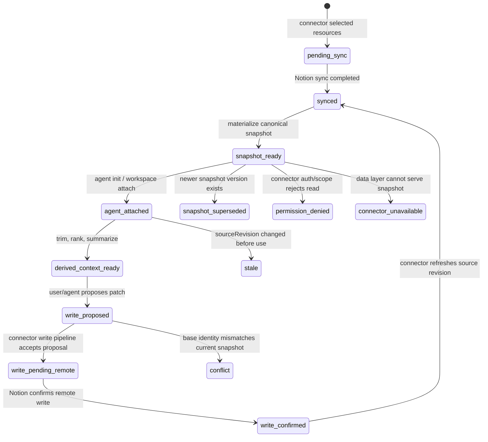
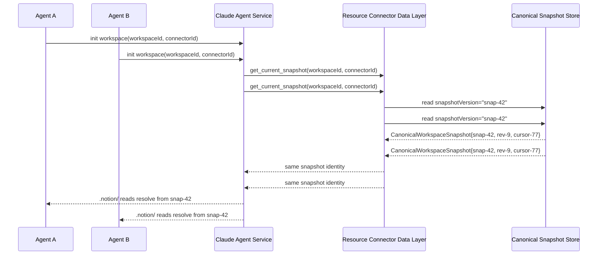
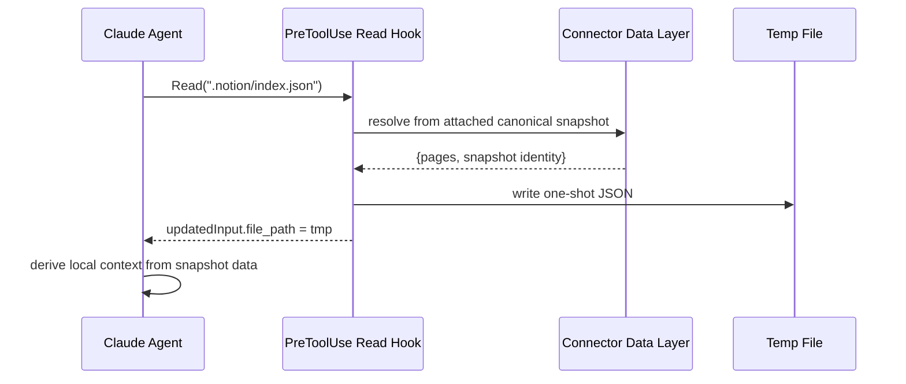
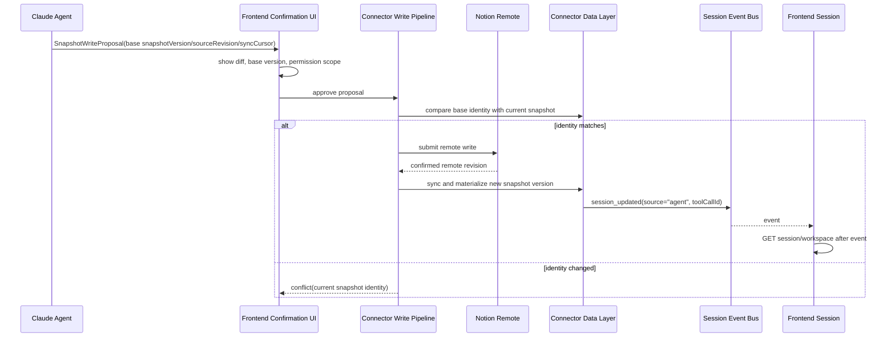

# Notion 交互快照生命周期设计

Status: Draft  
Updated: 2026-06-28  
Scope: 设计 + 方案代码合同 — Claude Agent 使用 Notion 资源连接器时的 canonical snapshot 生命周期

> [Input] `docs/design/notion-session/overview.md`,
>      `docs/design/notion-session/connector-interaction.md`,
>      `docs/design/claude-agent/notion-point/resource-connector-layer-design.md`,
>      `docs/design/claude-agent/notion-point/resource-connector-flowcharts.md`,
>      `docs/design/claude-agent/edit-point/workspace-adapter.md`,
>      `docs/design/claude-agent/edit-point/workspace-context.md`,
>      `docs/design/claude-agent/edit-point/workspace-switch.md`,
>      `backend/libs/claude_agent_kit/server/notion_snapshot.py`
> [Output] 定义 Notion 远程数据源 → 资源连接器数据层 → canonical snapshot → Agent 派生上下文的实际交互设计
> [Pos] interaction-snapshot-lifecycle in `docs/design/claude-agent/notion-point`
> [Sync] 2026-06-28: 初始设计 — 将 Notion 快照权威状态收敛到资源连接器数据层，避免 Agent 本地状态分叉。

---

## 1. 目标符合性判断

当前 `notion-session` 与 `notion-point` 概念稿已经覆盖连接器创建、认证、资源选择和 `.notion/` 虚拟索引，但存在一个会导致目标偏移的问题：

| 设计项 | 判断 | 调整 |
|---|---|---|
| 前端创建连接器、认证、选择资源 | 符合 MVP | 保留四步向导，不扩展多平台框架 |
| Agent 通过 `.notion/` 读取 | 符合交互习惯 | 读取来源改成 canonical snapshot |
| `notion_cache` / Agent 初始化时按需 lazy load | 不符合目标 | 移除为权威状态；只允许作为连接器数据层内部实现细节 |
| Agent 本地维护 Notion context | 不符合目标 | Agent 只能维护 derived context，不能成为 source of truth |
| 双向实时写回 | 过度设计 | 本期仅设计 proposal/write pipeline 边界，不接真实写入 |

当前目标：任意 Agent 在初始化访问同一个 `workspaceId + resourceConnectorId + snapshotVersion` 时，必须读取同一个由资源连接器数据层物化的 canonical snapshot。

---

## 2. Source Of Truth

Notion 是远程外部事实来源，但 Agent 不直接把远程返回值当成运行时权威状态。系统内部的权威状态是资源连接器数据层物化出的 canonical snapshot。

```
Notion Remote Source
  -> Connector Sync
  -> Resource Connector Data Layer
  -> CanonicalWorkspaceSnapshot
  -> Agent Derived Context
```

边界：

- `CanonicalWorkspaceSnapshot`：只读、版本化、可审计，由连接器数据层生成。
- `AgentDerivedContext`：Agent 本地裁剪、排序、摘要后的上下文视图，可以丢弃或重建。
- `SnapshotWriteProposal`：写入意图，必须携带 base snapshot identity，不直接修改 canonical snapshot。

方案代码合同见 `backend/libs/claude_agent_kit/server/notion_snapshot.py`。

---

## 3. 生命周期



状态含义：

| 状态 | 含义 | 用户可见反馈 |
|---|---|---|
| `pending_sync` | 已配置连接器，等待数据层同步 | 显示同步中，不允许 Agent 读取 Notion 内容 |
| `synced` | 远程数据已同步到连接器数据层 | 显示最近同步时间 |
| `snapshot_ready` | canonical snapshot 已物化 | 可开始对话 |
| `agent_attached` | Agent 初始化并绑定快照版本 | 显示 Agent 正在使用的版本 |
| `derived_context_ready` | Agent 完成本地裁剪/摘要 | 正常回答 |
| `write_proposed` | Agent 产生写入 proposal | 显示差异预览和确认点 |
| `write_pending_remote` | 连接器正在提交远程写入 | 显示提交中，禁止重复提交 |
| `write_confirmed` | Notion 确认写入成功 | 等待事件驱动刷新 |
| `snapshot_superseded` | 新版本已替代旧快照 | 提示刷新或继续基于旧版本只读查看 |
| `stale` | 当前快照落后远程版本 | 提示重新读取最新快照 |
| `conflict` | 写入基线不匹配 | 进入冲突处理，不自动覆盖 |
| `permission_denied` | Notion scope 不足或 token 失效 | 引导重新授权 |
| `connector_unavailable` | 数据层不可用 | 保留现有会话，提示稍后重试 |

---

## 4. 多 Agent 初始化一致性



约束：

- 同一 `snapshotVersion` 内的 `.notion/connector.json`、`.notion/index.json`、`.notion/databases/*.json`、`.notion/pages/*.json` 必须来自同一个 snapshot object。
- Agent 可以缓存 derived context，但下一轮初始化必须重新向连接器数据层请求当前 canonical snapshot。
- 不允许在 Agent 本地以 `notion_cache` 作为跨 Agent 权威缓存。

---

## 5. 读写交互

### 5.1 读路径



### 5.2 写路径



写入约束：

- Proposal 必须携带 `base_snapshot_version`、`base_source_revision`、`base_sync_cursor`。
- 远程 Notion 数据变化时，不允许自动覆盖，必须进入 `conflict`。
- 前端刷新必须复用已有 `session_updated source="agent"` 事件驱动机制；不得用固定 sleep。

---

## 6. 前端交互设计稿

MVP 信息架构：

```
Workspace panel
  Resource connectors
    Notion
      Status row: Connected / Needs auth / Syncing / Conflict
      Snapshot row: version, fetchedAt, sourceRevision
      Resource picker: Databases, standalone pages
      Actions: Connect, Sync now, Refresh snapshot, Disconnect

Chat / Agent panel
  Context banner
    "Using Notion snapshot snap-42 from 2026-06-28 14:10"
  Agent messages
  Tool proposal card
    Base snapshot identity
    Diff preview
    Approve / Reject / Refresh first
```

状态反馈：

| 状态 | 前端表现 | 可执行动作 |
|---|---|---|
| 未连接 | 空状态 + Connect Notion | `Connect Notion` |
| `pending_sync` | 进度行 + 禁用 Agent Notion 读取 | 等待 / 取消 |
| `snapshot_ready` | 显示资源数量和快照版本 | 开始对话 / 刷新 |
| `stale` | 黄色提示：已有新版本 | 刷新快照 |
| `conflict` | 差异卡片 + 当前/基线版本 | 重新生成 proposal |
| `permission_denied` | 授权错误卡片 | 重新授权 |
| `connector_unavailable` | 数据层不可用 | 重试 |

不过度设计边界：

- 不做全局多平台连接器市场。
- 不做 Notion block 级可视编辑器。
- 不做实时多人同步。
- 不做自动双向合并。

---

## 7. CLI 交互方案

本期 CLI 只作为工程调试和后端操作入口，不作为 Agent 直接调用的业务工具。

```bash
ink connector notion status --workspace <workspace-id> --connector <connector-id>
ink connector notion sync --workspace <workspace-id> --connector <connector-id>
ink connector notion snapshot show --workspace <workspace-id> --connector <connector-id>
ink connector notion snapshot read --workspace <workspace-id> --connector <connector-id> --path .notion/index.json
```

输出要求：

- 默认输出 JSON。
- 必须包含 `workspace_id`、`resource_connector_id`、`snapshot_version`、`source_revision`、`sync_cursor`、`fetched_at`。
- 错误输出使用稳定 code：`auth_expired`、`snapshot_not_ready`、`conflict`、`connector_unavailable`。

---

## 8. 方案代码边界

已落地的最小方案代码：

| 文件 | 作用 |
|---|---|
| `backend/libs/claude_agent_kit/server/notion_snapshot.py` | canonical snapshot 数据类、状态枚举、`.notion/` 虚拟路径解析、proposal stale 判断 |
| `backend/tests/test_notion_snapshot_contract.py` | 验证路径解析、快照数据提取、缺页语义和写入 proposal 版本判断 |

暂不落地：

- 不接入真实 Notion API。
- 不注册新 MCP 工具。
- 不改 `AgentRunOptions` 运行时字段。
- 不启动任务队列或定时调度。

这些边界让设计先可评审、可测试，再进入生产实现。
