# Resource Connector — 业务流程图

Status: Draft  
Updated: 2026-07-07
Scope: 设计 — 资源连接器全链路业务流程图（含四层交互泳道）

> [Input] `docs/design/notion-session/overview.md`,
>      `docs/design/notion-session/connector-interaction.md`,
>      `docs/design/claude-agent/notion-point/resource-connector-layer-design.md`
> [Output] 资源连接器各核心业务流程的 Mermaid 流程图与泳道图
> [Pos] resource-connector-flowcharts in `docs/design/claude-agent/notion-point`
> [Sync] 2026-06-22: 初始设计 — 业务流程图集
> [Sync] 2026-06-22: 迁移至 claude-agent/notion-point — 工作空间映射相关设计独立管理
> [Sync] 2026-06-28: 业务流程图收敛到 canonical snapshot 模型；Agent 消费不再以本地缓存/lazy load 作为权威数据来源。
> [Sync] 2026-07-07: 业务起点改为 Chat 入口页，下方 landing tabs 承载历史对话与连接器工作台。

---

## 目录

1. [全链路业务流程](#1-全链路业务流程)
2. [认证流程图](#2-认证流程图)
3. [数据同步流程图](#3-数据同步流程图)
4. [Agent 消费流程图](#4-agent-消费流程图)
5. [任务调度流程图](#5-任务调度流程图)
6. [四层协作泳道图](#6-四层协作泳道图)
7. [错误处理流程图](#7-错误处理流程图)
8. [状态转换全景图](#8-状态转换全景图)

---

## 1. 全链路业务流程

### 1.1 端到端流程概览

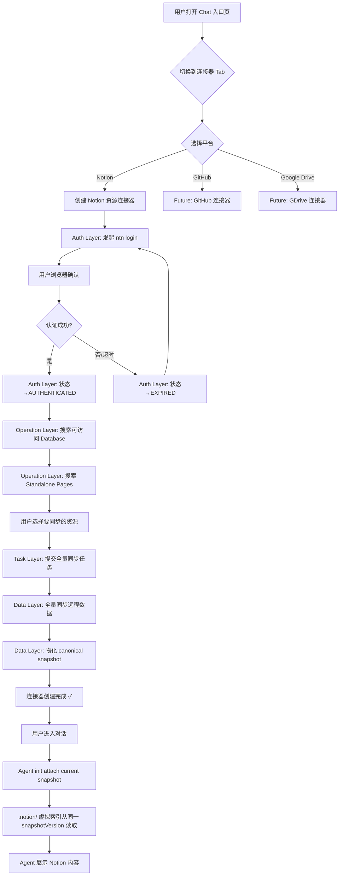

### 1.2 核心业务节点

| 节点 | 负责层 | 关键输出 |
|------|--------|---------|
| 创建连接器 | — | `resource_connectors` 表记录 |
| 认证 | Auth Layer | `AuthCredential` |
| 资源发现 | Operation Layer | Database/Page 列表 |
| 用户选择 | 前端 | `selected_databases` + `selected_pages` |
| 数据同步 | Task Layer + Data Layer | canonical snapshot |
| Agent 消费 | Data Layer | PreToolUse → attached snapshot |

---

## 2. 认证流程图

### 2.1 ntn login 认证时序

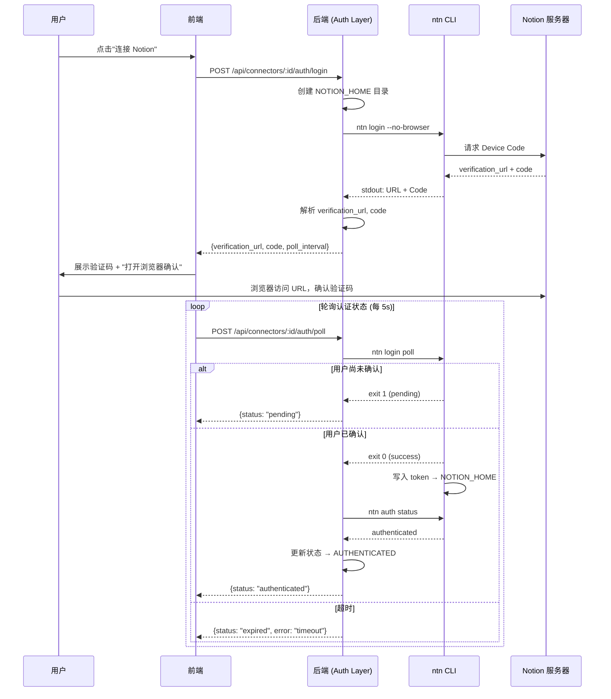

### 2.2 认证状态流转

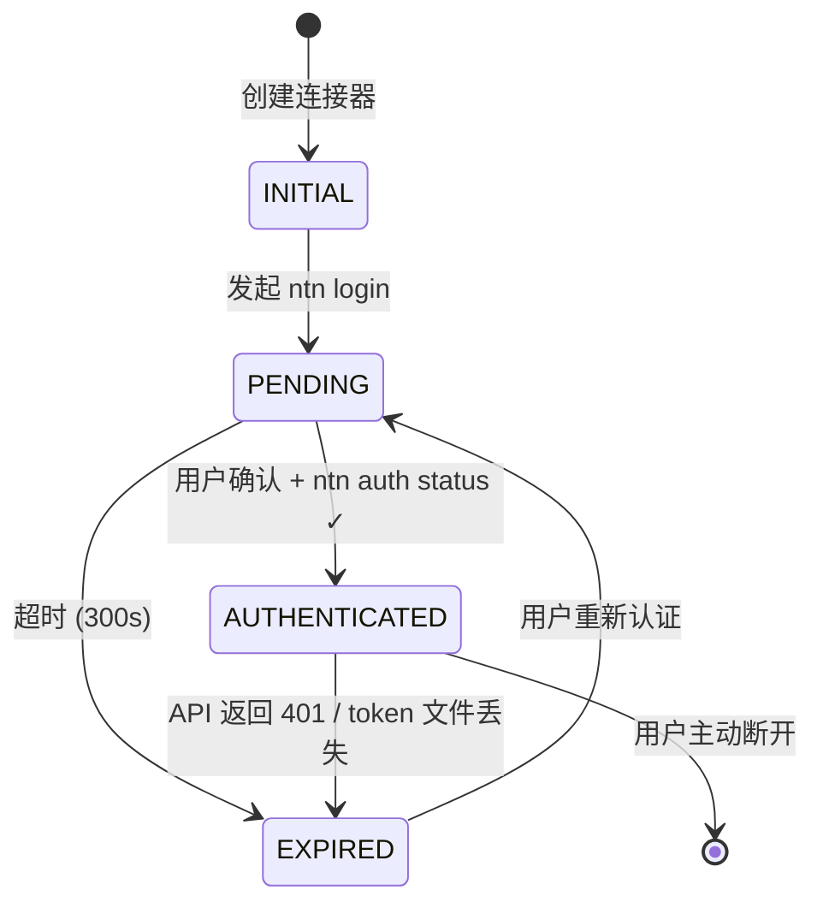

### 2.3 Token 刷新流程

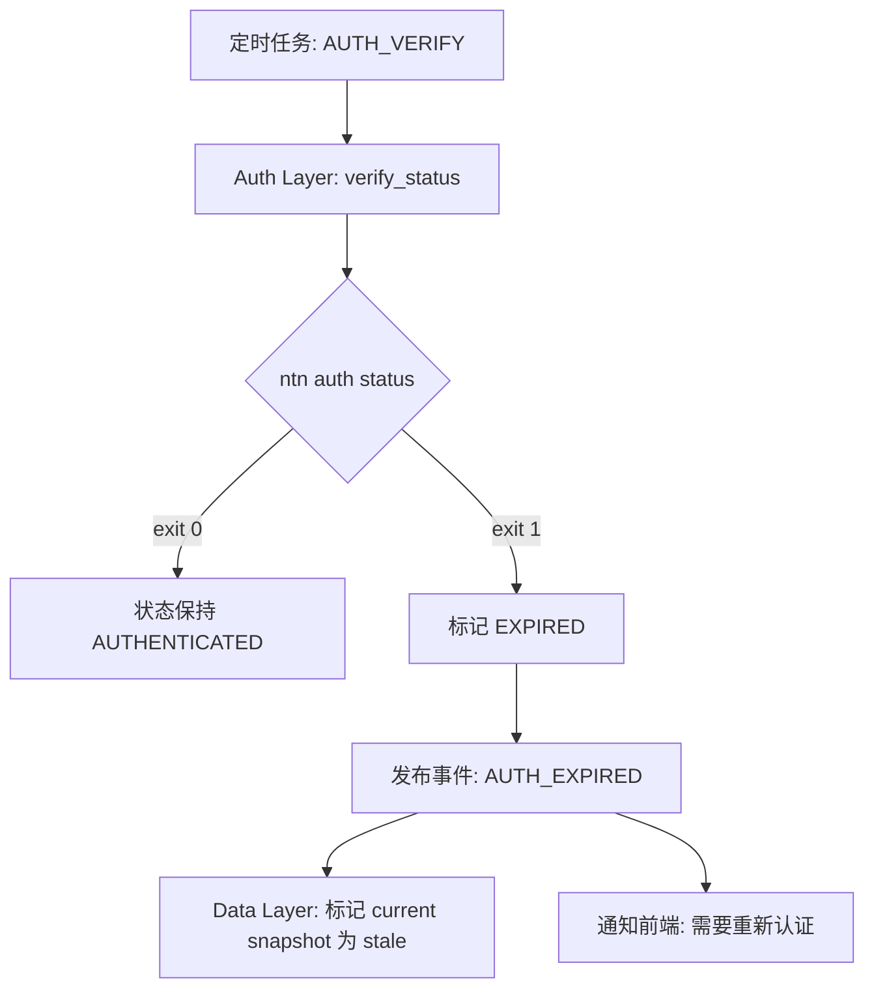

---

## 3. 数据同步流程图

### 3.1 全量同步流程

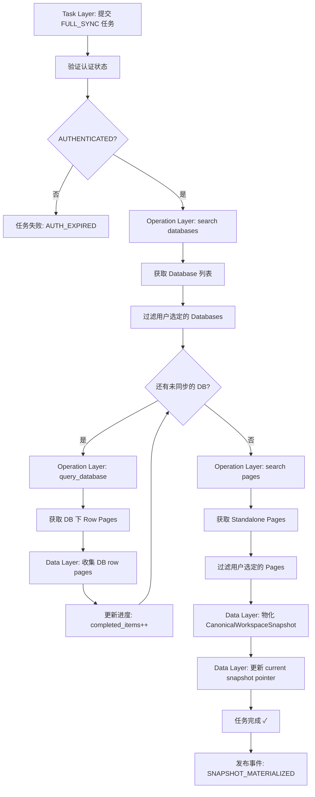

### 3.2 增量同步流程

```mermaid
flowchart TD
    A[Task Layer: 提交 INCREMENTAL_SYNC] --> B[加载 SyncCheckpoint]
    B --> C[Operation Layer: search 按 last_edited 排序]
    C --> D[比较 checkpoint.last_sync_at]
    D --> E{有变更页面?}

    E -->|否| F[更新 checkpoint.last_sync_at]
    F --> G[任务完成: 无变更]

    E -->|是| H[收集变更 page_id 列表]
    H --> I{变更数 > 阈值?}
    I -->|是 (>50%)| J[降级为全量同步]
    I -->|否| K[逐页同步变更]

    K --> L[Operation Layer: get changed pages]
    L --> M[Data Layer: 物化新 snapshotVersion]
    M --> N[旧 snapshot → snapshot_superseded]
    N --> O[更新 checkpoint/current pointer]
    O --> P[任务完成 ✓]
```

### 3.3 快照缺页处理

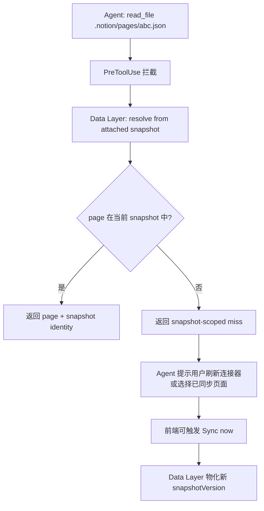

---

## 4. Agent 消费流程图

### 4.1 Workspace Init → .notion/ 初始化

```mermaid
flowchart TD
    A[用户进入对话] --> B[workspace.init_workspace]
    B --> C[_init_editor_index 现有逻辑]
    C --> D{connector 配置存在?}

    D -->|否| E[跳过 .notion/ 初始化]
    D -->|是| F{auth_status == AUTHENTICATED?}

    F -->|否| G[注入提示: "Notion 连接器需要重新认证"]
    F -->|是| H[创建 .notion/ 目录结构]

    H --> I[写入 README.md 引导文件]
    I --> J[写入占位 snapshot/index/databases JSON]
    J --> K[Service: attach current canonical snapshot]
    K --> L{snapshot_ready?}

    L -->|否| M[注入提示: 需要同步或重新认证]
    L -->|是| N[注入 workspace_context + snapshot identity]
```

### 4.2 Agent 对话中消费 Notion 数据

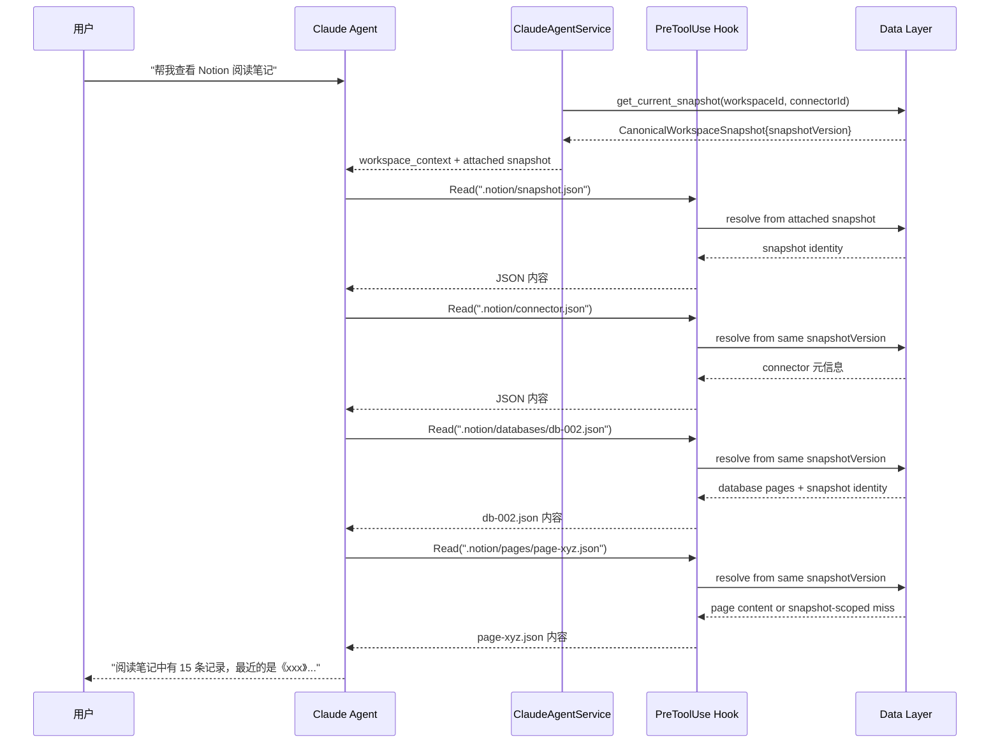

---

## 5. 任务调度流程图

### 5.1 定时任务注册与执行

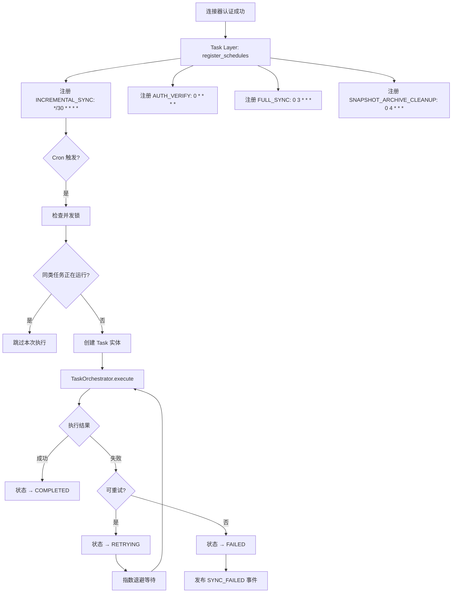

### 5.2 批量 Import 工作流

```mermaid
flowchart TD
    A[用户修改资源选择: 新增 Database] --> B[Task Layer: 提交 BATCH_IMPORT]
    B --> C[计算差异: 新增/移除的资源]
    C --> D{有新增资源?}

    D -->|是| E[并发控制: Semaphore(5)]
    E --> F[逐资源提交子任务]
    F --> G[Operation: query_database / get_page]
    G --> H[Data Layer: 收集资源内容]
    H --> I[更新进度: completed++]
    I --> J{所有子任务完成?}
    J -->|否| F
    J -->|是| K[物化新 canonical snapshot]

    D -->|有移除资源| L[Data Layer: 从新 snapshot 中移除资源]
    L --> M[旧 snapshot → snapshot_superseded]

    K --> N[任务完成]
    M --> N
```

---

## 6. 四层协作泳道图

### 6.1 创建连接器完整泳道

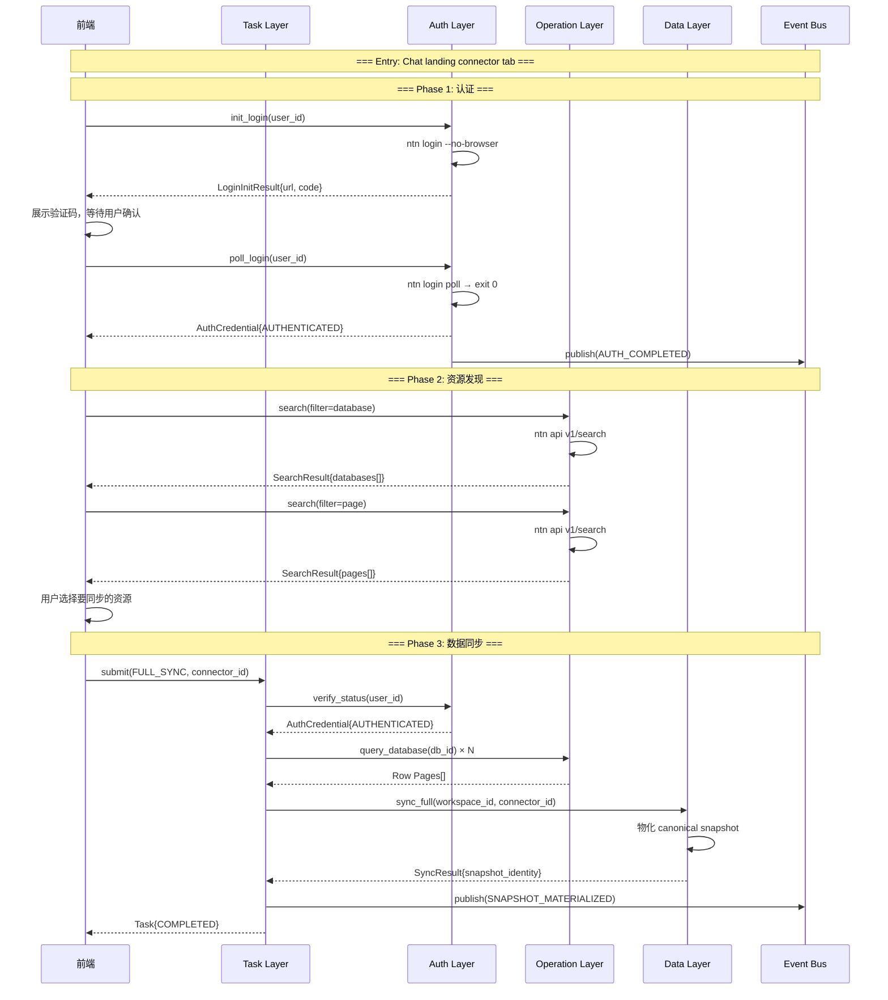

### 6.2 Agent 对话消费泳道

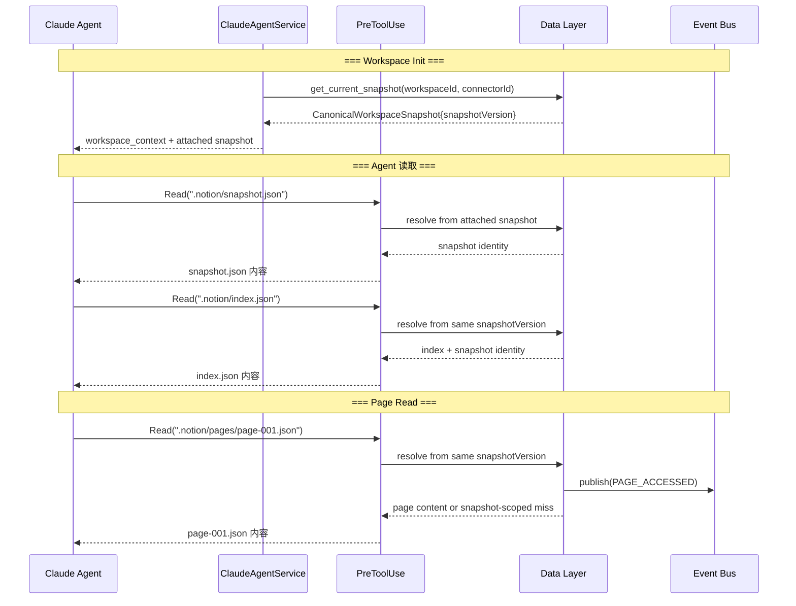

---

## 7. 错误处理流程图

### 7.1 统一错误处理策略

```mermaid
flowchart TD
    A[操作执行] --> B{返回结果}
    B -->|成功| C[正常流程]
    B -->|失败| D{错误类型判断}

    D -->|AuthTokenExpiredError| E[Auth Layer: 标记 EXPIRED]
    E --> F[Event Bus: AUTH_EXPIRED]
    F --> G[Data Layer: 标记 current snapshot stale]
    F --> H[通知前端: 需重新认证]

    D -->|RateLimitError| I{重试次数 < max?}
    I -->|是| J[指数退避等待]
    J --> K[retry_delay × 2^(retry_count)]
    K --> A
    I -->|否| L[任务失败: 限流超过最大重试]

    D -->|OperationTimeoutError| M{重试次数 < max?}
    M -->|是| J
    M -->|否| N[任务失败: 超时]

    D -->|ResourceNotFoundError| O[Data Layer: 物化移除该资源的新 snapshot]
    O --> P[旧 snapshot → snapshot_superseded]

    D -->|AuthCLINotFoundError| Q[返回友好错误]
    Q --> R[提示用户安装 ntn CLI]

    D -->|OperationConflictError| S[保持旧 snapshot 只读]
    S --> T[进入 conflict，要求刷新或重新生成 proposal]
```

### 7.2 认证降级策略

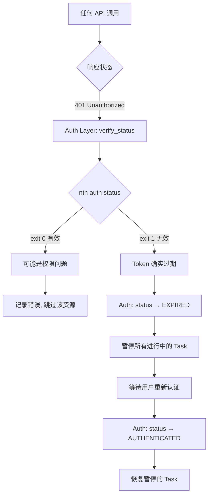

---

## 8. 状态转换全景图

### 8.1 连接器生命周期

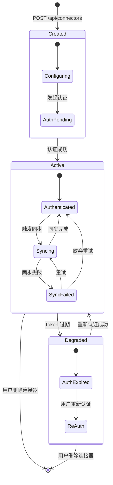

### 8.2 Snapshot 状态生命周期

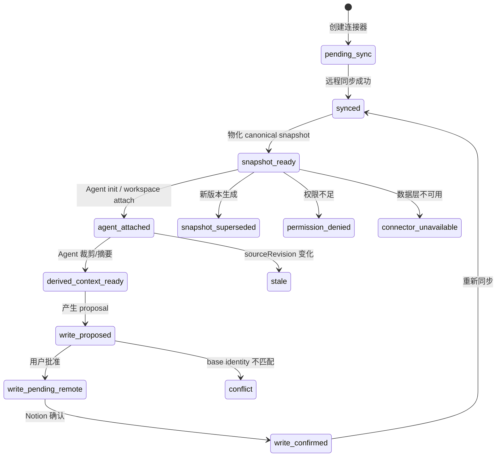

### 8.3 任务状态全景

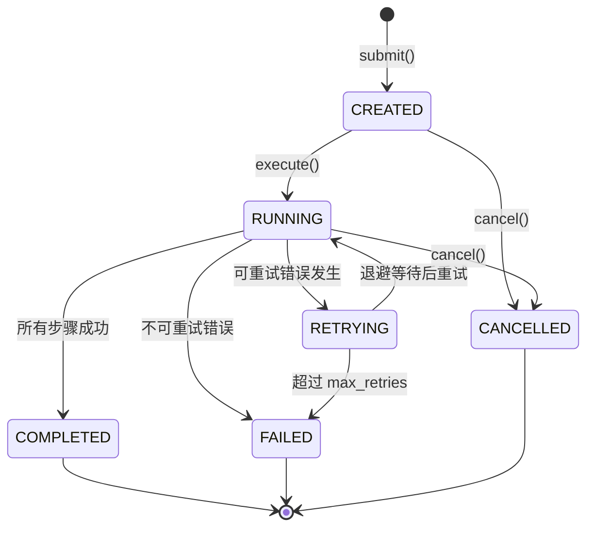

---

## 附录: 流程图索引

| 流程图 | 覆盖层 | 核心关注点 |
|--------|--------|-----------|
| 1.1 端到端概览 | 全部 | 用户视角的完整旅程 |
| 2.1 认证时序 | Auth | ntn login 协议细节 |
| 2.2 认证状态流转 | Auth | 状态机 |
| 2.3 Token 刷新 | Auth + Task | 定时校验 |
| 3.1 全量同步 | Task + Ops + Data | 同步工作流 |
| 3.2 增量同步 | Task + Data | 变更检测 |
| 3.3 快照缺页 | Data | snapshot-scoped miss |
| 4.1 Workspace Init | Data + Auth | 初始化 |
| 4.2 Agent 消费 | 全部 | Agent 读取链路 |
| 5.1 定时调度 | Task | Cron + 并发 |
| 5.2 批量 Import | Task + Ops + Data | 资源变更 |
| 6.1 创建泳道 | 全部 | 四层协作 |
| 6.2 消费泳道 | 全部 | 四层协作 |
| 7.1 错误处理 | 全部 | 统一错误策略 |
| 7.2 认证降级 | Auth + Task | 降级恢复 |
| 8.1 连接器生命周期 | 全部 | 全局状态 |
| 8.2 Snapshot 生命周期 | Data | 快照版本与冲突策略 |
| 8.3 任务状态 | Task | 任务管理 |

---
