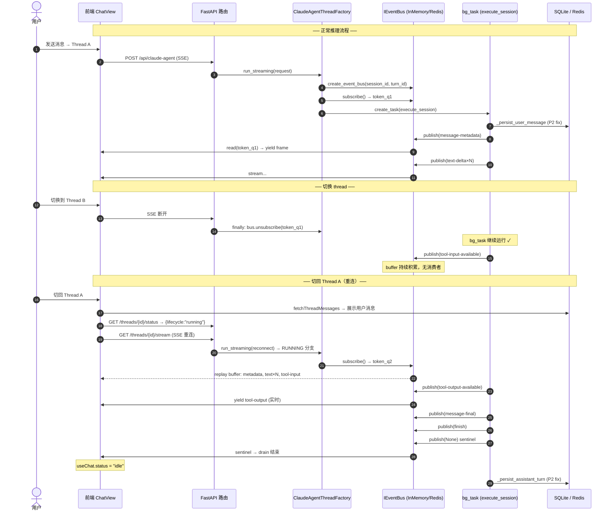

# SSE 断线重连与 EventBus 设计

> **版本**: 2026-06-09 v2.1 — Port/Adapter + 部署环境变量（`backend/.env.example` § EventBus）  
> **关联文件**: `backend/claude_agent/thread_factory.py`, `backend/claude_agent/thread_pool.py`,  
> `backend/claude_agent/event_bus.py`（新建），`frontend/src/components/chat/ChatView.tsx`

---

## 1. 现状问题诊断

### 1.1 核心症结：SSE 消费者生命周期与后端任务生命周期耦合

```
当前架构（错误）:
┌─────────────┐   SSE 断开   ┌─────────────────────────────────┐
│  前端 ChatPanel│ ──────────→ │ run_streaming.finally:           │
│  (组件卸载)   │             │   bg_task.cancel()   ← 错误！    │
└─────────────┘             │   state.mark_idle()              │
                             └─────────────────────────────────┘
```

| 步骤 | 用户操作 | 前端 | 后端 |
|------|---------|------|------|
| 1 | 发送消息到 Thread A | ChatPanel 建立 SSE 连接 | bg_task RUNNING |
| 2 | 切换到 Thread B | Thread A 的 ChatPanel 卸载 → SSE 断开 | `bg_task.cancel()` → 推理中断 |
| 3 | 切回 Thread A | 重新挂载 ChatPanel | state.lifecycle = IDLE（已取消）|
| 4 | 用户看到 | 消息列表空白 / 停止状态 | — |

**根本原因**：`run_streaming.finally` 无条件调用 `bg_task.cancel()`，SSE 断开 = 推理取消。

### 1.2 单 Queue 单消费者的结构性缺陷

```
当前模型（asyncio.Queue 单生产者 + 单消费者）:

execute_session ──put──→ asyncio.Queue ──get──→ _drain_queue ──yield──→ SSE 流

问题：消费者断开后，Queue 中帧被永久丢弃；新消费者接入时无法获取历史帧。
```

---

## 2. 设计目标

| 目标 | 说明 |
|------|------|
| **后台继续运行** | 前端断开 SSE 不取消 bg_task |
| **断线重连** | 前端切回 Running Thread，重新接入 SSE 数据流并回放历史帧 |
| **历史帧回放** | 新消费者接入时，从本轮 `message-metadata` 起全量回放 |
| **正确 lifecycle 显示** | 前端展示真实 RUNNING 状态，而非"已停止" |
| **MQ 适配性** | 支持替换为 Redis Streams / RabbitMQ 等消息队列后端 |
| **向后兼容** | `execute_session` callback 代码不改动 |

---

## 3. 架构层次：Port / Adapter 模式

### 3.1 分层总览

```
┌─────────────────────────────────────────────────────────────────────┐
│                        ClaudeAgentThreadFactory                      │
│                   (编排者 — 不感知后端实现)                            │
└────────────────────────────┬────────────────────────────────────────┘
                             │ 依赖抽象
                ┌────────────▼────────────┐
                │   IEventBus  (Port)      │
                │  + publish(frame)        │
                │  + subscribe() → token   │
                │  + unsubscribe(token)    │
                │  + is_done: bool         │
                └──────┬─────────┬────────┘
                       │         │
          ┌────────────▼──┐  ┌───▼─────────────────┐
          │InMemoryEventBus│  │  RedisStreamEventBus │  (future: RabbitMQ…)
          │(asyncio-based) │  │  (Redis Streams)     │
          │ 开发 / 单实例   │  │  生产 / 多实例        │
          └────────────────┘  └──────────────────────┘
```

**Port（接口）** 定义稳定的发布-订阅语义；  
**Adapter（适配器）** 封装具体队列技术的细节；  
**Factory（工厂方法）** 按 `INK_AGENT_EVENT_BUS_BACKEND` 环境变量选择实现。

---

## 4. Port 定义：IEventBus

```python
# backend/claude_agent/event_bus.py

from __future__ import annotations
import asyncio
import os
from abc import ABC, abstractmethod
from typing import AsyncIterator, Optional


class IEventBus(ABC):
    """SSE 事件广播总线 Port（稳定接口，不依赖具体队列实现）。

    语义契约
    --------
    - ``publish(frame)``   — 生产者写入一帧（None = sentinel，流结束标记）。
    - ``subscribe()``      — 消费者订阅，返回不透明 token；
                             内部先回放历史帧，再实时接收后续帧。
    - ``unsubscribe(tok)`` — 消费者取消订阅（断线时调用，不影响 bg_task）。
    - ``read(tok)``        — 异步迭代器，yield 订阅后的帧，直到 sentinel。
    - ``is_done``          — True 表示 sentinel 已 publish（流已完成）。
    """

    @abstractmethod
    async def publish(self, frame: Optional[str]) -> None: ...

    @abstractmethod
    async def subscribe(self) -> object:
        """返回订阅 token（类型由实现决定）。"""
        ...

    @abstractmethod
    async def unsubscribe(self, token: object) -> None: ...

    @abstractmethod
    def read(self, token: object) -> AsyncIterator[str]:
        """返回异步迭代器，逐帧 yield 直到 sentinel。"""
        ...

    @property
    @abstractmethod
    def is_done(self) -> bool: ...


def create_event_bus(session_id: str, turn_id: str) -> IEventBus:
    """工厂方法：按环境变量选择 EventBus 实现。

    INK_AGENT_EVENT_BUS_BACKEND:
        memory  — InMemoryEventBus（默认，开发 / 单实例）
        redis   — RedisStreamEventBus（生产多实例）
    """
    backend = (os.getenv("INK_AGENT_EVENT_BUS_BACKEND") or "memory").lower()
    if backend == "redis":
        from claude_agent.event_bus_redis import RedisStreamEventBus
        return RedisStreamEventBus(session_id, turn_id)
    return InMemoryEventBus()
```

---

## 5. Adapter A：InMemoryEventBus（当前默认）

```python
# backend/claude_agent/event_bus.py（续）

from dataclasses import dataclass, field


@dataclass
class InMemoryEventBus(IEventBus):
    """基于 asyncio.Queue 的内存广播总线（单进程，开发 / 单实例部署）。

    断线重连语义：
      旧消费者断开  → unsubscribe(token)，仅移除 queue，bg_task 继续
      新消费者接入  → subscribe() 回放 buffer[] + 加入 subscribers
    """
    _buffer: list[Optional[str]] = field(default_factory=list)
    _subscribers: list[asyncio.Queue] = field(default_factory=list)
    _done: bool = False
    _lock: asyncio.Lock = field(default_factory=asyncio.Lock)

    async def publish(self, frame: Optional[str]) -> None:
        async with self._lock:
            self._buffer.append(frame)
            if frame is None:
                self._done = True
            for q in list(self._subscribers):
                await q.put(frame)

    async def subscribe(self) -> asyncio.Queue:
        q: asyncio.Queue = asyncio.Queue()
        async with self._lock:
            for frame in self._buffer:          # 回放历史帧
                await q.put(frame)
            if not self._done:
                self._subscribers.append(q)     # 注册实时消费者
        return q

    async def unsubscribe(self, token: asyncio.Queue) -> None:
        async with self._lock:
            try:
                self._subscribers.remove(token)
            except ValueError:
                pass

    async def read(self, token: asyncio.Queue) -> AsyncIterator[str]:
        while True:
            try:
                frame = await asyncio.wait_for(token.get(), timeout=15.0)
                if frame is None:
                    break
                yield frame
            except asyncio.TimeoutError:
                yield ": keepalive\n\n"   # SSE 心跳，防止代理超时

    @property
    def is_done(self) -> bool:
        return self._done
```

---

## 6. Adapter B：RedisStreamEventBus（生产多实例）

```python
# backend/claude_agent/event_bus_redis.py（新建）

"""RedisStreamEventBus — 基于 Redis Streams 的分布式 EventBus Adapter。

适用场景：
  - 多 Worker / 多 Pod 部署（不同 Worker 可接入同一 session 的 bus）
  - 需要持久化 SSE 历史（Redis Stream 自带有序存储）
  - 跨进程重连（新 Worker 可回放旧 Worker 产生的历史帧）

依赖：
  pip install redis[hiredis] asyncio  (redis-py >= 5.0 支持 async)

Redis 键约定：
  ink:sse:{session_id}:{turn_id}    — Stream key（每 turn 一个）
  TTL: INK_AGENT_EVENT_BUS_TTL_S  （默认 3600s）
"""

from __future__ import annotations
import asyncio, json, os, uuid
from typing import AsyncIterator, Optional

from claude_agent.event_bus import IEventBus

_REDIS_URL = os.getenv("INK_AGENT_REDIS_URL", "redis://localhost:6379/0")
_STREAM_TTL = int(os.getenv("INK_AGENT_EVENT_BUS_TTL_S", "3600") or "3600")
_SENTINEL_PAYLOAD = "__sentinel__"
_BLOCK_MS = 5000   # XREAD BLOCK 超时（毫秒），超时后发 keepalive


class RedisStreamEventBus(IEventBus):
    """Redis Streams 实现的分布式 EventBus。

    - publish: XADD ink:sse:{session}:{turn} * frame <data>
    - subscribe: XRANGE 回放历史 + XREAD BLOCK 实时读取
    - unsubscribe: 取消读取协程（不影响 Stream 本身）
    - TTL: EXPIRE 自动清理
    """

    def __init__(self, session_id: str, turn_id: str) -> None:
        self._stream_key = f"ink:sse:{session_id}:{turn_id}"
        self._done_flag = False

    # ------------------------------------------------------------------
    # 内部：懒加载 Redis 连接
    # ------------------------------------------------------------------
    _redis_client = None

    @classmethod
    async def _redis(cls):
        if cls._redis_client is None:
            import redis.asyncio as aioredis  # type: ignore
            cls._redis_client = aioredis.from_url(_REDIS_URL, decode_responses=True)
        return cls._redis_client

    # ------------------------------------------------------------------
    # IEventBus 实现
    # ------------------------------------------------------------------

    async def publish(self, frame: Optional[str]) -> None:
        r = await self._redis()
        payload = frame if frame is not None else _SENTINEL_PAYLOAD
        await r.xadd(self._stream_key, {"frame": payload})
        await r.expire(self._stream_key, _STREAM_TTL)
        if frame is None:
            self._done_flag = True

    async def subscribe(self) -> str:
        """返回 consumer_id（UUID 字符串）作为 token。"""
        return str(uuid.uuid4())

    async def unsubscribe(self, token: str) -> None:
        # Redis Streams 无状态消费者，无需清理
        pass

    async def read(self, token: str) -> AsyncIterator[str]:
        r = await self._redis()
        # 1. 回放历史帧（XRANGE 全量）
        entries = await r.xrange(self._stream_key)
        for _id, data in entries:
            frame = data.get("frame")
            if frame == _SENTINEL_PAYLOAD:
                return
            yield frame

        # 2. 实时读取新帧（XREAD BLOCK）
        last_id = entries[-1][0] if entries else "0-0"
        while True:
            results = await r.xread(
                {self._stream_key: last_id}, count=50, block=_BLOCK_MS
            )
            if not results:
                yield ": keepalive\n\n"
                continue
            for _stream, msgs in results:
                for msg_id, data in msgs:
                    last_id = msg_id
                    frame = data.get("frame")
                    if frame == _SENTINEL_PAYLOAD:
                        return
                    yield frame

    @property
    def is_done(self) -> bool:
        return self._done_flag
```

---

## 7. AgentRunState 新增字段

```python
# backend/claude_agent/thread_pool.py（修改）

from claude_agent.event_bus import IEventBus

@dataclass
class AgentRunState:
    ...
    # 当前推理 turn 的 SSE 广播总线（RUNNING 时非 None，每轮重建）
    # 类型为抽象接口 IEventBus，与具体后端无关
    event_bus: Optional[IEventBus] = field(default=None, repr=False)
    # 当前推理 turn 的唯一 ID（用于 Redis Stream key 区分不同轮次）
    current_turn_id: str = field(default_factory=lambda: str(uuid4()))
```

**生命周期**：

| 时机 | 操作 |
|------|------|
| Phase 3 开始前（`state.mark_running()` 之后）| `state.event_bus = create_event_bus(session_id, turn_id)` |
| Phase 3 结束（`state.mark_idle()`）| `state.event_bus = None`；`state.current_turn_id` 在下轮重建 |

---

## 8. thread_factory.py 改造

### 8.1 run_streaming 新流程

```python
async def run_streaming(self, request: ClaudeAgentRunRequest) -> AsyncGenerator[str, None]:
    session_id = build_session_id(request)
    lock = self._pool.get_lock(session_id)

    async with lock:
        state = self._pool.get_or_create(session_id)

        # ── 重连分支：session 正在运行 ──────────────────────────────────
        if state.lifecycle == AgentRunLifecycle.RUNNING and state.event_bus is not None:
            bus = state.event_bus
            token = await bus.subscribe()
            try:
                async for frame in bus.read(token):
                    yield frame
            finally:
                await bus.unsubscribe(token)
            return   # ← 重连流程结束，不启动新推理
        # ───────────────────────────────────────────────────────────────

        # ── 新推理轮次 ──────────────────────────────────────────────────
        state.mark_running()
        bus = create_event_bus(session_id, state.current_turn_id)
        state.event_bus = bus

        # 订阅 bus（发起者也是第一个消费者）
        token = await bus.subscribe()

        # Phase 1 & 2: 上下文组装 + Runner 创建
        ...
        execution = await self._service.assemble_context(request, state=state, bus=bus)

        # Phase 3: 后台执行
        bg_task = asyncio.create_task(
            self._service.execute_session(execution),
            name=f"claude-agent-session-{session_id}",
        )

        try:
            async for frame in bus.read(token):
                yield frame
        finally:
            await bus.unsubscribe(token)
            # ✅ 关键：断开 SSE 时不取消 bg_task
            # bg_task 继续运行直到自然结束（publish sentinel）或 close_thread
            if bus.is_done and not bg_task.done():
                # bus 已完成但 task 未结束（异常情况），才取消
                bg_task.cancel()
                try:
                    await bg_task
                except (asyncio.CancelledError, Exception):
                    pass
            state.mark_idle()
            state.event_bus = None
```

### 8.2 execute_session 适配（Proxy Queue 方案）

`execute_session` 内部的所有 `await queue.put(frame)` 保持不变；  
在 `assemble_context` 里创建一个 **BusProxyQueue**，将 `put` 转发到 `bus.publish`：

```python
class BusProxyQueue:
    """将 asyncio.Queue.put() 语义转发到 IEventBus.publish()。

    execute_session 及其 callbacks 无需改动，只需把
    _TurnContext.queue 替换为 BusProxyQueue 实例。
    """
    def __init__(self, bus: IEventBus) -> None:
        self._bus = bus

    async def put(self, frame: Optional[str]) -> None:
        await self._bus.publish(frame)

# 在 assemble_context 内：
proxy_queue = BusProxyQueue(bus)
turn_ctx = _TurnContext(queue=proxy_queue, ...)
```

这样 **callbacks 代码零改动**，所有 `queue.put(frame)` 自动广播到 bus。

---

## 9. 前端改造

### 9.1 重连流程（取代 banner）

```
ChatView.useEffect(activeThreadId):
  1. fetchThreadMessages(threadId)       → 立即渲染历史消息（P2 fix 保证用户消息已入库）
  2. fetchThreadStatus(threadId)         → 检查 lifecycle
  3. 若 lifecycle == "running":
       → 立即建立 SSE 重连请求（reconnect=true）
       → 后端 subscribe EventBus → 回放历史帧 + 实时推流
       → useChat.status = "streaming"  （正常渲染）
     若 lifecycle != "running":
       → 仅展示历史消息，不建立 SSE 连接
```

### 9.2 重连请求协议

新增路由（推荐方案 A，职责明确）：

```
GET /api/claude-agent/threads/{thread_id}/stream
```

- 无 body，纯 SSE 重连
- 后端检查 `state.lifecycle == RUNNING`：是 → subscribe bus，否 → 404
- 前端通过原生 `EventSource` 订阅（与 useChat transport 并行）

或扩展现有接口（方案 B，最小改动）：

```typescript
// ClaudeAgentRequestBody 新增字段
reconnect?: boolean   // true = 不发新消息，仅重连 SSE
```

### 9.3 移除 isRunningBackground banner

`ChatPanel` 中的"后台推理中"横幅改为真实 SSE 重连，前端 `isRunningBackground` 状态变量和相关 UI 代码可删除。

---

## 10. 完整数据流时序图



---

## 11. 部署配置

### 11.1 环境变量

| 变量 | 默认值 | 说明 |
|------|--------|------|
| `INK_AGENT_EVENT_BUS_BACKEND` | `memory` | EventBus 后端：`memory`（进程内 asyncio）或 `redis`（Redis Streams，多 Worker/Pod） |
| `INK_AGENT_REDIS_URL` | `redis://localhost:6379/0` | Redis 连接 URL；仅 `INK_AGENT_EVENT_BUS_BACKEND=redis` 时生效 |
| `INK_AGENT_EVENT_BUS_TTL_S` | `3600` | Redis Stream key 过期时间（秒）；仅 redis 模式生效 |
| `INK_AGENT_SSE_KEEPALIVE_S` | `15` | SSE 空闲 keepalive 注释帧间隔（秒）；`service.py` 与 `InMemoryEventBus.read()` 共用 |

**配置来源（单一真相）**

- 模板：`backend/.env.example`（EventBus 段位于 `INK_AGENT_CONTEXT_SESSIONS` 之后）
- 运行时加载：`backend/server.py` 在 import 路由前 `load_dotenv(backend/.env)`；`_drop_unsupported_agent_env()` 白名单保留上述 `INK_AGENT_*` 键
- 工厂入口：`backend/claude_agent/event_bus.py::create_event_bus()` 读取 `INK_AGENT_EVENT_BUS_BACKEND`
- Redis 适配器：`backend/claude_agent/event_bus_redis.py` 读取 `INK_AGENT_REDIS_URL` / `INK_AGENT_EVENT_BUS_TTL_S`

**`backend/.env.example` 片段**

```dotenv
# SSE EventBus backend for Claude Agent stream reconnect (memory | redis).
# memory: single-process InMemoryEventBus (default, no extra deps).
# redis:  RedisStreamEventBus for multi-worker / multi-pod deployments.
INK_AGENT_EVENT_BUS_BACKEND=memory

# Redis connection URL — required when INK_AGENT_EVENT_BUS_BACKEND=redis.
INK_AGENT_REDIS_URL=redis://localhost:6379/0

# Redis Stream key TTL (seconds) for per-turn event buffers.
INK_AGENT_EVENT_BUS_TTL_S=3600
```

**行为说明**

| `INK_AGENT_EVENT_BUS_BACKEND` | 依赖 | 适用场景 |
|------------------------------|------|---------|
| `memory`（默认）| 无 | 开发、单机、单 uvicorn worker |
| `redis` | `redis` PyPI 包 + 可连通的 Redis | 多 Worker（`uvicorn -w N`）、K8s 多 Pod |

- `redis` 模式下若 `redis-py` 未安装或 import 失败，`create_event_bus()` **降级**为 `InMemoryEventBus` 并打 warning 日志。
- `INK_AGENT_SSE_KEEPALIVE_S` 控制消费者长时间无事件时发送的 `: keepalive\n\n` 注释帧，避免代理/负载均衡因空闲断开 SSE。

### 11.2 部署选型矩阵

| 场景 | 推荐后端 | 理由 |
|------|---------|------|
| 开发环境 / 单机 | `InMemoryEventBus` | 零依赖，asyncio 原生 |
| 生产单实例 | `InMemoryEventBus` | 单进程内 bus 可靠 |
| 生产多 Worker（uvicorn -w N）| `RedisStreamEventBus` | 不同 Worker 可共享同一 stream |
| 生产多 Pod（K8s）| `RedisStreamEventBus` | 跨 Pod 重连唯一依赖 Redis |

---

## 12. 实现文件清单

| 文件 | 变更类型 | 说明 |
|------|---------|------|
| `backend/claude_agent/event_bus.py` | **新建** | `IEventBus` (Port) + `InMemoryEventBus` + `create_event_bus` 工厂 |
| `backend/claude_agent/event_bus_redis.py` | **新建** | `RedisStreamEventBus` Adapter |
| `backend/claude_agent/thread_pool.py` | 修改 | `AgentRunState` 新增 `event_bus`, `current_turn_id` 字段 |
| `backend/claude_agent/thread_factory.py` | 修改 | `run_streaming` 重连分支；`finally` 改为仅 unsubscribe |
| `backend/claude_agent/service.py` | 修改 | `assemble_context` 接受 `bus` 参数；`_TurnContext.queue` → `BusProxyQueue` |
| `backend/routers/claude_agent.py` | 修改 | 新增 `GET /threads/{id}/stream` 重连端点 |
| `frontend/src/components/chat/ChatView.tsx` | 修改 | status=running → SSE 重连，移除 banner 逻辑 |
| `frontend/src/components/chat/ChatPanel.tsx` | 修改 | 移除 `isRunningBackground` prop 和 banner |

---

## 13. 实现优先级

| 优先级 | 任务 | 落地文件 |
|--------|------|---------|
| P0 | `IEventBus` + `InMemoryEventBus` + `create_event_bus` | `event_bus.py` |
| P0 | `BusProxyQueue`，`assemble_context` 接受 `bus` 参数 | `service.py` |
| P0 | `AgentRunState.event_bus`；`run_streaming` 重连分支 | `thread_pool.py`, `thread_factory.py` |
| P0 | `finally` 改为 unsubscribe（不取消 bg_task）| `thread_factory.py` |
| P1 | `GET /threads/{id}/stream` 端点 | `routers/claude_agent.py` |
| P1 | 前端 `ChatView` 重连（status=running → SSE 重连）| `ChatView.tsx` |
| P1 | 移除 `isRunningBackground` banner | `ChatPanel.tsx`, `ChatView.tsx` |
| P2 | `RedisStreamEventBus` Adapter | `event_bus_redis.py` |
| P2 | Stop 按钮（`/threads/{id}/stop` 端点）| `routers/claude_agent.py` |

---

## 14. 关键边界条件

| 边界 | 处理方式 |
|------|---------|
| 重连时 bus 已完成（`is_done=True`）| `subscribe()` 回放全部 buffer（含 sentinel），read() 立即结束 |
| 多个标签页同时连接同一 thread | 各自 `subscribe()` 获取独立 token，正常广播 |
| 重连时发送了新消息（非 reconnect）| Factory Lock 串行排队，等 RUNNING 结束后开始新轮 |
| bg_task 因异常退出 | `publish(error_frame)` + `publish(None)`，消费者正常收到 finish |
| Redis 连接失败 | `create_event_bus` fallback 到 `InMemoryEventBus`（可配置）|
| 用户主动 Stop | 调用 `/threads/{id}/stop` → Factory 取消 bg_task → bus 发 error + sentinel |
