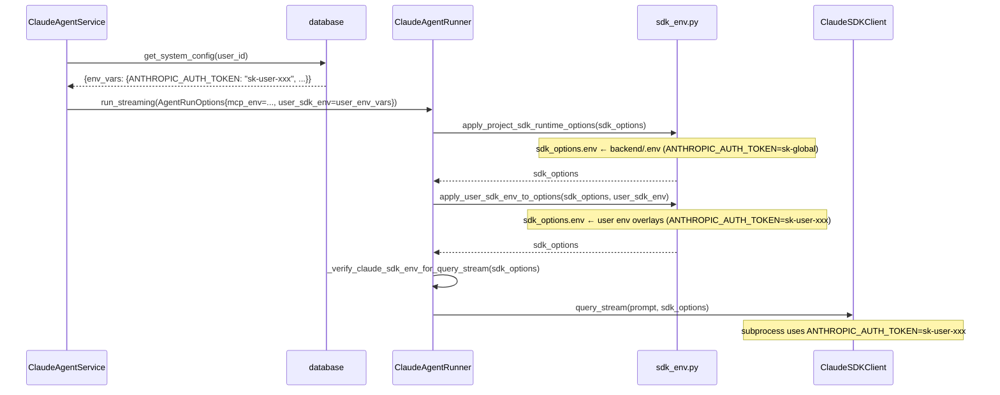

> **关联文档**: [ClaudeSDKClient 项目 env 注入方案设计](./claude-sdk-env-design.md)
> **[Sync] 2026-05-27**: 新增 — 按用户存储的 env 变量注入 Claude SDK 子进程方案。
> **[Sync] 2026-06-22**: Settings 入口收束 — 用户环境变量控件只在 Workspace Mode 开启时显示，因为该配置面向 workspace runtime / Skills / MCP 工具上下文。

# 按用户存储的 SDK Env 注入方案设计

> **落地路径**: `backend/libs/claude_agent_kit/`, `backend/claude_agent/service.py`
> **影响入口**: `sdk_env.py`、`AgentRunOptions`、`ClaudeAgentRunner.run_streaming()`、`ClaudeAgentService`
> **目标**: 用户通过 Settings 页面存储的 `env_vars`（如 `ANTHROPIC_AUTH_TOKEN`、`ANTHROPIC_BASE_URL`）能够在该用户的 Claude SDK 子进程中生效，实现多用户独立 API 密钥/模型配置隔离。

---

## 1. 背景与问题描述

### 1.1 现有架构回顾

`claude-sdk-env-design.md` 描述了从 `backend/.env` 向 Claude SDK 子进程注入全局 env 的机制：

1. `sdk_env.py::apply_project_sdk_runtime_options()` 读取 `backend/.env`，过滤 `_PROJECT_DOTENV_SDK_ENV_NAMES` 白名单 key，合并到 `ClaudeAgentOptions.env`。
2. `ClaudeAgentRunner.run_streaming()` 在构造 `sdk_options` 后调用此 helper，再传给 `_sdk_client.query_stream()`。

### 1.2 现存缺口

`ClaudeAgentService` 已从数据库加载用户级 `env_vars`（`database.get_system_config(user_id)["env_vars"]`），并以 `mcp_env` 字段传入 `AgentRunOptions`。但 `mcp_env` 目前**仅**用于 MCP 子进程（memory、necklace），**未注入** `ClaudeAgentOptions.env`。

影响后果：

- 用户在 Settings 页面配置自己的 `ANTHROPIC_AUTH_TOKEN` 或 `ANTHROPIC_BASE_URL`，但这些值 **不** 进入 Claude SDK 子进程，仍使用全局 `backend/.env` 的凭据。
- 多用户场景无法实现：所有用户共用同一个 `ANTHROPIC_AUTH_TOKEN`，无法为不同用户绑定不同 API 密钥或不同 Claude 端点。

### 1.3 本文目标

扩展现有注入链，在 `apply_project_sdk_runtime_options()` 之后再叠加用户级 env，使用户存储的 SDK 相关 env 变量最终进入 `ClaudeAgentOptions.env`，并优先于全局 `backend/.env`。

---

## 2. 设计目标与非目标

### 2.1 目标

- 用户通过 `PUT /api/system-config` 存储的 `env_vars` 中属于 `_PROJECT_DOTENV_SDK_ENV_NAMES` 白名单的 key，在该用户发起的 Claude Agent 会话中注入 `ClaudeAgentOptions.env`。
- Settings UI 只在 Workspace Mode 开启时显示 `env_vars` 控件；关闭时保留已保存值但不显示编辑入口。
- 用户 env 优先级高于 `backend/.env`，但低于调用方显式传入的 `options.env`（如测试场景）。
- 不允许用户通过 `env_vars` 注入白名单以外的 env key 进入 SDK 子进程。
- 不把任何 env 值写入日志、SSE 响应或错误信息。
- `AgentRunOptions` 增加 `user_sdk_env` 字段，与现有 `mcp_env` 字段语义正交。
- Thread Session 享元复用路径和标准路径都得到覆盖。

### 2.2 非目标

- 不允许用户通过 `env_vars` 注入非 SDK 相关 key（如 `DATABASE_URL`、`SECRET_KEY`）。
- 不改变 `mcp_env` 的用途和路径（仍只用于 MCP 子进程）。
- 不修改 `SimpleClaudeAgentSDKClient` 层（runner 层处理即可覆盖唯一真实路径）。
- 不把 `user_sdk_env` 写入 `os.environ`。

---

## 3. 方案设计

### 3.1 优先级链

叠加顺序（低 → 高，后者覆盖前者）：

```
backend/.env  →  user_sdk_env（用户存储）  →  options.env（调用方显式传入）
```

`apply_project_sdk_runtime_options()` 处理第一层；新增 `apply_user_sdk_env_to_options()` 处理第二层；调用方在构造 `ClaudeAgentOptions` 时可自由传入第三层（目前 runner 不传，但接口预留）。

### 3.2 新增 sdk_env.py helper

在 `backend/libs/claude_agent_kit/server/sdk_env.py` 新增：

```python
def apply_user_sdk_env_to_options(
    options: Any,
    user_env: Optional[Mapping[str, str]] = None,
) -> Any:
    """Overlay user-stored SDK env vars onto options, filtered to the allowlist.

    Must be called *after* apply_project_sdk_runtime_options so that
    user values take precedence over backend/.env defaults.
    """
    if not user_env:
        return options
    existing_env = getattr(options, "env", None) or {}
    if not isinstance(existing_env, dict):
        existing_env = dict(existing_env)
    # Only forward keys on the SDK allowlist to the subprocess.
    filtered = {
        str(k): str(v)
        for k, v in user_env.items()
        if k and v is not None and _is_project_dotenv_sdk_env_key(str(k))
    }
    # Merge: filtered user env overlays existing (which already has backend/.env).
    merged = {**existing_env, **filtered}
    # Remove any deprecated keys.
    for key in _REMOVED_PROJECT_DOTENV_SDK_ENV_NAMES:
        merged.pop(key, None)
    options.env = merged
    return options
```

### 3.3 AgentRunOptions 新增字段

在 `backend/libs/claude_agent_kit/types.py` 的 `AgentRunOptions` dataclass 中增加：

```python
# User-scoped SDK env vars from system_config.env_vars.
# Allowlist-filtered before injection into ClaudeAgentOptions.env.
# Priority: higher than backend/.env, lower than explicit options.env.
user_sdk_env: dict[str, str] = field(default_factory=dict)
```

与 `mcp_env` 字段语义正交，互不影响：

| 字段 | 用途 |
|------|------|
| `mcp_env` | 注入 memory / necklace MCP 子进程环境（当前逻辑不变） |
| `user_sdk_env` | 注入 `ClaudeAgentOptions.env`，进入 Claude SDK 子进程 |

### 3.4 ClaudeAgentRunner 修改

`run_streaming()` 中，在 `apply_project_sdk_runtime_options()` 之后增加一次叠加：

```python
sdk_options = apply_project_sdk_runtime_options(ClaudeAgentOptions(...))
# Overlay user-scoped SDK env vars (higher priority than backend/.env).
apply_user_sdk_env_to_options(sdk_options, opts.user_sdk_env or {})
```

`_verify_claude_sdk_env_for_query_stream()` 无需修改——它只检查 key 存在性，不关心来源。

### 3.5 ClaudeAgentService 修改

`_assemble_run_options()` 中，从用户系统配置加载 env_vars 后，同时填充 `mcp_env` 和 `user_sdk_env`：

```python
user_env_vars: dict[str, str] = {}
try:
    sys_cfg = _db.get_system_config(int(request.user_id))
    raw_env = sys_cfg.get("env_vars") or {}
    user_env_vars = {
        str(k).strip(): str(v)
        for k, v in raw_env.items()
        if str(k).strip() and v is not None
    }
except Exception:
    logger.warning("Failed to load user env_vars from system_config; skipping.")

run_opts = AgentRunOptions(
    ...
    mcp_env=user_env_vars,        # 保持现有 MCP 子进程注入
    user_sdk_env=user_env_vars,   # 新增：SDK 子进程注入（白名单过滤在 sdk_env.py 执行）
)
```

### 3.6 时序图



---

## 4. 白名单与安全性

### 4.1 用户可注入的 SDK env key

仅允许 `_PROJECT_DOTENV_SDK_ENV_NAMES` 中的 key 从用户 env_vars 流入 Claude SDK 子进程：

| Key | 说明 |
|-----|------|
| `ANTHROPIC_AUTH_TOKEN` | 用户自己的 Anthropic API 密钥 |
| `ANTHROPIC_BASE_URL` | 用户自定义的 API 端点（代理/自建） |
| `ANTHROPIC_MODEL` | 用户指定的默认模型 |
| `ANTHROPIC_DEFAULT_HAIKU_MODEL` | 用户指定的 Haiku 模型 |
| `ANTHROPIC_DEFAULT_SONNET_MODEL` | 用户指定的 Sonnet 模型 |
| `ANTHROPIC_DEFAULT_OPUS_MODEL` | 用户指定的 Opus 模型 |
| `API_TIMEOUT_MS` | 请求超时毫秒数 |
| `CLAUDE_CODE_DISABLE_NONESSENTIAL_TRAFFIC` | 禁用非必要流量 |
| `DISABLE_INTERLEAVED_THINKING` | 禁用交错思考 |
| `INK_AGENT_ALLOW_REQUEST_MODEL_OVERRIDE` | 请求级模型覆盖开关 |

白名单以外的 key（如 `DATABASE_URL`、`SECRET_KEY`、自定义业务变量）即使出现在用户 `env_vars` 中也会被静默过滤，不进入 SDK 子进程。

### 4.2 清洗策略

- key 和 value 由 `system_config` router 的 `_sanitize_env_vars()` 在写入 DB 时截断（key ≤ 256 chars，value ≤ 4096 chars，总条数 ≤ 64）。
- 读取时再经 `apply_user_sdk_env_to_options()` 内白名单过滤。
- 注入路径仅影响 `ClaudeAgentOptions.env`，不写入 `os.environ`，父进程环境不受影响。

### 4.3 安全边界

- 不把用户 env 值输出到日志、SSE 帧或错误信息（`_verify_claude_sdk_env_for_query_stream()` 只记录 key 名称存在性，不记录值）。
- `ANTHROPIC_AUTH_TOKEN` 等敏感值在 DB 中以明文存储（同 `backend/.env` 的惯例），但不反向暴露给前端；`GET /api/system-config` 返回 `env_vars` 时应将已有的敏感 key 值替换为掩码（见 §7 后续优化）。

---

## 5. 核心改动点

### 5.1 新增/修改文件一览

| 文件 | 改动类型 | 说明 |
|------|---------|------|
| `backend/libs/claude_agent_kit/server/sdk_env.py` | 修改 | 新增 `apply_user_sdk_env_to_options()` |
| `backend/libs/claude_agent_kit/types.py` | 修改 | `AgentRunOptions` 新增 `user_sdk_env` 字段 |
| `backend/libs/claude_agent_kit/server/agent_runner.py` | 修改 | `run_streaming()` 中追加 `apply_user_sdk_env_to_options()` 调用 |
| `backend/claude_agent/service.py` | 修改 | `_assemble_run_options()` 同时填充 `user_sdk_env` |

### 5.2 不变动的部分

- `SimpleClaudeAgentSDKClient` 不需要修改（runner 层覆盖即可）。
- `mcp_env` 字段及 MCP 子进程注入逻辑不变。
- `system_config` router 中 `_sanitize_env_vars()` 已涵盖写入端清洗，无需修改。
- `GET /api/system-config` 当前直接返回原始 `env_vars`；建议后续做值掩码处理（见 §7）。

---

## 6. 兼容性

- 现有 `user_sdk_env` 字段默认为空 dict，不影响已有调用方。
- 用户未设置 `env_vars` 时，`user_sdk_env={}` 传入，`apply_user_sdk_env_to_options()` 直接返回 options 不变，回退为纯 `backend/.env` 注入路径。
- 同时有 `backend/.env` 和用户 `env_vars` 时，用户值覆盖全局值，符合"用户个性化覆盖默认配置"的直觉。
- `_verify_claude_sdk_env_for_query_stream()` 不关心 auth token 来源，兼容两种路径。
- Thread Session 享元命中（TTL 内续轮）时，`run_streaming()` 仍每次调用 `apply_user_sdk_env_to_options()`，保证用户更新 env_vars 后下一轮即生效，无需等待享元 TTL 超时。

---

## 7. 测试与验证方案

### 7.1 单元测试

| 用例 | 预期 |
|------|------|
| `user_sdk_env` 含白名单 key | key 出现在 `sdk_options.env` 且值来自 user_sdk_env |
| `user_sdk_env` 值覆盖 backend/.env | user 值 > backend/.env 值 |
| `user_sdk_env` 含非白名单 key | key 被过滤，不出现在 `sdk_options.env` |
| `user_sdk_env` 为空 | sdk_options.env 与纯 apply_project_sdk_runtime_options 结果一致 |
| `user_sdk_env` 含 `ANTHROPIC_AUTH_TOKEN` | `_verify_claude_sdk_env_for_query_stream` 不抛异常 |
| `user_sdk_env={}` 且 backend/.env 无 auth key | `_verify_claude_sdk_env_for_query_stream` 抛 RuntimeError |

运行：

```bash
python -m pytest backend/tests/test_claude_agent_runner.py -k "user_sdk_env or user_env"
```

### 7.2 语法检查

```bash
python -m py_compile \
  backend/libs/claude_agent_kit/server/sdk_env.py \
  backend/libs/claude_agent_kit/types.py \
  backend/libs/claude_agent_kit/server/agent_runner.py \
  backend/claude_agent/service.py
```

---

## 8. 验收标准

- [ ] `apply_user_sdk_env_to_options()` 已在 `sdk_env.py` 实现，只透传白名单 key。
- [ ] `AgentRunOptions.user_sdk_env` 字段已添加，默认空 dict。
- [ ] `ClaudeAgentRunner.run_streaming()` 在 `apply_project_sdk_runtime_options()` 后调用 `apply_user_sdk_env_to_options(sdk_options, opts.user_sdk_env)`。
- [ ] `ClaudeAgentService` 在构造 `AgentRunOptions` 时同时填充 `mcp_env` 和 `user_sdk_env`。
- [ ] 用户配置了 `ANTHROPIC_AUTH_TOKEN` 后，发起的 Agent 会话使用用户 token，不使用全局 token。
- [ ] 用户未配置 `env_vars` 时，行为与原有全局 `.env` 注入完全一致。
- [ ] 非白名单 key 不进入 Claude SDK 子进程。
- [ ] 不在日志、SSE、错误信息中输出任何 token 或 secret 值。
- [ ] 单元测试与语法检查通过。

---

## 9. 风险与回滚

### 9.1 风险

- 用户如果设置了错误的 `ANTHROPIC_AUTH_TOKEN`（如已过期或权限不足），该用户的会话会因鉴权失败报错，但不影响其他用户。
- `user_sdk_env` 中的值优先于 `backend/.env`；如果运维需要强制使用全局 token（如紧急切换密钥），需通知用户清空其 `env_vars` 或在白名单上层增加"全局强制覆盖"机制（当前版本不实现）。

### 9.2 回滚方式

1. 移除 `ClaudeAgentRunner.run_streaming()` 中的 `apply_user_sdk_env_to_options()` 调用。
2. 移除 `AgentRunOptions.user_sdk_env` 字段（或保留但不传值，行为等同空）。
3. 移除 `service.py` 中 `user_sdk_env=user_env_vars` 的赋值。
4. 回滚后恢复为纯全局 `backend/.env` 注入路径。

---

## 10. 后续优化

- **GET /api/system-config 返回值掩码**：对 `env_vars` 中的 `ANTHROPIC_AUTH_TOKEN` 等敏感 key 只返回掩码（如 `sk-ant-***`），防止前端 JS 读取明文 token。
- **按 key 粒度的用户权限控制**：允许管理员在 `backend/.env` 中设置 `INK_USER_ENV_ALLOWLIST` 覆盖默认白名单，实现更细粒度的 per-deployment 控制。
- **user_sdk_env 缓存**：将 `user_sdk_env` 的 DB 读取结果按 `user_id` 维度缓存到 `AgentRunState`，减少享元复用路径的重复 DB 查询。

---

## 11. 与 Thread Session 享元的协作

| 关注点 | 享元命中（TTL 内续轮） | 享元未命中（首轮 / TTL 重建） |
|--------|----------------------|------------------------------|
| `apply_user_sdk_env_to_options` | 每次 `run_streaming()` 调用时执行（不依赖享元） | 同左 |
| 用户更新 `env_vars` 后生效 | 下一轮 `run_streaming()` 即生效，无需等待 TTL | 同左 |
| `user_sdk_env` DB 读取 | 在 `ClaudeAgentService` 层每次请求时读取（service 层不被享元缓存） | 同左 |

> 用户更新 Settings 页面的 `env_vars` 后，无需做任何会话重置操作；下一轮对话请求即可生效，因为 `user_sdk_env` 在每次 HTTP 请求进入 `ClaudeAgentService` 时重新读取并传入 `AgentRunOptions`，runner 每次调用时重新合并到 `sdk_options.env`。
