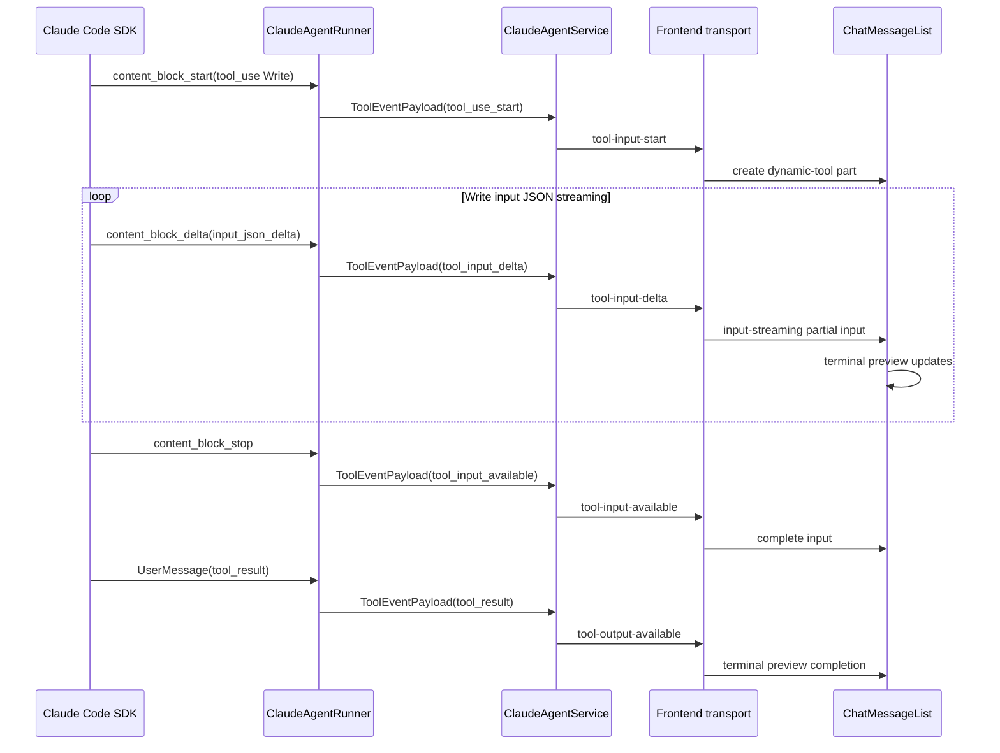

> [Input] `/Users/dmeck/Downloads/sse-message--report.md`, `backend/libs/claude_agent_kit/server/agent_runner.py`, `backend/claude_agent/service.py`, `frontend/src/lib/claude-agent-transport.ts`, `frontend/src/components/chat/ChatMessageList.tsx`
> [Output] Define the minimal interaction design for terminal-style previews while Claude Agent streams built-in `Write` tool input.
> [Pos] interaction-design-doc in `docs/design/claude-agent`
> [Sync] 2026-06-13: initial design for `Write` tool input-delta SSE forwarding and frontend terminal preview.
> [Sync] 2026-06-14: long `Write` file previews collapse by default with an inline expand/collapse control.

# Claude Agent Write 工具终端式预览设计

## 1. 问题判断

`sse-message--report.md` 显示 Claude Code SDK 在内置 `Write` 工具写文件时，按以下顺序流出事件：

```text
content_block_start(tool_use, name="Write", input={})
content_block_delta(input_json_delta, partial_json=...)
content_block_stop(index=Write block)
AssistantMessage(ToolUseBlock input={file_path, content})
UserMessage(ToolResultBlock content="File created successfully at: ...")
```

当前 runner 已经在 `input_json_delta` 阶段构造内部 `ToolEventPayload(type="tool_input_delta")`，但 `backend/claude_agent/service.py` 的 `_make_tool_event_cb()` 没有处理该事件类型。因此前端只能等 `content_block_stop` 后收到完整 `tool-input-available`，再等工具结果显示一段成功文本，无法看到 Claude Agent 正在写入的文本内容。

处理策略应以后端补齐事件转发、前端补齐展示为主：

- 后端：把已有内部 `tool_input_delta` 映射为 SSE `tool-input-delta`，保持 `tool-input-start` 必须先于 delta 发出。
- 前端 transport：把 SSE `tool-input-delta` 转成 AI SDK 6 原生 `UIMessageChunk(type="tool-input-delta", inputTextDelta=...)`。
- 前端 UI：识别内置 `Write` 工具，用终端风格展示目标路径、写入内容预览、执行状态和最终工具结果。

## 2. 交互方案

### 2.1 后端事件

新增 SSE 事件：

```json
{"type":"tool-input-delta","toolCallId":"call_...","toolName":"Write","delta":"..."}
```

字段说明：

| 字段 | 来源 | 说明 |
|---|---|---|
| `toolCallId` | `content_block_start.content_block.id` | 与后续 `tool-input-available` / `tool-output-available` 对齐 |
| `toolName` | `content_block_start.content_block.name` | 前端用于识别 `Write` |
| `delta` | `content_block_delta.delta.partial_json` | 原始 JSON 输入片段，不在后端解析为业务字段 |

后端不新增复杂状态机，只复用 runner 现有 `pending_stream_tools`。若 delta 到达时缺少 `toolCallId` 或 `toolName`，忽略该事件，避免向前端发送不可关联的增量。

### 2.2 前端状态

AI SDK 6 已支持 `tool-input-delta`。收到 delta 后，SDK 会把 partial JSON 解析为工具 part 的 `input`，并将工具 part 标记为 `state="input-streaming"`。当 `tool-input-available` 到达后，完整 `{file_path, content}` 会覆盖 partial input。

### 2.3 UI 展示

内置 `Write` 工具使用终端式预览，而不是普通折叠工具卡：

```text
‹ Write
$ write files/random-notes-20260613.md

# 随机笔记 ...
...
```

展示规则：

- `state="input-streaming"`：显示 `Writing...`，内容来自 partial input 中已解析出的 `content`；末尾显示光标。
- `state="input-available"`：显示完整待执行内容；若处于 manual/approval-requested 模式，仍由既有 Approve/Cancel UI 控制。
- `state="output-available"`：显示 `Written`，继续展示完整写入内容，并在底部显示工具返回结果。
- `state="output-error"`：显示 `Write failed`，保留已知输入和错误文本。

路径显示优先取 `file_path`，若路径在工作区下，前端只做轻量展示，不做路径安全判断；安全边界仍由后端权限策略负责。

### 2.4 长内容折叠

当 `Write.content` 超过前端展示策略阈值时，终端预览默认折叠显示，避免大文件把当前对话撑得过长。

当前展示策略：

- 超过 1,800 个字符或 24 行时启用折叠。
- 折叠态保留终端视觉效果，只显示开头内容和底部渐隐。
- 展开按钮显示内容规模摘要，例如 `Show full file (42 lines)`。
- 展开后仍限制为可滚动终端区域，避免单个工具结果占满整个消息列表。
- 复制按钮始终复制完整 `file_path`、完整 `content` 和工具输出，不受折叠态影响。

## 3. 过度设计排除

本方案不做以下扩展：

- 不新增独立文件写入协议或业务级“写文件事件”。
- 不在后端解析 `Write.content` 的 Markdown 结构或做语法高亮。
- 不把所有工具输入流都设计成可视化编辑器；仅对内置 `Write` 增加专用预览。
- 不新增后端分页、内容截断或二次拉取接口；折叠是纯前端展示策略。
- 不改变 workspace `files/` 自动 allow 策略，也不绕过现有 tool confirmation 侧路。
- 不改变 Agent MCP 写工具到 Writing view 的 2 秒刷新机制。

## 4. 目标符合性

该设计直接解决“Claude Agent 写入文本时前端缺少显示效果”的问题：示例报文中的 `input_json_delta` 可以在前端被连续显示，最终 `tool-input-available` 和 `tool-output-available` 保持现有持久化与历史回放兼容。实现范围只涉及一个缺失事件转发和一个内置工具展示分支，符合最小闭环。

## 5. 时序


