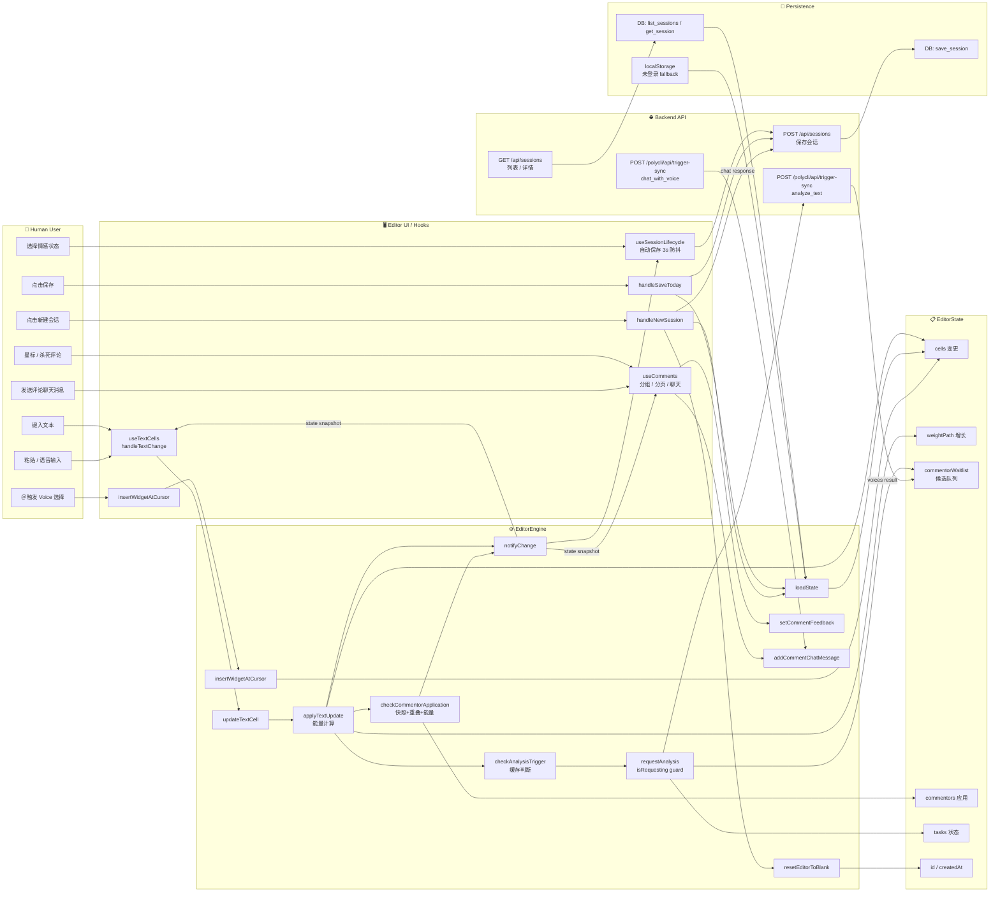

# 编辑器会话模块设计梳理

Status: Draft
Updated: 2026-06-14
Scope: Design only — 不含实现代码，不含重构建议

---

## 目录

1. [背景与目标](#1-背景与目标)
2. [现有模块入口](#2-现有模块入口)
3. [核心对象与职责](#3-核心对象与职责)
4. [当前设计功能清单](#4-当前设计功能清单)
5. [编辑器会话生命周期](#5-编辑器会话生命周期)
6. [事件与状态流](#6-事件与状态流)
7. [对象泳道图](#7-对象泳道图)
8. [扩展点与限制](#8-扩展点与限制)
9. [设计结论](#9-设计结论)

---

## 1. 背景与目标

### 1.1 背景

Ink & Memory 是一个以写作体验为核心的应用。用户在编辑器中输入文本，系统根据"能量"模型（trace-based energy model）自动触发 AI 语音角色分析，将旁白评论嵌入文档。编辑器会话（Edit Session）是该链路的中枢——它既是文档载体，也是状态机，同时承担与后端 API 的持久化协调。

### 1.2 目标

本文档目标：

- 梳理当前编辑器会话模块的职责边界和设计结构
- 描述核心对象、状态、事件、命令、用户操作、系统响应
- 揭示生命周期、协作关系、扩展点和已知限制
- 为后续"元操作语义 / Edit Point"扩展提供设计基础

---

## 2. 现有模块入口

| 层次 | 文件 | 职责 |
|------|------|------|
| 引擎层 | `frontend/src/engine/EditorEngine.ts` | 核心状态机：管理 cells、commentors、tasks、weightPath；驱动能量计算和分析触发 |
| 引擎层 | `frontend/src/engine/ChatWidget.ts` | 嵌入式聊天小部件：管理单个 Voice 的对话历史 |
| Hooks 层 | `frontend/src/hooks/useSessionLifecycle.ts` | 会话生命周期协调：初始化、加载、自动保存、新建、新一天检测 |
| Hooks 层 | `frontend/src/hooks/useTextCells.ts` | 文本单元格管理：本地文本、IME 组合输入、粘贴、键盘事件 |
| Hooks 层 | `frontend/src/hooks/useComments.ts` | 评论管理：分组、分页、星标/杀死、评论聊天 |
| Hooks 层 | `frontend/src/hooks/useInspiration.ts` | 写作灵感提示 |
| Hooks 层 | `frontend/src/hooks/useVoiceInput.ts` | 语音输入 |
| API 层 | `frontend/src/api/voiceApi.ts` | 后端 API 调用：analyzeText、chatWithVoice、saveSession、listSessions、getSession |
| 后端 API | `backend/server.py` → `/api/sessions/*` | 会话持久化：CRUD |
| 持久化层 | `backend/database.py` | SQLite/DB 操作 |

---

## 3. 核心对象与职责

### 3.1 EditorState（状态快照）

编辑器所有可序列化状态的聚合对象，是持久化与恢复的单元。

| 字段 | 类型 | 说明 |
|------|------|------|
| `id` | `string` | 会话唯一 ID（UUID） |
| `cells` | `Cell[]` | 文档单元格列表（TextCell \| WidgetCell） |
| `commentors` | `Commentor[]` | 已计算/已应用的评论列表 |
| `tasks` | `Task[]` | 当前运行中的后台任务（分析、搜索等） |
| `weightPath` | `WeightEntry[]` | 能量增长路径（时序快照） |
| `overlappedPhrases` | `string[]` | 被跳过的重叠短语（反馈给后端） |
| `notFoundPhrases` | `string[]` | 后端建议但前端未找到的短语（反馈给后端） |
| `selectedState` | `string \| null` | 当日情感状态（存储在会话中） |
| `createdAt` | `string` | ISO 时间戳（会话创建时间） |

### 3.2 Cell（文档单元格）

文档由 Cell 数组线性组成，分为两种类型：

| 类型 | 结构 | 职责 |
|------|------|------|
| `TextCell` | `{id, type:'text', content:string}` | 可编辑纯文本区域 |
| `WidgetCell` | `{id, type:'widget', widgetType, data}` | 嵌入式交互部件（chat/greeting/other） |

设计约束：数组中不能出现连续两个 TextCell（`mergeConsecutiveTextCells` 自动合并）。

### 3.3 Commentor（语音评论）

由 AI 语音角色生成、附着在文本短语上的评论对象。

| 字段 | 说明 |
|------|------|
| `id` | 评论唯一 ID |
| `phrase` | 锚定的文本短语（高亮目标） |
| `comment` | 评论内容 |
| `voiceId` | 语音角色 ID（用于数据库查询） |
| `voice` | 语音角色显示名（不可变快照） |
| `icon` / `color` | 视觉标识 |
| `appliedAt` | 应用时间戳（`undefined` 表示在候选队列中） |
| `computedAt` | 计算时间戳 |
| `textSnapshot` | 计算时的文本快照（用于过时检测） |
| `chatHistory` | 与该评论的对话历史 |
| `feedback` | 用户反馈：`'star'` / `'kill'` / `undefined` |

### 3.4 WeightEntry（能量路径节点）

| 字段 | 说明 |
|------|------|
| `timestamp` | 记录时间 |
| `text` | 当时的完整文本 |
| `weight` | 文本权重（CJK×2，句子边界×4，其他×1） |
| `delta` | 相对上一节点的增量（≥0） |
| `energy` | 累积能量 |

### 3.5 EditorEngine（核心状态机）

负责所有状态变更的唯一可信源（single source of truth）。主要职责：

- `updateTextCell(cellId, text)` — 文本变更入口，触发能量计算和分析
- `insertWidgetAtCursor(...)` / `insertWidgetAfterLine(...)` — 插入 WidgetCell
- `deleteCell(cellId)` — 删除单元格
- `addCommentChatMessage(commentId, role, content)` — 追加评论聊天消息
- `setCommentFeedback(commentId, feedback)` — 设置反馈
- `loadState(state)` — 从存储恢复状态
- `subscribe(callback)` — 单一订阅者（React state bridge）
- `onBlankReset(callback)` — 空白重置订阅（支持多订阅者）

内部自动维护：
- `commentorWaitlist`：候选评论队列
- `sentCache`：文本→commentorHash 的去重缓存
- `usedEnergy`：已消耗能量（控制评论应用节奏）
- `isRequesting`：防重复请求标志

---

## 4. 当前设计功能清单

| # | 功能 | 入口 | 触发条件 |
|---|------|------|---------|
| F1 | 文本编辑（单/多 Cell） | `useTextCells.handleTextChange` | 用户键入 |
| F2 | IME 组合输入保护 | `handleCompositionStart/End` | 中文/日文输入法组合 |
| F3 | 粘贴处理 | `handlePaste` | Ctrl+V / 右键粘贴 |
| F4 | @ 触发 Voice 选择 | `handleKeyDown` + `AgentDropdown` | 键入 `@` |
| F5 | 插入 ChatWidget | `engine.insertWidgetAtCursor` | 选择 Voice 后 |
| F6 | 能量计算 | `computeWeight` + `applyTextUpdate` | 每次文本变更 |
| F7 | 分析触发（自动） | `checkAnalysisTrigger` | 句子完成 + 能量/缓存条件 |
| F8 | 评论候选排队 | `commentorWaitlist.push` | 后端返回分析结果 |
| F9 | 评论应用（能量门控） | `checkCommentorApplication` | 能量充足 + 无重叠 + 快照匹配 |
| F10 | 评论高亮与分组 | `useComments.commentGroups` | 状态变更后重新计算 |
| F11 | 评论分页导航 | `handleGroupNavigate` | 用户点击翻页 |
| F12 | 光标位置评论激活 | `useComments` cursor effect | 光标移动 |
| F13 | 评论聊天（Chat with Voice） | `handleCommentChatSend` | 用户发送消息 |
| F14 | 评论星标 / 杀死 | `handleCommentStar/Kill` | 用户点击 |
| F15 | 会话初始化 | `useSessionLifecycle` effect | 应用启动 |
| F16 | 新一天检测 | `useSessionLifecycle` timezone check | 应用启动时比较日期 |
| F17 | 自动保存（3s 防抖） | `useSessionLifecycle` state effect | 状态变更后 3s |
| F18 | 手动保存 | `handleSaveToday` | 用户点击「保存」 |
| F19 | 新建会话 | `handleNewSession` | 用户点击「新建」 |
| F20 | 从历史加载会话 | `useSessionLifecycle` + `listSessions/getSession` | 日历导航等 |
| F21 | 空白重置 | `resetEditorToBlank` + `onBlankReset` | 所有内容清空 |
| F22 | 情感状态选择 | `StateChooser` + `selectedState` | 用户选择情感状态 |
| F23 | 语音输入 | `useVoiceInput` | 麦克风按钮 |
| F24 | 写作灵感提示 | `useInspiration` | 文本变更时 |

---

## 5. 编辑器会话生命周期

```
创建 → 激活 → 编辑中 → [自动/手动保存] → 结束（新一天 / 新建 / 导航离开）
```

### 5.1 阶段详述

| 阶段 | 触发 | 核心操作 | 状态变化 |
|------|------|---------|---------|
| **创建** | 应用启动 / 新一天 / 用户新建 | `buildBlankState()` → `engine.loadState()` | EditorState 初始化，`id` 分配，`createdAt` 记录 |
| **激活** | 加载成功 | `engine.subscribe()` 绑定，React state 同步 | Engine 进入订阅状态，UI 渲染 |
| **编辑** | 用户键入/粘贴/语音 | `updateTextCell()` → 能量计算 → 分析触发 | cells 变更，weightPath 增长，commentors 变化 |
| **分析等待** | 分析请求发出 | `isRequesting=true`，Task 入队 | tasks 增加，UI 显示加载状态 |
| **评论应用** | 能量充足 + 结果返回 | `checkCommentorApplication()` | commentors 增加，UI 高亮渲染 |
| **保存** | 3s 防抖 / 手动 / 新建前 | `saveSessionToDatabase()` | `id` 可能更新（首次保存），DB 持久化 |
| **结束** | 新一天 / 用户新建 / 内容清空 | 保存当前 → `buildBlankState()` → 新 `id` | Engine 重置，React state 清空 |

### 5.2 认证对生命周期的影响

| 认证状态 | 持久化目标 | 特殊行为 |
|---------|----------|---------|
| 已登录 | 后端数据库（`/api/sessions`） | 启动时从 DB 加载；自动保存到 DB；支持跨设备 |
| 未登录 | `localStorage`（`EDITOR_STATE` key） | 完全在本地运行；登录后无迁移 |

---

## 6. 事件与状态流

### 6.1 文本变更事件链

```
用户输入
  → useTextCells.handleTextChange
    → setLocalTexts（本地立即更新，无延迟）
    → engine.updateTextCell(cellId, text)
      → applyTextUpdate()
        → computeWeight(combinedText)
        → weightPath.push(entry)
        → checkAnalysisTrigger(text, energy)   // 可能发起后端请求
        → checkCommentorApplication(text, energy)  // 可能应用评论
        → notifyChange()  // 触发 React re-render
  → textarea resize
  → Inspiration hint update
```

### 6.2 分析请求 / 评论应用流

```
checkAnalysisTrigger:
  completedSentences = getCompletedSentences(text)
  if cached AND commentorHash unchanged → skip
  else:
    sentCache.set(text, hash)
    requestAnalysis(text)
      isRequesting = true
      tasks.push({type:'thinking'})
      notifyChange()
      → POST /polycli/api/trigger-sync {session_id:'analyze_text', params:{...}}
      ← {voices: [{phrase, comment, voice_id, voice, icon, color}]}
      commentorWaitlist.push(newCommentor)
      isRequesting = false
      tasks.remove(task)
      processPendingComments(text)
        checkCommentorApplication(text, energy)
          if energy - usedEnergy >= threshold:
            validate snapshot match
            validate phrase found in text
            validate no overlap with applied commentors
            → commentor.appliedAt = now
            → state.commentors.push(commentor)
            → usedEnergy += threshold
            → notifyChange()
```

### 6.3 保存事件链

```
状态变更（state 改变）
  → useSessionLifecycle effect
    → clearTimeout(autoSaveTimer)
    → setTimeout(3000)
      → ensureStateForPersistence()
      → 竞态守卫：live id == snapshot id
      → saveSessionToDatabase(state, firstLine)
        → POST /api/sessions {session_id, editor_state, name}
        → engine.setCurrentEntryId(savedId)
```

### 6.4 Agent MCP 写工具触发的会话同步

当 Agent 通过 MCP 工具（`mcp__editor__*`）修改会话内容时，前端通过以下机制同步：

```
用户点击"批准"（Chat 视图 EditorWriteApprovalUI）
  → ToolMessagePart.handleEditorWriteApprove()
    → POST /api/claude-agent/tool-confirm {approved: true}
    ← {ok: true}  ← 确认已交给 Agent runner，不代表 MCP 写入已完成
    → onEditorWriteConfirmed(toolCallId)
      → App.handleEditorWriteConfirmed(toolCallId)
        → 注册按 toolCallId 的超时 fallback

Agent runner 继续执行 MCP 写工具
  → mcp__editor__* 写入 user_sessions.editor_state_json
  → ClaudeAgentService 收到成功 tool_result
  → 从 DB reload editor_state 到 AgentRunState
  → SessionEventBus 发布 session_updated {source:"agent", toolCallId}
  → 前端 /api/sessions/events 收到事件
  → 清除 fallback timer
  → GET /api/sessions/{sessionId}
    ← 最新 editor_state（包含 Agent 写入内容）
  → engineRef.current.loadState(refreshed, {source:"remote"})
  → Writing 视图 textarea 渲染新内容
  → 自动保存 effect 消费 remote 标记并跳过本轮 POST
```

**设计约束**：
- `POST /api/claude-agent/tool-confirm` 只表示确认已提交，不能作为 DB 写完成信号。
- DB 写完成信号由 `SessionEventBus` 的 `source="agent"` 事件提供；事件发布点在 `ClaudeAgentService` 成功处理 editor write `tool_result` 后。
- 前端按 `toolCallId` 去重，兼容“事件先到”和“确认回调先到”两种顺序。
- 若 SSE 不可用，`App.handleEditorWriteConfirmed` 通过集中配置的 `EDITOR_WRITE_EVENT_FALLBACK_TIMEOUT_MS` 降级拉取一次当前 session。
- 拉取前检查 `engineRef.current.getState().id`，避免用户切换会话后把远端状态载入错误会话。

---

## 7. 对象泳道图

以下 Mermaid 图按**对象/模块**划分泳道，展示各对象负责的动作、状态变化和事件流向。



**图解说明：**

- **Human User 泳道**：所有用户交互的起点，包括文本输入、命令操作（保存/新建）和评论互动。
- **Editor UI / Hooks 泳道**：React Hooks 层作为用户意图与引擎之间的适配器，负责本地状态同步（localTexts）、事件去抖（3s 自动保存）和 IME 保护。
- **EditorEngine 泳道**：唯一的状态变更权威，所有操作通过此对象修改 EditorState。分析触发、评论应用的门控逻辑在此执行。
- **EditorState 泳道**：纯数据，由引擎维护，是序列化和持久化的单元。包含 cells、commentors（含候选队列标识）、tasks、weightPath。
- **Backend API 泳道**：两类调用——分析/聊天（PolyCLI）和会话持久化（REST）。均为异步，结果通过回调或 Promise 更新引擎状态。
- **Persistence 泳道**：已登录用户使用后端数据库；未登录用户 fallback 到 localStorage。保存路径（B3→P1）由 Hooks 层驱动，加载路径（P2→Engine）在会话初始化时执行。
- **确认点**：分析触发有缓存守卫（`sentCache`）和并发守卫（`isRequesting`）；评论应用有能量门控、快照匹配、重叠检测三重守卫；保存有竞态守卫（`live id == snapshot id`）。
- **回滚/失败路径**：分析请求失败时 `isRequesting` 复位，task 移除，cache 保持（可重试）；保存失败时 console.error，无重试机制（当前限制）。

---

## 8. 扩展点与限制

### 8.1 扩展点

| 扩展点 | 当前机制 | 可扩展方式 |
|-------|---------|-----------|
| **状态变更通知** | `subscribe(callback)` — 单一订阅者 | 可扩展为多订阅者 EventBus 或 Observable |
| **空白重置通知** | `onBlankReset(cb)` — 已支持多订阅者 `Set<() => void>` | 可作为通用事件系统的模板 |
| **WidgetCell 类型** | `widgetType: 'chat' \| 'greeting' \| 'other'` | 可注册新类型，Engine 对 data 无约束 |
| **分析触发策略** | 固定 threshold=50 + completedSentences 判断 | 可提取为策略对象，支持不同触发规则 |
| **持久化适配** | 硬编码调用 `voiceApi.saveSession` | 可抽象为 StorageAdapter 接口 |
| **认证与会话绑定** | JWT ****** | 已支持，可扩展 Agent 身份令牌 |
| **任务类型** | `'searching' \| 'thinking' \| 'other'` | 可注册新类型 |

### 8.2 已知限制

| 限制 | 说明 |
|------|------|
| **单订阅者** | `engine.subscribe` 只支持一个回调，被后续绑定覆盖 |
| **无操作历史（Undo/Redo）** | EditorEngine 不维护操作栈，无法撤销 |
| **无细粒度事件类型** | 状态变更以整体快照推送，无法区分"文本变更"vs"评论应用"vs"任务更新" |
| **Agent 操作无入口** | 当前所有状态变更入口仅暴露给人类 UI（React Hooks），无 Agent 可调用的命令接口 |
| **Agent MCP 写工具确认后前端状态未及时更新** | 用户在 Chat 视图批准 `mcp__editor__` 写工具时，`POST /api/claude-agent/tool-confirm` 的响应不代表 DB 写入完成。现已通过 `SessionEventBus` 在成功 editor write `tool_result` 后发布 `session_updated source=agent`，前端按 `toolCallId` 收到事件后 reload 当前 Writing session；SSE 不可用时按配置超时 fallback。 |
| **保存无重试机制** | 自动保存失败仅 console.error，无排队重试 |
| **评论应用不可配置** | threshold=50 硬编码在 Engine 构造函数中 |
| **跨设备同步** | 无冲突解决机制，最后写入覆盖（last-write-wins） |
| **无 Edit Point 概念** | 当前没有"编辑点"抽象，人类和 Agent 操作无共同的事件表达模型 |

---

## 9. 设计结论

### 9.1 当前模块特征总结

- **EditorEngine 是单一状态权威**：所有状态变更通过 Engine 方法入口，副作用在 Engine 内完成后以快照推送给订阅者。这是一个**命令模式（Command Pattern）的弱化版本**——命令存在（方法调用）但没有显式的命令对象。

- **能量模型是核心设计**：文本写作的"量感"通过 weight/delta/energy 积累来量化，驱动 AI 评论的节奏感。这是 Ink & Memory 区别于普通编辑器的核心设计。

- **Hooks 层是用户意图到引擎命令的适配器**：React Hooks 承担了 UI 事件的适配、IME 保护、防抖、认证判断等横切关注点，使 Engine 保持纯粹。

- **当前架构对 Agent 操作不透明**：Engine 的命令接口已足够清晰，但没有对外暴露可供 Agent 程序化调用的抽象层（如命令队列、事件总线、工具函数），导致 Human 路径和 Agent 路径完全分离。

### 9.2 证据索引

| 设计结论 | 来源文件 | 关键位置 |
|---------|---------|---------|
| EditorEngine 单一订阅 | `engine/EditorEngine.ts` | L706 `subscribe(callback)` |
| 能量模型 threshold=50 | `engine/EditorEngine.ts` | L122 `private threshold: number = 50` |
| 评论应用三重守卫 | `engine/EditorEngine.ts` | L296–403 `checkCommentorApplication` |
| 空白重置多订阅 | `engine/EditorEngine.ts` | L127 `blankResetSubscribers: Set<() => void>` |
| 会话生命周期 | `hooks/useSessionLifecycle.ts` | L246–517 |
| 自动保存 3s 防抖 | `hooks/useSessionLifecycle.ts` | L487–517 |
| 竞态守卫 | `hooks/useSessionLifecycle.ts` | L494–499 |
| 新一天检测 | `hooks/useSessionLifecycle.ts` | L339–368 |
| 分析 API 入口 | `api/voiceApi.ts` | L128–172 `analyzeText` |
| 会话持久化 API | `api/voiceApi.ts` | L389–467 `saveSession/listSessions/getSession` |
| WidgetCell 类型 | `engine/EditorEngine.ts` | L24 `WidgetCell.widgetType` |
| IME 保护 | `hooks/useTextCells.ts` | L105–126 `handleCompositionStart/End` |
