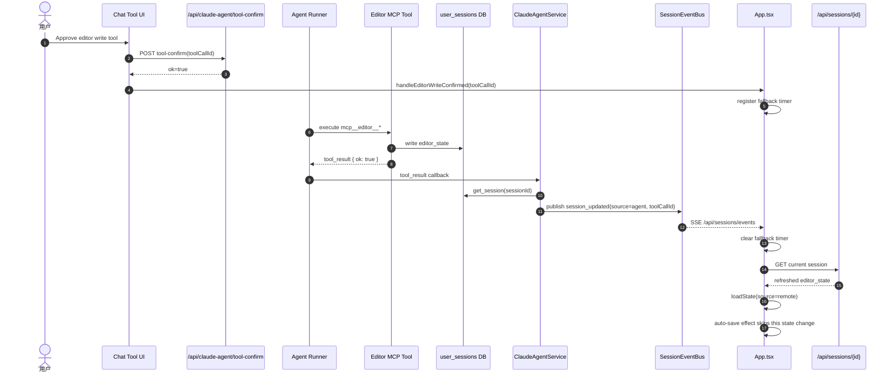

# Edit Session 事件驱动同步方案

> **版本**: 2026-06-14 v3 — 最小实现稿
> **问题来源**: `api/sessions`（Edit Session / 写作日记会话）请求量偏高；Agent MCP 写工具确认后前端存在 `2000ms` 硬编码盲等待。
> **关联代码**:
> - `frontend/src/App.tsx` — `handleEditorWriteConfirmed` 与 Writing 视图 reload
> - `frontend/src/hooks/useEditSessionEvents.ts` — `/api/sessions/events` 订阅
> - `frontend/src/engine/EditorEngine.ts` — `loadState(..., { source: 'remote' })`
> - `frontend/src/hooks/useSessionLifecycle.ts` — 自动保存跳过远端 reload
> - `backend/session_events.py` — Edit Session 事件总线
> - `backend/routers/sessions.py` — 普通 session 保存/删除事件与 SSE 端点
> - `backend/claude_agent/service.py` — Agent MCP 写工具成功后发布 `source=agent` 事件

## 1. 问题判断

当前问题不是单纯的“等待时间不够”，而是前端没有收到 Edit Session DB 写入完成的可靠信号。

原流程：

1. 用户在 Chat 视图批准 `mcp__editor__*` 写工具。
2. 前端调用 `POST /api/claude-agent/tool-confirm`。
3. 该 HTTP 响应只表示“确认请求已被 Agent runner 接收”，不表示 MCP 工具已经写完 DB。
4. `App.handleEditorWriteConfirmed` 固定等待 `2000ms` 后调用 `GET /api/sessions/{id}`。
5. 如果 DB 写入慢于 2 秒，Writing 视图可能仍读到旧状态；如果写入很快，用户无谓等待。
6. `engine.loadState()` 触发 state change 后，自动保存可能再次 `POST /api/sessions`，形成 Agent 写后的重复保存。

因此处理方向应为：

- 用后端“写工具成功且 DB 可读”事件替代固定延迟。
- 前端按 `toolCallId` 等待事件，避免确认回调和事件到达顺序产生竞态。
- 对 SSE 不可用场景保留有界 fallback，而不是完全依赖长连接。
- 本次不引入全局 SessionStore，不重构 Calendar/Collections 数据层。

## 2. 目标与非目标

目标：

| 目标 | 方案 |
|---|---|
| 移除 `2000ms` 硬编码盲等待 | `/api/sessions/events` 推送 `source=agent` 的 `session_updated` |
| 降低 Agent 写后的重复请求 | 事件到达后只拉取当前 session 详情一次 |
| 防止 Agent 写后自动保存反写 | `loadState(..., { source: 'remote' })`，自动保存 effect 跳过一次 |
| 保持失败可恢复 | SSE 未到达时按配置超时 fallback 到 `GET /api/sessions/{id}` |
| 保持边界清晰 | Edit Session 事件总线独立于 Claude Agent turn SSE |

非目标：

| 非目标 | 原因 |
|---|---|
| 全局 SessionStore / CalendarPopup 迁移 | 能进一步减少列表请求，但不是移除 2 秒盲等的必要条件 |
| 多进程 Redis 事件总线 | 当前部署和问题范围先按单进程 FastAPI 处理；SSE 失败已有 fallback |
| 大型同步状态机 | 当前只需要“写完成通知 + 一次 reload + 一次自动保存跳过” |
| 替换 `/api/sessions` REST 模型 | 现有保存/读取接口仍可作为持久化权威 |

## 3. 交互方案

### 3.1 后端完成信号

新增 `backend/session_events.py`，提供 Edit Session 专用 `SessionEventBus`。

事件结构：

```json
{
  "type": "session_updated",
  "sessionId": "user_sessions.id",
  "source": "agent",
  "toolCallId": "tool-call-id",
  "toolName": "mcp__editor__write_segment",
  "timestamp": "2026-06-14T00:00:00Z"
}
```

发布点：

| 来源 | 发布位置 | `source` | 用途 |
|---|---|---|---|
| 普通前端保存 | `backend/routers/sessions.py` `POST /api/sessions` | `api` | 供后续列表缓存增量更新使用 |
| 普通前端删除 | `backend/routers/sessions.py` `DELETE /api/sessions/{id}` | `api` | 供后续列表缓存增量更新使用 |
| Agent MCP 写工具 | `backend/claude_agent/service.py` 成功 `tool_result` 后 | `agent` | 当前 P0：驱动 Writing 视图 reload |

关键点：MCP 写工具运行在 Claude/MCP 子进程中，不能直接写 FastAPI 进程内存事件总线。因此事件发布点放在 `ClaudeAgentService._make_tool_event_cb` 收到成功 `tool_result` 后。该回调已经会从 DB reload `editor_state` 到 AgentRunState，说明写工具已完成且 DB 可读。

### 3.2 前端订阅

新增 `frontend/src/hooks/useEditSessionEvents.ts`，使用 `fetch` 读取 SSE：

- 使用现有 JWT `Authorization` header。
- 使用 `frontend/src/lib/apiBase.ts` 的 runtime API base。
- 不使用裸 `EventSource`，因为 `EventSource` 无法发送项目当前依赖的 `Authorization` header。
- 断开后按 `SESSION_EVENT_RECONNECT_DELAY_MS` 重连。

### 3.3 Agent 写确认后的 reload

`ToolMessagePart` 在批准写工具成功后，把 `toolCallId` 传给 `App.handleEditorWriteConfirmed(toolCallId)`。

`App.tsx` 维护三类状态：

| 状态 | 作用 |
|---|---|
| `pendingEditorWriteFallbacksRef` | toolCallId → fallback timer |
| `completedEditorWriteToolIdsRef` | 记录已由 SSE 处理的 toolCallId，解决“事件先到、确认回调后到”的竞态 |
| `completedEditorWriteCleanupRef` | 清理完成缓存，避免长期增长 |

处理规则：

1. 如果 `source=agent` 的 `session_updated` 先到：
   - 立即 reload 当前 Writing session。
   - 记录 `toolCallId` 已完成。
   - 后续确认回调看到该 toolCallId 已完成，不再追加 fallback。
2. 如果确认回调先到：
   - 注册按 `toolCallId` 的 fallback timer。
   - SSE 到达时清除 timer 并 reload。
3. 如果 SSE 不可用：
   - timer 到期后执行一次 `GET /api/sessions/{id}`。

### 3.4 自动保存幂等保护

`EditorEngine.loadState` 增加来源标记：

```ts
engine.loadState(refreshed, { source: 'remote' });
```

`useSessionLifecycle` 自动保存 effect 在检测到 `remote` 来源时跳过本轮，并把远端状态标记为已持久化：

```ts
if (engineRef.current?.consumeLastLoadSource() === 'remote') {
  markSessionPersisted(remoteState);
  return;
}
```

这样 Agent 写入后的前端 reload 不会立刻反向触发 `POST /api/sessions`。

同一 effect 还维护 editor content signature：

- `cells/commentors/tasks/weightPath/overlappedPhrases/notFoundPhrases/selectedState` 参与签名。
- `session id/createdAt` 不作为内容变化判断依据，避免 ID 同步或重复 state 通知触发保存。
- 当前签名等于已持久化签名时，不创建 debounce timer。
- 当前签名等于已排队签名时，不重置已有 debounce timer。
- 只有内容签名变化时，才按 `EDIT_SESSION_AUTO_SAVE_DEBOUNCE_MS` 创建或重置自动保存 timer。

## 4. 时序图



## 5. 过度设计审查

本次实现只做 P0 链路：

- 增加一个轻量 in-process `SessionEventBus`。
- 增加一个前端订阅 hook。
- 修改 Agent 写工具成功回调发布事件。
- 修改 App reload 逻辑。
- 修改 Engine/source 标记、自动保存 skip、自动保存内容签名去重。

暂不实现以下内容：

| 排除项 | 排除理由 |
|---|---|
| 全局 SessionStore | 会影响 CalendarPopup、useSessionLifecycle 初始化、Analysis/Collections 等多个读路径；收益主要是列表缓存，不是 MCP 写同步 P0 |
| Redis / durable event replay | 当前前端有 fallback，事件只承担实时加速；可靠持久化仍由 DB + GET 提供 |
| 乐观合并 editor_state patch | 写工具已经在 DB 写入完整 editor_state；前端拉权威状态更简单 |
| 跨 tab 广播 | 当前问题是当前 Chat/Writing 同屏同步；跨 tab 可后续扩展 |

判断：方案符合目标，没有过度设计。它把盲等替换为完成事件，同时保留 REST fallback，不扩大到无关页面的状态重构。

## 6. 验收标准

1. `frontend/src/App.tsx` 不再出现 MCP 写确认后的 `setTimeout(..., 2000)` 盲等待。
2. 成功的 `mcp__editor__write_segment/delete_segment/insert_widget/reply_to_comment` 工具结果会发布 `session_updated source=agent`。
3. 前端收到对应 `toolCallId` 事件后，只 reload 当前 Writing session。
4. SSE 不可用时，按 `EDITOR_WRITE_EVENT_FALLBACK_TIMEOUT_MS` 降级 reload。
5. `loadState(source='remote')` 触发的 state change 不会立刻自动 `POST /api/sessions`。
6. 没有 editor content signature 变化时，不创建 3 秒自动保存 debounce timer，也不会调用 `POST /api/sessions`。
7. 单元测试覆盖事件总线用户隔离、SSE payload、Agent 写工具事件发布。
