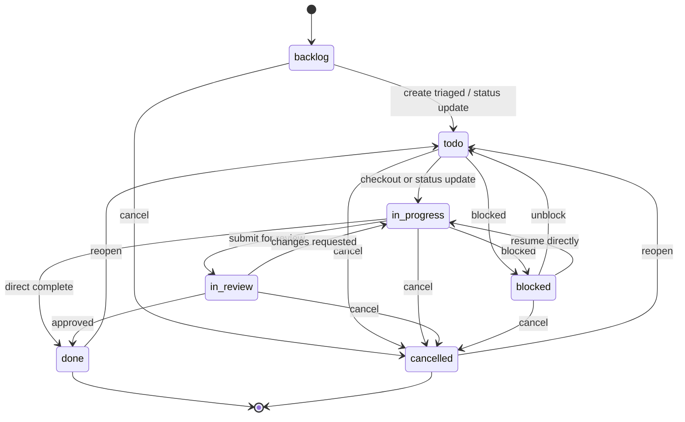
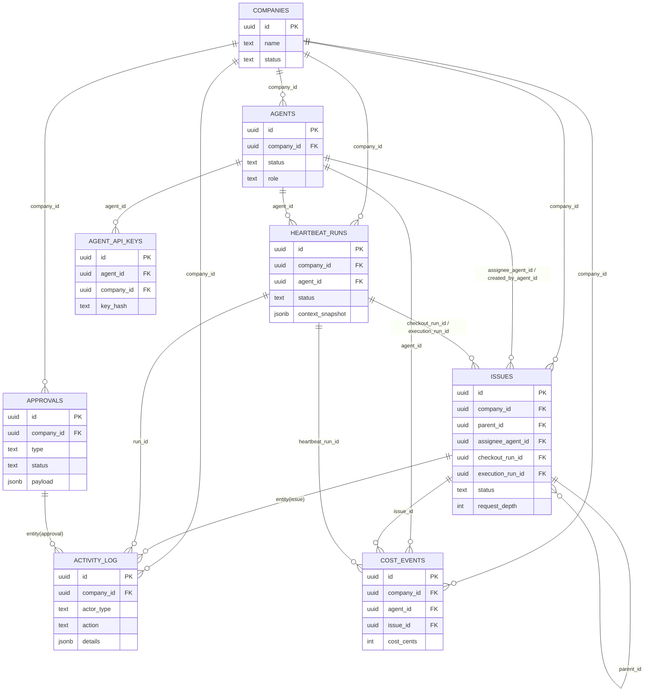

# Paperclip Issue 生命周期系统
## 1. Executive Summary
Paperclip 是一个面向 AI-agent 组织的控制平面（control plane），核心目标不是“替代执行器”，而是“约束并编排执行器”。在该体系中，`Issue` 是最小、最可审计、可并发控制的工作单元：任务创建、领取、执行、评审、回退、完成、取消、预算审计，全部围绕 `Issue` 展开。系统的关键差异化不在于看板状态本身，而在于两层锁语义：`checkoutRunId`（工作所有权锁）与 `executionRunId`（运行编排锁）。前者保证“谁在做”，后者保证“谁在跑”。

在并发场景下，Paperclip 通过原子 `UPDATE ... WHERE` 和 run-level lock adoption 机制，把“抢单冲突”显式化为 `409` 或“锁接管”，而不是静默覆盖。预算治理层进一步把 token/cost 事件与自动暂停、审批恢复打通，使生命周期不仅是任务流程，也是治理流程。最终，Issue 生命周期成为 Paperclip 里“执行一致性 + 组织治理 + 审计可追溯”的交汇点。

## 2. State Machine Analysis

### 2.1 全量状态图（Canonical Contract + Runtime Notes）

> **⚠️ Invariant:** `Issue` 仅允许单一责任人（`assigneeAgentId` 或 `assigneeUserId` 二选一），任何时刻不得双重指派。

### 2.2 状态分类
- 非终态：`backlog`、`todo`、`in_progress`、`in_review`、`blocked`
- 终态：`done`、`cancelled`

### 2.3 合法迁移与触发条件（设计契约）
| From | To | Trigger 条件 | 关键校验 |
|---|---|---|---|
| `backlog` | `todo` | triage 完成或显式更新 | 公司边界、权限校验 |
| `backlog` | `cancelled` | 任务被放弃 | 公司边界、权限校验 |
| `todo` | `in_progress` | `POST /issues/:id/checkout` 或 `PATCH /issues/:id` | 必须有 assignee |
| `todo` | `blocked` | 外部依赖阻塞 | 权限校验 |
| `todo` | `cancelled` | 放弃执行 | 权限校验 |
| `in_progress` | `in_review` | 提交评审 | 运行所有权校验（agent） |
| `in_progress` | `blocked` | 执行中阻塞 | 运行所有权校验（agent） |
| `in_progress` | `done` | 执行完成 | 运行所有权校验（agent） |
| `in_progress` | `cancelled` | 终止任务 | 运行所有权校验（agent） |
| `in_review` | `in_progress` | 评审退回 | 权限校验 |
| `in_review` | `done` | 审核通过 | 权限校验 |
| `in_review` | `cancelled` | 终止任务 | 权限校验 |
| `blocked` | `todo` | 解除阻塞 | 权限校验 |
| `blocked` | `in_progress` | 直接恢复执行 | assignee 校验 |
| `blocked` | `cancelled` | 终止任务 | 权限校验 |
| `done` / `cancelled` | `todo` | reopen（`reopen: true`） | 仅 closed 状态触发 |

### 2.4 迁移副作用（timestamps 与锁字段）
- 进入 `in_progress`：若 `startedAt` 为空则写入当前时间。
- 进入 `done`：写入 `completedAt`。
- 进入 `cancelled`：写入 `cancelledAt`。
- 离开 `done`：`completedAt` 清空。
- 离开 `cancelled`：`cancelledAt` 清空。
- 离开 `in_progress`：`checkoutRunId` 清空（`PATCH` 路径）。
- assignee 变更：`checkoutRunId` 清空。

> **⚠️ Invariant:** `status = in_progress` 时必须存在 assignee，否则返回 `422`（语义违规）。

### 2.5 运行时实现观察（与设计契约的差异）
当前 `issueService.assertTransition` 主要验证“目标状态是否在枚举中”，并不完整执行“from→to 邻接矩阵”限制；因此，严格意义上的“合法迁移集合”目前更多由调用路径和业务约束共同形成，而非单一状态机守卫。

### 2.6 Reopen 边界案例
- 路径 A：`PATCH /issues/:id` + `comment` + `reopen: true`，若当前是 `done/cancelled` 且未显式提供 `status`，服务端自动注入 `status: todo`。
- 路径 B：`POST /issues/:id/comments` + `reopen: true`，closed issue 先执行状态回滚到 `todo`，再写评论并触发 wakeup。

### 2.7 字段一致性矩阵（状态与运行锁）
| 字段                | 创建时                 | checkout 成功       | release 成功        | run 完成                                  | reopen                       |
| ----------------- | ------------------- | ----------------- | ----------------- | --------------------------------------- | ---------------------------- |
| `status`          | 默认 `backlog`        | 置为 `in_progress`  | 置为 `todo`         | 不直接改 issue status（由业务更新）                | 从 `done/cancelled` 置回 `todo` |
| `assigneeAgentId` | 可空                  | 置为 checkout agent | 置空                | 不直接置空                                   | reopen 本身不强制改 assignee       |
| `checkoutRunId`   | 可空                  | 写入当前 run          | 置空                | 不自动清理（依赖 status/update/release）         | reopen 不直接改                  |
| `executionRunId`  | 可空                  | 通常写入当前 run        | 可能保留（直到 run 终态释放） | `releaseIssueExecutionAndPromote` 清空或转移 | reopen 不直接改                  |
| `startedAt`       | 进入 `in_progress` 则写 | 写入                | 保留历史              | 保留历史                                    | 保留历史                         |
| `completedAt`     | 若初始 `done` 写入       | 不改                | 不改                | 不改                                      | reopen 会清空（状态离开 `done`）      |
| `cancelledAt`     | 若初始 `cancelled` 写入  | 不改                | 不改                | 不改                                      | reopen 会清空（状态离开 `cancelled`） |

### 2.8 错误语义与状态机关系
1. `400`：输入字段不合法，如 schema 校验失败。
2. `401`：未认证 actor。
3. `403`：权限不足（如 agent 试图 checkout 他人、非 board 试图 interrupt）。
4. `404`：issue/approval/run 等实体不存在。
5. `409`：并发状态冲突（典型是 checkout 冲突、run ownership 冲突）。
6. `422`：语义规则冲突（如 `in_progress` 无 assignee）。
7. `500`：内部错误。

这组错误码让“状态不可达”与“权限不可达”可被客户端区分处理：前者通常重试或刷新状态，后者必须升级到人工授权或角色调整。

## 3. Actor Model

| Actor | Capabilities | Auth Mechanism | Boundary Constraints |
|---|---|---|---|
| Board User（人类操作员） | 可创建/更新/分配/取消/reopen issue；可 `approve/reject/request-revision`；可 pause/resume/terminate agent；可改 company budget；可中断 issue 关联运行（comment interrupt） | Session（`authenticated`）或 board key；`local_trusted` 下本地隐式 board | 非 instance admin 时受公司 membership 限制；所有 mutation 要落审计 |
| Agent - CEO | 可在公司范围创建 issue/comment；可 checkout/release 自己 issue；通常具备 `canCreateAgents` 与 `tasks:assign` 能力；可发起 approval（如 hire） | Bearer agent API key 或 local agent JWT | 严格 company-scoped；不能审批；不能改 company budget；不能 pause/resume 他人 |
| Agent - Manager（具 `canCreateAgents` 或显式 `tasks:assign`） | 可委派、可分配任务、可链接 issue-approval；可 wake 自身；可更新自身预算 | Bearer agent API key / JWT | 不能跨公司；不能审批；不能调用 board-only agent control |
| Agent - Worker | 可创建 issue/comment（公司内）；可 checkout 仅“自己作为 assignee”；可 release 自己持有 issue | Bearer agent API key / JWT | 不能代表他人 checkout；不能 approve；不能 pause/resume agent；不能 interrupt run |
| System（scheduler/budget/heartbeat） | 计时触发 `heartbeat_timer`；处理 wakeup 去重/延迟；预算超限自动暂停并创建 `budget_override_required`；取消预算范围内运行 | Internal service identity（`actorType=system`） | 仍受 company scope 数据约束；所有关键动作进入 activity log |

### 3.1 能力边界（按动作）
- `create issue`：Board 可；Agent 可（公司内）。
- `assign issue`：Board 可；Agent 需 `tasks:assign` 或等效能力（CEO/creator-like）。
- `checkout`：Board 可为任意 agent 发起；Agent 只能 `agentId == self`。
- `approve`：仅 Board。
- `pause/resume/terminate agent`：仅 Board。
- `update company budgets`：仅 Board。

### 3.2 行为允许矩阵（CAN / CANNOT）
| 动作                           | Board                 | CEO                   | Manager                | Worker                | System                     |
| ---------------------------- | --------------------- | --------------------- | ---------------------- | --------------------- | -------------------------- |
| 创建 issue                     | CAN                   | CAN                   | CAN                    | CAN                   | CAN（自动化）                   |
| 指派 issue                     | CAN                   | CAN                   | 条件 CAN（`tasks:assign`） | 默认 CANNOT             | CANNOT（不直接人工分派）            |
| checkout issue               | CAN（代表任意 agent）       | CAN（仅 self）           | CAN（仅 self）            | CAN（仅 self）           | CANNOT                     |
| release issue                | CAN                   | CAN（仅 self ownership） | CAN（仅 self ownership）  | CAN（仅 self ownership） | CANNOT                     |
| 评论并 @mention                 | CAN                   | CAN                   | CAN                    | CAN                   | CAN（系统注释）                  |
| 评论触发 interrupt run           | CAN                   | CANNOT                | CANNOT                 | CANNOT                | CANNOT                     |
| 审批 approve/reject            | CAN                   | CANNOT                | CANNOT                 | CANNOT                | CANNOT                     |
| 请求 revision / resubmit       | CAN（request revision） | CAN（若 requester）      | CAN（若 requester）       | CAN（若 requester）      | CANNOT                     |
| pause/resume/terminate agent | CAN                   | CANNOT                | CANNOT                 | CANNOT                | CAN（预算 hard-stop 自动 pause） |
| 更新 company budget            | CAN                   | CANNOT                | CANNOT                 | CANNOT                | CAN（评估与执行策略）               |

> **⚠️ Invariant:** Agent key 绝不允许访问其他公司数据（`assertCompanyAccess` + key 绑定 `companyId`）。

## 4. Core Interaction Flows

### 4.1 Issue Creation & Triage（`POST /companies/:companyId/issues`）
1. 客户端提交 issue 基本字段；`status` 默认 `backlog`。
2. 服务端执行公司访问校验；若请求包含 assignee，则先校验 `tasks:assign` 权限。
3. 写入 issue：生成 `issueNumber` 与 `identifier`；`originKind` 默认 `manual`。
4. 写审计：`issue.created`。
5. 触发 wakeup：仅当 `assigneeAgentId` 存在且 `status != backlog` 才触发 `issue_assigned`；`backlog` 默认不唤醒。

### 4.2 Atomic Checkout Protocol（`POST /issues/:id/checkout`）
1. 入口校验：issue 存在、company access、project 非 paused（预算停机时返回 `409`）。
2. Agent 身份下必须满足 `req.actor.agentId == body.agentId`，并提供 `x-paperclip-run-id`。
3. 单条原子更新尝试（核心逻辑）：
   - `WHERE id = :issueId`
   - `AND status IN (:expectedStatuses)`
   - `AND (assignee is null OR same assignee+lock-compatible)`
   - `AND execution lock 兼容（`executionRunId is null` 或等于当前 run）`
4. 成功路径：设置 `assigneeAgentId`、`status=in_progress`、`checkoutRunId`、`executionRunId`、`startedAt`。
5. 冲突路径：更新行数为 0，读取当前状态并返回 `409 Issue checkout conflict`（含当前 owner/run lock 信息）。
6. 锁接管路径：
   - 若同 assignee、`in_progress`，但旧 `checkoutRunId` 指向已终态/丢失 run，则 adopt stale lock。
   - 记录 `issue.checkout_lock_adopted`。

> **⚠️ Invariant:** 在同一时刻，checkout 语义保证同一 issue 只有一个有效持有者；冲突必须显式化（`409`），不能静默覆盖。

### 4.3 Execution Loop（Heartbeat Run Lifecycle）
1. wakeup 入队创建 `agent_wakeup_requests(status=queued)`，并创建 `heartbeat_runs(status=queued)`。
2. claim 阶段将 run 原子改为 `running`，并同步 wakeup 状态 `claimed`。
3. 执行阶段运行 adapter；流式写 run events/log；agent 状态设为 `running`。
4. 完成阶段落库到 `succeeded/failed/cancelled/timed_out`；wakeup 同步到 `completed/failed/cancelled`。
5. 收尾阶段：
   - `releaseIssueExecutionAndPromote` 清理 `executionRunId`。
   - 若存在 `deferred_issue_execution`，按时间顺序提升下一个 run。
   - 依据 outcome 将 agent 状态归并为 `idle` 或 `error`。

### 4.4 Delegation & Sub-task Hierarchy
1. 委派通过创建子 issue 实现：`parentId` 指向父 issue。
2. `requestDepth` 字段存在于 schema，用于记录请求深度。
3. 当前实现中 `requestDepth` 主要是“入参字段”，并未在服务端自动递增，通常由调用方负责传递策略。
4. 跨团队规则在 V1 实际落地为“跨公司禁止”：assignee 必须属于同一 `companyId`。
5. 递归完成模式当前为显式人工/agent 逻辑，不存在“父 issue 自动随子 issue 全完成而关闭”的内建规则。

### 4.5 Review & Approval Gate
1. 典型评审流：`in_progress -> in_review -> done`，退回时 `in_review -> in_progress`。
2. 审批实体（`approvals`）可与 issue 建立关联（`issue_approvals`）。
3. Board 可在评论接口中传 `interrupt=true`，中断 issue 对应的活动 run（`heartbeat.cancelled`）。
4. 被中断后评论仍然入库，且 wakeup payload 可携带 `interruptedRunId`，形成可追踪闭环。

### 4.6 Release & Pool Return（`POST /issues/:id/release`）
1. 校验 issue 存在与公司访问。
2. Agent 身份下必须满足“自己是 assignee”；若 `checkoutRunId` 存在，还需 run ownership 一致。
3. 释放成功后，issue 被重置为：`status=todo`、`assigneeAgentId=null`、`checkoutRunId=null`。
4. 写审计：`issue.released`。

### 4.7 Reopen（Comment-driven）
1. closed issue（`done/cancelled`）收到 `reopen=true` 时，先回到 `todo`。
2. 服务端写两类审计：
   - `issue.updated`（`reopened=true`, `reopenedFrom=...`）
   - `issue.comment_added`（source=`comment`）
3. 唤醒路径使用 `reason=issue_reopened_via_comment`，确保 assignee 能重新进入执行环。

### 4.8 失败路径与恢复路径总览
1. 创建失败：若 assignee 不在同公司、或是 `pending_approval/terminated`，直接拒绝，不产生半状态 issue。
2. checkout 失败：返回 `409` + 当前持有信息；客户端应显示冲突并刷新。
3. checkout stale lock：若旧 run 已终态，允许接管并写 `issue.checkout_lock_adopted`，避免人工清锁。
4. 执行失败：run 进入 `failed`，agent 进入 `error`（若无其他 running run）；issue execution lock 释放并尝试 promote defer。
5. 预算失败：若 claim 前判定超限，run 被取消或 wakeup 被标记 `skipped/cancelled`，并由预算事件驱动审批介入。
6. 手工中断：board 在 comment interrupt 后，run 进入 `cancelled`，并可继续通过评论触发后续协作流。

### 4.9 生命周期中的“所有权切面”
Paperclip 实际上并行维护三种“所有权”：
1. 业务所有权：`assigneeAgentId/assigneeUserId`，回答“谁负责”。
2. 执行所有权：`checkoutRunId`，回答“哪个 run 正在合法改动此 issue”。
3. 编排所有权：`executionRunId`，回答“哪个 run 当前占据 issue 的执行槽位”。

三者拆分后可同时满足“可追责”和“可编排”：例如 issue 已 release（责任归还），但执行锁仍可短暂保留，直到活动 run 终态释放，避免运行层瞬时并发穿透。

### 4.10 典型 API 片段（实现语义速览）
1. checkout 请求核心参数：
   - `agentId`：目标执行人。
   - `expectedStatuses`：调用方可接受的前置状态集合（如 `todo/backlog/blocked`）。
2. checkout 冲突响应核心字段：
   - `status`：当前 issue 状态。
   - `assigneeAgentId`：当前持有者。
   - `checkoutRunId`：当前工作锁。
   - `executionRunId`：当前执行锁。
3. comment reopen 请求核心参数：
   - `body`：评论正文。
   - `reopen=true`：仅在 closed issue 时触发状态回滚。
   - `interrupt=true`：仅 board 可用，用于取消运行中的 run。
4. wakeup payload 常见字段：
   - `issueId`、`commentId`、`mutation`。
   - `requestedByActorType`、`requestedByActorId`。
   - `contextSnapshot.wakeReason`（用于后续 session 策略与观测）。

这些片段反映了一个重要设计：调用方必须显式携带“自己认为的前置条件”（例如 `expectedStatuses`），服务端再以原子写条件做最终裁决，避免“隐式假设”导致的并发幻觉。

## 5. Governance & Budget Enforcement

### 5.1 三层预算模型
- `company` 级：组织总额硬上限。
- `agent` 级：个人执行额度。
- `project` 级：项目维度额度（默认常用 `lifetime` window）。

### 5.2 成本事件摄入链路
1. Adapter/agent 上报 token 与费用：`POST /companies/:companyId/cost-events`。
2. 服务端校验实体归属，写入 `cost_events`。
3. 同步刷新月度花费：`agents.spentMonthlyCents`、`companies.spentMonthlyCents`。
4. 触发 `budgets.evaluateCostEvent`，按 policy 评估软阈值与硬阈值。

### 5.3 Soft Alert（默认 80%）
- 当 `observedAmount >= amount * warnPercent` 且开启通知，创建 soft incident。
- 记录 `budget.soft_threshold_crossed` 活动事件。

### 5.4 Hard-stop 与自动治理
1. 当 `observedAmount >= amount` 且 `hardStopEnabled=true`：
   - 自动 pause scope（company/agent/project）。
   - 自动取消或停止该 scope 下 queued/running 工作。
   - 创建 hard incident。
2. hard incident 同步创建 `approvals(type=budget_override_required, status=pending)`。
3. 记录 `budget.hard_threshold_crossed` 活动事件。

> **⚠️ Invariant:** 预算硬停是执行入口级阻断，意味着新 checkout/invoke 不应再进入运行态。

### 5.5 Approval 生命周期
- 基线：`pending -> approved | rejected`。
- 现实现扩展：`pending -> revision_requested -> pending`（resubmit）。
- 审批类型：`hire_agent`、`approve_ceo_strategy`、`budget_override_required`。

### 5.6 Budget Incident 处置闭环
1. 预算服务检测到 soft/hard 阈值后，先创建或复用 incident（按 `policy + window + threshold` 去重）。
2. hard incident 自动绑定 `budget_override_required` approval，要求 board 决策。
3. board 可通过 incident resolve 执行两类动作：
   - `keep_paused`：保持暂停，approval 进入拒绝或维持未恢复态。
   - `raise_budget_and_resume`：提升预算并恢复 scope，incident 置 `resolved`。
4. 对 company/agent 的 legacy 月度预算字段（`budgetMonthlyCents`）同步更新，避免“策略值”和“展示值”漂移。
5. 所有关键动作（阈值穿越、策略更新、恢复）都写 activity，确保审计可串联。

### 5.7 预算与 Issue 生命周期的耦合点
预算系统不直接修改 issue 状态，但通过“阻断 checkout/invoke + 取消活跃 run”间接改变 issue 可推进性。这种设计避免了预算模块直接篡改业务状态机，同时保留了 board 在 issue 层做后续人工调度的自由度。

## 6. Audit & Observability

### 6.1 Activity Log 数据结构
`activity_log` 关键字段：
- `actor_type`（`agent | user | system`）
- `actor_id`
- `action`
- `entity_type`
- `entity_id`
- `details`（JSONB）
- `agent_id`（可空）
- `run_id`（可空）

### 6.2 关键动作枚举（Issue/Approval 相关）
- `issue.created`
- `issue.updated`
- `issue.checked_out`
- `issue.released`
- `issue.comment_added`
- `issue.checkout_lock_adopted`
- `approval.created`
- `approval.approved`
- `approval.rejected`

此外还包括 `approval.revision_requested`、`approval.resubmitted`、`heartbeat.cancelled`、`budget.*` 等治理事件。

### 6.3 `_previous` 差异追踪
`PATCH /issues/:id` 在 `issue.updated` 的 `details` 中写入 `_previous` 字段，按变更键存储旧值，实现面向审计的字段级 diff 追踪。

### 6.4 可观测性链路
- Run 级：`heartbeat_runs` + `heartbeat_run_events` + log store（local file/object store）。
- 实时推送：`publishLiveEvent` 广播 run/status/activity 事件。
- 读路径边界：`GET /companies/:companyId/activity` 和 issue/runs 查询均带 company access 校验。

> **⚠️ Invariant:** 审计日志是 mutation 的事实来源之一；关键变更不得绕过 `logActivity`。

### 6.5 从 Issue 到 Run 的追踪路径
1. 先查 `GET /issues/:id/activity`，拿到 issue 维度 mutation 时间线。
2. 再查 `GET /issues/:id/runs`，得到 run 列表（通过 `contextSnapshot.issueId` 与 activity `runId` 双路径关联）。
3. 对单 run 使用 `heartbeat_run_events` + run log 复盘执行细节。
4. 若出现“执行过但 issue 未更新”，可用 `runId` 回查 `activity_log.run_id` 识别落库缺口。

### 6.6 `_previous` 的审计价值
`_previous` 不是完整事件溯源，但在 V1 中足以支持以下审计问题：
1. 谁在何时将状态改到当前值。
2. assignee 是被谁从哪个值改走。
3. reopen 是否真实发生（而非重复提交）。
4. 同一 issue 在短时间内是否出现抖动更新（可用于噪声分析）。

### 6.7 审计事件最小字段规范（建议）
为了让跨团队审计与自动分析更稳定，建议把 issue 生命周期关键事件统一为“最小必备字段 + 可选扩展字段”两层。

| 事件 | 最小必备字段 | 推荐扩展字段 |
|---|---|---|
| `issue.created` | `issueId`, `title`, `identifier` | `projectId`, `goalId`, `originKind` |
| `issue.updated` | `issueId`, `changedKeys` | `_previous`, `source`, `reopened` |
| `issue.checked_out` | `issueId`, `agentId` | `checkoutRunId`, `expectedStatuses` |
| `issue.released` | `issueId` | `previousAssignee`, `previousCheckoutRunId` |
| `issue.comment_added` | `issueId`, `commentId` | `bodySnippet`, `reopened`, `interruptedRunId` |
| `approval.*` | `approvalId`, `type`, `status` | `linkedIssueIds`, `decisionNote` |

如果事件字段长期漂移，后果通常不是“写入失败”，而是“可分析性衰减”：报表解释不一致、自动告警误判、审计问责链断裂。因此，在不引入完整 event sourcing 的前提下，先把事件字段稳定下来，是性价比最高的治理动作之一。

## 7. Concurrency & Consistency Analysis

### 7.1 Atomic Checkout（一致性核心）
- 并发控制机制：乐观并发 + 单 SQL 原子更新。
- 冲突信号：更新 0 行即返回 `409`，并附当前 `status/assigneeAgentId/checkoutRunId/executionRunId`。

### 7.2 409 冲突处理策略
1. 客户端读取冲突详情。
2. 若是可重试场景（状态仍在候选集中）可重新拉取后重试。
3. 若 owner/run lock 不匹配，应走显式释放、等待 run 结束或人工干预。

### 7.3 Run-lock Adoption（防孤儿锁）
- 当 `checkoutRunId` 指向终态/丢失 run，且 actor 仍为同 assignee，可接管锁到当前 run。
- 该行为落审计 `issue.checkout_lock_adopted`，避免“僵尸锁”长期阻塞执行。

### 7.4 Single-assignee Invariant
- 数据层 + 服务层双重约束：同一 issue 只能有一个 assignee（agent/user 二选一）。
- `in_progress` 无 assignee 会被 `422` 拒绝。

### 7.5 双 agent 同时 checkout 竞态
- 两个并发请求命中相同 issue 时，仅一个 `UPDATE` 会成功。
- 失败方得到 `409`，避免“最后写入者覆盖”。

### 7.6 额外并发层：Issue Execution Lock
- `executionRunId` 将“运行编排所有权”从“任务所有权”中拆分出来。
- 同名 agent wake 会被 coalesce；异名 agent wake 默认 defer（`deferred_issue_execution`）。
- run 结束后自动 promote 最早 defer 请求。

### 7.7 一处重要例外
- `reason=issue_comment_mentioned` 被设计为可绕过 issue execution lock。
- 这意味着被 @ 的其他 agent 可在同 issue 上并发唤醒，提升协作即时性，但也提高并发复杂度。

### 7.8 关键竞态场景矩阵
| 场景 | 当前机制 | 结果 | 残余风险 |
|---|---|---|---|
| 两个 agent 同时 checkout 同一 issue | 原子 `UPDATE ... WHERE` | 一胜一 `409` | 低 |
| 同 assignee 不同 run 同时操作 issue | `assertCheckoutOwner` + stale adoption | run ownership 冲突或可接管 | 中（需 run 活性判断准确） |
| issue 正在 running 时出现跨 agent 唤醒 | `executionRunId` defer/coalesce | 默认串行（除 mention 例外） | 中 |
| run 崩溃后 execution lock 未释放 | orphan reap + release/promote | 自动恢复或重试一次 | 中（极端 DB 故障） |
| 预算临界点并发 claim | claim 前预算检查 + budget cancellation hooks | 大多被阻断 | 中（边界窗口） |
| board interrupt 与 run 即将结束并发 | cancelRun + finalize 流程 | 以先提交状态为准，最终一致 | 低 |

### 7.9 最终一致性时间窗（Operational Consistency Window）
从“wakeup 写入”到“run 终态 + 锁释放 + next defer promote”之间存在一个可观测的一致性时间窗。该窗口并非错误，而是异步执行系统的正常属性。对运维与产品层而言，关键是把窗口透明化，而不是消除窗口本身。

建议在 UI/日志中明确三类瞬时状态：
1. `queued but not claimed`：请求已被系统接受，但尚未进入执行进程。
2. `run finished, issue lock releasing`：run 已终态，锁清理/提升逻辑正在事务提交中。
3. `deferred waiting previous owner`：请求不是失败，而是在排队等待编排所有权。

当这三类状态可见时，使用者不会把“延迟推进”误判成“系统丢任务”。这直接提升对并发控制策略（coalesce/defer/promote）的信任度，也降低了不必要的手工重试和人工干预。

## 8. Wakeup & Scheduling Mechanism

### 8.1 触发源
- assignment change（创建或更新分派）
- status change（尤其 `backlog -> 非 backlog`）
- `@mention`（评论提及）
- manual invoke（`/agents/:id/wakeup` 或 `/agents/:id/heartbeat/invoke`）
- timer scheduler（`heartbeat_timer`）

### 8.2 典型 wakeup reason
- `issue_assigned`
- `issue_status_changed`
- `issue_comment_mentioned`
- `issue_checked_out`
- `issue_commented`
- `issue_reopened_via_comment`
- `approval_approved`
- `heartbeat_timer`

### 8.3 Heartbeat Interval 配置
- 当前实现读取 `agent.runtimeConfig.heartbeat.intervalSec`（而非直接 `adapter_config.intervalSec`）。
- 还包含 `enabled`、`wakeOnDemand`、`maxConcurrentRuns` 等控制字段。

### 8.4 去重与优先策略
1. Issue-scoped wake：事务锁定 issue 行，按 `executionRunId` 判定 coalesce/defer/queue。
2. Non-issue wake：按 `taskKey` 与 active runs 合并，优先合并 queued，再考虑 running。
3. defer 队列提升：按 `requestedAt` 升序（先到先服务）。

> **⚠️ Invariant:** 任一 wakeup 要么被明确 `queued/claimed/completed`，要么被明确 `coalesced/deferred/skipped/cancelled`；不能“消失”。

### 8.5 Timer Scheduler 细节
1. scheduler 遍历 agent，读取 `runtimeConfig.heartbeat` 策略。
2. 满足 `enabled=true` 且 `intervalSec>0` 才进入计时候选。
3. 以 `lastHeartbeatAt`（无值则 `createdAt`）计算 elapsed；到期则 enqueue `heartbeat_timer`。
4. 入队仍会经过预算阻断、agent 状态阻断、去重合并三道门槛，保证“到期不等于必跑”。
5. 若 wake 被 coalesce/defer/skipped，系统保留请求状态，便于运营侧解释“为什么没跑”。

### 8.6 Wakeup 优先级的现实实现
V1 没有独立“优先级字段”，但存在隐式优先规则：
1. 在 issue execution lock 分支中，`running` run 优先被视作当前 owner，后续请求进入 defer。
2. defer promote 按时间先后升序，避免饿死。
3. 同 scope 合并时，已有 queued run 优先吸收新请求，减少 run 数量膨胀。

### 8.7 唤醒原因与会话策略联动
当前实现里，`wakeReason` 不仅用于审计，也会影响会话复用策略。例如 `issue_assigned` 倾向触发 fresh-session 逻辑，避免把旧任务上下文误带入新任务。对运营层来说，这意味着“同样是唤醒”，其执行语义可能不同：有的唤醒是延续会话，有的是强制切换上下文。建议在 agent 详情页同时展示最近一次 `wakeReason` 与 session reuse/fresh 标记，以便快速诊断“为什么这次行为看起来不像上一次”。

## 9. Data Model Summary

### 9.1 ER Diagram（Issue 视角）

### 9.2 issues 表外键图（聚焦）
- `issues.company_id -> companies.id`
- `issues.parent_id -> issues.id`
- `issues.assignee_agent_id -> agents.id`
- `issues.checkout_run_id -> heartbeat_runs.id`
- `issues.execution_run_id -> heartbeat_runs.id`
- `issues.project_id -> projects.id`
- `issues.goal_id -> goals.id`

### 9.3 Checkout 性能关键索引
| 索引 | 用途 |
|---|---|
| `issues_company_status_idx (company_id, status)` | 看板/候选状态查询 |
| `issues_company_assignee_status_idx (company_id, assignee_agent_id, status)` | assignee 工作集与冲突诊断 |
| `issues_company_parent_idx (company_id, parent_id)` | 子任务树遍历 |
| `heartbeat_runs_company_agent_started_idx` | agent 执行轨迹与活跃 run 查询 |

当前 checkout 主要按 `issues.id`（PK）做原子更新，已具备 O(1) 定位；但高并发下可评估增加 `execution_run_id`、`checkout_run_id` 辅助索引以改善诊断/锁修复查询路径。

### 9.4 数据访问路径与热点
1. issue 列表热点：`company_id + status`、`company_id + assignee + status`。
2. 并发热点：单 issue row（checkout 与 execution lock 都会打到同一行）。
3. 运行热点：`heartbeat_runs` 按 `agent_id + status` 的 queued/running 扫描。
4. 审计热点：`activity_log` 按 `company_id + created_at` 倒序拉取。
5. 成本热点：`cost_events` 按 `company_id + occurred_at` 聚合窗口统计。

### 9.5 一致性边界建议（结构层）
即使未来拆分服务，以下外键边界仍建议保留强一致：
1. `issues.company_id` 与 `agents.company_id` 的同域约束。
2. `issues.checkout_run_id` / `execution_run_id` 对 `heartbeat_runs.id` 的引用完整性。
3. `cost_events` 对 `agent_id`（必填）和 `issue_id/project_id`（可选）的合法引用校验。

## 10. Risk & Improvement Recommendations

| 风险 | 表现 | 影响 | 优先级 | 建议缓解 |
|---|---|---|---|---|
| 状态迁移守卫偏弱 | `assertTransition` 仅校验目标枚举，不严格校验 from→to 邻接 | 业务流程可被“跳变”绕过 | P0 | 在服务层引入显式迁移矩阵校验；把非法跳转统一收敛为 `409` |
| stale lock / lock 漂移 | `checkoutRunId` 或 `executionRunId` 指向已终态 run | 任务“看似可做、实际不可领” | P0 | 扩大锁健康巡检：定时清理孤儿锁并写审计；统一 adoption telemetry |
| mention 绕过 execution lock | `issue_comment_mentioned` 可跨 agent 并发唤醒同 issue | 多 agent 并行干预同 issue，噪声与冲突上升 | P1 | 为 mention 引入可配置策略：`bypass | defer | coalesce`，默认按团队策略控制 |
| 预算与执行竞态 | run claim 与预算阈值穿越窗口可能交错 | 个别 run 在超限边界仍被短暂放行 | P1 | 在 claim 前后二次预算检查（double-check）并统一 cancel reason |
| delegation 深度失控 | `requestDepth` 无服务端自动递增/上限 | 子任务链条过深、治理难度增大 | P1 | 服务端自动继承+递增 `requestDepth`，并设置最大深度与审批门槛 |
| release 后执行锁残留的可理解性 | `release` 清理 checkout，但 execution lock 可能保留到 run 终态 | 使用者误判“已释放为何仍不可领” | P2 | 在 UI/API 返回中显式展示 execution lock owner 与预计释放条件 |
| 成本归因跨实体一致性 | cost event 与 issue/project 关联依赖上下文补全 | 统计口径不一致风险 | P2 | 建立统一 ledger scope resolver，写入时固化 `issueId/projectId` |

### 10.1 推荐演进路线
1. **P0（立即）**：补齐状态机硬约束、统一冲突语义、完善锁巡检。
2. **P1（近期）**：治理 mention 并发策略、双重预算检查、delegation 深度治理。
3. **P2（中期）**：
   - 事件溯源（event sourcing）用于 issue/run/budget 关键事实链。
   - 读写分离（CQRS）用于 dashboard 与审计查询性能。
   - 分布式锁服务（若未来跨进程/跨节点执行）替代进程内锁与单库行锁的部分职责。

### 10.2 未来架构选项评估
| 方向 | 价值 | 代价 | 适用时机 |
|---|---|---|---|
| Event Sourcing | 全量可追溯、天然支持回放与审计解释 | 读模型复杂度显著增加 | 当审计要求和回放需求高于 CRUD 简洁性时 |
| CQRS | 查询路径可独立优化，适合看板/报表高并发 | 双写一致性治理复杂 | 当 dashboard 与统计查询成为主要瓶颈时 |
| 外部分布式锁 | 适配多节点调度，降低单库行锁竞争 | 额外运维组件与故障域 | 当 heartbeat 扩展到多进程/多节点执行时 |
| 预算实时流处理 | 更低延迟预算阻断与告警 | 引入流式基础设施成本 | 当 cost event 规模大且窗口计算压力上升时 |

### 10.3 建议的实施顺序
1. 先做“语义正确性”再做“性能扩展”：先补状态机与锁一致性。
2. 再做“治理可解释性”：补齐 wakeup reason 与预算 incident 解释面板。
3. 最后做“架构升级”：按数据量与并发证据决定是否引入 CQRS/事件流。

### 10.4 落地验收建议（面向发布门禁）
为避免“文档正确、实现回退”，建议把生命周期关键行为写成发布门禁测试：并发 checkout 冲突测试、stale checkout lock adoption 测试、`reopen=true` 双路径测试、预算 hard-stop 后禁止 invoke 测试、deferred wakeup promote 顺序测试。每次发布至少跑一轮端到端验证，并把失败样例直接映射到对应风险条目（P0/P1/P2），形成“风险-测试-变更”闭环。这会显著降低控制平面的语义漂移概率。
同时建议在 CI 中保留一组“高争用”随机化测试（同 issue 高频 checkout + comment + interrupt + budget event 注入），用来提前暴露只会在生产并发下出现的边界缺陷。这类测试不追求快，而追求稳定复现复杂竞态。
最后，建议把核心不变量检查结果直接写入发布报告模板：是否满足 `single assignee`、是否出现未解释的 `409` 激增、是否存在未闭合的 budget incident，以支持工程与管理层共同判定发布风险。
如果这三项指标任一异常，发布流程应自动转入人工复核，而不是继续自动放行。

> **⚠️ Invariant:** 无论未来是否引入 event sourcing/CQRS，`single assignee + atomic checkout + company boundary` 三个不变量必须保持不变，否则控制平面语义会被破坏。

---

### Appendix: 关键实现锚点（便于审阅）
- Issue 路由：`server/src/routes/issues.ts`
- Issue 服务：`server/src/services/issues.ts`
- Heartbeat 编排：`server/src/services/heartbeat.ts`
- Budget 治理：`server/src/services/budgets.ts`
- Cost 摄入：`server/src/services/costs.ts`
- Approval 路由/服务：`server/src/routes/approvals.ts`, `server/src/services/approvals.ts`
- Activity 记录：`server/src/services/activity-log.ts`
- Schema：`packages/db/src/schema/issues.ts`, `heartbeat_runs.ts`, `activity_log.ts`, `approvals.ts`, `cost_events.ts`, `agent_api_keys.ts`

运维检查关键字：`atomic checkout` `run ownership` `execution lock` `deferred promotion` `budget hard stop` `approval pending` `activity _previous` `company boundary` `wakeup coalesced` `issue reopened`.

