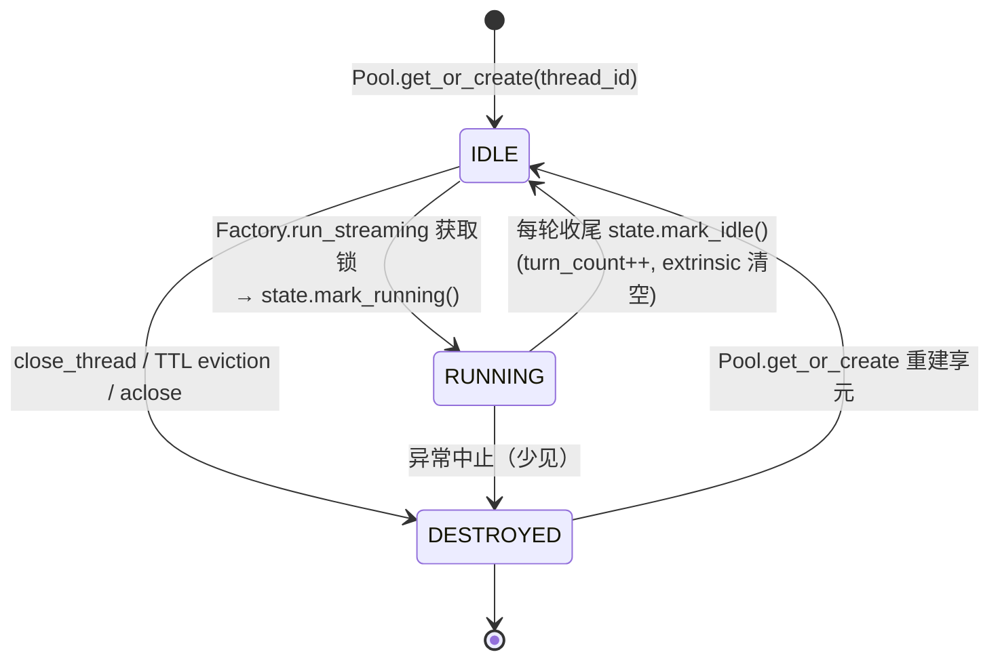

> [Input] `backend/routers/claude_agent.py`, `backend/claude_agent/thread_factory.py`,
>         `backend/claude_agent/thread_pool.py`, `backend/claude_agent/service.py`,
>         `backend/claude_agent/context_builder.py`, `backend/claude_agent/observer.py`
> [Output] Lifecycle design for `/api/claude-agent` context interaction and Thread Engine.
> [Pos] lifecycle-design-doc in `docs/design/lifecycle`
> [Sync] 2026-05-28: initial draft — captures Thread Engine 四阶段生命周期、状态机、
>         上下文交互设计、TTL Sweeper、Observer 钩子，与 `docs/design/claude-agent/` 下
>         相关设计稿同步。
> [Sync] 2026-06-09: 工具确认侧路更新为敏感度策略：manual 全工具确认；auto
>         仅高敏执行/写入/交互工具确认，workspace files/ 内置文件工具、低敏查询、`Skill` 与 `switch_editor` 显式 allow。

# Claude Agent 上下文交互与线程引擎生命周期设计

本文记录 `/api/claude-agent` 上下文交互设计与 Thread Engine 规定的生命周期，作为
`docs/design/claude-agent/` 各模块文档的综合生命周期视图。

**关联设计稿**：
- [`claude-agent-thread-session-patterns.md`](../claude-agent/claude-agent-thread-session-patterns.md) — Phase 1–4 模式层详述
- [`claude-agent-context-assembly.md`](../claude-agent/claude-agent-context-assembly.md) — Phase 1 上下文组装契约
- [`claude-agent-service-design.md`](../claude-agent/claude-agent-service-design.md) — Phase 1/3 业务逻辑
- [`claude-agent-api-contracts.md`](../claude-agent/claude-agent-api-contracts.md) — HTTP 入参与 SSE 响应报文
- [`claude-agent-runner-design.md`](../claude-agent/claude-agent-runner-design.md) — Phase 2 Runner 封装

---

## 1. 生命周期全景

Thread Engine 以 **Thread Session** 为单位管理生命周期。一个 Thread Session 对应一个
`thread_id`（由 `POST /api/claude-agent/threads` 创建），跨多轮对话复用同一 `AgentRunState`
享元（Flyweight），直到被 TTL 驱逐或显式关闭。

```
┌────────────────────────────────────────────────────────────────────┐
│                     Thread Engine 生命周期                          │
│                                                                    │
│  HTTP 请求入口                                                      │
│  POST /api/claude-agent                                            │
│       │                                                            │
│       ▼                                                            │
│  ┌─────────────────────────────────────────────────────────────┐  │
│  │              每轮（Turn）生命周期                             │  │
│  │                                                             │  │
│  │  Phase 1 ─── Phase 2 ─── Phase 3 ─── 每轮收尾              │  │
│  │  上下文组装   Runner创建   会话执行   (→ IDLE)               │  │
│  └─────────────────────────────────────────────────────────────┘  │
│                              ▲                                     │
│                  多轮复用 (intrinsic 保活)                          │
│                                                                    │
│  Phase 4 — Session End（TTL 驱逐 / 显式关闭 / 进程关闭）           │
└────────────────────────────────────────────────────────────────────┘
```

---

## 2. Thread Session 状态机

### 2.1 状态枚举（`AgentRunLifecycle`）

| 状态 | 含义 |
|------|------|
| `IDLE` | 会话活跃但当前无正在执行的 Turn；等待下一轮请求或 TTL 到期 |
| `RUNNING` | 一轮 Turn 正在执行（Phase 3）；同一会话的并发请求被 `asyncio.Lock` 排队 |
| `DESTROYED` | 会话已销毁；下次同 `thread_id` 请求会重建享元 |

### 2.2 状态转移图



### 2.3 关键不变式

- **单消费者**：同一 `thread_id` 的并发请求通过 `asyncio.Lock` 串行执行，不存在两个
  同时处于 `RUNNING` 的同 session Turn。
- **每轮收尾 ≠ Phase 4**：每轮 Turn 结束后，State 回到 `IDLE` 并保留所有 intrinsic
  字段；Phase 4 只在 State 被完全销毁时触发。
- **DESTROYED 可重生**：Pool 对已销毁的 session_id 调用 `get_or_create` 会重建新享元，
  不会复用旧 `AgentRunState` 的字段。

---

## 3. 上下文交互设计（`/api/claude-agent`）

### 3.1 请求入口与鉴权

```
Browser
  │  POST /api/claude-agent
  │  { thread_id, message, resume, tool_choice, ... }
  ▼
FastAPI router (claude_agent.py)
  ├─ get_current_user()          JWT 鉴权
  ├─ database.get_chat_thread()  thread 归属校验
  ├─ attachment sync             文件下载 → workspace
  └─ ClaudeAgentRunRequest       构造标准化请求对象
```

路由层仅负责：认证、thread 归属校验、消息文本提取、附件同步。不构建 system_prompt，
不读历史消息，不操作 Runner。

### 3.2 上下文来源优先级

Phase 1（`assemble_context`）按以下顺序组装上下文：

| 优先级 | 来源 | 轮次策略 | 说明 |
|--------|------|---------|------|
| 1 | 鉴权身份 + thread_id | 每轮验证 | 路由层完成；不再重复读 |
| 2 | 规划任务优化 prompt | 调用前外置 | Expert Prompt Architect 优化后作为 message_parts 传入 |
| 3 | 写作历史上下文 | 首轮构建，后续复用缓存 | `ContextBuilder.build_system_prompt(user_id)` → 读 DB recent sessions |
| 4 | 行为规则 | 首轮构建，后续复用缓存 | 内嵌于 system_prompt 模板 |
| 5 | 附件 / 文件上下文 | 每轮注入 | workspace 文件同步 → content blocks |
| 6 | 运行时上下文 | 每轮注入 | `<runtime_context>` 块（日期、model、turn、session_id 等）|
| 7 | 工作区 cwd | 首轮初始化后缓存 | `get_or_create_workspace(thread_id)` |
| 8 | 工具策略 | 每轮写入 AgentRunOptions | `tool_choice`：auto / manual / none |

### 3.3 Intrinsic vs Extrinsic 状态分离

```
AgentRunState
├── Intrinsic（首轮构建，跨轮复用）
│   ├── system_prompt          写作历史 + 行为规则拼装结果
│   ├── cwd                    workspace 目录绝对路径
│   ├── runner                 ClaudeAgentRunner 实例（Phase 2）
│   └── is_context_initialized 标志位，首轮 False → True
│
└── Extrinsic（每轮刷新，每轮收尾清空）
    ├── user_message            当前轮用户文本
    ├── callbacks               当前轮 AgentStreamingCallbacks
    ├── run_options             当前轮 AgentRunOptions
    └── turn_context            _TurnContext（queue、confirmation_store、去重集合、收集 parts）
```

**为什么分离**：intrinsic 字段（system_prompt / cwd / runner）一旦构建代价较高，跨轮
复用可避免重复 DB 查询和子进程重建；extrinsic 字段（queue / callbacks）是每轮独立的，
必须在轮结束后清空以释放内存并防止状态泄漏。

---

## 4. 四阶段生命周期（Thread Engine）

每次 `POST /api/claude-agent` 触发一个 Turn，Factory 驱动如下四个阶段：

```
Phase 1                Phase 2               Phase 3                Phase 4
上下文组装              Runner 创建            会话执行                 Session 销毁
─────────────────      ───────────────       ──────────────────────   ─────────────────
assemble_context       if runner is None:    execute_session          close_thread
  ├─ 首轮构建            create runner         ├─ runner.run_streaming  │  / TTL eviction
  │  system_prompt      else: reuse           │  └─ SDK query_stream   │  / aclose
  ├─ 每轮构建            inject into           ├─ emit SSE frames       │
  │  extrinsic          execution carrier     │  (text/tool/finish)    ├─ mark_destroyed
  ├─ 工作区 cwd                               ├─ _persist_turn         └─ observer hooks
  └─ 发送 message-metadata                   └─ 每轮收尾 mark_idle
```

### 4.1 Phase 1 — 上下文组装（Context Assembly）

**所有者**：`ClaudeAgentService.assemble_context`

**观察者钩子**：`before_context_assembly` / `after_context_assembly`

**关键行为**：
- `state.is_context_initialized == False`（首轮）：调用 `ContextBuilder.build_system_prompt` 读 DB，写入 `state.system_prompt`，设 `is_context_initialized = True`。
- 后续轮：直接复用 `state.system_prompt`，跳过 DB 查询。
- 每轮重建 `_TurnContext`（queue、confirmation_store、去重集合）。
- 发送初始 `message-metadata` SSE 帧到 queue。
- 返回 `_TurnExecution` carrier（含 run_options + turn_context + runner 引用）。

**输出契约**：返回后，`state.system_prompt` 已就绪，`state.turn_context.queue` 已创建，runner 已注入 execution。

### 4.2 Phase 2 — Runner 创建（Runner Creation）

**所有者**：`ClaudeAgentThreadFactory`

**观察者钩子**：`before_runner_created` / `after_runner_created`

**关键行为**：
- `state.runner is None`（首轮）：实例化 `ClaudeAgentRunner()`，写入 `state.runner`，并注入 execution carrier。
- 后续轮：直接复用 `state.runner`，不重建子进程。

**输出契约**：`execution.runner` 指向有效 Runner 实例；`state.runner` 即为该实例。

### 4.3 Phase 3 — 会话执行（Session Start）

**所有者**：`ClaudeAgentService.execute_session`（后台 asyncio.Task）

**观察者钩子**：`before_session_started` / `after_session_started`

**关键行为**：
1. Factory 调用 `state.mark_running()`（IDLE → RUNNING）。
2. Factory spawn `execute_session` 后台 Task。
3. `execute_session` 内：
   - `runner.run_streaming(run_options, callbacks)` → `claude_agent_sdk.query`
   - SDK 事件 → callbacks → `turn_context.queue.put(event)`
   - Factory 主协程从 queue drain，yield SSE 帧给 Browser
   - 流结束后：`_persist_turn()`（写 DB）→ `queue.put(None)` sentinel
4. Factory 收到 sentinel → 停止 drain → 进入每轮收尾。

**SSE 事件顺序**：
```
message-metadata
text-start → text-delta × N → text-end
[reasoning-start → reasoning-delta × N → reasoning-end]     # thinking mode
[tool-input-start → tool-input-available → tool-output-available]  # per tool call
[tool-approval-request]                                      # manual / auto high-risk tools
message-final
finish
```

**每轮收尾**（Factory `finally` 块，不是 Phase 4）：
- 取消 pending tool confirmations
- `state.turn_context = None`
- `state.mark_idle()` → RUNNING → IDLE，`turn_count++`，刷新 `_last_active_ts`

### 4.4 Phase 4 — Session 销毁（Session End）

**所有者**：`ClaudeAgentThreadFactory._fire_session_ended`

**观察者钩子**：`before_session_ended` / `after_session_ended`

**触发路径**：

| 触发来源 | 原因标签 | 场景 |
|----------|---------|------|
| `DELETE /api/claude-agent/session` → `close_thread` | `explicit_close` | 用户主动关闭 |
| `DELETE /api/claude-agent/threads/{id}` → `close_thread` | `explicit_close` | 删除 thread |
| TTL Sweeper `evict_expired` | `ttl_expired` | 会话超过 `INK_AGENT_TTL_S`（默认 600s）空闲 |
| `factory.aclose()` | `factory_aclose` | 进程关闭 |

**关键行为**：
- `pool.destroy(session_id)` → `state.mark_destroyed()`（清空 runner / turn_context / callbacks / run_options）
- 发送 Observer 钩子（before → after），携带 `{session_id, reason, destroyed, turn_count?}`

---

## 5. Observer 钩子完整映射

| 钩子 | 触发时机 | 携带数据 |
|------|---------|---------|
| `before_context_assembly` | Phase 1 开始前 | `{resume}` |
| `after_context_assembly` | Phase 1 完成后 | `{system_prompt_len}` |
| `before_runner_created` | Phase 2 开始前（首轮）| — |
| `after_runner_created` | Phase 2 完成后（首轮）| runner 实例引用 |
| `before_session_started` | Phase 3 开始前（mark_running 后）| `{resume}` |
| `after_session_started` | Phase 3 每轮收尾（mark_idle 后）| — |
| `before_session_ended` | Phase 4 销毁前 | — |
| `after_session_ended` | Phase 4 销毁后 | `{session_id, reason, destroyed, turn_count?}` |

内置观察者：`LoggingObserver`（info 级别日志，始终注册）。

---

## 6. TTL Sweeper（`AgentRunStateSweeper`）

Sweeper 是一个后台 asyncio Task，每隔 `INK_AGENT_SWEEP_INTERVAL_S`（默认 60s）执行一次
`evict_expired()`：

```
evict_expired()
  for each IDLE session:
    if idle_seconds >= INK_AGENT_TTL_S (默认 600s):
      if session lock NOT held:
        mark_destroyed()
        → _on_sessions_evicted([session_id], "ttl_expired")
          → Phase 4 Observer hooks
```

**为什么跳过 lock 持有的会话**：Session 正在进行 Phase 1 但 mark_running 还未发生时，
lock 已被持有，此时 state 仍为 IDLE；强行驱逐会导致竞态，因此跳过。

**TTL 计时重置**：每次 `state.mark_running()` 和 `state.mark_idle()` 都会刷新
`_last_active_ts`，保证活跃会话不被误驱逐。

---

## 7. 并发控制

```
同一 thread_id 的两个并发请求
  │
  ├── 请求 A：await asyncio.Lock(session_id)  → 获得锁 → Phase 1-3 执行中
  └── 请求 B：await asyncio.Lock(session_id)  → 排队等待 A 完成
                                               → A 释放锁后 B 进入 Phase 1-3
```

每个 `session_id` 一把独立 `asyncio.Lock`，保证同一会话串行执行。不同 session_id
的请求完全并发，互不干扰。

---

## 8. 工具确认侧路（`tool-approval-request`）

```
Phase 3 执行中
  │
  ├─ tool_choice=manual 所有工具，
  │  或 tool_choice=auto 且工具属于高敏执行/写入/交互类
  │    {复杂/写入型 Bash, Write/Edit outside files/, MCP 写入, AskUserQuestion, ...}
  │
  ├─ emit SSE: tool-approval-request {toolCallId, toolName, input}
  ├─ ToolConfirmationStore.begin_pending(tool_call_id)
  │   └─ asyncio.Future 挂起 Phase 3
  │
  │  浏览器收到 SSE 后：
  └── POST /api/claude-agent/tool-confirm
        {thread_id, tool_call_id, approved, reason, answers}
          │
          └─ Factory.confirm_tool → ToolConfirmationStore.resolve(Future)
               └─ Phase 3 恢复执行，携带 approved + answers 回 Claude
```

**超时/断连保护**：Factory `finally` 块在 Phase 3 结束时对所有 `pending_ids()` 调用
`cancel_pending()`，防止悬挂 Future 泄漏到下一轮。

---

## 9. 端点与生命周期关系速查

| 端点 | 生命周期作用 |
|------|------------|
| `POST /api/claude-agent/threads` | 创建 DB thread 记录；不触及 Thread Engine（Session 按需创建） |
| `POST /api/claude-agent` | 触发一个 Turn（Phase 1-3）；Session 不存在则自动建；每轮结束回 IDLE |
| `GET /api/claude-agent/session?session_id=` | 读取 Session 快照（lifecycle / turn_count / idle_seconds / remaining_seconds）；只读，不改状态 |
| `DELETE /api/claude-agent/session?session_id=` | 触发 Phase 4（explicit_close）|
| `DELETE /api/claude-agent/threads/{id}` | 删除 DB thread + 触发 Phase 4 |
| `POST /api/claude-agent/tool-confirm` | 解除 Phase 3 中 ToolConfirmationStore 的挂起 Future |

---

## 10. 关键环境变量

| 变量 | 默认值 | 作用 |
|------|--------|------|
| `INK_AGENT_TTL_S` | `600` | Session IDLE TTL（秒）；超出则被 Sweeper 驱逐 |
| `INK_AGENT_SWEEP_INTERVAL_S` | `60` | Sweeper 清扫间隔（秒）|
| `INK_AGENT_MAX_TURNS` | `100` | 单轮最大 Agent turn 数 |
| `INK_AGENT_SSE_KEEPALIVE_S` | `15` | SSE keepalive 注释帧间隔（秒）|
| `INK_AGENT_CONTEXT_SESSIONS` | — | Phase 1 读取的历史 session 数量上限 |
| `INK_AGENT_EVENT_BUS_BACKEND` | `memory` | SSE EventBus 后端：`memory` 或 `redis`（见 `sse-reconnect-and-event-bus.md` §11）|
| `INK_AGENT_REDIS_URL` | `redis://localhost:6379/0` | Redis 连接 URL（redis 模式）|
| `INK_AGENT_EVENT_BUS_TTL_S` | `3600` | Redis Stream key TTL（秒，redis 模式）|
