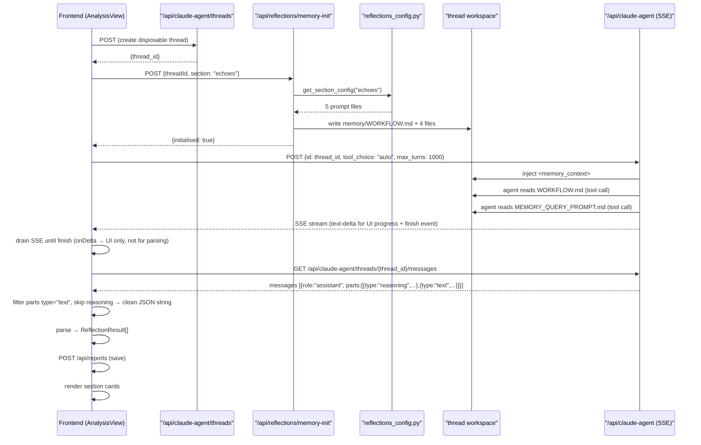

> [Input] `backend/libs/claude_agent_kit/server/memory_workspace.py`,
>         `backend/routers/reflections.py`, `backend/reflections_config.py`,
>         `frontend/src/api/voiceApi.ts`,
>         `frontend/src/components/AnalysisView.tsx`
> [Output] 定义 procedural Memory Workspace 设计：Reflections 分析场景的分区配置、初始化边界、完整时序与验证清单。
> [Pos] memory-workspace-design-doc node in `docs/design/memory`
> [Sync] 2026-06-06: 重写为 procedural-only Memory Workspace 设计，移除 `.claude/memory/` 运行时来源。
>            新增两类使用场景（Voice 对话记忆 / Reflections 分析）、Reflections 三分区配置设计、
>            分区初始化端点对比、Reflections 完整时序图、输出格式 Contract、
>            Polanyi 默会知识分区设计原则、前端 AnalysisView 交互变更、更新代码归属与验证清单。
> [Sync] 2026-06-07: 更新 §11 前端 AnalysisView 设计——恢复暖纸张主题与 PaperStack 报告视图，补充仪表盘 / 报告双视图结构、一键按钮与分区独立按钮交互差异、ResultCard 统一类型说明、历史报告按日合并策略。

# Memory Workspace 设计

## 1. 定位

Memory Workspace 是每个 Claude Agent thread 工作空间下的 `/memory/` 目录。它落地的是 **procedural memory（程序性记忆）**：用流程文件、提示词资源和结构化状态文件来规定 Agent 如何做记忆检索、蒸馏、回答和更新。

短期记忆、长期记忆、程序性记忆仍是理解 Agent 记忆行为的三种概念视角，但本次实现只把程序性记忆落地为 `/memory/` 工作空间。

| 概念 | 含义 | 本次是否落地为 `/memory/` |
|---|---|---|
| 短期记忆 | 当前模型上下文窗口中的即时信息 | 否 |
| 长期记忆 | 跨会话可召回的用户历史、摘要或索引 | 否 |
| 程序性记忆 | 指导"如何检索、蒸馏、回答、更新"的规则、提示词与状态 | 是 |

Polanyi 的默会知识提醒适用于这里：显性规则可以规定流程，但不能穷尽所有判断。Agent 在"是否值得检索""是否值得更新""何时保持沉默""旧记忆是否仍可信"等场景中，需要保留工程实践中的边界感和比例感。因此，系统不把每轮对话强制转成 summary，也不把 `/memory/` 当作对话窗口缓存或长期摘要桶。

---

## 2. 使用场景

Memory Workspace 当前用于一个功能：**Reflections 页面分区分析**。

| 场景 | 触发方 | 配置来源 | 初始化端点 | thread 生命周期 |
|---|---|---|---|---|
| **Reflections 分析** | Reflections 页面分区按钮 | `reflections_config.py`（静态代码） | `POST /api/reflections/memory-init` | 一次性（每次新建） |

---

## 3. 目标目录结构

```text
{AGENT_CWD}/{thread_id}/
├── memory/
│   ├── WORKFLOW.md
│   ├── MEMORY_QUERY_PROMPT.md
│   ├── MEMORY_Distiller_PROMPT.md
│   ├── MEMORY_ANSWER_PROMPT.md
│   ├── DEFAULT_UPDATE_MEMORY_PROMPT.md
│   └── procedural/
│       └── analysis_state.json
├── files/
├── logs/
├── skills/
├── .claude/
└── .editor/
```

五个 Markdown 文件是核心程序性资源：

| 文件 | 职责（Reflections 分析场景） |
|---|---|
| `WORKFLOW.md` | 分区专属分析工作流决策树 |
| `MEMORY_QUERY_PROMPT.md` | 该分区应寻找的信号类型 |
| `MEMORY_Distiller_PROMPT.md` | 从信号到结构化洞察的提取规则 |
| `MEMORY_ANSWER_PROMPT.md` | JSON array 输出规范 |
| `DEFAULT_UPDATE_MEMORY_PROMPT.md` | 状态更新规则（ADD/NO_CHANGE） |

---

## 4. 模板来源

配置存储于 `backend/reflections_config.py`（静态代码），三个分区各自独立：

| 分区 Key | 显示名（EN） | 显示名（ZH） | 分析目标 |
|---|---|---|---|
| `echoes` | Recurring Themes | 回响 | 发现跨会话反复出现的情感主题与思想回响 |
| `traits` | Character Traits | 性格特质 | 从行为与语言中推断稳定的性格倾向 |
| `patterns` | Behavioral Patterns | 行为模式 | 识别写作、生活节奏与应对方式的规律 |

每个分区的 `WORKFLOW.md` 末尾包含 **Tacit Boundary** 节，明确说明显性规则在哪里止步、Agent 的实践判断从哪里接管（Polanyi 原则）。

---

## 5. 初始化边界

`POST /api/claude-agent/threads` 只创建 DB chat thread，不初始化 Memory。

Memory 初始化端点（仅 Reflections 场景使用）：

```
POST /api/reflections/memory-init
body: { "threadId": "<thread_id>", "section": "echoes" | "traits" | "patterns" }
```

执行步骤：

1. 验证当前用户身份
2. 验证 section 为合法值
3. 通过 `chat_thread` 验证 thread 归属
4. 从 `reflections_config.REFLECTIONS_SECTION_CONFIGS[section]` 读取分区配置
5. 创建 `{AGENT_CWD}/{thread_id}/memory/`
6. 写入五个核心提示词文件（分区专属内容）
7. 创建 `memory/procedural/analysis_state.json` 状态文件

---

## 6. claude-agent 引擎与 Memory Workspace 的关系

引擎层（`backend/claude_agent/`）对 Memory Workspace 的处理方式是：**发现即注入，不发现即忽略**。

- `context_builder.py` 的 `build_user_message()` 检测 `cwd/memory/` 是否存在：
  - 存在 → 注入 `<memory_context>` 块（包含 workspace 路径、文件列表）
  - 不存在 → 跳过，分析正常继续
- 引擎系统提示（`_SYSTEM_PROMPT_TEMPLATE`）**不嵌入**记忆操作指令——那是 `memory/WORKFLOW.md` 的职责
- `service.py` 的 `assemble_context()` 不调用 `init_memory_workspace()`

这一设计保证引擎对记忆语义透明：无论是 Voice 对话还是 Reflections 分析，Agent 都通过阅读 `WORKFLOW.md` 来了解当前会话的记忆规则，而非从系统提示中获取硬编码指令。

---

## 7. Reflections 分析流程

用户点击某分区的「分析」按钮后，完整流程如下：

```
用户点击分区「分析」按钮
        │
        ▼
1. POST /api/claude-agent/threads
   → 获得 thread_id（一次性会话，分析完成后不再复用）
        │
        ▼
2. POST /api/reflections/memory-init
   body: { threadId, section: "echoes" | "traits" | "patterns" }
   → 后端从 reflections_config 读取分区 5 个文件
   → 写入 {AGENT_CWD}/{thread_id}/memory/
   → 返回 { initialised: true, section, memoryPath }
        │
        ▼
3. POST /api/claude-agent (SSE)
   body:
   - id: thread_id
   - message: <sessions_context>[session-id] date title labels</sessions_context>
              + 指令：读 memory/WORKFLOW.md，输出 JSON only
   - tool_choice: "auto"   ← 允许 Agent 使用文件读取工具
   - max_turns: 1000          ← 允许多轮（读文件 → 分析 → 输出）
        │
        ▼
4. claude-agent 引擎执行（多轮）
   a. 读取 memory/WORKFLOW.md          → 了解分区分析工作流
   b. 读取 memory/MEMORY_QUERY_PROMPT.md  → 了解信号类型
   c. 读取 memory/MEMORY_Distiller_PROMPT.md → 了解提取规则
   d. 输出结构化 JSON array
        │
        ▼
5. 前端 drain SSE stream 直到 finish 事件
   → text-delta 仅用于 UI 进度展示，不累积为解析来源
   → 原因：SSE 混合输出 reasoning（思维链）和 text，直接拼接会污染 JSON
        │
        ▼
5.5 GET /api/claude-agent/threads/{thread_id}/messages
   → 取最后一条 assistant 消息
   → 过滤 parts：只保留 type="text"，跳过 type="reasoning"
   → 拼接 text parts → 干净的 JSON 字符串
        │
        ▼
6. POST /api/reports
   body: { report_type: "reflections_echoes", report_data: results }
        │
        ▼
7. AnalysisView 对应分区展示多个卡片
   每张卡片：title / description / confidence / relatedCount
   点击卡片 → 关联笔记视图（related_session_ids 精确匹配）
```



---

## 9. 输出格式 Contract（Reflections 场景）

Agent 输出纯 JSON array，每个元素：

```json
{
  "title": "3-6 词的简洁名称",
  "description": "2-4 句描述，诚实捕捉发现",
  "related_session_ids": ["session-id-1", "session-id-2"],
  "evidence": "来自笔记的直接引用或 paraphrase",
  "confidence": "high | medium | low"
}
```

**字段约束**：

- `related_session_ids`：只引用 sessions_context 中真实存在的 ID，前缀格式为 `[session-id]`
- `confidence: "low"` 不是错误，是诚实表达；比强制高置信更有价值（Polanyi 原则）
- `evidence`：无确切引用时留空字符串，不捏造

---

## 10. Reflections 分区配置设计原则（Polanyi）

每个分区的 WORKFLOW.md 必须满足两个条件：

1. **提供明确的显性框架**：告诉 Agent 寻找什么信号、如何结构化输出
2. **留出默会判断空间**：通过 Tacit Boundary 节明确说明规则的边界

Tacit Boundary 示例（echoes 分区）：
> 只出现 2 次的强烈模式可能比出现 10 次的弱信号更重要。规则提供脚手架，不提供机械替代。Agent 的实践边界感在这里负责填补规则未能覆盖的部分。

三个分区的信号类型各有侧重：

| 分区 | 信号侧重 | Tacit Boundary 关注点 |
|---|---|---|
| `echoes` | 情感共鸣与思想回响 | 频率不等于重要性 |
| `traits` | 行为中推断的稳定倾向 | 矛盾特质比单一特质更真实 |
| `patterns` | 时间与条件规律 | 不规律本身也是信息 |

---

## 11. 前端 AnalysisView 设计

### 11.1 双视图架构

| 视图 | 切换条件 | 主题 |
|---|---|---|
| `dashboard`（仪表盘） | 默认入口 | 暖纸张：Georgia 斜体、`var(--color-bg-app)` 米色渐变、DecorativeInkSpots |
| `report`（PaperStack） | 一键分析完成后自动切换 / 点击历史报告 / 点击「View Reflections →」 | 三维堆叠白纸动效，导航箭头 + 圆点 |

### 11.2 分析触发方式对比

| 维度 | 一键「Generate Reflections」 | 分区独立「Analyze / Re-analyze」|
|---|---|---|
| 位置 | 仪表盘头部 stamp 风格按钮 | 仪表盘 SectionControlsRow + PaperStack 纸张头部 |
| 触发范围 | 三分区同时（Promise.all，无 onDelta） | 单分区，带 SSE streaming |
| 完成行为 | 自动切换到报告视图 | 留在当前视图，按分区更新内容 |
| 进度展示 | 分区独立 loading indicator | SSE 实时文字流（最后 800 字符 + `▌`）|

### 11.3 结果卡片（ResultCard — 三分区统一格式）

采用 `ReflectionResult` 统一类型（替代旧的 `Echo / Trait / Pattern` 分离类型）：

| 字段 | 展示位置 | 视觉处理 |
|---|---|---|
| `title` | 卡片标题 | Georgia 斜体 17px，`var(--color-text-primary)` |
| `description` | echoes / patterns 主要描述 | 系统字体，`var(--color-text-body)` |
| `evidence` | traits 主要描述（替代 description） | 同上 |
| `confidence` | traits：5 格进度条；patterns：Confidence pill | 替代旧的 `strength`（1–5）/ `frequency` 字段 |

### 11.4 历史报告加载策略

`reloadSavedReports`（useCallback）按**日历日**合并 DB 记录：分区独立保存的多行在同一天合并为一张 pill；各分区当前展示内容从 individual rows 中分别取最新含该分区的一条。

### 11.5 ⚙ SectionConfigModal

每个分区在仪表盘控制行和 PaperStack 纸张头部均有齿轮按钮，点击打开配置弹窗：可查看/编辑该分区的 5 个 memory workspace 提示词文件，支持保存（PUT）与重置（DELETE → GET），用户自定义激活时显示 CUSTOM 徽章。

---

## 12. 代码归属

| 区域 | 归属文件 |
|---|---|
| Reflections 三分区 procedural memory 配置 | `backend/reflections_config.py` |
| Reflections Memory 初始化 endpoint | `backend/routers/reflections.py` |
| Reflections 分析调用 + drain SSE + 取 messages + 解析 + 存储 | `frontend/src/api/voiceApi.ts` (`analyzeReflectionsSection`) |
| Reflections 分析结果展示 | `frontend/src/components/AnalysisView.tsx` |
| Agent 消费 `<memory_context>`（引擎层，无改动） | `backend/claude_agent/context_builder.py` |

---

## 13. 验证清单

- [ ] `init_workspace()` 不创建 `/memory/`
- [ ] `/api/claude-agent/threads` 不创建 `/memory/`
- [ ] 引擎系统提示不包含记忆操作指令（`context_builder.py` 中已移除）
- [ ] `/api/reflections/memory-init` 能从 `reflections_config.py` 按分区写入 5 个文件
- [ ] 三个分区各自写入独立的 `WORKFLOW.md` 内容
- [ ] Agent SSE 调用时 `tool_choice: "auto"`，允许读取 `WORKFLOW.md`
- [ ] 前端 drain SSE → GET messages API → 过滤 text parts（跳过 reasoning）
- [ ] `related_session_ids` 只引用 sessions_context 中真实存在的 session ID
- [ ] 前端各分区独立 loading 状态，互不阻塞
