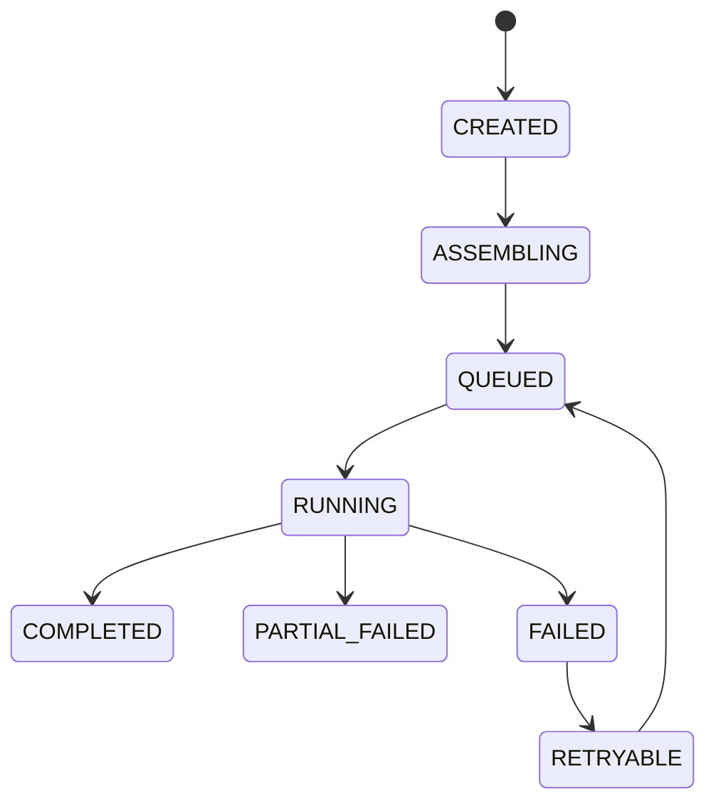

> [Input] `docs/design/memory/reflections-agent-interaction-design.md`,
>         `docs/design/lifecycle/claude-agent-lifecycle.md`,
>         `docs/design/claude-agent/claude-agent-session-persistence.md`
> [Output] Reflections-agent design patterns draft: lifecycle template, state machine,
>          repository, runner/executor, workspace adapter, observer, and anti-overdesign rules.
> [Pos] reflections-agent-patterns-design in `docs/design/memory`
> [Sync] 2026-06-25: split design-pattern content out of the original all-in-one
>         Reflections-agent draft.

# Reflections-agent 设计模式设计稿

## 1. 设计目标

本文只描述 Reflections-agent 的设计模式与代码结构边界，不重复业务 API 和 SSE 协议细节。业务流程见 `reflections-agent-interaction-design.md`，SSE/EventBus 见 `reflections-agent-sse-eventbus-design.md`。

设计目标：

- 复用 Claude Agent 四阶段生命周期思想，但保持 Reflections 任务模型更轻量。
- 用 Repository 模式隔离 DB 持久化。
- 用 Runner/Executor 模式隔离 Agent 执行。
- 用 Workspace Adapter 隔离 Memory Workspace 文件写入。
- 用 Observer 模式为后续音频、视频等模块预留事件监听点。
- 按首版实现顺序落地，避免一次性实现过重基础设施。

---

## 2. 首版模式落地顺序

| 顺序 | 模式/组件 | 为什么先后这样排 |
|---:|---|---|
| 1 | Repository + Persistence Model | 先保证 task/result 是后端真源 |
| 2 | Lifecycle Template + Task Engine | 再让后端按四阶段执行任务 |
| 3 | Event Publisher Port | 再把运行状态向外发布，供 SSE 使用 |
| 4 | Observer Port + `TaskPersistenceObserver` | 最后补扩展点，避免 Observer 先行导致过度设计 |

---

## 3. Lifecycle Template 模式

Reflections-agent 使用 Template Method 思路固定四阶段骨架：

```python
class ReflectionsTaskEngine:
    async def run(self, task_id: str) -> None:
        context = await self.assemble_context(task_id)      # Phase 1
        executor = await self.create_executor(context)      # Phase 2
        outcome = await self.execute_task(context, executor) # Phase 3
        await self.finalize_task(context, outcome)          # Phase 4
```

### 3.1 不变部分

- 每个 task 都必须经历 Phase 1–4。
- 每个 section 完成后立即写 `reflection_result`。
- task 最终必须进入 `COMPLETED/PARTIAL_FAILED/FAILED` 之一。
- 前端断开不影响 `run(task_id)`。

### 3.2 可变部分

- section 范围：默认 echoes/traits/patterns，可由请求过滤。
- Runner 实现：可从本地 Claude SDK、内部 LLM 服务或 mock runner 切换。
- EventBus 实现：首版 in-memory，后续 Redis Stream。

---

## 4. State Machine 模式

### 4.1 Task 状态机



### 4.2 状态流转规则

| From | To | 触发条件 |
|---|---|---|
| `CREATED` | `ASSEMBLING` | 开始读取上下文和写 workspace |
| `ASSEMBLING` | `QUEUED` | 上下文与 workspace 准备完成 |
| `QUEUED` | `RUNNING` | 获取 task lock 并创建 executor |
| `RUNNING` | `COMPLETED` | 所有 section 成功 |
| `RUNNING` | `PARTIAL_FAILED` | 至少一个 section 成功且至少一个失败 |
| `RUNNING` | `FAILED` | 全部 section 失败或出现 fatal error |

### 4.3 状态机约束

- 不允许从 `COMPLETED` 回到 `RUNNING`；重试应创建新 task 或进入 retry flow。
- `PARTIAL_FAILED` 仍可被 latest results 查询使用。
- 状态流转由 Repository 方法封装，避免业务代码直接拼 SQL 改状态。

---

## 5. Repository 模式

### 5.1 接口职责

```python
class ReflectionsTaskRepository(Protocol):
    async def create_task(self, user_id: int, sections: list[str], input_snapshot: dict) -> str: ...
    async def update_status(self, task_id: str, status: str, **fields) -> None: ...
    async def get_task(self, task_id: str, user_id: int) -> dict | None: ...
    async def list_latest_results(self, user_id: int) -> list[dict]: ...

class ReflectionsResultRepository(Protocol):
    async def replace_section_results(self, task_id: str, section: str, results: list[dict]) -> None: ...
    async def list_task_results(self, task_id: str, user_id: int) -> list[dict]: ...
```

### 5.2 设计约束

- Repository 负责 JSON 序列化/反序列化。
- Service/Engine 不直接操作数据库连接。
- section 结果写入建议使用 replace-by-section 语义，方便重试单个 section。
- `user_id` 权限过滤放在查询边界，避免跨用户读取。

---

## 6. Runner/Executor 模式

### 6.1 Runner Port

```python
class ReflectionsAgentRunner(Protocol):
    async def run_section(self, request: ReflectionSectionRunRequest) -> ReflectionSectionRunResult:
        """Run one Reflections section and return validated raw JSON-compatible insights."""
```

### 6.2 Request/Result 边界

`ReflectionSectionRunRequest` 应包含：

- `task_id`
- `section`
- `workspace_path`
- `sessions_context`
- `prompt_files`
- `output_contract_version`

`ReflectionSectionRunResult` 应包含：

- `section`
- `items`
- `raw_output`
- `usage`（可选）
- `error`（失败时）

### 6.3 首版约束

- 首版 section 串行执行，不设计并发 worker pool。
- Runner 只返回结果，不直接写 DB。
- JSON schema 校验可以放在 Engine 或 Result Mapper，不放在 UI。

---

## 7. Workspace Adapter 模式

### 7.1 目标

把 Memory Workspace 文件写入从业务流程中隔离出来，避免 Task Engine 同时承担路径拼接、文件写入、prompt 渲染和状态文件更新。

### 7.2 Adapter Port

```python
class ReflectionsWorkspaceAdapter(Protocol):
    async def prepare_workspace(self, task_id: str, sections: list[str], context: dict) -> str: ...
    async def write_analysis_state(self, task_id: str, state: dict) -> None: ...
    async def read_analysis_state(self, task_id: str) -> dict: ...
```

### 7.3 文件职责

| 文件 | 职责 |
|---|---|
| `WORKFLOW.md` | 分区分析工作流 |
| `MEMORY_QUERY_PROMPT.md` | 信号识别规则 |
| `MEMORY_Distiller_PROMPT.md` | 结构化洞察提取规则 |
| `MEMORY_ANSWER_PROMPT.md` | 输出格式规范 |
| `analysis_state.json` | task/section 执行状态快照 |
| `sessions_context.json` | 本次 task 冻结的输入上下文 |

---

## 8. Observer 模式

### 8.1 Observer Port

```python
class ReflectionTaskObserver(Protocol):
    async def on_event(self, event: ReflectionTaskEvent) -> None:
        """Consume a task event. Failures must be isolated from the main task."""
```

### 8.2 首版 Observer

| Observer | 首版职责 | 是否必须 |
|---|---|---:|
| `TaskPersistenceObserver` | 写 `reflection_task_event`，支持审计和事件回放 | 是，Step 4 |
| `SsePublishObserver` | 把事件发布给 SSE/EventBus | Step 3 后需要 |
| `ModuleNotificationObserver` | 给音频/视频模块预留监听边界 | 只定义接口，不实现业务 |

### 8.3 Observer 规则

- Observer 不允许改变主任务状态，只能通过明确的 Repository 方法写自己的事件记录。
- Observer 异常必须被捕获、记录、隔离。
- Observer 不应同步执行耗时任务；后续音频/视频应创建自己的任务，而不是阻塞 Reflections。

---

## 9. Anti-overdesign 规则

首版不要做：

- 不做通用 DAG 编排器。
- 不做动态插件加载。
- 不做分布式锁，除非进入多实例调度。
- 不做 section 并发 worker pool。
- 不做音频/视频消费实现。
- 不做复杂 result versioning；先以 task 维度保存历史结果。

需要升级时再做：

| 升级项 | 触发条件 |
|---|---|
| Redis Stream EventBus | 多实例部署或进程重启后仍需事件 replay |
| 分布式任务队列 | 单进程 background task 不够用 |
| section 并发 | 分析耗时成为主要瓶颈 |
| 模块 Observer 实现 | 音频/视频模块进入开发阶段 |
