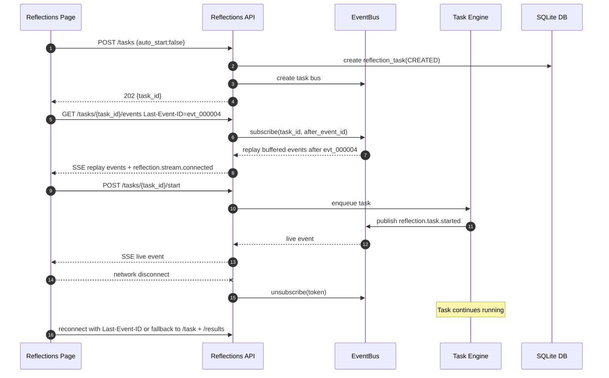

> [Input] `docs/design/memory/reflections-agent-interaction-design.md`,
>         `docs/design/memory/reflections-agent-patterns-design.md`,
>         `docs/design/claude-agent/sse-reconnect-and-event-bus.md`
> [Output] Reflections-agent SSE/EventBus design: event taxonomy, publish/subscribe
>          semantics, reconnect behavior, event replay, Observer dispatch, and rollout order.
> [Pos] reflections-agent-sse-eventbus-design in `docs/design/memory`
> [Sync] 2026-06-25: split SSE/EventBus content out of the original all-in-one
>         Reflections-agent draft.

# Reflections-agent SSE/EventBus 设计稿

## 1. 设计目标

本文只描述 Reflections-agent 的 SSE 与 EventBus 设计，不重复业务生命周期和设计模式细节。

目标：

- 前端能实时看到 Reflections task/section 进度。
- 前端断线、刷新、切页不取消后端任务。
- EventBus 只负责同步消息和订阅分发，DB 仍是最终真源。
- 事件模型可被 Observer 消费，为后续音频、视频模块预留监听入口。
- 首版先用进程内 EventBus，后续按需要升级 Redis Stream。

---

## 2. 接入顺序

SSE/EventBus 是推荐首版实现顺序中的 Step 3，不应早于持久化和 Task Engine：

1. Step 1：`reflection_task` + `reflection_result` 先落地。
2. Step 2：后端 Task Engine 四阶段先可独立运行。
3. Step 3：接入 SSE/EventBus 做实时状态同步，并调整前端顺序为 `create(auto_start=false) → subscribe → start`。
4. Step 4：补 Observer 接口和最小 `TaskPersistenceObserver`。

这个顺序保证：即使 SSE 暂时不可用，用户也能通过 task detail/results 恢复状态。

---

## 3. EventBus 职责边界

### 3.1 EventBus 做什么

- 接收 Task Engine 发布的 task/section 事件。
- 向当前 SSE subscriber 广播事件。
- 在进程内保留当前 task 的短期事件 buffer，支持同进程断线重连回放。
- 把事件转交给 Observer dispatcher。

### 3.2 EventBus 不做什么

- 不作为最终结果存储。
- 不负责执行 Reflections 任务。
- 不直接调用音频/视频业务。
- 不替代 `reflection_task` / `reflection_result` 查询。

---

## 4. 事件模型

### 4.1 事件 Envelope

```json
{
  "id": "evt_...",
  "task_id": "task_...",
  "type": "reflection.section.completed",
  "sequence": 12,
  "created_at": "2026-06-25T00:00:00Z",
  "payload": {
    "section": "echoes",
    "result_count": 4
  }
}
```

字段说明：

| 字段 | 说明 |
|---|---|
| `id` | 全局唯一事件 ID |
| `task_id` | 所属 Reflections task |
| `type` | 事件类型 |
| `sequence` | task 内单调递增序号，用于回放和去重 |
| `created_at` | 事件生成时间 |
| `payload` | 类型相关数据 |

### 4.2 核心事件类型

| 事件 | 触发时机 | payload |
|---|---|---|
| `reflection.task.created` | task 创建后 | `task_id`, `sections` |
| `reflection.context.ready` | Phase 1 完成 | `workspace_path`, `input_snapshot_id` |
| `reflection.task.started` | Phase 3 开始 | `started_at` |
| `reflection.section.started` | section 开始 | `section` |
| `reflection.section.completed` | section 成功 | `section`, `result_count` |
| `reflection.section.failed` | section 失败 | `section`, `error_code`, `retryable` |
| `reflection.task.completed` | task 全部成功 | `duration_ms` |
| `reflection.task.partial_failed` | task 部分失败 | `completed_sections`, `failed_sections` |
| `reflection.task.failed` | task 失败 | `error_code`, `retryable` |

---

## 5. SSE 协议草案

### 5.1 订阅接口

```http
GET /api/reflections/tasks/{task_id}/events
Accept: text/event-stream
Last-Event-ID: evt_...
```

### 5.2 SSE frame

```text
event: reflection.section.completed
id: evt_000012
data: {"task_id":"task_...","sequence":12,"payload":{"section":"echoes","result_count":4}}
```

### 5.3 前端恢复策略

前端不应只依赖 SSE：

1. 创建任务时使用 `POST /api/reflections/tasks` 且 `auto_start=false`。
2. 立即订阅 `/events`，收到 `reflection.stream.connected` 后再调用 `POST /tasks/{task_id}/start`。
3. 如果 SSE 断开，使用 `Last-Event-ID` 重连。
4. 如果 replay 不可用，降级调用 `/tasks/{task_id}` 和 `/results` 恢复页面。

---

## 6. InMemoryEventBus 首版设计

### 6.1 Port

```python
class ReflectionEventBus(Protocol):
    async def publish(self, event: ReflectionTaskEvent) -> None: ...
    async def subscribe(self, task_id: str, after_event_id: str | None = None) -> object: ...
    async def unsubscribe(self, token: object) -> None: ...
    def read(self, token: object) -> AsyncIterator[ReflectionTaskEvent]: ...
```

### 6.2 In-memory 语义

- 以 `task_id` 维护事件 buffer。
- 新 subscriber 先回放 buffer 中的历史事件，再接收实时事件。
- 订阅者断开只移除 subscriber，不取消 Task Engine。
- task 到达终态后保留短期 buffer；最终以 DB task/result/event 为准。

### 6.3 升级 Redis Stream 的条件

满足任一条件再升级：

- 后端多实例部署，SSE 连接和 task 执行可能落到不同实例。
- 进程重启后仍要求事件 replay。
- 事件消费者不只 UI，还包括独立服务。

---

## 7. Observer 分发链路

EventBus 与 Observer 的关系：

```text
Task Engine
  └─ publish(event)
      ├─ EventBus buffer + SSE subscribers
      └─ ObserverDispatcher
          ├─ TaskPersistenceObserver
          ├─ SsePublishObserver（如果架构选择单独封装）
          └─ ModuleNotificationObserver（仅预留）
```

### 7.1 Dispatcher 规则

- Observer 按注册顺序接收事件。
- Observer 失败只记录错误，不抛回 Task Engine。
- 耗时 Observer 必须异步排队，不阻塞主任务。
- 音频/视频模块未来只应监听 completed/section.completed 级别事件，不读取 Runner 内部状态。

---

## 8. 断线重连流程



---

## 9. 反过度设计边界

首版必须做：

- task-scoped event envelope。
- task/section started/completed/failed 事件。
- SSE subscribe + basic reconnect。
- `auto_start=false` + `/start` 控制，保证前端先订阅再启动任务。
- 断线后不取消后端 task。
- 降级查询 task detail/results。

首版不做：

- 不做 Redis Stream，除非已经确定多实例需要。
- 不做复杂 consumer group。
- 不做音频/视频事件消费。
- 不做事件 schema registry。
- 不要求 EventBus 保存永久历史。
