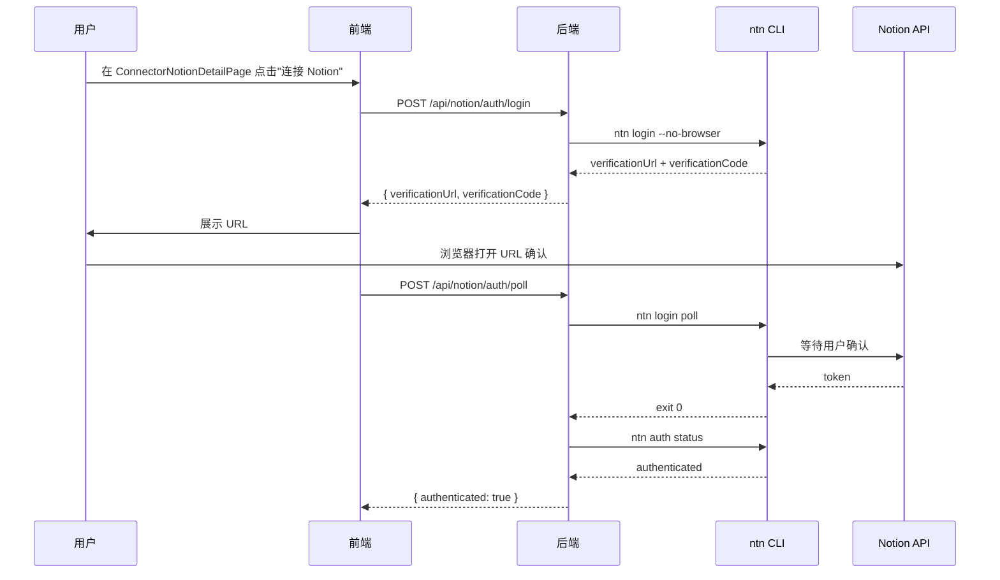
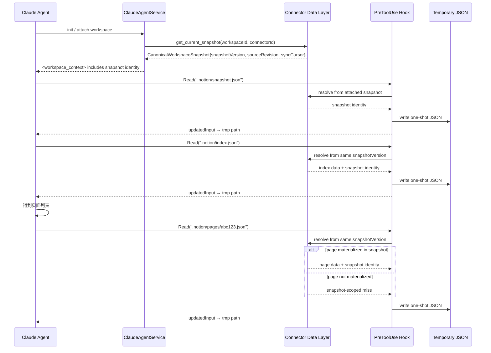
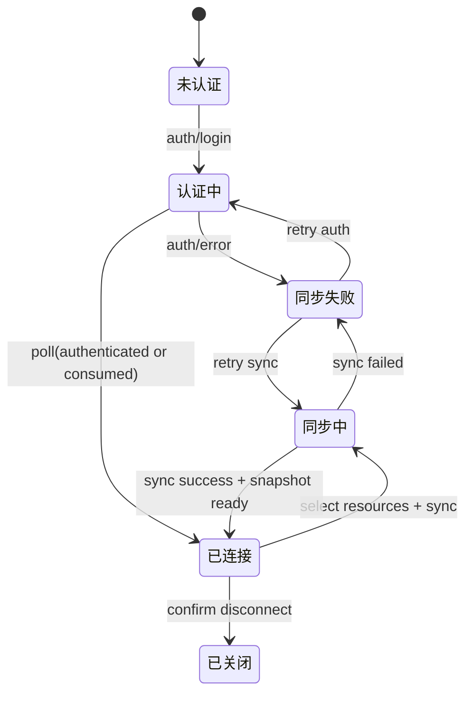

# Notion Device 资源连接器 — 交互方案设计

Status: Draft  
Updated: 2026-07-09
Scope: 设计 — 智能体创建工作空间 Notion Device 资源连接器的完整交互流程

> [Input] `docs/design/notion-session/overview.md`,
>      `docs/design/claude-agent/edit-point/workspace-adapter.md`,
>      `docs/design/claude-agent/edit-point/workspace-context.md`,
>      `docs/design/claude-agent/edit-point/workspace-switch.md`,
>      `docs/prd/Chat 工作区入口页.md`,
>      `docs/prd/notion-session/连接器具体配置页面结构草图.md`
> [Output] 定义用户从创建资源连接器到 Agent 消费 `.notion/` 映射的完整业务交互流程
> [Pos] connector-interaction-doc in `docs/design/notion-session`
> [Sync] 2026-06-21: 初始设计 — 资源连接器交互方案
> [Sync] 2026-06-22: 修正核心概念声明 — 依据 Notion API Reference 区分 Database/Row Page/Standalone Page/Block
> [Sync] 2026-06-28: 修正 Agent 初始化一致性 — `.notion/` 映射由资源连接器数据层的 canonical snapshot 提供，不再以 Agent 本地 NotionCache 作为权威状态。
> [Sync] 2026-07-05: 增补认证会话保持语义，避免 `ntn login poll` 单次会话消费后前端重复轮询导致状态回退。
> [Sync] 2026-07-07: 交互入口迁移到 Chat 入口页，应用导航控制 `聊天历史` / `资源连接器` 视图，连接器工作台嵌入 Chat shell；同页新增输入框下方的快捷功能 strip，并定义 shell 级 `shell_error` 降级。
> [Sync] 2026-07-07: 明确嵌入态状态隔离：`聊天历史` 使用会话与空态语义，`资源连接器` 只由真实 connector context 驱动空态 / 认证 / 资源选择；外层 shell 锁定 viewport，滚动只发生在内部区域。
> [Sync] 2026-07-08: 纠正曾偏移的入口叙述，统一以 Chat `WorkspaceTabBar` 为资源连接器主入口，废弃仅摘要化的路径表述。
> [Sync] 2026-07-08: 详情页组件树统一收敛为 Settings 内 `ConnectorNotionDetailPage` / `TopNavigation` / `ConnectorHeader` / `ResourceScopeSection` / `MountedSourcesSection`，并固定面包屑为 `资源连接器 > Notion Connector`。
> [Sync] 2026-07-09: `ConnectorHeader` 改为无边框紧凑信息栏，授权 / 同步 / 已链接资源数量 / 最近同步 / 限制提示统一放入其中；其下仅保留 `StrategyDesignPlaceholder`，策略暂不实现。
> [Sync] 2026-07-08: Notion 详情页按“同一平台只能认证一个账号”重构，不再嵌入集合型 `ResourceConnectorPage`，也不暴露新建 / 刷新 / 连接器列表入口。
> [Sync] 2026-07-08: 资源范围选择合并为一个可搜索、每页 10 条的统一列表；保存资源后已挂载来源立即回显；底部授权 / 同步状态卡移除。
> [Sync] 2026-07-08: 骨架屏规则重新对齐两份最新草图：Chat 历史加载、Chat 连接器加载、以及详情页 breadcrumb/header/overview/resource list 都改用结构化 skeleton，而非纯文字提示。
> [Sync] 2026-07-08: 修正 Chat 资源连接器跳转错位：`ConnectorLandingPanel` 的「选择连接器」和连接器状态面板管理入口统一进入 Settings「资源链接」区；Chat 不再打开内部配置页。
> [Sync] 2026-07-08: 修正 Chat 入口比例与连接器已连接态表达：landing 主内容区与输入框 / `WorkspaceTabBar` 同宽居中，历史 tab 移除外层冗余边框；连接器列表改为非按钮状态面板，展示授权、同步和已链接资源摘要，只有小型「管理」入口跳转 Settings。
> [Sync] 2026-07-08: 修复已挂载资源持久化链路：资源选择保存到 `connector_resources` 后必须随 connector `sources` 返回，Settings 刷新和 Chat 已链接资源共用 persisted sources；Notion People 系统 data source 在 discovery 层过滤。
> [Sync] 2026-07-09: Chat `ConnectorLandingPanel` 减少卡片设计；根内容区无外框，状态信息块使用虚线边界但无卡片底色 / 阴影，空态和已链接资源行改用轻表面层级，仅管理入口保留弱边界。
> [Sync] 2026-07-09: Settings `ResourceOptionRow` 和 `MountedSourcesSection` 不展示 `0 pages`；页数只有在 `pageCount > 0` 时作为右侧元信息出现。

---

## 目录

1. [问题分析](#1-问题分析)
2. [核心概念声明](#2-核心概念声明)
3. [业务交互流程](#3-业务交互流程)
4. [资源连接器创建流程](#4-资源连接器创建流程)
5. [数据同步至 `.notion/` 映射](#5-数据同步至-notion-映射)
6. [Agent 对话消费流程](#6-agent-对话消费流程)
7. [ntn api 集成设计](#7-ntn-api-集成设计)
8. [时序图](#8-时序图)
9. [与 workspace-adapter 模式的映射关系](#9-与-workspace-adapter-模式的映射关系)
10. [不实现清单](#10-不实现清单)

---

## 1. 问题分析

### 1.1 现状评估

`overview.md` 已定义四层抽象（认证层、数据层、操作层、任务层）及 `.notion/` 虚拟索引机制，但**缺少以下关键设计**：

| 缺失项 | 影响 |
|--------|------|
| 用户创建资源连接器的交互流程 | 前端无法落地 |
| Database 选择与 PageID 映射 | Agent 无法定位用户可访问的数据 |
| `ntn api v1/search` 集成路径 | 同步任务无实现方案 |
| Agent 对话中如何触发 `.notion/` 同步 | 数据新鲜度无保障 |

### 1.2 设计边界

本文档仅覆盖**交互方案设计**，不涉及代码实现。实现细节参考 `overview.md`。

### 1.3 目标符合性判断

| 现有设计 | 是否符合目标 | 调整 |
|---|---|---|
| 用户创建连接器、认证、选择 Database/Page | 符合 | 保留 |
| `.notion/` 映射作为 Agent 读取入口 | 符合 | 数据源改为 canonical snapshot |
| Agent 对话中触发 lazy load 并更新缓存 | 不符合 | Agent Read 不直接远程拉取；由连接器数据层刷新并生成新 snapshot |
| `switch_editor(device="notion")` | 过度设计 | 不复用 editor session 切换；Notion connector 由 workspace resource selection 决定 |
| Notion 写回 | 超出本期 | 仅保留 proposal/write pipeline 交互边界 |
| Chat landing 快捷功能与 shell fallback | 现状未明确 | 保留 shell 级 `shell_error` 与内部滚动边界，但资源入口以 `WorkspaceTabBar` 为主 |

---

## 2. 核心概念声明

> 参考：[Notion API — Database](https://developers.notion.com/reference/database)

| 概念 | 定义 | 关系 |
|------|------|------|
| **Resource Connector（资源连接器）** | 连接外部平台资源到 ink-and-memory 工作空间的抽象实体 | 一个用户可拥有多个平台连接器，但同一平台只允许一个认证账号 |
| **Database** | Notion 中定义属性 Schema（列/字段）的特殊对象。可以是 full-page database 或 inline database（内嵌于某个 Page 中）。Database 本身不包含内容块，仅定义 properties schema | 一个连接器可关联多个 Database |
| **Page（页面）** | Notion 中的内容单元。分为两类：① **Database Row Page** — parent 为 database，属性值遵循所属 Database 的 schema；② **Standalone Page** — parent 为 workspace 或另一个 page，与 Database 无关联 | 一个 Database 下可包含多个 Row Page；Standalone Page 独立存在 |
| **PageID** | Page 的唯一标识（UUID）。无论是 Database Row Page 还是 Standalone Page，均拥有独立的 PageID | — |
| **Block** | Notion 中的最小内容单元（段落、标题、列表等）。Page 由 Block 组成；Database 不直接包含 Block | Page 的 children |
| **`.notion/` 映射文件** | 工作空间内的虚拟索引目录，呈现连接器数据层物化的 canonical snapshot | 与连接器数据层强关联 |
| **ntn api** | Notion 官方 CLI 提供的 API 直调命令 | 自动处理 Auth/Version 头 |

### 2.1 Notion 对象层次（API 视角）

```
Workspace
  ├── Database (定义 properties schema)
  │     └── Page (Database Row — 属性值遵循 schema)
  │           └── Block (段落/标题/列表等内容块)
  └── Page (Standalone — 独立页面，无 Database 关联)
        ├── Block (内容块)
        └── Database (Inline — 内嵌数据库，parent 为此 Page)
              └── Page (Database Row)
```

### 2.2 资源连接器映射层次

```
Resource Connector (资源连接器)
  ├── Database (用户选定的数据库)
  │     └── Page (Database Row)
  │           └── .notion/pages/<page_id>.json
  └── Standalone Page (独立页面，通过 v1/search 发现)
        └── .notion/pages/<page_id>.json
```

---

## 3. 业务交互流程

### 3.1 全局流程概览

```txt
用户进入 Chat Dashboard
    │
    ├─ 看到 ChatTopHeader + 居中的 ChatInputDock
    │
    ├─ WorkspaceTabBar 默认选中「聊天历史」
    │
    ├─ 点击「资源连接器」
    │   ├─ 显示 ConnectorToolbar（筛选 / 排序）
    │   ├─ 无连接器 → 轻表面空态：远程资源 / 本地资源 / 更多图标 + 暂无资源连接器 + 选择连接器
    │   └─ 有连接器 → ConnectorStatusPanel 列表（平台状态 + 已链接资源摘要）
    │
    ├─ 点击「选择连接器」或 Notion Connector 状态面板中的「管理」
    │   └─ 页面级导航到 Settings，并聚焦「资源链接」
    │
    ├─ 在 Settings 点击 Notion「管理」
    │   └─ 页面级导航到 ConnectorNotionDetailPage
    │       顶部显示「← 资源连接器 > Notion Connector」
    │
    ├─ 在 ConnectorNotionDetailPage 中完成认证、来源选择与同步
    │   └─ ResourceScopeSection 在已认证后展示统一资源列表，支持搜索、每页 10 条分页和勾选；页数只在 pageCount > 0 时显示
    │
    └─ 返回 Chat 并继续提问
          ├─ Agent 初始化时 attach 当前 canonical snapshot
          ├─ `.notion/` 虚拟索引从同一 snapshotVersion 读取
          ├─ Chat `ResourceConnectorTabPanel` 从 connector `sources` 展示已链接资源
          └─ notion-cli skill 可按需同步到工作空间
```

### 3.2 流程阶段定义

| 阶段 | 触发者 | 输出 | 存储位置 |
|------|--------|------|---------|
| 1. 进入连接器摘要面板 | 用户（Chat `ResourceConnectorTab`） | 当前连接器列表或空态 | 前端工作区状态 |
| 2. 进入资源链接设置区 | 用户（点击 `ConnectorStatusPanel` 管理入口 / `选择连接器`） | `ConnectorSettingsSection` | App 视图状态 |
| 3. 进入 Notion 详情页 | 用户（Settings 点击 Notion「管理」） | `ConnectorNotionDetailPage` | App 视图状态 |
| 3. 认证 | 用户（浏览器确认） | ntn token | `NOTION_HOME/` |
| 4. 资源选择 | 用户（`ResourceScopeSection`） | 选定的 data_source_id 与 page_id 及资源元数据 | `connector_resources`，并随 connector `sources` 返回 |
| 5. 数据同步 | 后端（自动） | Database Row Page + Standalone Page canonical snapshot | 资源连接器数据层 |
| 6. 对话消费 | Agent（PreToolUse） | 同一 snapshotVersion 下的页面内容 | `.notion/pages/<id>.json` 虚拟读取 |

### 3.3 认证会话保持（避免 `poll` 回退）

`ntn login poll` 在授权完成后可能返回 `No pending login session found` 或 `authorization session already consumed`。
这不是认证失败，而是会话消费后的正常状态。设计要求后端对每次认证启动持久化会话并做幂等判断。

策略：

- `auth/login` 先创建新的 `auth_session`：
  - `auth_session_id`
  - `auth_session_status`（`running`/`pending`）
  - `auth_session_started_at`
  - `auth_session_last_polled_at`
  - `auth_session_poll_in_flight`
  - `auth_session_expires_at`
- `auth/poll` 读取会话状态；当状态已 `authenticated` 时，直接返回 `authenticated`，不再回退。
- `auth/poll` 遇到 `No pending login session found` 时将会话标记 `consumed`，并保留认证成果。
- 前端不应以“重复 pending”作为唯一阻塞根因；应改以 `connector.auth_status` + `config.auth_session` 进行 UI 判定。

### 3.4 已挂载来源持久化与回显

- `POST /api/connectors/:id/resources/select` 接收完整 selected database / page 对象，至少包含外部 id、标题、URL、最近编辑时间和 page count。
- 后端持久化到 `connector_resources` 后，`GET /api/connectors` 与 `GET /api/connectors/:id` 必须把这些记录作为 connector `sources` 返回。
- 前端 source id 必须使用 Notion 外部 id（`external_id` / `database_id` / `page_id`），不能使用 DB 内部 `connector_resources.id`，否则刷新后选择态无法和 discovery 结果对齐。
- `MountedSourcesSection`、Settings 资源范围选中态、Chat `ConnectorStatusPanel` 都以同一份 persisted `sources` 为准。
- `ResourceOptionRow` 与 `MountedSourcesSection` 中的页数是辅助元信息，只在 `pageCount > 0` 时展示；`0 pages`、缺失值或不可用统计不进入 UI。
- Notion `People` / Workspace user system data source 不进入用户可选资源列表；过滤在后端 discovery 层完成。

### 3.5 Chat shell 降级与恢复

- `ChatViewContent` 若因渲染异常、tab 初始化失败或连接器列表加载中断而不可交互，必须显示可恢复错误态，而不是整页留白。
- `shell_error` 只表示 Chat shell 级故障，不表示 connector 认证、同步或 snapshot 状态异常。
- 在 `shell_error` 下，用户仍应看到 `ChatInputDock` 与 `WorkspaceTabBar`，并能明确知道当前停留在 `HistoryTab` 还是 `ResourceConnectorTab`。
- shell 恢复后应回到上一次选中的 tab，并保留该 tab 内最后一次已成功读取的数据快照。
- `ConnectorNotionDetailPage` 属于 Settings 视图，不受 Chat shell 降级替换；若详情页自身接口失败，只能在详情页内容区内显示错误卡并保留 `TopNavigation`。
- Chat shell 要保持 `height: 100%` / `min-height: 0` / `overflow: hidden` 的连续链路；Settings 详情页允许页面级滚动，但来源树 / 连接器工作台内部应保持自身滚动边界。

### 3.6 骨架屏要求（对齐两份最新草图）

- 背景：历史列表、连接器 Tab 内容、以及 Notion 详情页都必须使用结构化 skeleton；不得退化为纯文字 loading。
- 规则：
  1. `HistoryTab` 首次加载（`isLoadingThreads && visibleThreads.length === 0`）时，显示 `HistorySkeletonList`：3~5 条历史条目骨架，包含标题条、摘要条、时间占位。
  2. `ResourceConnectorTab` 首次加载时，显示 `ConnectorToolbar` 的筛选 / 排序 pill 骨架，以及 2~3 张连接器状态面板骨架；在结果返回前不得先渲染“暂无资源连接器”。
  3. `ConnectorNotionDetailPage` 首次加载时，至少同时出现三组骨架：`TopNavigation` breadcrumb skeleton、`ConnectorHeader` 信息栏 skeleton、`ResourceScopeSection` skeleton。
  4. 当 `ResourceScopeSection` 已进入已认证态但尚未拉到来源数据时，展示统一资源列表骨架，而不是“读取连接器状态…”之类纯文本。
  5. 骨架只用于首次加载，不覆盖错误态、空态、已关闭态或已有数据后的增量刷新态。

---

## 4. 资源连接器创建流程

### 4.1 前端交互步骤

```txt
Step 0: 进入 Chat Dashboard，并在 WorkspaceTabBar 中切换到「资源连接器」
    │
    ├─ 看到 ConnectorToolbar + 空态或连接器状态面板列表
    ├─ 点击「选择连接器」或某个 Notion Connector 状态面板中的「管理」
    └─ 导航到 Settings「资源链接」
        └─ 点击 Notion「管理」后进入 ConnectorNotionDetailPage（← 资源连接器 > Notion Connector）

┌─────────────────────────────────────────────────────────────┐
│ Step 1: 认证                                                 │
│                                                             │
│   "正在连接 Notion..."                                       │
│   验证码: VAF-HWY                                           │
│   [打开浏览器确认] ← 用户点击                                 │
│     ↓                                                       │
│ Step 2: 搜索并选择资源                                       │
│                                                             │
│   [搜索资源: roadmap] [保存资源] [刷新同步]                  │
│   Data source · ink-and-memory 代办清单                   ✓   │
│   Data source · 阅读笔记 · 7 pages                        ✓   │
│   Page · 产品设计文档                                          │
│   Page · 个人日记                                              │
│   [上一页] 第 1/3 页 [下一页]                                │
│   保存资源后：已挂载来源立即显示所选 data_source / page        │
│     ↓                                                       │
│ Step 3: 同步完成                                             │
│                                                             │
│   "已同步 2 个数据库，共 47 个页面"                           │
│   [完成]                                                     │
└─────────────────────────────────────────────────────────────┘
```

### 4.2 API 设计

| 端点 | 方法 | 用途 |
|------|------|------|
| `/api/connectors` | POST | 创建资源连接器 |
| `/api/connectors/:id/auth/login` | POST | 启动 ntn login 认证 |
| `/api/connectors/:id/auth/poll` | POST | 轮询认证完成状态（幂等：已认证直接返回 authenticated） |
| `/api/connectors/:id/databases` | GET | 获取可访问的 database 列表 |
| `/api/connectors/:id/pages` | GET | 获取可访问的 standalone page 列表 |
| `/api/connectors/:id/resources/select` | POST | 用户选择要同步的 database 和 standalone page，并持久化完整资源元数据到 `connector_resources` |
| `/api/connectors/:id/sync` | POST | 触发数据同步 |

### 4.3 数据模型

```
resource_connectors
├── id: UUID
├── user_id: FK → users
├── platform: "notion"
├── auth_status: "pending" | "authenticated" | "expired"
├── config: JSON
│     └── notion_home: string
├── last_synced_at: timestamp
├── current_snapshot_version: string | null
├── current_source_revision: string | null
├── current_sync_cursor: string | null
├── created_at: timestamp
└── updated_at: timestamp

connector_resources
├── id: UUID
├── connector_id: FK → resource_connectors.id
├── resource_type: "notion_database" | "notion_page"
├── external_id: string       ← Notion database_id / page_id
├── title: string
├── metadata: JSON            ← url、page_count、last_edited、properties_schema、raw 等
├── sync_status: "syncing" | "synced" | "error"
├── created_at: timestamp
└── updated_at: timestamp
```

`GET /api/connectors` 与 `GET /api/connectors/:id` 必须把 `connector_resources` 归一化为 connector `sources` 返回。前端使用 `external_id` / `database_id` / `page_id` 作为 source id，避免刷新后和 discovery 结果无法对齐。

---

## 5. 数据同步至 canonical snapshot，再通过 `.notion/` 映射读取

### 5.1 同步触发时机

| 时机 | 触发方式 | 同步范围 |
|------|---------|---------|
| 连接器创建完成 | 自动 | 全量同步并物化首个 canonical snapshot |
| 用户进入对话 | Agent init / workspace attach | 读取当前 canonical snapshot，不直接远程拉取 |
| 用户点击刷新 | 前端触发连接器 sync | 生成新 snapshotVersion |
| Agent 提出写入 | proposal/write pipeline | 远程确认后同步并生成新 snapshotVersion |

### 5.2 `.notion/` 虚拟映射结构（扩展）

`.notion/` 目录中的 JSON 是占位读入口。实际内容来自连接器数据层当前 attach 的 canonical snapshot。

```
.notion/
├── README.md                    ← Agent 引导说明
├── connector.json               ← ★ 连接器元信息
├── snapshot.json                ← 当前快照身份
├── index.json                   ← 所有已同步 Page 列表
├── databases.json               ← 选定的 Database 元信息
├── databases/
│     ├── <db_id_1>.json         ← Database 1 的 Page 清单
│     └── <db_id_2>.json         ← Database 2 的 Page 清单
└── pages/
      └── <page_id>.json         ← 当前 snapshot 已物化的单页内容
```

### 5.3 `connector.json` 内容

```json
{
  "connector_id": "conn-abc123",
  "platform": "notion",
  "auth_status": "authenticated",
  "snapshot": {
    "workspace_id": "workspace-001",
    "resource_connector_id": "conn-abc123",
    "snapshot_version": "snap-20260628-001",
    "source_revision": "notion-rev-789",
    "sync_cursor": "cursor-456",
    "fetched_at": "2026-06-28T14:00:00Z"
  },
  "sources": [
    {
      "type": "notion_database",
      "database_id": "db-001",
      "title": "ink-and-memory 代办清单",
      "page_count": 32
    },
    {
      "type": "notion_database",
      "database_id": "db-002",
      "title": "阅读笔记",
      "page_count": 15
    },
    {
      "type": "notion_page",
      "page_id": "page-xyz",
      "title": "产品设计文档"
    }
  ],
  "last_synced_at": "2026-06-28T14:00:00Z"
}
```

### 5.4 `databases/<db_id>.json` 内容

> Database 下的每个 Page 是一个 Row Page，其属性值遵循该 Database 的 properties schema。

```json
{
  "database_id": "db-001",
  "title": "ink-and-memory 代办清单",
  "properties_schema": {
    "Name": { "type": "title" },
    "Status": { "type": "select" },
    "Due": { "type": "date" }
  },
  "pages": [
    {
      "page_id": "page-aaa",
      "title": "用户认证模块重构",
      "last_edited": "2026-06-20T10:30:00Z",
      "status": "In Progress"
    },
    {
      "page_id": "page-bbb",
      "title": "前端组件优化",
      "last_edited": "2026-06-19T08:00:00Z",
      "status": "Done"
    }
  ],
  "snapshot": {
    "snapshot_version": "snap-20260628-001",
    "source_revision": "notion-rev-789",
    "sync_cursor": "cursor-456"
  },
  "synced_at": "2026-06-28T14:00:00Z"
}
```

---

## 6. Agent 对话消费流程

### 6.1 Agent 感知资源连接器

当用户进入对话时，`<workspace_context>` 中注入连接器状态信息：

```
Notion Device Connector:
  Status: authenticated
  Sources: 2 data_sources, 1 page
  Total Pages: 47
  Snapshot: snap-20260628-001
  Source Revision: notion-rev-789
  Last Synced: 2026-06-28T14:00:00Z

  Read .notion/snapshot.json for the attached snapshot identity.
  Read .notion/connector.json for connector details.
  Read .notion/index.json for page listing.
  Read .notion/databases/<db_id>.json for database-specific pages.
```

### 6.2 Notion CLI Skill 同步

资源连接器创建成功后，自动同步常用 notion-cli skill 到工作空间 `skills/` 目录：

| Skill 文件 | 用途 |
|------------|------|
| `skills/notion-search.md` | 通过 ntn api 搜索 Notion 内容 |
| `skills/notion-page-read.md` | 读取指定页面完整内容 |
| `skills/notion-db-query.md` | 查询指定 Database 下的页面 |

各 Skill 文件的完整设计详见：[`skills/`](./skills/) 目录

- [`skills/notion-search.md`](./skills/notion-search.md) — 搜索 Notion 内容
- [`skills/notion-page-read.md`](./skills/notion-page-read.md) — 读取页面完整内容
- [`skills/notion-db-query.md`](./skills/notion-db-query.md) — 查询 Database 下的页面

---

## 7. ntn api 集成设计

### 7.1 核心命令映射

| 业务需求 | ntn api 命令 | 调用时机 |
|---------|-------------|---------|
| 获取 Data source 列表 | `ntn api v1/search filter:='{"property":"object","value":"data_source"}'` | 连接器创建 Step 2（统一资源选择） |
| 获取 Page 列表 | `ntn api v1/search filter:='{"property":"object","value":"page"}' page_size:=100` | 连接器创建 Step 2（统一资源选择） |
| 关键词搜索资源 | `ntn api v1/search --data '{"query":"roadmap","page_size":10}'` | 资源范围搜索 |
| 获取 Data source 下的 Row Page | `ntn api v1/data_sources/<data_source_id>/query` | 数据同步阶段 |

Discovery 过滤规则：

- `v1/search` 返回的 Workspace People / 用户成员系统 data source 不属于用户可挂载业务资源。
- 过滤应在后端 `discover_databases` 边界完成，前端只接收可展示资源。
- 识别条件要求同时具备系统库特征，例如标题为 People 且包含 `people:*` 属性、`Person` people 字段或 `Membership Type` 成员角色字段；不得只按标题 alone 过滤普通用户数据库。

### 7.2 后端封装

```python
# 概念设计 — 不是实现代码
class NotionAPIBridge:
    """封装 ntn api CLI 调用，统一错误处理与超时管理。"""

    async def search(self, filter_obj: dict, page_size: int = 100) -> dict:
        """调用 v1/search 端点。"""
        ...

    async def list_data_sources(self) -> list[dict]:
        """获取用户可访问的所有 Data source。"""
        ...

    async def list_standalone_pages(self) -> list[dict]:
        """获取用户可访问的 Standalone Page（非 Database Row）。"""
        ...
```

---

## 8. 时序图

### 8.1 认证流程



### 8.2 Agent 读取 Notion 内容流程



---

## 9. 实现文件索引

| 文件 | 变更内容 | 状态 |
| ------------------------------------------------------------ | ------------------------------------------------------------ | -------- |
| `backend/libs/claude_agent_kit/server/notion_snapshot.py` | canonical snapshot 合同、状态枚举、`.notion/` 路径解析、write proposal stale 判断 | ✅ 已实现 |
| `backend/tests/test_notion_snapshot_contract.py` | 验证快照路径解析、数据提取、缺页语义、proposal 版本判断 | ✅ 已实现 |
| `backend/notion/auth.py` | `ntn login` 流程编排、NOTION_HOME 管理、auth status 检测 | 待实现 |
| `backend/notion/sync.py` | 同步远程数据并物化 canonical snapshot | 待实现 |
| `backend/notion/snapshot_store.py` | 持久化 current snapshot、历史版本和审计字段 | 待实现 |
| `backend/libs/claude_agent_kit/server/agent_runner.py` | 未来接线：PreToolUse `.notion/` 读取从 attached snapshot 重定向 | 待实现 |
| `backend/claude_agent/workspace_context.py` | 未来接线：`WORKSPACE_CONTEXT_TEMPLATE` 注入 snapshot identity 和 `.notion/` 读法 | 待实现 |
| `backend/claude_agent/service.py` | 未来接线：Agent init 时从连接器数据层 attach current snapshot | 待实现 |

### 9.1 相关现有文件（需阅读，不需修改）

| 文件 | 作用 |
| ---------------------- | ------------------------------- |
| `editor_index.py` | `.notion/` snapshot path resolver 的参考模板 |
| `workspace.py` | `.notion/` 目录初始化入口 |
| `agent_runner.py` | PreToolUse / PostToolUse 扩展点 |
| `workspace_context.py` | 工作空间上下文模板 |
| `context_builder.py` | 系统提示词模板 |
| `editor_tool.py` | `switch_editor` handler 所在；Notion connector 不复用该工具 |

### 9.2 与 workspace-context 的集成

参考 `workspace-context.md` 的 `<workspace_context>` 块设计，Notion 连接器信息作为新的上下文段落注入：

```
<!-- workspace_context 中新增段落 -->
Notion Device (.notion/):
  Connector: authenticated | 2 databases | 47 pages | snapshot snap-20260628-001
  Read .notion/snapshot.json for the attached snapshot identity.
  Read .notion/index.json for full page listing.
  Read .notion/databases/<db_id>.json for per-database view.
```

### 9.3 与 workspace-switch 的集成

Notion connector 不复用 `switch_editor`。`switch_editor` 只切换 `.editor/` 文档会话；Notion connector 的选择由前端 workspace resource selection 决定。下一轮 Agent init / workspace attach 时，service 从资源连接器数据层读取当前 canonical snapshot。

如果后续需要同一 turn 内切换外部资源，应新增 workspace-level `switch_resource(resource_connector_id)`，并保持数据来源为连接器数据层 canonical snapshot。

---

## 10. 不实现清单

防止过度设计，以下内容**明确排除**：

| 排除项 | 原因 |
|--------|------|
| 多平台资源连接器统一框架 | 先只做 Notion，后续再抽象 |
| 实时 WebSocket 数据推送 | 事件驱动刷新 + 手动 sync 足够 |
| 页面内容全文索引/搜索 | 先依赖 snapshot index；全文检索后续单独设计 |
| 双向写回 Notion | 本期只设计 proposal/write pipeline，不接真实写入 |
| 连接器权限分级（只读/读写） | 本期仅只读 |
| 前端可视化 Database Schema | 先仅展示标题列表 |
| 自动检测 Schema 变更 | 先做全量同步 |
| 多用户共享同一连接器 | 连接器绑定单用户 |

---

## 11. 交互状态机与前后端协作边界（SUO-192 对齐）

### 11.1 用户态状态映射（UI Contract）

| UI 状态 | 触发条件（后端） | 关键数据 |
|---|---|---|
| `未认证` | 已有连接器但未完成认证 | `status="draft"` 或 `auth_status="pending"` |
| `认证中` | 发起 `auth/login` 或存在未完成 auth 会话 | `auth_session_status="running"/"pending"`、`verification_code` |
| `已连接` | `auth/poll` 返回已认证，且当前详情页可读配置 | `auth_status="authenticated"` |
| `同步中` | 资源选择后触发同步 | `status="syncing"`、`current_snapshot_version` 暂未更新 |
| `同步失败` | `sync failed` / `error` | `message`、`error_code` |
| `已关闭` | 用户确认关闭连接 | `status="closed"`、保留历史来源 |

### 11.2 认证会话保活规则（避免“重复 pending”）

`POST /auth/poll` 的语义应满足：

- 当会话已消费，返回 `status="consumed"` 或 `error code="already_consumed"` 时，前端应**立即收敛到已连接** 展示（若 connector 已有 token）。
- 当会话过期返回 `status="expired"` 时，前端应只显示重新认证入口，并保留最近快照但明确“当前不可继续同步”。
- 当会话失败（`failed`）时，前端必须止损到 `同步失败` 或认证错误态，并给出 `Retry auth`。

### 11.3 来源列表与快照一致性规则

| 数据读取目标 | 成功态 | 失败态 |
|---|---|---|
| `.notion/snapshot.json` | 返回当前 snapshot identity | 失败：在前端提示 `snapshot missing` 并建议 `Refresh snapshot` |
| `.notion/index.json` | 返回最近页面清单 | 失败：展示空态骨架 + `刷新来源` |
| `.notion/databases/<id>.json` | 返回 db 与 page 列表 | 缺页：`reason=not_materialized_in_snapshot`（不触发远端拉取） |
| `.notion/pages/<page_id>.json` | 返回 page JSON | 缺页：`reason=not_materialized_in_snapshot` + 同步入口 |

### 11.4 状态流转最小事件图



### 11.5 Chat 嵌入态状态边界

| View | 默认状态来源 | 无真实 connector 时 | 401 / 后端不可用时 | 滚动边界 |
|---|---|---|---|---|
| `HistoryTabPanel` | 当前 thread / 历史列表 / 空聊天态 | 显示 `EmptyChatState` | 保持 `ChatInputDock` + `WorkspaceTabBar`，内容区显示可恢复错误条 | 历史列表或消息流内部滚动 |
| `ResourceConnectorTabPanel` | 连接器列表 / 空态 / 错误态 | 显示 `ConnectorEmptyState`，引导 `选择连接器` | 保持 toolbar 锚点与错误卡，不白屏 | 连接器列表或空态卡内部滚动 |
| `ConnectorNotionDetailPage` | 连接器详情接口 | 顶部导航仍可返回，内容区显示未认证禁用态 | 保留 `TopNavigation` + 错误卡 + 重试入口 | 来源树或详情内容区内部滚动 |

---

## 附录 A：设计决策记录

| 决策 | 选项 | 选择 | 理由 |
|------|------|------|------|
| 数据通道 | Notion SDK / ntn CLI | ntn CLI | 复用已有 CLI 认证，零额外依赖 |
| 同步方式 | 实时 / 定时 / 按需 | workspace init + 按需 | 避免后台常驻进程，简化部署 |
| 映射存储 | 数据库 / 文件系统 | `.notion/` 虚拟索引 | 与 `.editor/` 模式对称，Agent 直接可读 |
| Database 发现 | 硬编码 / 用户选择 | 用户选择 | 用户决定哪些数据对 Agent 可见 |
| 页面入口 | Chat 内完整配置 / Settings 资源链接 | Chat `WorkspaceTabBar` → Settings `ConnectorSettingsSection` → `ConnectorNotionDetailPage` | 与最新草图一致，避免 Chat 主流程承载复杂配置 |
| 同平台账号数量 | 多账号列表 / 单账号配置 | 单账号配置 | 避免 Notion 详情页出现集合管理心智，符合当前业务约束 |
