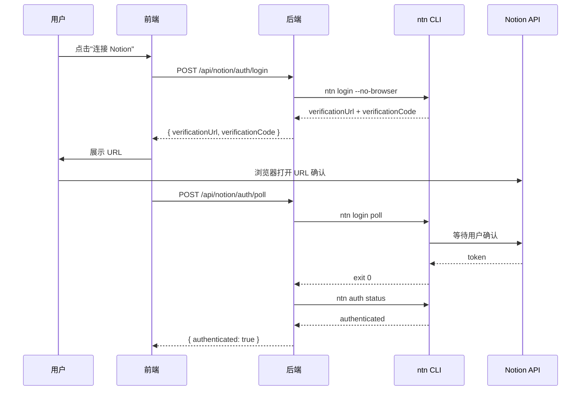
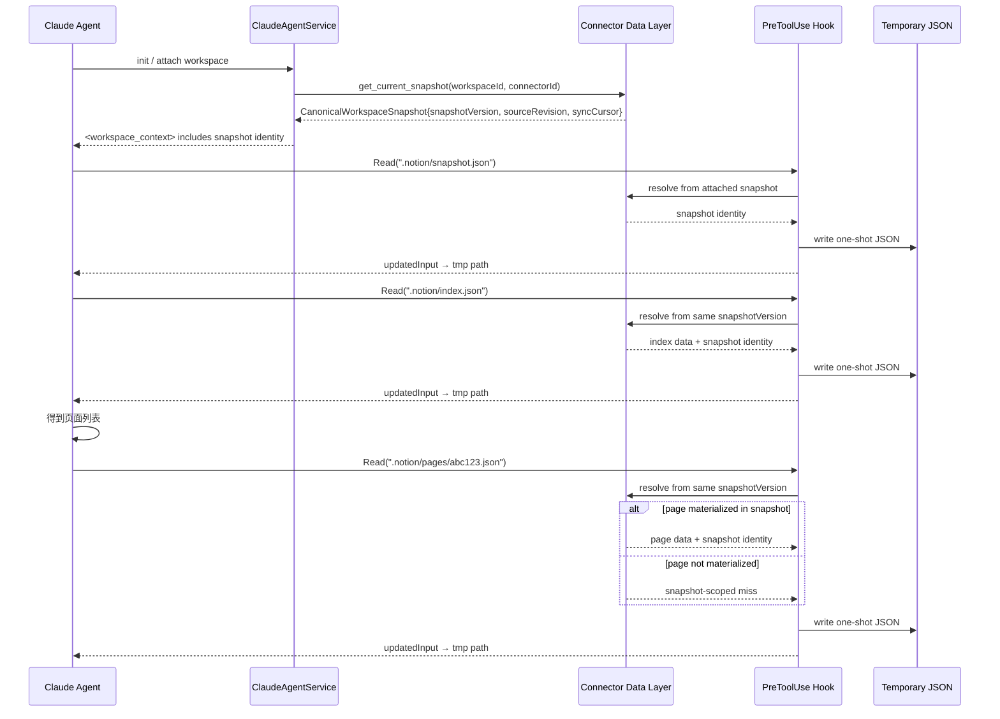

# Notion Device 资源连接器设计方案

Status: Draft
Updated: 2026-07-09
Scope: 设计 — Notion 作为外部设备资源接入 ink-and-memory 工作空间

> [Input] `docs/design/claude-agent/edit-point/workspace-adapter.md`,
>      `docs/design/claude-agent/edit-point/workspace-context.md`,
>      `docs/design/claude-agent/edit-point/workspace-switch.md`,
>      `docs/design/edit-session/overview.md`,
>      `backend/libs/claude_agent_kit/server/editor_index.py`,
>      `backend/libs/claude_agent_kit/server/workspace.py`,
>      `backend/libs/claude_agent_kit/types.py`,
>      `backend/claude_agent/context_builder.py`
> [Sync] 2026-06-28: 收敛 Notion 远程数据源的交互快照生命周期 — Agent 初始化读取资源连接器数据层物化的 canonical snapshot，不以 Agent 本地 notion_cache 作为权威状态；补齐 MVP 前端交互设计稿。
> [Sync] 2026-07-07: Chat 入口改为主落点，历史对话与连接器工作台下沉到输入框下方，输入框下方增加快捷功能 secondary action strip，并保留可恢复的 `shell_error` 态；连接器不再以独立主页面承载。
> [Sync] 2026-07-08: 依据最新版 Chat 入口页与连接器详情草图复核主路径：主入口仍是 Chat `WorkspaceTabBar` 的轻量摘要，复杂配置进入 Settings「资源链接」里的 `ConnectorNotionDetailPage`，并再次确认连接器不是独立主导航页。
> [Sync] 2026-07-08: 资源选择持久化收敛为 `connector_resources` / connector `sources`：Settings 已挂载来源、Chat 已链接资源和 Agent snapshot 入口读取同一份后端状态；Notion People 系统 data source 在 discovery 层过滤。
> [Sync] 2026-07-09: Chat `ResourceConnectorTabPanel` 根内容区减少线框化，状态信息块使用虚线边界但无卡片底色 / 阴影，空态和已链接资源行用轻表面和留白承接摘要内容。
> [Sync] 2026-07-09: Settings `ResourceOptionRow` 与 `MountedSourcesSection` 的页数元信息只在 `pageCount > 0` 时显示，避免 `0 pages` 占用资源行右侧状态区域。

---

## 目录

1. [设计背景与动机](#1-设计背景与动机)
2. [资源连接器抽象](#2-资源连接器抽象)
3. [`.notion/` 虚拟索引设计](#3-notion-虚拟索引设计)
4. [认证层设计 — `ntn login` 流程](#4-认证层设计--ntn-login-流程)
5. [数据层设计 — 异步同步 + PreToolUse 拦截](#5-数据层设计--异步同步--pretooluse-拦截)
6. [switch_editor 扩展：Notion 外部文档切换](#6-switch_editor-扩展notion-外部文档切换)
7. [工作空间上下文扩展](#7-工作空间上下文扩展)
8. [时序图](#8-时序图)
9. [实现文件索引](#9-实现文件索引)
10. [不实现清单](#10-不实现清单)
11. [前端交互设计稿（MVP）](#11-前端交互设计稿mvp)

---

## 1. 设计背景与动机

### 1.1 现状

ink-and-memory 的工作空间模型目前仅管理**本地 EditorState**（`.editor/` 虚拟索引）。用户笔记散落在 Notion 中时，Agent 无法感知、读取或引用这些内容。

### 1.2 目标

以 **"Device"（设备）** 的抽象方式将 Notion 接入工作空间：

- Notion 被视为一个**外部文档资源设备**，类似 `.editor/` 是内部文档资源
- 使用 Notion 官方 CLI（`ntn`）作为通信桥梁
- Agent 通过 `.notion/` 虚拟索引**只读浏览** Notion 内容
- 认证由前端驱动，后端异步同步远程数据并物化 canonical snapshot

### 1.3 核心原则

- **复用现有模式**：`.notion/` 镜像 `.editor/` 的虚拟索引 + PreToolUse 拦截模式
- **ntn CLI 为唯一数据通道**：不引入 Notion SDK 依赖
- **连接器数据层是内部权威状态**：Notion 是远程 source of truth；系统内部由资源连接器数据层物化 canonical snapshot，Agent 初始化只读取该快照
- **已选择资源必须落库**：用户在 Settings 保存的 data_source / page 写入 `connector_resources`，并通过 connector `sources` 暴露给 Settings、Chat 和后续 snapshot 物化
- **只读优先**：先实现浏览能力；写入只设计 proposal/write pipeline 边界，不直接落地远程写回
- **认证与数据分离**：认证层由前端用户配置驱动，数据层负责同步、版本化和快照发布

---

## 2. 资源连接器抽象

### 2.1 四层模型

```
┌─────────────────────────────────────────────────────────┐
│                  Resource Connector                       │
│                   (资源连接器)                             │
├─────────────────────────────────────────────────────────┤
│                                                         │
│  ┌─────────────┐  ┌─────────────┐  ┌──────────────┐    │
│  │  Auth Layer  │  │  Data Layer  │  │ Operation    │    │
│  │  (认证层)    │  │  (数据层)    │  │ Layer (操作) │    │
│  │             │  │             │  │              │    │
│  │ ntn login   │  │ .notion/    │  │ (future)     │    │
│  │ token 管理  │  │ 虚拟索引    │  │ ntn page     │    │
│  │ NOTION_HOME │  │ 异步同步    │  │ create/update│    │
│  └─────────────┘  └─────────────┘  └──────────────┘    │
│                                                         │
│  ┌──────────────────────────────────────────────────┐   │
│  │               Task Layer (任务层)                  │   │
│  │                                                  │   │
│  │  (future) 定时 sync、批量 import、冲突检测         │   │
│  └──────────────────────────────────────────────────┘   │
│                                                         │
└─────────────────────────────────────────────────────────┘
```

### 2.2 各层职责

| 层 | 职责 | 实现位置 | 本期实现 |
| ------------------- | ------------------------------------------------------------ | --------------------------------------------- | ---------- |
| **Auth Layer** | `ntn login --no-browser` 流程编排、token 路径管理、NOTION_HOME 配置 | `backend/notion/auth.py` | ✅ 是 |
| **Data Layer** | Notion 同步结果持久化、canonical snapshot 物化、`.notion/` 只读虚拟索引解析 | `backend/notion/index.py` + `backend/libs/claude_agent_kit/server/notion_snapshot.py` | ✅ 合同代码 |
| **Operation Layer** | `ntn page get/create/update` 等读写操作封装；写入必须产出 proposal 并走远程确认 | `backend/notion/ops.py` | ❌ 暂不实现 |
| **Task Layer** | sync 调度、快照版本推进、冲突检测 | `backend/notion/tasks.py` | ❌ 暂不实现 |

### 2.3 与 `.editor/` 的对称关系

```
.editor/                     .notion/
  ├─ cells.json    ←→         ├─ index.json      (页面列表)
  ├─ session.json  ←→         ├─ databases.json  (数据库列表)
  ├─ full_state.json ←→       └─ pages/
  └─ ...                           └─ <page_id>.json  (页面内容)

editor_state (内存快照)        canonical_snapshot (连接器数据层物化)
       │                              │
       ▼                              ▼
PreToolUse 拦截 Read           PreToolUse 拦截 Read
       │                              │
       ▼                              ▼
写临时文件 → Agent 读取        写临时文件 → Agent 读取同一 snapshotVersion
```

---

## 3. `.notion/` 虚拟索引设计

### 3.1 目录结构

```
{AGENT_CWD}/
  └── {session_id}/
      ├── .editor/                     ← 现有：EditorState 虚拟索引
      └── .notion/                     ← ★ 新增：Notion 虚拟索引
            ├── README.md              ← 说明文件（告知 Agent 这是 Notion 索引）
            ├── index.json             ← 占位符 {}，拦截 → 近期页面列表
            ├── databases.json         ← 占位符 {}，拦截 → 数据库列表
            └── pages/
                 └── <page_id>.json    ← 占位符 {}，拦截 → 单页内容
```

### 3.2 NOTION_RESOURCES 映射表

仿 `EDITOR_RESOURCES`，定义：

```python
NOTION_RESOURCES: dict[str, str] = {
    "index":      "__index__",       # → 近期页面列表
    "databases":  "__databases__",   # → 数据库列表
    # pages/<page_id> 由路径参数动态解析，不在此常量表中
}
```

### 3.3 `index.json` 内容示例

```json
{
  "pages": [
    {
      "page_id": "abc123...",
      "title": "ink-and-memory 代办清单",
      "last_edited": "2026-06-20T10:30:00Z",
      "url": "https://www.notion.so/abc123..."
    },
    {
      "page_id": "def456...",
      "title": "Obsidian × Notion 双向同步方案",
      "last_edited": "2026-03-26T08:00:00Z",
      "url": "https://www.notion.so/def456..."
    }
  ],
  "synced_at": "2026-06-21T14:00:00Z"
}
```

### 3.4 `pages/<page_id>.json` 内容示例

```json
{
  "page_id": "abc123...",
  "title": "ink-and-memory 代办清单",
  "url": "https://www.notion.so/abc123...",
  "last_edited": "2026-06-20T10:30:00Z",
  "blocks": [
    {
      "type": "heading_1",
      "text": "代办清单"
    },
    {
      "type": "paragraph",
      "text": "1. 用户认证模块..."
    }
  ],
  "fetched_at": "2026-06-21T14:00:01Z"
}
```

---

## 4. 认证层设计 — `ntn login` 流程

### 4.1 配置入口

前端在 Settings 内 `ConnectorNotionDetailPage` 中提供 Notion 配置入口。该页直接复用现有 connector API helpers 完成认证 / 资源选择流程，不再嵌入集合型 `ResourceConnectorPage`：

- 同一平台只保留一个 Notion 认证账号；详情页不展示新建连接器、刷新列表或连接器列表。
- `ResourceScopeSection` 使用统一 data_source / page 列表，不再拆成 Databases 与 Standalone Pages 两块。
- 资源范围操作行固定为 `搜索资源`、`保存资源`、`刷新同步`；默认每页 10 条，提供上一页 / 下一页。
- 点击「保存资源」后，后端把选定 data_source / page 写入 `connector_resources`，connector list/detail 响应必须返回 persisted `sources`；`MountedSourcesSection` 优先用 persisted `sources` 回显，如果后端短暂返回空 sources，前端才用当前选择构造 optimistic sources 完成即时反馈。
- Chat `ResourceConnectorTabPanel` 的「已链接资源」与 Settings `MountedSourcesSection` 同源，均读取 connector `sources`，刷新页面后不得丢失已挂载来源。
- Notion discovery 层过滤 Workspace People 等系统用户 data source；这类资源不进入 `ResourceScopeSection`，也不会进入 Chat 摘要或 Agent snapshot。
- 资源行和已挂载来源的 page count 是辅助信息，只在 `pageCount > 0` 时展示；`0 pages` 不渲染，避免空统计误导为异常状态。
- 底部“授权 / 同步状态”卡片移除，授权、同步、已链接资源数量、最近同步和限制提示统一放在顶部 `ConnectorHeader` 信息栏；策略设计只保留占位，不实现策略配置。

| 字段 | 说明 | 存储位置 |
| ------------- | ------------------------------------------------- | ---------------------------- |
| `NOTION_HOME` | `ntn` CLI 配置目录路径（默认 `~/.config/notion`） | `user_profile.notion_config` |
| 认证状态 | 是否已完成 `ntn login` | 后端检测 `ntn auth status` |

### 4.2 认证流程

```
用户在 ConnectorNotionDetailPage 点击"连接 Notion"
  │
  ├─ 前端 → POST /api/notion/auth/login
  │
  ├─ 后端执行：ntn login --no-browser
  │     stdout:
  │       Open this URL in your browser to log in:
  │         https://www.notion.so/workers/cli-login?verificationCode=VAF-HWY
  │       Confirm that this verification code matches:
  │         VAF-HWY
  │     ← 提取 verificationUrl + verificationCode
  │
  ├─ 后端返回 { verificationUrl, verificationCode } 给前端
  │
  ├─ 前端展示 URL，用户点击后在浏览器中确认
  │
  ├─ 前端 → POST /api/notion/auth/poll
  │
  ├─ 后端执行：ntn login poll
  │     ← 阻塞等待用户在浏览器确认，完成后 exit 0
  │
  ├─ 后端验证认证成功：ntn auth status
  │     ← 确认 token 已写入 NOTION_HOME
  │
  └─ 后端更新 user_profile.notion_config.authenticated = true
```

### 4.3 NOTION_HOME 管理

```python
# notion/auth.py
import os
from pathlib import Path

DEFAULT_NOTION_HOME = Path.home() / ".config" / "notion"

def get_notion_home(user_profile: dict) -> Path:
    """获取用户的 Notion 配置目录。"""
    configured = user_profile.get("notion_config", {}).get("notion_home")
    if configured:
        return Path(configured)
    return DEFAULT_NOTION_HOME

def get_notion_env(user_profile: dict) -> dict[str, str]:
    """构建 ntn 命令的环境变量。"""
    notion_home = get_notion_home(user_profile)
    return {
        **os.environ,
        "NOTION_HOME": str(notion_home),
        "PATH": os.environ.get("PATH", ""),
    }
```

### 4.4 Sandbox 适配

`ntn` CLI 需要网络访问（api.notion.com）。在 sandbox 模式下需要确保：

- `ntn` 二进制路径在 sandbox allowRead 列表中
- `NOTION_HOME` 目录在 sandbox allowRead 列表中
- `api.notion.com` 在 sandbox 网络 allowlist 中

这些由 `sync_workspace_sandbox_settings` 在 workspace init 时配置。

---

## 5. 数据层设计 — canonical snapshot + PreToolUse 拦截

### 5.1 目标符合性修正

Notion 是远程数据源，任意 Agent 在初始化访问同一个连接器时必须看到一致状态。
因此 `.notion/` 的权威数据来源不是 Agent 本地 `notion_cache`，而是资源连接器数据层物化出的 `CanonicalWorkspaceSnapshot`。

```
Notion Remote Source
  └─ Connector Sync (ntn api / Notion API)
       └─ Resource Connector Data Layer
            └─ CanonicalWorkspaceSnapshot
                 ├─ metadata: workspaceId, connectorId, snapshotVersion, sourceRevision, syncCursor, fetchedAt
                 ├─ connector
                 ├─ index
                 ├─ databases
                 ├─ database_pages
                 └─ pages
                      └─ PreToolUse Read(".notion/...") → temporary JSON file
```

### 5.2 快照身份

每个 canonical snapshot 必须包含以下身份字段：

| 字段 | 说明 |
|---|---|
| `workspace_id` | 当前 Ink & Memory 工作空间 |
| `resource_connector_id` | Notion 资源连接器 ID |
| `snapshot_version` | 系统内部快照版本 |
| `source_revision` | Notion 远程版本摘要，可由 latest edited 时间、水位或同步批次生成 |
| `sync_cursor` | 连接器同步游标 |
| `fetched_at` | 连接器数据层拉取/物化时间 |

同一 `snapshot_version` 下的 `.notion/connector.json`、`.notion/index.json`、`.notion/databases/<id>.json`、`.notion/pages/<id>.json` 必须来自同一个 snapshot object。

### 5.3 数据结构合同

方案代码位于 `backend/libs/claude_agent_kit/server/notion_snapshot.py`，只提供合同，不接真实 Notion API：

```python
@dataclass(frozen=True)
class CanonicalWorkspaceSnapshot:
    metadata: SnapshotMetadata
    connector: dict[str, Any]
    index: list[dict[str, Any]]
    databases: list[dict[str, Any]]
    database_pages: dict[str, list[dict[str, Any]]]
    pages: dict[str, dict[str, Any]]

@dataclass(frozen=True)
class SnapshotWriteProposal:
    proposal_id: str
    workspace_id: str
    resource_connector_id: str
    base_snapshot_version: str
    base_source_revision: str
    base_sync_cursor: str
    operations: tuple[dict[str, Any], ...]
```

### 5.4 PreToolUse 拦截边界

未来运行时接线时，`.notion/` Read 拦截必须遵守：

1. 只从当前已 attach 的 `CanonicalWorkspaceSnapshot` 解析数据。
2. 不在 Agent Read 时直接调用 Notion 远程 API。
3. 不把 Agent 派生摘要写回 snapshot。
4. 缺页返回 snapshot-scoped miss，例如 `reason:"not_materialized_in_snapshot"`，由前端或连接器触发刷新。

示意：

```python
if tool_name == "Read" and attached_notion_snapshot is not None:
    if is_notion_snapshot_path(file_path):
        data = get_notion_snapshot_resource_data(file_path, attached_notion_snapshot)
        return redirect_to_temporary_json(data)
```

### 5.5 Workspace 初始化集成

Workspace init 只创建 `.notion/` 占位目录和说明文件，不负责同步远程数据。
Agent 初始化或工作空间 attach 时，由 service 层向资源连接器数据层请求当前 snapshot：

```
workspace.init_workspace(session_id)
  ├─ _init_editor_index(workspace)
  └─ _init_notion_index_placeholders(workspace)  # only README + placeholders

ClaudeAgentService.attach_workspace_context()
  └─ connector_data_layer.get_current_snapshot(workspace_id, connector_id)
       └─ AgentRunOptions / future snapshot holder receives canonical snapshot
```

### 5.6 写入路径

本期不直接实现 Notion 写回。设计边界如下：

- Agent 只能生成 `SnapshotWriteProposal`。
- Proposal 必须携带 base `snapshotVersion/sourceRevision/syncCursor`。
- 连接器写入管线在远程提交前做乐观并发校验。
- Notion 确认远程写入后，连接器数据层同步并生成新 snapshot；旧 snapshot 进入 `snapshot_superseded`。
- 前端刷新沿用 `session_updated source="agent"` 事件驱动机制，不使用固定 sleep。

---

## 6. Workspace switch 边界：不复用 `switch_editor` 承载 Notion 状态

`switch_editor` 当前语义是切换 `.editor/` 文档会话，并已在 `workspace-switch.md` 中实现。
Notion 资源连接器不是另一个 EditorState，会话切换不应把 Notion 远程状态塞进 `editor_state` 或 AgentRunState 本地缓存。

MVP 交互边界：

| 场景 | 处理方式 |
|---|---|
| 用户在前端切换当前 workspace 的 Notion connector | 前端更新选中的 `resourceConnectorId`，下一轮 Agent init 从连接器数据层 attach 当前 canonical snapshot |
| Agent 需要读取当前 Notion 内容 | 通过 `.notion/` 虚拟索引读取已 attach 的 snapshot |
| Agent 需要切换到另一个 Editor session | 继续使用现有 `switch_editor(editor_session_id)` |
| Agent 需要切换到另一个 Notion connector | 本期不在同一 turn 内自动切换；提示用户在前端切换或刷新连接器上下文 |

后续如果需要同一 turn 内切换外部资源，应新增独立的 `switch_resource(resource_connector_id)` 或 workspace-level 工具，而不是扩展 `switch_editor` 的 schema。该工具仍必须从连接器数据层读取 canonical snapshot。

---

## 7. 工作空间上下文扩展

### 7.1 `<workspace_context>` 块变更

在 `workspace_context.py` 的 `WORKSPACE_CONTEXT_TEMPLATE` 中，在 `.editor/` 描述之后新增：

```
Notion device index (.notion/):
  This directory holds Notion page index placeholder files. Reading them
  returns the canonical Notion snapshot materialized by the resource connector
  data layer.  Agent-local summaries are derived views, not source of truth.

  .notion/index.json       — list of recent Notion pages (title, page_id, url)
  .notion/databases.json   — list of accessible Notion databases
  .notion/pages/<id>.json  — individual Notion page content (read-only)
  .notion/snapshot.json    — snapshot identity {version, revision, cursor}

  Reading these works the same way as .editor/ — use read_file(). The
  PreToolUse hook serves the attached snapshot version; it does not call
  Notion remotely during Agent reads.

Notion CLI authentication:
  The ntn CLI is pre-authenticated via the NOTION_HOME configured for this
  session.  You do not need to handle login — just read .notion/ files.
```

### 7.2 系统提示词 Workflow 变更

在系统提示中新增 Notion 读取约束，而不是扩展 `switch_editor`：

```
Notion Connector Workflow:
  When <workspace_context> lists a Notion connector, read .notion/snapshot.json
  first to identify the attached snapshot version. Then read .notion/index.json
  or .notion/pages/<page_id>.json as needed.

  Do not treat derived summaries as canonical state. Do not call switch_editor
  for Notion connector switching; switch_editor only changes .editor/ sessions.
  If the user needs a different connector, ask them to switch the workspace
  resource in the UI or refresh the connector snapshot.
```

---

## 8. 时序图

### 8.1 认证流程



### 8.2 Agent 读取 Notion 内容流程



---

## 9. 实现文件索引

| 文件 | 变更内容 | 状态 |
| ------------------------------------------------------------ | ------------------------------------------------------------ | -------- |
| `backend/libs/claude_agent_kit/server/notion_snapshot.py` | canonical snapshot 合同、状态枚举、`.notion/` 路径解析、write proposal stale 判断 | ✅ 已实现 |
| `backend/tests/test_notion_snapshot_contract.py` | 验证快照路径解析、数据提取、缺页语义、proposal 版本判断 | ✅ 已实现 |
| `backend/notion/auth.py` | `ntn login` 流程编排、NOTION_HOME 管理、auth status 检测 | 待实现 |
| `backend/notion/sync.py` | 同步远程数据并物化 canonical snapshot | 待实现 |
| `backend/notion/snapshot_store.py` | 持久化 current snapshot、历史版本和审计字段 | 待实现 |
| `backend/libs/claude_agent_kit/server/agent_runner.py` | 未来接线：PreToolUse `.notion/` 读取从 attached snapshot 重定向 | 待实现 |
| `backend/claude_agent/workspace_context.py` | 未来接线：`WORKSPACE_CONTEXT_TEMPLATE` 注入 snapshot identity 和 `.notion/` 读法 | 待实现 |
| `backend/claude_agent/service.py` | 未来接线：Agent init 时从连接器数据层 attach current snapshot | 待实现 |

### 9.1 相关现有文件（需阅读，不需修改）

| 文件 | 作用 |
| ---------------------- | ------------------------------- |
| `editor_index.py` | `.notion/` snapshot path resolver 的参考模板 |
| `workspace.py` | `.notion/` 目录初始化入口 |
| `agent_runner.py` | PreToolUse / PostToolUse 扩展点 |
| `workspace_context.py` | 工作空间上下文模板 |
| `context_builder.py` | 系统提示词模板 |
| `editor_tool.py` | `switch_editor` handler 所在；Notion connector 不复用该工具 |

---

## 10. 不实现清单

以下功能**明确不在本期范围内**，防止过度设计：

| 不实现项 | 原因 |
| --------------------------------------- | -------------------------------------------- |
| `mcp__notion__*` MCP 查询工具 | 用户尚未确定操作交互模型 |
| `ntn page create/update` 写操作 | 写操作的冲突策略、权限模型未定义 |
| Notion → EditorState 自动导入 | 导入映射规则未确定 |
| 双向实时同步 | 需要单独的冲突处理设计 |
| Notion OAuth Web 流程 | 当前用 `ntn login --no-browser` CLI 认证足够 |
| 定时 sync 任务调度框架 | 先用 workspace init 时触发的一次性 sync |
| 增量变更检测（`last_edited_time` 对比） | 先做全量 index 刷新 |
| 多 Notion workspace 切换 | 先支持单 workspace |

---

## 11. 前端交互设计稿（MVP）

### 11.1 页面结构

```
Chat workspace
  ├─ Centered ChatInputDock
  ├─ WorkspaceTabBar
  │    ├─ HistoryTab
  │    │    └─ HistoryTabPanel
  │    │         ├─ EmptyChatState
  │    │         ├─ HistoryThreadList / ChatMessageList
  │    │         └─ HistorySkeletonList
  │    └─ ResourceConnectorTab
  │         └─ ResourceConnectorTabPanel
  │              ├─ ConnectorToolbar
  │              ├─ ConnectorEmptyState
  │              ├─ ConnectorList / ConnectorListSkeleton
  │              └─ ConnectorStatusPanel / 选择连接器 → Settings ConnectorSettingsSection
  ├─ ConnectorNotionDetailPage
  │    ├─ TopNavigation
  │    ├─ ConnectorHeader
  │    ├─ StrategyDesignPlaceholder
  │    ├─ ResourceScopeSection: search + save + refresh + paged unified resources; pageCount only when > 0
  │    └─ MountedSourcesSection: selected sources immediately after save; hide zero page counts
  ├─ Context banner: "Using Notion snapshot <version>"
  └─ Proposal card: diff preview + base snapshot identity
```

> 注：`HistoryTab` / `ResourceConnectorTab` 是 Chat 工作区的视图状态，不是连接器生命周期状态。连接器生命周期仍由下方的 connector state model 管理。
>
> 命名统一使用 `WorkspaceTabBar` / `HistoryTab` / `ResourceConnectorTab` / `ConnectorNotionDetailPage`，不再使用“landing tabs”之类别名。

### 11.2 状态模型

| 状态 | UI 展示 | 用户动作 |
|---|---|---|
| `empty_chat` | `HistoryTabPanel` 显示空聊天态，输入框保持中心主视觉 | `Start chat` |
| `active_chat` | 历史内容切换为消息流，输入 Dock 贴近底部 | `Continue chat` |
| `connector_empty` | `ResourceConnectorTabPanel` 显示轻表面空态、三枚图标、标题与 CTA | `选择连接器` |
| `connector_connected` | 显示 `ConnectorToolbar` + `ConnectorList` | `Open connector` |
| `connector_error` | 连接器列表或状态拉取失败，显示错误卡 | `Retry` |
| `shell_error` | Chat shell 或 `WorkspaceTabBar` 渲染失败，仍保留可恢复入口 | `Reload shell` / `Retry` |

### 11.3 Agent 写入确认卡

写入确认卡只在后续启用 Notion 写回时出现，本期保留设计边界：

- 显示 proposal 的 `base_snapshot_version`、`base_source_revision`、`base_sync_cursor`。
- 显示将修改的页面标题、Notion URL 和 block 摘要。
- 主按钮为 `Approve write`，次按钮为 `Reject`，冲突时主按钮变为 `Refresh first`。
- 批准后等待 `session_updated source="agent"` 事件再刷新，不在确认响应后固定 sleep。

### 11.4 不过度设计检查

| 可能扩展 | 本期处理 |
|---|---|
| 多平台连接器市场 | 不做，只保留 Notion row 的结构可扩展性 |
| Notion block 可视化编辑器 | 不做，只显示摘要和 diff |
| 实时同步动画 | 不做，只显示状态和最近同步时间 |
| 自动冲突合并 | 不做，冲突时让用户刷新并重新生成 proposal |
| Agent 同 turn 切换多个 Notion connector | 不做，由前端选择当前 connector 后下一轮 attach |
