# Ink & Memory — 业务功能模块时序图

> 本文档梳理了 Ink & Memory 项目的核心业务功能模块，并以 Mermaid 时序图形式呈现各模块的交互流程。

---

## 目录

1. [用户认证模块（注册 / 登录）](#1-用户认证模块)
2. [编辑器会话管理模块](#2-编辑器会话管理模块)
3. [语音分析模块（AI 旁白评论）](#3-语音分析模块)
4. [写作灵感模块（实时写作建议）](#4-写作灵感模块)
5. [语音对话模块（Chat with Voice）](#5-语音对话模块)
6. [深度分析模块（回响 / 特质 / 模式）](#6-深度分析模块)
7. [每日图片生成模块](#7-每日图片生成模块)
8. [卡组与声音管理模块](#8-卡组与声音管理模块)
9. [好友系统模块](#9-好友系统模块)
10. [语音输入模块（WebSocket 语音识别）](#10-语音输入模块)
11. [定时任务模块（每日图片自动生成）](#11-定时任务模块)

---

## 1. 用户认证模块

### 1.1 用户注册

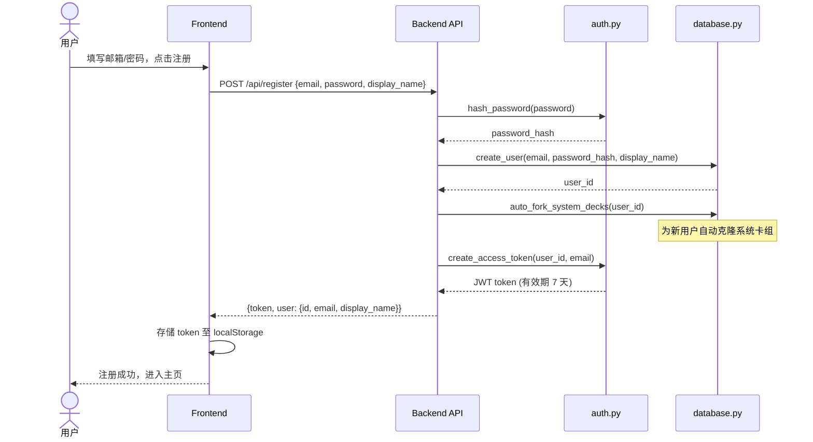
```mermaid
sequenceDiagram
    actor User as 用户
    participant FE as Frontend
    participant API as Backend API
    participant Auth as auth.py
    participant DB as database.py

    User->>FE: 填写邮箱/密码，点击注册
    FE->>API: POST /api/register {email, password, display_name}
    API->>Auth: hash_password(password)
    Auth-->>API: password_hash
    API->>DB: create_user(email, password_hash, display_name)
    DB-->>API: user_id
    API->>DB: auto_fork_system_decks(user_id)
    Note over DB: 为新用户自动克隆系统卡组
    API->>Auth: create_access_token(user_id, email)
    Auth-->>API: JWT token (有效期 7 天)
    API-->>FE: {token, user: {id, email, display_name}}
    FE->>FE: 存储 token 至 localStorage
    FE-->>User: 注册成功，进入主页
```

### 1.2 用户登录

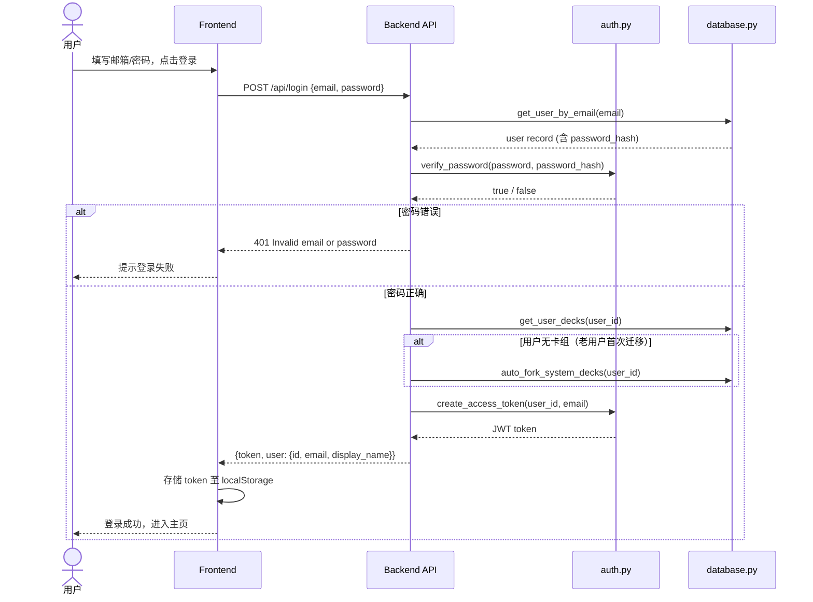
```mermaid
sequenceDiagram
    actor User as 用户
    participant FE as Frontend
    participant API as Backend API
    participant Auth as auth.py
    participant DB as database.py

    User->>FE: 填写邮箱/密码，点击登录
    FE->>API: POST /api/login {email, password}
    API->>DB: get_user_by_email(email)
    DB-->>API: user record (含 password_hash)
    API->>Auth: verify_password(password, password_hash)
    Auth-->>API: true / false
    alt 密码错误
        API-->>FE: 401 Invalid email or password
        FE-->>User: 提示登录失败
    else 密码正确
        API->>DB: get_user_decks(user_id)
        alt 用户无卡组（老用户首次迁移）
            API->>DB: auto_fork_system_decks(user_id)
        end
        API->>Auth: create_access_token(user_id, email)
        Auth-->>API: JWT token
        API-->>FE: {token, user: {id, email, display_name}}
        FE->>FE: 存储 token 至 localStorage
        FE-->>User: 登录成功，进入主页
    end
```

### 1.3 JWT 鉴权（通用依赖）

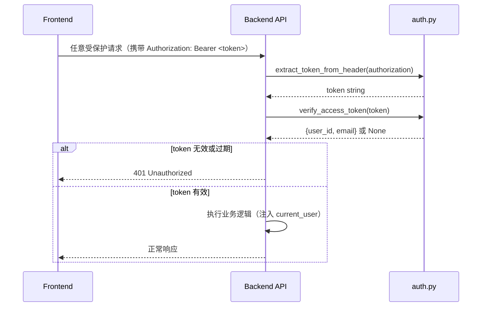
```mermaid
sequenceDiagram
    participant FE as Frontend
    participant API as Backend API
    participant Auth as auth.py

    FE->>API: 任意受保护请求（携带 Authorization: Bearer <token>）
    API->>Auth: extract_token_from_header(authorization)
    Auth-->>API: token string
    API->>Auth: verify_access_token(token)
    Auth-->>API: {user_id, email} 或 None
    alt token 无效或过期
        API-->>FE: 401 Unauthorized
    else token 有效
        API->>API: 执行业务逻辑（注入 current_user）
        API-->>FE: 正常响应
    end
```

---

## 2. 编辑器会话管理模块

### 2.1 应用启动 — 加载会话

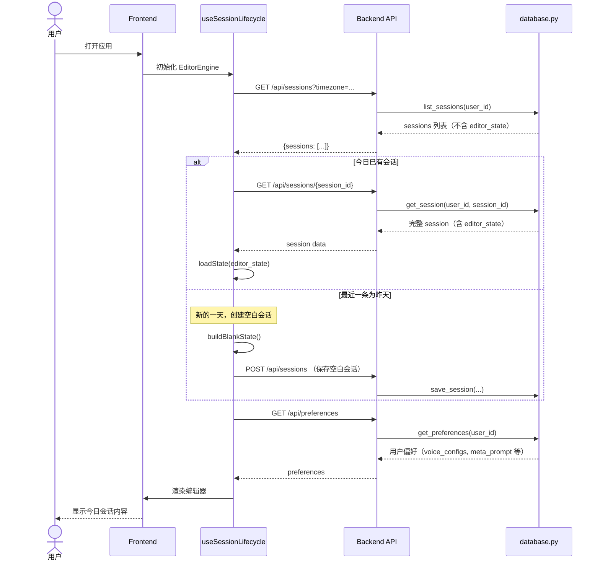
```mermaid
sequenceDiagram
    actor User as 用户
    participant FE as Frontend
    participant Hook as useSessionLifecycle
    participant API as Backend API
    participant DB as database.py

    User->>FE: 打开应用
    FE->>Hook: 初始化 EditorEngine
    Hook->>API: GET /api/sessions?timezone=...
    API->>DB: list_sessions(user_id)
    DB-->>API: sessions 列表（不含 editor_state）
    API-->>Hook: {sessions: [...]}

    alt 今日已有会话
        Hook->>API: GET /api/sessions/{session_id}
        API->>DB: get_session(user_id, session_id)
        DB-->>API: 完整 session（含 editor_state）
        API-->>Hook: session data
        Hook->>Hook: loadState(editor_state)
    else 最近一条为昨天
        Note over Hook: 新的一天，创建空白会话
        Hook->>Hook: buildBlankState()
        Hook->>API: POST /api/sessions （保存空白会话）
        API->>DB: save_session(...)
    end

    Hook->>API: GET /api/preferences
    API->>DB: get_preferences(user_id)
    DB-->>API: 用户偏好（voice_configs, meta_prompt 等）
    API-->>Hook: preferences
    Hook->>FE: 渲染编辑器
    FE-->>User: 显示今日会话内容
```

### 2.2 自动保存

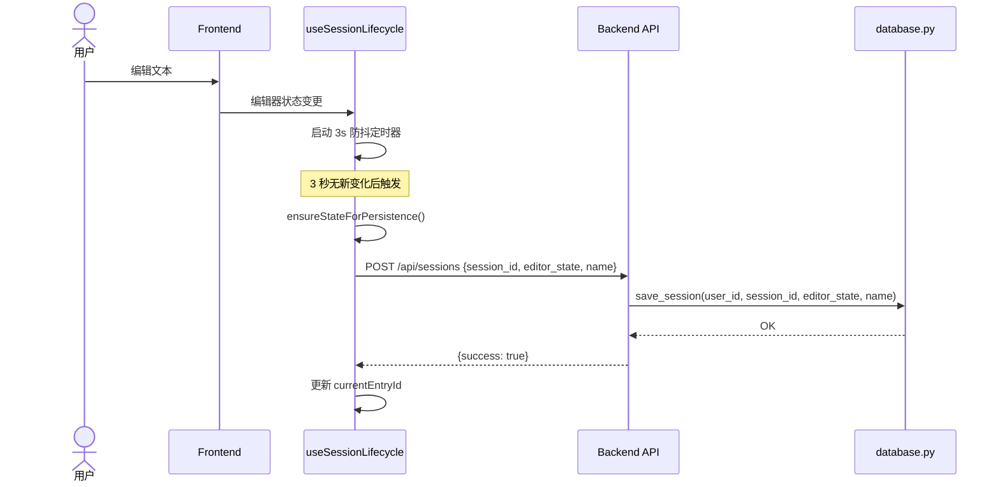
```mermaid
sequenceDiagram
    actor User as 用户
    participant FE as Frontend
    participant Hook as useSessionLifecycle
    participant API as Backend API
    participant DB as database.py

    User->>FE: 编辑文本
    FE->>Hook: 编辑器状态变更
    Hook->>Hook: 启动 3s 防抖定时器
    Note over Hook: 3 秒无新变化后触发
    Hook->>Hook: ensureStateForPersistence()
    Hook->>API: POST /api/sessions {session_id, editor_state, name}
    API->>DB: save_session(user_id, session_id, editor_state, name)
    DB-->>API: OK
    API-->>Hook: {success: true}
    Hook->>Hook: 更新 currentEntryId
```

### 2.3 手动保存 / 新建会话

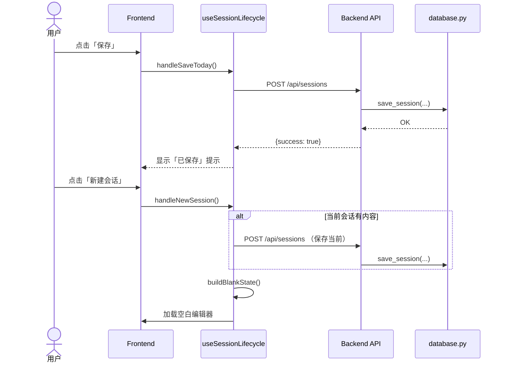
```mermaid
sequenceDiagram
    actor User as 用户
    participant FE as Frontend
    participant Hook as useSessionLifecycle
    participant API as Backend API
    participant DB as database.py

    User->>FE: 点击「保存」
    FE->>Hook: handleSaveToday()
    Hook->>API: POST /api/sessions
    API->>DB: save_session(...)
    DB-->>API: OK
    API-->>Hook: {success: true}
    Hook-->>FE: 显示「已保存」提示

    User->>FE: 点击「新建会话」
    FE->>Hook: handleNewSession()
    alt 当前会话有内容
        Hook->>API: POST /api/sessions （保存当前）
        API->>DB: save_session(...)
    end
    Hook->>Hook: buildBlankState()
    Hook->>FE: 加载空白编辑器
```

---

## 3. 语音分析模块

AI 语音角色（Voice）分析用户文本并生成内嵌评论。

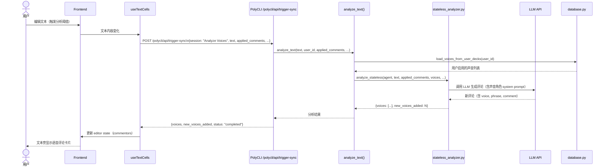
```mermaid
sequenceDiagram
    actor User as 用户
    participant FE as Frontend
    participant Hook as useTextCells
    participant PolyCLI as PolyCLI /polycli/api/trigger-sync
    participant Session as analyze_text()
    participant Analyzer as stateless_analyzer.py
    participant LLM as LLM API
    participant DB as database.py

    User->>FE: 编辑文本（触发分析阈值）
    FE->>Hook: 文本内容变化
    Hook->>PolyCLI: POST /polycli/api/trigger-sync\n{session: "Analyze Voices", text, applied_comments, ...}
    PolyCLI->>Session: analyze_text(text, user_id, applied_comments, ...)
    Session->>DB: load_voices_from_user_decks(user_id)
    DB-->>Session: 用户启用的声音列表
    Session->>Analyzer: analyze_stateless(agent, text, applied_comments, voices, ...)
    Analyzer->>LLM: 调用 LLM 生成评论（含声音角色 system prompt）
    LLM-->>Analyzer: 新评论（含 voice, phrase, comment）
    Analyzer-->>Session: {voices: [...], new_voices_added: N}
    Session-->>PolyCLI: 分析结果
    PolyCLI-->>Hook: {voices, new_voices_added, status: "completed"}
    Hook->>FE: 更新 editor state（commentors）
    FE-->>User: 文本旁显示语音评论卡片
```

---

## 4. 写作灵感模块

用户停止输入约 2 秒后，随机选择一个已启用的语音角色给出一句简短的写作建议。

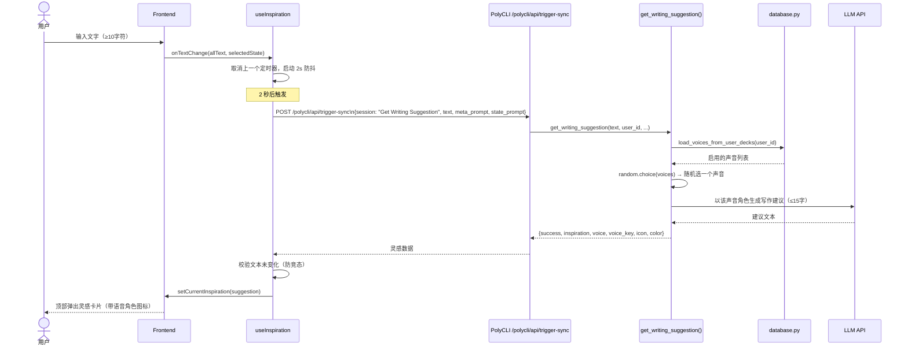
```mermaid
sequenceDiagram
    actor User as 用户
    participant FE as Frontend
    participant Hook as useInspiration
    participant PolyCLI as PolyCLI /polycli/api/trigger-sync
    participant Session as get_writing_suggestion()
    participant DB as database.py
    participant LLM as LLM API

    User->>FE: 输入文字（≥10字符）
    FE->>Hook: onTextChange(allText, selectedState)
    Hook->>Hook: 取消上一个定时器，启动 2s 防抖
    Note over Hook: 2 秒后触发
    Hook->>PolyCLI: POST /polycli/api/trigger-sync\n{session: "Get Writing Suggestion", text, meta_prompt, state_prompt}
    PolyCLI->>Session: get_writing_suggestion(text, user_id, ...)
    Session->>DB: load_voices_from_user_decks(user_id)
    DB-->>Session: 启用的声音列表
    Session->>Session: random.choice(voices) → 随机选一个声音
    Session->>LLM: 以该声音角色生成写作建议（≤15字）
    LLM-->>Session: 建议文本
    Session-->>PolyCLI: {success, inspiration, voice, voice_key, icon, color}
    PolyCLI-->>Hook: 灵感数据
    Hook->>Hook: 校验文本未变化（防竞态）
    Hook->>FE: setCurrentInspiration(suggestion)
    FE-->>User: 顶部弹出灵感卡片（带语音角色图标）
```

---

## 5. 语音对话模块

用户与某个语音角色就当前文本进行多轮对话。

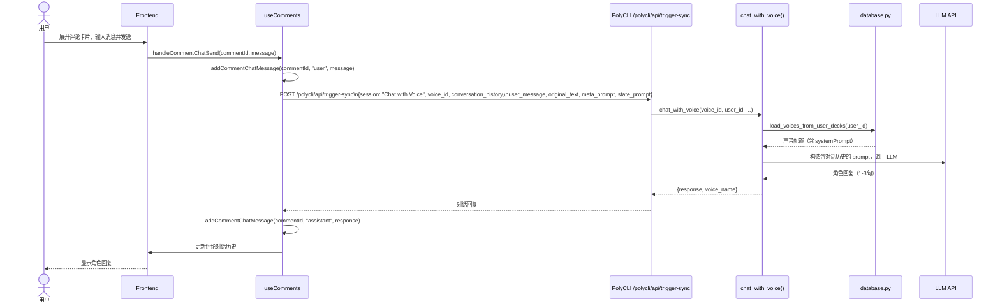
```mermaid
sequenceDiagram
    actor User as 用户
    participant FE as Frontend
    participant Hook as useComments
    participant PolyCLI as PolyCLI /polycli/api/trigger-sync
    participant Session as chat_with_voice()
    participant DB as database.py
    participant LLM as LLM API

    User->>FE: 展开评论卡片，输入消息并发送
    FE->>Hook: handleCommentChatSend(commentId, message)
    Hook->>Hook: addCommentChatMessage(commentId, "user", message)
    Hook->>PolyCLI: POST /polycli/api/trigger-sync\n{session: "Chat with Voice", voice_id, conversation_history,\nuser_message, original_text, meta_prompt, state_prompt}
    PolyCLI->>Session: chat_with_voice(voice_id, user_id, ...)
    Session->>DB: load_voices_from_user_decks(user_id)
    DB-->>Session: 声音配置（含 systemPrompt）
    Session->>LLM: 构造含对话历史的 prompt，调用 LLM
    LLM-->>Session: 角色回复（1-3句）
    Session-->>PolyCLI: {response, voice_name}
    PolyCLI-->>Hook: 对话回复
    Hook->>Hook: addCommentChatMessage(commentId, "assistant", response)
    Hook->>FE: 更新评论对话历史
    FE-->>User: 显示角色回复
```

---

## 6. 深度分析模块

分析用户所有笔记，挖掘回响主题、性格特质、行为模式。

### 6.1 回响分析（Analyze Echoes）

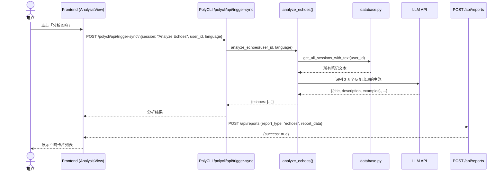
```mermaid
sequenceDiagram
    actor User as 用户
    participant FE as Frontend (AnalysisView)
    participant PolyCLI as PolyCLI /polycli/api/trigger-sync
    participant Session as analyze_echoes()
    participant DB as database.py
    participant LLM as LLM API
    participant ReportAPI as POST /api/reports

    User->>FE: 点击「分析回响」
    FE->>PolyCLI: POST /polycli/api/trigger-sync\n{session: "Analyze Echoes", user_id, language}
    PolyCLI->>Session: analyze_echoes(user_id, language)
    Session->>DB: get_all_sessions_with_text(user_id)
    DB-->>Session: 所有笔记文本
    Session->>LLM: 识别 3-5 个反复出现的主题
    LLM-->>Session: [{title, description, examples}, ...]
    Session-->>PolyCLI: {echoes: [...]}
    PolyCLI-->>FE: 分析结果
    FE->>ReportAPI: POST /api/reports {report_type: "echoes", report_data}
    ReportAPI-->>FE: {success: true}
    FE-->>User: 展示回响卡片列表
```

### 6.2 特质分析 / 模式分析

流程与回响分析相同，仅 session 名称、LLM 提示词及返回字段不同：
- **Analyze Traits** → 返回 `{traits: [{trait, strength, evidence}]}`
- **Analyze Patterns** → 返回 `{patterns: [{pattern, description, frequency}]}`

---

## 7. 每日图片生成模块

根据用户当日笔记内容，生成一幅极简主义艺术图片。

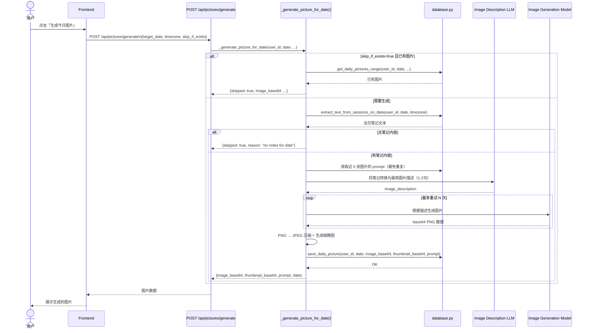
```mermaid
sequenceDiagram
    actor User as 用户
    participant FE as Frontend
    participant API as POST /api/pictures/generate
    participant Generator as _generate_picture_for_date()
    participant DB as database.py
    participant Claude as Image Description LLM
    participant ImageModel as Image Generation Model

    User->>FE: 点击「生成今日图片」
    FE->>API: POST /api/pictures/generate\n{target_date, timezone, skip_if_exists}

    API->>Generator: _generate_picture_for_date(user_id, date, ...)

    alt skip_if_exists=true 且已有图片
        Generator->>DB: get_daily_pictures_range(user_id, date, ...)
        DB-->>Generator: 已有图片
        Generator-->>API: {skipped: true, image_base64: ...}
    else 需要生成
        Generator->>DB: extract_text_from_sessions_on_date(user_id, date, timezone)
        DB-->>Generator: 当日笔记文本

        alt 无笔记内容
            Generator-->>API: {skipped: true, reason: "no notes for date"}
        else 有笔记内容
            Generator->>DB: 获取近 5 张图片的 prompt（避免重复）
            Generator->>Claude: 将笔记转换为极简图片描述（1-2句）
            Claude-->>Generator: image_description

            loop 最多重试 N 次
                Generator->>ImageModel: 根据描述生成图片
                ImageModel-->>Generator: base64 PNG 数据
            end

            Generator->>Generator: PNG → JPEG 压缩 + 生成缩略图
            Generator->>DB: save_daily_picture(user_id, date, image_base64, thumbnail_base64, prompt)
            DB-->>Generator: OK
            Generator-->>API: {image_base64, thumbnail_base64, prompt, date}
        end
    end

    API-->>FE: 图片数据
    FE-->>User: 展示生成的图片
```

---

## 8. 卡组与声音管理模块

用户可管理「卡组（Deck）」及其下属「声音（Voice）」角色。

### 8.1 查看/创建卡组

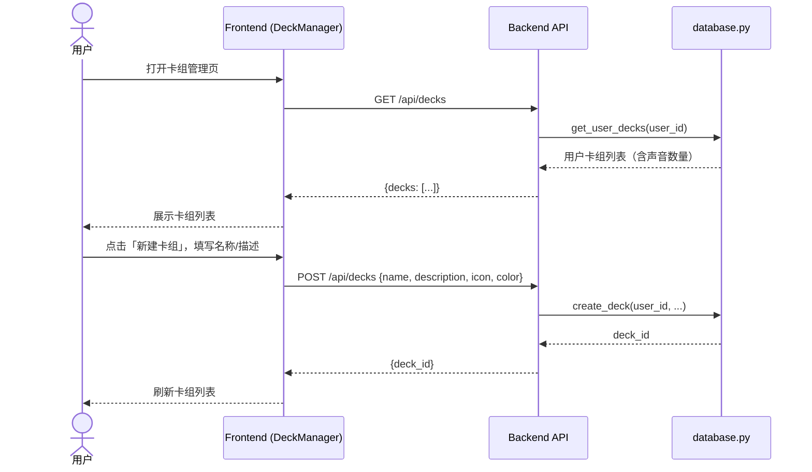
```mermaid
sequenceDiagram
    actor User as 用户
    participant FE as Frontend (DeckManager)
    participant API as Backend API
    participant DB as database.py

    User->>FE: 打开卡组管理页
    FE->>API: GET /api/decks
    API->>DB: get_user_decks(user_id)
    DB-->>API: 用户卡组列表（含声音数量）
    API-->>FE: {decks: [...]}
    FE-->>User: 展示卡组列表

    User->>FE: 点击「新建卡组」，填写名称/描述
    FE->>API: POST /api/decks {name, description, icon, color}
    API->>DB: create_deck(user_id, ...)
    DB-->>API: deck_id
    API-->>FE: {deck_id}
    FE-->>User: 刷新卡组列表
```

### 8.2 Fork 社区卡组

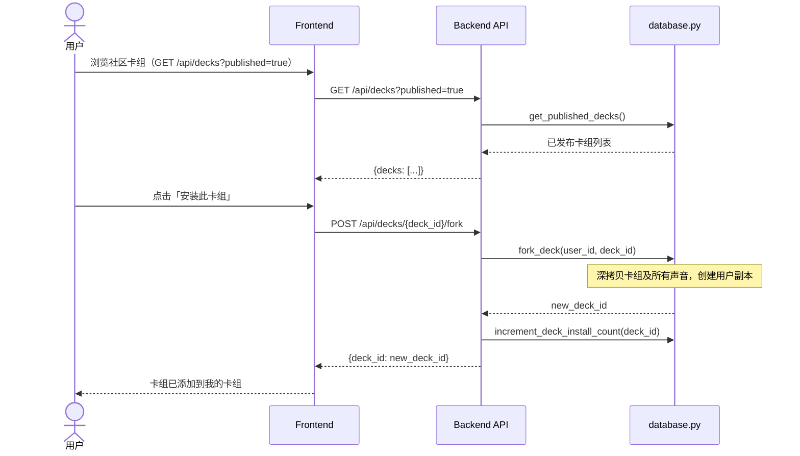
```mermaid
sequenceDiagram
    actor User as 用户
    participant FE as Frontend
    participant API as Backend API
    participant DB as database.py

    User->>FE: 浏览社区卡组（GET /api/decks?published=true）
    FE->>API: GET /api/decks?published=true
    API->>DB: get_published_decks()
    DB-->>API: 已发布卡组列表
    API-->>FE: {decks: [...]}

    User->>FE: 点击「安装此卡组」
    FE->>API: POST /api/decks/{deck_id}/fork
    API->>DB: fork_deck(user_id, deck_id)
    Note over DB: 深拷贝卡组及所有声音，创建用户副本
    DB-->>API: new_deck_id
    API->>DB: increment_deck_install_count(deck_id)
    API-->>FE: {deck_id: new_deck_id}
    FE-->>User: 卡组已添加到我的卡组
```

### 8.3 发布卡组到社区

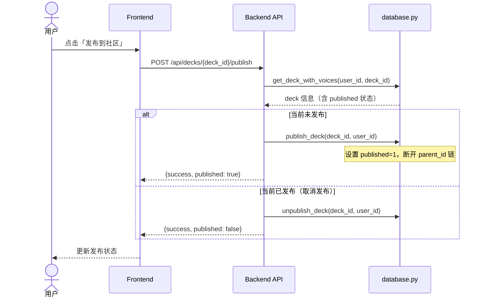
```mermaid
sequenceDiagram
    actor User as 用户
    participant FE as Frontend
    participant API as Backend API
    participant DB as database.py

    User->>FE: 点击「发布到社区」
    FE->>API: POST /api/decks/{deck_id}/publish
    API->>DB: get_deck_with_voices(user_id, deck_id)
    DB-->>API: deck 信息（含 published 状态）

    alt 当前未发布
        API->>DB: publish_deck(deck_id, user_id)
        Note over DB: 设置 published=1，断开 parent_id 链
        API-->>FE: {success, published: true}
    else 当前已发布（取消发布）
        API->>DB: unpublish_deck(deck_id, user_id)
        API-->>FE: {success, published: false}
    end
    FE-->>User: 更新发布状态
```

---

## 9. 好友系统模块

### 9.1 生成邀请码 & 接受好友请求

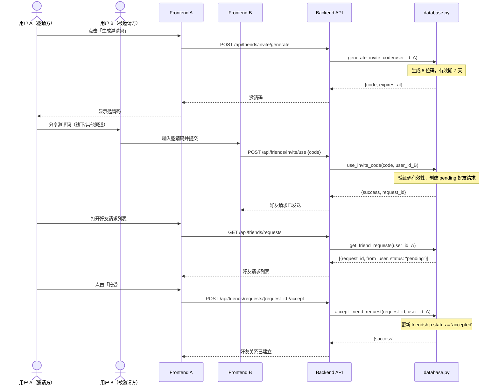
```mermaid
sequenceDiagram
    actor UserA as 用户 A（邀请方）
    actor UserB as 用户 B（被邀请方）
    participant FE_A as Frontend A
    participant FE_B as Frontend B
    participant API as Backend API
    participant DB as database.py

    UserA->>FE_A: 点击「生成邀请码」
    FE_A->>API: POST /api/friends/invite/generate
    API->>DB: generate_invite_code(user_id_A)
    Note over DB: 生成 6 位码，有效期 7 天
    DB-->>API: {code, expires_at}
    API-->>FE_A: 邀请码
    FE_A-->>UserA: 显示邀请码

    UserA->>UserB: 分享邀请码（线下/其他渠道）

    UserB->>FE_B: 输入邀请码并提交
    FE_B->>API: POST /api/friends/invite/use {code}
    API->>DB: use_invite_code(code, user_id_B)
    Note over DB: 验证码有效性，创建 pending 好友请求
    DB-->>API: {success, request_id}
    API-->>FE_B: 好友请求已发送

    UserA->>FE_A: 打开好友请求列表
    FE_A->>API: GET /api/friends/requests
    API->>DB: get_friend_requests(user_id_A)
    DB-->>API: [{request_id, from_user, status: "pending"}]
    API-->>FE_A: 好友请求列表

    UserA->>FE_A: 点击「接受」
    FE_A->>API: POST /api/friends/requests/{request_id}/accept
    API->>DB: accept_friend_request(request_id, user_id_A)
    Note over DB: 更新 friendship status = 'accepted'
    DB-->>API: {success}
    API-->>FE_A: 好友关系已建立
```

### 9.2 查看好友时间线

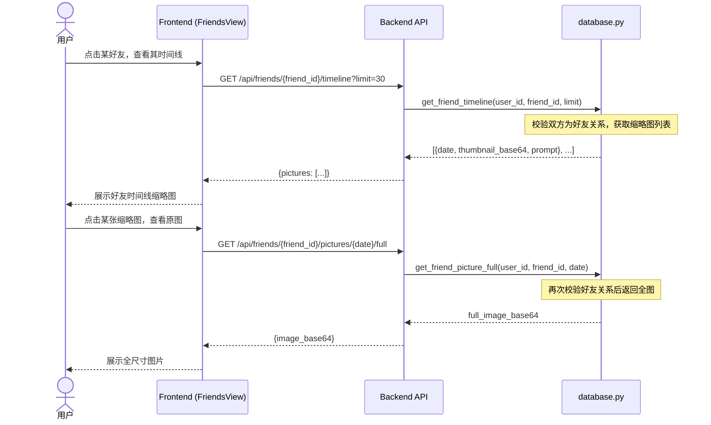
```mermaid
sequenceDiagram
    actor User as 用户
    participant FE as Frontend (FriendsView)
    participant API as Backend API
    participant DB as database.py

    User->>FE: 点击某好友，查看其时间线
    FE->>API: GET /api/friends/{friend_id}/timeline?limit=30
    API->>DB: get_friend_timeline(user_id, friend_id, limit)
    Note over DB: 校验双方为好友关系，获取缩略图列表
    DB-->>API: [{date, thumbnail_base64, prompt}, ...]
    API-->>FE: {pictures: [...]}
    FE-->>User: 展示好友时间线缩略图

    User->>FE: 点击某张缩略图，查看原图
    FE->>API: GET /api/friends/{friend_id}/pictures/{date}/full
    API->>DB: get_friend_picture_full(user_id, friend_id, date)
    Note over DB: 再次校验好友关系后返回全图
    DB-->>API: full_image_base64
    API-->>FE: {image_base64}
    FE-->>User: 展示全尺寸图片
```

---

## 10. 语音输入模块

基于 WebSocket 的实时语音识别（Dashscope ASR）。

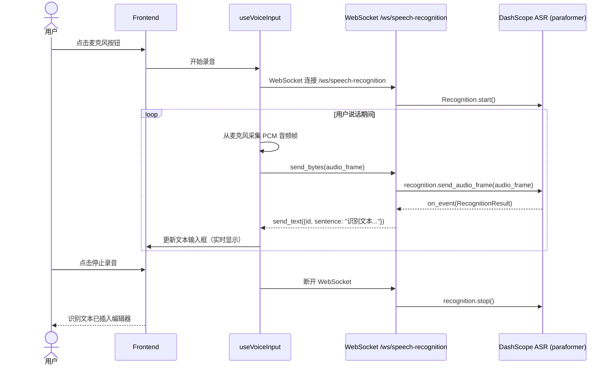
```mermaid
sequenceDiagram
    actor User as 用户
    participant FE as Frontend
    participant Hook as useVoiceInput
    participant WS as WebSocket /ws/speech-recognition
    participant ASR as DashScope ASR (paraformer)

    User->>FE: 点击麦克风按钮
    FE->>Hook: 开始录音
    Hook->>WS: WebSocket 连接 /ws/speech-recognition
    WS->>ASR: Recognition.start()

    loop 用户说话期间
        Hook->>Hook: 从麦克风采集 PCM 音频帧
        Hook->>WS: send_bytes(audio_frame)
        WS->>ASR: recognition.send_audio_frame(audio_frame)
        ASR-->>WS: on_event(RecognitionResult)
        WS-->>Hook: send_text({id, sentence: "识别文本..."})
        Hook->>FE: 更新文本输入框（实时显示）
    end

    User->>FE: 点击停止录音
    Hook->>WS: 断开 WebSocket
    WS->>ASR: recognition.stop()
    FE-->>User: 识别文本已插入编辑器
```

---

## 11. 定时任务模块

每日午夜（Asia/Shanghai 时区）自动为所有当日有笔记的用户生成时间线图片。

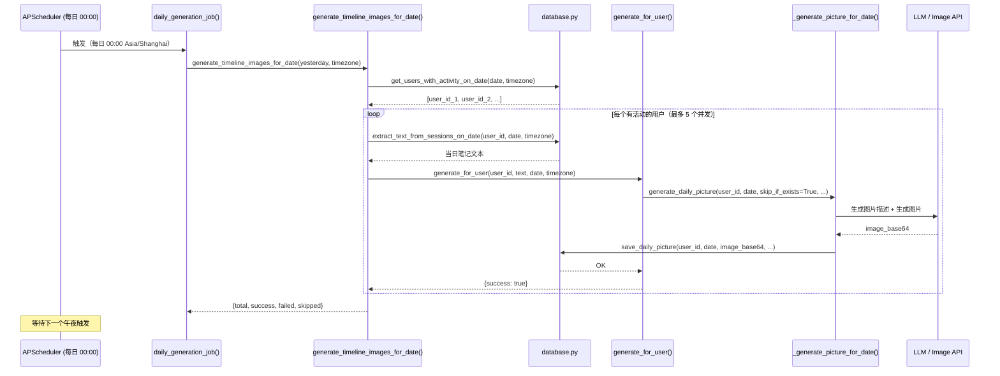
```mermaid
sequenceDiagram
    participant Scheduler as APScheduler (每日 00:00)
    participant Job as daily_generation_job()
    participant Task as generate_timeline_images_for_date()
    participant DB as database.py
    participant Generator as generate_for_user()
    participant ImageGen as _generate_picture_for_date()
    participant LLM as LLM / Image API

    Scheduler->>Job: 触发（每日 00:00 Asia/Shanghai）
    Job->>Task: generate_timeline_images_for_date(yesterday, timezone)

    Task->>DB: get_users_with_activity_on_date(date, timezone)
    DB-->>Task: [user_id_1, user_id_2, ...]

    loop 每个有活动的用户（最多 5 个并发）
        Task->>DB: extract_text_from_sessions_on_date(user_id, date, timezone)
        DB-->>Task: 当日笔记文本

        Task->>Generator: generate_for_user(user_id, text, date, timezone)
        Generator->>ImageGen: generate_daily_picture(user_id, date, skip_if_exists=True, ...)
        ImageGen->>LLM: 生成图片描述 + 生成图片
        LLM-->>ImageGen: image_base64
        ImageGen->>DB: save_daily_picture(user_id, date, image_base64, ...)
        DB-->>Generator: OK
        Generator-->>Task: {success: true}
    end

    Task-->>Job: {total, success, failed, skipped}
    Note over Scheduler: 等待下一个午夜触发
```

---

## 附录：系统架构概览

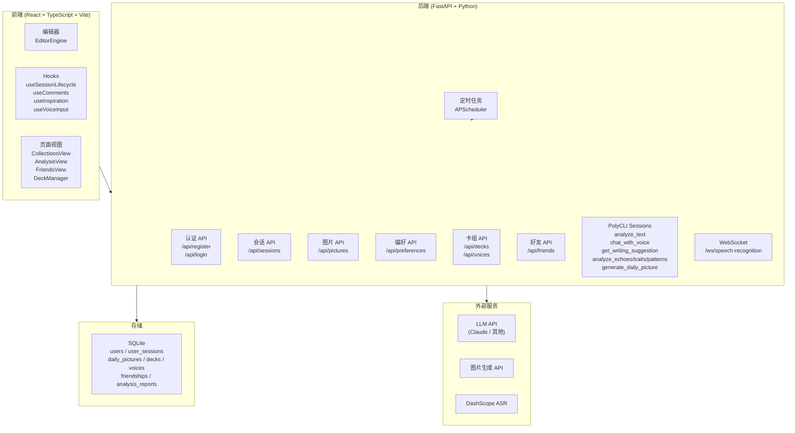
```mermaid
graph TB
    subgraph Frontend["前端 (React + TypeScript + Vite)"]
        Editor["编辑器<br/>EditorEngine"]
        Hooks["Hooks<br/>useSessionLifecycle<br/>useComments<br/>useInspiration<br/>useVoiceInput"]
        Views["页面视图<br/>CollectionsView<br/>AnalysisView<br/>FriendsView<br/>DeckManager"]
    end

    subgraph Backend["后端 (FastAPI + Python)"]
        AuthAPI["认证 API<br/>/api/register<br/>/api/login"]
        SessionAPI["会话 API<br/>/api/sessions"]
        PictureAPI["图片 API<br/>/api/pictures"]
        PrefsAPI["偏好 API<br/>/api/preferences"]
        DeckAPI["卡组 API<br/>/api/decks<br/>/api/voices"]
        FriendAPI["好友 API<br/>/api/friends"]
        PolyCLI["PolyCLI Sessions<br/>analyze_text<br/>chat_with_voice<br/>get_writing_suggestion<br/>analyze_echoes/traits/patterns<br/>generate_daily_picture"]
        WSEndpoint["WebSocket<br/>/ws/speech-recognition"]
        Scheduler["定时任务<br/>APScheduler"]
    end

    subgraph Storage["存储"]
        SQLite["SQLite<br/>users / user_sessions<br/>daily_pictures / decks / voices<br/>friendships / analysis_reports"]
    end

    subgraph External["外部服务"]
        LLM["LLM API<br/>(Claude / 其他)"]
        ImgAPI["图片生成 API"]
        ASR["DashScope ASR"]
    end

    Frontend --> Backend
    Backend --> Storage
    Backend --> External
    Scheduler --> Backend
```
