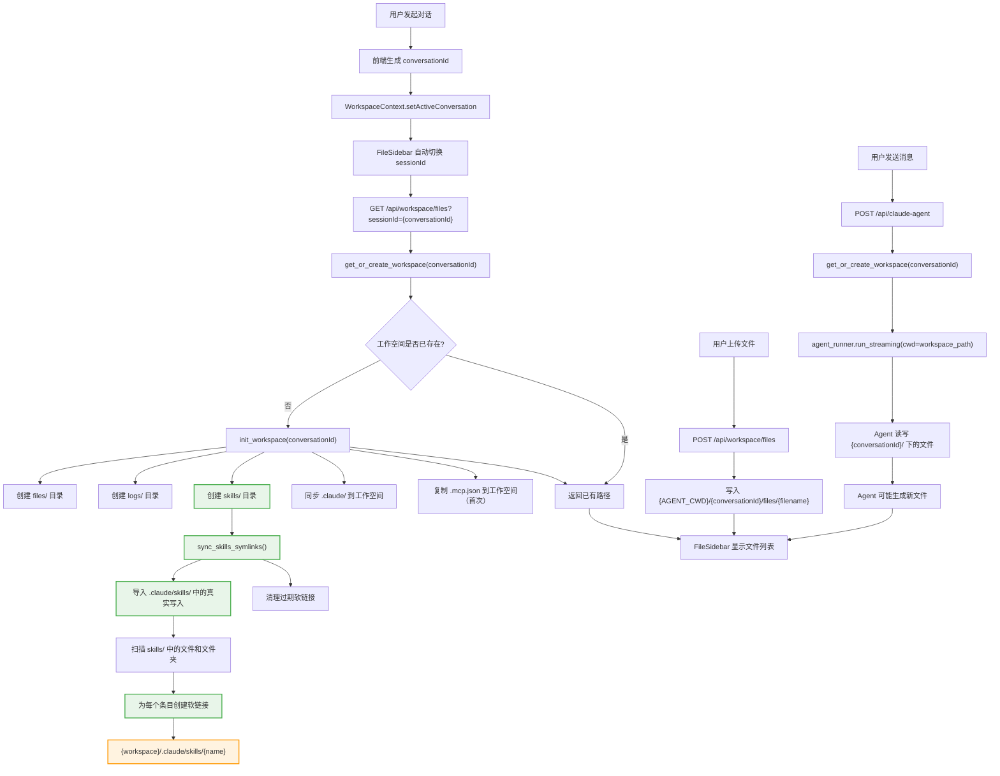
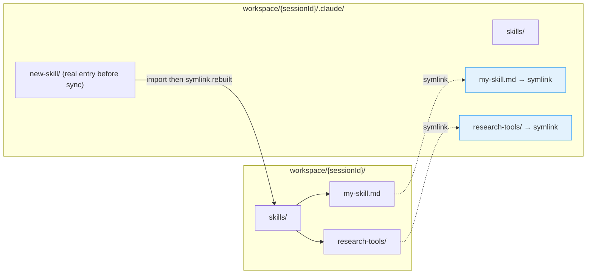
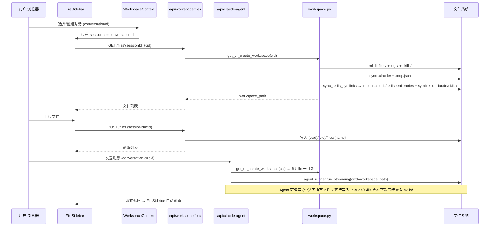
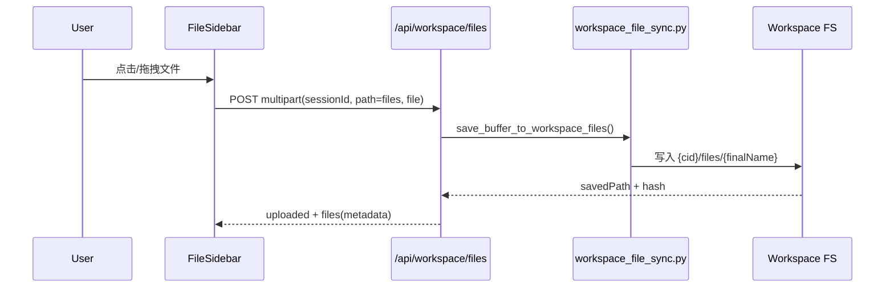

# 工作空间与 Skills 同步 — 全流程图

> **迁移来源**: `glide-the/claude-agent-next-kit → docs/design/workspace-skills-flow.md`
> **适配说明**: 从 Next.js / TypeScript 迁移到 Python / FastAPI 架构。
> **[Sync] 2026-06-16**: 同步入口会先导入 `.claude/skills/` 下真实文件/目录，
> 再重建从 `workspace/skills/` 到 `.claude/skills/` 的软链接。

## 概述

本文档描述了对话工作空间初始化、文件管理、Agent 执行以及 Skills 自动同步的完整数据流。

---

## 核心流程图



---

## Skills 同步机制详情



### 为什么用软链接？

Claude SDK 被调用时设置 `cwd = workspace_path`，因此 Claude 从
`{workspace_path}/.claude/skills/` 读取 skills。

我们让用户/Agent 在更直观的 `{workspace}/skills/` 目录操作，然后自动软链接到
`{workspace}/.claude/skills/` 供 Claude 发现。若 Agent 直接在 Claude Code
canonical 目录 `{workspace}/.claude/skills/` 创建真实文件或目录，下一次同步会先把
该条目导入 `{workspace}/skills/`，再恢复为软链接。

**关键优势**：
1. 每个对话工作空间完全隔离，无命名冲突
2. 同时支持**文件和文件夹**软链接
3. 无需 sessionId 前缀 — 工作空间本身就是隔离边界
4. 每次同步自动清理失效的链接
5. 支持 Agent 直接写入 `.claude/skills/` 后回写到用户可见的 `skills/`

### 同步触发时机

| 时机 | 触发函数 | 说明 |
|------|----------|------|
| 工作空间初始化 | `init_workspace()` → `sync_skills_symlinks()` | 首次创建时自动同步 |
| 访问已有工作空间 | `get_or_create_workspace()` → `init_workspace()` → `sync_skills_symlinks()` | 每次访问重新同步 |
| 写入 skills/ | `write_workspace_file()` → `sync_skills_symlinks()` | 上传 skill 文件后自动同步 |
| 直接写入 `.claude/skills/` | 下一次 `get_or_create_workspace()` / `init_workspace()` → `sync_skills_symlinks()` | 文件列表刷新或下一轮 workspace 初始化时导入真实写入 |
| 删除 skills/ | `delete_workspace_file()` → `sync_skills_symlinks()` | 删除后清理链接 |
| 移动涉及 skills/ | `move_workspace_file()` → `sync_skills_symlinks()` | 移动后更新链接 |

---

## 数据通道总览



---

## 环境变量

| 变量 | 默认值 | 说明 |
|------|--------|------|
| `AGENT_CWD` | `{tmpdir}/ink-agent-workspaces` | 工作空间根目录；生产环境建议设为持久化路径 |

```
AGENT_CWD=/data/workspaces (生产环境)
  └── {conversationId}/            ← Claude SDK cwd
      ├── .claude/                 ← 从项目根同步
      │   └── skills/              ← 软链接目标目录
      │       ├── my-skill.md      → symlink → skills/my-skill.md
      │       └── research-tools/  → symlink → skills/research-tools/
      ├── .mcp.json                ← 从项目根复制（首次）
      ├── files/                   ← 用户上传 + Agent 生成
      ├── logs/                    ← Agent 日志
      └── skills/                  ← 对话级 skills（用户操作此目录）
            ├── my-skill.md
            └── research-tools/    ← 支持文件夹
                └── web-search.md
```

---

## 上传与工作空间同步

### 保存路径规则

文件上传后通过 `POST /api/workspace/files`（`path=files`），文件落盘到：

`{AGENT_CWD}/{conversationId}/files/{finalName}`

规则如下：

- 始终写入工作空间 `files/` 目录
- 文件名会做安全清洗（去除路径分隔符、控制字符等）
- 同名冲突自动重命名（如 `report-1.pdf`、`report-2.pdf`）
- 路径安全校验，禁止路径穿越
- 上传限制：最大 `50MB`，并校验允许的 MIME 类型

### 错误处理

文件同步失败时，接口返回统一错误结构：

```json
{
  "error": "File MIME type is not allowed: application/x-msdownload",
  "code": "MIME_TYPE_NOT_ALLOWED",
  "details": {
    "mimeType": "application/x-msdownload"
  }
}
```

常见错误码（`WorkspaceFileSyncErrorCode`）：

- `INVALID_ATTACHMENT`
- `INVALID_WORKSPACE_PATH`
- `FILE_TOO_LARGE`
- `MIME_TYPE_NOT_ALLOWED`
- `DOWNLOAD_FAILED`
- `WRITE_FAILED`
- `INTERNAL_ERROR`

### 上传时序图


