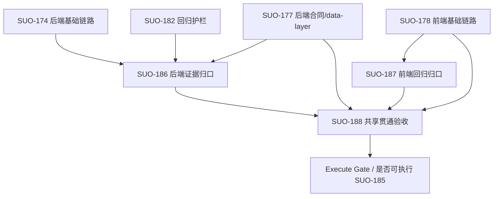

# SUO-189 Notion 资源连接器 E2E 验收阶段计划（Execute 准入版）

本阶段为 `docs/stage/stage_notion-resource-connector.md` 中 `S5（验收与回归）` 的增量执行准入补充，主要服务 `SUO-189` 和其上游 `SUO-185` / `SUO-172` 的执行收口。

## 关联设计稿
- `docs/design/notion-session/overview.md`
- `docs/design/notion-session/connector-interaction.md`
- `docs/design/notion-session/resource-connector-er.md`
- `docs/design/claude-agent/notion-point/resource-connector-layer-design.md`
- `docs/design/claude-agent/notion-point/interaction-snapshot-lifecycle.md`
- `docs/design/claude-agent/edit-point/workspace-context.md`
- `docs/design/claude-agent/edit-point/workspace-switch.md`
- `docs/stage/stage_notion-resource-connector.md`
- `docs/prd/notion-session/resource-connector.md`
- `docs/prd/notion-session/resource-connector-ui-design.md`

## 任务输入来源说明
- 该计划输入自 `docs/issue/ISSUES_notion-session-e2e.md`，用于补齐 `SUO-185` 的验收链条。
- 任务拆分输入为 `docs/task/task_186_backend_notion-resource-connector-e2e-evidence.md`、`docs/task/task_187_frontend_notion-resource-connector-e2e-regression.md`、`docs/task/task_188_backend_notion-snapshot-attach-read-chat-context-e2e.md`。
- 共享底座约束输入来自 `docs/issue/ISSUES_notion-session.md` 与实现设计；在本阶段仅做阶段接口收口，不改造实现。

## 阶段任务表
| 阶段 | 任务 | 产出 | 依赖 | 风险 |
| --- | --- | --- | --- | --- |
| S1 | **后端 E2E 证据归口（SUO-186）**：将 `create/auth/discovery/select/sync/snapshot` 路径的 contract 与测试串成同一条可复用证据主线。 | 后端 E2E 证据索引、命令清单、snapshot identity 校验记录 | `SUO-174`、`SUO-177`、`SUO-182` | Mock 边界掩盖真实线上差异、snapshot 版本语义不一致 |
| S2 | **前端链路回归归口（SUO-187）**：复核并固定 connector 入口到认证、选择、来源刷新的前端可达闭环与响应式可达性。 | 前端回归证据包、阻塞项与兼容风险清单、必要最小修复记录 | `SUO-178` | UI 兼容性回归与 local fallback 掩盖后端形状漂移 |
| S3 | **跨层贯通与 `execute` 前置约束（SUO-188）**：收口 attach/read/prompt 三段链路一致性，形成统一执行条件。 | `.notion/*` 与 `snapshot identity` 一致性证据、`workspace_context` 统一输出合规报告、`execute` 准入门禁清单 | `SUO-186`、`SUO-187`、`SUO-177`、`SUO-178` | attach 时序错位、shared 任务主责不清、纯 chat 回退路径污染 |
| S4 | **Execute Readiness 与关闭条款（门禁聚合）**：发布前汇总 3 条issue收口结果，给 `SUO-185` 明确可推进/blocked 状态。 | `execute_gate`（可推进或 blocked）记录、缺口分配、复测闭环与回退动作列表 | `S1`、`S2`、`S3` 完成 | `SUO-185` 依赖上游 issue 状态误判、外部 live smoke 环境未明确声明 |

## 当前进度
| 阶段 | 任务 | 状态 |
| --- | --- | --- |
| S1 | 后端 E2E 证据归口（SUO-186） | 完成 |
| S2 | 前端链路回归归口（SUO-187） | 完成 |
| S3 | 跨层贯通与 execute 前置约束（SUO-188） | 完成 |
| S4 | Execute Readiness 与关闭条款聚合 | 完成（`ready`） |

## S5 子任务 Execute Readiness 检查
| Issue | 是否有明确允许修改范围 | 是否有明确禁止修改范围 | 验收条件可直接用于 execute | 验证方式是否明确 | 当前可执行性 | 缺失项 | 建议 Owner |
|---|---|---|---|---|---|---|---|
| SUO-186 | 是：基于现有 route-flow、snapshot contract 与 attach 流程证据链补齐。 | 是：不新增后端能力，不改前端、不做写回、Deck 或多平台扩展。 | 是：`connector_id/snapshot_identity` 一致性与 mock-backed 边界可直接复核。 | 是：`test_notion_connector_router_flow`、`test_notion_snapshot_contract`、`test_claude_agent_service` 等定向命令已定义。 | 是（可执行） | 无新增缺口；如需真实 Notion smoke，需单独声明 owner。 | `BackendTaskAgent` |
| SUO-187 | 是：仅限制在 App 入口、认证轮询、资源选择、来源刷新与响应式可达性。 | 是：不改后端路由、Notion CLI、写回、Deck、Chat 工作流模型。 | 是：入口可达闭环与状态可见性可直接复核。 | 是：桌面/Narrow 视口 smoke 与 `resourceConnectorApi` fallback 兼容检查已明确。 | 是（可执行） | 若前端仓库未建立 tests 目录，需在任务内确认最小 smoke 产物归档。 | `FrontendTaskAgent` |
| SUO-188 | 是：限定在 attach/read/prompt 顺序、`snapshot` 一致性与纯 chat 回退。 | 是：不扩到新写入能力，不在 shared 中重写 chat 语义模型。 | 是：`.notion/*` 与 `snapshot_identity` 一致性、`workspace_context` 顺序可用于 execute 判定。 | 是：`test_claude_agent_service`、`test_claude_agent_context_builder`、`test_notion_store`、`test_notion_snapshot_contract` 已给出。 | 是：`exec_190` 与 `exec_191` 形成 S1/S2 闭环，`test_claude_agent_service`+`test_claude_agent_context_builder` 覆盖 shared 关键行为；当前链路不再强制要求 live Notion auth 可复现。 | `BackendTaskAgent`（主责）、`FrontendTaskAgent`（协作） |

## 阶段划分

### Stage 1：后端证据主线（可并行内聚）
- 并行任务（P）：
  - [P] 整理路由链路证据（`test_notion_auth`、`test_notion_connector_router_flow`）并抽出证据链。
  - [P] 校验 `notion_snapshot` / `store` / `sync` 合同测试的 identity 一致性。
  - [P] 形成 mock-backed 与本地 contract 的证据界定边界。
- 串行任务（S）：
  - [S] 若存在 snapshot attach / materialize 与路由返回不一致，先补齐最小回归断言。
- 准入条件：
  - `SUO-174`（后端主链路）与 `SUO-177`（snapshot/store 合同）已提交 baseline 文档。
  - `SUO-182` 阶段阻断（create response / 404）判定可作为已知边界。
- 阶段产出 checklist：
  - `backend` 证据链是否能从 connector 创建追踪到 `snapshotIdentity`。
  - 同一 `connector_id` 在 route、store、`.notion/` 与 `workspace_context` 中可互相映射。
  - 记录证据是否为 mock-backed，是否需要 live smoke 补充。

### Stage 2：前端回归闭环（可并行）
- 并行任务（P）：
  - [P] 按照 `App.tsx` 入口验证同一 connector 工作台可复现进入。
  - [P] 验证 create -> auth/login -> auth/poll -> list/select -> refresh 的路径闭环。
  - [P] 评估桌面与窄屏可达性（来源卡片、资源选择区不溢出）。
- 串行任务（S）：
  - [S] 统一 `local fallback` 与 backend response 的行为边界并记录兼容风险。
- 准入条件：
  - `SUO-178` 前端入口实现已落地，`frontend` 任务链对认证与资源选择可达。
  - UI 关键交互路径不引入新建模态流程。
- 阶段产出 checklist：
  - 前端链路回归证据条目齐全。
  - 记录 `[BLOCKED]` 环境项（仅当 live Notion smoke 缺失或无稳定 workspace 时）。
  - 给出不阻断主线的最小修复边界。

### Stage 3：跨层共享贯通（并行受限）
- 并行任务（P）：
  - [P] 验证 `assemble_context`→`build_user_message` 前的 snapshot materialize 顺序。
  - [P] 验证 `.notion/snapshot.json`、`.notion/connector.json`、`.notion/index.json`、`.notion/pages/*` 与 prompt identity 一致。
  - [P] 验证无 connector 场景的 chat 回退不会携带过期 `.notion` 上下文。
- 串行任务（S）：
  - [S] 形成 `execute` 期间的 shared 观察面：attach/read/prompt 一致性通过后才能触发发布门禁。
- 准入条件：
  - Stage 1 与 Stage 2 的验收证据已可引用。
  - `BackendTaskAgent` 为 shared 主责，并给出 `FrontendTaskAgent` 具体协作边界。
- 阶段产出 checklist：
  - `snapshot_version/source_revision/sync_cursor` 在 store、`.notion` 与 context 中一致。
  - 统一“snapshot-scoped miss”行为说明。
  - 出具进入下一段 chat 执行的证据门槛。

### Stage 4：Execute 准入聚合（Gate）
- 并行任务（P）：
  - [P] 汇总 S1~S3 的证据与缺口。
  - [P] 以表格化方式标记每条阻断项与负责人。
- 串行任务（S）：
  - [S] 仅当三类风险边界可解释后，输出 `execute_gate`：`ready` 或 `blocked`。
- 准入条件：
  - S1~S3 完成；`SUO-186/187/188` 的完成状态与阻塞项一致闭环。
  - `session_updated` / snapshot identity 等关键事件驱动边界无未处理冲突。
- 阶段产出 checklist：
  - `execute_gate` 结论写入 issue 备注。
  - 若 blocked：给出解除 owner 与优先级。
  - 若 ready：确认 `SUO-185` 进入下一阶段的最小复现证据。

## 关键路径
1. `SUO-174` / `SUO-177`（后端基线）→ `SUO-186`。
2. `SUO-178`（前端基线）→ `SUO-187`。
3. `SUO-186` + `SUO-187` + `SUO-177` + `SUO-178` → `SUO-188`。
4. `SUO-188` → `S4 Execute Gate`。

高阻塞点：
- `SUO-188` 依赖 `S1` 与 `S2`，两条证据链任一延迟都会阻断 `execute` 门禁。
- snapshot identity 不一致（`save_snapshot` 与 `.notion` 落盘字段不齐）是 shared 链路最易触发回归的瓶颈。

## 风险与缓冲策略
- 环境风控（高）：
  - 真实 Notion `ntn` / `api.notion.com` 依赖在外部环境时可能缺失。
  - 缓冲：把该部分标注为 `[BLOCKED]` 并保留本地 mock-contract 证据，不将其误判为链路完成。
- 一致性风险（高）：
  - snapshot identity 漏掉版本齐一字段将导致 `.notion/*` 与 prompt 不一致。
  - 缓冲：在 Stage 3 引入最小一致性 assert，优先修 contract，而非功能增量。
- Owner 风险（中）：
  - shared issue `SUO-188` 主责未固定会导致交接损耗。
  - 缓冲：Stage 3/S4 固化 `BackendTaskAgent` 为主责并在每条阻塞项附 owner。
- UI 风险（中）：
  - local fallback 与 backend response drift 可能误报成功。
  - 缓冲：所有前端证据需绑定 backend 实际 `connector id` 与 `source` 快照。

## Mermaid 依赖图

## 完成信号说明
- S1 完成：后端 evidence 能从 create 到 snapshot attach 形成一个可复用追踪链，并记录 mock/live 边界。
- S2 完成：前端链路从 connector 入口到资源刷新的最小闭环可复现，兼容风险已标注且不影响主链路。
- S3 完成：`snapshot_version` 在 store、`.notion/*` 与 `workspace_context` 中一致。
- S4 完成：`execute_gate` 已明确为 `ready`；若外部方要求全链路上线，需单独补齐 live Notion E2E；当前收口范围采用 contract + 本地回归证据。

## 执行门禁结论（本次收口）

- `execute_gate`：`ready`
- 证据源：
  - `docs/exec/exec_190_notion_resource_connector_backend_e2e_evidence.md`
  - `docs/exec/exec_191_frontend_resource_connector_e2e_regression.md`
  - `backend/tests/test_claude_agent_service.py`
  - `backend/tests/test_claude_agent_context_builder.py`
  - `backend/tests/test_notion_store.py`
  - `backend/tests/test_notion_snapshot_contract.py`
- 当前阻塞策略：
  - 不将 `live Notion auth` 列为本轮发布阻塞；该项标注为范围外（`local_or_contract_only`）。
  - 如需线上 `ntn/api.notion.com` 完整验收，由环境 owner 单独补充外部环境与 profile。

## SUO-172 收口与下游执行块
- 当前阶段产物更新后，`SUO-172` 的下一执行块进入 `in_progress` 的 execute gate 聚合后，可在父链路明确放行时进入 `done`。
- `SUO-172` 释放条件（父级 `done` 的上游闸道）：
  - `S1` 与 `S2` 的证据链完成并可追踪到同一 `connector_id/snapshot_identity`；
  - `S3` 产生 attach/read/prompt 一致性结论；
  - `S4` 输出 `execute_gate`：
    - `ready`：附带三条 issue 的执行边界清单与测试结论；本收口版本附有 `docs/exec/exec_190_notion_resource_connector_backend_e2e_evidence.md` 与 `docs/exec/exec_191_frontend_resource_connector_e2e_regression.md` ；
    - `blocked`：若后续切换为 live-only 验收，则附带阻断 owner 与解除动作（优先级 + 预计输出）。
