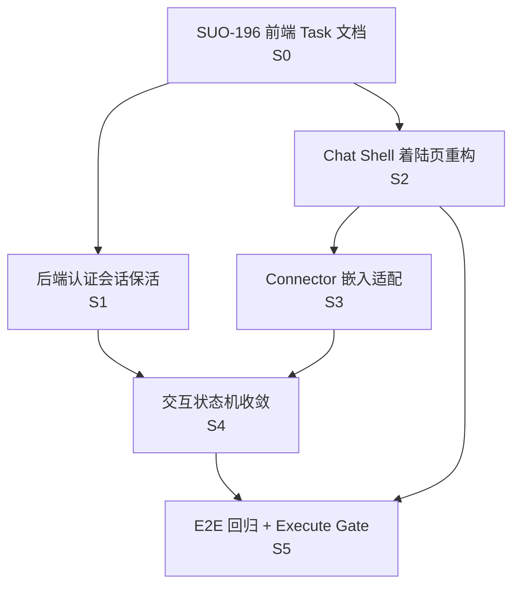

# SUO-197 Chat / Connector 交互重构 Stage 规划

Status: Draft
Updated: 2026-07-07
Scope: Stage 规划 — 基于 Chat 入口页的 Connector 交互重构阶段划分与执行就绪检查

> [Input] `docs/design/notion-session/overview.md` (2026-07-07),
>      `docs/design/notion-session/connector-interaction.md` (2026-07-07),
>      `docs/design/claude-agent/notion-point/resource-connector-flowcharts.md` (2026-07-07),
>      `docs/task/task_175_frontend_notion-resource-connector-create-auth-sources.md`,
>      `docs/task/task_178_frontend_notion-resource-connector-create-auth-resource-selection.md`,
>      `docs/task/task_181_frontend_notion-resource-connector-color-system-fix.md`,
>      `docs/task/task_192_frontend_notion-resource-connector-interaction-design.md`,
>      `docs/task/task_176_backend_notion-resource-connector-auth-discovery-snapshot.md`,
>      `docs/task/task_177_backend_notion-resource-connector-contract-data-layer.md`,
>      `docs/task/task_182_backend_notion-resource-connector-post-create-404-regression.md`,
>      `docs/task/task_186_backend_notion-resource-connector-e2e-evidence.md`,
>      `docs/task/task_187_frontend_notion-resource-connector-e2e-regression.md`,
>      `docs/task/task_188_backend_notion-snapshot-attach-read-chat-context-e2e.md`,
>      `docs/stage/stage_notion-resource-connector.md`,
>      `docs/stage/stage_notion-resource-connector-e2e.md`
> [Output] `docs/stage/stage_notion-resource-connector-interaction.md`
> [Pos] SUO-197 stage 规划输出

---

## 目录

1. [规划背景与变更范围](#1-规划背景与变更范围)
2. [阶段任务表](#2-阶段任务表)
3. [当前进度](#3-当前进度)
4. [阶段划分详解](#4-阶段划分详解)
5. [关键路径](#5-关键路径)
6. [风险与缓冲策略](#6-风险与缓冲策略)
7. [Mermaid 依赖图](#7-mermaid-依赖图)
8. [完成信号说明](#8-完成信号说明)
9. [Execute Readiness 检查](#9-execute-readiness-检查)

---

## 1. 规划背景与变更范围

### 1.1 本次重构核心变更

设计稿 `connector-interaction.md`（2026-07-07 更新）将连接器交互入口从独立页面改为 **Chat 入口页内置**，具体变更：

| 变更项 | 旧设计 | 新设计 |
|--------|--------|--------|
| 连接器入口 | 独立页面 / 侧栏导航项 | Chat 入口页下方 `连接器` landing tab |
| 页面结构 | 独立 `ResourceConnectorPage` | 嵌入 Chat shell 的 connector 工作台 |
| 快捷功能 | 无 | 输入框下方 `QuickActionStrip`（生成图片 / 撰写或编辑 / 查找资料） |
| Chat 启动 | 从连接器页面发起 | 同一 Chat shell 内切换 `历史对话` / `连接器` tabs |
| 错误降级 | 连接器页面级错误 | `shell_error` 态，保留 tab / connector 入口可恢复 |
| 认证会话保持 | poll 重复 pending 导致状态回退 | 持久化 `auth_session`，幂等 poll 返回 `consumed` → 保持 `authenticated` |

### 1.2 影响范围

- **前端**：`App.tsx` 视图状态重构、Chat shell 新增 landing tabs、QuickActionStrip、shell_error 降级、`ResourceConnectorPage` 改为嵌入模式
- **后端**：认证会话保活（`auth_session` 表/状态字段）、poll 幂等性修正
- **不涉及**：`.notion/` 快照数据层、Agent 运行时接线、后端 sync 逻辑

### 1.3 与已有 Stage 规划的关系

| 文档 | 覆盖内容 | 本次规划定位 |
|------|----------|--------------|
| `stage_notion-resource-connector.md` (SUO-176) | 连接器全生命周期（创建→认证→同步→Agent 消费） | 基础能力底座，本次规划的上游 |
| `stage_notion-resource-connector-e2e.md` (SUO-189) | E2E 验收与 execute 准入 | 本次规划的下游验收参考 |
| **本规划** (SUO-197) | **Chat 入口页交互重构** | 前端 shell 层变更 + 后端认证会话保活 |

---

## 2. 阶段任务表

| 阶段 | 任务 | 产出 | 依赖 | 风险 |
|------|------|------|------|------|
| **S0** | **前端 Task 文档编写（SUO-196）**：覆盖 Chat shell 重构、landing tabs、QuickActionStrip、shell_error、connector 嵌入 | 前端 task 文档 `task_196_*.md` | 设计稿 `connector-interaction.md` 已更新 | Task 范围膨胀、与现有 `ResourceConnectorPage` 职责边界不清 |
| **S1** | **后端认证会话保活（SUO-196 后端子任务）**：新增 `auth_session` 状态字段/表、`/auth/poll` 幂等修正（consumed 状态处理）、前端 `connector.auth_status` + `config.auth_session` 双源判定 | 后端 API 行为变更、单元测试 | S0 完成 | `ntn` CLI 会话消费语义变化、前端轮询逻辑需同步适配 |
| **S2** | **Chat Shell 着陆页重构（SUO-196 前端子任务）**：`App.tsx` 视图状态改为 `history` / `connector` landing tabs、ChatView 下方 QuickActionStrip、shell_error 降级态、connector 工作台嵌入 Chat shell | Chat 入口页新结构、组件集 | S0 完成，S1 可并行启动 | 现有 ChatView 布局破坏、响应式适配回归、shell_error 恢复路径复杂 |
| **S3** | **Connector 嵌入适配（SUO-196 前端子任务）**：`ResourceConnectorPage` 改为嵌入模式（去除独立页面壳）、connector 状态映射到 landing tab 内的子视图、来源列表在嵌入模式下的展示 | 嵌入版 connector 组件、状态桥接层 | S2 完成 | 现有 connector 组件与 Chat shell 耦合度高于预期、状态传递链路长 |
| **S4** | **交互状态机收敛（SUO-192 补充）**：按 `task_192` 状态机对齐 poll consumed/expired/failed 的 UI 收敛、`shell_error` 与 connector 状态的交叉处理、快照 stale/missing 恢复动作 | 交互状态机验收文档、前端实现 | S1 + S3 完成 | 状态机交叉场景多（shell_error + connector_unavailable + stale 同时出现） |
| **S5** | **E2E 回归与 Execute 准入（SUO-189 补充）**：Chat shell 重构后的端到端回归（landing tabs 切换、QuickActionStrip、shell_error 恢复、connector 嵌入工作流）、execute gate 重新评估 | 回归测试套件、execute_gate 结论 | S2 + S3 + S4 完成 | 多层 shell 嵌套导致选择器脆弱、agent-browser 自动化适配成本 |

---

## 3. 当前进度

| 阶段 | 任务 | 状态 |
|------|------|------|
| S0 | 前端 Task 文档编写（SUO-196） | **阻塞**（SUO-196 未完成） |
| S1 | 后端认证会话保活 | **未开始**（依赖 S0） |
| S2 | Chat Shell 着陆页重构 | **未开始**（依赖 S0） |
| S3 | Connector 嵌入适配 | **未开始**（依赖 S2） |
| S4 | 交互状态机收敛 | **未开始**（依赖 S1 + S3） |
| S5 | E2E 回归与 Execute 准入 | **未开始**（依赖 S2 + S3 + S4） |

---

## 4. 阶段划分详解

### Stage 0：前端 Task 文档编写（S0）

本阶段是整条链路的前置阻塞点。SUO-196 需要产出覆盖以下范围的前端 task 文档：

**并行子任务（S0 内部）：**

| 子任务 | 内容 | 产出 |
|--------|------|------|
| [P] S0a | Chat shell 着陆页 task 文档：`App.tsx` 视图状态、`ChatView` landing tabs、QuickActionStrip | `task_196a_frontend_chat-shell-landing-tabs.md` |
| [P] S0b | Connector 嵌入适配 task 文档：`ResourceConnectorPage` 嵌入模式改造 | `task_196b_frontend_connector-embedded-mode.md` |
| [P] S0c | Connector auth/session 状态映射 task 文档：`connector.auth_status` + `auth_session` | `task_196c_frontend_connector-auth-session-state-mapping.md` |
| [P] S0d | Chat / connector browser E2E task 文档：Chrome 验收、截图、console/network 证据 | `task_196d_frontend_chat-connector-agent-browser-e2e.md` |

**串行任务（S0 内收口）：**

| 子任务 | 内容 |
|--------|------|
| [S] S0e | 整合 S0a~S0d 为 SUO-196 的统一交付物，对齐 `connector-interaction.md` 设计稿 |

**准入条件：**
- 设计稿 `connector-interaction.md` 已更新到 2026-07-07 版本（✅ 已满足）
- `task_192` 交互状态机已定义（✅ 已满足）

**阶段产出 checklist：**
- [ ] SUO-196 前端 task 文档已提交
- [ ] Chat / connector auth/session / browser E2E 子任务文档已提交
- [ ] 所有 task 文档的文件路径与设计稿一致
- [ ] 响应式（桌面/移动端）约束已在 task 文档中明确

---

### Stage 1：后端认证会话保活（S1）

**并行任务（P）：**

| 任务 | 内容 |
|------|------|
| [P] S1a | 数据层：`auth_session` 状态管理（`auth_session_id`、`auth_session_status`、`auth_session_expires_at` 等字段）— 新增 DB 迁移或字段扩展 |
| [P] S1b | API 层：`/auth/poll` 幂等修正 — 已 authenticated 直接返回 `authenticated`；已 consumed 保持 `authenticated`（不回退到 pending） |
| [P] S1c | 前端适配：`resourceConnectorApi.ts` 的 poll 结果解析改为 `connector.auth_status` + `config.auth_session` 双源判定 |

**串行任务（S）：**

| 任务 | 内容 |
|------|------|
| [S] S1d | 集成测试：auth/login → poll(consumed) → 验证前端不回退到 pending |

**准入条件：**
- S0 完成（SUO-196 task 文档已提交）
- `backend/notion/auth.py` 现有认证流程可扩展

**阶段产出 checklist：**
- [ ] `auth_session` 状态持久化已落地
- [ ] `/auth/poll` 幂等修正已部署
- [ ] 前端 `resourceConnectorApi.ts` 已适配双源判定
- [ ] 单元测试覆盖 `consumed` / `expired` / `failed` 分支

---

### Stage 2：Chat Shell 着陆页重构（S2）

**并行任务（P）：**

| 任务 | 内容 |
|------|------|
| [P] S2a | `App.tsx`：新增 `landingTab: 'history' | 'connector'` 状态；Chat 入口页改为 landing tabs 结构 |
| [P] S2b | `ChatView.tsx` / `ChatViewContent.tsx`：下方新增 QuickActionStrip（生成图片 / 撰写或编辑 / 查找资料） |
| [P] S2c | `ChatView.tsx`：新增 `shell_error` 降级态 — 渲染失败时显示可恢复错误条，保留 tab/connector 入口 |
| [P] S2d | 连接器 landing tab：嵌入 `ResourceConnectorPage`（只读模式，不触发独立页面导航） |

**串行任务（S）：**

| 任务 | 内容 |
|------|------|
| [S] S2e | 响应式适配：桌面（侧栏+Chat 区）与移动端（垂直栈式 landing tabs）下的布局校验 |

**准入条件：**
- S0 完成（task 文档已提交）
- 现有 `App.tsx` Chat 路由结构已理解

**阶段产出 checklist：**
- [ ] Landing tabs（历史对话 / 连接器）可在 Chat 入口页切换
- [ ] QuickActionStrip 在输入框下方展示且可点击
- [ ] `shell_error` 态显示可恢复错误条 + `Reload shell` CTA
- [ ] Connector landing tab 嵌入工作台可渲染
- [ ] 桌面/移动端布局通过视觉 smoke

---

### Stage 3：Connector 嵌入适配（S3）

**并行任务（P）：**

| 任务 | 内容 |
|------|------|
| [P] S3a | `ResourceConnectorPage` 去除独立页面壳（Sidebar 入口、独立路由），改为 Chat shell 内的嵌入组件 |
| [P] S3b | Connector 状态桥接：landing tab 内的 connector 子视图状态（draft/authenticating/authenticated/syncing/synced/stale/error）与 `ResourceConnectorPage` 内部状态对齐 |
| [P] S3c | 来源列表嵌入适配：在 Chat shell 下方 tab 内展示来源卡片，不脱离 Chat 上下文 |

**串行任务（S）：**

| 任务 | 内容 |
|------|------|
| [S] S3d | Connector 嵌入模式与 Chat 历史对话 tab 的切换动画与状态保持 |

**准入条件：**
- S2 完成（Chat shell landing tabs 已就位）
- `ResourceConnectorPage.tsx` 现有结构已分析

**阶段产出 checklist：**
- [ ] `ResourceConnectorPage` 可通过 landing tab 嵌入（不依赖独立路由）
- [ ] Connector 状态在 landing tab 内可独立管理
- [ ] 来源列表在嵌入模式下展示正确
- [ ] 切换 `历史对话` / `连接器` tab 后 connector 状态不丢失

---

### Stage 4：交互状态机收敛（S4）

**并行任务（P）：**

| 任务 | 内容 |
|------|------|
| [P] S4a | 按 `task_192` 状态机：poll 返回 `consumed` → 前端保持 `authenticated`（S1 后端完成后前端收口） |
| [P] S4b | `shell_error` + connector 状态交叉处理：shell 错误时 connector 工作台仍显示最近状态（不强制回到 draft） |
| [P] S4c | 快照 `stale` + 来源 `missing` 恢复动作：在嵌入模式下展示 `Refresh snapshot` CTA |

**串行任务（S）：**

| 任务 | 内容 |
|------|------|
| [S] S4d | 交叉场景手工 smoke：shell_error + expired + stale 同时出现的恢复路径 |

**准入条件：**
- S1 完成（后端 auth_session 保活）
- S3 完成（connector 嵌入适配）

**阶段产出 checklist：**
- [ ] `auth/poll` consumed → 前端保持 authenticated（非 pending）
- [ ] `shell_error` 下 connector 状态可恢复
- [ ] `stale` + `missing` 恢复动作在嵌入模式下可用
- [ ] 状态机交叉场景手工 smoke 通过

---

### Stage 5：E2E 回归与 Execute 准入（S5）

**并行任务（P）：**

| 任务 | 内容 |
|------|------|
| [P] S5a | Chat shell 着陆页 E2E：landing tabs 切换、QuickActionStrip 点击、shell_error 恢复 |
| [P] S5b | Connector 嵌入 E2E：从 Chat 入口 → 连接器 tab → 创建 → 认证 → 选择 → 同步 → 回到 Chat |
| [P] S5c | 状态机 E2E：poll consumed/expired/failed、shell_error 恢复、stale 刷新 |
| [P] S5d | agent-browser 自动化适配：多层 shell 嵌套下的选择器更新 |

**串行任务（S）：**

| 任务 | 内容 |
|------|------|
| [S] S5e | Execute gate 重新评估：基于 S5a~S5d 结果输出 `ready` 或 `blocked` |

**准入条件：**
- S2 + S3 + S4 完成
- `stage_notion-resource-connector-e2e.md` 的 execute gate 框架可复用

**阶段产出 checklist：**
- [ ] Chat shell 着陆页 E2E 回归通过
- [ ] Connector 嵌入工作流 E2E 回归通过
- [ ] 状态机交叉场景 E2E 通过
- [ ] agent-browser 自动化脚本已更新
- [ ] Execute gate 结论：`ready` 或 `blocked`（附阻塞项与 owner）

---

## 5. 关键路径

```
S0 (SUO-196 前端 task 文档)
  │
  ├─→ S1 (后端认证会话保活) ──→ S4 (交互状态机收敛) ──→ S5 (E2E + Execute Gate)
  │
  └─→ S2 (Chat Shell 着陆页重构) ──→ S3 (Connector 嵌入适配) ──┘
```

**最长路径（关键路径）：**
`S0 → S2 → S3 → S4 → S5`（前端主链路，5 个串行阶段）

**次长路径：**
`S0 → S1 → S4 → S5`（后端认证 + 状态机收敛，4 个串行阶段）

**关键阻塞点：**
1. **S0 是全局阻塞点** — SUO-196 未完成，S1~S5 均无法启动
2. **S2 完成后才能启动 S3** — connector 嵌入依赖 Chat shell landing tabs 结构
3. **S1 和 S3 均完成后才能启动 S4** — 状态机收敛需要后端 auth_session + 前端嵌入双端就绪
4. **S2 + S3 + S4 均完成后才能启动 S5** — E2E 需要完整用户路径

---

## 6. 风险与缓冲策略

### 6.1 风险矩阵

| 风险 | 等级 | 影响 | 缓冲策略 |
|------|------|------|----------|
| **SUO-196 前端 task 文档未启动/延迟** | 🔴 高 | 整条链路阻塞 | 本规划先输出骨架，SUO-196 完成后立即对齐；S1 后端部分可基于设计稿先行 |
| **`ResourceConnectorPage` 与 Chat shell 耦合度高于预期** | 🟡 中 | S3 工作量膨胀 | Task 文档中明确「只做嵌入适配，不改 connector 内部状态机」；若耦合度过高，拆为 S3a（去壳）+ S3b（状态桥接）两个子阶段 |
| **`shell_error` 降级与 connector 状态交叉复杂** | 🟡 中 | S4 验收边界模糊 | 限定 `shell_error` 只影响 Chat shell 渲染，不重置 connector 认证/sync 状态；交叉场景用表格化状态矩阵收口 |
| **现有 ChatView 布局被 QuickActionStrip 破坏** | 🟡 中 | S2 回归 | 在 task 文档中明确 QuickActionStrip 是「输入框下方的二级动作带，不替代 connector 工作台」；视觉对照 `resource-connector-ui-design.md` |
| **Poll 幂等修正与 `ntn` CLI 会话语义冲突** | 🟡 中 | S1 后端实现卡住 | 先用本地状态机模拟 `consumed` 语义，不强制依赖 `ntn` CLI 行为；后端以 `connector.auth_status` 为权威，不以 poll 返回为唯一判定 |
| **多层 shell 嵌套导致 E2E 自动化脆弱** | 🟢 低 | S5 agent-browser 维护成本 | 优先手工 smoke 覆盖交叉场景；agent-browser 脚本只覆盖主链路（创建→认证→同步→Chat），不包含 `shell_error` 等边缘态 |

### 6.2 并行加速策略

| 阶段 | 可并行内容 | 加速收益 |
|------|------------|----------|
| S0 | S0a~S0d 四个 task 文档可并行编写 | 缩短 SUO-196 交付周期 ~60% |
| S1 | S1a（数据层）、S1b（API 层）、S1c（前端适配）可并行 | 后端认证会话保活 3 个层面同步推进 |
| S2 | S2a~S2d 可并行（不同组件/文件） | Chat shell 着陆页一次 PR 覆盖 |
| S3 | S3a（去壳）、S3b（状态桥接）、S3c（来源列表适配）可并行 | Connector 嵌入一次 PR 覆盖 |
| S4 | S4a~S4c 可并行 | 状态机收敛一次收口 |
| S5 | S5a~S5d 可并行 | E2E 回归分模块执行 |

---

## 7. Mermaid 依赖图



---

## 8. 完成信号说明

- **S0 完成**：SUO-196 前端 task 文档已提交，覆盖 Chat shell 着陆页、connector 嵌入适配、shell_error 降级、后端认证会话四个子任务。
- **S1 完成**：`/auth/poll` 幂等修正已部署，前端双源判定已适配，`ntn` CLI `consumed` 语义不再导致 UI 回退。
- **S2 完成**：Chat 入口页展示 landing tabs（历史对话 / 连接器），QuickActionStrip 在输入框下方可见，`shell_error` 降级态可恢复。
- **S3 完成**：`ResourceConnectorPage` 嵌入 Chat shell 的 connector tab，来源列表在嵌入模式下正常工作。
- **S4 完成**：poll `consumed`/`expired`/`failed` 收敛到可操作 UI，shell_error 与 connector 状态交叉处理明确。
- **S5 完成**：E2E 回归通过，execute gate 输出 `ready`（或 `blocked` 附解除 owner）。

---

## 9. Execute Readiness 检查

### 9.1 当前可执行性评估（2026-07-07）

| 阶段 | 可执行性 | 缺失项 | 建议行动 |
|------|----------|--------|----------|
| S0 | ❌ 不可执行 | SUO-196 未创建/未完成 | **优先启动 SUO-196**：基于 `connector-interaction.md` 2026-07-07 版本编写 task 文档 |
| S1 | ⚠️ 部分可执行 | 依赖 S0 task 文档明确 `auth_session` 字段设计 | 可先基于设计稿 `connector-interaction.md` §3.3 做原型设计 |
| S2 | ❌ 不可执行 | 依赖 S0 task 文档明确组件范围 | 等待 S0 完成 |
| S3 | ❌ 不可执行 | 依赖 S2 完成 | 等待 S2 完成 |
| S4 | ❌ 不可执行 | 依赖 S1 + S3 | 等待 S1 + S3 完成 |
| S5 | ❌ 不可执行 | 依赖 S2 + S3 + S4 | 等待上游完成 |

### 9.2 最小启动路径（解除 S0 阻塞前）

在 SUO-196 完成前，可先行推进：

1. **后端原型设计（S1 预热）**：
   - 基于 `connector-interaction.md` §3.3 认证会话保活设计，在 `backend/notion/auth.py` 中新增 `auth_session` 状态管理原型
   - 不与主分支合并，仅作为技术预研分支

2. **本 stage 规划文档（当前文件）**：
   - ✅ 已完成 — 可作为 SUO-196 的编排依据

3. **组件范围预分析**：
   - 分析 `App.tsx` 当前 Chat 入口结构，标注需要变更的精确行范围
   - 分析 `ResourceConnectorPage.tsx` 与 Chat shell 的耦合点

### 9.3 Execute Gate 预评估

当 S0~S4 全部完成后，S5 将执行以下 execute readiness 检查：

| 检查项 | 验证方式 | 通过标准 |
|---------|----------|----------|
| Landing tabs 可切换 | agent-browser / 手工 smoke | 点击 `历史对话` / `连接器` tab 后视图正确切换 |
| QuickActionStrip 可见 | 视觉核对 | 输入框下方显示三个快捷功能入口 |
| shell_error 可恢复 | 模拟 ChatViewContent 渲染失败 | 显示错误条 + `Reload shell` CTA，点击后恢复 |
| Connector 嵌入工作 | agent-browser | 从 Chat 入口 → 连接器 tab → 创建 → 认证 → 选择 → 同步 全程无独立页面导航 |
| Poll consumed 不回退 | 单元测试 + 手工 | poll 返回 `consumed` 后前端保持 `authenticated` |
| 状态机交叉场景 | 手工 smoke | `shell_error` + `stale` + `expired` 同时出现时有明确恢复路径 |

---

## 附录：与 SUO-196 的协作边界

- **本规划（SUO-197）**：只做 stage 编排，不编写 task 文档，不实现代码
- **SUO-196（前端 task 编写）**：负责产出 S0 的所有 task 文档，是整条链路的阻塞解除点
- **协作方式**：本规划先输出骨架 → SUO-196 完成后更新本规划的任务文件路径 → 后续 stage 按本规划执行

---

> 本文档是 SUO-197 的 stage 规划输出，基于 `connector-interaction.md` 2026-07-07 版本与设计稿 `resource-connector-flowcharts.md` 全流程图。
> 当前被 SUO-196 阻塞，阻塞解除后按 S0→S1/S2→S3→S4→S5 顺序执行。
