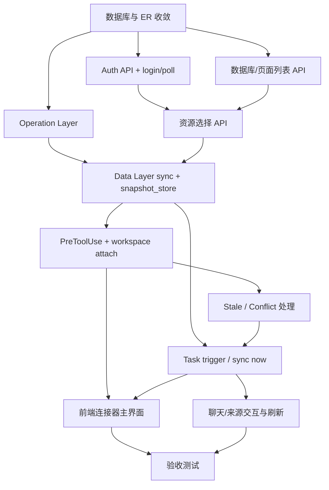

# SUO-176 Notion 资源连接器阶段计划

## 关联设计稿
- [notion-session/overview.md](/Users/dmeck/project/ink-and-memory/docs/design/notion-session/overview.md)
- [notion-session/connector-interaction.md](/Users/dmeck/project/ink-and-memory/docs/design/notion-session/connector-interaction.md)
- [notion-session/resource-connector-er.md](/Users/dmeck/project/ink-and-memory/docs/design/notion-session/resource-connector-er.md)
- [claude-agent/notion-point/resource-connector-layer-design.md](/Users/dmeck/project/ink-and-memory/docs/design/claude-agent/notion-point/resource-connector-layer-design.md)
- [claude-agent/notion-point/resource-connector-flowcharts.md](/Users/dmeck/project/ink-and-memory/docs/design/claude-agent/notion-point/resource-connector-flowcharts.md)
- [claude-agent/notion-point/interaction-snapshot-lifecycle.md](/Users/dmeck/project/ink-and-memory/docs/design/claude-agent/notion-point/interaction-snapshot-lifecycle.md)
- [claude-agent/edit-point/workspace-context.md](/Users/dmeck/project/ink-and-memory/docs/design/claude-agent/edit-point/workspace-context.md)
- [claude-agent/edit-point/workspace-switch.md](/Users/dmeck/project/ink-and-memory/docs/design/claude-agent/edit-point/workspace-switch.md)
- [prd/notion-session/resource-connector.md](/Users/dmeck/project/ink-and-memory/docs/prd/notion-session/resource-connector.md)
- [prd/notion-session/resource-connector-ui-design.md](/Users/dmeck/project/ink-and-memory/docs/prd/notion-session/resource-connector-ui-design.md)

## 任务输入来源说明
本轮输入以设计/PRD 为主。未在仓库中发现 `docs/task/` 目录；本次计划按现有来源的任务边界补齐，前端/后端任务分解建议如下。输出同时吸收了 `interaction-snapshot-lifecycle.md` 的生命周期约束（`snapshot_ready`/`stale`/`conflict`）作为执行门禁。

## 阶段任务表
| 阶段 | 任务 | 产出 | 依赖 | 风险 |
| --- | --- | --- | --- | --- |
| S0 | **数据库与基础约束收口**：按 ER 落实 `resource_connectors`、`connector_resources`、`connector_resource_pages`、`connector_chat_threads` 表约束（含索引/唯一键/级联）；确认现有 chat_thread 复用策略。 | 迁移脚本 + 数据模型文档 + 回滚策略 | 设计稿 `resource-connector-er.md` | 并发表结构变更影响现有 workspace 统计与权限边界 |
| S1 | **Notion 连接器后端主链路（Auth Layer）**：`POST /api/connectors`、`POST /api/connectors/:id/auth/login`、`POST /api/connectors/:id/auth/poll`；实现 NOTION_HOME 管理与会话状态机（pending/authenticated/expired）。 | 连接器创建与认证 API 可用；`auth_status` 可驱动前端状态 | S0；`backend/notion/auth.py` 接口与 CLI 健康策略 | `ntn` 二进制不可用、CLI 输出格式变化、认证超时与并发 poll 冲突 |
| S1 | **Notion 资源发现接口（并行）**：`GET /api/connectors/:id/databases`、`GET /api/connectors/:id/pages`，实现 Notion 资源枚举与分页、错误分类与限流策略。 | 可选择资源列表 API 正常返回；与认证态绑定 | S1（Auth） | Notion API scope 不一致导致列表缺失，需清晰提示与重试 |
| S2 | **资源选择与连接器持久化（并行）**：`POST /api/connectors/:id/resources/select` 持久化 selected resources；`GET/DELETE /api/connectors/:id/resources` 实现来源管理；补齐文件/Deck 输入兼容结构位。 | 连接器下资源清单可增删改查，供同步与来源 Tab 读取 | S1，S0 | 多端重复选择导致幂等冲突；跨资源类型字段不一致 |
| S2 | **同步与快照层（Data Layer）**：实现 `backend/notion/sync.py` + `backend/notion/snapshot_store.py`；支持 `sync_full`、`sync_incremental`（可先全量）并产出 canonical snapshot；实现 snapshot version/sourceRevision/syncCursor。 | `get_current_snapshot` 可返回可读快照；`.notion` 视图映射可定位 | S1、S2、设计层 ops 依赖 | 同步耗时过高、单 connector 页面膨胀、历史快照清理策略遗漏 |
| S2 | **运行时操作层（Operation Layer）**：封装 `ntn api search/databases query/get/page`，统一超时重试与结果映射（可覆盖到同步层与前端资源列表）。 | API 操作契约可复用；同步流程具备单点可替换性 | S1 | `ntn api` 错误格式变化，导致筛选和分页逻辑失配 |
| S3 | **任务编排与可触发同步（Task Layer）**：实现 `POST /api/connectors/:id/sync`、任务状态查询与事件发布；建立创建后自动首轮 sync 与人工刷新流程。 | 连接器从创建到可读的可复现时序；`SNAPSHOT_MATERIALIZED` 通知就绪 | S2、S2 并行/含 `operation/data` | 队列并发冲突、同 connector 重复触发导致快照竞争 |
| S3 | **Workspace/Agent 接线（后端运行时）**：在 `workspace.init` 初始化 `.notion` 占位符；`service.attach_workspace_context` 注入 snapshot identity；`.notion/*` PreToolUse 读取走 `CanonicalWorkspaceSnapshot` 且返回缺页语义；`notion_snapshot` 合同复用。 | Agent 可在对话内稳定读取 `.notion/snapshot.json`、`.notion/index.json`、`.notion/pages/*` | S3（运行时）+ S3（快照层）；workspace-adapter 约束 | 不能直接调用远程 Notion；若 snapshot stale 则提示而非降级拉取 |
| S4 | **连接器主 UI（前端）**：连接器列表、空态/来源态、名称编辑、状态标签；对接 `connector` + `status` + 线程入口。 | 资源连接器空间可见、可创建、可编辑并承载聊天入口 | S1/S2/S3（API 形态稳定） | 多租户权限、未认证状态展示不一致 |
| S4 | **Notion 接入流（前端）**：`添加来源`、认证弹窗、验证码/打开浏览器流程、资源选择与提交、手动刷新；来源列表显示数据库/页面/文件/Deck。 | 一轮点击内完成 Notion 连接与资源挂载；可触发刷新 | S4（基础UI） + S1/S3（接口） | 认证等待态卡顿、轮询失败反馈不清晰 |
| S4 | **聊天与上下文联动（前端）**：连接器内“聊天/来源”切换、来源卡片状态映射、chat_thread 与连接器关系串联。 | 用户在连接器内可继续对话并看到当前快照身份 | S4（后端任务入口） + S3（snapshot attach） | `switch_editor` 与资源切换混淆导致状态错绑 |
| S5 | **验收与回归联动（并行）**：覆盖端到端契约测试（建连/认证/资源选择/同步/对话读取），补齐错误态与限流态测试、文档一致性核对。 | 可验证 Stage 交付的验收清单与回滚条件 | 所有阶段完成 | 测试依赖 Notion CLI 环境不稳定，需 Mock 与离线契约双轨 |

## 当前进度
| 阶段 | 任务 | 状态 |
| --- | --- | --- |
| S0 | 数据模型与数据库约束收口 | 未开始 |
| S1 | Auth & 资源发现 API | 未开始 |
| S2 | 同步与快照数据层 | 未开始 |
| S3 | Task 编排与 Agent 运行时接线 | 未开始 |
| S4 | 前端连接器体验与资源流 | 未开始 |
| S5 | 验收与回归 | 未开始 |

## 阶段划分与并行/串行策略
- S0 → S1 串行（无模型无 API）
- S1 与 S2 在不同服务层可并行启动，均依赖 S0；S2 完成 snapshot 后 S3 方可接线。
- S3 与 S4 可并行推进：前端依赖 API 契约稳定（`S1/S2/S3` 的接口形态冻结），通过 mock/stub 支持并发开发。
- S5 必须在 S1~S4 完成后收口。

- **Stage 1：连接器基座与模型**（S0）
  - 准入条件：ER 约束冻结、任务边界明确、迁移回滚方案就绪。
  - 产出：数据库约束落地、资源类型字典统一。

- **Stage 2：后端连接与同步底座**（S1+S2）
  - 准入条件：S0 完成，Notion CLI 运行路径与 sandbox allowlist 已确认。
  - 产出：连接器可创建、可认证、可选资源、可物化 canonical snapshot。

- **Stage 3：Agent 读取与任务编排**（S3）
  - 准入条件：S2 有可读快照，S1 资源选择已闭环。
  - 产出：`.notion/*` 读取基于快照，Chat 上下文可见快照身份。

- **Stage 4：前端连接器体验**（S4）
  - 准入条件：S1~S3 API 与状态码稳定。
  - 产出：连接器创建-认证-资源-刷新-聊天完整闭环。

- **Stage 5：验收与发布准备**（S5）
  - 准入条件：S1~S4 的接口与体验完成。
  - 产出：验收报告与回归清单、风险缓解记录。

## 最小任务拆分（BackendTaskAgent / FrontendTaskAgent）

- **Backend 关键链**
  1. `BackendTaskAgent-DB`: S0 数据模型收口 + 回滚计划（最先执行，阻塞所有后续）
  2. `BackendTaskAgent-AuthOps`: S1 Auth + 资源发现 API（依赖 S0）
  3. `BackendTaskAgent-Data`: S2 Data Layer/sync/snapshot（依赖 S1）
  4. `BackendTaskAgent-Run`: S3 任务编排 + Agent 接线（依赖 S2 + S3）

- **Frontend 关键链**
  1. `FrontendTaskAgent-ConnectorShell`: S4 主页面与 connector 资料面（依赖 S1 API Contract）
  2. `FrontendTaskAgent-NotionFlow`: S4 Notion 添加来源与 auth/poll 刷新链（依赖 S4 Shell + S1）
  3. `FrontendTaskAgent-ChatLink`: S4 聊天/来源联动与快照状态展示（依赖 S4 NotionFlow + S3）

- **并行阻塞顺序（最小可行）**
  - 先放行：S0 → S1.Auth → S1.Discovery 与 S2 并发启动
  - 关键阻塞：S2 完成前不能开始 `agent attach`，S3 完成前前端不能开放 `.notion` 会话态展示。
  - 可逆段：S1 与 S2 的接口/模型可先以 stub 兜底推进前端开发，但发布前必须回归真实调用。

## Execute Readiness Check（每阶段执行就绪检查）

- **S0 就绪**
  - migration 可执行、回滚脚本存在
  - `resource_connector*` 表索引/唯一键与现有 chat_thread 外键不冲突
- **S1 就绪**
  - `/api/connectors` 与 auth 三个入口返回一致状态机
  - `ntn` CLI 健康检查通过（可通过 stub/contract 模拟）
  - `auth_status` 与 `pending_auth`/`permission_denied` 的前端状态映射已确认
- **S2 就绪**
  - `sync_full` 返回 `snapshot_version/sourceRevision/syncCursor/fetched_at`
  - `snapshot_store` 支持同 `resource_connector_id` 的多次查询与回放
- **S3 就绪**
  - Agent attach 时 `snapshot.json/index.json/pages/*` 均来自同一版本
  - `snapshot-scoped miss` 在缺页时可观测，且不触发远程实时读取
- **S4 就绪**
  - 前端可复现 `not connected / pending_auth / snapshot_ready / stale / conflict / permission_denied`
  - 用户路径覆盖：创建连接器 → 认证 → 选择资源 → 触发 sync → 发起 chat
- **S5 就绪**
  - 端到端场景通过率与失败场景可验证脚本都达标
  - 回滚动作清单通过评审，文档与 PRD 对齐

## 回滚点与恢复策略

- **R0（架构回退）**：在 S0 阶段若索引/外键影响既有查询，保留单步迁移；回退时禁用连接器新表，仅保留原始 workspace 功能。
- **R1（连接器功能回退）**：若 S1/S2 块上线前发生认证/同步连锁故障，退回只读模式，保留创建与列表页，不触发 sync。
- **R2（运行时快照回退）**：若 S3 中 snapshot 一致性不稳定，降级到不读取 `.notion/` 的安全模式，但保留 `.notion` 占位符；恢复后重新执行首轮 `sync_full`。
- **R3（前端回退）**：若 S4 体验回归影响主聊天路径，可隐藏连接器入口（Feature Flag）并保持标准 workspace chat 直连。

## 关键路径
1. S0（数据模型）
2. S1（认证 + 资源发现）
3. S2（同步 + snapshot 持久化）
4. S3（Agent attach + PreToolUse 映射）
5. S4（前端触发流）

关键阻塞点：
- 认证态 `pending` 与 `expired` 的边界若定义不一致，后续资源选择/同步会反复失败。
- `get_current_snapshot` 未返回版本齐一结构时，`.notion/pages/*` 与 `.notion/connector.json` 的一致性断裂。

## 风险与缓冲策略
- **环境风险（高）**：`ntn` 二进制、`NOTION_HOME` 可见性、`api.notion.com` allowlist。缓冲：在 S0 前先打通本地 stub 与集成测试环境，减少联调失败时间。
- **一致性风险（高）**：snapshot 丢失或版本漂移导致 miss。缓冲：统一快照身份校验，返回 `snapshot-scoped miss` 并要求前端提供刷新入口。
- **用户体验风险（中）**：认证超时/轮询卡死。缓冲：超时后清晰展示 `expired` 与 `Reconnect`。
- **并发风险（中）**：同连接器重复 sync 与任务并发。缓冲：任务级互斥与状态幂等锁。

## Mermaid 依赖图

## 完成信号说明
- **Stage 0 完成**：连接器与资源表与索引创建完成，唯一键/级联约束通过迁移验证。
- **Stage 1 完成**：连接器可创建并通过 Notion 认证；可查询可访问数据库与页面。
- **Stage 2 完成**：选择资源后可完成首轮 sync，snapshot 产出并可被 `get_current_snapshot` 查询。
- **Stage 3 完成**：Agent `Read(.notion/...)` 在同一 `snapshot_version` 下返回一致数据；缺页返回快照级 `miss`。
- **Stage 4 完成**：前端可从新建连接器、认证、选择来源到发起对话，并展示同步状态。
- **Stage 5 完成**：关键链路端到端回归通过，错误态覆盖通过，且 PRD 核验项可追溯。
